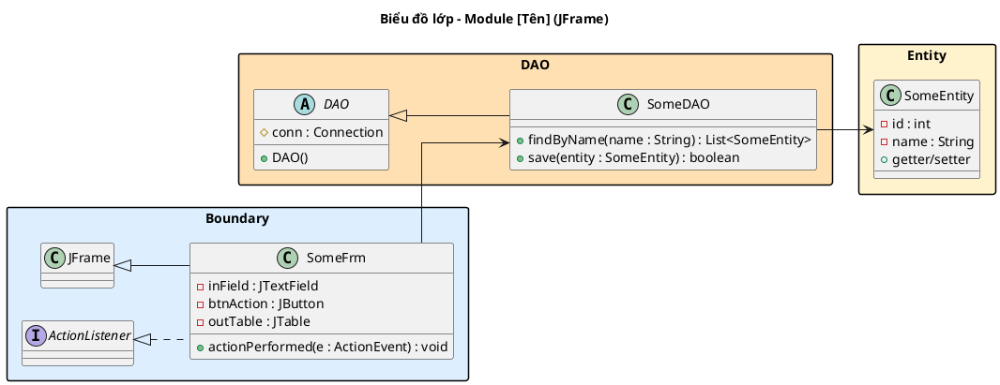
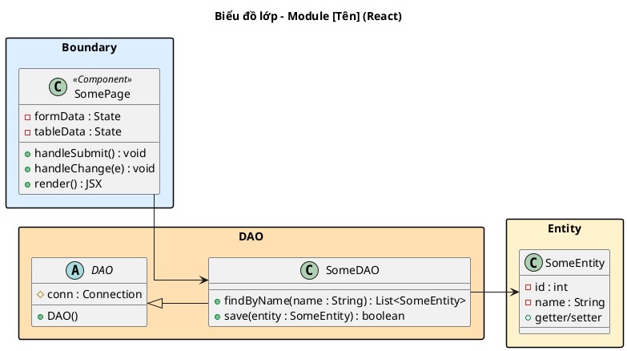

# UP Documentation Skill

Tạo tài liệu triển khai dự án phần mềm chuẩn **Unified Process (UP)** theo giáo trình
**Nhập môn Công nghệ Phần mềm**. 100% tiếng Việt. Biểu đồ UML dùng PlantUML.

---

## Nguyên tắc cốt lõi (BẮT BUỘC tuân thủ)

1. **Hướng Use-case:** Mọi phân tích, thiết kế đều xuất phát từ Use-case.
2. **BCE:** Luôn phân rã theo Boundary – Control – Entity.
3. **Phân biệt ngôn ngữ theo pha (NGHIÊM NGẶT):**
   - **Pha Phân tích:** Thông điệp sequence diagram = tiếng Việt tự nhiên (VD: `kiểm tra thông tin()`)
   - **Pha Thiết kế:** Thông điệp = tên hàm tiếng Anh đầy đủ (VD: `checkLogin(user: String): Boolean`)
4. **Văn bản:** 100% tiếng Việt (trừ tên hàm/biến ở pha Thiết kế).
5. **UML:** PlantUML trong code block plantuml.
6. **Công nghệ giao diện:** Hỏi người dùng chọn JFrame (Java Swing) hoặc HTML (React) ngay từ BƯỚC 0 PLAN. Toàn bộ Boundary classes, wireframe, và sequence diagram phải thống nhất theo lựa chọn này.

---

## Lựa chọn công nghệ giao diện

Ngay từ **BƯỚC 0 PLAN**, hỏi người dùng:

> **Bạn muốn thiết kế giao diện theo công nghệ nào?**
> 1. **JFrame (Java Swing)** — Desktop app, Boundary extends JFrame, dùng JButton/JTextField/JTable...
> 2. **HTML (React)** — Web app, Boundary là React component, dùng HTML form/input/table...

Lựa chọn này ảnh hưởng đến:
- **Mục 4 (Lớp BCE):** Tên và kiểu các thành phần giao diện
- **Mục 8 (Wireframe + Lớp TK):** Kiểu wireframe (ASCII desktop vs HTML layout) + class diagram chi tiết
- **Mục 9 (Tuần tự TK):** Cách bắt sự kiện (ActionListener vs onClick/handleSubmit)

---

## Luồng tổng thể

```
GIAI ĐOẠN 1 – Requirements TOÀN HỆ THỐNG
     → Bảng thuật ngữ
     → Mô hình nghiệp vụ bằng ngôn ngữ tự nhiên (2.1 → 2.6)
     → Mô hình nghiệp vụ bằng UML (3.1 → 3.3)
     ↓
GIAI ĐOẠN 2 – Đề xuất phân chia MODULE → chờ xác nhận
     ↓
GIAI ĐOẠN 3 – Với mỗi module (theo yêu cầu người dùng):
     Pha 1 – Requirements module:  [1] UC chi tiết  [2] Kịch bản
     Pha 2 – Analysis:             [3] Thực thể     [4] Lớp BCE   [5] Tuần tự PT
     Pha 3 – Design:               [6] Lớp TT TK   [7] ERD       [8] UI + Lớp TK   [9] Tuần tự TK
     Pha 4 – Test:                 [10] Test Plan + Test Case
```

---

## Hướng dẫn thực thi

### BƯỚC 0 – PLAN (BẮT BUỘC, luôn làm trước mọi thứ)

**Trước khi viết bất kỳ nội dung tài liệu nào**, phân tích yêu cầu của người dùng và sinh một **plan dưới dạng file `.md`** để user review và xác nhận.

Plan phải:
- **Xác định scope** dựa trên yêu cầu: toàn hệ thống, một module cụ thể, hay chỉ một vài mục.
- **Liệt kê từng mục sẽ viết** kèm thông tin quan trọng nhất đã suy luận được (không viết nội dung thật, chỉ tóm tắt những gì sẽ có).
- **Đặt câu hỏi làm rõ** nếu còn thiếu thông tin đầu vào quan trọng.

**Cấu trúc file plan:**

```markdown
# Plan tài liệu – [Tên hệ thống / Module / Phạm vi]

## Phạm vi
[Mô tả ngắn: viết toàn bộ / module X / chỉ mục Y, Z]

## Thông tin đầu vào đã có
- Tên hệ thống: ...
- Actor xác định được: ...
- Module / chức năng: ...
- Ngôn ngữ lập trình dự kiến (ảnh hưởng kiểu dữ liệu ở mục 6, 7): ...

## Câu hỏi cần làm rõ (nếu có)
- [ ] ...

## Danh sách mục sẽ viết

### [Tên giai đoạn / pha]
| Mục | Tên | Nội dung chính sẽ có |
|-----|-----|----------------------|
| 1 | Biểu đồ UC chi tiết | Actor: [A, B]; UC chính: [X]; UC con include: [a, b]; UC extend: [c] |
| 2 | Kịch bản chuẩn | UC [X]: [N] bước, ngoại lệ tại bước [3, 10, 24] |
| 3 | Thực thể phân tích | Lớp dự kiến: [A, B, C, D]; quan hệ n-n: [A–B] |
| 4 | Lớp BCE | Boundary: [Frm1, Frm2]; Entity: [A, B, C] |
| 5 | Tuần tự PT | [N] biểu đồ cho [N] UC |
| 6 | Lớp thực thể TK | Bổ sung kiểu dữ liệu Java; PK/FK; composition/aggregation |
| 7 | ERD | [N] bảng; bảng trung gian: [...] |
| 8 | Wireframe + Lớp TK | [N] màn hình; DAO cho: [A, B, C] |
| 9 | Tuần tự TK | [N] biểu đồ |
| 10 | Test Case | [N] TC; CSDL mẫu: [N] bảng |
```

Sau khi sinh plan, **chờ user xác nhận hoặc điều chỉnh** trước khi viết bất kỳ nội dung thật nào. Nếu user chỉ muốn làm một vài mục, chỉ giữ lại những mục đó trong plan rồi xác nhận lại.

---

### Giai đoạn 1 – Requirements toàn hệ thống
Đọc `references/requirements-system.md` và thực hiện đầy đủ.

Sau khi hoàn thành, **BẮT BUỘC** sinh đề xuất phân module theo mẫu:

```
Dựa trên các use-case đã xác định, mình đề xuất chia hệ thống thành [N] module:

| STT | Tên module | Phụ trách Use-case | Mô tả ngắn |
|-----|-----------|-------------------|------------|
| 1   | [Tên]     | UC01, UC02, ...   | ...        |
| 2   | [Tên]     | UC03, UC04, ...   | ...        |

Bạn có đồng ý với cách phân chia này không? Hay muốn điều chỉnh?
```

Chỉ tiếp tục khi người dùng xác nhận.

### Giai đoạn 3 – Triển khai từng module
Hỏi người dùng muốn bắt đầu với module nào.
Đọc `references/module-phases.md` và thực hiện đúng các mục đã được xác nhận trong plan.
Sau mỗi pha, hỏi: *"Pha [X] đã hoàn thành. Bạn có muốn điều chỉnh gì không trước khi sang pha tiếp theo?"*

---

## Định dạng đầu ra chung

- Tiêu đề mỗi mục: `## [Số]. [Tên mục] – Module: [Tên module]`
- Bảng Markdown chuẩn, có header rõ ràng.
- PlantUML đặt trong code block plantuml.
- Wireframe dùng ASCII box diagram (xem ví dụ trong `references/module-phases.md`).

### Quy tắc Columns (BẮT BUỘC cho Notion output)

<callout icon="🔑" color="purple">
**Nguyên tắc cứng:** Tối đa 4 columns. Nếu BẤT KỲ bước nào chứa bảng (markdown table hoặc HTML table), tối đa chỉ được 2 columns.
</callout>

| Tình huống | Số cột | Cách nhóm |
|------------|--------|-----------|
| Quy trình 2–3 bước, không có bảng | 2–3 cột | Mỗi bước 1 cột |
| Quy trình 4 bước, không có bảng | 4 cột (nếu ngắn) hoặc 2 cột (2 bước/cột) | Nhóm từng đôi |
| Quy trình 4–5 bước, CÓ BẢNG | **2 cột** | Nhóm bước lại, mỗi cột 2–3 bước |
| Quy trình 5+ bước | **2 cột** | Bắt buộc nhóm, không quá 4 |

### Quy tắc Callout Pairs (BẮT BUỘC)

Khi có 2 callout liên quan (VD: "Mục tiêu" + "Đầu vào"), LUÔN đặt trong 2 columns với heading tiêu đề:

```html
<columns>
<column>

### Mục tiêu
<callout icon="🎯" color="blue">
Nội dung mục tiêu...
</callout>

</column>
<column>

### Đầu vào
<callout icon="📝" color="gray">
Nội dung đầu vào...
</callout>

</column>
</columns>
```

---

## PlantUML Style Rules (BẮT BUỘC)

### Tổng quan layout

Mọi biểu đồ UML **PHẢI** tuân thủ style sau:

```plantuml
@startuml
left to right direction
skinparam linetype ortho
skinparam packageStyle rectangle
@enduml
```

- **`left to right direction`** — layout ngang từ trái sang phải
- **`skinparam linetype ortho`** — đường thẳng gấp khúc, KHÔNG cong
- **`skinparam packageStyle rectangle`** — package dạng hình chữ nhật

### Biểu đồ lớp (Class Diagram)

**Quy tắc chung:**
- Lớp xếp theo chiều ngang, chia rõ 3 zone: Boundary | DAO | Entity
- Đường nối thẳng, gấp khúc (`linetype ortho`)
- Package dọc theo chiều ngang (trái → phải)

**Boundary classes — Theo lựa chọn công nghệ:**

**Option A: JFrame (Java Swing)**

| Field type | Kiểu | Ví dụ |
|------------|------|-------|
| Frame | `JFrame` extends... | Giao diện chính |
| Button | `JButton` | Nút bấm |
| TextField | `JTextField` | Ô nhập text |
| PasswordField | `JPasswordField` | Ô nhập mật khẩu |
| Table | `JTable` | Bảng hiển thị |
| ComboBox | `JComboBox` | Dropdown chọn |
| Label | `JLabel` | Nhãn hiển thị |

- Mỗi Boundary class implements `ActionListener`
- Method: `actionPerformed(e: ActionEvent): void`

**Option B: HTML (React)**

| Field type | Kiểu | Ví dụ |
|------------|------|-------|
| Page | `Component` (React) | Giao diện chính |
| Button | `<button>` / `onClick` | Nút bấm |
| Input | `<input type="text">` | Ô nhập text |
| Password | `<input type="password">` | Ô nhập mật khẩu |
| Table | `<table>` / map array | Bảng hiển thị |
| Select | `<select>` / dropdown | Dropdown chọn |
| Label | `<label>` / `<span>` | Nhãn hiển thị |

- Mỗi Boundary class là React functional component
- Event handler: `handleSubmit`, `onClick`, `onChange` (không cần interface)

**DAO classes:**
- Abstract class `DAO` có `#conn: Connection` + `+DAO()`
- Mỗi entity có class DAO kế thừa `DAO`
- Methods rõ ràng tên tiếng Anh + tham số kiểu

**Entity classes:**
- Thuộc tính private với kiểu Java cụ thể
- `+getter/setter` (không cần hiện chi tiết)

### Ví dụ template — JFrame (Java Swing)



### Ví dụ template — HTML (React)



### Biểu đồ Tuần tự (Sequence Diagram)

- Participants xếp theo thứ tự: Actor → Boundary → [Control] → DAO → Entity
- Thông điệp đánh số liên tục
- Dùng `alt` cho ngoại lệ
- Phân tích: tiếng Việt · Thiết kế: tên hàm tiếng Anh

### Biểu đồ UC (Use Case)

- `left to right direction`
- Actors bên trái, use cases bên phải trong package
- `<<include>>` và `<<extend>>` dùng mũi tên đứt nét
