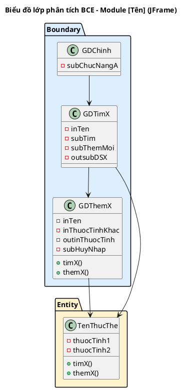
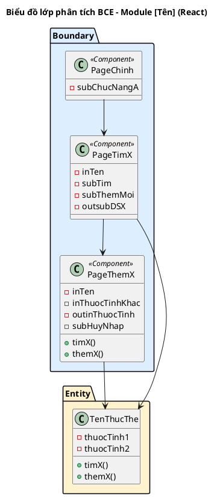

<!-- Pha II – Analysis, Section 3 -->

## II.3. Sơ đồ lớp phân tích

**Quy trình 4 bước (BẮT BUỘC trình bày):**

- **Bước 1:** Mỗi giao diện chính trong module (trừ thông báo, hộp thoại xác nhận) → đề xuất thành 1 **lớp Boundary** (đặt tên dạng GD[TênMànHình]).
- **Bước 2:** Xem xét các thành phần trong mỗi giao diện, đặt tên với tiền tố loại:
  - `in`: thành phần nhập liệu (ô nhập văn bản, ngày tháng...)
  - `out`: thành phần hiển thị (bảng, nội dung...)
  - `sub`: thành phần gửi dữ liệu (nút bấm, liên kết...)
  - Kết hợp: `outsub` = bảng có thể nhấn chọn; `inout` = ô vừa hiển thị vừa sửa
- **Bước 3:** Với mỗi chức năng cần thực hiện dưới lớp giao diện, trả lời 4 câu hỏi:
  1. **Tên phương thức?** — đặt theo quy ước mã nguồn
  2. **Tham số đầu vào?**
  3. **Tham số đầu ra?**
  4. **Gán cho lớp nào?**
     - Nếu đầu ra là một lớp thực thể → gán cho lớp đó
     - Nếu không, xét đầu vào: nếu chỉ gồm 1 lớp thực thể → gán cho lớp đó
     - Nếu đầu vào gồm nhiều lớp thực thể → gán cho lớp nào có thể chứa tất cả tham số
- **Bước 4:** Xây dựng sơ đồ lớp BCE cho module.

Với mỗi lớp Boundary, trình bày:
```
[Số]. Giao diện [tên] → lớp [GDTênLớp]
Phương thức: [tênHàm()]   ← tên tiếng Việt, ngôn ngữ tự nhiên
Input: [liệt kê]
Output: [liệt kê]
Lớp chủ thể: [TênEntityLớpLiênQuan]
```

**Lưu ý:** Ở pha phân tích, tên phương thức vẫn dùng tiếng Việt (VD: `timKH()`, `luuHopDong()`).

**Variant JFrame:**



**Variant React:**


