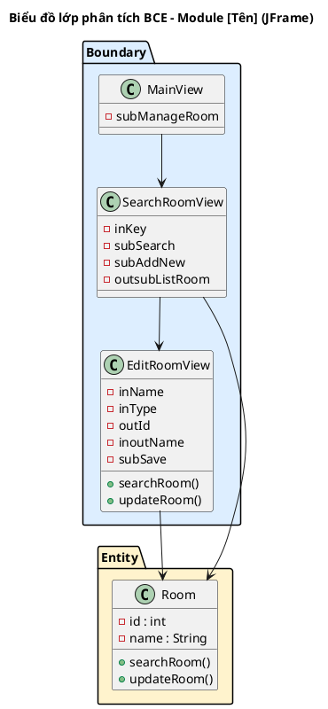
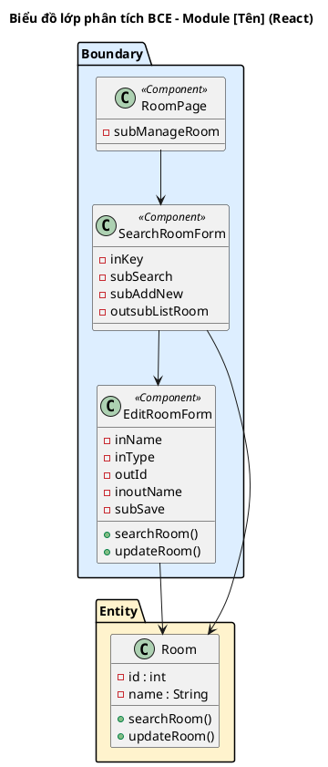

<!-- Pha II – Analysis, Section 3 -->

## II.3. Sơ đồ lớp phân tích

**Quy trình 4 bước (BẮT BUỘC trình bày):**

- **Bước 1:** Mỗi giao diện chính trong module → đề xuất thành 1 **lớp Boundary**.
  - **JFrame:** đặt tên tiếng Anh theo chức năng màn hình (VD: `SearchRoomView`, `EditRoomView`, `LoginView`).
  - **React:** đặt tên theo hậu tố loại component (xem bảng quy ước dưới). Ngoài ra, các thành phần con quan trọng (Modal, Form, Panel...) cũng có thể là lớp Boundary riêng nếu có tương tác phức tạp.
  - **Loại trừ:** Thông báo đơn giản (`alert`), hộp thoại xác nhận (`confirm`) không cần tách riêng.

  **Quy ước đặt tên Boundary class — React:**

  | Hậu tố | Loại component | Khi nào dùng | Ví dụ |
  |--------|---------------|---------------|-------|
  | `Page` | Trang gắn URL/Router | Màn hình hoàn chỉnh, điều hướng chính | `RoomPage`, `OrderPage`, `DashboardPage` |
  | `Card` | Ô thông tin nhỏ | Hiển thị trạng thái nhanh trong danh sách | `RoomCard`, `ProductCard`, `BookingCard` |
  | `Panel` | Vùng nội dung lớn | Gom nhóm thông tin liên quan trên trang | `SessionDetailPanel`, `ServiceSummaryPanel` |
  | `Modal` | Hộp thoại bật lên | Tương tác đè lên trang khi nhấn nút | `ExtendTimeModal`, `DamageReportModal` |
  | `Form` | Vùng nhập liệu | Chứa input để điền dữ liệu | `OrderForm`, `ImportStockForm`, `AddClientForm` |
  | `Table` | Bảng dữ liệu | Hiển thị danh sách dạng bảng | `RoomListTable`, `OrderHistoryTable` |

  **Lưu ý:** Tên class React dùng tiếng Anh (không phải tiếng Việt). Thuộc tính bên trong vẫn dùng tiền tố `in/out/sub/outsub/inout` + tiếng Việt.

- **Bước 2:** Xem xét các thành phần cần thiết trong mỗi giao diện, đặt tên thành phần với tiền tố tương ứng loại:

  | Tiền tố | Ý nghĩa | Ví dụ |
  |---------|---------|-------|
  | `in` | Thành phần nhập liệu — ô nhập văn bản, ô nhập ngày tháng... | `inKey`, `inCheckin`, `inUsername` |
  | `out` | Thành phần hiển thị — bảng, nội dung... | `outId`, `outBooking` |
  | `sub` | Thành phần gửi dữ liệu — nút bấm, liên kết... | `subSearch`, `subSave`, `subConfirm` |
  | `outsub` | Kết hợp: hiển thị + có thể nhấn chọn | `outsubListRoom`, `outsubListClient` |
  | `inout` | Kết hợp: vừa hiển thị vừa sửa được | `inoutName`, `inoutType` |

- **Bước 3:** Với mỗi chức năng cần thực hiện dưới lớp giao diện, trả lời 4 câu hỏi:

  1. **Tên phù hợp của phương thức là gì?** — đặt tên theo quy ước mã nguồn (VD: `searchRoom`, `updateRoom`, `addBooking`)
  2. **Các tham số đầu vào là gì?**
  3. **Tham số đầu ra là gì?**
  4. **Phương thức nên được gán vào lớp nào?** — Xem xét theo nguyên tắc:
     - Nếu **đầu ra** là một loại lớp thực thể → gán phương thức cho lớp thực thể đó
     - Nếu không phải, xét **đầu vào**: nếu chỉ gồm 1 lớp thực thể → gán cho lớp thực thể đó
     - Nếu đầu vào gồm nhiều loại lớp thực thể → xem trong số đó lớp thực thể nào có thể chứa tất cả tham số đầu vào → gán phương thức cho lớp đó

- **Bước 4:** Xây dựng sơ đồ lớp BCE cho module.

Với mỗi lớp Boundary, trình bày:
```
[Số]. Giao diện [tên] → lớp [TênLớpBoundary]
Phương thức: [methodName()]   ← tên tiếng Anh
Input: [liệt kê các thành phần in/outsub]
Output: [liệt kê các thành phần out]
Lớp chủ thể: [TênEntityLớpLiênQuan]
```

**Lưu ý:** Ở pha phân tích, tên class và phương thức dùng tiếng Anh (VD: `searchRoom()`, `updateRoom()`, `addBooking()`). Thuộc tính bên trong vẫn dùng tiền tố `in/out/sub/outsub/inout` + tiếng Việt (VD: `inKey`, `subSearch`, `outsubListRoom`).

**Variant JFrame:**



**Variant React:**


