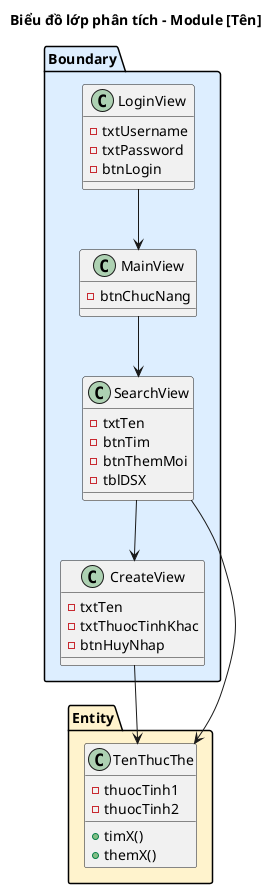

<!-- Pha II – Analysis, Section 3 -->

## II.3. Sơ đồ lớp phân tích

### Diễn giải narrative (BẮT BUỘC cho mỗi chức năng)

Mô tả luồng hoạt động từng bước, đề xuất lớp và phương thức ngay trong mô tả:

```
Phân tích chi tiết chức năng [Tên chức năng]:
[Hành động 1] -> [phản hồi hệ thống] -> đề xuất lớp [TênView], có [thành phần UI].
[Hành động 2] -> [phản hồi hệ thống] -> cần chức năng [tênMethod()] của đối tượng [Entity].
[Hành động 3] -> [phản hồi hệ thống] -> đề xuất lớp [TênView2], có [thành phần UI].
...
Hoàn tất, hệ thống [kết quả].
```

**Quy tắc:**
- Mỗi bước là 1 câu, dùng `->` nối các hành động/phản hồi
- Khi xuất hiện giao diện mới → `đề xuất lớp [TênView], có [mô tả UI]`
- Khi cần logic nghiệp vụ → `cần chức năng [method()] của đối tượng [Entity]`
- Tên class hậu tố `View` (LoginView, SearchRoomView, CreateOrderView...)
<<<<<<< Updated upstream
- Tên method tiếng Anh đơn giản, không tham số (checkLogin, searchProduct, addOrder...)
=======
- **Tên method PHẢI tiếng Anh (BẮT BUỘC):** MỌI phương thức/hàm trong MỌI pha PHẢI dùng tiếng Anh đơn giản, không tham số (checkLogin, searchProduct, addOrder, updateQuantity...). KHÔNG dùng tên tiếng Việt.
>>>>>>> Stashed changes

**Ví dụ (module Quản lý kho):**
```
Phân tích chi tiết chức năng Quản lý kho:
Vào hệ thống -> giao diện login hiện lên -> đề xuất lớp LoginView, có 2 ô nhập username, password và nút Login.
Nhập username/password -> hệ thống kiểm tra thông tin đăng nhập -> cần chức năng checkLogin() của đối tượng Employee.
Login thành công, hệ thống hiện giao diện chính của Quản lý -> đề xuất lớp ManagerHomeView, có nút chọn vào "Quản lý kho".
Click vào nút Quản lý kho, giao diện hiển thị danh sách các sản phẩm trong kho -> đề xuất lớp WarehouseManageView, có nút nhập hàng.
Click vào nút nhập hàng, giao diện hiển thị danh sách các nhà cung cấp -> đề xuất lớp SearchProviderView, có ô tìm kiếm và nút tạo phiếu nhập.
Nhập tên nhà cung cấp, hệ thống tìm kiếm thông tin tương ứng -> cần chức năng searchProvider() của đối tượng Provider.
Sau khi ấn nút tạo phiếu nhập -> đề xuất lớp ImportReceiptView, có ô tìm kiếm sản phẩm, danh sách chi tiết nhập, tổng tiền và nút xác nhận.
Lớp ImportReceiptView cần tìm sản phẩm -> cần chức năng searchProduct() của đối tượng Product.
Sau khi ấn nút xác nhận, hệ thống lưu vào CSDL và tự động cập nhật số lượng sản phẩm -> cần chức năng addImportReceipt() của đối tượng Import_receipt và updateQuantity() của đối tượng Product.
Hoàn tất, hệ thống hiển thị thông báo "Thành công" và quay về giao diện chính ManagerHomeView.
```

### Quy tắc bổ sung

- **Boundary (View):** Mỗi giao diện chính → 1 lớp View. Tên tiếng Anh + hậu tố `View`.
- **Entity:** Đối tượng xử lý → 1 lớp Entity. Tên PascalCase tiếng Anh.
- **Loại trừ:** Thông báo đơn giản (`alert`), hộp thoại xác nhận (`confirm`) không cần tách riêng.
- **Phương thức:** Gán cho Entity nào mà phương thức đó thao tác trực tiếp (VD: `checkLogin()` → Employee, `searchProduct()` → Product).

### Sơ đồ lớp phân tích


```plantuml
@startuml
title Biểu đồ lớp phân tích – Module [Tên]

package "Boundary" #DDEEFF {
  class LoginView {
    -txtUsername
    -txtPassword
    -btnLogin
  }
  class MainView {
    -btnChucNang
  }
  class SearchView {
    -txtTen
    -btnTim
    -btnThemMoi
    -tblDSX
  }
  class CreateView {
    -txtTen
    -txtThuocTinhKhac
    -btnHuyNhap
  }
}

package "Entity" #FFF3CD {
  class TenThucThe {
    -thuocTinh1
    -thuocTinh2
    +timX()
    +themX()
  }
}

LoginView --> MainView
MainView --> SearchView
SearchView --> CreateView
SearchView --> TenThucThe
CreateView --> TenThucThe
@enduml
```
