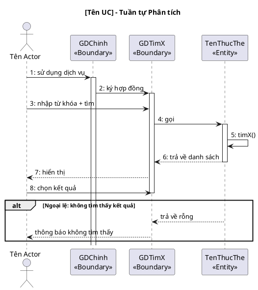

<!-- Pha II – Analysis, Section 4 -->

## II.4. Biểu đồ tuần tự phân tích

Vẽ **đầy đủ cho MỌI UC** trong module — không bỏ sót UC nào. Mỗi UC một biểu đồ riêng.
Luồng chuẩn: `Actor → Boundary → [Control] → Entity`.
Thông điệp **PHẢI bằng tiếng Việt tự nhiên**, đánh số thứ tự liên tục trong mỗi biểu đồ.
Phải thể hiện cả nhánh `alt` cho các kịch bản ngoại lệ đã viết ở II.1.

