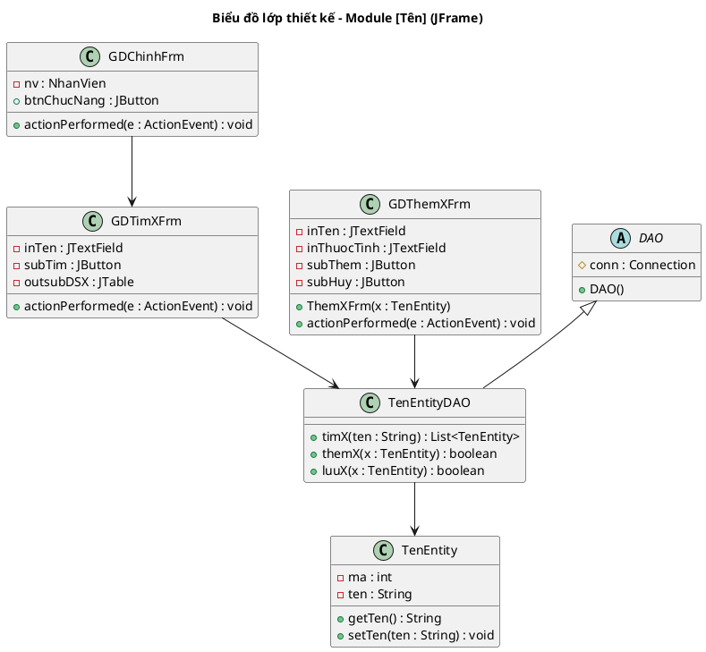
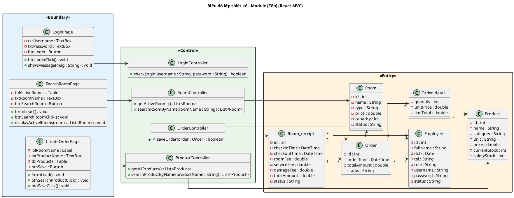

<!-- Pha III – Design, Section 3.2 -->

## III.3.2. Sơ đồ lớp thiết kế

### Kiến trúc React MVC (BẮT BUỘC áp dụng cho React + Spring Boot)

3 tầng: **Boundary** (React) → **Control** (Spring Boot) → **Entity** (JPA)

**Tầng Boundary — React Components:**
- Hậu tố `Page`: trang chính (LoginPage, SearchRoomPage, MenuPage)
- Thuộc tính: `-txtTên : TextBox`, `-btnTên : Button`, `-tblTên : Table`, `-lblTên : Label`
- Phương thức: `+formLoad()`, `+btnTênClick()`, `+displayDữLiệu(data : List<Entity>)`, `+showMessage(msg : String)`

**Tầng Control — Spring Boot Controllers:**
- Hậu tố `Controller`: LoginController, RoomController, OrderController, ProductController
- Phương thức theo CRUD: `+getAll()`, `+getById(id)`, `+search(keyword)`, `+save(entity)`, `+update(entity)`, `+delete(id)`

**Tầng Entity — JPA Entities:**
- Attributes private (`-`) với kiểu Java cụ thể
- Relationships: `ManyToOne`, `OneToMany`, bảng trung gian cho n-n

**Package colors:**
- Boundary: `<<Boundary>>` `#E3F2FD`
- Control: `<<Control>>` `#E8F5E9`
- Entity: `<<Entity>>` `#FFF3E0`

### Quy trình xác định chữ ký hàm (BẮT BUỘC trình bày reasoning):

Với mỗi phương thức trong Control, trình bày:
```
[Tên chức năng] => [tênHàmTiếngAnh()]
- Input: [liệt kê]
- Output: [liệt kê]
- Ứng viên tham số vào:
  [tênHàm](param1: KiểuDữLiệu, param2: KiểuDữLiệu)  → loại vì không hướng đối tượng
  [tênHàm](obj: TênLớp)                               → chọn (hướng đối tượng)
- Ứng viên tham số ra:
  [tênHàm](): void
  [tênHàm](): boolean                                  → chọn (cần biết thành công/thất bại)
  [tênHàm](): List<TênLớp>                             → chọn (trả về danh sách)
```

### Variant JFrame (giữ nguyên cho dự án JFrame)



### Variant React MVC

**Ví dụ: Module Dịch vụ & Sản phẩm** (tham khảo Google Docs section 3.2)

**a) Chức năng Tạo order**

Boundary classes:
| Lớp | Thuộc tính | Phương thức |
|-----|-----------|------------|
| LoginPage | -txtUsername: TextBox, -txtPassword: TextBox, -btnLogin: Button | +btnLoginClick(), +showMessage(msg) |
| StaffHomePage | -btnManageOrder: Button | +btnManageOrderClick() |
| SearchRoomPage | -tblActiveRooms: Table, -txtRoomName: TextBox, -btnSearchRoom: Button, -btnCreateOrder: Button | +formLoad(), +btnSearchRoomClick(), +displayActiveRooms(rooms), +tblEmptyRoomsClick(selectedRow) |
| CreateOrderPage | -lblRoomName: Label, -txtProductName: TextBox, -btnSearchProduct: Button, -tblProducts: Table, -btnSave: Button | +formLoad(), +btnSearchProductClick(), +btnSaveClick() |
| ConfirmOrderPage | -lblMessage: Label, -btnConfirm: Button | +btnConfirmClick() |

Control methods:
| Lớp | Phương thức | Chức năng |
|-----|------------|----------|
| LoginController | +checkLogin(username, password) | Kiểm tra đăng nhập |
| RoomController | +getActiveRooms() : List\<Room\> | Lấy danh sách phòng đang hoạt động |
| RoomController | +searchRoomByName(roomName) : List\<Room\> | Tìm phòng theo tên |
| ProductController | +getAllProducts() : List\<Product\> | Lấy toàn bộ sản phẩm |
| ProductController | +searchProductByName(productName) : List\<Product\> | Tìm sản phẩm theo tên |
| OrderController | +saveOrder(order : Order) : boolean | Lưu order vào CSDL |

Entity: Employee, Room, Order, Order_detail, Product, Room_receipt.

**b) Chức năng Báo cáo tình trạng hàng hóa**

Boundary classes:
| Lớp | Thuộc tính | Phương thức |
|-----|-----------|------------|
| SearchRoomPage | -txtRoomName: TextBox, -btnSearchRoom: Button, -tblPendingRooms: Table, -btnCreateDamageReport: Button | +formLoad(), +btnSearchRoomClick(), +tblPendingRoomsClick(roomId), +btnCreateDamageReportClick(), +displayPendingRooms(rooms), +showMessage(msg) |
| DamageReportPage | -lblRoomName: Label, -txtFacilityName: TextBox, -btnSearchFacility: Button, -tblFacilities: Table, -btnSave: Button | +formLoad(), +btnSearchFacilityClick(), +btnSaveClick() |
| ConfirmReportPage | -lblMessage: Label, -btnConfirm: Button | +btnConfirmClick() |

Control methods:
| Lớp | Phương thức | Chức năng |
|-----|------------|----------|
| RoomController | +searchPendingRoom(keyword) : List\<Room\> | Tìm phòng chờ dọn |
| FacilityController | +searchFacility(keyword) : List\<Facility\> | Tìm cơ sở vật chất |
| DamageReportController | +saveDamageReport(report : DamageReport) : boolean | Lưu báo cáo hỏng |
| DamageReportController | +updateReceipt(receiptId, totalFine) : boolean | Cập nhật phí phát sinh vào hóa đơn |

Entity: Employee, Facility, Damage_report, Room, Damage_detail, Room_receipt.

**c) Chức năng Quản lý menu**

Boundary classes:
| Lớp | Thuộc tính | Phương thức |
|-----|-----------|------------|
| ManagerHomePage | -btnManageMenu: Button | +btnManageMenuClick() |
| MenuPage | -txtProductName: TextBox, -btnSearchProduct: Button, -tblProducts: Table, -btnAdd: Button, -btnEdit: Button, -btnDelete: Button | +formLoad(), +btnSearchClick(), +tblProductsClick(productId), +btnAddClick(), +btnEditClick(), +btnDeleteClick() |
| EditMenuPage | -txtName: TextBox, -txtPrice: TextBox, -txtStock: TextBox, -btnSave: Button | +formLoad(productId), +btnSaveClick() |

Control methods:
| Lớp | Phương thức | Chức năng |
|-----|------------|----------|
| ProductController | +getAllProducts() : List\<Product\> | Lấy toàn bộ sản phẩm |
| ProductController | +searchProduct(keyword) : List\<Product\> | Tìm theo tên/danh mục |
| ProductController | +getProductById(id) : Product | Lấy chi tiết sản phẩm |
| ProductController | +updateProduct(product) : boolean | Cập nhật sản phẩm |
| ProductController | +addProduct(product) : boolean | Thêm sản phẩm |
| ProductController | +deleteProduct(id) : boolean | Xóa sản phẩm |

Entity: Employee, Product.

### PlantUML template — React MVC


