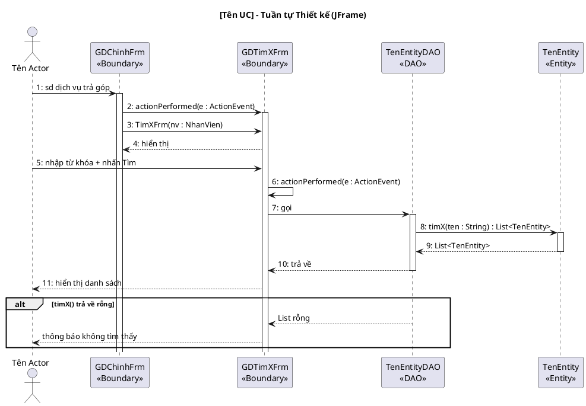
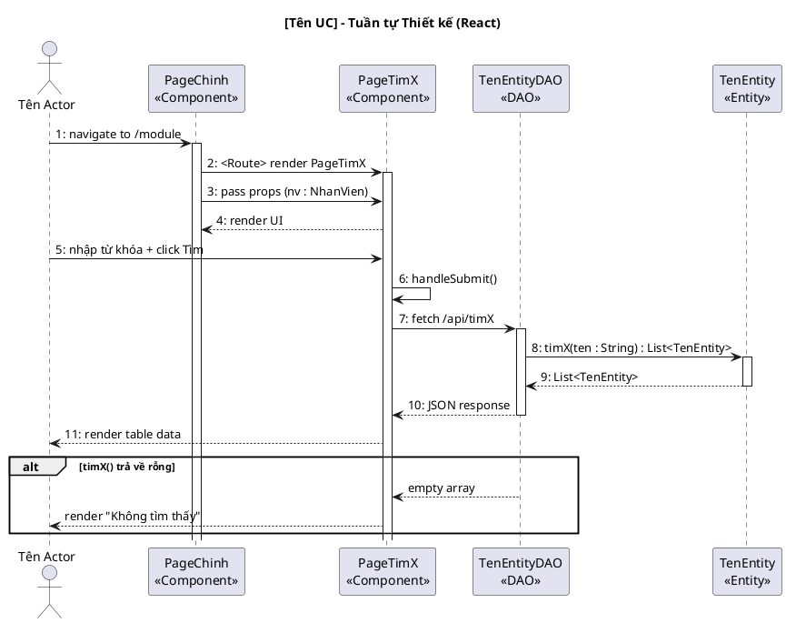

<!-- Pha III – Design, Section 4 -->

## III.4. Biểu đồ tuần tự thiết kế

**Input:** Biểu đồ tuần tự phân tích (II.4) + Sơ đồ lớp thiết kế (III.3.2).

Nâng cấp từ II.4:
- Thêm lớp DAO vào luồng (giữa Boundary và Entity).
- Thay **toàn bộ** thông điệp tiếng Việt thành **tên hàm tiếng Anh chính xác** (khớp với chữ ký đã định nghĩa ở III.3.2).
- Bắt sự kiện giao diện:
  - **JFrame:** `actionPerformed(e: ActionEvent)`
  - **React:** `handleSubmit()`, `onClick()`
- Đánh số thứ tự liên tục.

**Variant JFrame:**

**Variant React:**

