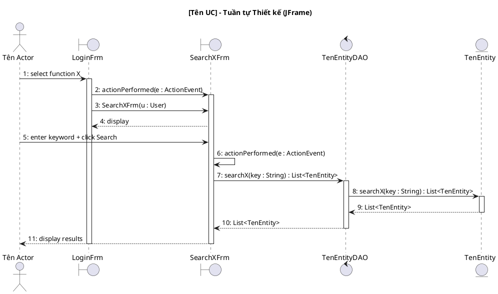
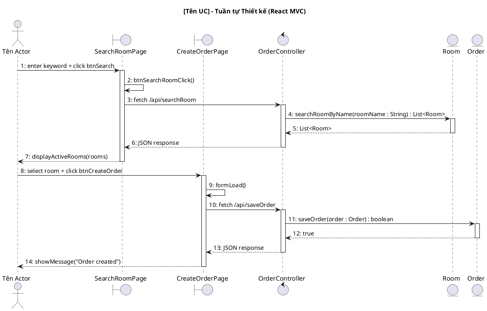

<!-- Pha III – Design, Section 4 -->

## III.4. Biểu đồ tuần tự thiết kế

**Input:** Biểu đồ tuần tự phân tích (II.4) + Sơ đồ lớp thiết kế (III.3.2).

Nâng cấp từ II.4:
- Thêm lớp **Controller** vào luồng (giữa Boundary và Entity) — KHÔNG dùng DAO.
- Thay **toàn bộ** thông điệp tiếng Việt thành **tên hàm tiếng Anh chính xác** (khớp với chữ ký đã định nghĩa ở III.3.2).
- Bắt sự kiện giao diện:
  - **JFrame:** `actionPerformed(e: ActionEvent)`
  - **React:** `btnTênClick()`, `formLoad()`, `showMessage()`
- Đánh số thứ tự liên tục — mỗi mũi tên (kể cả return `-->`) = 1 bước.
- **Không dùng `alt`** — chỉ vẽ luồng chính. Ngoại lệ → block text "Ngoại lệ" sau biểu đồ.

**Naming convention participant:**
- **JFrame:** `[EnglishName]Frm` — VD: `LoginFrm`, `SearchRoomFrm`, `EditRoomFrm`
- **React:** `[EnglishName]Page` — VD: `LoginPage`, `SearchRoomPage`, `CreateOrderPage`

---

### Diễn giải tuần tự (Kịch bản phiên bản 3) — BẮT BUỘC

Bên cạnh biểu đồ PlantUML, PHẢI viết thêm **block diễn giải tuần tự** dưới dạng **danh sách đánh số**, theo format "Kịch bản phiên bản 3". Block này mô tả chi tiết từng bước tương tác giữa Actor, Boundary, Controller và Entity, có sử dụng tên hàm Java + kiểu dữ liệu.

**Format:**

```
**Kịch bản phiên bản 3 – UC [Tên UC]**

1. [Actor] [hành động] trên giao diện [TênBoundary].
2. Lớp [TênBoundary] gọi phương thức [btnTênClick()].
3. Phương thức [btnTênClick()] gọi lớp [EntityController].
4. Lớp [EntityController] gọi phương thức [methodName(param)] của lớp [Entity].
5. Lớp [Entity] thực thi [methodName()].
6. Lớp [Entity] trả kết quả về cho lớp [EntityController].
7. Lớp [EntityController] trả kết quả về cho lớp [TênBoundary].
8. Lớp [TênBoundary] hiển thị kết quả cho [Actor].
...
N. Phương thức [btnTênClick()] gọi phương thức [methodName] của lớp [EntityController].
N+1. Phương thức [methodName] thực thi.
N+2. Phương thức [methodName] gọi lớp [Entity] để đóng gói kết quả.
N+3. Lớp [Entity] đóng gói từng đối tượng [Entity].
N+4. Lớp [Entity] trả về đối tượng cho phương thức [methodName].
N+5. Phương thức [methodName] trả về kết quả cho phương thức [btnTênClick()].
...

**Ngoại lệ: [tên ngoại lệ]**
- Phương thức [methodName] trả về [giá trị rỗng/false].
- Lớp [TênBoundary] gọi showMessage("[thông báo lỗi]").
```

**Quy tắc:**
- Mỗi bước là một câu hoàn chỉnh bằng tiếng Việt
- Tên phương thức/class giữ nguyên tiếng Anh (khớp với III.3.2)
- Tham số kiểu ghi rõ: `searchFreeRoom(checkin: Date, checkout: Date)`
- Mô tả cả Actor ↔ Boundary interaction (hỏi khách, nhập thông tin, nhấn nút)
- Mỗi nhánh ngoại lệ từ II.1 → một block "Ngoại lệ" riêng ở cuối
- Số bước phải khớp chính xác số mũi tên trong biểu đồ PlantUML

---

**Variant JFrame:**


```plantuml
@startuml
title [Tên UC] – Tuần tự Thiết kế (JFrame)

actor "Tên Actor" as Actor
boundary LoginFrm
boundary SearchXFrm
control TenEntityDAO
entity TenEntity

Actor -> LoginFrm : 1: select function X
activate LoginFrm
LoginFrm -> SearchXFrm : 2: actionPerformed(e : ActionEvent)
activate SearchXFrm
LoginFrm -> SearchXFrm : 3: SearchXFrm(u : User)
SearchXFrm --> LoginFrm : 4: display
Actor -> SearchXFrm : 5: enter keyword + click Search
SearchXFrm -> SearchXFrm : 6: actionPerformed(e : ActionEvent)
SearchXFrm -> TenEntityDAO : 7: searchX(key : String) : List<TenEntity>
activate TenEntityDAO
TenEntityDAO -> TenEntity : 8: searchX(key : String) : List<TenEntity>
activate TenEntity
TenEntity --> TenEntityDAO : 9: List<TenEntity>
deactivate TenEntity
TenEntityDAO --> SearchXFrm : 10: List<TenEntity>
deactivate TenEntityDAO
SearchXFrm --> Actor : 11: display results
deactivate SearchXFrm
deactivate LoginFrm
@enduml
```

**Ngoại lệ: searchX() trả về rỗng**
- `TenEntityDAO` trả về `List` rỗng cho `SearchXFrm`.
- `SearchXFrm` gọi `showMessage("No results found")`.

---

**Variant React MVC:**

**Lưu ý:** Dùng `boundary`, `control`, `entity` khi khai báo participant (không dùng `participant`). Boundary hậu tố `Page` (React).


```plantuml
@startuml
title [Tên UC] – Tuần tự Thiết kế (React MVC)

actor "Tên Actor" as Actor
boundary SearchRoomPage
boundary CreateOrderPage
control OrderController
entity Room
entity Order

Actor -> SearchRoomPage : 1: enter keyword + click btnSearch
activate SearchRoomPage
SearchRoomPage -> SearchRoomPage : 2: btnSearchRoomClick()
SearchRoomPage -> OrderController : 3: fetch /api/searchRoom
activate OrderController
OrderController -> Room : 4: searchRoomByName(roomName : String) : List<Room>
activate Room
Room --> OrderController : 5: List<Room>
deactivate Room
OrderController --> SearchRoomPage : 6: JSON response
deactivate OrderController
SearchRoomPage --> Actor : 7: displayActiveRooms(rooms)
deactivate SearchRoomPage

Actor -> CreateOrderPage : 8: select room + click btnCreateOrder
activate CreateOrderPage
CreateOrderPage -> CreateOrderPage : 9: formLoad()
CreateOrderPage -> OrderController : 10: fetch /api/saveOrder
activate OrderController
OrderController -> Order : 11: saveOrder(order : Order) : boolean
activate Order
Order --> OrderController : 12: true
deactivate Order
OrderController --> CreateOrderPage : 13: JSON response
deactivate OrderController
CreateOrderPage --> Actor : 14: showMessage("Order created")
deactivate CreateOrderPage
@enduml
```

**Ngoại lệ: saveOrder() trả về false**
- `OrderController` trả về lỗi cho `CreateOrderPage`.
- `CreateOrderPage` gọi `showMessage("Order creation failed")`.
