# **I. Xác định yêu cầu**

## **1\. Mô hình nghiệp vụ bằng ngôn ngữ tự nhiên**

* ### **Mục tiêu và phạm vi hệ thống:** Xây dựng phần mềm dạng ứng dụng cho máy tính cá nhân dùng nội bộ trong một khách sạn. Phần mềm có thể cài đặt trên nhiều máy tính cá nhân của nhân viên, nhưng cơ sở dữ liệu được quản lý tập trung tại một máy chủ duy nhất.

* ### **Ai có thể sử dụng phần mềm?** Chỉ có nhân viên khách sạn được sử dụng trực tiếp, bao gồm: nhân viên lễ tân, nhân viên bán hàng, quản trị hệ thống, và người quản lý khách sạn. Khách hàng là đối tượng sử dụng gián tiếp.

* ### **Người dùng có những chức năng gì?**

  * ### *Nhân viên lễ tân:* Đặt phòng trực tiếp tại quầy, hủy đặt phòng tại quầy, nhận phòng (check-in), trả phòng và thanh toán hóa đơn (check-out).

  * ### *Nhân viên bán hàng:* Đặt phòng và hủy đặt phòng cho khách qua điện thoại.

  * ### *Người quản lý:* Cập nhật thông tin khách sạn, thông tin phòng (thêm, sửa, xóa) và xem các báo cáo thống kê (doanh thu, tỷ lệ lấp đầy, báo cáo khách hàng).

  * ### *Quản trị hệ thống (Admin):* Quản lý tài khoản người dùng (thêm, sửa, xóa).

* ### **Mỗi chức năng hoạt động ra sao?**

  * ### Chỉnh sửa thông tin phòng: Người quản lý đăng nhập vào hệ thống \-\> Giao diện người quản lý của người quản lý xuất hiện, nó có các tùy chọn sau: quản lý thông tin khách sạn, quản lý thông tin phòng và xem báo cáo thống kê \-\> Người quản lý chọn quản lý thông tin phòng \-\> Người quản lý thông tin phòng xuất hiện với ba tùy chọn: thêm phòng, chỉnh sửa phòng, xóa phòng \-\> Người quản lý nhấp vào chức năng chỉnh sửa \-\> Giao diện người dùng tìm kiếm phòng xuất hiện với văn bản nhập để nhập từ khóa và nút tìm kiếm \-\> Người quản lý nhập từ khóa về tên phòng để Chỉnh sửa và sau đó, nhấp vào nút tìm kiếm \-\> Một danh sách tất cả các phòng có tên chứa từ khóa đã nhập xuất hiện, mỗi hàng tương ứng với một phòng với: id, tên, loại, giá, mô tả \-\> Người quản lý nhấp vào phòng để chỉnh sửa \-\> Giao diện người dùng phòng chỉnh sửa xuất hiện với các văn bản đầu vào có thể chỉnh sửa đã chứa các giá trị thuộc tính tương ứng (ngoại trừ id không thể chỉnh sửa) \-\> Người quản lý sửa đổi một số giá trị thuộc tính và sau đó, nhấp vào nút lưu \-\> Hệ thống thông báo cảnh báo thành công và sau đó, trở về giao diện người dùng chính của người quản lý.

  * ### Đặt phòng cho khách hàng từ xa qua điện thoại: Khách hàng nhận được cuộc gọi đến khách sạn để đặt phòng \-\> Nhân viên lễ tân chuyển cuộc gọi đến người bán \-\> Người bán hỏi khách hàng khoảng thời gian khách hàng muốn ở lại khách sạn và chọn chức năng đặt phòng trong giao diện người bán \-\> Giao diện người dùng tìm kiếm phòng có sẵn được xuất hiện với hai đầu vào ngày: ngày nhận phòng và ngày trả phòng, nút tìm kiếm \-\> Người bán nhập ngày nhận phòng/trả phòng theo mong muốn của khách hàng và sau đó, nhấp vào nút tìm kiếm \-\> Danh sách Tất cả các phòng có sẵn trong khoảng thời gian đó được liệt kê dưới dạng bảng, mỗi hàng tương ứng với một phòng với: id, tên, loại, giá, mô tả \-\> Người bán thông báo cho khách hàng tất cả các loại phòng có sẵn và yêu cầu khách hàng chọn một phòng (hoặc một số phòng) \-\> Khách hàng thông báo lựa chọn của họ \-\> người bán nhấp vào một phòng đáp ứng yêu cầu của khách hàng \-\> Hệ thống thay đổi giao diện người dùng thông tin khách hàng bằng văn bản nhập liệu và nút tìm kiếm \-\> Người bán yêu cầu khách hàng cung cấp thông tin của mình về: số thẻ căn cước, tên, địa chỉ, điện thoại Số và sau đó, nhập tên khách hàng vào văn bản và nhấp vào nút tìm kiếm \-\> Danh sách tất cả các khách hàng có tên chứa từ khóa đã nhập được xuất hiện trong biểu mẫu bảng, mỗi hàng tương ứng với một khách hàng với: số thẻ căn cước, tên, địa chỉ, số điện thoại, ghi chú \-\> Người bán nhấp vào hàng có cùng thông tin với khách hàng hiện tại (Nếu không có hàng thỏa mãn, nó phải nhấp vào nút thêm khách hàng mới để thêm khách hàng mới) \-\> Hệ thống hiển thị giao diện người dùng xác nhận với: thông tin khách hàng, thông tin phòng đã chọn, đăng ký/thanh toán Ngày \-\> Người bán xác nhận những thông tin này cho khách hàng và khách hàng xác nhận rằng OK \-\> Người bán nhấp vào nút xác nhận \-\> Hệ thống thông báo cảnh báo thành công và sau đó, trở về giao diện người bán chính \-\> Người bán thông báo đặt chỗ thành công cho khách hàng và kết thúc cuộc gọi.

  * ### Xem báo cáo về các phòng theo doanh thu: Người quản lý đăng nhập vào hệ thống \-\> Giao diện người dùng của người quản lý xuất hiện, nó có các tùy chọn sau: quản lý thông tin khách sạn, quản lý thông tin phòng và xem báo cáo thống kê \-\> Người quản lý chọn xem báo cáo thống kê \-\> Giao diện người dùng để định cấu hình báo cáo xuất hiện với hai danh sách lựa chọn. Đầu tiên, đối tượng của báo cáo, bao gồm: khách sạn, phòng, khách hàng, dịch vụ, doanh thu. Thứ hai, các tiêu chí của báo cáo, bao gồm: theo doanh thu, theo thời gian (nếu đối tượng là doanh thu), theo tỷ lệ lấp đầy (nếu đối tượng là khách sạn hoặc phòng) \-\> Người quản lý chọn đối tượng là phòng, tiêu chí là theo doanh thu \-\> Giao diện người dùng báo cáo xuất hiện với hai ngày nhập: bắt đầu và kết thúc thời lượng để đếm báo cáo \-\> Người quản lý nhập những ngày này và nhấp vào nút xem \-\> Kết quả báo cáo được liệt kê dưới dạng bảng, được sắp xếp theo tổng doanh thu, mỗi hàng tương ứng với một phòng với: id, tên, loại, tổng số Của số ngày đã điền, tổng doanh thu \-\> Người bán nhấp vào một hàng để xem thêm chi tiết \-\> Giao diện người dùng xuất hiện với thông tin phòng đã chọn và danh sách đặt phòng liên quan đến phòng đã chọn, mỗi hàng tương ứng với đặt phòng với (được sắp xếp theo thời gian nhận phòng): tên khách hàng, nhận phòng, thanh toán, giá, tổng thu nhập \-\> Người bán nhấp vào nút trả lại để quay lại giao diện người quản lý nhà.

* ### **Những thông tin/đối tượng mà hệ thống cần xử lý?**

  * ### *Khách sạn:* Tên, địa chỉ, số sao, mô tả (văn bản/hình ảnh).

  * ### *Phòng:* Tên, kiểu phòng (single/double), giá, mô tả.

  * ### *Khách hàng:* Tên, địa chỉ, CCCD/passport, số điện thoại, email, ghi chú đặc biệt.

  * ### *Dịch vụ đi kèm:* Tên, đơn vị tính, đơn giá, mô tả.

  * ### *Nhân viên:* Tên, tên đăng nhập, mật khẩu, chức vụ.

  * ### *Hóa đơn thanh toán:* Thông tin nhân viên, khách hàng, chi tiết các phòng ở, dịch vụ đã dùng, tổng tiền, tiền trả trước, tiền còn lại.

  * ### *Thông tin thống kê:* Báo cáo theo phòng, theo khách hàng, theo dịch vụ, doanh thu theo thời gian.

* ### **Quan hệ giữa các đối tượng?**

  * ### Khách sạn có nhiều phòng, mỗi phòng thuộc duy nhất một khách sạn.

  * ### Mỗi phòng được đặt/ở bởi nhiều khách hàng; mỗi khách hàng có thể đặt/ở nhiều phòng (quan hệ nhiều \- nhiều).

  * ### Khách lẻ tại một thời điểm chỉ ở một phòng; khách đoàn có thể đại diện đứng tên nhiều phòng.

  * ### Khách hàng chỉ được đặt phòng nếu phòng trống trong suốt khoảng thời gian yêu cầu.

  * ### Khách hàng có thể thanh toán nhiều lần, có thể hủy phòng (bị phạt hoặc miễn phí tùy thời điểm).

  * ### Nhân viên bán hàng/lễ tân thực hiện nhiều giao dịch đặt phòng, thanh toán cho các khách hàng khác nhau.

## **2\. Mô hình nghiệp vụ bằng UML**

### 2.1. Danh sách actor

* ### *Actor trừu tượng:* *Nhân viên* (Employee)

* ### *Actor trực tiếp:* Người quản lý (Manager), Quản trị hệ thống (Admin), Nhân viên bán hàng (Seller), Nhân viên lễ tân (Receptionist). Các actor này đều kế thừa từ actor chung là *Nhân viên*.

* ### *Actor gián tiếp:* Khách hàng (Client).

### 2.2. Các use case cho từng actor

| Actor | Use case |
| ----- | :---- |
| Receptionist | Book on site (Đặt phòng tại quầy) Cancel on site (Hủy tại quầy) Checkin (Nhận phòng) Checkout (Trả phòng, thanh toán) |
| Seller |  Book via phone (Đặt phòng qua điện thoại) Cancel via phone (Hủy đặt phòng qua điện thoại). |
| Manager | Manage hotel (Quản lý khách sạn) Manage room (Quản lý phòng) View report (Xem báo cáo thống kê). |
| Admin | Manage account (Quản lý tài khoản toàn hệ thống). |

### 2.3. Biểu đồ use case tổng quan và phân rã

2.3.1. Biều đồ use case tổng quan  
![][image1]  
3.1. Use case Quản lý phòng  
![][image2]

3.2. Use case Đặt phòng  
![][image3]

3.3. Use case Nhận phòng  
![][image4]

3.4. Use case Trả phòng  
![][image5]

3.5. Use case Xem thống kê phòng theo doanh thu  
![][image6]  
3.6. Use case Hủy đặt phòng  
![][image7]

3.7. Use case Quản lý tài khoản  
![][image8]

# **II. Pha Phân tích**

## **1\. Kịch bản chuẩn**

### **1.1. Kịch bản Sửa thông tin phòng**

(1) Nhân viên quản lí vào hệ thống để sửa thông tin phòng 305 của khách sạn.  
(2) Hệ thống hiện giao diện đăng nhập, có ô nhập tên đăng nhập, mật khẩu, và nút đăng nhập.  
(3) Nhân viên nhập thông tin tài khoản của mình và click đăng nhập.  
(4) Hệ thống hiện giao diện chính của nhân viên quản lí, có 3 chức năng lựa chọn: quản lí thông tin khách sạn, quản lí thông tin phòng, xem thống kê.  
(5) Nhân viên chọn chức năng quản lí phòng.  
(6) Hệ thống hiện giao diện quản lí phòng, có 3 chức năng lựa chọn: thêm, sửa, xóa phòng.  
(7) Nhân viên chọn vào chức năng sửa phòng.  
(8) Hệ thống hiển thị giao diện tìm phòng để sửa: ô nhập mã (tên) phòng, nút tìm.  
(9) QL nhập tên phòng 305 và click vào nút Tìm phòng.  
(10) Hệ thống hiển thị danh sách các phòng tìm thấy dưới dạng bảng:

| id | Tên | Giá | Kiểu | Mô tả |
| :---- | :---- | :---- | :---- | :---- |
| 1 | 305 | 1000 | Double | Sea view |
| 2 | 305bis | 500 | Single | Garden view |

(11) QL click vào dòng thứ nhất, tương ứng phòng 305\.  
(12) Hệ thống hiện giao diện sửa thông tin phòng 305 với các thuộc tính chứa sẵn thông tin:  
id: 1 (không sửa được)  
name: 305  
price: 1000  
type: double  
description: see view  
nút cập nhật và reset.  
(13) QL sửa giá phòng thành 800 và click nút cập nhật.  
(14) Hệ thống báo thành công và quay về trang chủ của người quản lí.

Ngoại lệ:  
(10) Hệ thống thông báo không có phòng nào trong kết quả tìm kiếm.

### **1.2. Kịch bản Đặt phòng**

Đặt phòng qua điện thoại (bỏ qua các bước đăng nhập)  
(1) Nhân viên bán hàng A click vào chức năng đặt phòng trong menu quản lí đặt phòng. Nhân viên bán hàng A muốn đặt phòng cho khách hàng B, người đang gọi điện thoại yêu cầu đặt phòng.  
(2) Hệ thống hiển thị giao diện yêu cầu nhập khoảng thời gian muốn đặt của khách hàng: ngày bắt đầu, ngày kết thúc.  
(3) Nhân viên A hỏi lại khách hàng B ngày bắt đầu và kết thúc theo mong muốn.  
(4) Khách hàng B trả lời muốn đặt phòng từ 30/04/2020 đến 01/05/2020.  
(5) Nhân viên A nhập ngày bắt đầu là 30/04/2020, ngày kết thúc là 01/05/2020 và click vào nút tìm phòng trống.  
(6) Hệ thống hiển thị danh sách các phòng trống trong khoảng thời gian đã nhập:

| id | Tên | Giá | Kiểu | Mô tả |
| :---- | :---- | :---- | :---- | :---- |
| 1 | 305 | 1000 | Double | Sea view |
| 2 | 201 | 500 | Single | Garden view |
| 3 | 202 | 1000 | Twink | Garden view |

(7) Nhân viên A thông báo các phòng có thể đặt cho khách hàng B và yêu cầu khách hàng B chọn 1 phòng trong số đó.  
(8) Khách hàng B chọn phòng đôi nhìn ra biển.  
(9) Nhân viên A click vào phòng 305 (dòng số 1).  
(10) Hệ thống hiện lên giao diện yêu cầu nhập thông tin khách hàng: tên, số CMT (passport), địa chỉ, email, điện thoại.  
(11) Nhân viên A hỏi lại khách hàng B các thông tin trên.  
(12) Khách hàng khai: Tên là B, địa chỉ Hà Nội, số thẻ id 123456, số điện thoại 77777777, và email là b77@gmail.com.  
(13) Nhân viên nhập B vào ô tên. Sau đó click vào tìm kiếm.  
(14) Hệ thống hiện danh sách các khách hàng có tên chứa chữ B trong hệ thống:

| id | Tên | Địa chỉ | Số thẻ ID | Số ĐT | Email |
| :---- | :---- | :---- | :---- | :---- | :---- |
| 1 | B | Hà Nội | 123456 | 77777777 | b77@gamil.com |
| 2 | BC | Đà Nẵng | 223344 | 88888888 | bc88@gmail.com |
| 3 | BB | TP. HCM | 343434 | 55555555 | null |

(15) Nhân viên nhận thấy khách hàng B có đúng các thông tin trùng với dòng thứ 1\. Do đó, nhân viên click chọn vào dòng số 1\.  
(16) Hệ thống hiện giao diện xác nhận thông tin đặt phòng. Bao gồm thông tin phòng 305, phòng đôi, hướng biển, giá 1tr/đêm. Thông tin khách hàng B, đến từ Hà Nội... Thông tin đặt phòng từ 30/04 đến 01/05 năm 2020\. Nút xác nhận và hủy bỏ.  
(17) Nhân viên xác nhận các thông tin với khách hàng trước khi lưu.  
(18) Khách hàng xác nhận lại OK, đúng hết.  
(19) Nhân viên click vào nút xác nhận.  
(20) Hệ thống thông báo đặt phòng thành công và quay về trang chủ nhân viên bán hàng.  
(21) Nhân viên A thông báo cho khách hàng B đã đặt phòng thành công.

Ngoại lệ:  
(6) Hệ thống báo không còn phòng trống trong khoảng ngày đã chọn.  
(8) Khách hàng không chọn phòng nào trong số các phòng do nhân viên thông báo  
(14) Không có khách hàng nào hiện lên trong kết quả tìm kiếm. Hoặc không có khách hàng đúng thông tin với khách đang đặt.

### **1.3. Kịch bản Nhận phòng**

(1) Chiều ngày 30/04/2020, nhân viên lễ tân A click vào chức năng nhận phòng trong menu quản lí khách nhận phòng. Nhân viên lễ tân A muốn cho khách hàng B nhận phòng theo yêu cầu của B.  
(2) Hệ thống hiển thị giao diện tìm thông tin đặt phòng theo khách hàng: 1 ô nhập id, 1 ô nhập tên và một nút tìm kiếm.  
(3) Nhân viên A hỏi mượn khách hàng B thẻ CCCD/hộ chiếu.  
(4) Khách hàng B đưa thẻ CCCD của mình cho nhân viên A.  
(5) Nhân viên A nhập tên của khách hàng là B ô tìm kiếm và click vào nút tìm kiếm.  
(6) Hệ thống hiển thị thông tin đặt phòng của khách hàng có tên chứa chữ B, có ngày nhận phòng đúng hôm đó:

| TT | Tên | Địa chỉ | Số thẻ ID | Số ĐT | Ngày đến | Ngày đi | Tên phòng | Kiểu |
| :---- | :---- | :---- | :---- | :---- | :---- | :---- | :---- | :---- |
| 1 | B | Hà Nội | 123456 | 77777777 | 30/04/2020 | 01/05/2020 | 305 | Double |
| 2 | BC | Đà Nẵng | 223344 | 88888888 | 30/04/2020 | 01/05/2020 | 201 | Single |
| 3 | BB | TP. HCM | 343434 | 55555555 | 30/04/2020 | 02/05/2020 | 202 | Twink |

(7) Nhân viên A yêu cầu khách hàng B và xác nhận thông tin phòng đặt: ngày đến và đi.  
(8) Khách hàng B xác nhận ngày đến là 30/04/2020, ngày đi là 01/05/2020 cho nhân viên A.  
(9) Nhân viên A click vào dòng số 1 trên danh sách.  
(10) Hệ thống thông báo nhận phòng thành công.  
(11) Nhân viên A xác nhận và trao chìa khóa phòng cho khách hàng B.

Ngoại lệ:  
(6) Bảng kết quả không có thông tin, hoặc không có thông tin của khách đnag nhận phòng.

### **1.4. Kịch bản trả phòng**

(1) Sáng ngày 01/05/2020, nhân viên lễ tân A click vào chức năng trả phòng trong menu quản lí khách nhận phòng. Nhân viên lễ tân A muốn làm thủ tục trả phòng do khách hàng B yêu cầu.  
(2) Hệ thống hiển thị giao diện tìm thông tin đặt phòng: 1 ô nhập tên phòng và một nút tìm kiếm.  
(3) Nhân viên A hỏi lại khách hàng B số hiệu phòng muốn trả  
(4) Khách hàng B trả lời số hiệu phòng cho nhân viên A là 305  
(5) Nhân viên A nhập số hiệu phòng của khách hàng B ô tìm kiếm và click vào nút tìm kiếm.  
(6) Hệ thống hiển thị thông tin đặt của phòng 305 có ngày checkout đúng hôm đó:

| TT | Tên | Địa chỉ | Số thẻ ID | Số ĐT | Ngày đến | Ngày đi | Tên phòng | Kiểu |
| :---- | :---- | :---- | :---- | :---- | :---- | :---- | :---- | :---- |
| 1 | B | Hà Nội | 123456 | 77777777 | 30/04/2020 | 01/05/2020 | 305 | Double |

(7) Nhân viên A click vào phòng 305 trên giao diện, và chọn trả phòng  
(8) Hệ thống hiển thị thông tin hóa đơn cần thanh toán bao gồm các thông tin: mã hóa đơn, ngày tạo, tên và địa chỉ khách hàng, số hiệu phòng, kiểu phòng, đơn giá. Dòng tiếp theo ghi tổng số tiền của hóa đơn, một dòng ghi số tổng số tiền đã thanh toán trước đó, dòng cuối ghi tổng số tiền còn lại khách hàng phải thanh toán. Bên dưới có thêm một nút nhấn “bổ sung các dịch vụ”.  
(9) Nhân viên A thông báo số tiền phải trả cho khách hàng B.  
(10) Khách hàng B thanh toán cho nhân viên A số tiền yêu cầu.  
(11) Nhân viên A click vào nút xác nhận thanh toán  
(12) Hệ thống thông báo trả phòng thành công.  
(13) Nhân viên A thông báo lại cho khách hàng B kết thúc thành công giao dịch.

Ngoại lệ:  
(6) Không thấy kết quả tìm kiếm.  
(9) Nhân viên click vào bổ sung dịch vụ đã sử dụng.

### **1.5. Kịch bản Xem báo cáo thống kê**

(1) Nhân viên quản lí A click vào chức năng xem báo cáo thống kê sau khi đăng nhập. Nhân viên A muốn xem báo cáo doanh thu theo phòng từ đầu tháng.  
(2) Hệ thống hiển thị giao diện chọn đối tượng thống kê: thống kê phòng, khách hàng, hay dịch vụ. Ô thứ hai chọn kiểu thống kê theo doanh thu hay theo thời gian.  
(3) Nhân viên A chọn thống kê theo phòng, loại thống kê theo doanh thu.  
(4) Giao diện thống kê phòng theo doanh thu hiện ra, có ô nhập ngày bắt đầu, ngày kết thúc thống kê.  
(5) Nhân viên A nhập ngày bắt đầu 01/05/2020, kết thúc là 30/05/2020, click thống kê.  
(6) Hệ thống hiển thị thông tin thống kê các phòng:

| TT | Tên | Kiểu | Tổng số ngày có khách | Tổng doanh thu |
| :---- | :---- | :---- | :---- | :---- |
| 1 | 305 | Double | 15 | 1500 |
| 2 | 201 | Single | 24 | 12000 |
| 3 | 202 | Twink | 10 | 10000 |

(7) Nhân viên A click vào phòng 305 để xem chi tiết.  
(8) Hệ thống hiển thị danh sách các khách hàng đã ở phòng 305 trong tháng 05/2020:

| TT | Tên khách | Ngày đến | Ngày đi | Đơn giá | Tổng ngày ở | Tổng doanh thu |
| ----- | :---- | :---- | :---- | :---- | :---- | :---- |
| 1 | B | 01/05/2020 | 05/05/2020 | 1000 | 4 | 4000 |
| 2 | CC | 09/05/2020 | 10/05/2020 | 1000 | 1 | 1000 |
| 3 | zz | 13/05/2020 | 21/05/2020 | 1000 | 8 | 8000 |
| 4 | kk | 26/05/2020 | 26/05/2020 | 1000 | 2 | 2000 |
| Tổng |  |  |  |  | 15 | 15000 |

(9) Nhân viên A click quay lại.  
(10) Hệ thống quay về trang chủ của người quản lí.

Ngoại lệ:  
(6) Các phòng đều có doanh thu 0\.

### **1.6. Kịch bản Sửa thông tin dịch vụ**

(1) Nhân viên quản lý A click vào chức năng Quản lý thông tin khách sạn sau khi đăng nhập. Nhân viên A muốn sửa thông tin dịch vụ của khách sạn.  
(2) Hệ thống hiện giao diện có 2 chức năng lựa chọn: Quản lý thông tin khách sạn và Quản lý dịch vụ.  
(3) Nhân viên A click vào chức năng Quản lý dịch vụ.  
(4) Hệ thống hiện giao diện quản lý dịch vụ, có 3 chức năng lựa chọn: thêm, sửa, xóa dịch vụ.  
(5) Nhân viên A chọn chức năng sửa dịch vụ.  
(6) Hệ thống hiện giao diện tìm dịch vụ để sửa: ô nhập mã (tên) dịch vụ, nút tìm.  
(7) Nhân viên A nhập tên dịch vụ “Dịch vụ ăn sáng” và click nút Tìm dịch vụ.  
(8) Hệ thống hiển thị dịch vụ tìm thấy dưới dạng bảng:

| id | Tên | Đơn vị tính | Giá |
| :---- | :---- | :---- | :---- |
| 1 | Dịch vụ ăn sáng | Lượt/Người | 50 |

(9) Nhân viên A click vào dòng với tên dịch vụ cần sửa.  
(10) Hệ thống hiện giao diện dịch vụ ăn sáng với các thông tin:  
id: 1 (không sửa được)  
name: Dịch vụ ăn sáng  
unit: Lượt/Người  
price: 50  
(11) Nhân viên A sửa giá dịch vụ thành 80 và click nút cập nhật.  
(12) Hệ thống thông báo thành công và quay về trang chủ của người quản lý.

Ngoại lệ:  
(8) Hệ thống báo không có dịch vụ nào trong kết quả tìm kiếm.

### **1.7. Kịch bản Sửa thông tin người dùng**

(1) Nhân viên quản trị A click vào chức năng Quản lý thông tin người dùng sau khi đăng nhập thành công. Nhân viên A muốn sửa thông tin tài khoản theo yêu cầu của nhân viên B.  
(2) Hệ thống hiển thị giao diện danh sách tài khoản của các nhân viên trong khách sạn, có ô tìm kiếm tên nhân viên và nút tìm kiếm.  
(3) Nhân viên A nhập tên nhân viên B và click nút Tìm kiếm.  
(4) Hệ thống hiển thị thông tin người dùng dưới dạng bảng:

| id | Tên | Số CCCD | Ngày sinh | Giới tính | SĐT | Email | Địa chỉ | Chức vụ | Ngày vào làm | Lương cơ bản | Tên đăng nhập | Mật khẩu | Trạng thái |
| :---- | :---- | :---- | :---- | :---- | :---- | :---- | :---- | :---- | :---- | :---- | :---- | :---- | :---- |
| 1 | B | 123456 | 02/02/1995 | Nam | 77777777 | b@gmail.com | abcd | Nhân viên lễ tân | 03/03/2018 | 5000 | abcxyz | abcxyz | Đang làm việc |

(5) Nhân viên A sửa SĐT theo yêu cầu của nhân viên B và ấn lưu.  
(6) Hệ thống thông báo thành công và quay về trang chủ người quản trị.

Ngoại lệ:  
(4) Hệ thống báo không có tên người dùng nào khớp với từ khóa.

### **1.8. Kịch bản Hủy đặt phòng**

Hủy đặt phòng tại quầy  
(1) Nhân viên lễ tân C click vào chức năng đặt phòng trong menu quản lí đặt phòng. Nhân viên C muốn đặt phòng cho khách hàng B.  
(2) Hệ thống hiển thị giao diện danh sách các phòng đã được đặt, ô nhập tên phòng và nút tìm kiếm.  
(3) Nhân viên C hỏi lại khách hàng B về tên phòng muốn hủy.  
(4) Khách hàng B trả lời muốn hủy đặt phòng 305\.  
(5) Nhân viên A nhập tên phòng 305 và click vào nút tìm kiếm.  
(6) Hệ thống hiển thị phòng theo tên đã nhập:

| id | Tên | Giá | Kiểu | Mô tả | Tên người đặt | SĐT |
| :---- | :---- | :---- | :---- | :---- | :---- | :---- |
| 1 | 305 | 1000 | Double | Sea view | B | 77777777 |
| 2 | 305bis | 500 | Single | Garden view | BB | 88888888 |

(7) Nhân viên C hỏi lại thông tin của khách hàng B để xác nhận chính xác phòng cần hủy.  
(8) Khách hàng B khai các thông tin.  
(9) Nhân viên nhận thấy thông tin khớp với dòng 1\. Do đó, nhân viên click chọn dòng 1\.  
(10) Hệ thống hiển thị giao diện yêu cầu xác nhận hủy.  
(11) Nhân viên click vào nút xác nhận.  
(12) Hệ thống thông báo hủy đặt phòng thành công và quay về trang chủ nhân viên bán hàng.  
(13) Nhân viên C thông báo cho khách hàng B đã hủy phòng thành công.

Ngoại lệ:  
(6) Hệ thống báo không tìm thấy phòng theo tên đã nhập.  
(9) Các thông tin khách hàng không khớp với hệ thống.

## **2\. Trích các lớp thực thể**

### **2.1. Mô tả hệ thống bằng một đoạn văn**

Hệ thống quản lí thông tin về phòng của khách sạn, thông tin về khách hàng đặt phòng. Hệ thống cho phép người quản lí có thể quản lí thông tin về phòng và khách sạn, xem các loại báo cáo thống kê về phòng theo doanh thu, thống kê khách hàng theo doanh thu, thống kê dịch vụ theo doanh thu, thống kê doanh thu theo thời gian (năm/tháng/quý). Hệ thống cũng cho phép khách hàng đặt phòng qua điện thoại thông qua nhân viên bán hàng, hoặc đặt phòng trực tiếp tại quầy thông qua nhân viên lễ tân. Hệ thống cũng cho phép nhân viên lễ tân thực hiện các hoạt động như nhận phòng, trả phòng, thanh toán khi có yêu cầu từ khách hàng. Mỗi khi thanh toán, hóa đơn sẽ được in ra cho khách hàng, bao gồm cả phí các dịch vụ mà khách hàng đã sử dụng khi nghỉ tại khách sạn.

### **2.2. Trích xuất danh từ**

* Hệ thống: danh từ chung chung \--\> loại.  
* Thông tin: danh từ chung chung \--\> loại.  
* Phòng: là đối tượng xử lí của hệ thống \--\> là 1 lớp thực thể: Room  
* Khách sạn: là đối tượng xử lí của hệ thống \--\> là 1 lớp thực thể: Hotel  
* Khách hàng: là đối tượng xử lí của hệ thống \--\> là 1 lớp thực thể: Client  
* Người quản lí: không phải là đối tượng xử lí trực tiếp của hệ thống, nhưng cũng bị quản lí cùng với nhân viên lễ tân và nhân viên bán hàng theo kiểu người dùng trực tiếp của phần mềm \--\> đề xuất là 1 lớp thực thể chung: User  
* Điện thoại: không thuộc phạm vi xử lí của phần mềm \--\> loại  
* Nhân viên bán hàng: không phải là đối tượng xử lí trực tiếp của hệ thống, nhưng cũng bị quản lí cùng với người quản lí và nhân viên lễ tân theo kiểu người dùng trực tiếp của phần mềm \--\> đề xuất là 1 lớp thực thể chung: User  
* Quầy: không thuộc phạm vi xử lí của phần mềm \--\> loại  
* Nhân viên lễ tân: không phải là đối tượng xử lí trực tiếp của hệ thống, nhưng cũng bị quản lí cùng với người quản lí và nhân viên bán hàng theo kiểu người dùng trực tiếp của phần mềm \--\> đề xuất là 1 lớp thực thể chung: User  
* Hóa đơn: là đối tượng xử lí của hệ thống \--\> là 1 lớp thực thể: Bill  
* Phí, lệ phí, tiền: trừu tượng, chung chung \--\> loại (có thể làm thuộc tính của hóa đơn)  
* Dịch vụ: là đối tượng xử lí của hệ thống \--\> là 1 lớp thực thể: Service  
* Các thông tin thống kê: thống kê phòng \--\> RoomStat; thống kê khách hàng → ClientStat; thống kê dịch vụ \--\> ServiceStat; thống kê khách sạn \--\> HotelStat; thống kê doanh thu \--\> IncomeStat.

⇒ Các lớp thực thể ban đầu: **Room, Hotel, Client, User, Bill, Service và**  
**các lớp thực thể thống kê: RoomStat, HotelStat, ClientStat, ServiceStat, IncomeStat**.

### **2.3. Quan hệ giữa các lớp thực thể**

* Một Hotel có nhiều Room, một Room chỉ thuộc vào một Hotel ⇒ Hotel và Room quan hệ 1-n.  
* Một Client có thể đặt nhiều Room, một Room có thể bị đặt trước bởi nhiều Client ở nhiều thời điểm khác nhau ⇒ Client và Room quan hệ n-n ⇒ cần một lớp trung gian là Booking.  
* Một phòng có thể ở nhiều Booking. Một lần Booking, khách hàng có thể đặt nhiều phòng ⇒ Booking và Room quan hệ n-n ⇒ cần một lớp trung gian là DetailBooking. Liên kết này xác định thêm các thông tin: ngày đến, ngày đi, giá thực.  
* Một Booking có thể được thanh toán nhiều lần khác nhau. Do đó có nhiều hóa đơn khác nhau ⇒ Booking và Bill quan hệ 1-n.  
* Một nhân viên lễ tân có thể lập nhiều hóa đơn khác nhau ⇒ User và Bill quan hệ 1-n.  
* Một Service có thể tại nhiều phòng đặt DetailBooking khác nhau. Một DetailBooking có thể dùng nhiều Service khác nhau ⇒ DetailBooking và Service quan hệ n-n ⇒ cần một lớp DetailService.

![][image9]

### **2.4. Phân tích chi tiết từng module**

***a) Chức năng Sửa thông tin phòng***  
Phân tích chi tiết chức năng sửa thông tin phòng:

* Vào hệ thống \-\> giao diện login hiện lên \-\> đề xuất lớp LoginView, có 2 ô nhập username, password và nút Login.  
* Nhập username/password \-\> hệ thống phải kiểm tra thông tin đăng nhập \-\> cần chức năng checkLongin() \-\> chức năng này là hành động của đối tượng User.  
* Login thành công, hệ thống hiện giao diện chính của quản lí \-\> đề xuất lớp ManagerHomeView, có ít nhất nút chọn vào quản lí thông tin phòng.  
* Click vào nút quản lí thông tin phòng \-\> giao diện quản lí phòng hiện lên \-\> đề xuất lớp RoomManageView, có ít nhất nút sửa phòng.  
* Click nút sửa phòng \-\> giao diện tìm phòng để sửa hiện lên \-\> đề xuất lớp SearchRoomView, có ô nhập tên phòng để tìm, nút tìm, và bảng danh sách kết quả.  
* Nhập từ khóa, click nút tìm \-\> hệ thống tìm phòng có tên vừa nhập \-\> cần chức năng searchRoom() \-\> chức năng này là hành động của đối tượng Room.  
* Tìm xong, danh sách phòng tìm thấy sẽ hiện lên giao diện tìm phòng SearchRoomView.  
* Click vào một phòng \-\> hiển thị giao diện chi tiết phòng \-\> đề xuất lớp EditRoomView, có các ô edit: tên, kiểu, giá, mô tả, nút lưu.  
* Chỉnh sửa thông tin xong nhấn nút lưu \-\> hệ thống lưu vào CSDL \-\> cần chức năng updateRoom() \-\> chức năng này là hành động của đối tượng Room.  
* Cập nhật xong, hệ thống quay về giao diện chính của nhân viên quản lí ManagerHomeView.

![][image10]

Kịch bản chi tiết cho chức năng Sửa thông tin phòng:

* Nhân viên quản lí nhập username/password vào giao diện đăng nhập và click nút Login.  
* Lớp LoginView gọi đến lớp User để xử lí.  
* Lớp User gọi hàm checkLogin() để kiểm tra đăng nhập. Kết quả đăng nhập thành công.  
* Lớp User gửi kết quả lại cho lớp LoginView.  
* Lớp LoginView gọi sang lớp ManagerHomeView.  
* Lớp ManagerHomeView hiển thị cho nhân viên quản lí.  
* Nhân viên click vào chức năng quản lí thông tin phòng.  
* Lớp ManagerHomeView gọi lớp ManageRoomView.  
* Lớp ManageRoomView hiển thị cho nhân viên quản lí.  
* Nhân viên click vào chức năng sửa thông tin phòng.  
* Lớp ManageRoomView gọi sang lớp SearchRoomView.  
* Lớp SearchRoomView hiển thị cho nhân viên quản lí.  
* Nhân viên nhập từ khóa và click tìm.  
* Lớp SearchRoomView gọi lớp Room xử lí.  
* Lớp Room gọi hàm searchRoom() để tìm phòng theo tên.  
* Kết quả được lớp Room gửi lại cho lớp SearchRoomView.  
* Lớp SearchRoomView hiển thị kết quả cho nhân viên quản lí.  
* Nhân viên click một phòng để sửa.  
* Lớp SearchRoomView gọi lớp EditRoomView.  
* Lớp EditRoomView hiển thị cho nhân viên quản lí với các thông tin có sẵn của phòng.  
* Nhân viên sửa một vài thuộc tính rồi click lưu.  
* Lớp EditRoomView gọi lớp Room xử lí.  
* Lớp Room gọi hàm updateRoom() để cập nhật thông tin phòng.  
* Lớp Room trả lại cho lớp EditroomView.  
* Lớp EditRoomView thông báo thành công.  
* Nhân viên click OK của thông báo.  
* Lớp EditRoomView gọi lại lớp ManagerHomeView.  
* Lớp ManagerHomeView hiển thị cho nhân viên quản lí.

![][image11]

***b) Chức năng Đặt phòng***  
Phân tích chi tiết chức năng Đặt phòng (bỏ qua giai đoạn đăng nhập):

* Sau khi đăng nhập thành công, giao diện chính của nhân viên bán hàng hiện ra \-\> đề xuất lớp SellerHomeView, có ít nhất nút nhấn chức năng đặt phòng.  
* Khi khách hàng gọi điện đến, nhân viên bán hàng click chức năng đặt phòng \-\> giao diện tìm phòng trống hiện ra \-\> đề xuất lớp SearchFreeRoomView, có các ô nhập ngày checkin, checkout, nút tìm, danh sách kết quả.  
* Nhân viên nhập ngày checkin, checkout và click nút tìm sau khi hỏi yêu cầu khách hàng \-\> hệ thống tìm kiếm phòng trống trong khoảng thời gian trên \-\> cần một chức năng searchFreeRoom() \-\> chức năng này nên là hành động của đối tượng Room.  
* Hệ thống tìm kiếm phòng trống xong sẽ trả lại lớp SearchFreeRoomView để hiển thị cho nhân viên bán hàng.  
* Nhân viên báo lại với khách và click vào phòng tương ứng với lựa chọn của khách \-\> hệ thống chuyển sang giao diện tìm khách hàng \-\> đề xuất lớp SearchClientView, có ô nhập tên, nút tìm kiếm, và danh sách kết quả.  
* Nhân viên bán hàng nhập tên khách hàng và click tìm kiếm sau khi hỏi thông tin khách hàng \-\> hệ thống tìm các khách hàng có tên vừa nhập \-\> cần một chức năng searchClient() \-\> chức năng này nên là hành động của đối tượng Client.  
* Hệ thống tìm kiếm khách hàng và trả lại kết quả cho lớp SearchClientView để hiển thị cho nhân viên. Nhân viên click vào dòng chứa thông tin khách hàng đúng như khách hàng khai báo (nếu không có sẽ click chức năng thêm mới).  
* Giao diện xác nhận thông tin đặt phòng hiện lên \-\> đề xuất lớp ConfirmView, có phần hiển thị thông tin đặt phòng, nút xác nhận và quay lại.  
* Nhân viên click xác nhận sau khi nhận xác nhận từ khách hàng \-\> hệ thống lưu thông tin đặt phòng vào CSDL \-\> cần chức năng addBooking() \-\> chức năng này nên là hành động của đối tượng Booking.  
* Hệ thống lưu xong báo lại lớp ConfirmView, lớp ConfirmView báo thành công cho nhân viên \-\> nhân viên click OK \-\> hệ thống quay về lớp SellerHomeView.

![][image12]

Kịch bản chi tiết cho chức năng Đặt phòng:

* Nhân viên bán hàng click chức năng đặt phòng trên giao diện SellerHomeView sau khi nhận yêu cầu đặt phòng của khách hàng (qua điện thoại).  
* Lớp SellerHomeView gọi lớp SearchFreeRoomView.  
* Lớp SearchFreeRoomView hiển thị cho nhân viên.  
* Nhân viên hỏi khách hàng ngày checkin, checkout.  
* Khách hàng trả lời ngày checkin, checkout.  
* Nhân viên nhập ngày checkin, checkout vào và click tìm.  
* Lớp SearchFreeRoomView yêu cầu lớp Room xử lí.  
* Lớp Room thực hiện tìm kiếm phòng trống.  
* Tìm xong, lớp Room trả kết quả về cho lớp SearchFreeRoomView.  
* Lớp SearchFreeRoomView hiển thị kết quả lên cho nhân viên.  
* Nhân viên thống báo kết quả cho khách hàng và yêu cầu khách hàng chọn phòng.  
* Khách hàng chọn 1 phòng theo yêu cầu.  
* Nhân viên click vào phòng theo yêu cầu của khách hàng.  
* Lớp SearchFreeRoomView gọi sang lớp SearchClientView hiển thị.  
* Lớp SearchClientView hiển thị lên cho nhân viên.  
* Nhân viên hỏi thông tin cá nhân khách hàng.  
* Khách hàng cung cấp thông tin cho nhân viên.  
* Nhân viên gõ tên và click tìm kiếm.  
* Lớp SearchClientView gọi lớp Client xử lí.  
* Lớp Client thực hiện chức năng tìm khách hàng theo tên.  
* Lớp Client trả kết quả về cho lớp SearchClientView.  
* Lớp SearchClientView hiển thị cho nhân viên.  
* Nhân viên click vào dòng chứa thông tin khách hàng trùng với thông tin khách hàng đã khai báo.  
* Lớp SearchClientView gọi sang lớp ConfirmView.  
* Lớp ConfirmView hiển thị thông tin đặt phòng lên cho nhân viên  
* Nhân viên yêu cầu khách hàng xác nhận lại toàn bộ thông tin.  
* Khách hàng xác nhận OK.  
* Nhân viên click nút xác nhận.  
* Lớp ConfirmView gọi lớp Booking yêu cầu xử lí

* Lớp Booking thực hiện chức năng thêm thông tin đặt phòng vào CSDL.  
* Lớp Booking trả lại thông tin cho lớp ConfirmView.  
* Lớp ConfirmView hiện thống báo đặt phòng thành công.  
* Nhân viên click vào nút OK của thông báo.  
* Lớp ConfirmView gọi lại lớp SellerHomeView  
* Lớp SellerHomeView hiển thị cho nhân viên  
* Nhân viên báo đặt phòng thành công cho khách hàng.

![][image13]

***c) Chức năng Xem thống kê phòng***  
Phân tích chi tiết chức năng Xem thống kê phòng:

* Sau khi nhân viên quản lí đăng nhập thành công, giao diện chính của quản lí hiện ra \-\> đề xuất lớp ManagerHomeView, có ít nhất nút chọn chức năng xem báo cáo thống kê.  
* Nhân viên click nút xem báo cáo thống kê \-\> giao diện chọn loại thống kê hiện ra \-\> đề xuất lớp SelectStatView, có ô chọn đối tượng thống kê và thể loại thống kê.  
* Nhân viên chọn đối tượng thống kê là phòng, thể loại là theo doanh thu \-\> giao diện thống kê phòng theo doanh thu hiện ra \-\> đề xuất lớp RoomStatView, có ô nhập nhày bắt đầu/kết thúc thống kê, nút xem, và bảng dnah sách thống kê.  
* Nhân viên nhập ngày bắt đầu/kết thúc thống kê và click xem \-\> hệ thống tìm kiếm thông tin thống kê \-\> cần chức năng getRoomStat() \-\> chức năng này nên là hành động của đối tượng RoomStat.  
* Kết quả thống kê được hệ thống trả lại cho RoomStatView để hiển thị cho nhân viên.  
* Nhân viên click vào một dòng để xem chi tiết 1 phòng \-\> hệ thống chuyển sang giao diện xem thống kê chi tiết 1 phòng \-\> đề xuất lớp RoomDetailView, chứa thông tin phòng được chọn, và bảng danh sách thống kê các hóa đơn chi tiết.  
* Để lớp RoomDetailView có dữ liệu để hiển thị, hệ thống cần thực hiện chức năng tìm danh sách các hóa đơn của một phòng trong khoảng thời gian thống kê getBillbyRoom() \- \> chức năng này nên là hành động của đối tượng Bill.

![][image14]

Kịch bản chi tiết cho chức năng Xem thống kê phòng:

* Sau khi đăng nhập thành công, nhân viên quản lí click vào chức năng xem thống kê.  
* Lớp ManagerHomeView gọi lớp SelectStatView hiển thị.  
* Lớp SelectStatView hiển thị cho nhân viên.  
* Nhân viên chọn đối tượng thống kê là phòng, thể loại thống kê là theo doanh thu.  
* Lớp SelectStatView gọi lớp RoomStatView hiển thị  
* Lớp RoomStatView hiển thị.  
* Nhân viên nhập ngày bắt đầu/kết thúc thống kê và click xem thống kê.  
* Lớp RoomStatView gọi lớp RoomStat xử lí.  
* Lớp RoomStat gọi chức năng lấy thống kê phòng theo doanh thu.  
* Kết quả được lớp RoomStat gửi lại cho lớp RoomStatView.  
* Lớp RoomStatView hiển thị kết quả thống kê cho nhân viên.  
* Nhân viên click vào một dòng để xem chi tiết một phòng.  
* Lớp RoomStatView gọi lớp RoomDetailView.  
* Lớp RoomDetailView yêu cầu lớp Bill lấy thông tin.  
* Lớp Bill gọi chức năng lấy thông tin hóa đơn của phòng trong khoảng thời gian thống kê.  
* Kết quả được lớp Bill trả về cho lớp RoomDetailView  
* Lớp RoomDetailView hiển thị kết quả thống kê chi tiết cho nhân viên.  
* Nhân viên xem xong click quay về.  
* Lớp RoomDetailView gọi lớp SelectStatView  
* Lớp SelectStatView lại hiển thị cho nhân viên quản lí.

![][image15]

***d) Chức năng Nhận phòng***
Phân tích chi tiết chức năng Nhận phòng:

* Sau khi nhân viên lễ tân đăng nhập thành công, giao diện chính của lễ tân hiện ra → đề xuất lớp ReceptionistHomeView, có các nút chức năng: Nhận phòng, Trả phòng, Hủy đặt phòng.
* Nhân viên click chức năng nhận phòng → giao diện tìm thông tin đặt phòng hiện ra → đề xuất lớp CheckinView, có ô nhập tên khách hàng, nút tìm kiếm, bảng danh sách kết quả.
* Nhân viên nhập tên khách hàng và click tìm kiếm → hệ thống tìm các đặt phòng có ngày check-in là hôm nay → cần chức năng searchBookingForCheckin() → chức năng này là hành động của đối tượng Booking.
* Hệ thống trả về danh sách đặt phòng cho lớp CheckinView hiển thị.
* Nhân viên click vào dòng đặt phòng tương ứng → hệ thống cập nhật trạng thái nhận phòng → cần chức năng updateCheckinStatus() → chức năng này là hành động của đối tượng Booking.
* Hệ thống thông báo nhận phòng thành công.

![][image16]

***e) Chức năng Trả phòng***
Phân tích chi tiết chức năng Trả phòng:

* Nhân viên lễ tân click chức năng trả phòng → giao diện tìm thông tin đặt phòng hiện ra → đề xuất lớp CheckoutView, có ô nhập tên phòng, nút tìm kiếm, bảng danh sách kết quả.
* Nhân viên nhập tên phòng và click tìm kiếm → hệ thống tìm các đặt phòng có ngày check-out là hôm nay → cần chức năng searchBookingForCheckout() → chức năng này là hành động của đối tượng Booking.
* Hệ thống trả về danh sách đặt phòng cho lớp CheckoutView hiển thị.
* Nhân viên click vào dòng đặt phòng tương ứng → hệ thống hiển thị thông tin hóa đơn → đề xuất lớp BillView, chứa thông tin hóa đơn, chi tiết phòng, dịch vụ đã sử dụng, tổng tiền, nút thanh toán.
* Nhân viên click nút thanh toán → hệ thống tạo hóa đơn và cập nhật trạng thái → cần chức năng createBill() → chức năng này là hành động của đối tượng Bill.
* Hệ thống thông báo trả phòng thành công.

![][image17]

***f) Chức năng Hủy đặt phòng***
Phân tích chi tiết chức năng Hủy đặt phòng:

* Nhân viên lễ tân click chức năng hủy đặt phòng → giao diện tìm thông tin đặt phòng hiện ra → đề xuất lớp CancelBookingView, có ô nhập tên phòng, nút tìm kiếm, bảng danh sách kết quả.
* Nhân viên nhập tên phòng và click tìm kiếm → hệ thống tìm các đặt phòng chưa check-in → cần chức năng searchBookingForCancel() → chức năng này là hành động của đối tượng Booking.
* Hệ thống trả về danh sách đặt phòng cho lớp CancelBookingView hiển thị.
* Nhân viên click vào dòng đặt phòng tương ứng → hệ thống hiển thị giao diện xác nhận hủy.
* Nhân viên click nút xác nhận → hệ thống cập nhật trạng thái hủy → cần chức năng cancelBooking() → chức năng này là hành động của đối tượng Booking.
* Hệ thống thông báo hủy đặt phòng thành công.

![][image18]

***g) Chức năng Quản lý tài khoản***
Phân tích chi tiết chức năng Quản lý tài khoản:

* Sau khi admin đăng nhập thành công, giao diện chính của admin hiện ra → đề xuất lớp AdminHomeView, có nút chức năng quản lý tài khoản.
* Admin click chức năng quản lý tài khoản → giao diện danh sách tài khoản hiện ra → đề xuất lớp UserManageView, có ô tìm kiếm, nút tìm, bảng danh sách, nút thêm/sửa/xóa.
* Admin nhập tên nhân viên và click tìm kiếm → hệ thống tìm nhân viên theo tên → cần chức năng searchUser() → chức năng này là hành động của đối tượng User.
* Hệ thống trả về danh sách nhân viên cho lớp UserManageView hiển thị.
* Admin click vào một nhân viên để sửa → giao diện sửa thông tin hiện ra → đề xuất lớp EditUserView, có các ô edit thông tin, nút lưu.
* Admin sửa thông tin và click lưu → hệ thống cập nhật thông tin → cần chức năng updateUser() → chức năng này là hành động của đối tượng User.
* Hệ thống thông báo cập nhật thành công.

![][image19]

---

# **III. Pha Thiết kế**

> ⚠️ Từ pha này, tên hàm PHẢI là tiếng Anh đầy đủ tham số và kiểu trả về.

## **1. Biểu đồ thiết kế lớp thực thể**

**Input:** Biểu đồ lớp thực thể pha phân tích.

**Quy trình 4 bước:**

**Bước 1 – Bổ sung thuộc tính `id` (kiểu `int`) cho các lớp không kế thừa từ lớp khác.**

**Bước 2 – Bổ sung kiểu dữ liệu cho tất cả thuộc tính theo Java:**
- `String` cho văn bản
- `int` cho số nguyên
- `double` cho số thực
- `Date` cho ngày tháng
- `boolean` cho trạng thái

**Bước 3 – Chuyển đổi quan hệ:**
- `composition` (◆): đối tượng con không tồn tại độc lập (VD: DetailBooking không tồn tại nếu không có Booking)
- `aggregation` (◇): đối tượng con có thể tồn tại độc lập (VD: Room có thể tồn tại độc lập)

**Bước 4 – Bổ sung thuộc tính kiểu đối tượng vào các lớp.**

### Biểu đồ lớp thực thể thiết kế

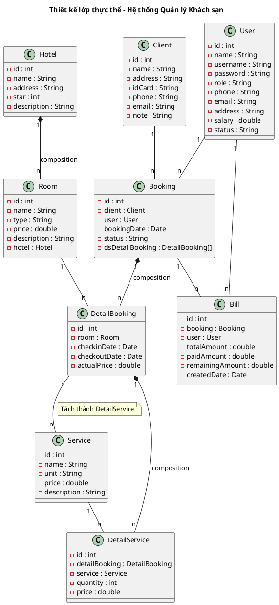

### Mô tả các lớp thực thể thiết kế

**1. Hotel (Khách sạn)**
- `id : int` – Khóa chính, tự tăng
- `name : String` – Tên khách sạn
- `address : String` – Địa chỉ
- `star : int` – Số sao (1-5)
- `description : String` – Mô tả

**2. Room (Phòng)**
- `id : int` – Khóa chính, tự tăng
- `name : String` – Tên/số hiệu phòng
- `type : String` – Kiểu phòng (Single/Double/Twin)
- `price : double` – Giá phòng/đêm
- `description : String` – Mô tả (Sea view, Garden view...)
- `hotel : Hotel` – Khách sạn sở hữu (FK)

**3. Client (Khách hàng)**
- `id : int` – Khóa chính, tự tăng
- `name : String` – Họ tên
- `address : String` – Địa chỉ
- `idCard : String` – Số CCCD/Passport
- `phone : String` – Số điện thoại
- `email : String` – Email
- `note : String` – Ghi chú đặc biệt

**4. User (Nhân viên)**
- `id : int` – Khóa chính, tự tăng
- `name : String` – Họ tên
- `username : String` – Tên đăng nhập
- `password : String` – Mật khẩu
- `role : String` – Chức vụ (Manager/Seller/Receptionist/Admin)
- `phone : String` – Số điện thoại
- `email : String` – Email
- `address : String` – Địa chỉ
- `salary : double` – Lương cơ bản
- `status : String` – Trạng thái (Đang làm việc/Nghỉ việc)

**5. Booking (Đặt phòng)**
- `id : int` – Khóa chính, tự tăng
- `client : Client` – Khách hàng đặt (FK)
- `user : User` – Nhân viên thực hiện (FK)
- `bookingDate : Date` – Ngày đặt
- `status : String` – Trạng thái (Đã đặt/Đã nhận/Đã trả/Đã hủy)
- `dsDetailBooking : DetailBooking[]` – Danh sách chi tiết đặt phòng

**6. DetailBooking (Chi tiết đặt phòng)**
- `id : int` – Khóa chính, tự tăng
- `room : Room` – Phòng được đặt (FK)
- `checkinDate : Date` – Ngày nhận phòng
- `checkoutDate : Date` – Ngày trả phòng
- `actualPrice : double` – Giá thực tế

**7. Bill (Hóa đơn)**
- `id : int` – Khóa chính, tự tăng
- `booking : Booking` – Đặt phòng liên quan (FK)
- `user : User` – Nhân viên lập hóa đơn (FK)
- `totalAmount : double` – Tổng tiền
- `paidAmount : double` – Tiền đã trả trước
- `remainingAmount : double` – Tiền còn lại
- `createdDate : Date` – Ngày tạo hóa đơn

**8. Service (Dịch vụ)**
- `id : int` – Khóa chính, tự tăng
- `name : String` – Tên dịch vụ
- `unit : String` – Đơn vị tính
- `price : double` – Đơn giá
- `description : String` – Mô tả

**9. DetailService (Chi tiết dịch vụ)**
- `id : int` – Khóa chính, tự tăng
- `detailBooking : DetailBooking` – Chi tiết đặt phòng (FK)
- `service : Service` – Dịch vụ sử dụng (FK)
- `quantity : int` – Số lượng
- `price : double` – Đơn giá tại thời điểm sử dụng

---

## **2. Biểu đồ thiết kế CSDL (ERD)**

**Input:** Biểu đồ lớp thực thể pha thiết kế.

**Quy trình 5 bước:**

**Bước 1:** Với mỗi lớp thực thể → đề xuất 1 bảng dữ liệu tương ứng (đặt tên dạng `tbl[TênLớp]`).

**Bước 2:** Với mỗi lớp, bỏ qua thuộc tính kiểu đối tượng, chỉ lấy thuộc tính kiểu cơ bản đưa sang làm cột; chuyển đổi kiểu dữ liệu sang SQL.

**Bước 3:** Quan hệ số lượng giữa 2 lớp = quan hệ số lượng giữa 2 bảng tương ứng.

**Bước 4:** Bổ sung khóa:
- **PK:** Bảng nào có thuộc tính `id` → thiết lập làm PK.
- **FK:** Nếu `tblA` – `tblB` là 1-n → `tblB` thêm cột FK tham chiếu PK của `tblA`.

**Bước 5:** Loại bỏ thuộc tính gây dư thừa dữ liệu.

### Sơ đồ ERD

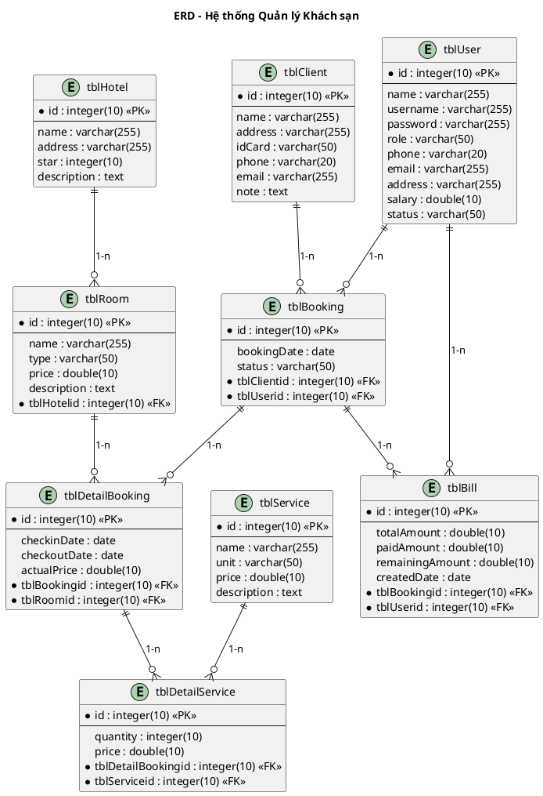

### Mô tả chi tiết các bảng

#### tblHotel
| Cột | Kiểu dữ liệu | Khóa | Mô tả |
|-----|--------------|------|-------|
| id | integer(10) | PK | Mã khách sạn, tự tăng |
| name | varchar(255) | | Tên khách sạn |
| address | varchar(255) | | Địa chỉ |
| star | integer(10) | | Số sao (1-5) |
| description | text | | Mô tả |

#### tblRoom
| Cột | Kiểu dữ liệu | Khóa | Mô tả |
|-----|--------------|------|-------|
| id | integer(10) | PK | Mã phòng, tự tăng |
| name | varchar(255) | | Tên/số hiệu phòng |
| type | varchar(50) | | Kiểu phòng (Single/Double/Twin) |
| price | double(10) | | Giá phòng/đêm |
| description | text | | Mô tả |
| tblHotelid | integer(10) | FK | Tham chiếu tblHotel.id |

#### tblClient
| Cột | Kiểu dữ liệu | Khóa | Mô tả |
|-----|--------------|------|-------|
| id | integer(10) | PK | Mã khách hàng, tự tăng |
| name | varchar(255) | | Họ tên |
| address | varchar(255) | | Địa chỉ |
| idCard | varchar(50) | | Số CCCD/Passport |
| phone | varchar(20) | | Số điện thoại |
| email | varchar(255) | | Email |
| note | text | | Ghi chú |

#### tblUser
| Cột | Kiểu dữ liệu | Khóa | Mô tả |
|-----|--------------|------|-------|
| id | integer(10) | PK | Mã nhân viên, tự tăng |
| name | varchar(255) | | Họ tên |
| username | varchar(255) | | Tên đăng nhập |
| password | varchar(255) | | Mật khẩu |
| role | varchar(50) | | Chức vụ |
| phone | varchar(20) | | Số điện thoại |
| email | varchar(255) | | Email |
| address | varchar(255) | | Địa chỉ |
| salary | double(10) | | Lương cơ bản |
| status | varchar(50) | | Trạng thái |

#### tblBooking
| Cột | Kiểu dữ liệu | Khóa | Mô tả |
|-----|--------------|------|-------|
| id | integer(10) | PK | Mã đặt phòng, tự tăng |
| bookingDate | date | | Ngày đặt |
| status | varchar(50) | | Trạng thái |
| tblClientid | integer(10) | FK | Tham chiếu tblClient.id |
| tblUserid | integer(10) | FK | Tham chiếu tblUser.id |

#### tblDetailBooking
| Cột | Kiểu dữ liệu | Khóa | Mô tả |
|-----|--------------|------|-------|
| id | integer(10) | PK | Mã chi tiết, tự tăng |
| checkinDate | date | | Ngày nhận phòng |
| checkoutDate | date | | Ngày trả phòng |
| actualPrice | double(10) | | Giá thực tế |
| tblBookingid | integer(10) | FK | Tham chiếu tblBooking.id |
| tblRoomid | integer(10) | FK | Tham chiếu tblRoom.id |

#### tblBill
| Cột | Kiểu dữ liệu | Khóa | Mô tả |
|-----|--------------|------|-------|
| id | integer(10) | PK | Mã hóa đơn, tự tăng |
| totalAmount | double(10) | | Tổng tiền |
| paidAmount | double(10) | | Tiền đã trả |
| remainingAmount | double(10) | | Tiền còn lại |
| createdDate | date | | Ngày tạo |
| tblBookingid | integer(10) | FK | Tham chiếu tblBooking.id |
| tblUserid | integer(10) | FK | Tham chiếu tblUser.id |

#### tblService
| Cột | Kiểu dữ liệu | Khóa | Mô tả |
|-----|--------------|------|-------|
| id | integer(10) | PK | Mã dịch vụ, tự tăng |
| name | varchar(255) | | Tên dịch vụ |
| unit | varchar(50) | | Đơn vị tính |
| price | double(10) | | Đơn giá |
| description | text | | Mô tả |

#### tblDetailService
| Cột | Kiểu dữ liệu | Khóa | Mô tả |
|-----|--------------|------|-------|
| id | integer(10) | PK | Mã chi tiết, tự tăng |
| quantity | integer(10) | | Số lượng |
| price | double(10) | | Đơn giá tại thời điểm |
| tblDetailBookingid | integer(10) | FK | Tham chiếu tblDetailBooking.id |
| tblServiceid | integer(10) | FK | Tham chiếu tblService.id |

---

## **3. Thiết kế giao diện (Wireframe) & Biểu đồ lớp thiết kế chi tiết**

### 3.1 Thiết kế giao diện (Wireframe ASCII)

#### 3.1.1 Màn hình đăng nhập

```
┌──────────────────────────────────────────────┐
│              ĐĂNG NHẬP HỆ THỐNG              │
│                                              │
│    ┌──────────────────────────────────────┐  │
│    │  Tên đăng nhập: [________________]  │  │
│    │  Mật khẩu:      [________________]  │  │
│    └──────────────────────────────────────┘  │
│                                              │
│                    [ Đăng nhập ]              │
│                                              │
└──────────────────────────────────────────────┘
```

#### 3.1.2 Giao diện chính Quản lý (Manager)

```
┌──────────────────────────────────────────────┐
│         HỆ THỐNG QUẢN LÝ KHÁCH SẠN          │
│         Xin chào: [Tên nhân viên]            │
│                                              │
│  ┌────────────────────────────────────────┐  │
│  │  [1] Quản lý thông tin khách sạn       │  │
│  │  [2] Quản lý thông tin phòng           │  │
│  │  [3] Xem báo cáo thống kê              │  │
│  └────────────────────────────────────────┘  │
│                                              │
│                    [ Đăng xuất ]              │
└──────────────────────────────────────────────┘
```

#### 3.1.3 Giao diện Quản lý phòng

```
┌──────────────────────────────────────────────┐
│              QUẢN LÝ PHÒNG                   │
│                                              │
│  ┌────────────────────────────────────────┐  │
│  │  [1] Thêm phòng                        │  │
│  │  [2] Sửa phòng                         │  │
│  │  [3] Xóa phòng                         │  │
│  └────────────────────────────────────────┘  │
│                                              │
│                    [ Quay lại ]               │
└──────────────────────────────────────────────┘
```

#### 3.1.4 Giao diện Tìm phòng

```
┌──────────────────────────────────────────────┐
│              TÌM PHÒNG                       │
│                                              │
│  Tên phòng: [________________]  [ Tìm ]      │
│                                              │
│  ┌──────┬────────┬────────┬────────┬──────┐  │
│  │  ID  │  Tên   │  Kiểu  │  Giá   │Mô tả│  │
│  │      │        │        │        │      │  │
│  │  1   │  305   │ Double │ 1000   │Sea   │  │
│  │  2   │  201   │ Single │  500   │Garden│  │
│  └──────┴────────┴────────┴────────┴──────┘  │
│                                              │
│                    [ Quay lại ]               │
└──────────────────────────────────────────────┘
```

#### 3.1.5 Giao diện Sửa phòng

```
┌──────────────────────────────────────────────┐
│              SỬA THÔNG TIN PHÒNG             │
│                                              │
│  ID:          1          (không sửa)         │
│  Tên:         [305_________________]         │
│  Kiểu:        [Double_______________]         │
│  Giá:         [1000________________]         │
│  Mô tả:       [Sea view_____________]         │
│                                              │
│         [ Lưu ]           [ Reset ]          │
│                                              │
│                    [ Quay lại ]               │
└──────────────────────────────────────────────┘
```

#### 3.1.6 Giao diện Thêm phòng

```
┌──────────────────────────────────────────────┐
│              THÊM PHÒNG MỚI                  │
│                                              │
│  Tên:         [________________________]     │
│  Kiểu:        [________________________]     │
│  Giá:         [________________________]     │
│  Mô tả:       [________________________]     │
│                                              │
│         [ Thêm ]           [ Hủy ]           │
│                                              │
│                    [ Quay lại ]               │
└──────────────────────────────────────────────┘
```

#### 3.1.7 Giao diện chính Nhân viên bán hàng (Seller)

```
┌──────────────────────────────────────────────┐
│         HỆ THỐNG QUẢN LÝ KHÁCH SẠN          │
│         Xin chào: [Tên nhân viên]            │
│                                              │
│  ┌────────────────────────────────────────┐  │
│  │  [1] Đặt phòng qua điện thoại         │  │
│  │  [2] Hủy đặt phòng                    │  │
│  └────────────────────────────────────────┘  │
│                                              │
│                    [ Đăng xuất ]              │
└──────────────────────────────────────────────┘
```

#### 3.1.8 Giao diện Tìm phòng trống

```
┌──────────────────────────────────────────────┐
│              TÌM PHÒNG TRỐNG                 │
│                                              │
│  Ngày nhận:  [__/__/____]                    │
│  Ngày trả:   [__/__/____]      [ Tìm ]       │
│                                              │
│  ┌──────┬────────┬────────┬────────┬──────┐  │
│  │  ID  │  Tên   │  Kiểu  │  Giá   │Mô tả│  │
│  │      │        │        │        │      │  │
│  │  1   │  305   │ Double │ 1000   │Sea   │  │
│  │  3   │  202   │ Twin   │ 1000   │Garden│  │
│  └──────┴────────┴────────┴────────┴──────┘  │
│                                              │
│                    [ Quay lại ]               │
└──────────────────────────────────────────────┘
```

#### 3.1.9 Giao diện Tìm khách hàng

```
┌──────────────────────────────────────────────┐
│              TÌM KHÁCH HÀNG                  │
│                                              │
│  Tên KH: [________________]  [ Tìm ]         │
│                                              │
│  ┌────┬──────┬────────┬────────┬──────┬────┐ │
│  │ ID │ Tên  │ Địa chỉ│ CCCD   │ SĐT  │Email│
│  │    │      │        │        │      │     │
│  │ 1  │  B   │ Hà Nội │ 123456 │77777 │b@g  │
│  │ 2  │  BC  │ Đà Nẵg │ 223344 │88888 │bc@g │
│  └────┴──────┴────────┴────────┴──────┴────┘ │
│                                              │
│  [ Thêm khách hàng mới ]     [ Quay lại ]    │
└──────────────────────────────────────────────┘
```

#### 3.1.10 Giao diện Xác nhận đặt phòng

```
┌──────────────────────────────────────────────┐
│           XÁC NHẬN ĐẶT PHÒNG                │
│                                              │
│  THÔNG TIN PHÒNG:                            │
│  ┌────────────────────────────────────────┐  │
│  │  Phòng: 305 (Double)                   │  │
│  │  Giá: 1000/đêm                         │  │
│  │  Mô tả: Sea view                       │  │
│  └────────────────────────────────────────┘  │
│                                              │
│  THÔNG TIN KHÁCH HÀNG:                       │
│  ┌────────────────────────────────────────┐  │
│  │  Tên: B                                 │  │
│  │  Địa chỉ: Hà Nội                        │  │
│  │  CCCD: 123456                           │  │
│  │  SĐT: 77777777                          │  │
│  └────────────────────────────────────────┘  │
│                                              │
│  THÔNG TIN ĐẶT PHÒNG:                        │
│  ┌────────────────────────────────────────┐  │
│  │  Ngày nhận: 30/04/2020                 │  │
│  │  Ngày trả:  01/05/2020                 │  │
│  └────────────────────────────────────────┘  │
│                                              │
│         [ Xác nhận ]        [ Hủy ]          │
└──────────────────────────────────────────────┘
```

#### 3.1.11 Giao diện chính Nhân viên lễ tân (Receptionist)

```
┌──────────────────────────────────────────────┐
│         HỆ THỐNG QUẢN LÝ KHÁCH SẠN          │
│         Xin chào: [Tên nhân viên]            │
│                                              │
│  ┌────────────────────────────────────────┐  │
│  │  [1] Nhận phòng (Check-in)             │  │
│  │  [2] Trả phòng (Check-out)             │  │
│  │  [3] Hủy đặt phòng                    │  │
│  └────────────────────────────────────────┘  │
│                                              │
│                    [ Đăng xuất ]              │
└──────────────────────────────────────────────┘
```

#### 3.1.12 Giao diện Check-in

```
┌──────────────────────────────────────────────┐
│              NHẬN PHÒNG (CHECK-IN)           │
│                                              │
│  Tên KH: [________________]  [ Tìm ]         │
│                                              │
│  ┌────┬──────┬────────┬──────┬──────┬──────┐ │
│  │Tên │Địa chỉ│ CCCD  │ SĐT  │Ngày đến│Phòng│
│  │    │       │       │      │       │     │
│  │ B  │Hà Nội │123456 │7777  │30/04  │ 305 │
│  │ BC │Đà Nẵg │223344 │8888  │30/04  │ 201 │
│  └────┴───────┴───────┴──────┴───────┴─────┘ │
│                                              │
│                    [ Quay lại ]               │
└──────────────────────────────────────────────┘
```

#### 3.1.13 Giao diện Check-out

```
┌──────────────────────────────────────────────┐
│              TRẢ PHÒNG (CHECK-OUT)           │
│                                              │
│  Tên phòng: [________________]  [ Tìm ]      │
│                                              │
│  ┌────┬──────┬────────┬──────┬──────┬──────┐ │
│  │Tên │Địa chỉ│ CCCD  │ SĐT  │Ngày đi│Phòng│
│  │    │       │       │      │       │     │
│  │ B  │Hà Nội │123456 │7777  │01/05  │ 305 │
│  └────┴───────┴───────┴──────┴───────┴─────┘ │
│                                              │
│                    [ Quay lại ]               │
└──────────────────────────────────────────────┘
```

#### 3.1.14 Giao diện Hóa đơn thanh toán

```
┌──────────────────────────────────────────────┐
│              HÓA ĐƠN THANH TOÁN              │
│                                              │
│  Mã hóa đơn: HD001                           │
│  Ngày tạo: 01/05/2020                        │
│  Khách hàng: B - Hà Nội                      │
│  Phòng: 305 (Double) - 1000/đêm              │
│  Ngày ở: 30/04/2020 - 01/05/2020 (1 đêm)    │
│                                              │
│  ┌──────────────────────────────────────┐    │
│  │  Tiền phòng:           1,000,000     │    │
│  │  Dịch vụ ăn sáng:        50,000      │    │
│  │  ─────────────────────────────       │    │
│  │  Tổng cộng:            1,050,000     │    │
│  │  Đã thanh toán:           0          │    │
│  │  Còn lại:            1,050,000       │    │
│  └──────────────────────────────────────┘    │
│                                              │
│  [ Bổ sung dịch vụ ]  [ Xác nhận thanh toán ]│
│                                              │
│                    [ Quay lại ]               │
└──────────────────────────────────────────────┘
```

#### 3.1.15 Giao diện chính Admin

```
┌──────────────────────────────────────────────┐
│         HỆ THỐNG QUẢN LÝ KHÁCH SẠN          │
│         Xin chào: Admin                      │
│                                              │
│  ┌────────────────────────────────────────┐  │
│  │  [1] Quản lý tài khoản người dùng     │  │
│  └────────────────────────────────────────┘  │
│                                              │
│                    [ Đăng xuất ]              │
└──────────────────────────────────────────────┘
```

#### 3.1.16 Giao diện Quản lý tài khoản

```
┌──────────────────────────────────────────────┐
│           QUẢN LÝ TÀI KHOẢN                  │
│                                              │
│  Tên NV: [________________]  [ Tìm ]         │
│                                              │
│  ┌────┬──────┬────────┬──────┬──────┬──────┐ │
│  │ ID │ Tên  │Chức vụ │ SĐT  │Email │Tr.thái│
│  │    │      │        │      │      │      │
│  │ 1  │  A   │Manager │0123  │a@g   │Đ.làm │
│  │ 2  │  B   │Seller  │0456  │b@g   │Đ.làm │
│  └────┴──────┴────────┴──────┴──────┴──────┘ │
│                                              │
│  [ Thêm ]  [ Sửa ]  [ Xóa ]  [ Quay lại ]   │
└──────────────────────────────────────────────┘
```

#### 3.1.17 Giao diện Sửa tài khoản

```
┌──────────────────────────────────────────────┐
│           SỬA THÔNG TIN TÀI KHOẢN            │
│                                              │
│  ID:          1          (không sửa)         │
│  Tên:         [A___________________]         │
│  Username:    [abcxyz_______________]         │
│  Chức vụ:     [Manager______________]         │
│  SĐT:         [0123________________]         │
│  Email:       [a@gmail.com_________]         │
│  Địa chỉ:     [____________________]         │
│  Lương:       [5000________________]         │
│  Trạng thái:  [Đang làm việc_______]         │
│                                              │
│         [ Lưu ]           [ Reset ]          │
│                                              │
│                    [ Quay lại ]               │
└──────────────────────────────────────────────┘
```

#### 3.1.18 Giao diện Chọn loại thống kê

```
┌──────────────────────────────────────────────┐
│           CHỌN LOẠI THỐNG KÊ                 │
│                                              │
│  Đối tượng:  [▼ Phòng___________]            │
│  Tiêu chí:   [▼ Theo doanh thu__]            │
│                                              │
│                    [ Tiếp tục ]               │
│                                              │
│                    [ Quay lại ]               │
└──────────────────────────────────────────────┘
```

#### 3.1.19 Giao diện Thống kê phòng theo doanh thu

```
┌──────────────────────────────────────────────┐
│        THỐNG KÊ PHÒNG THEO DOANH THU         │
│                                              │
│  Từ ngày: [__/__/____]  Đến: [__/__/____]    │
│                              [ Xem ]          │
│                                              │
│  ┌────┬────────┬────────┬────────┬────────┐  │
│  │Tên │  Kiểu  │Tổng ngày│Tổng DT │Chi tiết│  │
│  │    │        │có khách│        │        │  │
│  │305 │ Double │   15   │ 15000  │ [Xem]  │  │
│  │201 │ Single │   24   │ 12000  │ [Xem]  │  │
│  │202 │ Twin   │   10   │ 10000  │ [Xem]  │  │
│  └────┴────────┴────────┴────────┴────────┘  │
│                                              │
│                    [ Quay lại ]               │
└──────────────────────────────────────────────┘
```

#### 3.1.20 Giao diện Chi tiết thống kê phòng

```
┌──────────────────────────────────────────────┐
│        CHI TIẾT THỐNG KÊ PHÒNG 305           │
│                                              │
│  Phòng: 305 (Double)                         │
│  Giá: 1000/đêm                               │
│                                              │
│  ┌────┬────────┬────────┬──────┬──────┬────┐ │
│  │Tên KH│Ngày đến│Ngày đi │Đ.giá│T.ngày│T.DT│
│  │     │        │        │     │      │    │
│  │  B  │01/05   │05/05   │1000 │  4   │4000│
│  │  CC │09/05   │10/05   │1000 │  1   │1000│
│  │  zz │13/05   │21/05   │1000 │  8   │8000│
│  │  kk │26/05   │26/05   │1000 │  2   │2000│
│  │Tổng │        │        │     │ 15   │1500│
│  └────┴────────┴────────┴──────┴──────┴────┘ │
│                                              │
│                    [ Quay lại ]               │
└──────────────────────────────────────────────┘
```

### 3.2 Biểu đồ lớp thiết kế chi tiết đầy đủ

**Kiến trúc DAO (BẮT BUỘC áp dụng):**
- Lớp **Boundary** (Form/Frame): xử lý giao diện, bắt sự kiện `actionPerformed()`.
- Lớp **DAO** (Data Access Object): thực hiện truy vấn CSDL. Đặt tên `[TênEntity]DAO`.
- Lớp **DAO** kế thừa từ lớp `DAO` chung (có `conn: Connection` và constructor `DAO()`).
- Lớp **Entity**: chỉ chứa thuộc tính + getter/setter, không chứa logic CSDL.

#### Xác định chữ ký hàm cho các DAO

**1. RoomDAO**
```
Tìm phòng theo tên => searchRoomByName(name: String): List<Room>
- Input: name (String)
- Output: List<Room>
- Ứng viên tham số vào:
  searchRoomByName(name: String) → chọn (theo yêu cầu tìm kiếm)
- Ứng viên tham số ra:
  searchRoomByName(): List<Room> → chọn (trả về danh sách phòng)

Tìm phòng trống => searchFreeRoom(checkin: Date, checkout: Date): List<Room>
- Input: checkin (Date), checkout (Date)
- Output: List<Room>
- Ứng viên tham số vào:
  searchFreeRoom(checkin: Date, checkout: Date) → chọn (theo khoảng thời gian)
- Ứng viên tham số ra:
  searchFreeRoom(): List<Room> → chọn (trả về danh sách phòng trống)

Thêm phòng => addRoom(room: Room): boolean
- Input: room (Room)
- Output: boolean
- Ứng viên tham số vào:
  addRoom(name: String, type: String, price: double, description: String) → loại vì không hướng đối tượng
  addRoom(room: Room) → chọn (hướng đối tượng)
- Ứng viên tham số ra:
  addRoom(): void
  addRoom(): boolean → chọn (cần biết thành công/thất bại)

Cập nhật phòng => updateRoom(room: Room): boolean
- Input: room (Room)
- Output: boolean
- Ứng viên tham số vào:
  updateRoom(id: int, name: String, type: String, price: double, description: String) → loại vì không hướng đối tượng
  updateRoom(room: Room) → chọn (hướng đối tượng)
- Ứng viên tham số ra:
  updateRoom(): void
  updateRoom(): boolean → chọn (cần biết thành công/thất bại)

Xóa phòng => deleteRoom(id: int): boolean
- Input: id (int)
- Output: boolean
- Ứng viên tham số vào:
  deleteRoom(id: int) → chọn (chỉ cần id để xóa)
- Ứng viên tham số ra:
  deleteRoom(): void
  deleteRoom(): boolean → chọn (cần biết thành công/thất bại)
```

**2. ClientDAO**
```
Tìm khách hàng theo tên => searchClientByName(name: String): List<Client>
- Input: name (String)
- Output: List<Client>
- Ứng viên tham số vào:
  searchClientByName(name: String) → chọn (theo yêu cầu tìm kiếm)
- Ứng viên tham số ra:
  searchClientByName(): List<Client> → chọn (trả về danh sách khách hàng)

Thêm khách hàng => addClient(client: Client): boolean
- Input: client (Client)
- Output: boolean
- Ứng viên tham số vào:
  addClient(client: Client) → chọn (hướng đối tượng)
- Ứng viên tham số ra:
  addClient(): boolean → chọn (cần biết thành công/thất bại)
```

**3. UserDAO**
```
Kiểm tra đăng nhập => checkLogin(username: String, password: String): User
- Input: username (String), password (String)
- Output: User (null nếu sai)
- Ứng viên tham số vào:
  checkLogin(username: String, password: String) → chọn (cần cả username và password)
- Ứng viên tham số ra:
  checkLogin(): boolean → loại (cần trả về User để biết role)
  checkLogin(): User → chọn (trả về User nếu thành công, null nếu thất bại)

Tìm nhân viên theo tên => searchUserByName(name: String): List<User>
- Input: name (String)
- Output: List<User>
- Ứng viên tham số vào:
  searchUserByName(name: String) → chọn (theo yêu cầu tìm kiếm)
- Ứng viên tham số ra:
  searchUserByName(): List<User> → chọn (trả về danh sách nhân viên)

Cập nhật nhân viên => updateUser(user: User): boolean
- Input: user (User)
- Output: boolean
- Ứng viên tham số vào:
  updateUser(user: User) → chọn (hướng đối tượng)
- Ứng viên tham số ra:
  updateUser(): boolean → chọn (cần biết thành công/thất bại)

Thêm nhân viên => addUser(user: User): boolean
- Input: user (User)
- Output: boolean
- Ứng viên tham số vào:
  addUser(user: User) → chọn (hướng đối tượng)
- Ứng viên tham số ra:
  addUser(): boolean → chọn (cần biết thành công/thất bại)

Xóa nhân viên => deleteUser(id: int): boolean
- Input: id (int)
- Output: boolean
- Ứng viên tham số vào:
  deleteUser(id: int) → chọn (chỉ cần id để xóa)
- Ứng viên tham số ra:
  deleteUser(): boolean → chọn (cần biết thành công/thất bại)
```

**4. BookingDAO**
```
Thêm đặt phòng => addBooking(booking: Booking): boolean
- Input: booking (Booking)
- Output: boolean
- Ứng viên tham số vào:
  addBooking(booking: Booking) → chọn (hướng đối tượng)
- Ứng viên tham số ra:
  addBooking(): boolean → chọn (cần biết thành công/thất bại)

Tìm đặt phòng cho check-in => searchBookingForCheckin(clientName: String): List<Booking>
- Input: clientName (String)
- Output: List<Booking>
- Ứng viên tham số vào:
  searchBookingForCheckin(clientName: String) → chọn (theo tên khách hàng)
- Ứng viên tham số ra:
  searchBookingForCheckin(): List<Booking> → chọn (trả về danh sách đặt phòng)

Cập nhật trạng thái check-in => updateCheckinStatus(bookingId: int): boolean
- Input: bookingId (int)
- Output: boolean
- Ứng viên tham số vào:
  updateCheckinStatus(bookingId: int) → chọn (chỉ cần id)
- Ứng viên tham số ra:
  updateCheckinStatus(): boolean → chọn (cần biết thành công/thất bại)

Tìm đặt phòng cho check-out => searchBookingForCheckout(roomName: String): List<Booking>
- Input: roomName (String)
- Output: List<Booking>
- Ứng viên tham số vào:
  searchBookingForCheckout(roomName: String) → chọn (theo tên phòng)
- Ứng viên tham số ra:
  searchBookingForCheckout(): List<Booking> → chọn (trả về danh sách đặt phòng)

Tìm đặt phòng cho hủy => searchBookingForCancel(roomName: String): List<Booking>
- Input: roomName (String)
- Output: List<Booking>
- Ứng viên tham số vào:
  searchBookingForCancel(roomName: String) → chọn (theo tên phòng)
- Ứng viên tham số ra:
  searchBookingForCancel(): List<Booking> → chọn (trả về danh sách đặt phòng)

Hủy đặt phòng => cancelBooking(bookingId: int): boolean
- Input: bookingId (int)
- Output: boolean
- Ứng viên tham số vào:
  cancelBooking(bookingId: int) → chọn (chỉ cần id)
- Ứng viên tham số ra:
  cancelBooking(): boolean → chọn (cần biết thành công/thất bại)
```

**5. BillDAO**
```
Tạo hóa đơn => createBill(bill: Bill): boolean
- Input: bill (Bill)
- Output: boolean
- Ứng viên tham số vào:
  createBill(bill: Bill) → chọn (hướng đối tượng)
- Ứng viên tham số ra:
  createBill(): boolean → chọn (cần biết thành công/thất bại)

Lấy hóa đơn theo đặt phòng => getBillByBooking(bookingId: int): Bill
- Input: bookingId (int)
- Output: Bill
- Ứng viên tham số vào:
  getBillByBooking(bookingId: int) → chọn (chỉ cần id đặt phòng)
- Ứng viên tham số ra:
  getBillByBooking(): Bill → chọn (trả về hóa đơn)

Lấy danh sách hóa đơn theo phòng trong khoảng thời gian => getBillByRoom(roomId: int, startDate: Date, endDate: Date): List<Bill>
- Input: roomId (int), startDate (Date), endDate (Date)
- Output: List<Bill>
- Ứng viên tham số vào:
  getBillByRoom(roomId: int, startDate: Date, endDate: Date) → chọn (cần roomId và khoảng thời gian)
- Ứng viên tham số ra:
  getBillByRoom(): List<Bill> → chọn (trả về danh sách hóa đơn)
```

**6. ServiceDAO**
```
Lấy tất cả dịch vụ => getAllService(): List<Service>
- Input: không
- Output: List<Service>
- Ứng viên tham số ra:
  getAllService(): List<Service> → chọn (trả về danh sách dịch vụ)

Thêm dịch vụ => addService(service: Service): boolean
- Input: service (Service)
- Output: boolean
- Ứng viên tham số vào:
  addService(service: Service) → chọn (hướng đối tượng)
- Ứng viên tham số ra:
  addService(): boolean → chọn (cần biết thành công/thất bại)

Cập nhật dịch vụ => updateService(service: Service): boolean
- Input: service (Service)
- Output: boolean
- Ứng viên tham số vào:
  updateService(service: Service) → chọn (hướng đối tượng)
- Ứng viên tham số ra:
  updateService(): boolean → chọn (cần biết thành công/thất bại)

Xóa dịch vụ => deleteService(id: int): boolean
- Input: id (int)
- Output: boolean
- Ứng viên tham số vào:
  deleteService(id: int) → chọn (chỉ cần id để xóa)
- Ứng viên tham số ra:
  deleteService(): boolean → chọn (cần biết thành công/thất bại)
```

**7. DetailBookingDAO**
```
Thêm chi tiết đặt phòng => addDetailBooking(detailBooking: DetailBooking): boolean
- Input: detailBooking (DetailBooking)
- Output: boolean
- Ứng viên tham số vào:
  addDetailBooking(detailBooking: DetailBooking) → chọn (hướng đối tượng)
- Ứng viên tham số ra:
  addDetailBooking(): boolean → chọn (cần biết thành công/thất bại)

Lấy chi tiết theo đặt phòng => getDetailByBooking(bookingId: int): List<DetailBooking>
- Input: bookingId (int)
- Output: List<DetailBooking>
- Ứng viên tham số vào:
  getDetailByBooking(bookingId: int) → chọn (chỉ cần id đặt phòng)
- Ứng viên tham số ra:
  getDetailByBooking(): List<DetailBooking> → chọn (trả về danh sách chi tiết)
```

**8. DetailServiceDAO**
```
Thêm chi tiết dịch vụ => addDetailService(detailService: DetailService): boolean
- Input: detailService (DetailService)
- Output: boolean
- Ứng viên tham số vào:
  addDetailService(detailService: DetailService) → chọn (hướng đối tượng)
- Ứng viên tham số ra:
  addDetailService(): boolean → chọn (cần biết thành công/thất bại)

Lấy dịch vụ theo chi tiết đặt phòng => getServiceByDetailBooking(detailBookingId: int): List<DetailService>
- Input: detailBookingId (int)
- Output: List<DetailService>
- Ứng viên tham số vào:
  getServiceByDetailBooking(detailBookingId: int) → chọn (chỉ cần id chi tiết đặt phòng)
- Ứng viên tham số ra:
  getServiceByDetailBooking(): List<DetailService> → chọn (trả về danh sách dịch vụ)
```

**9. HotelDAO**
```
Lấy thông tin khách sạn => getHotel(): Hotel
- Input: không
- Output: Hotel
- Ứng viên tham số ra:
  getHotel(): Hotel → chọn (trả về thông tin khách sạn)

Cập nhật thông tin khách sạn => updateHotel(hotel: Hotel): boolean
- Input: hotel (Hotel)
- Output: boolean
- Ứng viên tham số vào:
  updateHotel(hotel: Hotel) → chọn (hướng đối tượng)
- Ứng viên tham số ra:
  updateHotel(): boolean → chọn (cần biết thành công/thất bại)
```

**10. RoomStatDAO**
```
Lấy thống kê phòng theo doanh thu => getRoomStatByRevenue(startDate: Date, endDate: Date): List<RoomStat>
- Input: startDate (Date), endDate (Date)
- Output: List<RoomStat>
- Ứng viên tham số vào:
  getRoomStatByRevenue(startDate: Date, endDate: Date) → chọn (cần khoảng thời gian)
- Ứng viên tham số ra:
  getRoomStatByRevenue(): List<RoomStat> → chọn (trả về danh sách thống kê)
```

**11. ClientStatDAO**
```
Lấy thống kê khách hàng theo doanh thu => getClientStatByRevenue(startDate: Date, endDate: Date): List<ClientStat>
- Input: startDate (Date), endDate (Date)
- Output: List<ClientStat>
- Ứng viên tham số vào:
  getClientStatByRevenue(startDate: Date, endDate: Date) → chọn (cần khoảng thời gian)
- Ứng viên tham số ra:
  getClientStatByRevenue(): List<ClientStat> → chọn (trả về danh sách thống kê)
```

**12. ServiceStatDAO**
```
Lấy thống kê dịch vụ theo doanh thu => getServiceStatByRevenue(startDate: Date, endDate: Date): List<ServiceStat>
- Input: startDate (Date), endDate (Date)
- Output: List<ServiceStat>
- Ứng viên tham số vào:
  getServiceStatByRevenue(startDate: Date, endDate: Date) → chọn (cần khoảng thời gian)
- Ứng viên tham số ra:
  getServiceStatByRevenue(): List<ServiceStat> → chọn (trả về danh sách thống kê)
```

**13. IncomeStatDAO**
```
Lấy thống kê doanh thu theo thời gian => getIncomeStatByTime(startDate: Date, endDate: Date, groupBy: String): List<IncomeStat>
- Input: startDate (Date), endDate (Date), groupBy (String: "month"/"quarter"/"year")
- Output: List<IncomeStat>
- Ứng viên tham số vào:
  getIncomeStatByTime(startDate: Date, endDate: Date, groupBy: String) → chọn (cần khoảng thời gian và cách nhóm)
- Ứng viên tham số ra:
  getIncomeStatByTime(): List<IncomeStat> → chọn (trả về danh sách thống kê)
```

### Biểu đồ lớp thiết kế chi tiết

```plantuml
@startuml
title Biểu đồ lớp thiết kế – Hệ thống Quản lý Khách sạn

package "Boundary" #DDEEFF {
  class LoginFrm {
    -inUsername : JTextField
    -inPassword : JPasswordField
    -btnLogin : JButton
    +actionPerformed(e : ActionEvent) : void
  }

  class ManagerHomeFrm {
    -nv : User
    -btnManageHotel : JButton
    -btnManageRoom : JButton
    -btnViewReport : JButton
    +actionPerformed(e : ActionEvent) : void
  }

  class RoomManageFrm {
    -nv : User
    -btnAdd : JButton
    -btnEdit : JButton
    -btnDelete : JButton
    +actionPerformed(e : ActionEvent) : void
  }

  class SearchRoomFrm {
    -inName : JTextField
    -btnSearch : JButton
    -outTable : JTable
    +actionPerformed(e : ActionEvent) : void
  }

  class EditRoomFrm {
    -inName : JTextField
    -inType : JTextField
    -inPrice : JTextField
    -inDesc : JTextField
    -btnSave : JButton
    -btnReset : JButton
    +EditRoomFrm(room : Room)
    +actionPerformed(e : ActionEvent) : void
  }

  class AddRoomFrm {
    -inName : JTextField
    -inType : JTextField
    -inPrice : JTextField
    -inDesc : JTextField
    -btnAdd : JButton
    -btnCancel : JButton
    +actionPerformed(e : ActionEvent) : void
  }

  class SellerHomeFrm {
    -nv : User
    -btnBook : JButton
    -btnCancel : JButton
    +actionPerformed(e : ActionEvent) : void
  }

  class SearchFreeRoomFrm {
    -inCheckin : JTextField
    -inCheckout : JTextField
    -btnSearch : JButton
    -outTable : JTable
    +actionPerformed(e : ActionEvent) : void
  }

  class SearchClientFrm {
    -inName : JTextField
    -btnSearch : JButton
    -btnAddNew : JButton
    -outTable : JTable
    +actionPerformed(e : ActionEvent) : void
  }

  class ConfirmBookingFrm {
    -room : Room
    -client : Client
    -checkin : Date
    -checkout : Date
    -btnConfirm : JButton
    -btnCancel : JButton
    +actionPerformed(e : ActionEvent) : void
  }

  class ReceptionistHomeFrm {
    -nv : User
    -btnCheckin : JButton
    -btnCheckout : JButton
    -btnCancelBooking : JButton
    +actionPerformed(e : ActionEvent) : void
  }

  class CheckinFrm {
    -inClientName : JTextField
    -btnSearch : JButton
    -outTable : JTable
    +actionPerformed(e : ActionEvent) : void
  }

  class CheckoutFrm {
    -inRoomName : JTextField
    -btnSearch : JButton
    -outTable : JTable
    +actionPerformed(e : ActionEvent) : void
  }

  class BillFrm {
    -booking : Booking
    -outTotal : JLabel
    -outPaid : JLabel
    -outRemaining : JLabel
    -btnAddService : JButton
    -btnPay : JButton
    +actionPerformed(e : ActionEvent) : void
  }

  class CancelBookingFrm {
    -inRoomName : JTextField
    -btnSearch : JButton
    -outTable : JTable
    +actionPerformed(e : ActionEvent) : void
  }

  class AdminHomeFrm {
    -btnManageUser : JButton
    +actionPerformed(e : ActionEvent) : void
  }

  class UserManageFrm {
    -inName : JTextField
    -btnSearch : JButton
    -btnAdd : JButton
    -btnEdit : JButton
    -btnDelete : JButton
    -outTable : JTable
    +actionPerformed(e : ActionEvent) : void
  }

  class EditUserFrm {
    -inName : JTextField
    -inUsername : JTextField
    -inRole : JTextField
    -inPhone : JTextField
    -inEmail : JTextField
    -inAddress : JTextField
    -inSalary : JTextField
    -inStatus : JTextField
    -btnSave : JButton
    -btnReset : JButton
    +EditUserFrm(user : User)
    +actionPerformed(e : ActionEvent) : void
  }

  class SelectStatFrm {
    -inObject : JComboBox
    -inCriteria : JComboBox
    -btnContinue : JButton
    +actionPerformed(e : ActionEvent) : void
  }

  class RoomStatFrm {
    -inStartDate : JTextField
    -inEndDate : JTextField
    -btnView : JButton
    -outTable : JTable
    +actionPerformed(e : ActionEvent) : void
  }

  class RoomDetailStatFrm {
    -room : Room
    -outTable : JTable
    -btnBack : JButton
    +actionPerformed(e : ActionEvent) : void
  }
}

package "DAO" #FFE0B2 {
  abstract class DAO {
    #conn : Connection
    +DAO()
  }

  class RoomDAO {
    +searchRoomByName(name : String) : List<Room>
    +searchFreeRoom(checkin : Date, checkout : Date) : List<Room>
    +addRoom(room : Room) : boolean
    +updateRoom(room : Room) : boolean
    +deleteRoom(id : int) : boolean
  }

  class ClientDAO {
    +searchClientByName(name : String) : List<Client>
    +addClient(client : Client) : boolean
  }

  class UserDAO {
    +checkLogin(username : String, password : String) : User
    +searchUserByName(name : String) : List<User>
    +addUser(user : User) : boolean
    +updateUser(user : User) : boolean
    +deleteUser(id : int) : boolean
  }

  class BookingDAO {
    +addBooking(booking : Booking) : boolean
    +searchBookingForCheckin(clientName : String) : List<Booking>
    +updateCheckinStatus(bookingId : int) : boolean
    +searchBookingForCheckout(roomName : String) : List<Booking>
    +searchBookingForCancel(roomName : String) : List<Booking>
    +cancelBooking(bookingId : int) : boolean
  }

  class BillDAO {
    +createBill(bill : Bill) : boolean
    +getBillByBooking(bookingId : int) : Bill
    +getBillByRoom(roomId : int, startDate : Date, endDate : Date) : List<Bill>
  }

  class ServiceDAO {
    +getAllService() : List<Service>
    +addService(service : Service) : boolean
    +updateService(service : Service) : boolean
    +deleteService(id : int) : boolean
  }

  class DetailBookingDAO {
    +addDetailBooking(detailBooking : DetailBooking) : boolean
    +getDetailByBooking(bookingId : int) : List<DetailBooking>
  }

  class DetailServiceDAO {
    +addDetailService(detailService : DetailService) : boolean
    +getServiceByDetailBooking(detailBookingId : int) : List<DetailService>
  }

  class HotelDAO {
    +getHotel() : Hotel
    +updateHotel(hotel : Hotel) : boolean
  }

  class RoomStatDAO {
    +getRoomStatByRevenue(startDate : Date, endDate : Date) : List<RoomStat>
  }

  class ClientStatDAO {
    +getClientStatByRevenue(startDate : Date, endDate : Date) : List<ClientStat>
  }

  class ServiceStatDAO {
    +getServiceStatByRevenue(startDate : Date, endDate : Date) : List<ServiceStat>
  }

  class IncomeStatDAO {
    +getIncomeStatByTime(startDate : Date, endDate : Date, groupBy : String) : List<IncomeStat>
  }
}

package "Entity" #FFF3CD {
  class Hotel {
    -id : int
    -name : String
    -address : String
    -star : int
    -description : String
    +getter/setter
  }

  class Room {
    -id : int
    -name : String
    -type : String
    -price : double
    -description : String
    -hotel : Hotel
    +getter/setter
  }

  class Client {
    -id : int
    -name : String
    -address : String
    -idCard : String
    -phone : String
    -email : String
    -note : String
    +getter/setter
  }

  class User {
    -id : int
    -name : String
    -username : String
    -password : String
    -role : String
    -phone : String
    -email : String
    -address : String
    -salary : double
    -status : String
    +getter/setter
  }

  class Booking {
    -id : int
    -client : Client
    -user : User
    -bookingDate : Date
    -status : String
    -dsDetailBooking : DetailBooking[]
    +getter/setter
  }

  class DetailBooking {
    -id : int
    -room : Room
    -checkinDate : Date
    -checkoutDate : Date
    -actualPrice : double
    +getter/setter
  }

  class Bill {
    -id : int
    -booking : Booking
    -user : User
    -totalAmount : double
    -paidAmount : double
    -remainingAmount : double
    -createdDate : Date
    +getter/setter
  }

  class Service {
    -id : int
    -name : String
    -unit : String
    -price : double
    -description : String
    +getter/setter
  }

  class DetailService {
    -id : int
    -detailBooking : DetailBooking
    -service : Service
    -quantity : int
    -price : double
    +getter/setter
  }

  class RoomStat {
    -roomName : String
    -roomType : String
    -totalDays : int
    -totalRevenue : double
    +getter/setter
  }

  class ClientStat {
    -clientName : String
    -totalBookings : int
    -totalRevenue : double
    +getter/setter
  }

  class ServiceStat {
    -serviceName : String
    -totalUsed : int
    -totalRevenue : double
    +getter/setter
  }

  class IncomeStat {
    -period : String
    -totalRevenue : double
    +getter/setter
  }
}

DAO <|-- RoomDAO
DAO <|-- ClientDAO
DAO <|-- UserDAO
DAO <|-- BookingDAO
DAO <|-- BillDAO
DAO <|-- ServiceDAO
DAO <|-- DetailBookingDAO
DAO <|-- DetailServiceDAO
DAO <|-- HotelDAO
DAO <|-- RoomStatDAO
DAO <|-- ClientStatDAO
DAO <|-- ServiceStatDAO
DAO <|-- IncomeStatDAO

RoomDAO --> Room
ClientDAO --> Client
UserDAO --> User
BookingDAO --> Booking
BillDAO --> Bill
ServiceDAO --> Service
DetailBookingDAO --> DetailBooking
DetailServiceDAO --> DetailService
HotelDAO --> Hotel
RoomStatDAO --> RoomStat
ClientStatDAO --> ClientStat
ServiceStatDAO --> ServiceStat
IncomeStatDAO --> IncomeStat

LoginFrm --> UserDAO
ManagerHomeFrm --> RoomManageFrm
ManagerHomeFrm --> SelectStatFrm
RoomManageFrm --> SearchRoomFrm
SearchRoomFrm --> RoomDAO
SearchRoomFrm --> EditRoomFrm
SearchRoomFrm --> AddRoomFrm
EditRoomFrm --> RoomDAO
AddRoomFrm --> RoomDAO
SellerHomeFrm --> SearchFreeRoomFrm
SearchFreeRoomFrm --> RoomDAO
SearchFreeRoomFrm --> SearchClientFrm
SearchClientFrm --> ClientDAO
SearchClientFrm --> ConfirmBookingFrm
ConfirmBookingFrm --> BookingDAO
ReceptionistHomeFrm --> CheckinFrm
ReceptionistHomeFrm --> CheckoutFrm
ReceptionistHomeFrm --> CancelBookingFrm
CheckinFrm --> BookingDAO
CheckoutFrm --> BookingDAO
CheckoutFrm --> BillFrm
BillFrm --> BillDAO
CancelBookingFrm --> BookingDAO
AdminHomeFrm --> UserManageFrm
UserManageFrm --> UserDAO
UserManageFrm --> EditUserFrm
EditUserFrm --> UserDAO
SelectStatFrm --> RoomStatFrm
RoomStatFrm --> RoomStatDAO
RoomStatFrm --> RoomDetailStatFrm
RoomDetailStatFrm --> BillDAO
@enduml
```

---

## **4. Biểu đồ tuần tự pha thiết kế**

> ⚠️ Từ pha này, thông điệp PHẢI là tên hàm tiếng Anh đầy đủ tham số và kiểu trả về.

### 4.1 Tuần tự UC Sửa thông tin phòng

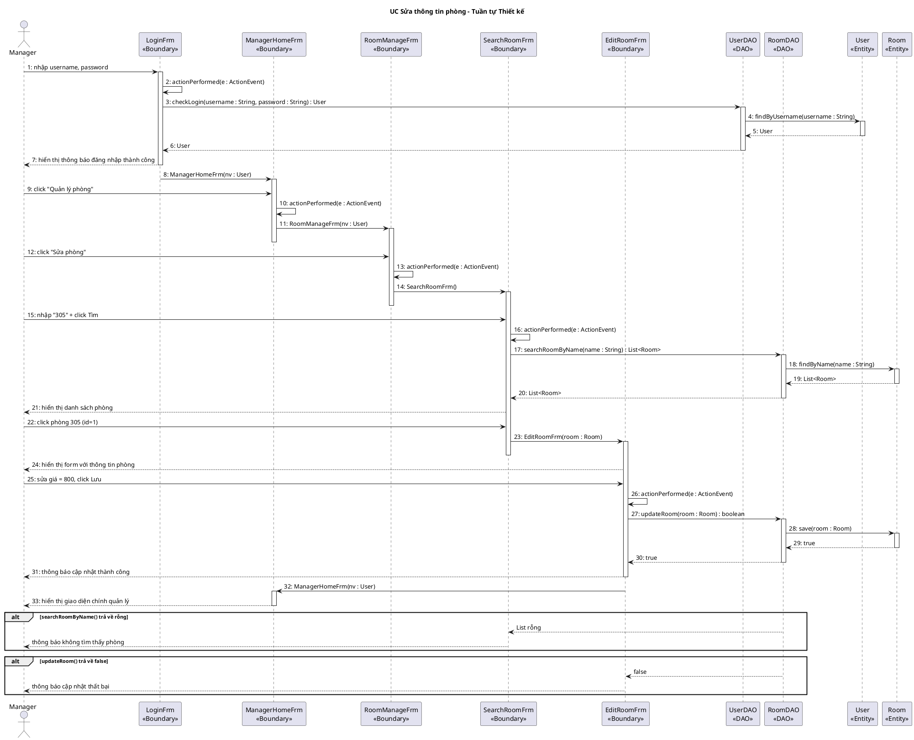

### 4.2 Tuần tự UC Đặt phòng

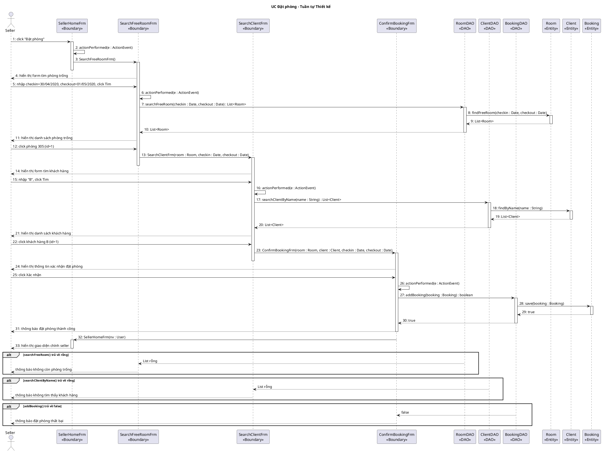

### 4.3 Tuần tự UC Xem thống kê phòng theo doanh thu

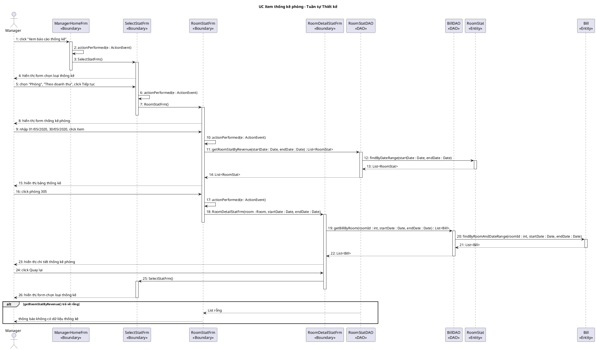

### 4.4 Tuần tự UC Check-in (Nhận phòng)

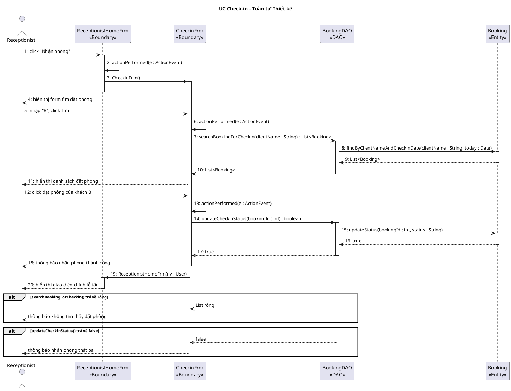

### 4.5 Tuần tự UC Check-out (Trả phòng)

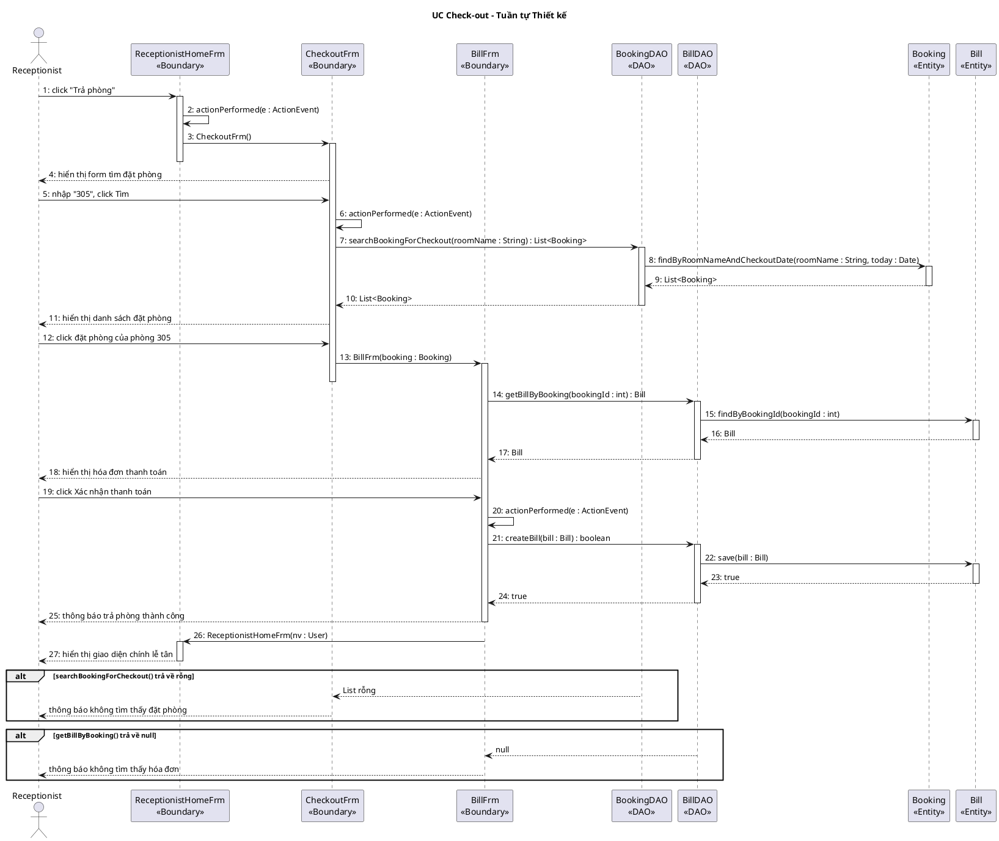

### 4.6 Tuần tự UC Hủy đặt phòng

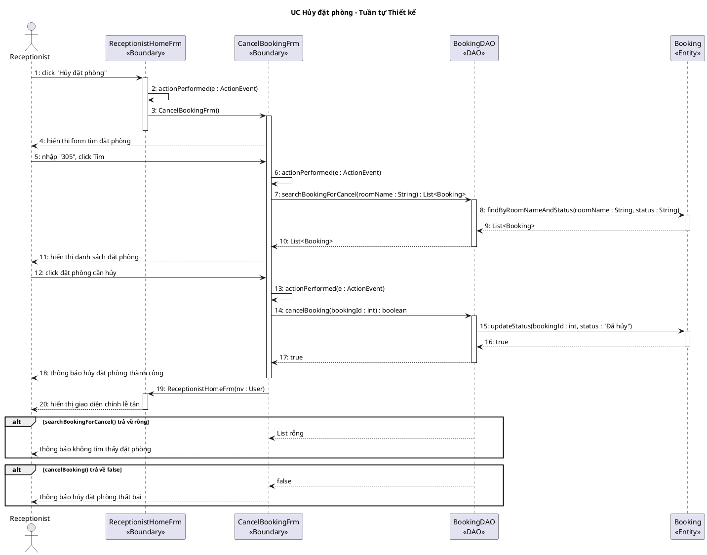

### 4.7 Tuần tự UC Quản lý tài khoản

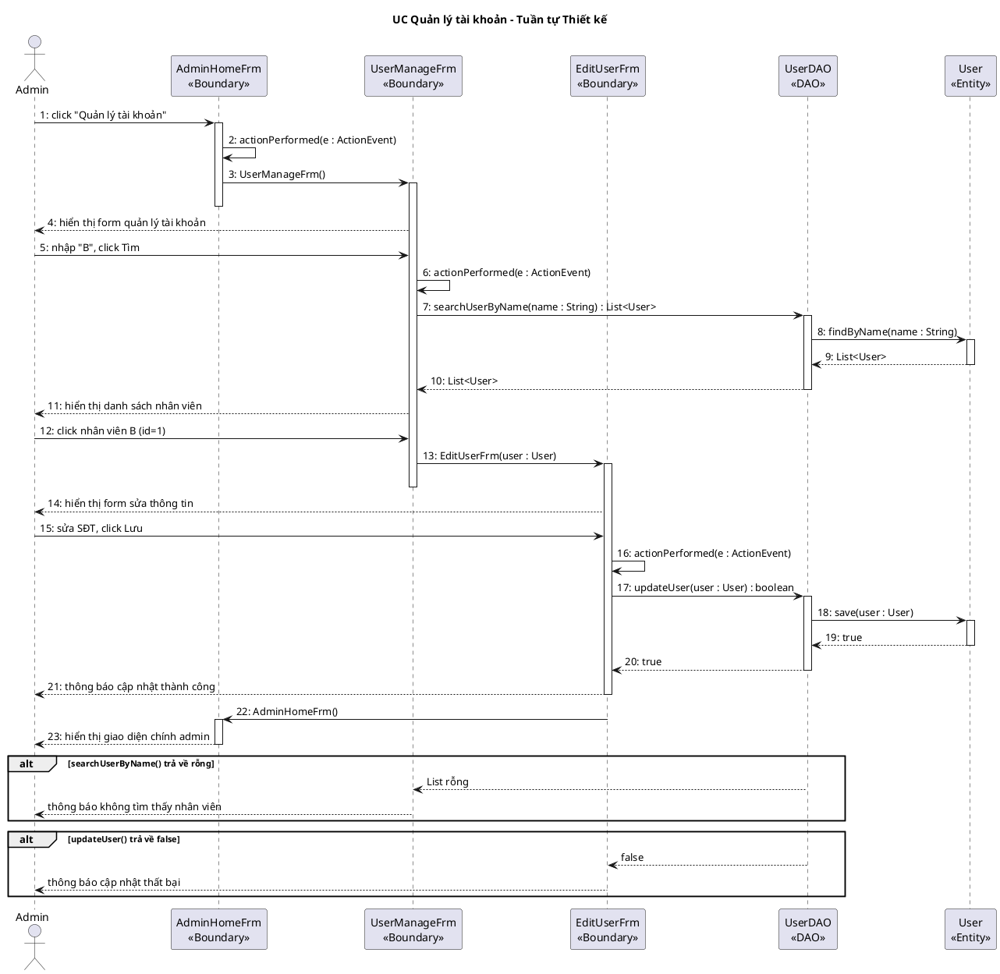

### 4.8 Tuần tự UC Đặt dịch vụ (bổ sung dịch vụ khi check-out)

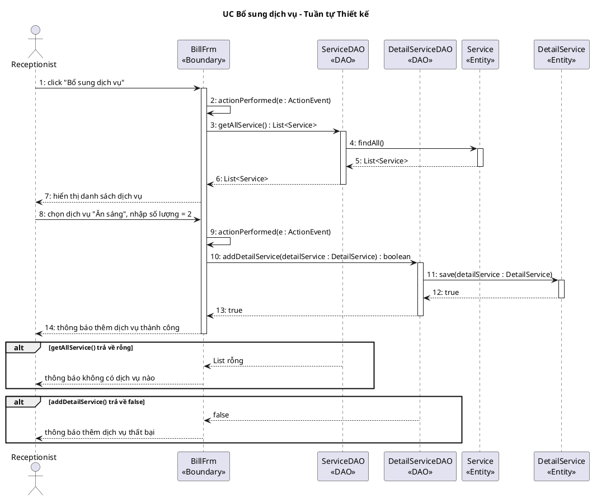

---

*Hết Pha Thiết kế*


