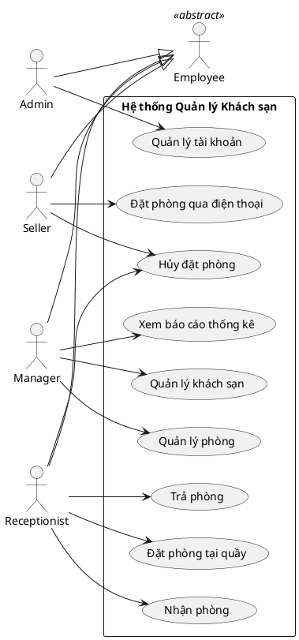
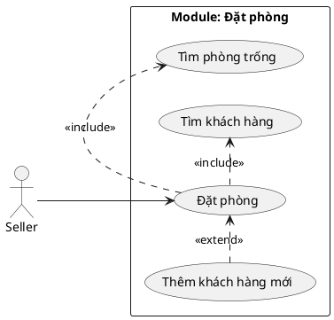
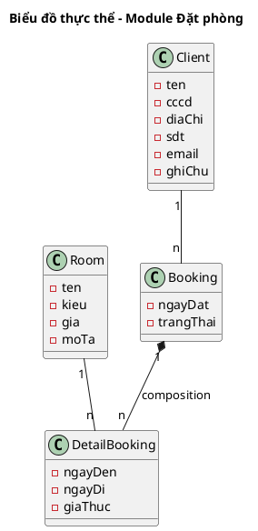
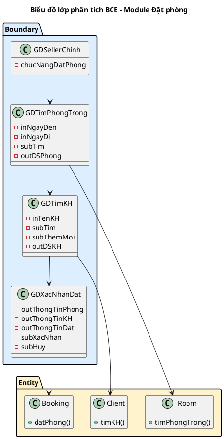
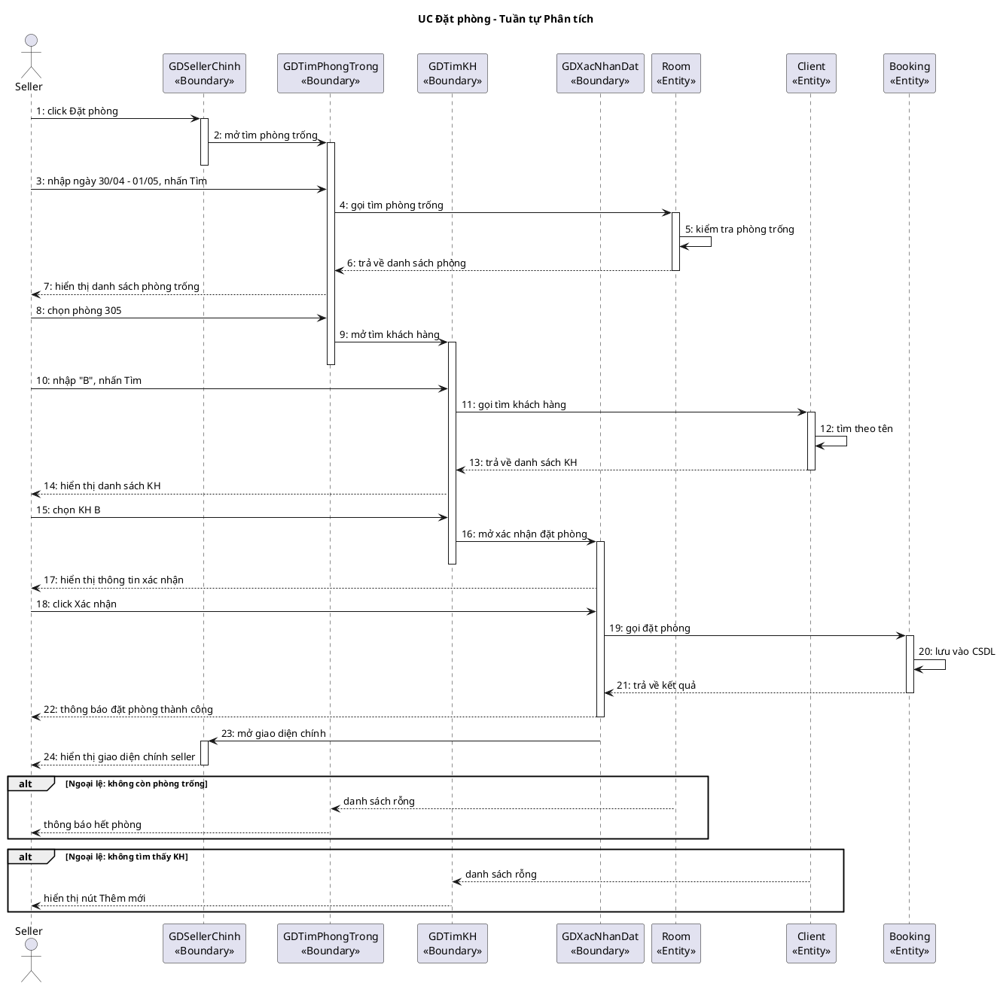
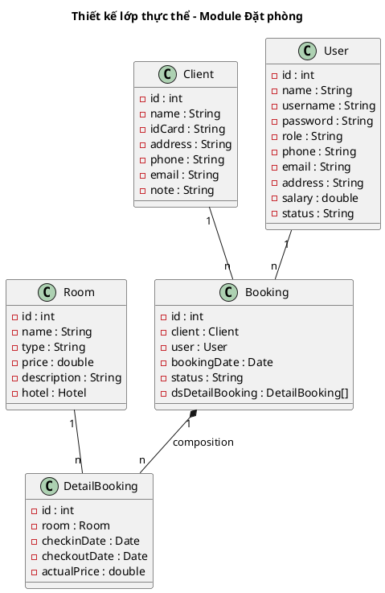
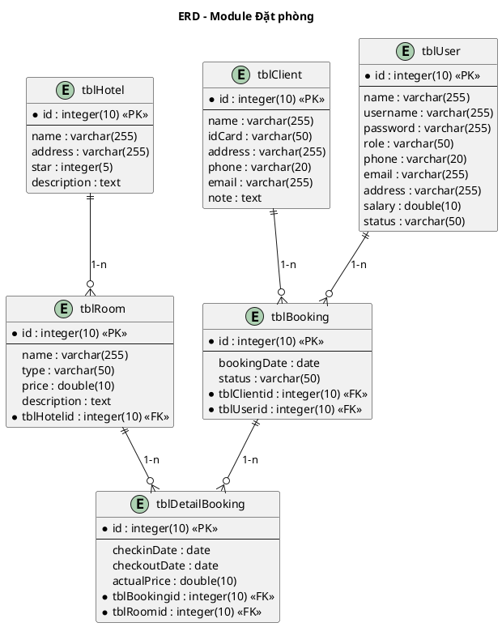
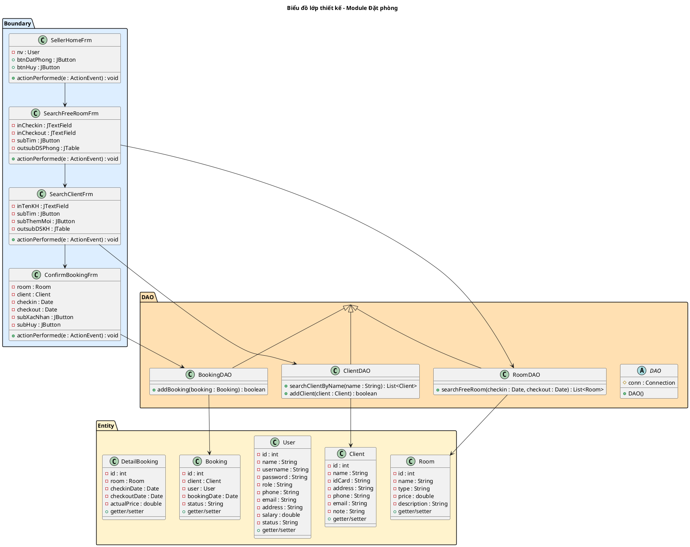
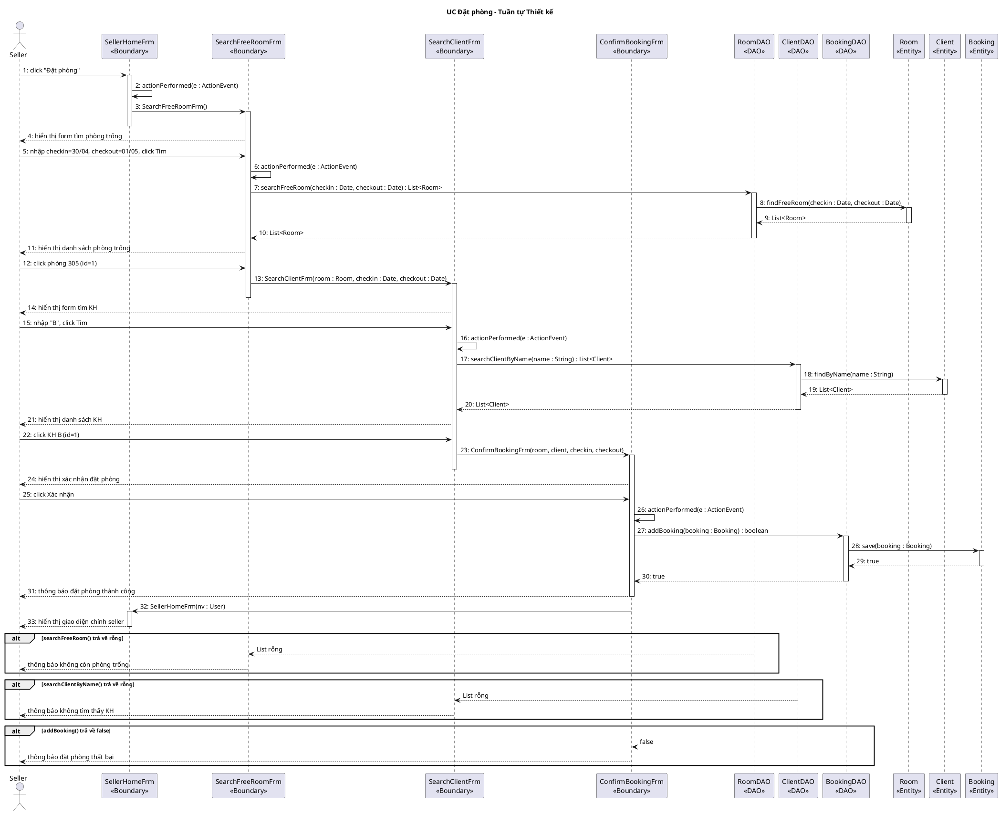

# Hướng dẫn chi tiết Mục 1 → 10 – Quy trình UP đầy đủ

<callout icon="📝" color="blue">
Tài liệu này hướng dẫn cách thực hiện **toàn bộ 10 mục** theo quy trình Unified Process (UP), từ Requirements đến Test. Ví dụ xuyên suốt: **Hệ thống Quản lý Khách sạn (HRM)**, module chi tiết: **Đặt phòng**.
</callout>

---

## Quy tắc cốt lõi

<callout icon="🔑" color="purple">
**Áp dụng cho TOÀN BỘ tài liệu**
</callout>

| # | Quy tắc | Giải thích |
|---|---------|------------|
| 1 | **Hướng Use-case** | Mọi phân tích, thiết kế đều xuất phát từ Use-case |
| 2 | **BCE** | Luôn phân rã theo Boundary – Control – Entity |
| 3 | **Phân biệt ngôn ngữ theo pha** | Pha Phân tích: tiếng Việt tự nhiên · Pha Thiết kế: tên hàm tiếng Anh |
| 4 | **Văn bản 100% tiếng Việt** | Trừ tên hàm/biến ở pha Thiết kế |
| 5 | **UML = PlantUML** | Đặt trong code block `plantuml` |

<columns>
<column>

<callout icon="✅" color="green">
**Pha Phân tích – Đúng: tiếng Việt**

`Actor -> B1 : 3: nhập từ khóa + nhấn tìm`

`B1 -> E : 4: gọi tìm kiếm`
</callout>

</column>
<column>

<callout icon="🚫" color="red">
**Pha Phân tích – Sai: dùng tiếng Anh**

`Actor -> B1 : 3: searchByName(name)`

`B1 -> E : 4: findByName(name)`
</callout>

</column>
</columns>

---

## Quy tắc style biểu đồ

<callout icon="🔑" color="purple">
**Áp dụng cho MỌI biểu đồ UML trong tài liệu**
</callout>

| # | Quy tắc | Đúng | Sai |
|---|---------|------|-----|
| 1 | Dàn bố cục trên nhiều dòng | Xếp package theo chiều dọc/lưới | Đặt tất cả trên một hàng ngang |
| 2 | Không viết tắt tên | `usecase "Quản lý khách hàng"` | `usecase "QL KH"` |
| 3 | Giữ mã UC xuyên suốt | UC01, UC02... không đổi alias | Dùng `UC_main`, `UC_sub1` |
| 4 | Mũi tên thẳng | `-->`, `.<...>>` | Mũi tên chéo |

---

## MỤC LỤC

**Phần mở đầu**
- [Requirements toàn hệ thống](#phần-mở-đầu--requirements-toàn-hệ-thống)

**Pha 1: Requirements module**
- [Mục 1 – UC chi tiết module](#mục-1--biểu-đồ-use-case-chi-tiết-của-module)
- [Mục 2 – Kịch bản chuẩn & ngoại lệ](#mục-2--kịch-bản-chuẩn-và-ngoại-lệ)

**Pha 2: Analysis**
- [Mục 3 – Thực thể phân tích](#mục-3--biểu-đồ-thực-thể-pha-phân-tích)
- [Mục 4 – Lớp BCE](#mục-4--biểu-đồ-lớp-đầy-đủ-pha-phân-tích-bce)
- [Mục 5 – Tuần tự phân tích](#mục-5--biểu-đồ-tuần-tự-pha-phân-tích)

**Pha 3: Design**
- [Mục 6 – Lớp thực thể thiết kế](#mục-6--biểu-đồ-thiết-kế-lớp-thực-thể)
- [Mục 7 – ERD](#mục-7--biểu-đồ-thiết-kế-csdl-erd)
- [Mục 8 – Wireframe & Lớp TK](#mục-8--wireframe--biểu-đồ-lớp-thiết-kế-chi-tiết)
- [Mục 9 – Tuần tự thiết kế](#mục-9--biểu-đồ-tuần-tự-pha-thiết-kế)

**Pha 4: Test**
- [Mục 10 – Test Plan & Test Case](#mục-10--test-plan--test-case-hộp-đen)

**Tổng hợp**
- [Luồng dữ liệu qua các mục](#luồng-dữ-liệu-qua-các-mục)

---

# Phần mở đầu – Requirements toàn hệ thống

<callout icon="🎯" color="yellow">
**Mục tiêu:** Xác định bối cảnh hệ thống, actors, use-case tổng quan, và đề xuất phân module trước khi đi vào chi tiết từng module.
</callout>

## 1. Bảng thuật ngữ

| STT | Thuật ngữ | Định nghĩa |
|-----|-----------|-------------|
| 1 | Actor | Người hoặc hệ thống tương tác với phần mềm |
| 2 | Use Case | Một chức năng hoàn chỉnh mà hệ thống cung cấp cho actor |
| 3 | Boundary | Lớp đại diện cho giao diện người dùng (Form/Frame) |
| 4 | Entity | Lớp đại diện cho đối tượng dữ liệu nghiệp vụ |
| 5 | Control | Lớp điều phối luồng xử lý (nếu cần) |
| 6 | DAO | Data Access Object – lớp truy vấn CSDL |
| 7 | PK | Primary Key – Khóa chính |
| 8 | FK | Foreign Key – Khóa ngoại |
| 9 | ERD | Entity Relationship Diagram – Sơ đồ quan hệ CSDL |
| 10 | Wireframe | Bản phác thảo giao diện |

---

## 2. Mô hình nghiệp vụ bằng ngôn ngữ tự nhiên

### 2.1. Mục tiêu và phạm vi hệ thống

Hệ thống quản lý khách sạn, cho phép nhân viên thực hiện các nghiệp vụ: đặt phòng, nhận phòng, trả phòng, quản lý phòng/khách hàng/dịch vụ, xem báo cáo thống kê. Phạm vi áp dụng nội bộ trong khách sạn.

### 2.2. Ai có thể sử dụng phần mềm?

| Actor | Vai trò |
|-------|---------|
| Manager | Quản lý phòng, khách sạn, xem báo cáo thống kê |
| Seller | Đặt phòng cho khách qua điện thoại |
| Receptionist | Nhận phòng, trả phòng, hủy đặt phòng tại quầy |
| Admin | Quản lý tài khoản người dùng |
| Client (gián tiếp) | Khách hàng đặt phòng qua nhân viên |

### 2.3. Người dùng có những chức năng gì?

<columns>
<column>

**Manager**
- Quản lý thông tin phòng (CRUD)
- Quản lý thông tin khách sạn
- Xem báo cáo thống kê

**Admin**
- Quản lý tài khoản người dùng

</column>
<column>

**Seller**
- Đặt phòng qua điện thoại
- Hủy đặt phòng

**Receptionist**
- Nhận phòng (check-in)
- Trả phòng (check-out)
- Hủy đặt phòng tại quầy

</column>
</columns>

### 2.4. Mỗi chức năng hoạt động như thế nào?

<callout icon="📝" color="blue">
Dạng mũi tên `→`, tách rõ hành động actor và phản hồi hệ thống.
</callout>

**Chức năng "Đặt phòng qua điện thoại":**

Nhân viên chọn Đặt phòng → Hiển thị form tìm phòng trống → Nhập ngày checkin/checkout → Tìm phòng trống → Hiển thị danh sách phòng → Chọn phòng → Hiển thị form tìm KH → Nhập tên KH → Tìm KH → Hiển thị danh sách KH → Chọn KH → Hiển thị xác nhận → Xác nhận → Lưu CSDL → Thông báo thành công

### 2.5. Những thông tin/đối tượng hệ thống cần xử lý

| Đối tượng | Thuộc tính chính |
|-----------|-----------------|
| Phòng (Room) | Tên, kiểu, giá, mô tả |
| Khách hàng (Client) | Tên, CCCD, địa chỉ, SĐT, email |
| Đặt phòng (Booking) | Ngày đặt, trạng thái |
| Hóa đơn (Bill) | Tổng tiền, đã trả, còn lại |
| Dịch vụ (Service) | Tên, đơn vị, giá |
| Nhân viên (User) | Tên, username, password, chức vụ |

### 2.6. Quan hệ giữa các đối tượng

<callout icon="📝" color="blue">
Duyệt từng đối tượng, xét quan hệ với MỌI đối tượng còn lại. Không bỏ sót quan hệ n-n.
</callout>

| Đối tượng A | Quan hệ | Đối tượng B | Loại | Ghi chú |
|-------------|---------|-------------|------|---------|
| Khách sạn | có nhiều | Phòng | 1-n | Mỗi phòng thuộc 1 khách sạn |
| Client | đặt nhiều | Room | n-n | Qua lớp trung gian Booking |
| Booking | chi tiết nhiều | Room | n-n | Qua lớp DetailBooking |
| Booking | có nhiều | Bill | 1-n | Thanh toán nhiều lần |
| User | lập nhiều | Bill | 1-n | Nhân viên thanh toán |
| DetailBooking | dùng nhiều | Service | n-n | Qua lớp DetailService |

---

## 3. Mô hình nghiệp vụ bằng UML

### 3.1. Danh sách Actor

| STT | Tên Actor | Mô tả |
|-----|-----------|-------|
| 1 | Manager | Quản lý khách sạn |
| 2 | Seller | Nhân viên bán hàng |
| 3 | Receptionist | Nhân viên lễ tân |
| 4 | Admin | Quản trị hệ thống |

### 3.2. Các Use Case cho từng Actor

| Mã UC | Actor | Use Case |
|-------|-------|----------|
| UC01 | Manager | Quản lý phòng |
| UC02 | Seller | Đặt phòng |
| UC03 | Receptionist | Nhận phòng |
| UC04 | Receptionist | Trả phòng |
| UC05 | Receptionist | Hủy đặt phòng |
| UC06 | Manager | Xem báo cáo thống kê |
| UC07 | Admin | Quản lý tài khoản |

### 3.3. Biểu đồ Use Case tổng quan



### Đề xuất phân module

<callout icon="⚠️" color="orange">
**Chờ xác nhận trước khi tiếp tục!**
</callout>

Dựa trên các use-case đã xác định, đề xuất chia hệ thống thành **5 module**:

| STT | Tên module | Phụ trách Use-case | Mô tả ngắn |
|-----|-----------|-------------------|------------|
| 1 | Quản lý phòng | UC01 | CRUD thông tin phòng |
| 2 | Đặt phòng | UC02 | Đặt phòng qua điện thoại, tìm KH |
| 3 | Check-in / Check-out | UC03, UC04 | Nhận trả phòng, thanh toán |
| 4 | Hủy đặt phòng | UC05 | Hủy booking chưa check-in |
| 5 | Quản lý tài khoản | UC07 | CRUD nhân viên |

<callout icon="💡" color="yellow">
Module ví dụ trong tài liệu này: **Module Đặt phòng** (UC02).
</callout>

---

# Module: Đặt phòng – 10 mục chi tiết

<callout icon="📝" color="blue">
Từ đây, toàn bộ ví dụ minh họa sử dụng **Module Đặt phòng** của hệ thống HRM.

**Actor chính:** Seller (Nhân viên bán hàng)
**UC chính:** UC02 – Đặt phòng
**Màn hình:** Tìm phòng trống → Tìm khách hàng → Xác nhận đặt phòng
</callout>

---

## Mục 1 – Biểu đồ Use Case chi tiết của module

<columns>
<column>

<callout icon="🎯" color="yellow">
**Mục tiêu:** Phân rã UC tổng quan thành các UC con chi tiết cho module.
</callout>

</column>
<column>

<callout icon="📥" color="blue">
**Đầu vào:** UC tổng quan từ phần mở đầu (UC02 – Đặt phòng).
</callout>

</column>
</columns>

### Quy trình 3 bước

<callout icon="🔑" color="purple">
**BẮT BUỘC** trình bày và thực hiện đầy đủ 3 bước.
</callout>

<columns>
<column>

**Bước 1 – Copy UC**

Copy UC02 + Actor Seller từ biểu đồ tổng quan vào phạm vi module.

</column>
<column>

**Bước 2 – Đề xuất UC con**

Mỗi giao diện chính → 1 UC con:
- Tìm phòng trống
- Tìm khách hàng
- Thêm khách hàng mới

</column>
<column>

**Bước 3 – Xác định quan hệ**

- `<<include>>`: Tìm phòng trống, Tìm KH (bắt buộc)
- `<<extend>>`: Thêm KH mới (chỉ khi KH chưa tồn tại)

</column>
</columns>

### Biểu đồ UC chi tiết



### Mô tả các UC

| UC | Mô tả |
|----|-------|
| **Đặt phòng** | UC chính: Seller đặt phòng cho khách hàng qua điện thoại |
| **Tìm phòng trống** | (include) Tìm phòng còn trống trong khoảng ngày khách yêu cầu |
| **Tìm khách hàng** | (include) Tìm thông tin KH đã có trong hệ thống |
| **Thêm khách hàng mới** | (extend) Thêm KH mới khi KH chưa tồn tại trong hệ thống |

---

## Mục 2 – Kịch bản chuẩn và Ngoại lệ

<columns>
<column>

<callout icon="🎯" color="yellow">
**Mục tiêu:** Mô tả chi tiết luồng chính và ngoại lệ cho từng UC trong module.
</callout>

</column>
<column>

<callout icon="📥" color="blue">
**Đầu vào:** Biểu đồ UC chi tiết (Mục 1).
</callout>

</column>
</columns>

### Cấu trúc bảng

<callout icon="🔑" color="purple">
**BẮT BUỘC** dùng bảng 2 cột cho từng UC. Kịch bản chính = danh sách đánh số, mỗi bước nguyên tử.
</callout>

### Kịch bản UC "Đặt phòng"

| Trường | Nội dung |
|--------|----------|
| **Use case** | Đặt phòng |
| **Actor** | Seller (Nhân viên bán hàng) |
| **Tiền điều kiện** | Seller đã đăng nhập thành công |
| **Hậu điều kiện** | Thông tin đặt phòng được lưu vào CSDL, trạng thái = "Đã đặt" |
| **Kịch bản chính** | 1. Seller click chức năng "Đặt phòng" từ giao diện chính.<br>2. Hệ thống hiển thị giao diện tìm phòng trống có: ô nhập ngày nhận phòng, ô nhập ngày trả phòng, nút Tìm.<br>3. Seller hỏi khách hàng ngày nhận/trả phòng.<br>4. Khách hàng trả lời: nhận 30/04/2020, trả 01/05/2020.<br>5. Seller nhập ngày nhận = 30/04/2020, ngày trả = 01/05/2020 và nhấn nút "Tìm".<br>6. Hệ thống hiển thị danh sách phòng trống: ID=1, Tên=305, Kiểu=Double, Giá=1000, Mô tả=Sea view · ID=3, Tên=202, Kiểu=Twin, Giá=1000, Mô tả=Garden view.<br>7. Seller thông báo cho khách hàng và yêu cầu chọn phòng.<br>8. Khách hàng chọn phòng 305 (Double, Sea view).<br>9. Seller click dòng số 1 (phòng 305).<br>10. Hệ thống hiển thị giao diện tìm khách hàng có: ô nhập tên khách hàng, nút Tìm, nút Thêm mới.<br>11. Seller hỏi thông tin khách hàng: tên, CCCD, địa chỉ, SĐT.<br>12. Khách hàng khai: Tên=B, CCCD=123456, Địa chỉ=Hà Nội, SĐT=77777777.<br>13. Seller nhập "B" vào ô tên và nhấn nút "Tìm".<br>14. Hệ thống hiển thị danh sách khách hàng: ID=1, Tên=B, Địa chỉ=Hà Nội, CCCD=123456, SĐT=77777777, Email=b77@gmail.com · ID=2, Tên=BC, Địa chỉ=Đà Nẵng, CCCD=223344, SĐT=88888888, Email=bc88@gmail.com.<br>15. Seller click dòng số 1 (khách hàng B).<br>16. Hệ thống hiển thị giao diện xác nhận đặt phòng: Phòng 305 (Double, 1000/đêm), KH B (Hà Nội, 123456), ngày 30/04→01/05, nút Xác nhận + Hủy.<br>17. Seller xác nhận thông tin với khách hàng.<br>18. Khách hàng xác nhận OK.<br>19. Seller click nút "Xác nhận".<br>20. Hệ thống lưu đặt phòng vào CSDL, thông báo "Đặt phòng thành công".<br>21. Hệ thống quay về giao diện chính Seller. |
| **Ngoại lệ** | 6. Hệ thống báo không còn phòng trống trong khoảng ngày đã chọn. → 6.1 Seller thông báo cho khách hàng. → 6.2 Khách hàng chọn ngày khác → quay lại bước 5.<br><br>14. Không tìm thấy khách hàng trong hệ thống. → 14.1 Seller click nút "Thêm mới". → 14.2 Hệ thống hiển thị form nhập thông tin KH mới. → 14.3 Seller nhập đầy đủ thông tin KH. → 14.4 Hệ thống thêm KH mới vào CSDL. → 14.5 Quay lại bước 15.<br><br>19. Hệ thống lưu thất bại. → 19.1 Hệ thống thông báo lỗi. → 19.2 Seller kiểm tra lại thông tin → quay lại bước 19. |

<callout icon="⚠️" color="orange">
**Lưu ý về dữ liệu trong kịch bản:** Khi hệ thống hiển thị danh sách có cấu trúc (danh sách phòng, KH...), ghi cụ thể dữ liệu mẫu inline trong bước kịch bản. KHÔNG dùng bullet mô tả chung chung.
</callout>

---

## Mục 3 – Biểu đồ thực thể pha phân tích

<columns>
<column>

<callout icon="🎯" color="yellow">
**Mục tiêu:** Xác định các lớp thực thể (Entity) từ mô tả nghiệp vụ.
</callout>

</column>
<column>

<callout icon="📥" color="blue">
**Đầu vào:** Kịch bản chuẩn (Mục 2), mô hình nghiệp vụ (Phần mở đầu).
</callout>

</column>
</columns>

<callout icon="⚠️" color="orange">
**Chưa có** kiểu dữ liệu, **chưa có** phương thức — chỉ có tên lớp và thuộc tính sơ bộ.
</callout>

### Quy trình 5 bước

<callout icon="🔑" color="purple">
**BẮT BUỘC** trình bày từng bước.
</callout>

<columns>
<column>

**Bước 1 – Mô tả chức năng bằng đoạn văn xuôi**

> Hệ thống cho phép nhân viên bán hàng đặt phòng cho khách qua điện thoại. Nhân viên tìm phòng trống trong khoảng thời gian khách yêu cầu, sau đó tìm thông tin khách hàng đã có trong hệ thống. Nếu khách hàng chưa có, nhân viên thêm mới. Cuối cùng xác nhận đặt phòng và lưu vào CSDL.

**Bước 2 + 3 – Trích danh từ và đánh giá**

| Danh từ | Đánh giá | Kết quả |
|---------|----------|---------|
| Hệ thống | Quá chung | Loại |
| Nhân viên bán hàng | Actor trực tiếp | Loại (không phải Entity) |
| Phòng | Đối tượng xử lý | → Lớp **Room**: tên, kiểu, giá, mô tả |
| Khách hàng | Đối tượng xử lý | → Lớp **Client**: tên, CCCD, địa chỉ, SĐT, email, ghi chú |
| Đặt phòng | Đối tượng xử lý | → Lớp **Booking**: ngày đặt, trạng thái |
| Khoảng thời gian | Thuộc tính | → Thuộc tính của DetailBooking: ngày đến, ngày đi |
| Giá | Thuộc tính | → Thuộc tính của Room và DetailBooking |

</column>
<column>

**Bước 4 – Xác định quan hệ số lượng**

- 1 Client có nhiều Booking → Client – Booking: 1 – n
- 1 Booking đặt nhiều Room (nhiều ngày) → Booking – Room: n – n → Đề xuất lớp trung gian DetailBooking
- 1 Room có trong nhiều DetailBooking → Room – DetailBooking: 1 – n

**Bước 5 – Bổ sung quan hệ**

<callout icon="📝" color="blue">
Booking composition với DetailBooking (chi tiết đặt phòng không tồn tại nếu không có booking). DetailBooking association với Room (Room tồn tại độc lập).
</callout>

</column>
</columns>

### Biểu đồ thực thể



---

## Mục 4 – Biểu đồ lớp đầy đủ pha phân tích (BCE)

<columns>
<column>

<callout icon="🎯" color="yellow">
**Mục tiêu:** Xác định lớp Boundary (giao diện) và phương thức cho từng lớp.
</callout>

</column>
<column>

<callout icon="📥" color="blue">
**Đầu vào:** Biểu đồ thực thể (Mục 3), kịch bản (Mục 2).
</callout>

</column>
</columns>

<callout icon="⚠️" color="orange">
Tên phương thức vẫn dùng **tiếng Việt** ở pha phân tích.
</callout>

### Quy trình 2 bước

<columns>
<column>

**Bước 1 – Xác định Boundary**

Mỗi giao diện chính → 1 lớp Boundary:
- Giao diện chính Seller → `GDSellerChinh`
- Tìm phòng trống → `GDTimPhongTrong`
- Tìm khách hàng → `GDTimKH`
- Xác nhận đặt → `GDXacNhanDat`

</column>
<column>

**Bước 2 – Xác định phương thức**

Mỗi thao tác vào/ra dữ liệu → 1 phương thức:
- Nhập ngày + tìm → `timPhongTrong()`
- Nhập tên KH + tìm → `timKH()`
- Xác nhận đặt → `datPhong()`

</column>
</columns>

### Trình bày chi tiết từng lớp Boundary

```
1. Giao diện "Tìm phòng trống" → lớp GDTimPhongTrong
   Phương thức: timPhongTrong()
   Input: ngày nhận, ngày trả
   Output: danh sách phòng trống
   Lớp chủ thể: Room

2. Giao diện "Tìm khách hàng" → lớp GDTimKH
   Phương thức: timKH()
   Input: tên khách hàng
   Output: danh sách khách hàng
   Lớp chủ thể: Client

3. Giao diện "Xác nhận đặt phòng" → lớp GDXacNhanDat
   Phương thức: datPhong()
   Input: thông tin phòng, khách hàng, ngày
   Output: kết quả đặt phòng
   Lớp chủ thể: Booking
```

### Biểu đồ lớp BCE



---

## Mục 5 – Biểu đồ tuần tự pha phân tích

<columns>
<column>

<callout icon="🎯" color="yellow">
**Mục tiêu:** Mô tả luồng tương tác Actor → Boundary → Entity cho mỗi UC.
</callout>

</column>
<column>

<callout icon="📥" color="blue">
**Đầu vào:** Lớp BCE (Mục 4), kịch bản (Mục 2).
</callout>

</column>
</columns>

<callout icon="⚠️" color="orange">
Thông điệp **PHẢI bằng tiếng Việt tự nhiên**.
</callout>

### Quy trình 4 bước

<columns>
<column>

| Bước | Nội dung |
|------|----------|
| 1 | Liệt kê tất cả UC trong module → mỗi UC 1 diagram |
| 2 | Xác định participants: `Actor → Boundary → [Control] → Entity` |

</column>
<column>

| Bước | Nội dung |
|------|----------|
| 3 | Viết luồng chính, đánh số liên tục |
| 4 | Thêm nhánh `alt` cho ngoại lệ (từ Mục 2) |

</column>
</columns>

### Biểu đồ: UC Đặt phòng – Tuần tự Phân tích



<callout icon="📝" color="blue">
**Kiểm tra nhanh:** Mọi thông điệp đều là tiếng Việt? Có đánh số liên tục? Có thể hiện ngoại lệ?
</callout>

---

## Mục 6 – Biểu đồ thiết kế lớp thực thể

<columns>
<column>

<callout icon="🎯" color="yellow">
**Mục tiêu:** Nâng cấp Mục 3 sang pha thiết kế — bổ sung `id`, kiểu dữ liệu Java, composition/aggregation.
</callout>

</column>
<column>

<callout icon="📥" color="blue">
**Đầu vào:** Biểu đồ thực thể phân tích (Mục 3).
</callout>

</column>
</columns>

<callout icon="📝" color="blue">
Từ pha này, bắt đầu có **kiểu dữ liệu cụ thể**.
</callout>

### Quy trình 4 bước

<columns>
<column>

**Bước 1 – Bổ sung `id`**

Thêm `-ma : int` (hoặc `-id : int`) cho các lớp **không kế thừa**.

**Bước 2 – Bổ sung kiểu dữ liệu Java**

- Chuỗi → `String` (tên, địa chỉ)
- Số nguyên → `int` (mã, số lượng)
- Số thực → `double` (giá, tiền)
- Ngày → `Date` (ngày đặt, ngày đến)
- Boolean → `boolean` (trạng thái)

</column>
<column>

**Bước 3 – Chuyển đổi quan hệ**

- **Composition (◆):** Con không tồn tại nếu không có cha. Ví dụ: `Booking ◆ DetailBooking`
- **Aggregation (◇):** Con tồn tại độc lập. Ví dụ: `Room ◇ DetailBooking`

**Bước 4 – Thuộc tính kiểu đối tượng**

Thêm tham chiếu đến lớp liên quan:
- `Booking` chứa `client : Client`
- `Booking` chứa `user : User`
- `DetailBooking` chứa `room : Room`

</column>
</columns>

### Biểu đồ lớp thực thể thiết kế



### Bảng tổng hợp quan hệ

| Quan hệ | Ký hiệu | Giải thích |
|---------|----------|------------|
| Composition | `"1" *-- "n"` | DetailBooking không tồn tại nếu không có Booking |
| Association | `"1" -- "n"` | Room tồn tại độc lập khỏi DetailBooking (association) |

---

## Mục 7 – Biểu đồ thiết kế CSDL (ERD)

<columns>
<column>

<callout icon="🎯" color="yellow">
**Mục tiêu:** Chuyển đổi lớp thực thể thiết kế (Mục 6) thành sơ đồ quan hệ CSDL.
</callout>

</column>
<column>

<callout icon="📥" color="blue">
**Đầu vào:** Biểu đồ lớp thực thể thiết kế (Mục 6).
</callout>

</column>
</columns>

### Quy trình 5 bước

<columns>
<column>

| Bước | Nội dung | Ví dụ |
|------|----------|-------|
| 1 | Mỗi lớp → 1 bảng `tbl[TênLớp]` | `Room` → `tblRoom` |
| 2 | Bỏ thuộc tính đối tượng, giữ kiểu cơ bản, chuyển sang SQL | `String` → `varchar(255)` |
| 3 | Quan hệ lớp = quan hệ bảng | `Client 1-n Booking` → `tblClient 1-n tblBooking` |

</column>
<column>

| Bước | Nội dung | Ví dụ |
|------|----------|-------|
| 4 | Bổ sung PK/FK | `tblBooking` thêm `tblClientid` là FK |
| 5 | Loại bỏ thuộc tính dư thừa | Bỏ thuộc tính tính được từ thuộc tính khác |

</column>
</columns>

### Bảng mapping kiểu dữ liệu

| Kiểu Java | Kiểu SQL | Ví dụ |
|-----------|----------|-------|
| `String` | `varchar(255)` | name, address |
| `int` | `integer(10)` | id, quantity |
| `double` | `double(10)` | price, amount |
| `Date` | `date` | bookingDate |

### Quy tắc đặt tên FK

<callout icon="🔑" color="purple">
Nếu `tblA` quan hệ 1-n với `tblB` → `tblB` thêm cột FK tên `tbl[TênA]id`.
</callout>

| Quan hệ | Bảng chứa FK | Tên cột FK |
|---------|-------------|------------|
| tblClient 1-n tblBooking | tblBooking | `tblClientid` |
| tblUser 1-n tblBooking | tblBooking | `tblUserid` |
| tblBooking 1-n tblDetailBooking | tblDetailBooking | `tblBookingid` |
| tblRoom 1-n tblDetailBooking | tblDetailBooking | `tblRoomid` |

### Biểu đồ ERD



<details>
<summary>Chi tiết các bảng (bấm để mở rộng)</summary>

**tblHotel**

| Cột | Kiểu | Khóa | Mô tả |
|-----|------|------|-------|
| id | integer(10) | PK | Mã khách sạn |
| name | varchar(255) | | Tên khách sạn |
| address | varchar(255) | | Địa chỉ |
| star | integer(5) | | Số sao |
| description | text | | Mô tả |

**tblRoom**

| Cột | Kiểu | Khóa | Mô tả |
|-----|------|------|-------|
| id | integer(10) | PK | Mã phòng |
| name | varchar(255) | | Tên phòng |
| type | varchar(50) | | Kiểu (Single/Double/Twin) |
| price | double(10) | | Giá/đêm |
| description | text | | Mô tả |
| tblHotelid | integer(10) | FK | → tblHotel.id |

**tblClient**

| Cột | Kiểu | Khóa | Mô tả |
|-----|------|------|-------|
| id | integer(10) | PK | Mã KH |
| name | varchar(255) | | Họ tên |
| idCard | varchar(50) | | CCCD |
| address | varchar(255) | | Địa chỉ |
| phone | varchar(20) | | SĐT |
| email | varchar(255) | | Email |
| note | text | | Ghi chú |

**tblUser**

| Cột | Kiểu | Khóa | Mô tả |
|-----|------|------|-------|
| id | integer(10) | PK | Mã NV |
| name | varchar(255) | | Họ tên |
| username | varchar(255) | | Tên đăng nhập |
| password | varchar(255) | | Mật khẩu |
| role | varchar(50) | | Chức vụ |
| phone | varchar(20) | | SĐT |
| email | varchar(255) | | Email |
| address | varchar(255) | | Địa chỉ |
| salary | double(10) | | Lương |
| status | varchar(50) | | Trạng thái |

**tblBooking**

| Cột | Kiểu | Khóa | Mô tả |
|-----|------|------|-------|
| id | integer(10) | PK | Mã booking |
| bookingDate | date | | Ngày đặt |
| status | varchar(50) | | Trạng thái |
| tblClientid | integer(10) | FK | → tblClient.id |
| tblUserid | integer(10) | FK | → tblUser.id |

**tblDetailBooking**

| Cột | Kiểu | Khóa | Mô tả |
|-----|------|------|-------|
| id | integer(10) | PK | Mã chi tiết |
| checkinDate | date | | Ngày nhận |
| checkoutDate | date | | Ngày trả |
| actualPrice | double(10) | | Giá thực tế |
| tblBookingid | integer(10) | FK | → tblBooking.id |
| tblRoomid | integer(10) | FK | → tblRoom.id |

</details>

---

## Mục 8 – Wireframe & Biểu đồ lớp thiết kế chi tiết

<columns>
<column>

<callout icon="🎯" color="yellow">
**Mục tiêu:** Thiết kế giao diện (wireframe) và kiến trúc phần mềm chi tiết (DAO).
</callout>

</column>
<column>

<callout icon="📥" color="blue">
**Đầu vào:** Lớp BCE (Mục 4), lớp thực thể TK (Mục 6).
</callout>

</column>
</columns>

### 8.1 Wireframe ASCII

<callout icon="📝" color="blue">
Vẽ từng màn hình, thể hiện đầy đủ: tiêu đề, ô nhập, bảng kết quả, nút bấm.
</callout>

**Màn hình 1: Tìm phòng trống**

```
┌──────────────────────────────────────────────────┐
│              TÌM PHÒNG TRỐNG                     │
│                                                  │
│  Ngày nhận:  [30/04/2020________]                │
│  Ngày trả:   [01/05/2020________]      [ Tìm ]   │
│                                                  │
│  ┌──────┬────────┬────────┬────────┬──────────┐  │
│  │  ID  │  Tên   │  Kiểu  │  Giá   │  Mô tả   │  │
│  ├──────┼────────┼────────┼────────┼──────────┤  │
│  │  1   │  305   │ Double │  1000  │ Sea view  │  │
│  │  3   │  202   │  Twin  │  1000  │ Garden    │  │
│  └──────┴────────┴────────┴────────┴──────────┘  │
│                                                  │
│                     [ Quay lại ]                  │
└──────────────────────────────────────────────────┘
```

**Màn hình 2: Tìm khách hàng**

```
┌──────────────────────────────────────────────────┐
│              TÌM KHÁCH HÀNG                      │
│                                                  │
│  Tên KH: [B__________________]         [ Tìm ]    │
│                                                  │
│  ┌────┬──────┬─────────┬────────┬────────┬─────┐ │
│  │ ID │ Tên  │ Địa chỉ │  CCCD  │  SĐT   │Email│ │
│  ├────┼──────┼─────────┼────────┼────────┼─────┤ │
│  │  1 │  B   │ Hà Nội  │ 123456 │77777777│b77@ │ │
│  │  2 │  BC  │ Đà Nẵng │ 223344 │88888888│bc88@│ │
│  └────┴──────┴─────────┴────────┴────────┴─────┘ │
│                                                  │
│  [ Thêm khách hàng mới ]        [ Quay lại ]     │
└──────────────────────────────────────────────────┘
```

**Màn hình 3: Xác nhận đặt phòng**

```
┌──────────────────────────────────────────────────┐
│           XÁC NHẬN ĐẶT PHÒNG                    │
│                                                  │
│  ┌─── THÔNG TIN PHÒNG ────────────────────────┐  │
│  │  Phòng: 305 (Double) - 1000/đêm            │  │
│  │  Mô tả: Sea view                           │  │
│  └────────────────────────────────────────────┘  │
│                                                  │
│  ┌─── THÔNG TIN KHÁCH HÀNG ───────────────────┐  │
│  │  Tên: B    CCCD: 123456                    │  │
│  │  Địa chỉ: Hà Nội   SĐT: 77777777          │  │
│  └────────────────────────────────────────────┘  │
│                                                  │
│  ┌─── THÔNG TIN ĐẶT PHÒNG ───────────────────┐  │
│  │  Ngày nhận: 30/04/2020                     │  │
│  │  Ngày trả:  01/05/2020                     │  │
│  └────────────────────────────────────────────┘  │
│                                                  │
│         [ Xác nhận ]           [ Hủy ]           │
└──────────────────────────────────────────────────┘
```

### 8.2 Biểu đồ lớp thiết kế chi tiết (kiến trúc DAO)

<callout icon="🔑" color="purple">
**Kiến trúc DAO bắt buộc:**
- **Boundary** (Form): giao diện, bắt `actionPerformed()`
- **DAO**: truy vấn CSDL, kế thừa `DAO` (có `conn: Connection`)
- **Entity**: thuộc tính + getter/setter, không logic CSDL
</callout>

### Xác định chữ ký hàm

<callout icon="📝" color="blue">
Với mỗi phương thức, trình bày reasoning: ứng viên tham số vào/ra, chọn lý do.
</callout>

**RoomDAO**

```
Tìm phòng trống => searchFreeRoom(checkin: Date, checkout: Date): List<Room>
- Input: checkin (Date), checkout (Date)
- Output: List<Room>
- Ứng viên tham số vào:
  searchFreeRoom(checkin: Date, checkout: Date) → chọn (theo khoảng thời gian)
- Ứng viên tham số ra:
  searchFreeRoom(): List<Room> → chọn (trả về danh sách phòng trống)
```

**ClientDAO**

```
Tìm KH theo tên => searchClientByName(name: String): List<Client>
- Input: name (String)
- Output: List<Client>
- Ứng viên tham số ra:
  searchClientByName(): List<Client> → chọn (trả về danh sách KH)

Thêm KH => addClient(client: Client): boolean
- Ứng viên tham số vào:
  addClient(client: Client) → chọn (hướng đối tượng)
- Ứng viên tham số ra:
  addClient(): boolean → chọn (cần biết thành công/thất bại)
```

**BookingDAO**

```
Thêm đặt phòng => addBooking(booking: Booking): boolean
- Ứng viên tham số vào:
  addBooking(booking: Booking) → chọn (hướng đối tượng)
- Ứng viên tham số ra:
  addBooking(): boolean → chọn (cần biết thành công/thất bại)
```

### Biểu đồ lớp thiết kế



### Bảng tổng hợp kiến trúc

<columns>
<column>

**Boundary (Form)**

- JTextField (ô nhập)
- JButton (nút bấm)
- JTable (bảng hiển thị)
- `actionPerformed()`

</column>
<column>

**DAO (Truy vấn)**

- `conn : Connection`
- CRUD methods
- Kế thừa `DAO` abstract

</column>
<column>

**Entity (Dữ liệu)**

- Thuộc tính private
- Getter / Setter
- Không logic CSDL

</column>
</columns>

---

## Mục 9 – Biểu đồ tuần tự pha thiết kế

<columns>
<column>

<callout icon="🎯" color="yellow">
**Mục tiêu:** Nâng cấp Mục 5 — thêm DAO, đổi thông điệp sang **tên hàm tiếng Anh**.
</callout>

</column>
<column>

<callout icon="📥" color="blue">
**Đầu vào:** Tuần tự phân tích (Mục 5) + Lớp thiết kế (Mục 8.2).
</callout>

</column>
</columns>

### Quy trình

<columns>
<column>

| Bước | Nội dung |
|------|----------|
| 1 | Thêm lớp **DAO** vào luồng (giữa Boundary và Entity) |
| 2 | Thay **toàn bộ** thông điệp tiếng Việt → tên hàm tiếng Anh (khớp Mục 8.2) |

</column>
<column>

| Bước | Nội dung |
|------|----------|
| 3 | Thêm `actionPerformed(e : ActionEvent)` cho mỗi thao tác actor |
| 4 | Đánh số liên tục, thêm nhánh `alt` cho ngoại lệ |

</column>
</columns>

### Ánh xạ thông điệp

| Phân tích (Mục 5) | Thiết kế (Mục 9) |
|---------------------|-------------------|
| `nhập ngày + nhấn tìm` | `actionPerformed(e : ActionEvent)` |
| `gọi tìm phòng trống` | `searchFreeRoom(checkin : Date, checkout : Date)` |
| `gọi tìm khách hàng` | `searchClientByName(name : String)` |
| `gọi đặt phòng` | `addBooking(booking : Booking)` |

### Biểu đồ: UC Đặt phòng – Tuần tự Thiết kế



### So sánh Mục 5 vs Mục 9

<columns>
<column>

<callout icon="✅" color="green">
**Mục 5 (Phân tích)**

- Thông điệp: tiếng Việt tự nhiên
- Participants: Actor, Boundary, Entity
- Không có kiểu dữ liệu
- Không bắt sự kiện giao diện
</callout>

</column>
<column>

<callout icon="✅" color="green">
**Mục 9 (Thiết kế)**

- Thông điệp: tên hàm tiếng Anh + kiểu
- Participants: Actor, Boundary, **DAO**, Entity
- Có đầy đủ kiểu dữ liệu
- `actionPerformed(e : ActionEvent)`
</callout>

</column>
</columns>

---

## Mục 10 – Test Plan & Test Case hộp đen

<columns>
<column>

<callout icon="🎯" color="yellow">
**Mục tiêu:** Viết test case kiểm thử cho module, bao gồm dữ liệu mẫu CSDL và kết quả mong đợi.
</callout>

</column>
<column>

<callout icon="📥" color="blue">
**Đầu vào:** Kịch bản (Mục 2), ERD (Mục 7).
</callout>

</column>
</columns>

### 10a. Bảng Test Case tổng hợp

| TT | Test Case | Loại |
|----|-----------|------|
| 1 | Đặt phòng thành công: đủ phòng trống, KH tồn tại | Chính |
| 2 | Không còn phòng trống trong khoảng ngày chọn | Ngoại lệ |
| 3 | Khách hàng chưa tồn tại trong hệ thống | Ngoại lệ |
| 4 | Thêm khách hàng mới thành công rồi đặt phòng | Chính (extend) |
| 5 | Lưu đặt phòng thất bại (lỗi CSDL) | Ngoại lệ |

### 10b. Trạng thái CSDL trước khi test

<callout icon="📝" color="blue">
Cung cấp dữ liệu mẫu cụ thể cho tất cả bảng liên quan.
</callout>

**tblRoom**

| id | name | type | price | description |
|----|------|------|-------|-------------|
| 1 | 305 | Double | 1000 | Sea view |
| 2 | 201 | Single | 500 | Garden view |
| 3 | 202 | Twin | 1000 | Garden view |

**tblClient**

| id | name | idCard | address | phone | email |
|----|------|--------|---------|-------|-------|
| 1 | B | 123456 | Hà Nội | 77777777 | b77@gmail.com |
| 2 | BC | 223344 | Đà Nẵng | 88888888 | bc88@gmail.com |

**tblUser**

| id | name | username | role |
|----|------|----------|------|
| 1 | Seller A | seller1 | Seller |

**tblBooking** — rỗng (chưa có đặt phòng nào)

**tblDetailBooking** — rỗng

### 10c. Kịch bản thực hiện + Kết quả mong đợi

<callout icon="📝" color="blue">
**Test Case 1: Đặt phòng thành công**
</callout>

| Kịch bản | Kết quả mong đợi |
|----------|-----------------|
| 1. Seller click "Đặt phòng" | Hiển thị form tìm phòng trống |
| 2. Nhập checkin=30/04/2020, checkout=01/05/2020, click Tìm | Hiển thị: phòng 305 (Double, 1000), phòng 202 (Twin, 1000) |
| 3. Click phòng 305 (dòng 1) | Chuyển sang form tìm khách hàng |
| 4. Nhập "B", click Tìm | Hiển thị: KH B (id=1, Hà Nội, 123456, 77777777) |
| 5. Click KH B (dòng 1) | Hiển thị xác nhận: Phòng 305, KH B, 30/04–01/05 |
| 6. Click "Xác nhận" | Thông báo "Đặt phòng thành công", quay về trang chủ |

### 10d. Trạng thái CSDL sau khi test

**tblBooking** (sau test)

| id | bookingDate | status | tblClientid | tblUserid |
|----|-------------|--------|-------------|-----------|
| 1 | 2020-04-29 | Đã đặt | 1 | 1 |

**tblDetailBooking** (sau test)

| id | checkinDate | checkoutDate | actualPrice | tblBookingid | tblRoomid |
|----|-------------|-------------|-------------|--------------|-----------|
| 1 | 2020-04-30 | 2020-05-01 | 1000 | 1 | 1 |

<callout icon="💡" color="yellow">
Các bảng tblRoom, tblClient, tblUser **không thay đổi** sau test case này.
</callout>

---

# Luồng dữ liệu qua các mục

```
Phần mở đầu (Requirements hệ thống)
         │
         ▼
┌─────────────────────────────────────────────────────────────┐
│  Module: Đặt phòng                                          │
│                                                             │
│  Mục 1 (UC chi tiết) ──▶ Mục 2 (Kịch bản)                 │
│         │                       │                           │
│         ▼                       ▼                           │
│  Mục 3 (Thực thể PT) ◀── (đầu vào chung)                  │
│         │                                                   │
│         ├──▶ Mục 4 (Lớp BCE) ──▶ Mục 5 (Tuần tự PT)      │
│         │                                                   │
│         ▼                                                   │
│  Mục 6 (Thực thể TK) ──▶ Mục 7 (ERD)                     │
│         │                                                   │
│         ▼                                                   │
│  Mục 8 (Wireframe + Lớp TK) ──▶ Mục 9 (Tuần tự TK)       │
│                                                             │
│  Mục 10 (Test Case) ◀── Mục 2 + Mục 7                    │
└─────────────────────────────────────────────────────────────┘
```

<callout icon="🔑" color="purple">
Kết quả mỗi mục là **đầu vào bắt buộc** cho mục tiếp theo. Không được bỏ qua bước trung gian.
</callout>

---

## Checklist hoàn thành module

| Mục | Tên | Trạng thái |
|-----|-----|-----------|
| 1 | UC chi tiết | ☐ |
| 2 | Kịch bản chuẩn & ngoại lệ | ☐ |
| 3 | Thực thể phân tích | ☐ |
| 4 | Lớp BCE | ☐ |
| 5 | Tuần tự phân tích | ☐ |
| 6 | Lớp thực thể thiết kế | ☐ |
| 7 | ERD | ☐ |
| 8 | Wireframe + Lớp TK | ☐ |
| 9 | Tuần tự thiết kế | ☐ |
| 10 | Test Plan & Test Case | ☐ |
