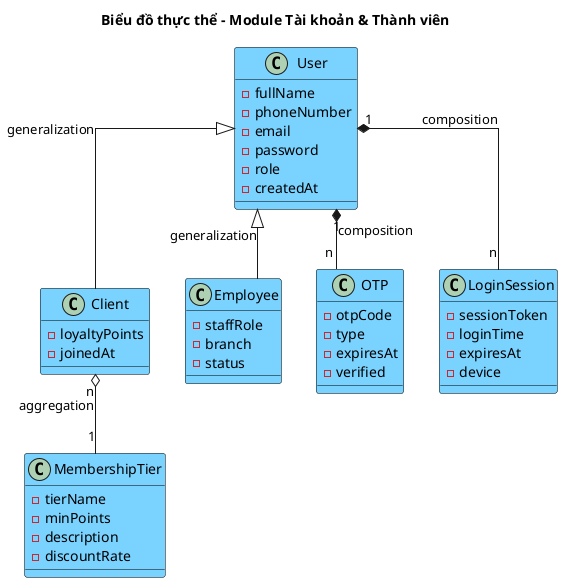
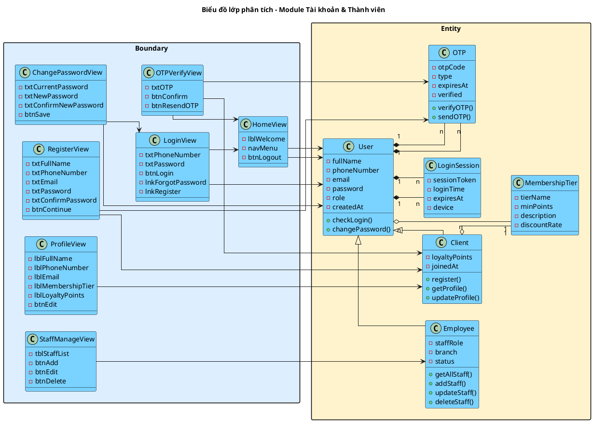
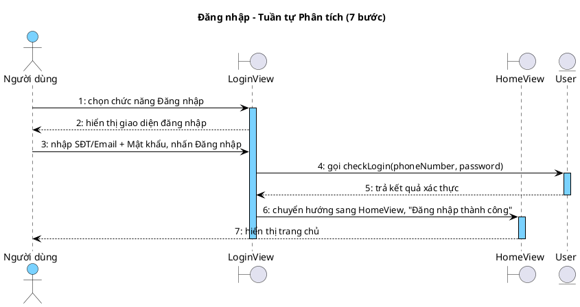
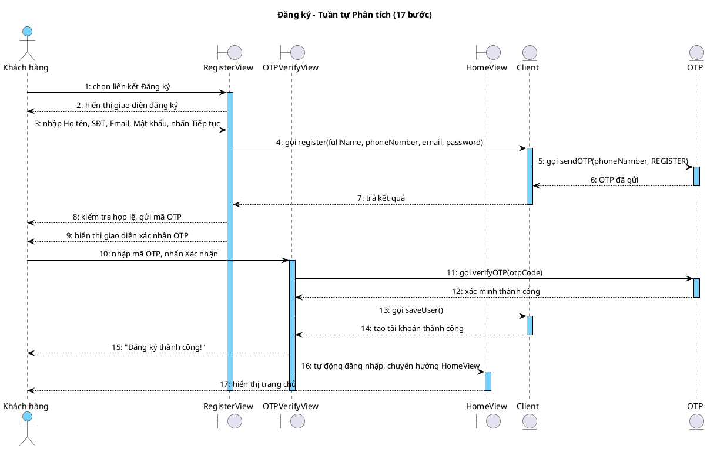
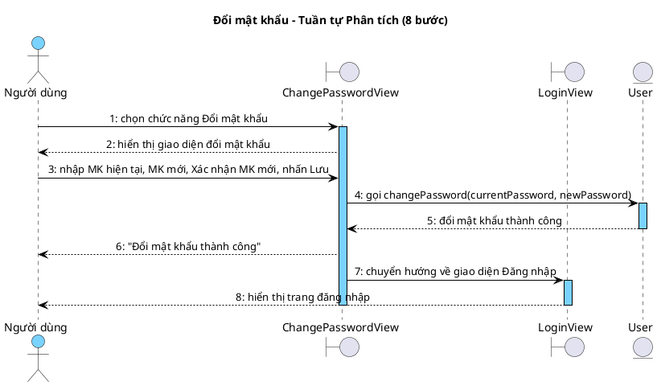
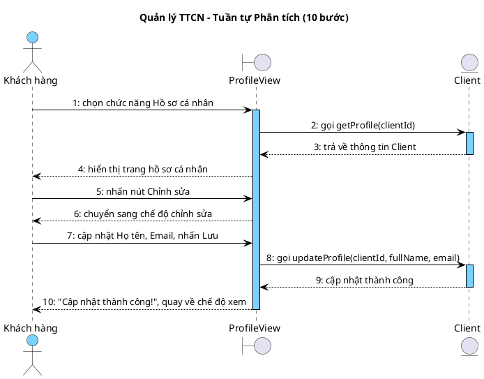
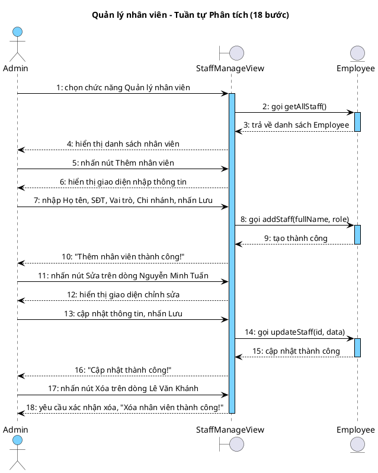

## II. PHA PHÂN TÍCH

### 1. Kịch bản chuẩn

#### UC01 – Đăng nhập

| Trường | Nội dung |
|---|---|
| **Use case** | Đăng nhập |
| **Actor** | Khách hàng, Nhân viên |
| **Tiền điều kiện** | Người dùng chưa đăng nhập. Tài khoản đã tồn tại trong hệ thống. |
| **Hậu điều kiện** | Người dùng được xác thực, chuyển hướng đến trang chủ. |
| **Kịch bản chính** | 1. Người dùng chọn chức năng "Đăng nhập". 2. Hệ thống hiển thị giao diện đăng nhập có ô nhập SĐT/Email, ô nhập Mật khẩu, nút Đăng nhập, liên kết "Quên mật khẩu?" và "Đăng ký". 3. Người dùng nhập SĐT/Email và Mật khẩu. 4. Người dùng nhấn nút Đăng nhập. 5. Hệ thống xác thực thành công, chuyển hướng đến trang chủ và hiển thị thông báo "Đăng nhập thành công". |
| **Ngoại lệ** | 4. Hệ thống thông báo "Tài khoản không tồn tại". 4.1 Người dùng chọn liên kết "Đăng ký" (chuyển sang UC02).  4. Hệ thống thông báo "Sai mật khẩu". 4.1 Người dùng nhập lại mật khẩu (quay về Bước 4). |

#### UC02 – Đăng ký

| Trường | Nội dung |
|---|---|
| **Use case** | Đăng ký |
| **Actor** | Khách hàng |
| **Tiền điều kiện** | Người dùng chưa có tài khoản. |
| **Hậu điều kiện** | Tài khoản mới được tạo, đăng nhập tự động. |
| **Kịch bản chính** | 1. Người dùng chọn liên kết "Đăng ký" từ giao diện đăng nhập. 2. Hệ thống hiển thị giao diện đăng ký có ô nhập Họ tên, SĐT, Email, Mật khẩu, Xác nhận mật khẩu, nút Tiếp tục. 3. Người dùng nhập Họ tên, SĐT, Email, Mật khẩu, Xác nhận mật khẩu. 4. Người dùng nhấn nút Tiếp tục. 5. Hệ thống kiểm tra thông tin hợp lệ, gửi mã OTP 6 chữ số đến SĐT. 6. Hệ thống hiển thị giao diện xác nhận OTP có ô nhập mã OTP, nút Xác nhận, nút Gửi lại mã. 7. Người dùng nhập mã OTP và nhấn nút Xác nhận. 8. Hệ thống tạo tài khoản mới, tự động đăng nhập và hiển thị thông báo "Đăng ký thành công!". |
| **Ngoại lệ** | 5. Hệ thống thông báo "SĐT hoặc Email đã được sử dụng". 5.1 Người dùng nhập lại thông tin khác (quay về Bước 4).  7. Hệ thống thông báo "Mã OTP không hợp lệ hoặc đã hết hạn". 7.1 Người dùng nhấn nút Gửi lại mã (quay về Bước 6). |

#### UC03 – Đổi mật khẩu

| Trường | Nội dung |
|---|---|
| **Use case** | Đổi mật khẩu |
| **Actor** | Khách hàng, Nhân viên (đã đăng nhập) |
| **Tiền điều kiện** | Người dùng đã đăng nhập. |
| **Hậu điều kiện** | Mật khẩu mới được lưu. Tất cả phiên đăng nhập khác bị thu hồi. |
| **Kịch bản chính** | 1. Người dùng chọn chức năng "Đổi mật khẩu". 2. Hệ thống hiển thị giao diện có ô nhập Mật khẩu hiện tại, Mật khẩu mới, Xác nhận mật khẩu mới, nút Lưu thay đổi. 3. Người dùng nhập Mật khẩu hiện tại, Mật khẩu mới, Xác nhận mật khẩu mới. 4. Người dùng nhấn nút Lưu thay đổi. 5. Hệ thống cập nhật mật khẩu, thu hồi các phiên khác, hiển thị thông báo "Đổi mật khẩu thành công. Vui lòng đăng nhập lại." và chuyển hướng về giao diện đăng nhập. |
| **Ngoại lệ** | 4. Hệ thống thông báo "Mật khẩu hiện tại không chính xác". 4.1 Người dùng nhập lại mật khẩu hiện tại (quay về Bước 4).  4. Hệ thống thông báo "Mật khẩu mới không hợp lệ". 4.1 Người dùng nhập lại mật khẩu mới (quay về Bước 4). |

#### UC04 – Quản lý thông tin cá nhân

| Trường | Nội dung |
|---|---|
| **Use case** | Quản lý thông tin cá nhân |
| **Actor** | Khách hàng (đã đăng nhập) |
| **Tiền điều kiện** | Khách hàng đã đăng nhập. |
| **Hậu điều kiện** | Thông tin cá nhân được cập nhật. |
| **Kịch bản chính** | 1. Khách hàng chọn chức năng "Hồ sơ cá nhân". 2. Hệ thống hiển thị trang hồ sơ cá nhân: <table><tr><th>Họ tên</th><th>SĐT</th><th>Email</th><th>Hạng hội viên</th><th>Điểm tích lũy</th><th>Ngày tham gia</th></tr><tr><td>Nguyễn Văn A</td><td>0912345678</td><td>nva@gmail.com</td><td>Bạc</td><td>1.250</td><td>15/03/2025</td></tr></table> 3. Khách hàng nhấn nút Chỉnh sửa. 4. Hệ thống chuyển sang chế độ chỉnh sửa: Họ tên và Email cho phép sửa, SĐT bị khóa. 5. Khách hàng cập nhật Họ tên và Email. 6. Khách hàng nhấn nút Lưu thay đổi. 7. Hệ thống hiển thị thông báo "Cập nhật thành công!" và quay về chế độ xem. |
| **Ngoại lệ** | 6. Hệ thống thông báo "Email không hợp lệ hoặc đã được sử dụng". 6.1 Khách hàng nhập lại email khác (quay về Bước 6). |

#### UC20 – Quản lý tài khoản nhân viên

| Trường | Nội dung |
|---|---|
| **Use case** | Quản lý tài khoản nhân viên |
| **Actor** | Chủ Doanh nghiệp (Admin) |
| **Tiền điều kiện** | Admin đã đăng nhập với quyền quản lý nhân viên. |
| **Hậu điều kiện** | Tài khoản nhân viên được tạo/sửa/xóa. |
| **Kịch bản chính** | 1. Admin chọn chức năng "Quản lý nhân viên". 2. Hệ thống hiển thị danh sách nhân viên: <table><tr><th>Họ tên</th><th>Vai trò</th><th>Chi nhánh</th><th>Trạng thái</th></tr><tr><td>Nguyễn Minh Tuấn</td><td>Lễ tân</td><td>Karaoke Star - CN1</td><td>Đang làm</td></tr><tr><td>Trần Thị Hương</td><td>Phục vụ</td><td>Karaoke Star - CN2</td><td>Đang làm</td></tr><tr><td>Lê Văn Khánh</td><td>Quản lý</td><td>Karaoke Star - CN1</td><td>Đang làm</td></tr></table> 3. Admin nhấn nút Thêm nhân viên. 4. Hệ thống hiển thị giao diện nhập Họ tên, SĐT, Vai trò, Chi nhánh. 5. Admin nhập thông tin và nhấn nút Lưu. 6. Hệ thống kiểm tra thông tin hợp lệ, tạo tài khoản nhân viên mới. 7. Hệ thống hiển thị thông báo "Thêm nhân viên thành công!" và cập nhật danh sách. 8. Admin nhấn nút Sửa trên dòng nhân viên Nguyễn Minh Tuấn. 9. Hệ thống hiển thị giao diện chỉnh sửa với thông tin hiện tại. 10. Admin cập nhật thông tin và nhấn nút Lưu. 11. Hệ thống hiển thị thông báo "Cập nhật thành công!". 12. Admin nhấn nút Xóa trên dòng nhân viên Lê Văn Khánh. 13. Hệ thống yêu cầu xác nhận xóa. 14. Admin xác nhận xóa, hệ thống hiển thị thông báo "Xóa nhân viên thành công!". |
| **Ngoại lệ** | 6. Hệ thống thông báo "SĐT đã được sử dụng". 6.1 Admin nhập lại SĐT khác (quay về Bước 5).  14. Hệ thống thông báo "Không thể xóa nhân viên đang xử lý order". 14.1 Admin hủy thao tác xóa. |

### 2. Mô hình hóa lớp

**Bước 1 – Mô tả chức năng bằng đoạn văn xuôi**

Module Tài khoản & Thành viên quản lý toàn bộ người dùng trong hệ thống chuỗi nhà hàng karaoke. Hệ thống có ba loại người dùng: khách hàng, nhân viên và chủ doanh nghiệp. Tất cả đều cần một tài khoản để đăng nhập vào hệ thống, mỗi tài khoản có số điện thoại (dùng làm tên đăng nhập), email, mật khẩu đã mã hóa và vai trò (khách hàng, nhân viên, admin).

Khách hàng có thể tự đăng ký tài khoản mới bằng cách cung cấp họ tên, số điện thoại, email và mật khẩu. Hệ thống gửi mã OTP 6 chữ số đến số điện thoại để xác minh trước khi tạo tài khoản. Sau khi đăng ký, khách hàng được xếp vào hạng hội viên "Thường" với điểm tích lũy bằng 0. Mỗi khách hàng thuộc về một hạng hội viên (Thường, Bạc, Vàng, Kim Cương) dựa trên điểm tích lũy. Hạng hội viên định nghĩa ngưỡng điểm tối thiểu, mô tả và hệ số ưu đãi. Khách hàng có thể xem hồ sơ cá nhân (họ tên, số điện thoại, email, hạng hội viên, điểm tích lũy, ngày tham gia) và cập nhật họ tên, email.

Nhân viên được tạo bởi chủ doanh nghiệp. Mỗi nhân viên có họ tên, vai trò (Lễ tân, Phục vụ, Quản lý), chi nhánh làm việc và trạng thái (Đang làm, Đã nghỉ). Nhân viên không thể tự đăng ký mà phải do admin tạo tài khoản.

Tất cả người dùng (khách hàng, nhân viên) đều có thể đổi mật khẩu bằng cách xác minh mật khẩu hiện tại rồi nhập mật khẩu mới. Sau khi đổi mật khẩu, tất cả phiên đăng nhập khác bị thu hồi để đảm bảo bảo mật.

Hệ thống ghi nhận các phiên đăng nhập (token, thời gian đăng nhập, thời gian hết hạn, thiết bị) để phục vụ bảo mật và quản lý truy cập. Mỗi lần người dùng đăng nhập trên thiết bị mới sẽ tạo một phiên đăng nhập mới.

Chủ doanh nghiệp (admin) có quyền quản lý tài khoản nhân viên toàn hệ thống: xem danh sách, thêm mới, chỉnh sửa và xóa (chuyển trạng thái "Đã nghỉ"). Không thể xóa nhân viên đang xử lý đơn hàng.

**Bước 2 + 3 – Trích danh từ và đánh giá**

▪ Hệ thống → loại: quá chung, không phải thực thể nghiệp vụ
▪ Người dùng → lớp User: đây là lớp gốc cho MỌI người dùng trong hệ thống (khách hàng, nhân viên, admin đều có tài khoản User). Thuộc tính: fullName, phoneNumber, email, password, role, createdAt
▪ Tài khoản → thuộc về User (gộp vào User, tránh tách thừa)
▪ Họ tên → thuộc tính fullName của User
▪ Số điện thoại → thuộc tính phoneNumber của User (dùng làm tên đăng nhập)
▪ Email → thuộc tính email của User
▪ Mật khẩu → thuộc tính password của User (lưu dạng mã hóa)
▪ Vai trò → thuộc tính role của User (CLIENT, EMPLOYEE, ADMIN)
▪ Ngày tạo → thuộc tính createdAt của User
▪ Khách hàng → lớp Client: KẾ THỪA từ User. Khách hàng là người dùng có vai trò CLIENT, có thêm thông tin về thành viên. Thuộc tính riêng: loyaltyPoints, joinedAt
▪ Hạng hội viên → lớp MembershipTier: tierName, minPoints, description, discountRate. Đây là dữ liệu danh mục (lookup table), tồn tại độc lập.
▪ Điểm tích lũy → thuộc tính loyaltyPoints của Client
▪ Ngày tham gia → thuộc tính joinedAt của Client
▪ Mã OTP → lớp OTP: otpCode, type, expiresAt, verified. OTP gắn với User (mỗi lần đăng ký/đổi SĐT tạo OTP mới).
▪ Phiên đăng nhập → lớp LoginSession: sessionToken, loginTime, expiresAt, device. LoginSession gắn với User.
▪ Nhân viên → lớp Employee: KẾ THỪA từ User. Nhân viên là người dùng có vai trò EMPLOYEE, có thêm thông tin về công việc. Thuộc tính riêng: staffRole, branch, status
▪ Vai trò nhân viên → thuộc tính staffRole của Employee (Lễ tân, Phục vụ, Quản lý)
▪ Chi nhánh → thuộc tính branch của Employee (tên chi nhánh, không tách riêng vì Chi nhánh thuộc module khác)
▪ Trạng thái nhân viên → thuộc tính status của Employee (Đang làm, Đã nghỉ)
▪ Chủ doanh nghiệp → loại: actor (admin), là một User có vai trò ADMIN, không cần lớp riêng
▪ Danh sách → loại: không phải thực thể
▪ Giao diện → loại: là Boundary, không phải Entity

**Bước 4 – Xác định quan hệ số lượng**

▪ User là lớp cha, Client kế thừa từ User → User – Client: 1 – 1 (generalization)
(mỗi User có vai trò CLIENT thì tương ứng 1 Client)
▪ User là lớp cha, Employee kế thừa từ User → User – Employee: 1 – 1 (generalization)
(mỗi User có vai trò EMPLOYEE thì tương ứng 1 Employee)
▪ 1 Client có 1 MembershipTier → Client – MembershipTier: n – 1
(nhiều khách hàng có thể có cùng hạng hội viên)
▪ 1 User có nhiều OTP → User – OTP: 1 – n
(mỗi lần đăng ký/đổi SĐT tạo 1 OTP mới)
▪ 1 User có nhiều LoginSession → User – LoginSession: 1 – n
(người dùng có thể đăng nhập trên nhiều thiết bị)
▪ Client và Employee không có quan hệ trực tiếp với nhau
(cả hai đều kế thừa từ User nhưng phục vụ mục đích khác nhau)

**Bước 5 – Bổ sung quan hệ**

▪ User gắn composition với OTP: OTP không tồn tại độc lập nếu không có User (khi xóa User thì xóa theo tất cả OTP).
▪ User gắn composition với LoginSession: LoginSession không tồn tại độc lập khỏi User.
▪ Client gắn aggregation với MembershipTier: MembershipTier là dữ liệu danh mục tồn tại độc lập, nhiều Client có thể thuộc cùng 1 hạng.
▪ Client và Employee kế thừa (generalization) từ User: cả hai đều có các thuộc tính chung của User (fullName, phoneNumber, email, password) plus các thuộc tính riêng.

**Biểu đồ thực thể Module Tài khoản & Thành viên:**

<!-- PLACEHOLDER: account_entity_analysis -->

### 3. Biểu đồ lớp phân tích

**Phân tích chi tiết chức năng "Đăng nhập":**

Người dùng truy cập trang đăng nhập -> đề xuất lớp **LoginView**, có ô nhập SĐT, ô nhập mật khẩu, nút Đăng nhập.

Người dùng nhập SĐT, mật khẩu và nhấn nút Đăng nhập -> hệ thống cần xác thực tài khoản -> cần chức năng `checkLogin()` của đối tượng **User**.

Nếu tài khoản không tồn tại -> hệ thống hiển thị thông báo lỗi.
Nếu mật khẩu sai -> hệ thống hiển thị thông báo lỗi.

Hoàn tất, hệ thống tạo phiên đăng nhập và chuyển hướng sang HomeView.

**Boundary:** LoginView, HomeView
**Entity:** User

**Phân tích chi tiết chức năng "Đăng ký":**

Người dùng truy cập trang đăng ký -> đề xuất lớp **RegisterView**, có ô nhập Họ tên, SĐT, Email, Mật khẩu, Xác nhận MK, nút Tiếp tục.

Người dùng nhập thông tin và nhấn nút Tiếp tục -> hệ thống cần tạo tài khoản khách hàng mới -> cần chức năng `register()` của đối tượng **Client**.

Hệ thống gửi OTP đến SĐT -> đề xuất lớp **OTPVerifyView**, có ô nhập OTP, nút Xác nhận.

Người dùng nhập OTP và nhấn nút Xác nhận -> hệ thống cần xác minh OTP -> cần chức năng `verifyOTP()` của đối tượng **OTP**.

Hoàn tất, hệ thống tạo tài khoản mới và tự động đăng nhập.

**Boundary:** RegisterView, OTPVerifyView
**Entity:** Client, OTP

**Phân tích chi tiết chức năng "Đổi mật khẩu":**

Người dùng truy cập trang bảo mật -> đề xuất lớp **ChangePasswordView**, có ô nhập MK hiện tại, MK mới, Xác nhận MK mới, nút Lưu.

Người dùng nhập MK hiện tại, MK mới và nhấn nút Lưu -> hệ thống cần đổi mật khẩu -> cần chức năng `changePassword()` của đối tượng **User**.

Nếu MK hiện tại sai -> hệ thống hiển thị thông báo lỗi.
Nếu MK mới không hợp lệ -> hệ thống hiển thị thông báo lỗi.

Hoàn tất, hệ thống cập nhật mật khẩu mới, thu hồi tất cả phiên đăng nhập khác và chuyển hướng về LoginView.

**Boundary:** ChangePasswordView, LoginView
**Entity:** User

**Phân tích chi tiết chức năng "Quản lý thông tin cá nhân":**

Người dùng nhấn vào ảnh đại diện -> đề xuất lớp **ProfileView**, có hiển thị Họ tên, SĐT, Email, Hạng hội viên, Điểm tích lũy, nút Chỉnh sửa.

Hệ thống cần lấy thông tin hồ sơ -> cần chức năng `getProfile()` của đối tượng **Client**.

Người dùng nhấn Chỉnh sửa, sửa thông tin và nhấn Lưu -> hệ thống cần cập nhật hồ sơ -> cần chức năng `updateProfile()` của đối tượng **Client**.

Nếu email không hợp lệ hoặc đã được dùng -> hệ thống hiển thị thông báo lỗi.

Hoàn tất, hệ thống cập nhật hồ sơ vào CSDL.

**Boundary:** ProfileView
**Entity:** Client

**Phân tích chi tiết chức năng "Quản lý nhân viên":**

Admin truy cập trang quản lý nhân viên -> đề xuất lớp **StaffManageView**, có bảng danh sách nhân viên, nút Thêm, Sửa, Xóa.

Hệ thống cần tải danh sách nhân viên -> cần chức năng `getAllStaff()` của đối tượng **Employee**.

Admin nhấn Thêm, nhập thông tin và nhấn Lưu -> hệ thống cần tạo nhân viên mới -> cần chức năng `addStaff()` của đối tượng **Employee**.

Admin nhấn Sửa trên một dòng, cập nhật và nhấn Lưu -> hệ thống cần cập nhật nhân viên -> cần chức năng `updateStaff()` của đối tượng **Employee**.

Admin nhấn Xóa trên một dòng, xác nhận -> hệ thống cần xóa nhân viên -> cần chức năng `deleteStaff()` của đối tượng **Employee**.

Nếu nhân viên đang xử lý order -> hệ thống hiển thị thông báo lỗi.

Hoàn tất, hệ thống cập nhật danh sách nhân viên.

**Boundary:** StaffManageView
**Entity:** Employee

**Sơ đồ lớp phân tích – Module Tài khoản & Thành viên:**

<!-- PLACEHOLDER: account_class_analysis -->

### 4. Biểu đồ tuần tự phân tích

#### UC01 – Đăng nhập (7 bước)

<!-- PLACEHOLDER: account_seq_login_analysis -->

**Kịch bản phiên bản 2 – UC01 Đăng nhập (7 bước)**

1. Người dùng chọn chức năng Đăng nhập.
2. Lớp LoginView hiển thị giao diện đăng nhập.
3. Người dùng nhập SĐT/Email + Mật khẩu, nhấn Đăng nhập.
4. Lớp LoginView gọi checkLogin(phoneNumber, password).
5. Lớp User trả kết quả xác thực.
6. Lớp LoginView chuyển hướng sang HomeView, "Đăng nhập thành công".
7. Lớp HomeView hiển thị trang chủ.

#### UC02 – Đăng ký (17 bước)

<!-- PLACEHOLDER: account_seq_register_analysis -->

**Kịch bản phiên bản 2 – UC02 Đăng ký (17 bước)**

1. Khách hàng chọn liên kết Đăng ký.
2. Lớp RegisterView hiển thị giao diện đăng ký.
3. Khách hàng nhập Họ tên, SĐT, Email, Mật khẩu, nhấn Tiếp tục.
4. Lớp RegisterView gọi register(fullName, phoneNumber, email, password).
5. Lớp Client gọi sendOTP(phoneNumber, REGISTER).
6. Lớp OTP OTP đã gửi.
7. Lớp Client trả kết quả.
8. Lớp RegisterView kiểm tra hợp lệ, gửi mã OTP.
9. Lớp RegisterView hiển thị giao diện xác nhận OTP.
10. Khách hàng nhập mã OTP, nhấn Xác nhận.
11. Lớp OTPVerifyView gọi verifyOTP(otpCode).
12. Lớp OTP xác minh thành công.
13. Lớp OTPVerifyView gọi saveUser().
14. Lớp Client tạo tài khoản thành công.
15. Lớp OTPVerifyView "Đăng ký thành công!".
16. Lớp OTPVerifyView tự động đăng nhập, chuyển hướng HomeView.
17. Lớp HomeView hiển thị trang chủ.

#### UC03 – Đổi mật khẩu (8 bước)

<!-- PLACEHOLDER: account_seq_changepw_analysis -->

**Kịch bản phiên bản 2 – UC03 Đổi mật khẩu (8 bước)**

1. Người dùng chọn chức năng Đổi mật khẩu.
2. Lớp ChangePasswordView hiển thị giao diện đổi mật khẩu.
3. Người dùng nhập MK hiện tại, MK mới, Xác nhận MK mới, nhấn Lưu.
4. Lớp ChangePasswordView gọi changePassword(currentPassword, newPassword).
5. Lớp User đổi mật khẩu thành công.
6. Lớp ChangePasswordView "Đổi mật khẩu thành công".
7. Lớp ChangePasswordView chuyển hướng về giao diện Đăng nhập.
8. Lớp LoginView hiển thị trang đăng nhập.

#### UC04 – Quản lý thông tin cá nhân (10 bước)

<!-- PLACEHOLDER: account_seq_profile_analysis -->

**Kịch bản phiên bản 2 – UC04 Quản lý thông tin cá nhân (10 bước)**

1. Khách hàng chọn chức năng Hồ sơ cá nhân.
2. Lớp ProfileView gọi getProfile(clientId).
3. Lớp Client trả về thông tin Client.
4. Lớp ProfileView hiển thị trang hồ sơ cá nhân.
5. Khách hàng nhấn nút Chỉnh sửa.
6. Lớp ProfileView chuyển sang chế độ chỉnh sửa.
7. Khách hàng cập nhật Họ tên, Email, nhấn Lưu.
8. Lớp ProfileView gọi updateProfile(clientId, fullName, email).
9. Lớp Client cập nhật thành công.
10. Lớp ProfileView "Cập nhật thành công!", quay về chế độ xem.

#### UC20 – Quản lý tài khoản nhân viên (18 bước)

<!-- PLACEHOLDER: account_seq_staff_analysis -->

**Kịch bản phiên bản 2 – UC20 Quản lý tài khoản nhân viên (18 bước)**

1. Admin chọn chức năng Quản lý nhân viên.
2. Lớp StaffManageView gọi getAllStaff().
3. Lớp Employee trả về danh sách Employee.
4. Lớp StaffManageView hiển thị danh sách nhân viên.
5. Admin nhấn nút Thêm nhân viên.
6. Lớp StaffManageView hiển thị giao diện nhập thông tin.
7. Admin nhập Họ tên, SĐT, Vai trò, Chi nhánh, nhấn Lưu.
8. Lớp StaffManageView gọi addStaff(fullName, role).
9. Lớp Employee tạo thành công.
10. Lớp StaffManageView "Thêm nhân viên thành công!".
11. Admin nhấn nút Sửa trên dòng Nguyễn Minh Tuấn.
12. Lớp StaffManageView hiển thị giao diện chỉnh sửa.
13. Admin cập nhật thông tin, nhấn Lưu.
14. Lớp StaffManageView gọi updateStaff(id, data).
15. Lớp Employee cập nhật thành công.
16. Lớp StaffManageView "Cập nhật thành công!".
17. Admin nhấn nút Xóa trên dòng Lê Văn Khánh.
18. Lớp StaffManageView yêu cầu xác nhận xóa, "Xóa nhân viên thành công!".
