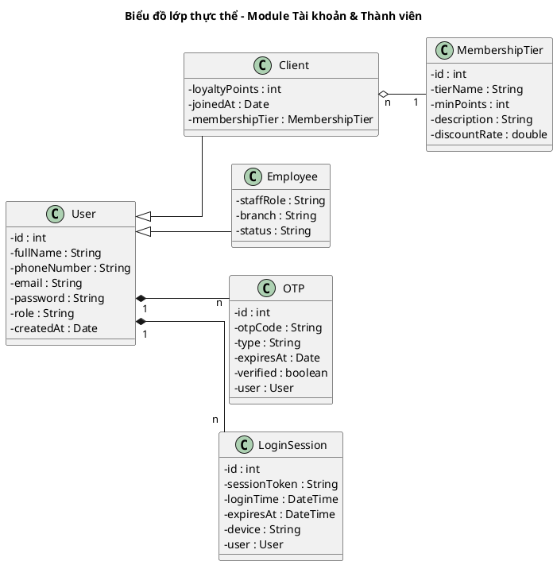
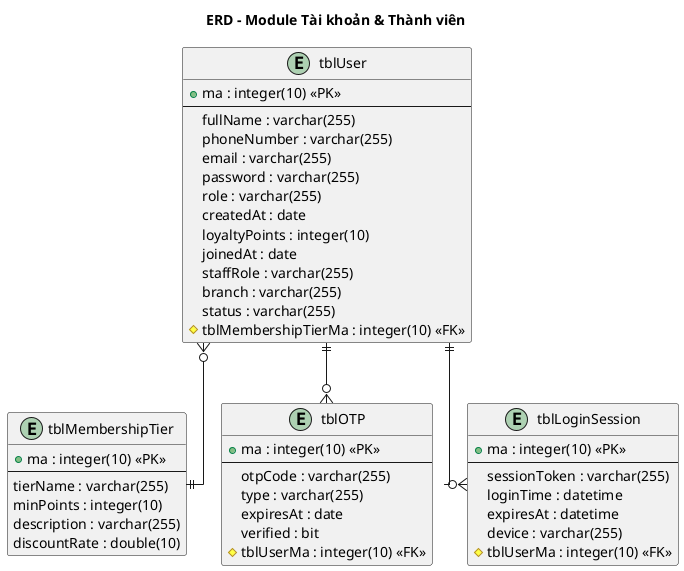
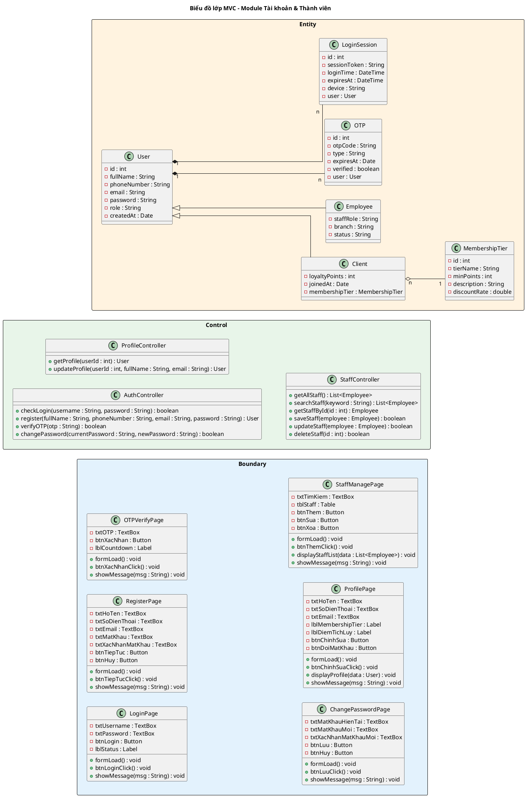
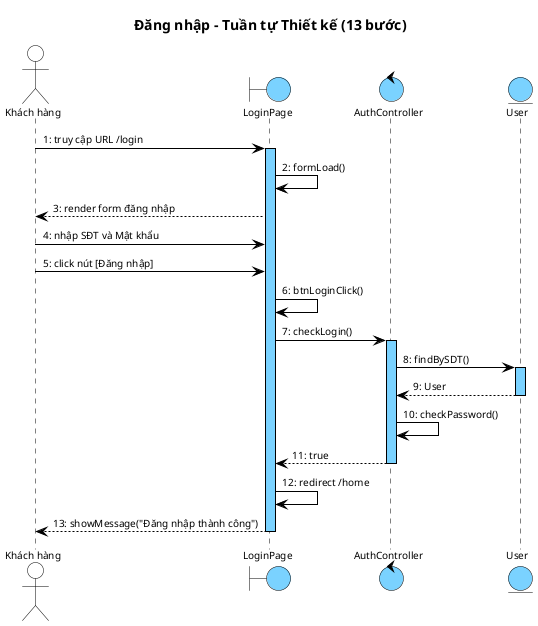
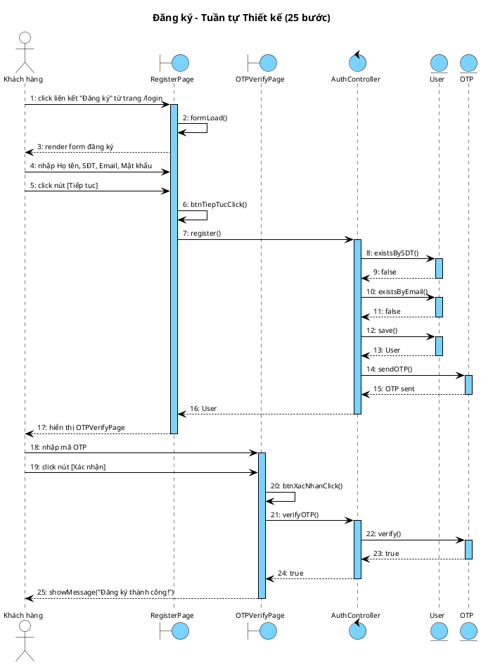
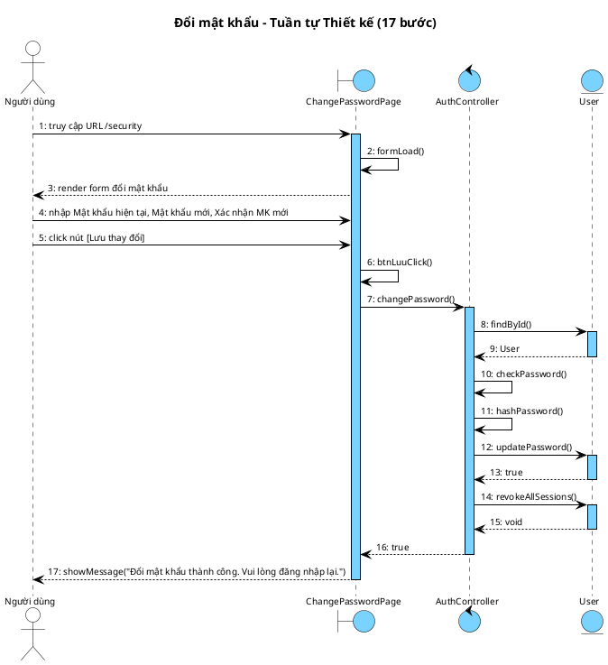
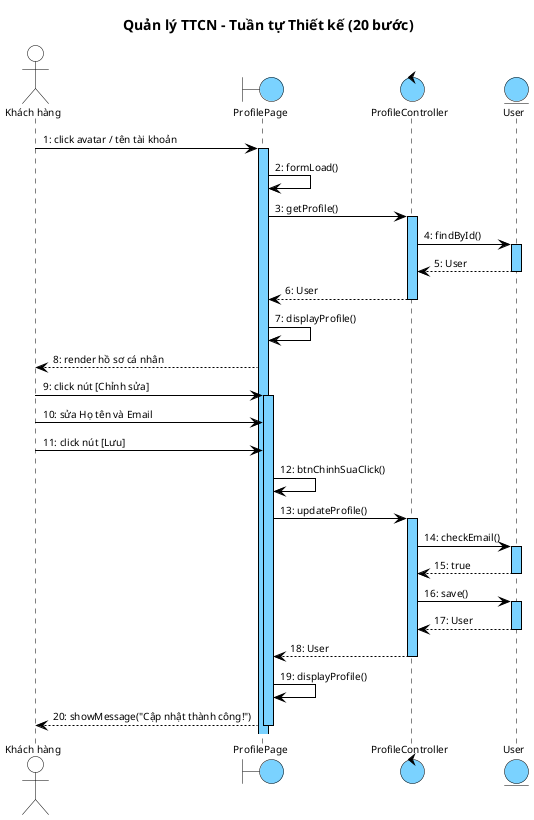
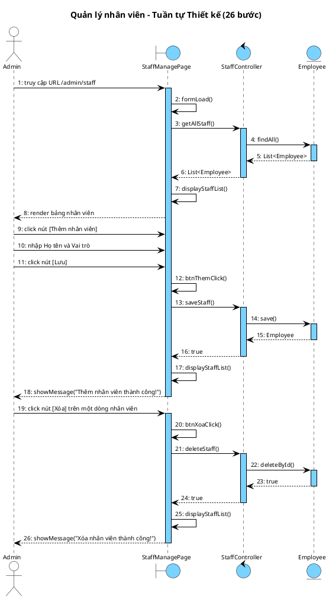

## III. PHA THIẾT KẾ

### 1. Thiết kế lớp thực thể

#### 1.1. Bước 1 – Bổ sung thuộc tính id

- `User`: `id : int` — lớp gốc; `Client` và `Employee` kế thừa `id` này
- `MembershipTier`: `id : int`
- `OTP`: `id : int`
- `LoginSession`: `id : int`

#### 1.2. Bước 2 – Thêm kiểu dữ liệu

- `User` (lớp cha): `id : int`, `fullName : String`, `phoneNumber : String`, `email : String`, `password : String`, `role : String`, `createdAt : Date`
- `Client` (kế thừa `User`): `loyaltyPoints : int`, `joinedAt : Date`
- `Employee` (kế thừa `User`): `staffRole : String`, `branch : String`, `status : String`
- `MembershipTier`: `id : int`, `tierName : String`, `minPoints : int`, `description : String`, `discountRate : double`
- `OTP`: `id : int`, `otpCode : String`, `type : String`, `expiresAt : Date`, `verified : boolean`
- `LoginSession`: `id : int`, `sessionToken : String`, `loginTime : DateTime`, `expiresAt : DateTime`, `device : String`

#### 1.3. Bước 3 – Chuyển quan hệ

- `Client` kế thừa `User`: generalization (khách hàng là `User` có vai trò CLIENT)
- `Employee` kế thừa `User`: generalization (nhân viên là `User` có vai trò EMPLOYEE)
- `Client` `o--` `MembershipTier`: aggregation (hạng hội viên là danh mục độc lập, chỉ khách hàng có)
- `User` `*--` `OTP`: composition (OTP không tồn tại độc lập)
- `User` `*--` `LoginSession`: composition (phiên không tồn tại độc lập)

#### 1.4. Bước 4 – Bổ sung thuộc tính kiểu đối tượng

- `Client`: `membershipTier : MembershipTier`
- `OTP`: `user : User`
- `LoginSession`: `user : User`

#### 1.5. Biểu đồ lớp thực thể

<!-- PLACEHOLDER: account_entity_class -->
<!-- File: output/diagrams/account_entity_class.png -->



### 2. Thiết kế CSDL

#### 2.1. Bước 1 – Tạo bảng

Ánh xạ kế thừa kiểu **single-table**: gộp `User`, `Client`, `Employee` vào một bảng `tblUser`, dùng cột `role` để phân biệt; thuộc tính riêng của `Client`/`Employee` để `NULL` khi không áp dụng.

| Lớp thực thể | Tên bảng |
|--------------|----------|
| User, Client, Employee (kế thừa) | tblUser |
| MembershipTier | tblMembershipTier |
| OTP | tblOTP |
| LoginSession | tblLoginSession |

#### 2.2. Bước 2 – Chuyển kiểu dữ liệu

| Kiểu Java | Kiểu SQL |
|-----------|----------|
| int | integer(10) |
| String | varchar(255) |
| double | double(10) |
| Date | date |
| DateTime | datetime |
| boolean | bit |

#### 2.3. Bước 3 – Xử lý cardinality

- `Client` – `MembershipTier` (n-1): `tblUser` có FK `tblMembershipTierMa` (chỉ dòng `role = CLIENT` dùng, NULL với dòng khác)
- `User` – `OTP` (1-n): `tblOTP` có FK `tblUserMa`
- `User` – `LoginSession` (1-n): `tblLoginSession` có FK `tblUserMa`

#### 2.4. Bước 4 – PK/FK

- PK: `ma : integer(10) <<PK>>`
- FK: `tbl[TenBangCha]Ma : integer(10) <<FK>>`
- Cột `role` (`CLIENT` / `EMPLOYEE` / `ADMIN`) phân biệt loại người dùng trong bảng `tblUser` gộp

#### 2.5. Biểu đồ ERD

<!-- PLACEHOLDER: account_erd -->
<!-- File: output/diagrams/account_erd.png -->



### 3. Wireframe

#### 3.1. Màn hình đăng nhập

<!-- PLACEHOLDER: WIREFRAMES -->
<!-- Wireframes sẽ được render thành monospace frames trong DOCX -->

```
┌──────────────────────────────────────────────┐
│               Đăng nhập                      │
│                                              │
│  txtPhoneNumber: [_______________________]   │
│  txtPassword:    [_______________________]   │
│                                              │
│  [btnLogin]                                  │
│  lnkForgotPassword  |  lnkRegister           │
└──────────────────────────────────────────────┘
```

#### 3.2. Màn hình đăng ký

```
┌──────────────────────────────────────────────┐
│           Đăng ký tài khoản                  │
│                                              │
│  txtFullName:        [___________________]   │
│  txtPhoneNumber:     [___________________]   │
│  txtEmail:           [___________________]   │
│  txtPassword:        [___________________]   │
│  txtConfirmPassword: [___________________]   │
│                                              │
│  [btnContinue]               [Cancel]        │
└──────────────────────────────────────────────┘
```

#### 3.3. Màn hình xác nhận OTP

```
┌──────────────────────────────────────────────┐
│           Xác nhận OTP                       │
│                                              │
│  txtOTP: [__][__][__][__][__][__]            │
│                                              │
│  [btnConfirm]                                │
│  btnResendOTP                                │
└──────────────────────────────────────────────┘
```

#### 3.4. Màn hình đổi mật khẩu

```
┌──────────────────────────────────────────────┐
│           Đổi mật khẩu                       │
│                                              │
│  txtCurrentPassword:    [________________]   │
│  txtNewPassword:        [________________]   │
│  txtConfirmNewPassword: [________________]   │
│                                              │
│  [btnSave]                   [Cancel]        │
└──────────────────────────────────────────────┘
```

#### 3.5. Màn hình hồ sơ cá nhân

```
┌──────────────────────────────────────────────┐
│           Hồ sơ cá nhân                      │
│                                              │
│  lblFullName:       [_____________________]  │
│  lblPhoneNumber:    [__________] (readonly)  │
│  lblEmail:          [_____________________]  │
│  lblMembershipTier: [Bạc      ] (readonly)   │
│  lblLoyaltyPoints:  [1250     ] (readonly)   │
│                                              │
│  [btnEdit]    [btnChangePassword]            │
└──────────────────────────────────────────────┘
```

#### 3.6. Màn hình quản lý nhân viên

```
┌──────────────────────────────────────────────┐
│        Quản lý tài khoản nhân viên           │
│                                              │
│  [btnAdd]                                    │
│                                              │
│ ┌──────────┬───────────┬──────────┐          │
│ │ fullName │ staffRole │ status   │          │
│ │ ........ │ ......... │ ........ │          │
│ │ ........ │ ......... │ ........ │          │
│ └──────────┴───────────┴──────────┘          │
│              tblStaffList                    │
│                                              │
│  [btnEdit]    [btnDelete]                    │
└──────────────────────────────────────────────┘
```

### 4. MVC class diagram

#### 4.1. Tổng quan kiến trúc

Mô hình thiết kế theo kiến trúc MVC (Boundary – Control – Entity):

**Boundary:** LoginPage, RegisterPage, OTPVerifyPage, ChangePasswordPage, ProfilePage, StaffManagePage

**Control:** AuthController, ProfileController, StaffController

**Entity:** User, Client, Employee, MembershipTier, OTP, LoginSession

#### 4.2. Quy trình xác định chữ ký hàm Controller

**a) Đăng nhập → `checkLogin()`**

- Input: username, password
- Output: boolean
- Ứng viên tham số vào: `checkLogin()` → chọn (gom nhóm tham số)
- Ứng viên tham số ra: `checkLogin(): boolean` → chọn (trả về true/false xác thực)

**b) Đăng ký → `register()`**

- Input: fullName, phoneNumber, email, password
- Output: User (vừa tạo)
- Ứng viên tham số vào: `register()` → chọn
- Ứng viên tham số ra: `register(): User` → chọn

**c) Xác minh OTP → `verifyOTP()`**

- Input: otp
- Output: boolean
- Ứng viên tham số vào: `verifyOTP()` → chọn
- Ứng viên tham số ra: `verifyOTP(): boolean` → chọn (cần biết đúng/sai)

**d) Đổi mật khẩu → `changePassword()`**

- Input: currentPassword, newPassword
- Output: boolean
- Ứng viên tham số vào: `changePassword()` → chọn
- Ứng viên tham số ra: `changePassword(): boolean` → chọn

**e) Xem hồ sơ → `getProfile()`**

- Input: userId
- Output: User
- Ứng viên tham số vào: `getProfile()` → chọn
- Ứng viên tham số ra: `getProfile(): User` → chọn

**f) Cập nhật hồ sơ → `updateProfile()`**

- Input: userId, fullName, email
- Output: User
- Ứng viên tham số vào: `updateProfile()` → chọn
- Ứng viên tham số ra: `updateProfile(): User` → chọn

**g) Xem danh sách NV → `getAllStaff()`**

- Input: (không có)
- Output: List\<Employee\>
- Ứng viên tham số vào: `getAllStaff()` → chọn
- Ứng viên tham số ra: `getAllStaff(): List<Employee>` → chọn

**h) Tìm kiếm NV → `searchStaff()`**

- Input: keyword
- Output: List\<Employee\>
- Ứng viên tham số vào: `searchStaff(keyword: String)` → chọn
- Ứng viên tham số ra: `searchStaff(): List<Employee>` → chọn

**i) Lấy NV theo id → `getStaffById()`**

- Input: id
- Output: Employee
- Ứng viên tham số vào: `getStaffById(id: int)` → chọn
- Ứng viên tham số ra: `getStaffById(): Employee` → chọn

**j) Thêm NV → `saveStaff()`**

- Input: employee
- Output: boolean
- Ứng viên tham số vào: `saveStaff(employee: Employee)` → chọn
- Ứng viên tham số ra: `saveStaff(): boolean` → chọn (cần biết thành công/thất bại)

**k) Sửa NV → `updateStaff()`**

- Input: employee
- Output: boolean
- Ứng viên tham số vào: `updateStaff()` → chọn
- Ứng viên tham số ra: `updateStaff(): boolean` → chọn

**l) Xóa NV → `deleteStaff()`**

- Input: id
- Output: boolean
- Ứng viên tham số vào: `deleteStaff()` → chọn
- Ứng viên tham số ra: `deleteStaff(): boolean` → chọn (cần biết thành công/thất bại)



<!-- PLACEHOLDER: account_dao_class -->
<!-- File: output/diagrams/account_mvc_class.png -->

### 5. Biểu đồ tuần tự thiết kế

#### 5.1. Đăng nhập

<!-- PLACEHOLDER: account_seq_login_design -->
<!-- File: output/diagrams/account_seq_login.png -->



**Kịch bản phiên bản 3 – UC01 Đăng nhập**

1. KH → LoginPage: truy cập URL /login.
2. LoginPage → LoginPage: formLoad().
3. LoginPage → KH: render form đăng nhập.
4. KH → LoginPage: nhập txtPhoneNumber và txtPassword.
5. KH → LoginPage: click btnLogin.
6. LoginPage → LoginPage: btnLoginClick().
7. LoginPage → AuthController: checkLogin().
8. AuthController → User: findBySDT().
9. User → AuthController: return User.
10. AuthController → AuthController: checkPassword().
11. AuthController → LoginPage: return true.
12. LoginPage → LoginPage: redirect /home.
13. LoginPage → KH: showMessage("Đăng nhập thành công").

#### 5.2. Đăng ký

<!-- PLACEHOLDER: account_seq_register_design -->
<!-- File: output/diagrams/account_seq_register.png -->



**Kịch bản phiên bản 3 – UC02 Đăng ký**

1. KH → RegisterPage: click lnkRegister từ trang /login.
2. RegisterPage → RegisterPage: formLoad().
3. RegisterPage → KH: render form đăng ký.
4. KH → RegisterPage: nhập txtFullName, txtPhoneNumber, txtEmail, txtPassword.
5. KH → RegisterPage: click btnContinue.
6. RegisterPage → RegisterPage: btnTiepTucClick().
7. RegisterPage → AuthController: register().
8. AuthController → User: existsBySDT().
9. User → AuthController: return false.
10. AuthController → User: existsByEmail().
11. User → AuthController: return false.
12. AuthController → User: save().
13. User → AuthController: return User.
14. AuthController → OTP: sendOTP().
15. OTP → AuthController: return OTP sent.
16. AuthController → RegisterPage: return User.
17. RegisterPage → KH: hiển thị OTPVerifyPage.
18. KH → OTPVerifyPage: nhập txtOTP.
19. KH → OTPVerifyPage: click btnConfirm.
20. OTPVerifyPage → OTPVerifyPage: btnXacNhanClick().
21. OTPVerifyPage → AuthController: verifyOTP().
22. AuthController → OTP: verify().
23. OTP → AuthController: return true.
24. AuthController → OTPVerifyPage: return true.
25. OTPVerifyPage → KH: showMessage("Đăng ký thành công!").

#### 5.3. Đổi mật khẩu

<!-- PLACEHOLDER: account_seq_changepw_design -->
<!-- File: output/diagrams/account_seq_changepw.png -->



**Kịch bản phiên bản 3 – UC03 Đổi mật khẩu**

1. Người dùng → ChangePasswordPage: truy cập URL /security.
2. ChangePasswordPage → ChangePasswordPage: formLoad().
3. ChangePasswordPage → Người dùng: render form đổi mật khẩu.
4. Người dùng → ChangePasswordPage: nhập txtCurrentPassword, txtNewPassword, txtConfirmNewPassword.
5. Người dùng → ChangePasswordPage: click btnSave.
6. ChangePasswordPage → ChangePasswordPage: btnLuuClick().
7. ChangePasswordPage → AuthController: changePassword().
8. AuthController → User: findById().
9. User → AuthController: return User.
10. AuthController → AuthController: checkPassword().
11. AuthController → AuthController: hashPassword().
12. AuthController → User: updatePassword().
13. User → AuthController: return true.
14. AuthController → User: revokeAllSessions().
15. User → AuthController: return void.
16. AuthController → ChangePasswordPage: return true.
17. ChangePasswordPage → Người dùng: showMessage("Đổi mật khẩu thành công. Vui lòng đăng nhập lại.").

#### 5.4. Quản lý TTCN

<!-- PLACEHOLDER: account_seq_profile_design -->
<!-- File: output/diagrams/account_seq_profile.png -->



**Kịch bản phiên bản 3 – UC04 Quản lý TTCN**

1. KH → ProfilePage: click avatar / tên tài khoản.
2. ProfilePage → ProfilePage: formLoad().
3. ProfilePage → ProfileController: getProfile().
4. ProfileController → User: findById().
5. User → ProfileController: return User.
6. ProfileController → ProfilePage: return User.
7. ProfilePage → ProfilePage: displayProfile().
8. ProfilePage → KH: render hồ sơ cá nhân.
9. KH → ProfilePage: click btnEdit.
10. KH → ProfilePage: sửa lblFullName và lblEmail.
11. KH → ProfilePage: click [Lưu].
12. ProfilePage → ProfilePage: btnChinhSuaClick().
13. ProfilePage → ProfileController: updateProfile().
14. ProfileController → User: checkEmail().
15. User → ProfileController: return true.
16. ProfileController → User: save().
17. User → ProfileController: return User.
18. ProfileController → ProfilePage: return User.
19. ProfilePage → ProfilePage: displayProfile().
20. ProfilePage → KH: showMessage("Cập nhật thành công!").

#### 5.5. Quản lý nhân viên

<!-- PLACEHOLDER: account_seq_staff_design -->
<!-- File: output/diagrams/account_seq_staff.png -->



**Kịch bản phiên bản 3 – UC20 Quản lý nhân viên**

1. Admin → StaffManagePage: truy cập URL /admin/staff.
2. StaffManagePage → StaffManagePage: formLoad().
3. StaffManagePage → StaffController: getAllStaff().
4. StaffController → Employee: findAll().
5. Employee → StaffController: return List<Employee>.
6. StaffController → StaffManagePage: return List<Employee>.
7. StaffManagePage → StaffManagePage: displayStaffList().
8. StaffManagePage → Admin: render tblStaffList.
9. Admin → StaffManagePage: click btnAdd.
10. Admin → StaffManagePage: nhập fullName và staffRole.
11. Admin → StaffManagePage: click [Lưu].
12. StaffManagePage → StaffManagePage: btnThemClick().
13. StaffManagePage → StaffController: saveStaff().
14. StaffController → Employee: save().
15. Employee → StaffController: return Employee.
16. StaffController → StaffManagePage: return true.
17. StaffManagePage → StaffManagePage: displayStaffList().
18. StaffManagePage → Admin: showMessage("Thêm nhân viên thành công!").
19. Admin → StaffManagePage: click btnDelete trên dòng nhân viên.
20. StaffManagePage → StaffManagePage: btnXoaClick().
21. StaffManagePage → StaffController: deleteStaff().
22. StaffController → Employee: deleteById().
23. Employee → StaffController: return true.
24. StaffController → StaffManagePage: return true.
25. StaffManagePage → StaffManagePage: displayStaffList().
26. StaffManagePage → Admin: showMessage("Xóa nhân viên thành công!").
