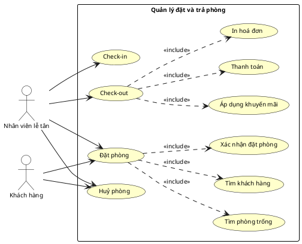
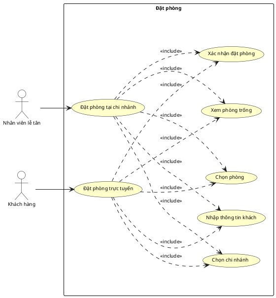
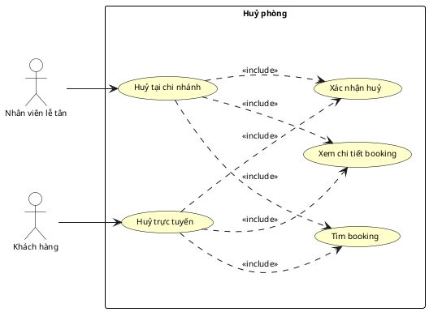
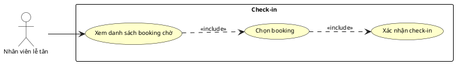

## Biểu đồ Use Case tổng quan

```plantuml
@startuml
left to right direction
skinparam shadowing false
skinparam defaultFontName Arial
skinparam defaultFontSize 10
skinparam ActorBackgroundColor transparent
skinparam ActorBorderColor black
skinparam UseCaseBackgroundColor #FFFFCC
skinparam UseCaseBorderColor black
skinparam RectangleBackgroundColor white
skinparam RectangleBorderColor black

rectangle "Quản lý đặt và trả phòng" {
  usecase "Đặt phòng" as UC1
  usecase "Huỷ phòng" as UC2
  usecase "Check-in" as UC3
  usecase "Check-out" as UC4
  usecase "Tìm phòng trống" as UC1_1
  usecase "Tìm khách hàng" as UC1_2
  usecase "Xác nhận đặt phòng" as UC1_3
  usecase "Áp dụng khuyến mãi" as UC4_1
  usecase "Thanh toán" as UC4_2
  usecase "In hoá đơn" as UC4_3
}

actor "Nhân viên lễ tân" as NV
actor "Khách hàng" as KH

NV --> UC1
NV --> UC2
NV --> UC3
NV --> UC4
KH --> UC1
KH --> UC2

UC1 ..> UC1_1 : <<include>>
UC1 ..> UC1_2 : <<include>>
UC1 ..> UC1_3 : <<include>>
UC4 ..> UC4_1 : <<include>>
UC4 ..> UC4_2 : <<include>>
UC4 ..> UC4_3 : <<include>>
@enduml
```

## Biểu đồ Use Case phân rã

### a) Use Case "Đặt phòng"

```plantuml
@startuml
left to right direction
skinparam shadowing false
skinparam defaultFontName Arial
skinparam defaultFontSize 10
skinparam ActorBackgroundColor transparent
skinparam ActorBorderColor black
skinparam UseCaseBackgroundColor #FFFFCC
skinparam UseCaseBorderColor black
skinparam RectangleBackgroundColor white
skinparam RectangleBorderColor black

rectangle "Đặt phòng" {
  usecase "Chọn chi nhánh" as UC1
  usecase "Xem phòng trống" as UC2
  usecase "Chọn phòng" as UC3
  usecase "Nhập thông tin khách" as UC4
  usecase "Xác nhận đặt phòng" as UC5
  usecase "Đặt phòng trực tuyến" as UC6
  usecase "Đặt phòng tại chi nhánh" as UC7
}

actor "Nhân viên lễ tân" as NV
actor "Khách hàng" as KH

NV --> UC7
KH --> UC6

UC6 ..> UC1 : <<include>>
UC6 ..> UC2 : <<include>>
UC6 ..> UC3 : <<include>>
UC6 ..> UC4 : <<include>>
UC6 ..> UC5 : <<include>>

UC7 ..> UC1 : <<include>>
UC7 ..> UC2 : <<include>>
UC7 ..> UC3 : <<include>>
UC7 ..> UC4 : <<include>>
UC7 ..> UC5 : <<include>>
@enduml
```

### b) Use Case "Huỷ phòng"

```plantuml
@startuml
left to right direction
skinparam shadowing false
skinparam defaultFontName Arial
skinparam defaultFontSize 10
skinparam ActorBackgroundColor transparent
skinparam ActorBorderColor black
skinparam UseCaseBackgroundColor #FFFFCC
skinparam UseCaseBorderColor black
skinparam RectangleBackgroundColor white
skinparam RectangleBorderColor black

rectangle "Huỷ phòng" {
  usecase "Tìm booking" as UC1
  usecase "Xem chi tiết booking" as UC2
  usecase "Xác nhận huỷ" as UC3
  usecase "Huỷ trực tuyến" as UC4
  usecase "Huỷ tại chi nhánh" as UC5
}

actor "Nhân viên lễ tân" as NV
actor "Khách hàng" as KH

NV --> UC5
KH --> UC4

UC4 ..> UC1 : <<include>>
UC4 ..> UC2 : <<include>>
UC4 ..> UC3 : <<include>>

UC5 ..> UC1 : <<include>>
UC5 ..> UC2 : <<include>>
UC5 ..> UC3 : <<include>>
@enduml
```

### c) Use Case "Check-in"

```plantuml
@startuml
left to right direction
skinparam shadowing false
skinparam defaultFontName Arial
skinparam defaultFontSize 10
skinparam ActorBackgroundColor transparent
skinparam ActorBorderColor black
skinparam UseCaseBackgroundColor #FFFFCC
skinparam UseCaseBorderColor black
skinparam RectangleBackgroundColor white
skinparam RectangleBorderColor black

rectangle "Check-in" {
  usecase "Xem danh sách booking chờ" as UC1
  usecase "Chọn booking" as UC2
  usecase "Xác nhận check-in" as UC3
}

actor "Nhân viên lễ tân" as NV

NV --> UC1
UC1 ..> UC2 : <<include>>
UC2 ..> UC3 : <<include>>
@enduml
```

### d) Use Case "Check-out"

```plantuml
@startuml
left to right direction
skinparam shadowing false
skinparam defaultFontName Arial
skinparam defaultFontSize 10
skinparam ActorBackgroundColor transparent
skinparam ActorBorderColor black
skinparam UseCaseBackgroundColor #FFFFCC
skinparam UseCaseBorderColor black
skinparam RectangleBackgroundColor white
skinparam RectangleBorderColor black

rectangle "Check-out" {
  usecase "Xem danh sách phòng đang hoạt động" as UC1
  usecase "Tính tiền phòng" as UC2
  usecase "Áp dụng ưu đãi hội viên" as UC3
  usecase "Áp dụng voucher" as UC4
  usecase "Chọn phương thức thanh toán" as UC5
  usecase "Xác nhận thanh toán" as UC6
  usecase "In hoá đơn" as UC7
}

actor "Nhân viên lễ tân" as NV

NV --> UC1
UC1 ..> UC2 : <<include>>
UC2 ..> UC3 : <<include>>
UC3 ..> UC4 : <<extend>>
UC4 ..> UC5 : <<include>>
UC5 ..> UC6 : <<include>>
UC6 ..> UC7 : <<include>>
@enduml
```
