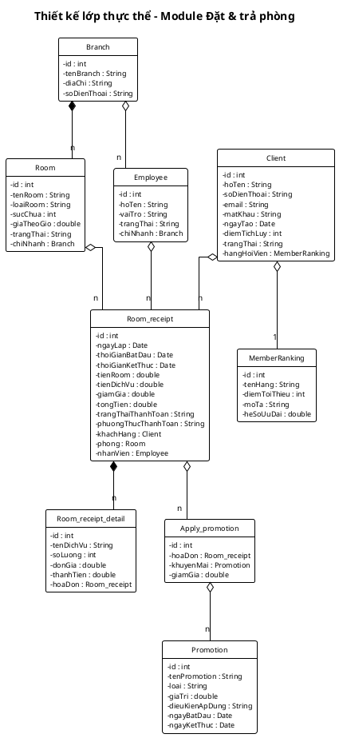

## Thiết kế lớp thực thể

### Bước 1 – Bổ sung thuộc tính `id`

Thêm thuộc tính `id : int` vào các lớp không kế thừa từ lớp khác:

- Client: `id : int`
- Branch: `id : int`
- Room: `id : int`
- Employee: `id : int`
- Room_receipt: `id : int`
- Room_receipt_detail: `id : int`
- MemberRanking: `id : int`
- Promotion: `id : int`

### Bước 2 – Thêm kiểu dữ liệu

Chuyển tất cả thuộc tính sang kiểu ngôn ngữ lập trình (Java):

- Client: `id : int`, `hoTen : String`, `soDienThoai : String`, `email : String`, `matKhau : String`, `ngayTao : Date`, `diemTichLuy : int`, `trangThai : String`
- Branch: `id : int`, `tenBranch : String`, `diaChi : String`, `soDienThoai : String`
- Room: `id : int`, `tenRoom : String`, `loaiRoom : String`, `sucChua : int`, `giaTheoGio : double`, `trangThai : String`
- Employee: `id : int`, `hoTen : String`, `vaiTro : String`, `trangThai : String`
- Room_receipt: `id : int`, `ngayLap : Date`, `thoiGianBatDau : Date`, `thoiGianKetThuc : Date`, `tienRoom : double`, `tienDichVu : double`, `giamGia : double`, `tongTien : double`, `trangThaiThanhToan : String`, `phuongThucThanhToan : String`
- Room_receipt_detail: `id : int`, `tenDichVu : String`, `soLuong : int`, `donGia : double`, `thanhTien : double`
- MemberRanking: `id : int`, `tenHang : String`, `diemToiThieu : int`, `moTa : String`, `heSoUuDai : double`
- Promotion: `id : int`, `tenPromotion : String`, `loai : String`, `giaTri : double`, `dieuKienApDung : String`, `ngayBatDau : Date`, `ngayKetThuc : Date`

### Bước 3 – Chuyển quan hệ association thành aggregation/composition

- Branch `*--` Room: composition (phòng không tồn tại nếu không có chi nhánh)
- Branch `o--` Employee: aggregation (nhân viên tồn tại độc lập)
- Client `o--` MemberRanking: aggregation (hạng hội viên là danh mục độc lập)
- Room_receipt `*--` Room_receipt_detail: composition (chi tiết không tồn tại nếu không có hóa đơn)
- Room `o--` Room_receipt: aggregation (hóa đơn tồn tại độc lập khỏi phòng)
- Client `o--` Room_receipt: aggregation
- Employee `o--` Room_receipt: aggregation

### Bước 4 – Bổ sung thuộc tính kiểu đối tượng

- Room_receipt: `khachHang : Client`, `phong : Room`, `nhanVien : Employee`
- Room_receipt_detail: `hoaDon : Room_receipt`
- Room: `chiNhanh : Branch`
- Employee: `chiNhanh : Branch`
- Client: `hangHoiVien : MemberRanking`

### Biểu đồ lớp thực thể

<!-- PLACEHOLDER: Chèn ảnh sơ đồ lớp thực thể tại đây -->
<!-- File: output/diagrams/booking_entity_class.png -->

