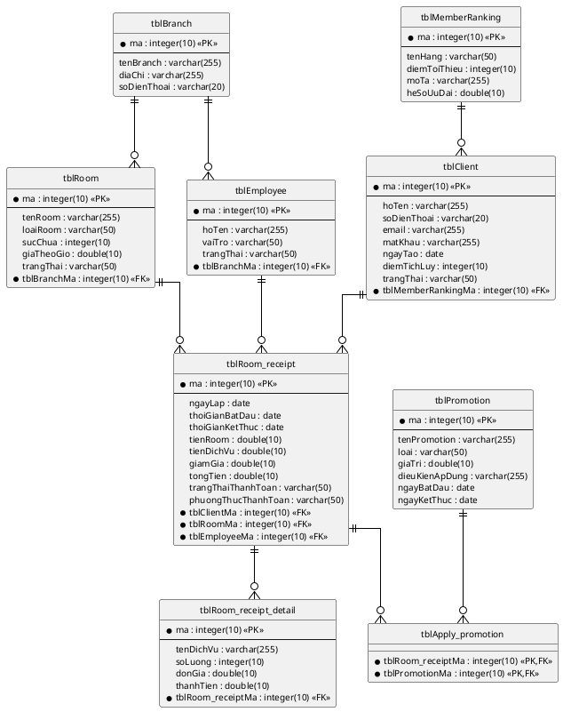

## Thiết kế CSDL

### Bước 1 – Tạo bảng cho mỗi lớp thực thể

| Lớp thực thể | Tên bảng |
|--------------|----------|
| Client | tblClient |
| Branch | tblBranch |
| Room | tblRoom |
| Employee | tblEmployee |
| Room_receipt | tblRoom_receipt |
| Room_receipt_detail | tblRoom_receipt_detail |
| MemberRanking | tblMemberRanking |
| Promotion | tblPromotion |

### Bước 2 – Chuyển kiểu dữ liệu

| Kiểu Java | Kiểu SQL |
|-----------|----------|
| int | integer(10) |
| String | varchar(255) |
| double | double(10) |
| Date | date |

### Bước 3 – Xử lý quan hệ cardinality

- Branch – Room (1-n): Giữ riêng, Room có FK `tblBranchMa`
- Branch – Employee (1-n): Giữ riêng, Employee có FK `tblBranchMa`
- Client – MemberRanking (n-1): Giữ riêng, Client có FK `tblMemberRankingMa`
- Room_receipt – Room_receipt_detail (1-n): Giữ riêng, Room_receipt_detail có FK `tblRoom_receiptMa`
- Room_receipt – Promotion (n-n): Tạo bảng trung gian `tblApply_promotion`
- Client – Room_receipt (1-n): Room_receipt có FK `tblClientMa`
- Room – Room_receipt (1-n): Room_receipt có FK `tblRoomMa`
- Employee – Room_receipt (1-n): Room_receipt có FK `tblEmployeeMa`

### Bước 4 – Bổ sung PK/FK

- PK: thuộc tính `id` → `ma : integer(10) <<PK>>`
- FK: đặt tên `tbl[TenBangCha]Ma`

### Bước 5 – Loại bỏ thuộc tính dư thừa

- Bỏ thuộc tính kiểu đối tượng (đã chuyển thành FK)
- Bỏ thuộc tính dẫn xuất (nếu có)

### Biểu đồ ERD

<!-- PLACEHOLDER: Chèn ảnh ERD tại đây -->
<!-- File: output/diagrams/booking_erd.png -->

