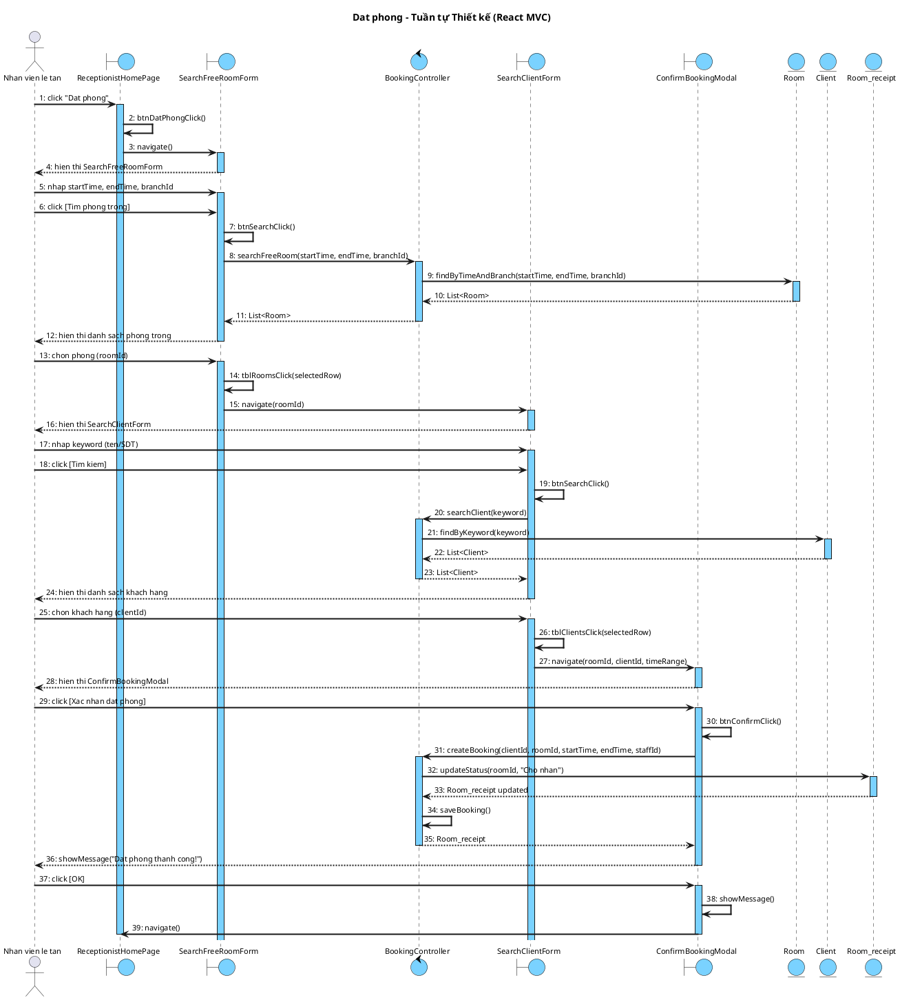
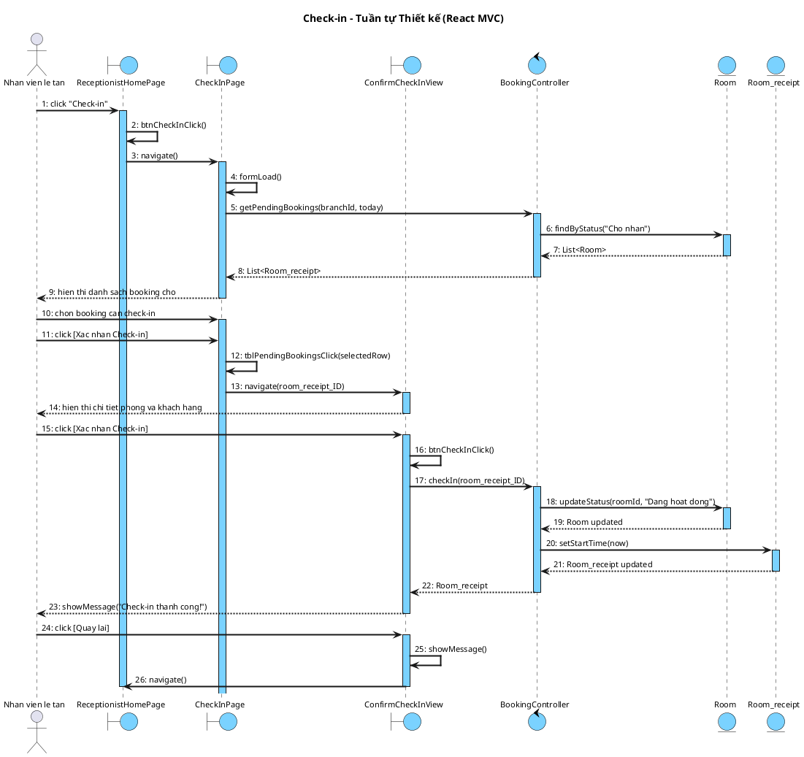
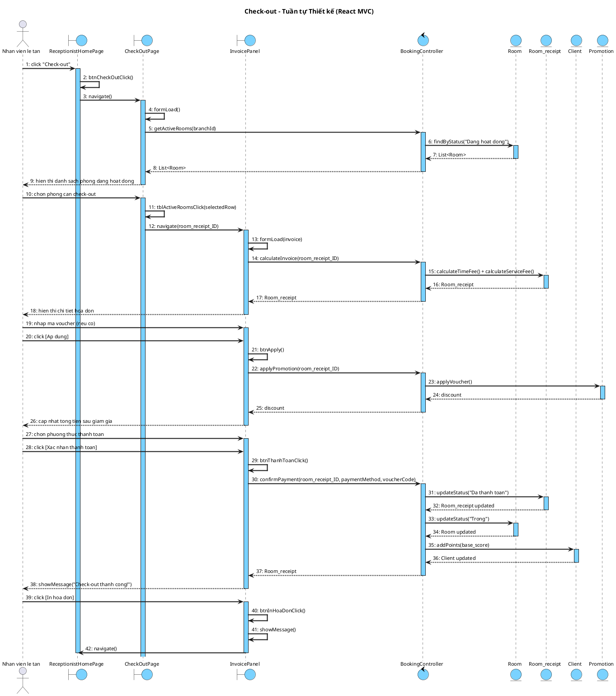
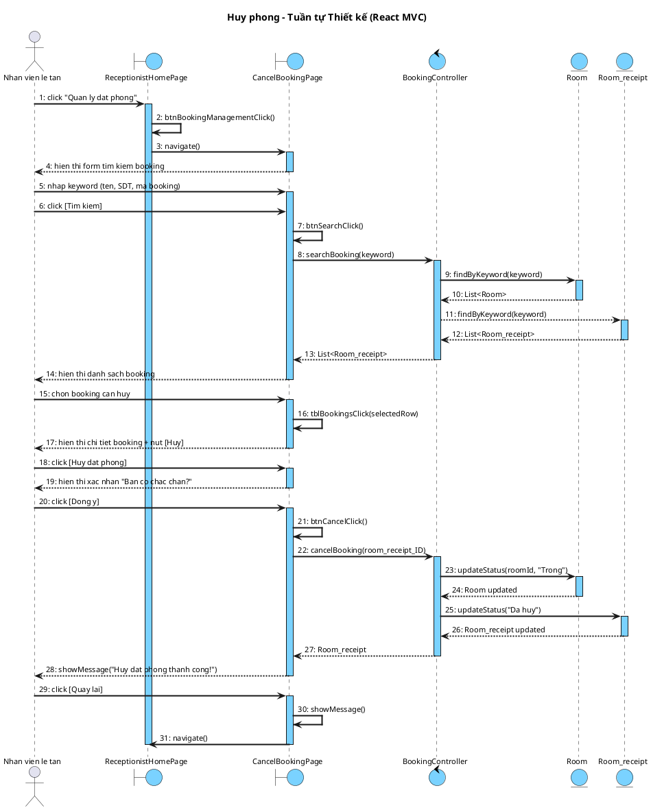

## 4. Biểu đồ tuần tự thiết kế

### 4.1. Chức năng "Đặt phòng"

#### a) Biểu đồ tuần tự

<!-- PLACEHOLDER: Chèn ảnh tuần tự Đặt phòng tại đây -->
<!-- File: output/diagrams/booking_seq_datphong.png -->

#### b) Kịch bản phiên bản 3

**Kịch bản phiên bản 3 - Đặt phòng**

1. Nhân viên lễ tân click chức năng "Đặt phòng" trên giao diện ReceptionistHomePage.
2. Phương thức btnDatPhongClick() của lớp ReceptionistHomePage được gọi.
3. Phương thức btnDatPhongClick() gọi phương thức navigate() của lớp SearchFreeRoomForm.
4. Lớp SearchFreeRoomForm hiển thị form tìm phòng trống cho nhân viên.
5. Nhân viên nhập thời gian bắt đầu (startTime), thời gian kết thúc (endTime) và chọn chi nhánh (branchId).
6. Nhân viên click nút [Tìm phòng trống].
7. Phương thức btnSearchClick() của lớp SearchFreeRoomForm được gọi.
8. Phương thức btnSearchClick() gọi phương thức searchFreeRoom(startTime: Date, endTime: Date, branchId: int) của lớp BookingController.
9. Phương thức searchFreeRoom() gọi phương thức findByTimeAndBranch(startTime, endTime, branchId) của lớp Entity Room.
10. Lớp Room trả kết quả danh sách phòng trống về cho phương thức searchFreeRoom().
11. Phương thức searchFreeRoom() trả kết quả về cho phương thức btnSearchClick().
12. Lớp SearchFreeRoomForm hiển thị danh sách phòng trống cho nhân viên.
13. Nhân viên ấn vào phòng trống.
14. Phương thức tblRoomsClick(selectedRow: int) của lớp SearchFreeRoomForm được gọi.
15. Phương thức tblRoomsClick() gọi phương thức navigate(roomId) của lớp SearchClientForm.
16. Lớp SearchClientForm hiển thị form tìm khách hàng cho nhân viên.
17. Nhân viên nhập thông tin khách hàng (tên hoặc số điện thoại).
18. Nhân viên click [Tìm kiếm].
19. Phương thức btnSearchClick() của lớp SearchClientForm được gọi.
20. Phương thức btnSearchClick() gọi phương thức searchClient(keyword: String) của lớp BookingController.
21. Phương thức searchClient() gọi phương thức findByKeyword(keyword) của lớp Entity Client.
22. Lớp Client trả kết quả danh sách khách hàng về cho phương thức searchClient().
23. Phương thức searchClient() trả kết quả về cho phương thức btnSearchClick().
24. Lớp SearchClientForm hiển thị danh sách khách hàng khớp.
25. Nhân viên chọn thông tin khách hàng tương ứng.
26. Phương thức tblClientsClick(selectedRow: int) của lớp SearchClientForm được gọi.
27. Phương thức tblClientsClick() gọi phương thức navigate(roomId, clientId, timeRange) của lớp ConfirmBookingModal.
28. Lớp ConfirmBookingModal hiển thị thông tin xác nhận đặt phòng.
29. Nhân viên ấn nút xác nhận.
30. Phương thức btnConfirmClick() của lớp ConfirmBookingModal được gọi.
31. Phương thức btnConfirmClick() gọi phương thức createBooking(clientId: int, roomId: int, startTime: Date, endTime: Date, staffId: int) của lớp BookingController.
32. Phương thức createBooking() gọi phương thức updateStatus(roomId, "Chờ nhận") của lớp Entity Room_receipt.
33. Lớp Room_receipt cập nhật trạng thái và trả kết quả về cho phương thức createBooking().
34. Phương thức createBooking() lưu booking vào CSDL và trả Room_receipt về cho phương thức btnConfirmClick().
35. Lớp ConfirmBookingModal hiển thị thông báo "Đặt phòng thành công!".
36. Nhân viên ấn nút OK.
37. Phương thức showMessage() của lớp ConfirmBookingModal được gọi.
38. Phương thức showMessage() gọi phương thức navigate() của lớp ReceptionistHomePage.
39. Hệ thống quay về giao diện chính ReceptionistHomePage.

**Ngoại lệ:**
- **Phòng trống không tìm thấy:** Phương thức searchFreeRoom() trả về danh sách rỗng. Lớp SearchFreeRoomForm hiển thị "Không có phòng trống trong khung giờ này."
- **Khách hàng chưa có trong CSDL:** Lớp SearchClientForm hiển thị nút [Đăng ký nhanh]. Nhân viên nhập thông tin mới, hệ thống tạo khách hàng mới trước khi tiếp tục.

---

### 4.2. Chức năng "Check-in"

#### a) Biểu đồ tuần tự

<!-- PLACEHOLDER: Chèn ảnh tuần tự Check-in tại đây -->
<!-- File: output/diagrams/booking_seq_checkin.png -->

#### b) Kịch bản phiên bản 3

**Kịch bản phiên bản 3 - Check-in**

1. Nhân viên lễ tân click chức năng "Check-in" trên giao diện ReceptionistHomePage.
2. Phương thức btnCheckInClick() của lớp ReceptionistHomePage được gọi.
3. Phương thức btnCheckInClick() gọi phương thức navigate() của lớp CheckInPage.
4. Phương thức formLoad() của lớp CheckInPage được gọi.
5. Phương thức formLoad() gọi phương thức getPendingBookings(branchId: int, date: Date) của lớp BookingController.
6. Phương thức getPendingBookings() gọi phương thức findByStatus("Chờ nhận") của lớp Entity Room.
7. Lớp Room trả kết quả danh sách booking về cho phương thức getPendingBookings().
8. Phương thức getPendingBookings() trả kết quả về cho phương thức formLoad().
9. Lớp CheckInPage hiển thị danh sách booking "Chờ nhận" hôm nay cho nhân viên.
10. Nhân viên ấn chọn booking tương ứng cần check-in trên danh sách.
11. Phương thức tblPendingBookingsClick(selectedRow: int) của lớp CheckInPage được gọi.
12. Phương thức tblPendingBookingsClick() gọi phương thức navigate(room_receipt_ID) của lớp ConfirmCheckInView.
13. Lớp ConfirmCheckInView hiển thị thông tin chi tiết của phòng và khách hàng.
14. Nhân viên ấn nút xác nhận check-in.
15. Phương thức btnCheckInClick() của lớp ConfirmCheckInView được gọi.
16. Phương thức btnCheckInClick() gọi phương thức checkIn(room_receipt_ID: int) của lớp BookingController.
17. Phương thức checkIn() gọi phương thức updateStatus(roomId, "Đang hoạt động") của lớp Entity Room.
18. Lớp Room cập nhật trạng thái và trả kết quả về cho phương thức checkIn().
19. Phương thức checkIn() gọi phương thức setStartTime(now) của lớp Entity Room_receipt.
20. Lớp Room_receipt ghi nhận thời gian bắt đầu và trả kết quả về cho phương thức checkIn().
21. Phương thức checkIn() trả Room_receipt về cho phương thức btnCheckInClick().
22. Lớp ConfirmCheckInView hiển thị thông báo "Check-in thành công! Phòng [tên phòng] đã sẵn sàng."
23. Nhân viên ấn nút quay lại.
24. Phương thức showMessage() của lớp ConfirmCheckInView được gọi.
25. Phương thức showMessage() gọi phương thức navigate() của lớp ReceptionistHomePage.
26. Hệ thống quay về giao diện chính ReceptionistHomePage.

**Ngoại lệ:**
- **Phòng đang dọn dẹp:** Phương thức checkIn() kiểm tra trạng thái phòng, trả về lỗi. Lớp ConfirmCheckInView hiển thị "Phòng đang dọn dẹp, vui lòng chờ."
- **Khách hàng không đến:** Nhân viên chọn hủy booking thay vì check-in. Phương thức cancelBooking() của BookingController được gọi, chuyển trạng thái booking sang "Đã hủy".

---

### 4.3. Chức năng "Check-out"

#### a) Biểu đồ tuần tự

<!-- PLACEHOLDER: Chèn ảnh tuần tự Check-out tại đây -->
<!-- File: output/diagrams/booking_seq_checkout.png -->

#### b) Kịch bản phiên bản 3

**Kịch bản phiên bản 3 - Check-out**

1. Nhân viên lễ tân click chức năng "Check-out" trên giao diện ReceptionistHomePage.
2. Phương thức btnCheckOutClick() của lớp ReceptionistHomePage được gọi.
3. Phương thức btnCheckOutClick() gọi phương thức navigate() của lớp CheckOutPage.
4. Phương thức formLoad() của lớp CheckOutPage được gọi.
5. Phương thức formLoad() gọi phương thức getActiveRooms(branchId: int) của lớp BookingController.
6. Phương thức getActiveRooms() gọi phương thức findByStatus("Đang hoạt động") của lớp Entity Room.
7. Lớp Room trả kết quả danh sách phòng về cho phương thức getActiveRooms().
8. Phương thức getActiveRooms() trả kết quả về cho phương thức formLoad().
9. Lớp CheckOutPage hiển thị danh sách phòng đang sử dụng cho nhân viên.
10. Nhân viên chọn phòng tương ứng trên danh sách.
11. Phương thức tblActiveRoomsClick(selectedRow: int) của lớp CheckOutPage được gọi.
12. Phương thức tblActiveRoomsClick() gọi phương thức navigate(room_receipt_ID) của lớp InvoicePanel.
13. Phương thức formLoad(invoice: Room_receipt) của lớp InvoicePanel được gọi.
14. Phương thức formLoad() gọi phương thức calculateInvoice(room_receipt_ID: int) của lớp BookingController.
15. Phương thức calculateInvoice() gọi phương thức calculateTimeFee() + calculateServiceFee() của lớp Entity Room_receipt.
16. Lớp Room_receipt trả kết quả hóa đơn về cho phương thức calculateInvoice().
17. Phương thức calculateInvoice() trả Room_receipt về cho phương thức formLoad().
18. Lớp InvoicePanel hiển thị chi tiết tiền phòng, dịch vụ, thời gian sử dụng và tổng tiền.
19. Nhân viên thông báo tổng tiền cho khách hàng.
20. Khách hàng cung cấp mã ưu đãi (nếu có).
21. Nhân viên nhập mã và ấn áp dụng.
22. Phương thức btnApply() của lớp InvoicePanel được gọi.
23. Phương thức btnApply() gọi phương thức applyPromotion(room_receipt_ID: int) của lớp BookingController.
24. Phương thức applyPromotion() gọi phương thức applyVoucher() của lớp Entity Promotion.
25. Lớp Promotion trả kết quả giảm giá về cho phương thức applyPromotion().
26. Phương thức applyPromotion() trả kết quả về cho phương thức btnApply().
27. Lớp InvoicePanel cập nhật lại tổng tiền sau giảm giá.
28. Khách hàng đưa tiền mặt cho nhân viên.
29. Nhân viên chọn phương thức thanh toán và click nút xác nhận thanh toán.
30. Phương thức btnThanhToanClick() của lớp InvoicePanel được gọi.
31. Phương thức btnThanhToanClick() gọi phương thức confirmPayment(room_receipt_ID: int, paymentMethod: String, voucherCode: String) của lớp BookingController.
32. Phương thức confirmPayment() gọi phương thức updateStatus("Đã thanh toán") của lớp Entity Room_receipt.
33. Phương thức confirmPayment() gọi phương thức updateStatus("Trống") của lớp Entity Room.
34. Phương thức confirmPayment() gọi phương thức addPoints(base_score) của lớp Entity Client.
35. Các lớp Entity trả kết quả lưu trữ về cho phương thức confirmPayment().
36. Phương thức confirmPayment() trả Room_receipt về cho phương thức btnThanhToanClick().
37. Lớp InvoicePanel hiển thị thông báo "Check-out thành công! Tổng tiền: [X]đ."
38. Nhân viên click nút in hóa đơn (để đưa cho khách hàng) và ấn hoàn tất.
39. Phương thức btnInHoaDonClick() của lớp InvoicePanel được gọi.
40. Phương thức btnInHoaDonClick() gọi phương thức showMessage() của lớp InvoicePanel.
41. Phương thức showMessage() gọi phương thức navigate() của lớp ReceptionistHomePage.
42. Hệ thống quay về giao diện chính ReceptionistHomePage.

**Ngoại lệ:**
- **Voucher không hợp lệ:** Phương thức applyPromotion() trả về lỗi. Lớp InvoicePanel hiển thị "Mã voucher không hợp lệ hoặc đã hết hạn."
- **Thanh toán chuyển khoản thất bại:** Phương thức confirmPayment() trả về lỗi. Lớp InvoicePanel hiển thị lỗi, yêu cầu chọn lại phương thức.

---

### 4.4. Chức năng "Huỷ phòng"

#### a) Biểu đồ tuần tự

<!-- PLACEHOLDER: Chèn ảnh tuần tự Huỷ phòng tại đây -->
<!-- File: output/diagrams/booking_seq_huyphong.png -->

#### b) Kịch bản phiên bản 3

**Kịch bản phiên bản 3 - Huỷ phòng**

1. Nhân viên lễ tân click chức năng "Quản lý đặt phòng" trên giao diện ReceptionistHomePage.
2. Phương thức btnBookingManagementClick() của lớp ReceptionistHomePage được gọi.
3. Phương thức btnBookingManagementClick() gọi phương thức navigate() của lớp CancelBookingPage.
4. Lớp CancelBookingPage hiển thị form tìm kiếm booking.
5. Nhân viên nhập thông tin tìm kiếm (họ tên, số điện thoại hoặc mã phòng đã đặt) và ấn nút tìm kiếm.
6. Phương thức btnSearchClick() của lớp CancelBookingPage được gọi.
7. Phương thức btnSearchClick() gọi phương thức searchBooking(keyword: String) của lớp BookingController.
8. Phương thức searchBooking() gọi phương thức findByKeyword(keyword) của lớp Entity Room.
9. Lớp Room trả kết quả danh sách phòng về cho phương thức searchBooking().
10. Phương thức searchBooking() gọi phương thức findByKeyword(keyword) của lớp Entity Room_receipt.
11. Lớp Room_receipt trả kết quả danh sách hóa đơn về cho phương thức searchBooking().
12. Phương thức searchBooking() tổng hợp và trả kết quả về cho phương thức btnSearchClick().
13. Lớp CancelBookingPage hiển thị danh sách các booking tương ứng cho nhân viên.
14. Nhân viên ấn chọn bản ghi booking cần hủy.
15. Phương thức tblBookingsClick(selectedRow: int) của lớp CancelBookingPage được gọi.
16. Lớp CancelBookingPage hiển thị thông tin chi tiết booking và nút [Hủy đặt phòng].
17. Nhân viên click [Hủy đặt phòng].
18. Lớp CancelBookingPage hiển thị xác nhận "Bạn có chắc chắn muốn hủy booking này?".
19. Nhân viên click [Đồng ý].
20. Phương thức btnCancelClick() của lớp CancelBookingPage được gọi.
21. Phương thức btnCancelClick() gọi phương thức cancelBooking(room_receipt_ID: int) của lớp BookingController.
22. Phương thức cancelBooking() gọi phương thức updateStatus(roomId, "Trống") của lớp Entity Room.
23. Lớp Room cập nhật trạng thái và trả kết quả về cho phương thức cancelBooking().
24. Phương thức cancelBooking() gọi phương thức updateStatus("Đã hủy") của lớp Entity Room_receipt.
25. Lớp Room_receipt cập nhật trạng thái và trả kết quả về cho phương thức cancelBooking().
26. Phương thức cancelBooking() trả Room_receipt về cho phương thức btnCancelClick().
27. Lớp CancelBookingPage hiển thị thông báo "Hủy đặt phòng thành công."
28. Nhân viên ấn nút quay lại.
29. Phương thức showMessage() của lớp CancelBookingPage được gọi.
30. Phương thức showMessage() gọi phương thức navigate() của lớp ReceptionistHomePage.
31. Hệ thống quay về giao diện chính ReceptionistHomePage.

**Ngoại lệ:**
- **Không tìm thấy booking:** Phương thức searchBooking() trả về danh sách rỗng. Lớp CancelBookingPage hiển thị "Không tìm thấy booking phù hợp."
- **Booking đã quá thời gian hủy:** Phương thức cancelBooking() kiểm tra thời gian, trả về lỗi. Lớp CancelBookingPage hiển thị "Booking đã quá thời gian hủy."
