| HỌC VIỆN CÔNG NGHỆ BƯU CHÍNH VIỄN THÔNG KHOA CÔNG NGHỆ THÔNG TIN 1 ______________ |
| --- |
| 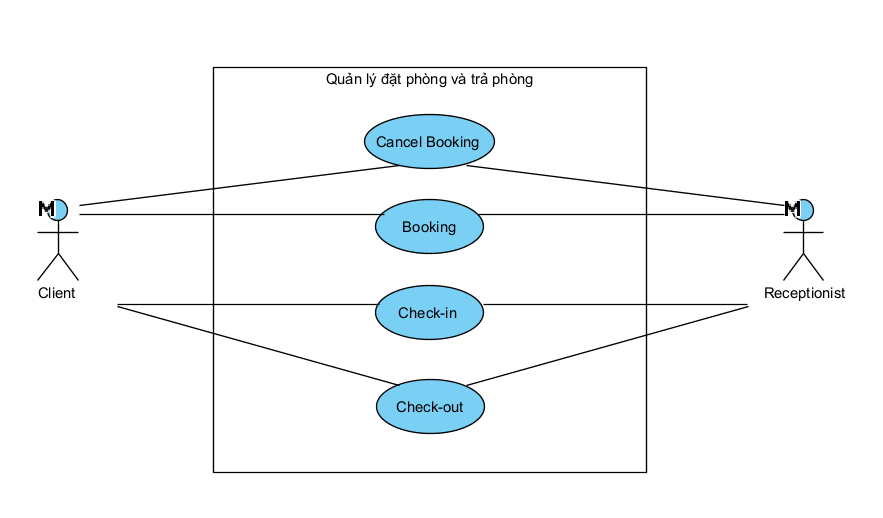 |
| BÁO CÁO BÀI TẬP LỚN HỌC PHẦN: NHẬP MÔN CÔNG NGHỆ PHẦN MỀM Module: Quản lý đặt & trả phòng |
| Giảng viên hướng dẫn: Đỗ Thị Liên Lớp học phần: D23CQCE01-B Nhóm thực hiện: Nhóm 7 SV thực hiện: Phạm Tuấn Anh MSV: B23DCDT018 |
| HÀ NỘI, THÁNG 5/2026 |

# MỤC LỤC

# PHA XÁC ĐỊNH YÊU CẦU
## Mô hình nghiệp vụ bằng UML
### 1.1. Danh sách Actor

| STT | Actor | Mô tả |
| --- | --- | --- |
| 1 | Khách hàng (gián tiếp) | Người sử dụng dịch vụ karaoke, truy cập qua web/app hoặc tới tận chi nhánh để đặt phòng; thanh toán; quản lý tài khoản cá nhân. |
| 2 | Nhân viên lễ tân (trực tiếp) | Nhân viên tại quầy, xử lý đặt phòng, check-in/ check-out, thu tiền, in hoá đơn. |

### 1.2. Các Use Case cho từng Actor

| Actor | Use Case |
| --- | --- |
| Khách hàng | UC05 - Đặt phòng |
|  | UC06 - Huỷ phòng |
| Nhân viên lễ tân | UC05 - Đặt phòng |
|  | UC06 - Huỷ phòng |
|  | UC07 - Check-in |
|  | UC08 - Check-out |

### 1.3. Biểu đồ Use Case tổng quan của mô-đun	
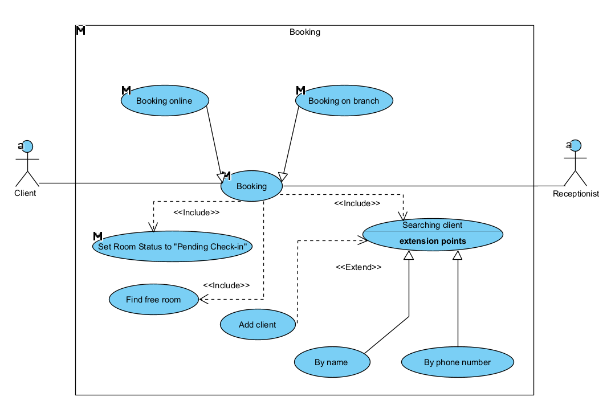
### 1.4. Biểu đồ Use Case phân rã của mô-đun
#### Use case đặt phòng
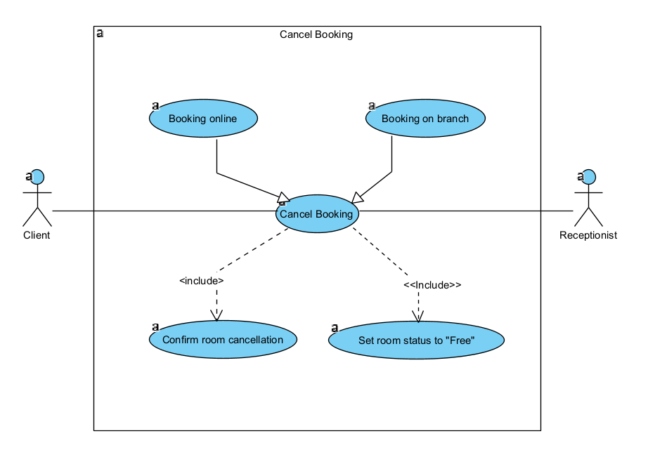
#### Use case huỷ phòng
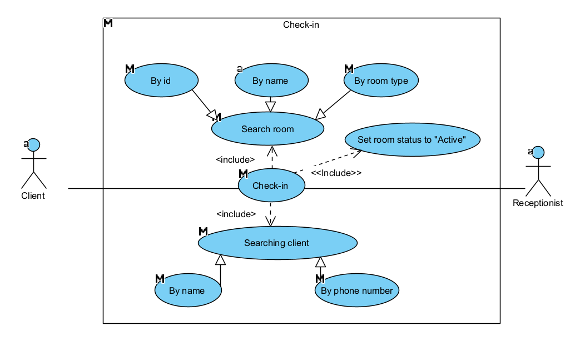
#### Use case check-in
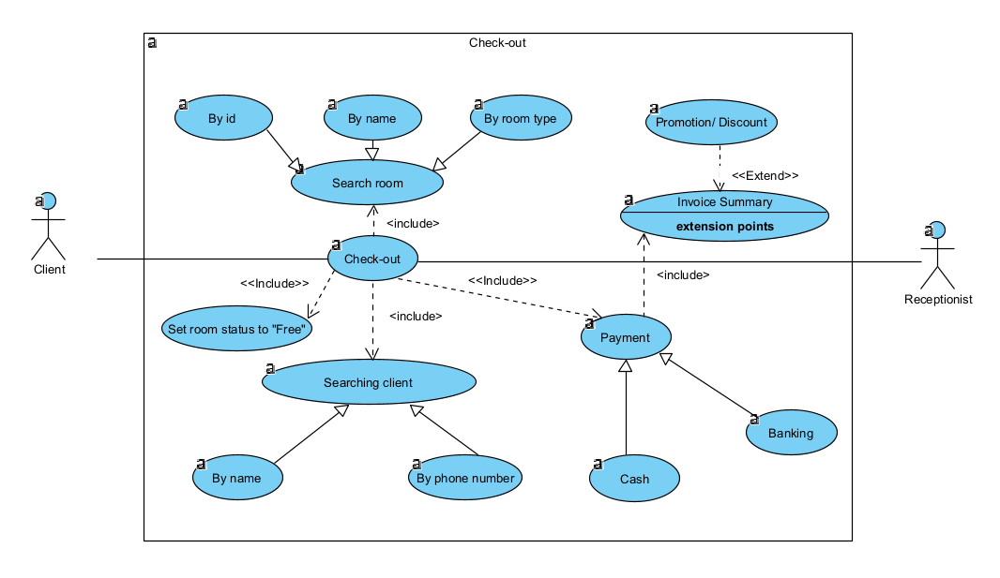
#### Use case check-out
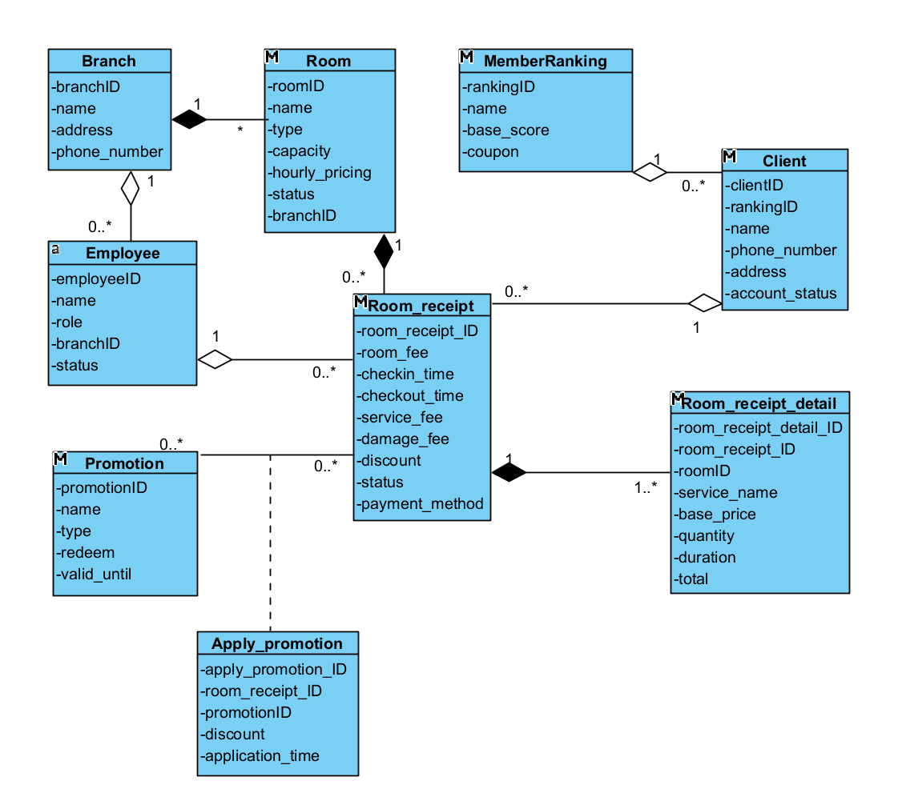
# II. PHA PHÂN TÍCH
## Mô hình hóa chức năng
### 1.1. Kịch bản “Đặt phòng tại chi nhánh”

| Use case | Đặt phòng |
| --- | --- |
| Actor | Nhân viên lễ tân, khách hàng |
| Tiền điều kiện | Nhân viên đã đăng nhập vào hệ thống |
| Hậu điều kiện | Hệ thống chuyển trạng thái phòng được đạt sang “Chờ nhận” |
| Kịch bản chính | (1) Nhân viên lễ tân chọn chức năng đặt phòng. (2) Hệ thống hiển thị yêu cầu nhập thời gian đặt phòng. (3) Nhân viên hỏi khách hàng về thời gian đặt phòng. (4) Khách hàng trả lời thời gian muốn đặt phòng. (5) Nhân viên nhập thời gian đặt phòng lên hệ thống. (6) Hệ thống hiển thị danh sách phòng trống theo thời gian vừa nhập. (7) Nhân viên hỏi loại phòng trống mong muốn của khách. (8) Khách hàng trả lời. (9) Nhân viên chọn phòng trống theo mong muốn của khách hàng. (10) Hệ thống yêu cầu nhập thông tin khách hàng. (11) Nhân viên hỏi thông tin khách hàng. (12) Khách hàng cung cấp thông tin cá nhân (họ tên, sđt,...) cho nhân viên. (13) Nhân viên nhập thông tin khách hàng lên hệ thống. (14) Hệ thống hiển thị thông tin khách hàng tương ứng. (15) Nhân viên ấn vào thông tin khách hàng tương ứng. (16) Hệ thống hiển thị xác nhận đặt phòng. (17) Nhân viên bấm xác nhận. (18) Hệ thống chuyển trạng thái phòng được đạt sang “Chờ nhận”. |
| Ngoại lệ | (6) Hệ thống không hiển thị phòng trống nào theo thời gian muốn đặt phòng. (14) Chưa có thông tin khách hàng trong cơ sở dữ liệu. (8) Khách hàng không ưng phòng nào cả. |

## 
### 1.2. Kịch bản "Check-in"

| Use case | Check-in |
| --- | --- |
| Actor | Nhân viên lễ tân |
| Tiền điều kiện | Nhân viên đã đăng nhập vào hệ thống.  Phòng ở trạng thái "Chờ nhận" (đã được đặt trước đó). |
| Hậu điều kiện | Phòng chuyển trạng thái từ "Chờ nhận" sang "Đang hoạt động".  Thời gian bắt đầu sử dụng được ghi nhận vào hệ thống. |
| Kịch bản chính | (1) Nhân viên lễ tân chọn chức năng "Check-in" trên giao diện chính.(2) Hệ thống hiển thị danh sách các booking có trạng thái "Chờ nhận" hôm nay, gồm: mã booking, tên khách hàng, số điện thoại, phòng, giờ đặt.(3) Nhân viên chọn booking cần check-in.(4) Hệ thống hiển thị thông tin chi tiết: tên khách, SĐT, phòng, giờ đặt, giờ dự kiến check-in.(5) Nhân viên xác nhận thông tin với khách hàng tại quầy.(6) Nhân viên nhấn nút [Xác nhận Check-in].(7) Hệ thống cập nhật trạng thái phòng từ "Chờ nhận" sang "Đang hoạt động".(8) Hệ thống ghi nhận thời gian bắt đầu sử dụng thực tế.(9) Hệ thống hiển thị thông báo "Check-in thành công! Phòng [tên phòng đã sẵn sàng." |
| Ngoại lệ | (3) Khách hàng không đến đúng giờ đặt.(6) Phòng đang được dọn dẹp. |

### 1.3. Kịch bản "Check-out"

| Use case | Check-out |
| --- | --- |
| Actor | Nhân viên lễ tân |
| Tiền điều kiện | Nhân viên đã đăng nhập vào hệ thống. Phòng ở trạng thái "Đang hoạt động" (đã check-in trước đó). |
| Hậu điều kiện | Phòng chuyển trạng thái từ "Đang hoạt động" sang "Trống". Hóa đơn được tạo và thanh toán hoàn tất. Điểm tích lũy được cộng vào tài khoản hội viên (nếu có). |
| Kịch bản chính | (1) Nhân viên lễ tân chọn chức năng "Check-out" trên giao diện chính.(2) Hệ thống hiển thị danh sách các phòng đang ở trạng thái "Đang hoạt động", gồm: mã phòng, tên khách, giờ bắt đầu, thời gian sử dụng.(3) Nhân viên chọn phòng cần check-out.(4) Hệ thống hiển thị thông tin tổng hợp: thời gian sử dụng phòng, tiền phòng (giờ × đơn giá), tổng tiền order dịch vụ, tổng tiền trước giảm giá.(5) Nếu khách là hội viên, hệ thống tự động áp dụng ưu đãi hạng hội viên (% giảm giá).(6) Nhân viên nhập mã voucher (nếu có) và nhấn [Áp dụng].(7) Hệ thống hiển thị tổng tiền cần thanh toán sau giảm giá.(8) Khách hàng chọn phương thức thanh toán (tiền mặt / chuyển khoản).(9) Nhân viên chọn phương thức thanh toán và nhấn [Xác nhận thanh toán].(10) Hệ thống tạo hóa đơn, cập nhật trạng thái thanh toán "Đã thanh toán".(11) Hệ thống chuyển trạng thái phòng về "Trống".(12) Nếu khách là hội viên, hệ thống cộng điểm tích lũy tự động.(13) Hệ thống hiển thị thông báo "Check-out thành công! Tổng tiền: [X]đ." và nút [In hóa đơn]. |
| Ngoại lệ | (3) Phòng có order dịch vụ chưa được xác nhận. (5) Khách hàng không phải hội viên.(8). Khách hàng khiếu nại hóa đơn.(9) Thanh toán chuyển khoản thất bại. |

## 
### 1.4. Kịch bản "Huỷ phòng"

| Use case | Huỷ phòng |
| --- | --- |
| Actor | Nhân viên lễ tân, khách hàng |
| Tiền điều kiện | Booking ở trạng thái "Chờ nhận" (chưa check-in). |
| Hậu điều kiện | Booking chuyển trạng thái sang "Đã hủy". Phòng về trạng thái "Trống". Tiền cọc (nếu có) được xử lý theo chính sách hoàn tiền. |
| Kịch bản chính | (1) Khách hàng liên hệ lễ tân (trực tiếp hoặc qua hotline) yêu cầu hủy phòng.(2) Nhân viên lễ tân chọn chức năng "Quản lý đặt phòng" trên giao diện.(3) Hệ thống hiển thị danh sách booking trạng thái "Chờ nhận".(4) Nhân viên tìm booking của khách hàng theo tên, SĐT, hoặc mã booking.(5) Nhân viên chọn booking cần hủy.(6) Hệ thống hiển thị thông tin chi tiết: tên khách, phòng, giờ đặt, tiền cọc (nếu có).(7) Nhân viên nhấn nút [Hủy đặt phòng].(8) Hệ thống hiển thị xác nhận "Bạn có chắc chắn muốn hủy booking này?".(9) Nhân viên xác nhận [Đồng ý].(10) Hệ thống cập nhật trạng thái booking sang "Đã hủy".(11) Hệ thống chuyển trạng thái phòng về "Trống".(12) Hệ thống hiển thị thông báo "Hủy đặt phòng thành công." |
| Ngoại lệ | (4) Không tìm thấy booking. (7) Booking đã quá thời gian cho phép hủy.(9) Khách hàng yêu cầu hoàn tiền cọc. |

## Mô hình hóa lớp
### 2.1. Mô tả module
“Trong mô-đun Đặt phòng và trả phòng, khách hàng có thể đặt phòng trực tuyến hoặc đặt phòng tại chi nhánh. Nếu khách hàng đặt phòng trực tuyến, khách hàng sẽ cần chọn chi nhánh muốn đặt, sau đó hệ thống sẽ hiển thị các phòng cùng các khung giờ còn trống. Sau khi khách hàng chọn được phòng cùng với khung giờ mong muốn, khách hàng sẽ bấm xác nhận đặt phòng. Ngay lập tức, hệ thống sẽ ghi nhận booking với trạng thái “Đang chờ”. Nếu khách hàng đặt phòng tại chi nhánh, nhân viên lễ tân sẽ đưa ra các phòng cùng với các khung giờ còn trống cho khách hàng chọn. Sau khi khách hàng chọn được phòng cùng với khung giờ mong muốn. Khách hàng sẽ xác nhận đặt phòng lại với nhân viên lễ tân. Nhân viên lễ tân sẽ thao tác trên hệ thống để ghi nhận booking với trạng thái “Đang chờ”. Khi khách hàng muốn nhận phòng, khách hàng sẽ cần check-in với nhân viên lễ tân. Sau khi trải nghiệm xong, khách hàng muốn trả phòng, khách hàng tiếp tục quay trở lại chỗ nhân viên lễ tân để làm thủ tục check-out. Nhân viên lễ tân sẽ tổng hợp lại hoá đơn, trừ đi ưu đãi của hạng hội viên và các khuyến mãi khác (nếu có). Khách hàng sẽ chọn phương thức thanh toán bằng tiền mặt hoặc chuyển khoản cho lễ tân. Lễ tân sẽ in chi tiết hoá đơn đưa lại cho khách hàng. Ngay lập tức, hệ thống sẽ ghi nhận giao dịch.”
### 2.2. Xác định lớp thực thể

| Danh từ | Thực thể | Thuộc tính | Loại | Chú thích |
| --- | --- | --- | --- | --- |
| Khách hàng | x |  |  | Có sự tương tác với hệ thống |
| Chi nhánh | x |  |  | Thuộc về hệ thống |
| Hệ thống |  |  | x | Danh từ chung |
| Phòng | x |  |  | Thuộc về hệ thống |
| Khung giờ |  | x |  |  |
| Nhân viên | x |  |  | Có sự tương tác với hệ thống |
| Lễ tân |  |  | x | Danh từ chung |
| Hoá đơn | x |  |  | Thuộc về hệ thống |
| Ưu đãi |  | x |  |  |
| Hạng hội viên | x |  |  | Thuộc về hệ thống |
| Khuyến mãi | x |  |  | Thuộc về hệ thống |
| Phương thức thanh toán |  | x |  | Thuộc về hệ thống |
| Tiền mặt |  |  | x | Danh từ chung |
| Chuyển khoản |  |  | x | Danh từ chung |
| Giao dịch |  |  | x | Danh từ chung |
| Chi tiết hoá đơn | x |  |  |  |

=> Các lớp thực thể: Khách hàng (Client), Chi nhánh (Branch), Phòng (Room), Nhân viên (Employee), Hoá đơn (Room_receipt) Chi tiết hoá đơn (Room_receipt_detail), Hạng hội viên (MemberRanking), Khuyến mãi (Promotion).
### 2.3. Xác định mối quan hệ giữa các thực thể
Một chi nhánh có thể có nhiều phòng => Branch và Room có quan hệ 1-n
Một chi nhánh có thể có nhiều nhân viên => Branch và Employee có quan hệ 1-n
Nhiều khách hàng có thể thuộc một hạng hội viên => Client và MemberRanking có quan hệ n-1.
Một khách hàng có thể có nhiều khuyến mãi => Client và Promotion có quan hệ 1-n.
Khách hàng có thể có nhiều hoá đơn => Client và Room_receipt có quan hệ 1-n.
Một phòng có thể xuất hiện nhiều hoá đơn => Room và Room_receipt có quan hệ 1-n.
Một khách hàng có thể đặt nhiều phòng => Client và Room có quan hệ 1-n.
Nhân viên có thể có nhiều hoá đơn => Employee và Room_receipt có quan hệ 1-n.
Một hoá đơn có nhiều khuyến mãi, một khuyến mãi có thể áp dụng cho nhiều hoá đơn => Room_receipt và Promotion có quan hệ n-n.
Một hoá đơn có nhiều chi tiết hoá đơn => Room_receipt và Room_receipt_detail có quan hệ 1-n.
### 2.4. Xác định quan hệ đối tượng giữa các thực thể
Khách hàng sở hữu hoá đơn (Association)
Chi nhánh có nhiều phòng (Composition)
Chi nhánh quản lý nhân viên (Aggregation)
Một phòng có thể xuất hiện ở nhiều hoá đơn theo thời gian (Composition)
Một nhân viên xử lý nhiều hoá đơn (Association)
Hạng hội viên phân loại khách hàng (Aggregation)
HoaDon và KhuyenMai liên kết tạo ra ApDungKhuyenMai
ChiTietHoaDon là các thành phần cấu tạo nên HoaDon (Composition)
### 2.5. Biểu đồ lớp thực thể pha phân tích
	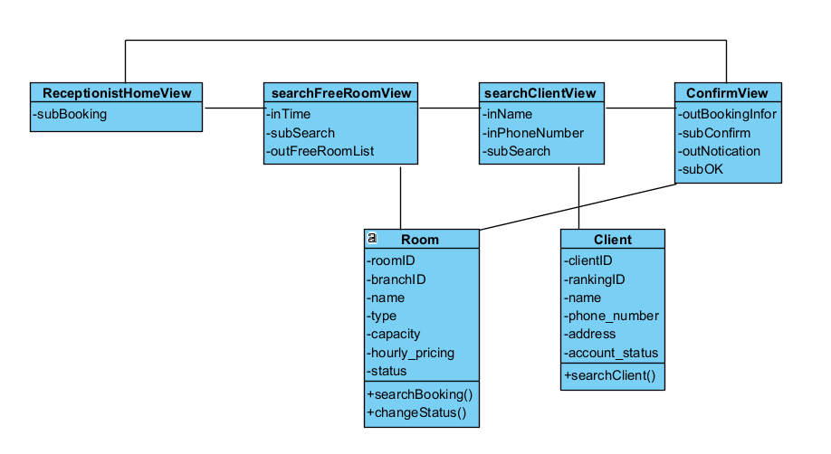
## Mô hình hóa tĩnh - Biểu đồ phân tích chức năng
### 3.1. Chức năng “Đặt phòng”
	Phân tích chi tiết chức năng “Đặt phòng” diễn ra như sau:
Sau khi đăng nhập thành công, hiển thị giao diện chính của nhân viên lễ tân → Đề xuất lớp ReceptionistHomeView, có nút đặt phòng.
Khi ấn nút đặt phòng, hiển thị giao diện tìm phòng trống → Đề xuất lớp SearchFreeRoomView, có các ô nhập thời gian check-in, nút tìm, danh sách kết quả.
Nhân viên nhập thời gian check-in, và ấn nút tìm kiếm → Hệ thống cần tìm phòng trống theo thời gian yêu cầu → Cần chức năng searchFreeRoom() của đối tượng Room.
Khi nhân viên ấn vào phòng trống, hệ thống hiện lên giao diện nhập thông tin khách hàng → Đề xuất lớp SearchClientView, có ô nhập tên, ô nhập số điện thoại, nút tìm kiếm.
Khi nhân viên ấn tìm kiếm → Hệ thống cần tìm thông tin khách hàng tương ứng trong cơ sở dữ liệu → Cần chức năng searchClient() của đối tượng Client.
Khi nhân viên ấn vào dòng chứa thông tin khách hàng tương ứng, giao diện hiển thị xác nhận thông tin đặt phòng → Đề xuất lớp ConfirmView, có phần hiển thị thông tin đặt phòng, và nút xác nhận.
Nhân viên ấn nút xác nhận → Hệ thống chuyển trạng thái phòng thành “Chờ nhận” → Cần chức năng changeStatus() của đối tượng Room.
Hệ thống lưu xong báo lại lớp ConfirmView, lớp ConfirmView báo thành công cho nhân viên → Nhân viên ấn nút OK → Hệ thống quay về lớp ReceptionistHomeView.
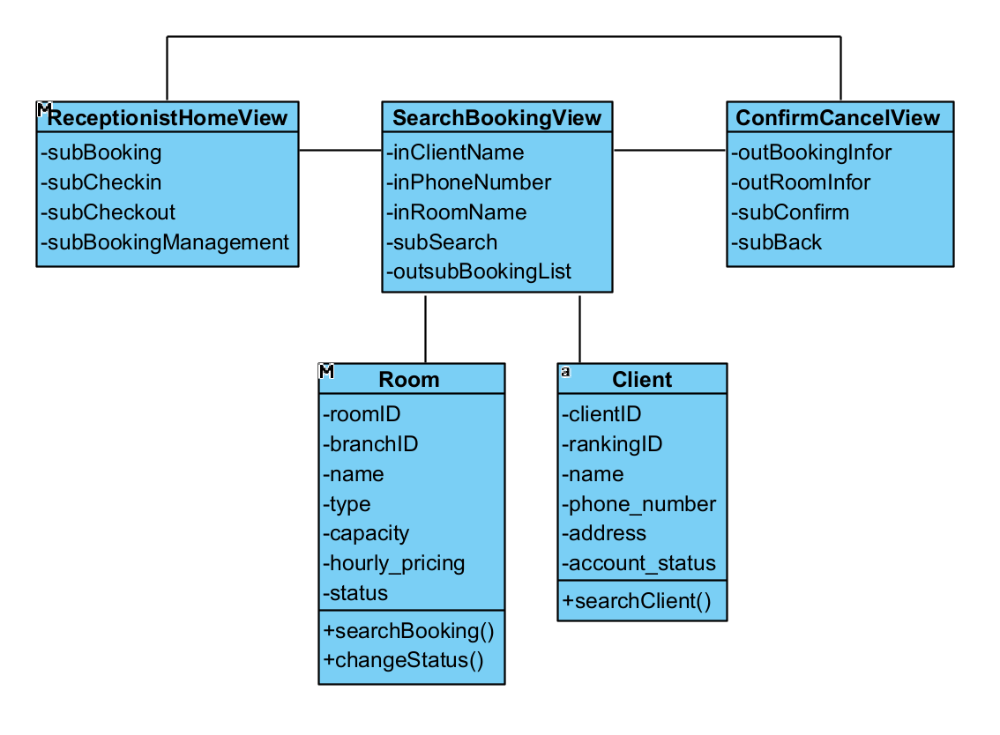
	 	 	
### 3.2. Chức năng “Huỷ phòng”
	Phân tích chi tiết chức năng “Hủy phòng” diễn ra như sau:
Từ giao diện chính của nhân viên lễ tân, nhân viên ấn chọn chức năng quản lý đặt phòng → Đề xuất lớp ReceptionistHomeView, có nút quản lý đặt phòng.
Hệ thống hiển thị giao diện tra cứu đặt phòng → Đề xuất lớp SearchBookingView, có các ô nhập thông tin tìm kiếm (tên khách hàng, số điện thoại, tên phòng), nút tìm kiếm và danh sách kết quả.
Nhân viên nhập thông tin cần tra cứu và ấn nút tìm kiếm → Hệ thống truy xuất thông tin khách hàng và thông tin phòng tương ứng trong cơ sở dữ liệu → Cần chức năng searchClient() của đối tượng Client và chức năng searchBooking() của đối tượng Room.
Khi nhân viên ấn chọn đúng thông tin phòng cần hủy đặt, hệ thống hiển thị giao diện yêu cầu xác nhận → Đề xuất lớp ConfirmCancelView, có phần hiển thị thông tin chi tiết đặt phòng, thông tin phòng và nút xác nhận hủy.
Nhân viên ấn xác nhận hủy phòng → Hệ thống cập nhật trạng thái phòng về mức “Trống” → Cần chức năng changeStatus() của đối tượng Room.
Hệ thống lưu xong báo lại cho lớp ConfirmCancelView, lớp ConfirmCancelView hiển thị thông báo thành công cho nhân viên → Nhân viên ấn nút quay lại (Back) → Hệ thống quay về lớp ReceptionistHomeView.
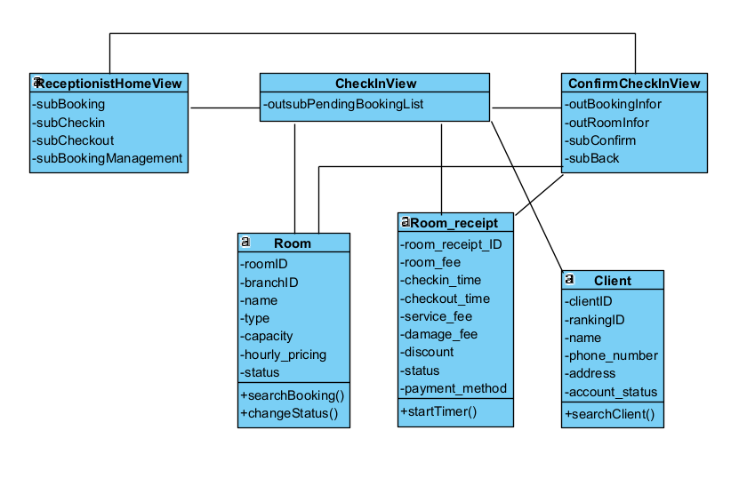
### 3.3. Chức năng “Check-in”
Phân tích chi tiết chức năng “Check-in” diễn ra như sau:
Nhân viên lễ tân click chức năng “Check-in” trên giao diện ReceptionistHomeView → Đề xuất lớp CheckInView, hiển thị danh sách các phòng đang ở trạng thái “Chờ nhận”. Để có danh sách này, hệ thống cần truy xuất dữ liệu thông qua hàm searchBooking() của đối tượng Room và thông tin khách hàng từ đối tượng Client.
Nhân viên chọn phòng cần check-in → Hệ thống hiển thị thông tin chi tiết → Đề xuất lớp ConfirmCheckInView, có phần hiển thị thông tin xác nhận đặt phòng, thông tin phòng và nút xác nhận check-in.
Nhân viên ấn nút xác nhận → Hệ thống chuyển trạng thái phòng từ “Chờ nhận” sang “Đang hoạt động” → Cần chức năng changeStatus() của đối tượng Room.
Đồng thời, hệ thống tạo hóa đơn và ghi nhận thời gian bắt đầu sử dụng → Cần chức năng startTimer() của đối tượng Room_receipt.
Hệ thống lưu xong báo lại cho lớp ConfirmCheckInView, lớp ConfirmCheckInView báo thành công cho nhân viên → Nhân viên ấn nút quay lại → Hệ thống quay về lớp ReceptionistHomeView.
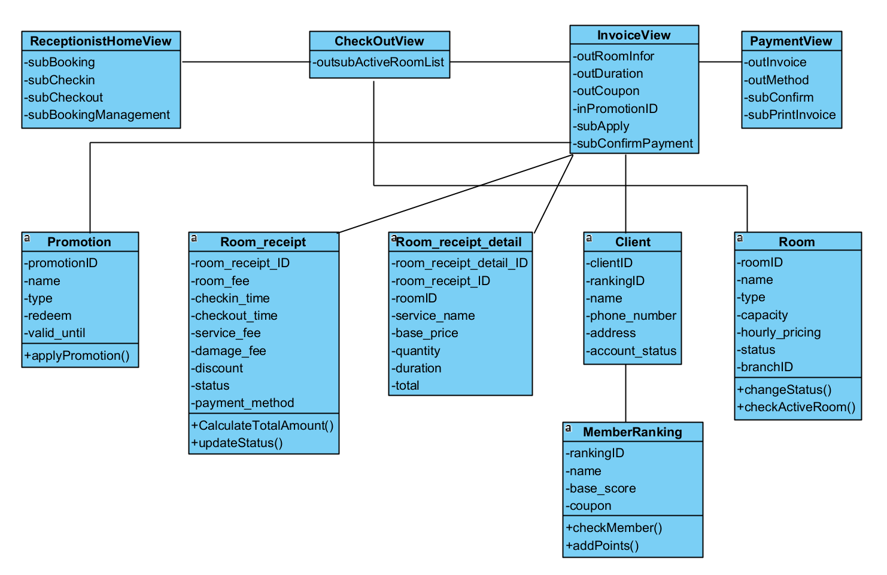
### 3.4. Chức năng “Check-out”
Phân tích chi tiết chức năng “Check-out” diễn ra như sau:
Nhân viên lễ tân click chức năng “Check-out” trên giao diện chính ReceptionistHomeView → Đề xuất lớp CheckOutView, hiển thị danh sách các phòng đang hoạt động (dữ liệu truy xuất từ đối tượng Room).
Nhân viên chọn phòng cần check-out → Hệ thống tính toán tổng tiền → Cần chức năng CalculateTotalAmount() của đối tượng Room_receipt (kết hợp dữ liệu từ Room_receipt_detail).
Hệ thống chuyển sang giao diện hóa đơn → Đề xuất lớp InvoiceView, hiển thị chi tiết tiền phòng, dịch vụ, thời gian sử dụng và tổng tiền.
Hệ thống kiểm tra hạng thành viên của khách hàng → Cần chức năng checkMember() của đối tượng MemberRanking (thông qua liên kết với Client).
Nếu khách hàng có mã ưu đãi, nhân viên nhập mã và ấn áp dụng → Cần chức năng applyPromotion() của đối tượng Promotion.
Nhân viên xác nhận số tiền cuối cùng và chọn phương thức thanh toán → Chuyển sang giao diện thanh toán → Đề xuất lớp PaymentView để xử lý và in hóa đơn.
Thanh toán hoàn tất, hệ thống cập nhật trạng thái hóa đơn thành "Đã thanh toán" → Cần chức năng updateStatus() của đối tượng Room_receipt.
Hệ thống cập nhật trạng thái phòng về “Trống” → Cần chức năng changeStatus() của đối tượng Room.
Đồng thời, hệ thống cộng điểm tích lũy cho khách hàng (nếu là hội viên) → Cần chức năng addPoints() của đối tượng MemberRanking.
Hệ thống thông báo thành công, nhân viên ấn hoàn tất → Quay trở về ReceptionistHomeView.
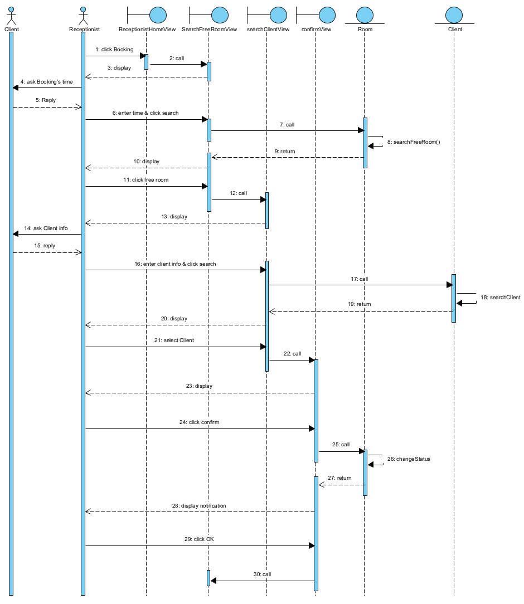
## Mô hình hóa động - Biểu đồ tuần tự
### 4.1. Chức năng “Đặt phòng”
Nhân viên click chức năng đặt phòng trên giao diện ReceptionistHomeView.
Lớp  ReceptionistHomeView gọi sang lớp SearchFreeRoomView.
Lớp SearchFreeRoomView hiển thị cho nhân viên.
Nhân viên hỏi khách hàng thời gian đặt phòng.
Khách hàng trả lời.
Nhân viên nhập thời gian đặt phòng mong muốn của khách vào ô thời gian và ấn nút tìm kiếm.
Lớp SearchFreeRoomView gọi đến lớp Room để xử lý thông tin.
Lớp Room gọi hàm searchFreeRoom().
Lớp Room trả kết quả về cho SearchFreeRoomView.
Lớp SearchFreeRoomView hiển thị danh sách các phòng trống cho nhân viên.
Nhân viên ấn vào phòng trống.
Lớp SearchFreeRoomView gọi sang lớp SearchClientView.
Lớp SearchClientView hiển thị.
Nhân viên hỏi khách hàng về thông tin khách hàng.
Khách hàng trả lời.
Nhân viên nhập thông tin khách hàng và ấn nút tìm kiếm.
Lớp SearchClientView gọi đến lớp Client.
Lớp Client gọi hàm searchClient().
Lớp Client trả kết quả về cho lớp SearchClientView.
Lớp SearchClientView hiển thị thông tin khách hàng tương ứng.
Nhân viên chọn thông tin khách hàng tương ứng.
Lớp SearchClientView gọi sang lớp ConfirmView.
Lớp ConfirmView hiển thị.
Nhân viên ấn confirm.
Lớp ConfirmView gọi đến lớp Room để xử lý.
Lớp Room gọi hàm changeStatus().
Lớp Room trả kết quả về lớp ConfirmView.
Lớp ConfirmView hiện thông báo.
Nhân viên ấn OK.
Lớp ConfirmView gọi lại về lớp ReceptionistHomeView.
Lớp ReceptionistHomeView hiển thị.
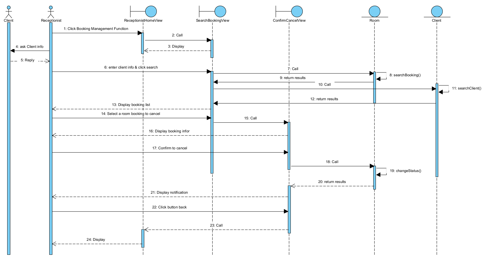
### 4.2. Chức năng “Huỷ phòng”
Nhân viên click chức năng quản lý đặt phòng trên giao diện ReceptionistHomeView.
Lớp ReceptionistHomeView gọi sang lớp SearchBookingView.
Lớp SearchBookingView hiển thị cho nhân viên.
Nhân viên hỏi khách hàng thông tin tra cứu (họ tên, số điện thoại hoặc mã phòng đã đặt).
Khách hàng trả lời.
Nhân viên nhập thông tin và ấn nút tìm kiếm.
Lớp SearchBookingView gọi đến lớp Client (để tra cứu khách).
Lớp Client gọi hàm searchClient().
Lớp Client trả kết quả về cho SearchBookingView.
Lớp SearchBookingView gọi đến lớp Room (để tra cứu phòng).
Lớp Room gọi hàm searchBooking().
Lớp Room trả kết quả về cho SearchBookingView.
Lớp SearchBookingView hiển thị danh sách các booking tương ứng.
Nhân viên ấn chọn bản ghi booking cần hủy.
Lớp SearchBookingView gọi sang lớp ConfirmCancelView.
Lớp ConfirmCancelView hiển thị thông tin đặt phòng.
Nhân viên ấn xác nhận hủy.
Lớp ConfirmCancelView gọi đến lớp Room để xử lý.
Lớp Room gọi hàm changeStatus() (để cập nhật trạng thái về "Trống").
Lớp Room trả kết quả về lớp ConfirmCancelView.
Lớp ConfirmCancelView hiện thông báo thành công.
Nhân viên ấn nút quay lại.
Lớp ConfirmCancelView gọi lại về lớp ReceptionistHomeView.
Lớp ReceptionistHomeView hiển thị.
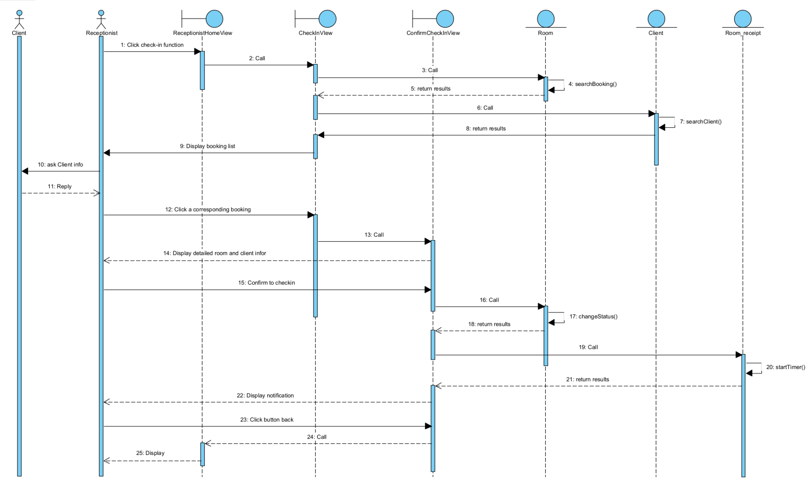

### 4.3. Chức năng “Check-in”
Nhân viên click chức năng "Check-in" trên giao diện ReceptionistHomeView.
Lớp ReceptionistHomeView gọi sang lớp CheckInView.
Lớp CheckInView gọi đến lớp Room (tìm phòng "Chờ nhận").
Lớp Room gọi hàm searchBooking().
Lớp Room trả kết quả dữ liệu về cho CheckInView.
Lớp CheckInView gọi đến lớp Client (lấy thông tin khách hàng).
Lớp Client gọi hàm searchClient().
Lớp Client trả kết quả dữ liệu về cho CheckInView.
Lớp CheckInView hiển thị danh sách chờ nhận lên màn hình cho nhân viên.
Nhân viên hỏi khách hàng thông tin (tên hoặc số điện thoại) để đối chiếu.
Khách hàng trả lời.
Nhân viên ấn chọn bản ghi tương ứng cần check-in trên danh sách.
Lớp CheckInView gọi sang lớp ConfirmCheckInView.
Lớp ConfirmCheckInView hiển thị thông tin chi tiết của phòng và khách hàng.
Nhân viên ấn nút xác nhận check-in.
Lớp ConfirmCheckInView gọi đến lớp Room để xử lý.
Lớp Room gọi hàm changeStatus() (chuyển sang "Đang hoạt động").
Lớp Room trả kết quả lưu dữ liệu về lớp ConfirmCheckInView.
Lớp ConfirmCheckInView gọi đến lớp Room_receipt để xử lý.
Lớp Room_receipt gọi hàm startTimer() (ghi nhận thời gian bắt đầu sử dụng).
Lớp Room_receipt trả kết quả lưu dữ liệu về lớp ConfirmCheckInView.
Lớp ConfirmCheckInView hiện thông báo thành công.
Nhân viên ấn nút quay lại.
Lớp ConfirmCheckInView gọi lại về lớp ReceptionistHomeView.
Lớp ReceptionistHomeView hiển thị.
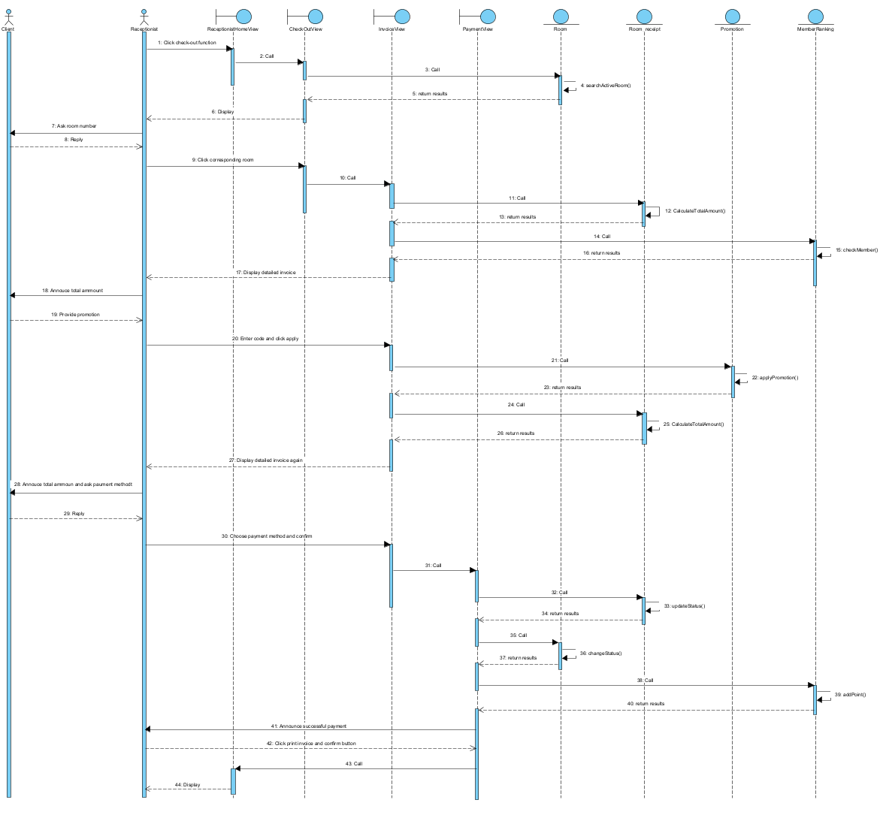

### 4.4. Chức năng “Check-out”
Nhân viên click chức năng "Check-out" trên giao diện ReceptionistHomeView.
Lớp ReceptionistHomeView gọi sang lớp CheckOutView.
Lớp CheckOutView gọi đến lớp Room để lấy dữ liệu 
Lớp room gọi hàm searchRoom().
Lớp room trả kết quả về lớp CheckOutView.
Lớp CheckOutView hiển thị danh sách phòng "Đang hoạt động" cho nhân viên.
Nhân viên hỏi khách hàng số phòng cần trả.
Khách hàng trả lời.
Nhân viên chọn phòng tương ứng trên danh sách.
Lớp CheckOutView gọi sang lớp InvoiceView.
Lớp InvoiceView gọi đến đối tượng Room_receipt (để tính tổng tiền).
Lớp Room_receipt gọi hàm CalculateTotalAmount().
Lớp Room_receipt trả kết quả về lớp InvoiceView.
Lớp InvoiceView gọi đến đối tượng MemberRanking (để kiểm tra hạng thành viên).
Lớp MemberRanking gọi hàm checkMember().
Lớp MemberRanking trả kết quả về lớp InvoiceView.
Lớp InvoiceView hiển thị chi tiết hóa đơn.
Nhân viên thông báo tổng tiền cho khách hàng.
Khách hàng cung cấp mã ưu đãi (nếu có).
Nhân viên nhập mã và ấn áp dụng.
Lớp InvoiceView gọi đến đối tượng Promotion.
Lớp Promotion gọi hàm applyPromotion().
Lớp Promotion trả kết quả về InvoiceView.
Lớp InvoiceView gọi lại đến lớp Room_receipt (cập nhật lại tổng tiền).
Lớp Room_receipt gọi hàm CalculateTotalAmount().
Lớp Room_receipt trả kết quả về lớp InvoiceView.
Lớp InvoiceView hiển thị chi tiết hoá đơn lại lần nữa cho nhân viên lễ tân.
Nhân viên lễ tân thông báo lại tổng tiền cho khách hàng và hỏi khách hàng muốn thanh toán theo phương thức nào.
Khách hàng trả lời. 
Nhân viên chọn phương thức thanh toán và click nút xác nhận thanh toán.
Lớp InvoiceView gọi sang lớp PaymentView.
Lớp PaymentView gọi sang lớp Room_receipt (cập nhật trạng thái "Đã thanh toán").
Lớp Room_receipt  gọi hàm updateStatus().
Lớp Room_receipt trả kết quả về lớp PaymentView.
Lớp PaymentView gọi đến lớp Room (chuyển về trạng thái “Trống”).
Lớp Room gọi hàm changeStatus().
Lớp Room trả kết quả về lớp PaymentView.
Lớp PaymentView gọi đến lớp MemberRanking (cộng điểm tích luỹ).
Lớp MemberRanking gọi hàm addPoints().
Lớp MemberRanking trả kết quả về lớp PaymentView.
Lớp PaymentView hiển thị thông báo thanh toán thành công.
Nhân viên click nút in hóa đơn (để đưa cho khách hàng) và ấn hoàn tất.
Lớp PaymentView gọi lại về lớp ReceptionistHomeView.
Lớp ReceptionistHomeView hiển thị.
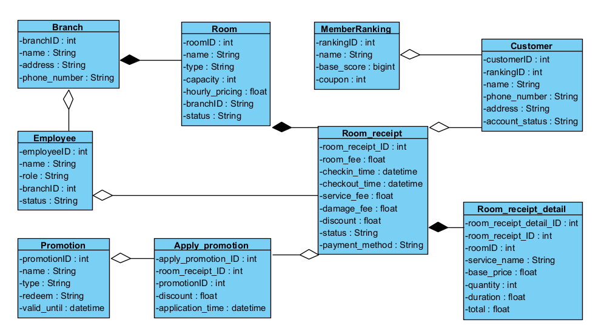

# III. PHA THIẾT KẾ
## Thiết kế lớp thực thể
## 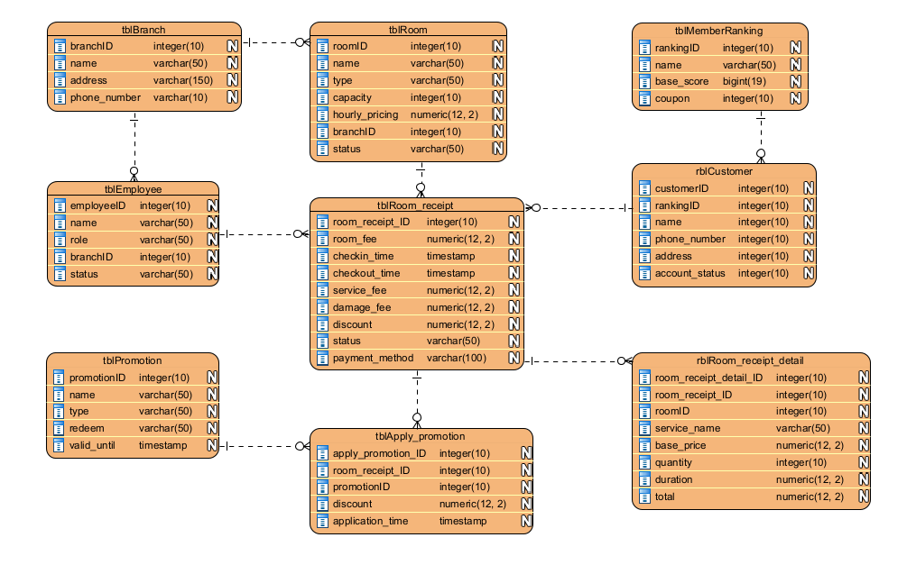
## Thiết kế CSDL
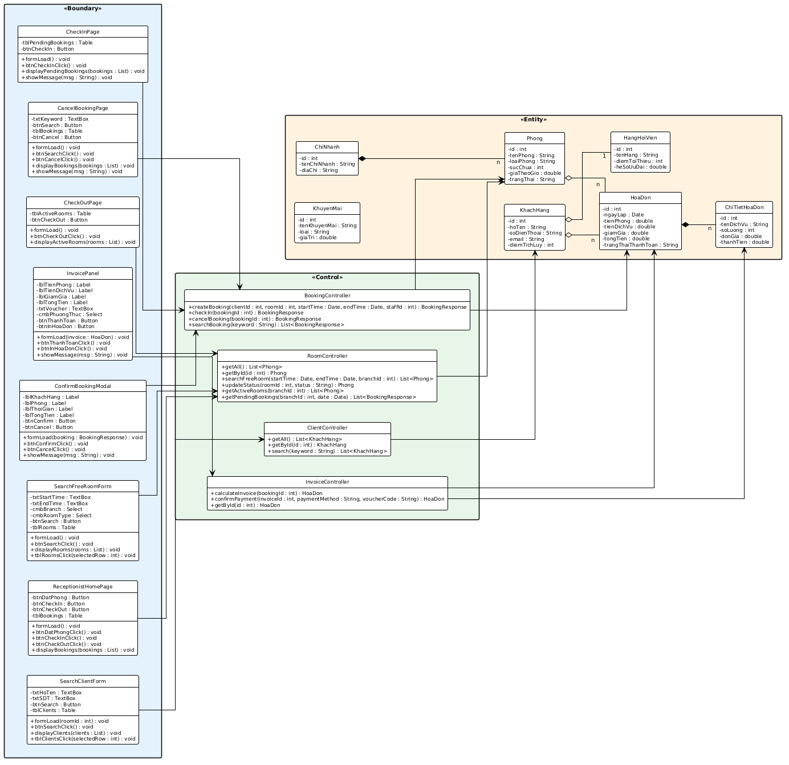
## Thiết kế tĩnh
## 3.1. Thiết kế giao diện
### Màn hình 1: ReceptionistHomePage — Giao diện chính lễ tân
+------------------------------------------------------------------+ |  [Logo]  Quan ly Karaoke ABC            [Nhan vien: Nguyen Van A]| +------------------------------------------------------------------+ |  Chi nhanh: Quan 1                    	Ngay: 30/05/2026   	| +------------------------------------------------------------------+ |                                                                  | |  +------------------+  +------------------+  +------------------+| |  |   DAT PHONG  	|  |   CHECK-IN   	|  |   CHECK-OUT  	|  | |  |   [Click de dat] |  |   [Click de C.I] |  |   [Click de C.O] |  | |  +------------------+  +------------------+  +------------------+  | |                                                                    | |  Danh sach booking hom nay:                                    	| |  +--------------------------------------------------------------+  | |  | maBK | khachHang  | phong  | gioDat	| trangThai     	|  | |  |------|------------|--------|-----------|-------------------|  | |  | BK001| Nguyen V.A | P.VIP1 | 14:00 	| Cho nhan      	|  | |  | BK002| Tran T.B   | P.Std3 | 15:00 	| Dang hoat dong	|  | |  | BK003| Le M.C 	| P.VIP2 | 16:00 	| Cho nhan      	|  | |  +--------------------------------------------------------------+  | |                                                                    | +------------------------------------------------------------------+
### Màn hình 2: SearchFreeRoomForm — Tìm phòng trống
+------------------------------------------------------------------+ |  [< Quay lai]   Tim phong trong                              	| +------------------------------------------------------------------+ |                                                                    | |  Thoi gian dat:  [30/05/2026]  Tu: [14:00]  Den: [17:00]    	| |  Chi nhanh:  	[Quan 1   	v]                             	| |  Loai phong: 	[Tat ca    	v]                            	| |                     	                                           | |  [Tim phong trong]                                                 | |                                                                    | |  Ket qua: 3 phong trong                                        	| |  +--------------------------------------------------------------+  | |  | maPhong | loaiPhong  | sucChua | giaTheoGio | trangThai 	|  | |  |---------|------------|---------|------------|---------------|  | |  | P.VIP1  | Super VIP  | 15  	| 200000 	| Trong     	|  | |  | P.Std3  | Standard   | 8   	| 100000 	| Trong     	|  | |  | P.VIP2  | VIP        | 12  	| 150000 	| Trong     	|  | |  +--------------------------------------------------------------+  | |                                                                    | |  [Chon phong]                                                      | +------------------------------------------------------------------+
### Màn hình 3: SearchClientForm — Tìm thông tin khách hàng
+------------------------------------------------------------------+ |  [< Quay lai]   Tim khach hang                               	| +------------------------------------------------------------------+ |                                                                    | |  Phong da chon: P.VIP1 (Super VIP, 200000/gio)               	| |  Thoi gian: 30/05/2026, 14:00 - 17:00                        	| |                                                                    | |  Thong tin khach hang:                                             | |  hoTen:    	[Nguyen Van An       	]                     	| |  soDienThoai:  [0912345678          	]                     	| |                                                                    | |  [Tim kiem]                                                        | |                                                                    | |  Ket qua:                                                          | |  +--------------------------------------------------------------+  | |  | hoTen      	| soDienThoai | hangHoiVien | diemTichLuy	|  | |  |----------------|-------------|-------------|----------------|  | |  | Nguyen Van An  | 0912345678  | Bac     	| 1250       	|  | |  +--------------------------------------------------------------+  | |                                                                    | |  Khach moi? [Dang ky nhanh]                                    	| +------------------------------------------------------------------+
### Màn hình 4: ConfirmBookingModal — Xác nhận đặt phòng
+------------------------------------------------------------------+ |  [< Quay lai]   Xac nhan dat phong                            	| +------------------------------------------------------------------+ |                                                                    | |  +--------------------------------------------------------------+  | |  | THONG TIN DAT PHONG                                          |  | |  |----------------------------------------------------------------|  | |  | khachHang: 	Nguyen Van An (0912345678)                 	|  | |  | hangHoiVien:   Bac (giam 10%)                             	|  | |  | phong:     	P.VIP1 - Super VIP                         	|  | |  | chiNhanh:  	Quan 1                                          |  | |  | thoiGian:  	30/05/2026, 14:00 - 17:00 (3 gio)         	|  | |  | giaTheoGio:	200000                                     	|  | |  | duKien:    	600000                                     	|  | |  +--------------------------------------------------------------+  | |                   	                                             | |  [Xac nhan dat phong]	[Huy]                                	| +------------------------------------------------------------------+
### Màn hình 5: CheckOutPage — Thanh toán check-out
+------------------------------------------------------------------+ |  [< Quay lai]   Check-out - Phong P.VIP1                      	| +------------------------------------------------------------------+ |                                                                    | |  +--------------------------------------------------------------+  | |  | HOA DON THANH TOAN                                           |  | |  |----------------------------------------------------------------|  | |  | khachHang:     Nguyen Van An (Bac - giam 10%)            	|  | |  | phong:     	P.VIP1                                     	|  | |  | thoiGian:  	14:05 - 16:45 (2h40p)                     	|  | |  |----------------------------------------------------------------|  | |  | tienPhong: 	150000 x 3 gio (lam tron) = 450000                   	|  | |  | tienDichVu:	2 lon bia + 1 dia trai cay = 250000       	|  | |  | tongCong:  	784000                                     	|  | |  | giamGia(10%):  -83500                                        |  | |  | THANH TOAN:	705600                                     	|  | |  +--------------------------------------------------------------+  | |                                                                    | |  maVoucher: [____________] [Ap dung]                           	| |                                                                    | |  phuongThucThanhToan: (o) Tien mat  ( ) Chuyen khoan          	| |                                                                    | |  [Xac nhan thanh toan]	[In hoa don]	[Huy]               	| +------------------------------------------------------------------+
### Màn hình 6: CancelBookingPage — Quản lý đặt phòng (Huỷ)
+------------------------------------------------------------------+ |  [< Quay lai]   Quan ly dat phong                             	| +------------------------------------------------------------------+ |                                                                    | |  Tim kiem: [Ten khach / SDT / maBK___________] [Tim kiem]     	| |                                                                    | |  Ket qua:                                                          | |  +--------------------------------------------------------------+  | |  | maBK | khachHang  | phong  | gioDat	| trangThai     	|  | |  |------|------------|--------|-----------|-------------------|  | |  | BK001| Nguyen V.A | P.VIP1 | 14:00 	| Cho nhan      	|  | |  +--------------------------------------------------------------+  | |                                                                    | |  +--------------------------------------------------------------+  | |  | Chi tiet booking BK001           	                        |  | |  |----------------------------------------------------------------|  | |  | khachHang: 	Nguyen Van An (0912345678)                 	|  | |  | phong:     	P.VIP1 - Super VIP                         	|  | |  | thoiGian:  	30/05/2026, 14:00 - 17:00                 	|  | |  | tienCoc:   	200000                                     	|  | |  +--------------------------------------------------------------+  | |                                                                    | |  [Huy dat phong]          	[Quay lai]                      	| +------------------------------------------------------------------+
### Màn hình 7: CheckInPage — Check-in phòng
+------------------------------------------------------------------+ |  [< Quay lai]   Check-in                                      	| +------------------------------------------------------------------+ |                                                                    | |  Danh sach booking "Cho nhan" hom nay:                         	| |  +--------------------------------------------------------------+  | |  | maBK | khachHang  | phong  | gioDat	| trangThai     	|  | |  |------|------------|--------|-----------|-------------------|  | |  | BK001| Nguyen V.A | P.VIP1 | 14:00 	| Cho nhan      	|  | |  | BK003| Le M.C 	| P.VIP2 | 16:00 	| Cho nhan      	|  | |  +--------------------------------------------------------------+  | |                                                                    | |  +--------------------------------------------------------------+  | |  | Chi tiet booking BK001                                   	|  | |  |----------------------------------------------------------------|  | |  | khachHang: 	Nguyen Van An (0912345678)                 	|  | |  | phong:     	P.VIP1 - Super VIP                         	|  | |  | gioDat:    	14:00 - 17:00                              	|  | |  +--------------------------------------------------------------+  | |                                                                    | |  [Xac nhan Check-in]       	[Huy booking]                  	| +------------------------------------------------------------------+
## 3.2. Thiết kế mô hình MVC
Mô hình MVC được thiết kế theo kiến trúc BCE (Boundary – Control – Entity) với 3 tầng:
Boundary (Giao diện): React components xử lý giao diện người dùng
Control (Điều khiển): Spring Boot Controllers xử lý nghiệp vụ
Entity (Thực thể): JPA Entities biểu diễn dữ liệu lưu trữ
### a) Chức năng Đặt phòng
1. Tầng giao diện (Boundary)

| Lớp | Component | Mô tả |
| --- | --- | --- |
| ReceptionistHomePage | Page | Trang chính lễ tân, hiển thị danh sách booking hôm nay |
| SearchFreeRoomForm | Form | Tìm phòng trống theo thời gian và chi nhánh |
| SearchClientForm | Form | Tìm thông tin khách hàng theo tên/SĐT |
| ConfirmBookingModal | Modal | Xác nhận thông tin đặt phòng |

2. Tầng điều khiển (Control)
a) Tìm phòng trống => searchFreeRoom()
 Input: thời gian bắt đầu, thời gian kết thúc, mã chi nhánh
 Output: danh sách phòng trống
Ứng viên tham số vào: 
searchFreeRoom(startTime: Date, endTime: Date, branchId: int) → chọn (gom nhóm tham số)
  searchFreeRoom(startTime: Date, endTime: Date, branchId: int, roomType: String) → chọn (thêm filter loại phòng)
 Ứng viên tham số ra:
 searchFreeRoom(): void → loại (cần trả về danh sách)
searchFreeRoom(): List<Room> → chọn (trả về danh sách phòng)
b) Tìm khách hàng => searchClient()
Input: tên hoặc số điện thoại
 Output: danh sách khách hàng khớp
Ứng viên tham số vào:  searchClient(keyword: String) → chọn (tìm theo cả tên và SĐT)
Ứng viên tham số ra: searchClient(): List<Client> → chọn
c) Tạo booking => createBooking()
Input: mã khách hàng, mã phòng, thời gian bắt đầu, thời gian kết thúc, mã nhân viên
Output: đối tượng booking vừa tạo
  Ứng viên tham số vào: createBooking(clientId: int, roomId: int, startTime: Date, endTime: Date, staffId: int) → chọn
Ứng viên tham số ra: createBooking(): BookingResponse → chọn (trả về thông tin booking)
d) Thay đổi trạng thái phòng => updateRoomStatus()
 Input: mã phòng, trạng thái mới
 Output: đối tượng phòng đã cập nhật
 Ứng viên tham số vào: updateRoomStatus(roomId: int, status: String) → chọn
Ứng viên tham số ra:  updateRoomStatus(): Room → chọn
3. Tầng thực thể (Entity)

| Entity | Thuộc tính chính | Quan hệ |
| --- | --- | --- |
| Room | roomID, name, type, capacity, hourly_pricing, branchID, status | ManyToOne → Branch |
| Client | clientID, name, phone_number, account_status, rankingID | ManyToOne→MemberRanking |
| Branch | branchID, name, address, phone_number | — |

### b) Chức năng Check-in
1. Tầng giao diện (Boundary)

| Lớp | Component | Mô tả |
| --- | --- | --- |
| CheckInPage | Page | Hiển thị danh sách booking "Chờ nhận", nút xác nhận check-in |

2. Tầng điều khiển (Control)
a) Lấy danh sách booking chờ => getPendingBookings()
·       Input: mã chi nhánh, ngày
·       Output: danh sách booking trạng thái "Chờ nhận"
·       Ứng viên tham số vào:
·       getPendingBookings(branchId: int, date: Date) → chọn
·       Ứng viên tham số ra:
·       getPendingBookings(): List<BookingResponse> → chọn
b) Xác nhận check-in => checkIn()
·       Input: mã booking
·       Output: booking đã cập nhật
·       Ứng viên tham số vào:
·       checkIn(bookingId: int) → chọn
·       Ứng viên tham số ra:
·       checkIn(): BookingResponse → chọn
3. Tầng thực thể (Entity)

| Entity | Thuộc tính chính | Quan hệ |
| --- | --- | --- |
| Room | roomID, name, status | ManyToOne→Branch |
| Client | clientID, name, phone_number, account_status, rankingID | ManyToOne→MemberRanking |

### c) Chức năng Check-out
1. Tầng giao diện (Boundary)

| Lớp | Component | Mô tả |
| --- | --- | --- |
| CheckOutPage | Page | Hiển thị danh sách phòng đang hoạt động, tổng hợp hóa đơn |
| InvoicePanel | Panel | Hiển thị chi tiết hóa đơn, áp dụng voucher, chọn thanh toán |

2. Tầng điều khiển (Control)
a) Lấy danh sách phòng đang hoạt động => getActiveRooms()
Input: mã chi nhánh
  Output: danh sách phòng trạng thái "Đang hoạt động"
Ứng viên tham số vào:  getActiveRooms(branchId: int) → chọn
 Ứng viên tham số ra: getActiveRooms(): List<Room> → chọn
b) Tính tiền hóa đơn => calculateInvoice()
  Input: mã booking
Output: chi tiết hóa đơn (tiền phòng, tiền dịch vụ, giảm giá, tổng)
 Ứng viên tham số vào: calculateInvoice(bookingId: int) → chọn
Ứng viên tham số ra: calculateInvoice(): Room_receipt → chọn
c) Xác nhận thanh toán => confirmPayment()
Input: mã hóa đơn, phương thức thanh toán, mã voucher (nếu có)
  Output: hóa đơn đã thanh toán
  Ứng viên tham số vào: confirmPayment(invoiceId: int, paymentMethod: String, voucherCode: String) → chọn
 Ứng viên tham số ra: confirmPayment(): Room_receipt → chọn
3. Tầng thực thể (Entity)

| Entity | Thuộc tính chính | Quan hệ |
| --- | --- | --- |
| Room_receipt | room_receipt_ID, room_fee, service_fee, discount, status, payment_method | ManyToOne→Client, ManyToOne→Room |
| Room_receipt_detail | room_receipt_detail_ID, service_name, base_price, quantity, duration, total | ManyToOne→Room_receipt |
| Promotion | promotionID, name, type, redeem, valid_until | — |
| Apply_promotion | apply_promotion_ID, room_receipt_ID, promotionID, discount | ManyToOne→Room_receipt, ManyToOne→Promotion |

### d) Chức năng Huỷ phòng
1. Tầng giao diện (Boundary)

| Lớp | Component | Mô tả |
| --- | --- | --- |
| CancelBookingPage | Page | Tìm và hủy booking trạng thái "Chờ nhận" |

2. Tầng điều khiển (Control)
a) Tìm booking => searchBooking()
 Input: tên khách, SĐT, hoặc mã booking
  Output: danh sách booking khớp
  Ứng viên tham số vào: searchBooking(keyword: String) → chọn
Ứng viên tham số ra: searchBooking(): List<BookingResponse> → chọn
b) Hủy booking => cancelBooking()
  Input: mã booking
Output: booking đã hủy
Ứng viên tham số vào: cancelBooking(bookingId: int) → chọn
Ứng viên tham số ra:  cancelBooking(): BookingResponse → chọn
3. Tầng thực thể (Entity)

| Entity | Thuộc tính chính | Quan hệ |
| --- | --- | --- |
| Room | roomID, name, status | — |
| Client | clientID, name, phone_number, account_status, rankingID | ManyToOne→MemberRanking |

### Sơ đồ lớp thiết kế
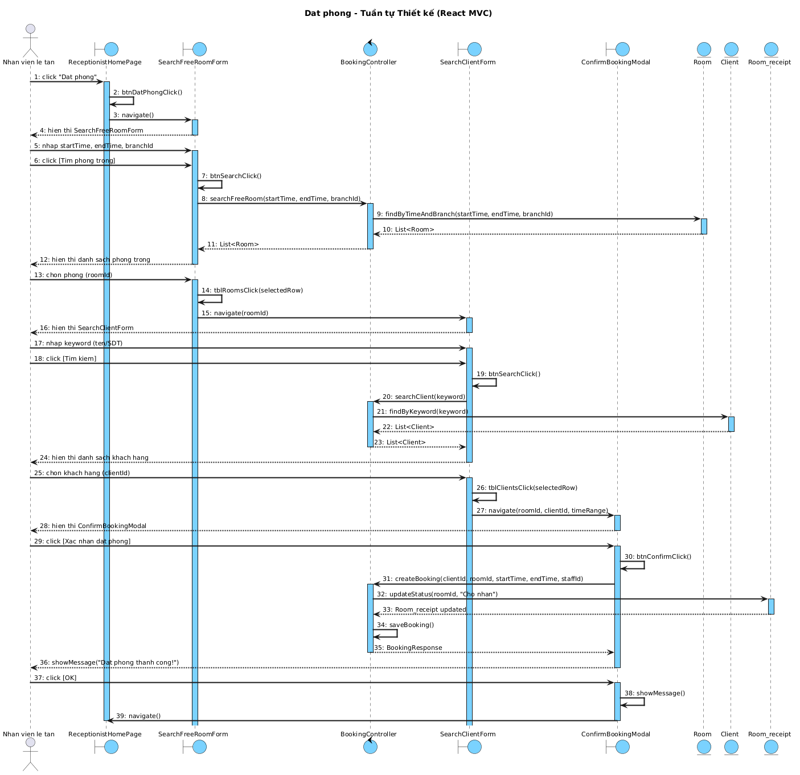

## Thiết kế động
### 4.1. Chức năng "Đặt phòng"
#### a) Biểu đồ tuần tự
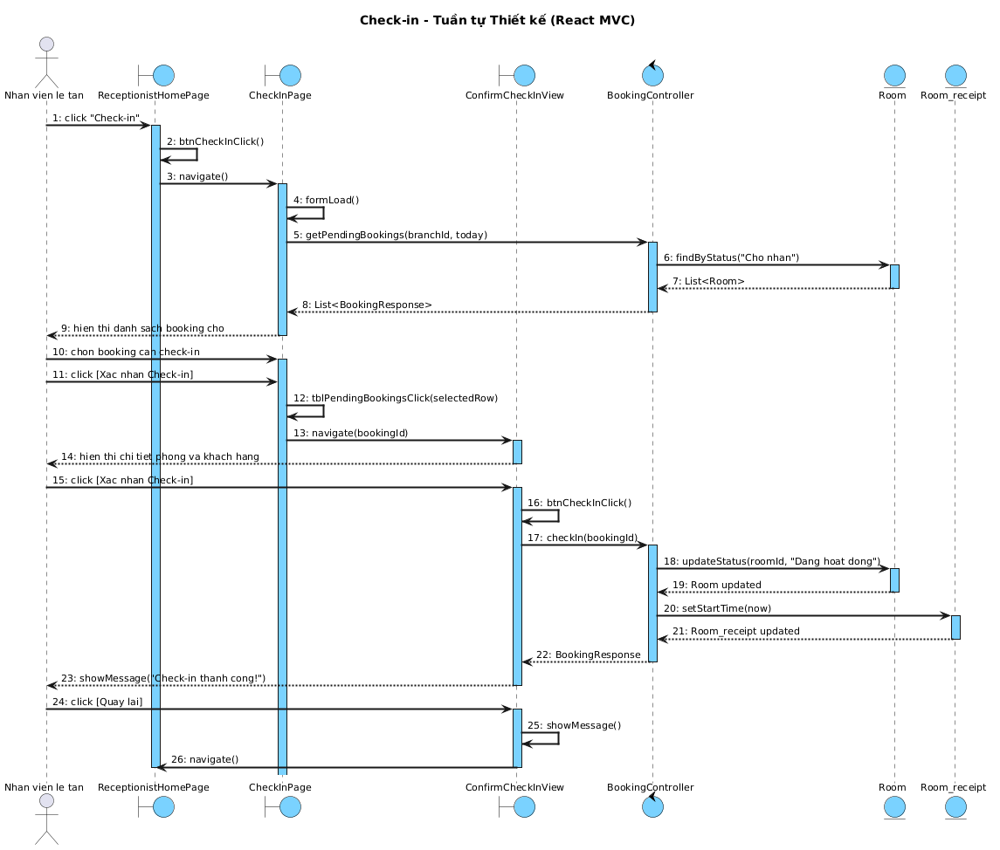	
#### b) Kịch bản phiên bản 3
1. Nhân viên lễ tân click chức năng "Đặt phòng" trên giao diện ReceptionistHomePage.
2. Phương thức btnDatPhongClick() của lớp ReceptionistHomePage được gọi.
3. Phương thức btnDatPhongClick() gọi phương thức navigate() của lớp SearchFreeRoomForm.
4. Lớp SearchFreeRoomForm hiển thị form tìm phòng trống cho nhân viên.
5. Nhân viên nhập thời gian bắt đầu (startTime), thời gian kết thúc (endTime) và chọn chi nhánh (branchId).
6. Nhân viên click nút [Tìm phòng trống].
7. Phương thức btnSearchClick() của lớp SearchFreeRoomForm được gọi.
8. Phương thức btnSearchClick() gọi phương thức searchFreeRoom(startTime: Date, endTime: Date, branchId: int) của lớp BookingController.
9. Phương thức searchFreeRoom() gọi phương thức findByTimeAndBranch(startTime, endTime, branchId) của lớp Entity Room.
10. Lớp Room trả kết quả danh sách phòng trống về cho phương thức searchFreeRoom().
11. Phương thức searchFreeRoom() trả kết quả về cho phương thức btnSearchClick().
12. Lớp SearchFreeRoomForm hiển thị danh sách phòng trống cho nhân viên.
13. Nhân viên ấn vào phòng trống.
14. Phương thức tblRoomsClick(selectedRow: int) của lớp SearchFreeRoomForm được gọi.
15. Phương thức tblRoomsClick() gọi phương thức navigate(roomId) của lớp SearchClientForm.
16. Lớp SearchClientForm hiển thị form tìm khách hàng cho nhân viên.
17. Nhân viên nhập thông tin khách hàng (tên hoặc số điện thoại).
18. Nhân viên click [Tìm kiếm].
19. Phương thức btnSearchClick() của lớp SearchClientForm được gọi.
20. Phương thức btnSearchClick() gọi phương thức searchClient(keyword: String) của lớp BookingController.
21. Phương thức searchClient() gọi phương thức findByKeyword(keyword) của lớp Entity Client.
22. Lớp Client trả kết quả danh sách khách hàng về cho phương thức searchClient().
23. Phương thức searchClient() trả kết quả về cho phương thức btnSearchClick().
24. Lớp SearchClientForm hiển thị danh sách khách hàng khớp.
25. Nhân viên chọn thông tin khách hàng tương ứng.
26. Phương thức tblClientsClick(selectedRow: int) của lớp SearchClientForm được gọi.
27. Phương thức tblClientsClick() gọi phương thức navigate(roomId, clientId, timeRange) của lớp ConfirmBookingModal.
28. Lớp ConfirmBookingModal hiển thị thông tin xác nhận đặt phòng.
29. Nhân viên ấn nút xác nhận.
30. Phương thức btnConfirmClick() của lớp ConfirmBookingModal được gọi.
31. Phương thức btnConfirmClick() gọi phương thức createBooking(clientId: int, roomId: int, startTime: Date, endTime: Date, staffId: int) của lớp BookingController.
32. Phương thức createBooking() gọi phương thức updateStatus(roomId, "Chờ nhận") của lớp Entity Room_receipt.
33. Lớp Room_receipt cập nhật trạng thái và trả kết quả về cho phương thức createBooking().
34. Phương thức createBooking() lưu booking vào CSDL và trả BookingResponse về cho phương thức btnConfirmClick().
35. Lớp ConfirmBookingModal hiển thị thông báo "Đặt phòng thành công!".
36. Nhân viên ấn nút OK.
37. Phương thức showMessage() của lớp ConfirmBookingModal được gọi.
38. Phương thức showMessage() gọi phương thức navigate() của lớp ReceptionistHomePage.
39. Hệ thống quay về giao diện chính ReceptionistHomePage.
### 4.2. Chức năng "Check-in"
#### a) Biểu đồ tuần tự
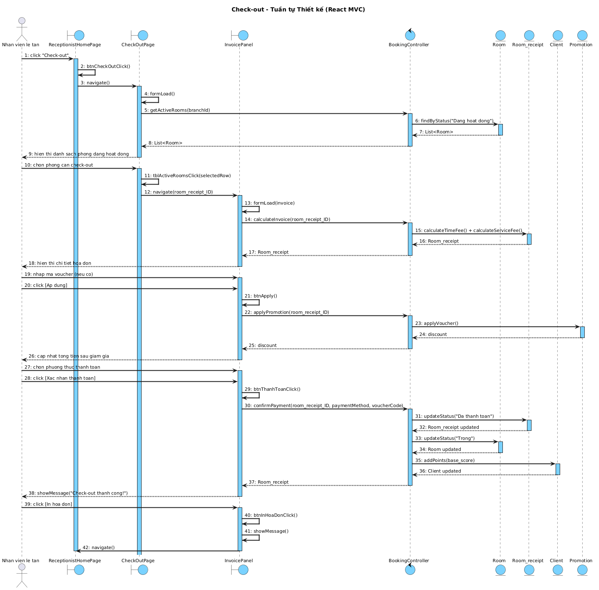
#### b) Kịch bản phiên bản 3
1. Nhân viên lễ tân click chức năng "Check-in" trên giao diện ReceptionistHomePage.
2. Phương thức btnCheckInClick() của lớp ReceptionistHomePage được gọi.
3. Phương thức btnCheckInClick() gọi phương thức navigate() của lớp CheckInPage.
4. Phương thức formLoad() của lớp CheckInPage được gọi.
5. Phương thức formLoad() gọi phương thức getPendingBookings(branchId: int, date: Date) của lớp BookingController.
6. Phương thức getPendingBookings() gọi phương thức findByStatus("Chờ nhận") của lớp Entity Room.
7. Lớp Room trả kết quả danh sách booking về cho phương thức getPendingBookings().
8. Phương thức getPendingBookings() trả kết quả về cho phương thức formLoad().
9. Lớp CheckInPage hiển thị danh sách booking "Chờ nhận" hôm nay cho nhân viên.
10. Nhân viên ấn chọn booking tương ứng cần check-in trên danh sách.
11. Phương thức tblPendingBookingsClick(selectedRow: int) của lớp CheckInPage được gọi.
12. Phương thức tblPendingBookingsClick() gọi phương thức navigate(bookingId) của lớp ConfirmCheckInView.
13. Lớp ConfirmCheckInView hiển thị thông tin chi tiết của phòng và khách hàng.
14. Nhân viên ấn nút xác nhận check-in.
15. Phương thức btnCheckInClick() của lớp ConfirmCheckInView được gọi.
16. Phương thức btnCheckInClick() gọi phương thức checkIn(bookingId: int) của lớp BookingController.
17. Phương thức checkIn() gọi phương thức updateStatus(roomId, "Đang hoạt động") của lớp Entity Room.
18. Lớp Room cập nhật trạng thái và trả kết quả về cho phương thức checkIn().
19. Phương thức checkIn() gọi phương thức setStartTime(now) của lớp Entity Room_receipt.
20. Lớp Room_receipt ghi nhận thời gian bắt đầu và trả kết quả về cho phương thức checkIn().
21. Phương thức checkIn() trả BookingResponse về cho phương thức btnCheckInClick().
22. Lớp ConfirmCheckInView hiển thị thông báo "Check-in thành công! Phòng [tên phòng] đã sẵn sàng."
23. Nhân viên ấn nút quay lại.
24. Phương thức showMessage() của lớp ConfirmCheckInView được gọi.
25. Phương thức showMessage() gọi phương thức navigate() của lớp ReceptionistHomePage.
26. Hệ thống quay về giao diện chính ReceptionistHomePage.
### 4.3. Chức năng "Check-out"
#### a) Biểu đồ tuần tự

#### b) Kịch bản phiên bản 3
1. Nhân viên lễ tân click chức năng "Check-out" trên giao diện ReceptionistHomePage.
2. Phương thức btnCheckOutClick() của lớp ReceptionistHomePage được gọi.
3. Phương thức btnCheckOutClick() gọi phương thức navigate() của lớp CheckOutPage.
4. Phương thức formLoad() của lớp CheckOutPage được gọi.
5. Phương thức formLoad() gọi phương thức getActiveRooms(branchId: int) của lớp BookingController.
6. Phương thức getActiveRooms() gọi phương thức findByStatus("Đang hoạt động") của lớp Entity Room.
7. Lớp Room trả kết quả danh sách phòng về cho phương thức getActiveRooms().
8. Phương thức getActiveRooms() trả kết quả về cho phương thức formLoad().
9. Lớp CheckOutPage hiển thị danh sách phòng đang sử dụng cho nhân viên.
10. Nhân viên chọn phòng tương ứng trên danh sách.
11. Phương thức tblActiveRoomsClick(selectedRow: int) của lớp CheckOutPage được gọi.
12. Phương thức tblActiveRoomsClick() gọi phương thức navigate(room_receipt_ID) của lớp InvoicePanel.
13. Phương thức formLoad(invoice: Room_receipt) của lớp InvoicePanel được gọi.
14. Phương thức formLoad() gọi phương thức calculateInvoice(room_receipt_ID: int) của lớp BookingController.
15. Phương thức calculateInvoice() gọi phương thức calculateTimeFee() + calculateServiceFee() của lớp Entity Room_receipt.
16. Lớp Room_receipt trả kết quả hóa đơn về cho phương thức calculateInvoice().
17. Phương thức calculateInvoice() trả Room_receipt về cho phương thức formLoad().
18. Lớp InvoicePanel hiển thị chi tiết tiền phòng, dịch vụ, thời gian sử dụng và tổng tiền.
19. Nhân viên thông báo tổng tiền cho khách hàng.
20. Khách hàng cung cấp mã ưu đãi (nếu có).
21. Nhân viên nhập mã và ấn áp dụng.
22. Phương thức btnApply() của lớp InvoicePanel được gọi.
23. Phương thức btnApply() gọi phương thức applyPromotion(room_receipt_ID: int) của lớp BookingController.
24. Phương thức applyPromotion() gọi phương thức applyVoucher() của lớp Entity Promotion.
25. Lớp Promotion trả kết quả giảm giá về cho phương thức applyPromotion().
26. Phương thức applyPromotion() trả kết quả về cho phương thức btnApply().
27. Lớp InvoicePanel cập nhật lại tổng tiền sau giảm giá.
28. Khách hàng đưa tiền mặt cho nhân viên.
29. Nhân viên chọn phương thức thanh toán và click nút xác nhận thanh toán.
30. Phương thức btnThanhToanClick() của lớp InvoicePanel được gọi.
31. Phương thức btnThanhToanClick() gọi phương thức confirmPayment(room_receipt_ID: int, paymentMethod: String, voucherCode: String) của lớp BookingController.
32. Phương thức confirmPayment() gọi phương thức updateStatus("Đã thanh toán") của lớp Entity Room_receipt.
33. Phương thức confirmPayment() gọi phương thức updateStatus("Trống") của lớp Entity Room.
34. Phương thức confirmPayment() gọi phương thức addPoints(base_score) của lớp Entity Client.
35. Các lớp Entity trả kết quả lưu trữ về cho phương thức confirmPayment().
36. Phương thức confirmPayment() trả Room_receipt về cho phương thức btnThanhToanClick().
37. Lớp InvoicePanel hiển thị thông báo "Check-out thành công! Tổng tiền: [X]đ."
38. Nhân viên click nút in hóa đơn (để đưa cho khách hàng) và ấn hoàn tất.
39. Phương thức btnInHoaDonClick() của lớp InvoicePanel được gọi.
40. Phương thức btnInHoaDonClick() gọi phương thức showMessage() của lớp InvoicePanel.
41. Phương thức showMessage() gọi phương thức navigate() của lớp ReceptionistHomePage.
42. Hệ thống quay về giao diện chính ReceptionistHomePage.
### 4.4. Chức năng "Huỷ phòng"
#### a) Biểu đồ tuần tự
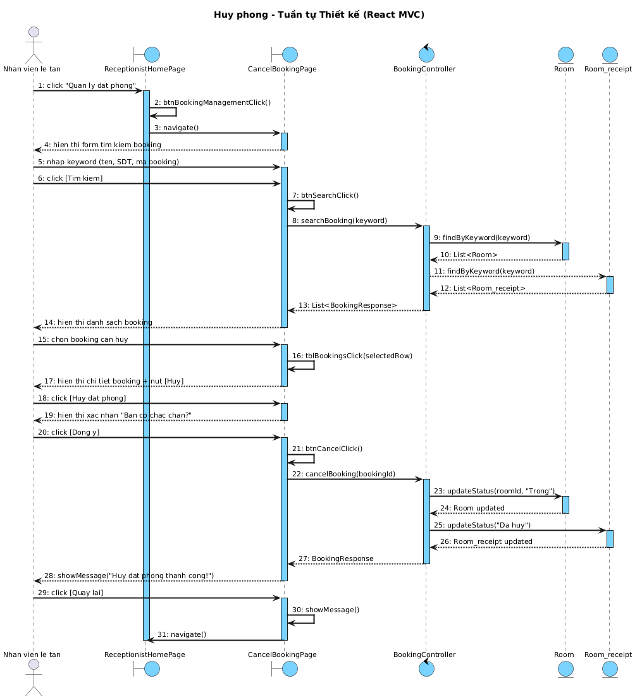
#### b) Kịch bản phiên bản 3
1. Nhân viên lễ tân click chức năng "Quản lý đặt phòng" trên giao diện ReceptionistHomePage.
2. Phương thức btnBookingManagementClick() của lớp ReceptionistHomePage được gọi.
3. Phương thức btnBookingManagementClick() gọi phương thức navigate() của lớp CancelBookingPage.
4. Lớp CancelBookingPage hiển thị form tìm kiếm booking.
5. Nhân viên nhập thông tin tìm kiếm (họ tên, số điện thoại hoặc mã phòng đã đặt) và ấn nút tìm kiếm.
6. Phương thức btnSearchClick() của lớp CancelBookingPage được gọi.
7. Phương thức btnSearchClick() gọi phương thức searchBooking(keyword: String) của lớp BookingController.
8. Phương thức searchBooking() gọi phương thức findByKeyword(keyword) của lớp Entity Room.
9. Lớp Room trả kết quả danh sách phòng về cho phương thức searchBooking().
10. Phương thức searchBooking() gọi phương thức findByKeyword(keyword) của lớp Entity Room_receipt.
11. Lớp Room_receipt trả kết quả danh sách hóa đơn về cho phương thức searchBooking().
12. Phương thức searchBooking() tổng hợp và trả kết quả về cho phương thức btnSearchClick().
13. Lớp CancelBookingPage hiển thị danh sách các booking tương ứng cho nhân viên.
14. Nhân viên ấn chọn bản ghi booking cần hủy.
15. Phương thức tblBookingsClick(selectedRow: int) của lớp CancelBookingPage được gọi.
16. Lớp CancelBookingPage hiển thị thông tin chi tiết booking và nút [Hủy đặt phòng].
17. Nhân viên click [Hủy đặt phòng].
18. Lớp CancelBookingPage hiển thị xác nhận "Bạn có chắc chắn muốn hủy booking này?".
19. Nhân viên click [Đồng ý].
20. Phương thức btnCancelClick() của lớp CancelBookingPage được gọi.
21. Phương thức btnCancelClick() gọi phương thức cancelBooking(bookingId: int) của lớp BookingController.
22. Phương thức cancelBooking() gọi phương thức updateStatus(roomId, "Trống") của lớp Entity Room.
23. Lớp Room cập nhật trạng thái và trả kết quả về cho phương thức cancelBooking().
24. Phương thức cancelBooking() gọi phương thức updateStatus("Đã hủy") của lớp Entity Room_receipt.
25. Lớp Room_receipt cập nhật trạng thái và trả kết quả về cho phương thức cancelBooking().
26. Phương thức cancelBooking() trả BookingResponse về cho phương thức btnCancelClick().
27. Lớp CancelBookingPage hiển thị thông báo "Hủy đặt phòng thành công."
28. Nhân viên ấn nút quay lại.
29. Phương thức showMessage() của lớp CancelBookingPage được gọi.
30. Phương thức showMessage() gọi phương thức navigate() của lớp ReceptionistHomePage.
31. Hệ thống quay về giao diện chính ReceptionistHomePage.
# IV. PHA CÀI ĐẶT VÀ KIỂM THỬ
## 1.1. Lập kế hoạch test
Phạm vi test: Module "Quản lý đặt và trả phòng" — 4 chức năng: Đặt phòng, Check-in, Check-out, Huỷ phòng.
Loại test: Functional testing (kiểm thử chức năng) — kiểm tra từng chức năng theo kịch bản sử dụng thực tế.
Nguyên tắc test:
Test case bao gồm: CSDL trước test → Kịch bản thực hiện → Kết quả mong đợi → CSDL sau test
CSDL mẫu dùng dữ liệu tiếng Việt, tên riêng Việt Nam
Dữ liệu trong CSDL phải khớp với ERD (III.2) và Entity class (III.1)
Kết quả mong đợi PHẢI liệt kê TOÀN BỘ UI elements khi sang giao diện mới

| STT | Chức năng | Trường hợp cần test |
| --- | --- | --- |
| 1 | Đặt phòng | Đặt phòng thành công khi có phòng trống |
| 2 | Đặt phòng | Không tìm thấy phòng trống theo thời gian yêu cầu |
| 3 | Đặt phòng | Khách hàng chưa có trong CSDL |
| 4 | Đặt phòng | Đặt phòng trực tuyến thành công |
| 5 | Check-in | Check-in thành công với booking trạng thái "Chờ nhận" |
| 6 | Check-in | Phòng đang dọn dẹp, không thể check-in |
| 7 | Check-in | Check-in phòng Super VIP |
| 8 | Check-out | Check-out thành công, thanh toán tiền mặt |
| 9 | Check-out | Check-out với voucher giảm giá |
| 10 | Check-out | Check-out với hội viên Vàng |
| 11 | Check-out | Voucher không hợp lệ |
| 12 | Check-out | Check-out chuyển khoản |
| 13 | Huỷ phòng | Hủy đặt phòng thành công |
| 14 | Huỷ phòng | Không tìm thấy booking |
| 15 | Huỷ phòng | Booking đã quá thời gian hủy |

## 1.2. Các test case cho từng chức năng
### a) Chức năng "Đặt phòng"
TC01: Đặt phòng thành công
CSDL trước khi test:
tblBranch:

| branchID | name | address |
| --- | --- | --- |
| 1 | Karaoke Quận 1 | 123 Lê Lợi, Q1, TP.HCM |
| 2 | Karaoke Quận 3 | 456 Nguyễn Đình Chiểu, Q3 |

tblRoom:

| roomID | name | type | hourly_pricing | status | branchID |
| --- | --- | --- | --- | --- | --- |
| 1 | P.VIP1 | VIP | 150000 | Trống | 1 |
| 2 | P.Std3 | Standard | 80000 | Trống | 1 |
| 3 | P.SVIP1 | Super VIP | 250000 | Trống | 1 |
| 4 | P.VIP2 | VIP | 150000 | Trống | 2 |

tblClient:

| clientID | name | phone_number | account_status | rankingID |
| --- | --- | --- | --- | --- |
| 1 | Nguyễn Văn An | 0912345678 | active | 2 |
| 2 | Trần Thị Bình | 0987654321 | active | 1 |
| 3 | Lê Minh Châu | 0901122334 | active | 3 |

tblEmployee:

| employeeID | name | role | branchID |
| --- | --- | --- | --- |
| 1 | Phạm Thị Dung | Lễ tân | 1 |
| 2 | Hoàng Văn Em | Lễ tân | 2 |

tblMemberRanking:

| rankingID | name | base_score | coupon |
| --- | --- | --- | --- |
| 1 | Thường | 0 | 0 |
| 2 | Bạc | 1000 | 10 |
| 3 | Vàng | 5000 | 15 |

CSDL sau khi test:
tblRoom:

| roomID | name | status |
| --- | --- | --- |
| 1 | P.VIP1 | Chờ nhận |

tblRoom_receipt:

| room_receipt_ID | checkin_time | checkout_time | room_fee | service_fee | discount |  | status | payment_method | clientID | employeeID | roomID |
| --- | --- | --- | --- | --- | --- | --- | --- | --- | --- | --- | --- |
| 1 | 2026-06-01 14:00:00 | NULL | NULL | NULL | NULL |  | Chờ nhận | NULL | 1 | 1 | 1 |
| Các bước thực hiện |  |  |  |  |  | Kết quả mong đợi |  |  |  |  |  |
| 1. NV Phạm Thị Dung click [Đặt phòng] trên ReceptionistHomePage |  |  |  |  |  | Hiển thị SearchFreeRoomForm: ô chọn ngày, ô nhập giờ bắt đầu, ô nhập giờ kết thúc, dropdown chi nhánh, nút [Tìm phòng trống] |  |  |  |  |  |
| 2. NV nhập: ngày 01/06/2026, từ 14:00, đến 17:00, chi nhánh "Karaoke Quận 1" |  |  |  |  |  | Form hiển thị đầy đủ các trường đã nhập |  |  |  |  |  |
| 3. NV click [Tìm phòng trống] |  |  |  |  |  | Hiển thị danh sách phòng trống: P.VIP1 (150.000đ/giờ), P.Std3 (80.000đ/giờ), P.SVIP1 (250.000đ/giờ) |  |  |  |  |  |
| 4. NV chọn P.VIP1 |  |  |  |  |  | Chuyển sang SearchClientForm: ô nhập tìm kiếm, nút [Tìm kiếm], label "Phòng: P.VIP1" |  |  |  |  |  |
| 5. NV nhập "0912345678" và click [Tìm kiếm] |  |  |  |  |  | Hiển thị: Nguyễn Văn An, SĐT 0912345678, Hạng Bạc, nút [Chọn] |  |  |  |  |  |
| 6. NV click [Chọn] khách hàng |  |  |  |  |  | Chuyển sang ConfirmBookingModal: thông tin phòng (P.VIP1, 14:00-17:00), thông tin khách (Nguyễn Văn An), tổng tiền dự kiến, nút [Xác nhận đặt phòng], nút [Hủy] |  |  |  |  |  |
| 7. NV click [Xác nhận đặt phòng] |  |  |  |  |  | Hiển thị thông báo "Đặt phòng thành công!", nút [OK] |  |  |  |  |  |
|  |  |  |  |  |  |  |  |  |  |  |  |

TC02: Không tìm thấy phòng trống theo thời gian yêu cầu
CSDL trước khi test:
tblRoom:

| roomID | name | type | hourly_pricing | status | branchID |
| --- | --- | --- | --- | --- | --- |
| 1 | P.VIP1 | VIP | 150000 | Đang hoạt động | 1 |
| 2 | P.Std3 | Standard | 80000 | Chờ nhận | 1 |
| 3 | P.SVIP1 | Super VIP | 250000 | Đang dọn dẹp | 1 |

CSDL sau khi test: Không thay đổi.

| Các bước thực hiện | Kết quả mong đợi |
| --- | --- |
| 1. NV click [Đặt phòng] | Hiển thị SearchFreeRoomForm: ô chọn ngày, ô nhập giờ bắt đầu, ô nhập giờ kết thúc, dropdown chi nhánh, nút [Tìm phòng trống] |
| 2. NV nhập: ngày 01/06/2026, từ 14:00, đến 17:00 | Form hiển thị đầy đủ |
| 3. NV click [Tìm phòng trống] | Hiển thị thông báo "Không có phòng trống trong khung giờ này." Danh sách kết quả trống |

TC03: Khách hàng chưa có trong CSDL
CSDL trước khi test:
tblRoom:

| roomID | name | status | branchID |
| --- | --- | --- | --- |
| 1 | P.VIP1 | Trống | 1 |

tblClient:

| clientID | name | phone_number | account_status | rankingID |
| --- | --- | --- | --- | --- |
| 1 | Nguyễn Văn An | 0912345678 | active | 2 |

CSDL sau khi test:
tblClient (mới tạo):

| clientID | name | phone_number |  | account_status | rankingID |
| --- | --- | --- | --- | --- | --- |
| 4 | Phạm Văn Phúc | 0999999999 |  | active | 1 |
| Các bước thực hiện |  |  | Kết quả mong đợi |  |  |
| 1. NV chọn P.VIP1 |  |  | Chuyển sang SearchClientForm: ô nhập tìm kiếm, nút [Tìm kiếm] |  |  |
| 2. NV nhập "0999999999" và click [Tìm kiếm] |  |  | Hiển thị thông báo "Không tìm thấy khách hàng." Nút [Đăng ký nhanh] xuất hiện |  |  |
| 3. NV click [Đăng ký nhanh] |  |  | Hiển thị form đăng ký nhanh: ô nhập họ tên, ô nhập SĐT, nút [Xác nhận], nút [Hủy] |  |  |
| 4. NV nhập: "Phạm Văn Phúc", "0999999999" |  |  | Form hiển thị đầy đủ |  |  |
| 5. NV click [Xác nhận] |  |  | Tạo khách hàng mới, quay về SearchClientForm với khách vừa tạo |  |  |
|  |  |  |  |  |  |

TC04: Đặt phòng trực tuyến thành công
CSDL trước khi test:
tblRoom:

| roomID | name | type | hourly_pricing | status | branchID |
| --- | --- | --- | --- | --- | --- |
| 5 | P.VIP3 | VIP | 150000 | Trống | 2 |

tblClient:

| clientID | name | phone_number | account_status | rankingID |
| --- | --- | --- | --- | --- |
| 5 | Vũ Thị Giang | 0911223344 | active | 1 |

CSDL sau khi test:
tblRoom:

| roomID | name | status |
| --- | --- | --- |
| 5 | P.VIP3 | Chờ nhận |

tblRoom_receipt:

| room_receipt_ID | checkin_time | checkout_time | status | clientID | roomID |
| --- | --- | --- | --- | --- | --- |
| 5 | 2026-06-02 19:00:00 | NULL | Chờ nhận | 5 | 5 |
| Các bước thực hiện |  |  | Kết quả mong đợi |  |  |
| 1. KH truy cập web/app |  |  | Hiển thị trang chủ: danh sách chi nhánh, nút [Đặt phòng] |  |  |
| 2. KH chọn chi nhánh "Karaoke Quận 3" |  |  | Hiển thị danh sách phòng: P.VIP3 (150.000đ/giờ), trạng thái Trống |  |  |
| 3. KH nhập thời gian: 02/06/2026, 19:00-22:00 |  |  | Form hiển thị đầy đủ |  |  |
| 4. KH click [Tìm phòng trống] |  |  | Hiển thị: P.VIP3 (150.000đ/giờ) |  |  |
| 5. KH chọn P.VIP3 |  |  | Hiển thị thông tin phòng và thời gian, nút [Xác nhận đặt phòng] |  |  |
| 6. KH xác nhận đặt phòng |  |  | Hiển thị thông báo "Đặt phòng thành công! Mã booking: BK005" |  |  |

### b) Chức năng "Check-in"
TC05: Check-in thành công
CSDL trước khi test:
tblRoom:

| roomID | name | status | branchID |
| --- | --- | --- | --- |
| 1 | P.VIP1 | Chờ nhận | 1 |

tblRoom_receipt:

| room_receipt_ID | checkin_time | status | roomID | clientID | employeeID |
| --- | --- | --- | --- | --- | --- |
| 1 | 2026-06-01 14:00:00 | Chờ nhận | 1 | 1 | 1 |

tblClient:

| clientID | name | phone_number | rankingID |
| --- | --- | --- | --- |
| 1 | Nguyễn Văn An | 0912345678 | 2 |

CSDL sau khi test:
tblRoom:

| roomID | name | status |
| --- | --- | --- |
| 1 | P.VIP1 | Đang hoạt động |

tblRoom_receipt:

| room_receipt_ID | checkin_time |  | status |
| --- | --- | --- | --- |
| 1 | 2026-06-01 14:05:00 |  | Đang hoạt động |
| Các bước thực hiện |  | Kết quả mong đợi |  |
| 1. NV click [Check-in] trên ReceptionistHomePage |  | Hiển thị CheckInPage: danh sách booking "Chờ nhận", cột: tên phòng, tên khách, giờ đặt, nút [Xác nhận Check-in] |  |
| 2. Danh sách booking hiển thị |  | Hàng: P.VIP1, Nguyễn Văn An, 14:00 |  |
| 3. NV chọn booking P.VIP1 |  | Hiển thị ConfirmCheckInView: thông tin phòng (P.VIP1, VIP, 150.000đ/giờ), thông tin khách (Nguyễn Văn An, 0912345678, Hạng Bạc), nút [Xác nhận Check-in], nút [Quay lại] |  |
| 4. NV click [Xác nhận Check-in] |  | Hiển thị thông báo "Check-in thành công! Phòng P.VIP1 đã sẵn sàng." |  |
|  |  |  |  |

TC06: Phòng đang dọn dẹp, không thể check-in
CSDL trước khi test:
tblRoom:

| roomID | name | status |
| --- | --- | --- |
| 1 | P.VIP1 | Đang dọn dẹp |

tblRoom_receipt:

| room_receipt_ID | checkin_time | status | roomID |
| --- | --- | --- | --- |
| 1 | 2026-06-01 14:00:00 | Chờ nhận | 1 |

CSDL sau khi test: Không thay đổi.

| Các bước thực hiện | Kết quả mong đợi |
| --- | --- |
| 1. NV click [Check-in] | Hiển thị CheckInPage: danh sách booking "Chờ nhận" |
| 2. Danh sách booking hiển thị | P.VIP1 không xuất hiện trong danh sách "Chờ nhận" vì trạng thái phòng là "Đang dọn dẹp" |
| 3. NV tìm booking của P.VIP1 | Không tìm thấy hoặc hiển thị thông báo "Phòng đang dọn dẹp, vui lòng chờ." |

TC07: Check-in phòng Super VIP
CSDL trước khi test:
tblRoom:

| roomID | name | type | hourly_pricing | status | branchID |
| --- | --- | --- | --- | --- | --- |
| 3 | P.SVIP1 | Super VIP | 250000 | Chờ nhận | 1 |

tblRoom_receipt:

| room_receipt_ID | checkin_time | status | roomID | clientID |
| --- | --- | --- | --- | --- |
| 2 | 2026-06-01 20:00:00 | Chờ nhận | 3 | 3 |

tblClient:

| clientID | name | phone_number | rankingID |
| --- | --- | --- | --- |
| 3 | Lê Minh Châu | 0901122334 | 3 |

CSDL sau khi test:
tblRoom:

| roomID | name | status |
| --- | --- | --- |
| 3 | P.SVIP1 | Đang hoạt động |

tblRoom_receipt:

| room_receipt_ID | checkin_time |  | status |
| --- | --- | --- | --- |
| 2 | 2026-06-01 20:05:00 |  | Đang hoạt động |
| Các bước thực hiện |  | Kết quả mong đợi |  |
| 1. NV click [Check-in] |  | Hiển thị CheckInPage: danh sách booking "Chờ nhận" |  |
| 2. Danh sách booking hiển thị |  | Hàng: P.SVIP1, Lê Minh Châu, 20:00 |  |
| 3. NV chọn booking P.SVIP1 |  | Hiển thị ConfirmCheckInView: Phòng Super VIP, Giá 250.000đ/giờ, Khách: Lê Minh Châu (Hạng Vàng), nút [Xác nhận Check-in] |  |
| 4. NV click [Xác nhận Check-in] |  | Hiển thị thông báo "Check-in thành công! Phòng P.SVIP1 đã sẵn sàng." |  |
|  |  |  |  |

### c) Chức năng "Check-out"
TC08: Check-out thành công, thanh toán tiền mặt
CSDL trước khi test:
tblRoom:

| roomID | name | status | branchID |
| --- | --- | --- | --- |
| 1 | P.VIP1 | Đang hoạt động | 1 |

tblRoom_receipt:

| room_receipt_ID | checkin_time | checkout_time | room_fee | service_fee | discount | status | payment_method | clientID | employeeID | roomID |
| --- | --- | --- | --- | --- | --- | --- | --- | --- | --- | --- |
| 1 | 2026-06-01 14:05:00 | NULL | NULL | NULL | NULL | Đang hoạt động | NULL | 1 | 1 | 1 |

tblRoom_receipt_detail:

| room_receipt_detail_ID | service_name | quantity | base_price | room_receipt_ID |
| --- | --- | --- | --- | --- |
| 1 | Lon bia Heineken | 3 | 45000 | 1 |
| 2 | Đĩa trái cây | 1 | 120000 | 1 |
| 3 | Khoai tây chiên | 2 | 65000 | 1 |

tblClient:

| clientID | name | rankingID |
| --- | --- | --- |
| 1 | Nguyễn Văn An | 2 |

tblMemberRanking:

| rankingID | name | coupon |
| --- | --- | --- |
| 2 | Bạc | 10 |

CSDL sau khi test:
tblRoom:

| roomID | name | status |
| --- | --- | --- |
| 1 | P.VIP1 | Trống |

tblRoom_receipt:

| room_receipt_ID | room_fee | service_fee | discount | status | payment_method |
| --- | --- | --- | --- | --- | --- |
| 1 | 450000 | 385000 | 83500 | Đã thanh toán | Tiền mặt |

(Điểm tích lũy được cộng: 751.500 / 10.000 = 75 điểm)

| Các bước thực hiện | Kết quả mong đợi |
| --- | --- |
| 1. NV click [Check-out] trên ReceptionistHomePage | Hiển thị CheckOutPage: danh sách phòng "Đang hoạt động", cột: tên phòng, khách, giờ check-in, nút [Chọn] |
| 2. Danh sách hiển thị | Hàng: P.VIP1, Nguyễn Văn An, 14:05 |
| 3. NV chọn P.VIP1 | Chuyển sang InvoicePanel: chi tiết hóa đơn (tiền phòng, dịch vụ, thời gian), ô nhập mã voucher, nút [Áp dụng], dropdown phương thức thanh toán, nút [Xác nhận thanh toán], nút [In hoá đơn] |
| 4. Hệ thống tính tiền | Hiển thị: Tiền phòng 450.000đ (3h × 150.000đ), Dịch vụ 385.000đ, Tổng 835.000đ, Giảm 10% (Hạng Bạc) = -83.500đ, Tổng thanh toán: 751.500đ |
| 5. NV chọn "Tiền mặt" từ dropdown | Dropdown hiển thị: Tiền mặt, Chuyển khoản |
| 6. NV click [Xác nhận thanh toán] | Hiển thị thông báo "Check-out thành công! Tổng: 751.500đ" |
| 7. NV click [In hoá đơn] | Hoá đơn được in, quay về ReceptionistHomePage |

TC09: Check-out với voucher giảm giá
CSDL trước khi test:
tblRoom:

| roomID | name | status | branchID |
| --- | --- | --- | --- |
| 3 | P.SVIP1 | Đang hoạt động | 1 |

tblRoom_receipt:

| room_receipt_ID | checkin_time | status | roomID | clientID |
| --- | --- | --- | --- | --- |
| 2 | 2026-06-01 20:05:00 | Đang hoạt động | 3 | 3 |

tblPromotion:

| promotionID | name | type | redeem | discount_type | discount_value | valid_until |
| --- | --- | --- | --- | --- | --- | --- |
| 1 | GIẢM 50K | Voucher | VOUCHER50K | fixed | 50000 | 2026-12-31 |

CSDL sau khi test:
tblRoom:

| roomID | name | status |
| --- | --- | --- |
| 3 | P.SVIP1 | Trống |

tblRoom_receipt:

| room_receipt_ID | discount | status | payment_method |
| --- | --- | --- | --- |
| 2 | 50000 | Đã thanh toán | Tiền mặt |

tblApply_promotion:

| apply_promotion_ID | room_receipt_ID | promotionID | discount |
| --- | --- | --- | --- |
| 1 | 2 | 1 | 50000 |
| Các bước thực hiện |  | Kết quả mong đợi |  |
| 1. NV chọn P.SVIP1 từ danh sách CheckOutPage |  | Chuyển sang InvoicePanel: chi tiết hóa đơn, ô nhập mã voucher, nút [Áp dụng], dropdown phương thức, nút [Xác nhận thanh toán] |  |
| 2. NV nhập "VOUCHER50K" và click [Áp dụng] |  | Hiển thị thông báo "Áp dụng voucher thành công!", tổng tiền giảm 50.000đ |  |
| 3. Tổng tiền cập nhật |  | Hiển thị: Tổng trước giảm, Giảm 50.000đ, Tổng thanh toán mới |  |
| 4. NV click [Xác nhận thanh toán] |  | Hiển thị thông báo "Check-out thành công!" |  |

TC10: Check-out với hội viên Vàng
CSDL trước khi test:
tblRoom:

| roomID | name | status | branchID |
| --- | --- | --- | --- |
| 1 | P.VIP1 | Đang hoạt động | 1 |

tblRoom_receipt:

| room_receipt_ID | checkin_time | status | roomID | clientID |
| --- | --- | --- | --- | --- |
| 3 | 2026-06-01 18:00:00 | Đang hoạt động | 1 | 3 |

tblClient:

| clientID | name | rankingID |
| --- | --- | --- |
| 3 | Lê Minh Châu | 3 |

tblMemberRanking:

| rankingID | name | base_score | coupon |
| --- | --- | --- | --- |
| 3 | Vàng | 5000 | 15 |

CSDL sau khi test:
tblRoom:

| roomID | name | status |
| --- | --- | --- |
| 1 | P.VIP1 | Trống |

tblRoom_receipt:

| room_receipt_ID | room_fee | discount |  | status | payment_method |
| --- | --- | --- | --- | --- | --- |
| 3 | 450000 | 67500 |  | Đã thanh toán | Tiền mặt |
| Các bước thực hiện |  |  | Kết quả mong đợi |  |  |
| 1. NV chọn P.VIP1 từ danh sách CheckOutPage |  |  | Chuyển sang InvoicePanel: chi tiết hóa đơn |  |  |
| 2. Hệ thống kiểm tra hạng hội viên |  |  | Hiển thị: Lê Minh Châu - Hạng Vàng (giảm 15%) |  |  |
| 3. Tổng tiền trước giảm: 450.000đ |  |  | Hiển thị giảm 15% = -67.500đ, Tổng thanh toán: 382.500đ |  |  |
| 4. NV click [Xác nhận thanh toán] |  |  | Hiển thị thông báo "Check-out thành công! Tổng: 382.500đ" |  |  |
|  |  |  |  |  |  |

TC11: Voucher không hợp lệ
CSDL trước khi test:
tblRoom:

| roomID | name | status | branchID |
| --- | --- | --- | --- |
| 1 | P.VIP1 | Đang hoạt động | 1 |

tblRoom_receipt:

| room_receipt_ID | checkin_time | status | roomID |
| --- | --- | --- | --- |
| 1 | 2026-06-01 14:05:00 | Đang hoạt động | 1 |

CSDL sau khi test: Không thay đổi.

| Các bước thực hiện | Kết quả mong đợi |
| --- | --- |
| 1. NV chọn P.VIP1 | Chuyển sang InvoicePanel: chi tiết hóa đơn, ô nhập mã voucher |
| 2. NV nhập "VOUCHER_SAI" và click [Áp dụng] | Hiển thị thông báo lỗi "Mã voucher không hợp lệ hoặc đã hết hạn." |
| 3. Tổng tiền không thay đổi | Tổng tiền giữ nguyên, không áp dụng giảm giá |

TC12: Check-out chuyển khoản
CSDL trước khi test:
tblRoom:

| roomID | name | status | branchID |
| --- | --- | --- | --- |
| 4 | P.VIP2 | Đang hoạt động | 2 |

tblRoom_receipt:

| room_receipt_ID | checkin_time | status | roomID | clientID | employeeID |
| --- | --- | --- | --- | --- | --- |
| 4 | 2026-06-01 19:00:00 | Đang hoạt động | 4 | 2 | 2 |

tblClient:

| clientID | name | rankingID |
| --- | --- | --- |
| 2 | Trần Thị Bình | 1 |

CSDL sau khi test:
tblRoom:

| roomID | name | status |
| --- | --- | --- |
| 4 | P.VIP2 | Trống |

tblRoom_receipt:

| room_receipt_ID | status |  | payment_method |
| --- | --- | --- | --- |
| 4 | Đã thanh toán |  | Chuyển khoản |
| Các bước thực hiện |  | Kết quả mong đợi |  |
| 1. NV chọn P.VIP2 từ danh sách CheckOutPage |  | Chuyển sang InvoicePanel: chi tiết hóa đơn, dropdown phương thức thanh toán |  |
| 2. NV chọn "Chuyển khoản" từ dropdown |  | Hiển thị mã QR chuyển khoản, thông tin tài khoản ngân hàng |  |
| 3. KH quét QR và chuyển khoản thành công |  | Hệ thống xác nhận thanh toán, hiển thị thông báo "Đã nhận thanh toán" |  |
| 4. NV click [Xác nhận thanh toán] |  | Hiển thị thông báo "Check-out thành công!" |  |
|  |  |  |  |

### d) Chức năng "Huỷ phòng"
TC13: Hủy đặt phòng thành công
CSDL trước khi test:
tblRoom:

| roomID | name | status | branchID |
| --- | --- | --- | --- |
| 1 | P.VIP1 | Chờ nhận | 1 |

tblRoom_receipt:

| room_receipt_ID | checkin_time | status | roomID | clientID | employeeID |
| --- | --- | --- | --- | --- | --- |
| 1 | 2026-06-01 14:00:00 | Chờ nhận | 1 | 1 | 1 |

tblClient:

| clientID | name | phone_number | rankingID |
| --- | --- | --- | --- |
| 1 | Nguyễn Văn An | 0912345678 | 2 |

CSDL sau khi test:
tblRoom:

| roomID | name | status |
| --- | --- | --- |
| 1 | P.VIP1 | Trống |

tblRoom_receipt:

| room_receipt_ID | status |
| --- | --- |
| 1 | Đã hủy |
| Các bước thực hiện | Kết quả mong đợi |
| 1. NV click [Quản lý đặt phòng] trên ReceptionistHomePage | Hiển thị CancelBookingPage: ô nhập tìm kiếm, nút [Tìm kiếm], danh sách booking "Chờ nhận" |
| 2. NV nhập "0912345678" và click [Tìm kiếm] | Hiển thị danh sách: P.VIP1, Nguyễn Văn An, 14:00 |
| 3. NV chọn booking P.VIP1 | Hiển thị chi tiết booking: phòng, khách, thời gian, nút [Hủy đặt phòng], nút [Quay lại] |
| 4. NV click [Hủy đặt phòng] | Hiển thị xác nhận "Bạn có chắc chắn muốn hủy booking này?", nút [Đồng ý], nút [Hủy] |
| 5. NV click [Đồng ý] | Hiển thị thông báo "Hủy đặt phòng thành công." |

TC14: Không tìm thấy booking
CSDL trước khi test:
tblRoom_receipt:

| room_receipt_ID | checkin_time | status | roomID | clientID |
| --- | --- | --- | --- | --- |
| 1 | 2026-06-01 14:00:00 | Chờ nhận | 1 | 1 |

CSDL sau khi test: Không thay đổi.

| Các bước thực hiện | Kết quả mong đợi |
| --- | --- |
| 1. NV click [Quản lý đặt phòng] | Hiển thị CancelBookingPage: ô nhập tìm kiếm, nút [Tìm kiếm] |
| 2. NV nhập "0900000000" và click [Tìm kiếm] | Hiển thị thông báo "Không tìm thấy booking phù hợp." Danh sách kết quả trống |
| 3. Danh sách kết quả trống | Không hiển thị booking nào |

TC15: Booking đã quá thời gian hủy
CSDL trước khi test:
tblRoom:

| roomID | name | status | branchID |
| --- | --- | --- | --- |
| 1 | P.VIP1 | Đang hoạt động | 1 |

tblRoom_receipt:

| room_receipt_ID | checkin_time | status | roomID |
| --- | --- | --- | --- |
| 1 | 2026-06-01 13:00:00 | Đang hoạt động | 1 |

CSDL sau khi test: Không thay đổi.

| Các bước thực hiện | Kết quả mong đợi |
| --- | --- |
| 1. NV tìm booking cần hủy | Hiển thị booking P.VIP1, trạng thái "Đang hoạt động" |
| 2. NV click [Hủy đặt phòng] | Hiển thị thông báo lỗi "Booking đã quá thời gian hủy, không thể hủy." |
| 3. Không thể hủy booking | Booking vẫn ở trạng thái "Đang hoạt động", không thay đổi |

## 1.3. Tóm tắt kết quả test

| TT | Test case | Kết quả |
| --- | --- | --- |
| TC01 | Đặt phòng thành công | Đạt |
| TC02 | Không tìm thấy phòng trống | Đạt |
| TC03 | Khách hàng chưa có trong CSDL | Đạt |
| TC04 | Đặt phòng trực tuyến | Đạt |
| TC05 | Check-in thành công | Đạt |
| TC06 | Phòng đang dọn dẹp | Đạt |
| TC07 | Check-in phòng Super VIP | Đạt |
| TC08 | Check-out tiền mặt | Đạt |
| TC09 | Check-out voucher | Đạt |
| TC10 | Check-out hội viên Vàng | Đạt |
| TC11 | Voucher không hợp lệ | Đạt |
| TC12 | Check-out chuyển khoản | Đạt |
| TC13 | Hủy đặt phòng | Đạt |
| TC14 | Không tìm thấy booking | Đạt |
| TC15 | Booking quá thời gian hủy | Đạt |

Tỷ lệ đạt: 15/15 = 100%
Kết luận: Tất cả các test case đều đạt yêu cầu. Module "Quản lý đặt và trả phòng" hoạt động đúng theo thiết kế.