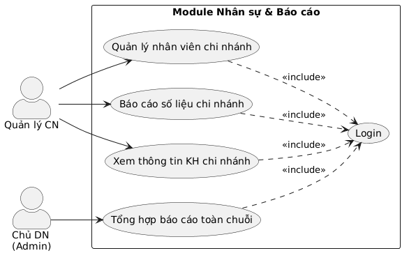
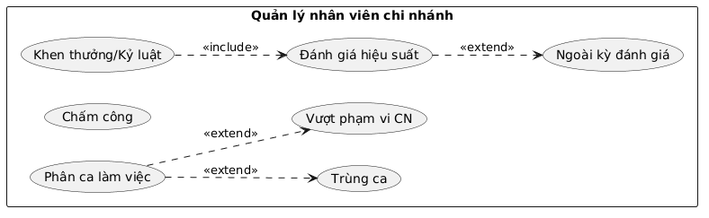
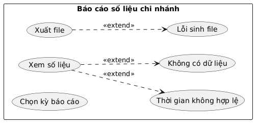
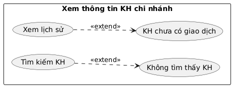
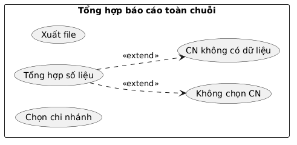
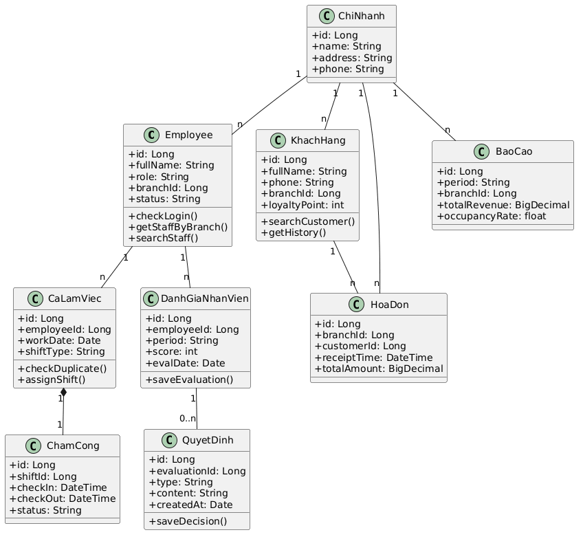
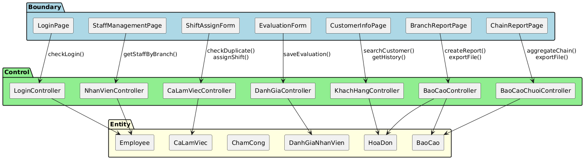

HỌC VIỆN CÔNG NGHỆ BƯU CHÍNH VIỄN THÔNG
KHOA CÔNG NGHỆ THÔNG TIN 1
______________BÁO CÁO BÀI TẬP LỚN
HỌC PHẦN: NHẬP MÔN CÔNG NGHỆ PHẦN MỀM
Module: Nhân sự & Báo cáo thống kêGiảng viên hướng dẫn: Đỗ Thị Liên
Lớp học phần: D23CQCE01-B
Nhóm thực hiện: Nhóm 7
SV thực hiện: Vũ Hùng Anh
MSV: B23DCDT022HÀ NỘI, THÁNG 5/2026

MỤC LỤC

I. PHA XÁC ĐỊNH YÊU CẦU
3. Mô hình nghiệp vụ bằng UML
3.1. Danh sách các Actor cho module
Actor trực tiếp: Quản lý chi nhánh (Branch Manager) và Chủ doanh nghiệp (Founder/Admin). Cả hai kế thừa từ actor trừu tượng Nhân viên (Employee).
Actor gián tiếp: Khách hàng (Client) – dữ liệu được tra cứu trong UC14, không trực tiếp thao tác trên module.

3.2. Các Use Case cho từng Actor

Actor | Use Case | Diễn tả ngắnQuản lý chi nhánh | Quản lý nhân viên chi nhánh | Phân ca, chấm công, đánh giá, khen thưởng/kỷ luật.Quản lý chi nhánh | Báo cáo số liệu chi nhánh | Tổng hợp doanh thu, công suất, lượt khách, doanh số.Quản lý chi nhánh | Xem thông tin KH chi nhánh | Tra cứu danh sách và lịch sử sử dụng của khách hàng.Chủ doanh nghiệp | Tổng hợp báo cáo toàn chuỗi | Tổng hợp, so sánh hiệu suất các chi nhánh, xuất file.

3.3. Biểu đồ UC tổng quan của module

3.4. Các biểu đồ Use Case phân rã của module

Quản lý nhân viên chi nhánh:

Báo cáo số liệu chi nhánh:

Xem thông tin khách hàng chi nhánh:

Tổng hợp báo cáo toàn chuỗi:

II. PHA PHÂN TÍCH
1. Mô hình hóa chức năng
1.1. Kịch bản "Quản lý nhân viên chi nhánh"

Use case | Quản lý nhân viên chi nhánhActor | Quản lý chi nhánhTiền điều kiện | Quản lý đã đăng nhập với vai trò Quản lý chi nhánh và đang phụ trách một chi nhánh cụ thể.Hậu điều kiện | Ca làm việc/đánh giá/quyết định được lưu vào CSDL; bảng chấm công được cập nhật tương ứng.Kịch bản chính | Quản lý chi nhánh chọn menu "Quản lý nhân viên chi nhánh".
Hệ thống xác định chi nhánh mà quản lý đang phụ trách.
Hệ thống truy vấn danh sách nhân viên thuộc chi nhánh đó.
Hệ thống hiển thị danh sách nhân viên gồm mã NV, họ tên, vai trò, trạng thái.
Quản lý chi nhánh nhấn nút "Phân ca".
Hệ thống hiển thị form phân ca làm việc.
Quản lý chi nhánh chọn nhân viên cần phân ca (NV001).
Quản lý chi nhánh chọn ngày làm việc (20/05/2025).
Quản lý chi nhánh chọn loại ca (ca Sáng).
Quản lý chi nhánh nhấn nút "Lưu".
Hệ thống kiểm tra nhân viên chưa có ca trùng trong khung giờ đó.
Hệ thống tạo bản ghi ca làm việc mới.
Hệ thống khởi tạo bản ghi chấm công tương ứng với ca.
Hệ thống hiển thị thông báo "Phân ca thành công".
Quản lý chi nhánh chọn tab "Chấm công".
Hệ thống truy vấn dữ liệu chấm công của nhân viên theo kỳ.
Hệ thống hiển thị bảng chấm công (giờ vào, giờ ra, trạng thái đúng giờ/muộn/vắng).
Đến kỳ đánh giá, quản lý chi nhánh nhấn nút "Đánh giá hiệu suất".
Hệ thống hiển thị form đánh giá.
Quản lý chi nhánh nhập điểm hiệu suất (8.5).
Quản lý chi nhánh nhập nhận xét.
Quản lý chi nhánh nhấn nút "Lưu".
Hệ thống kiểm tra điểm hợp lệ và lưu bản ghi đánh giá vào CSDL.
Hệ thống hiển thị thông báo "Lưu đánh giá thành công".Ngoại lệ | 11a. Trùng ca: hệ thống phát hiện nhân viên đã có ca trong khung giờ → hiển thị cảnh báo "Nhân viên đã có ca trong khung giờ này" → quản lý chọn lại ngày/ca.
18a. Ngoài kỳ đánh giá: hệ thống thông báo "Chưa đến kỳ đánh giá".
24a. Khen thưởng/Kỷ luật (mở rộng): sau khi có đánh giá, quản lý nhấn "Khen thưởng/Kỷ luật" → chọn loại → nhập nội dung → nhấn Lưu → hệ thống lưu quyết định gắn với nhân viên.
*. Vượt phạm vi: thao tác trên nhân viên ngoài chi nhánh → hệ thống từ chối "Bạn không có quyền trên nhân viên này".

1.2. Kịch bản “Báo cáo tình trạng hàng”

Use case | Báo cáo số liệu chi nhánhActor | Quản lý chi nhánhTiền điều kiện | Quản lý đã đăng nhập; CSDL có dữ liệu hóa đơn/đặt phòng của chi nhánh.Hậu điều kiện | Báo cáo được hiển thị dạng biểu đồ; có thể xuất file Excel/PDF.Kịch bản chính | Quản lý chi nhánh chọn menu "Báo cáo số liệu chi nhánh".
Hệ thống hiển thị màn hình báo cáo với bộ lọc kỳ.
Quản lý chi nhánh chọn loại kỳ báo cáo (Tháng).
Quản lý chi nhánh nhập ngày bắt đầu (01/05/2025).
Quản lý chi nhánh nhập ngày kết thúc (31/05/2025).
Quản lý chi nhánh nhấn nút "Xem".
Hệ thống kiểm tra ngày kết thúc ≥ ngày bắt đầu.
Hệ thống truy vấn các hóa đơn của chi nhánh trong kỳ.
Hệ thống tính tổng doanh thu.
Hệ thống tính công suất phòng.
Hệ thống đếm số lượt khách.
Hệ thống tính doanh số bán hàng (F&B).
Hệ thống tổng hợp kết quả thành đối tượng báo cáo.
Hệ thống hiển thị bảng số liệu.
Hệ thống vẽ biểu đồ minh họa.
Quản lý chi nhánh xem và phân tích kết quả.
Quản lý chi nhánh nhấn nút "Xuất file".
Quản lý chi nhánh chọn định dạng (Excel).
Hệ thống sinh file báo cáo.
Hệ thống cho phép tải file về máy.Ngoại lệ | 7a. Khoảng thời gian không hợp lệ (kết thúc < bắt đầu): hệ thống báo lỗi "Khoảng thời gian không hợp lệ".
8a. Không có dữ liệu trong kỳ: hệ thống hiển thị "Không có số liệu trong kỳ đã chọn".
19a. Lỗi sinh file: hệ thống thông báo lỗi và cho phép thử lại.

1.3. Kịch bản “Xem thông tin khách hàng chi nhánh:”

Use case | Xem thông tin khách hàng chi nhánhActor | Quản lý chi nhánhTiền điều kiện | Quản lý đã đăng nhập; chi nhánh có dữ liệu khách hàng/giao dịch.Hậu điều kiện | Hiển thị danh sách khách hàng và lịch sử sử dụng của khách được chọn.Kịch bản chính | Quản lý chi nhánh chọn menu "Thông tin khách hàng chi nhánh".
Hệ thống hiển thị màn hình tra cứu khách hàng.
Quản lý chi nhánh nhập từ khóa tìm kiếm (số điện thoại "0912345678").
Quản lý chi nhánh nhấn nút "Tìm kiếm".
Hệ thống truy vấn danh sách khách hàng của chi nhánh theo từ khóa.
Hệ thống hiển thị danh sách khách hàng gồm mã, tên, SĐT, hạng, điểm.
Quản lý chi nhánh nhấn chọn một khách hàng (KH001) trong danh sách.
Hệ thống lấy mã khách hàng được chọn.
Hệ thống truy vấn các hóa đơn của khách hàng đó.
Hệ thống sắp xếp lịch sử theo thời gian giảm dần.
Hệ thống hiển thị lịch sử sử dụng (ngày, phòng, tổng tiền).
Hệ thống hiển thị điểm tích lũy hiện tại của khách hàng.Ngoại lệ | 5a. Không tìm thấy khách hàng phù hợp: hệ thống hiển thị "Không có kết quả".
9a. Khách hàng chưa phát sinh giao dịch: hệ thống hiển thị lịch sử rỗng.
*. Phạm vi: quản lý chỉ xem được khách hàng trong chi nhánh mình.
1.4. Kịch bản “Tổng hợp báo cáo toàn chuỗi:”

Use case | Tổng hợp báo cáo toàn chuỗiActor | Chủ doanh nghiệp (Admin)Tiền điều kiện | Admin đã đăng nhập; hệ thống có dữ liệu của nhiều chi nhánh.Hậu điều kiện | Báo cáo tổng hợp toàn chuỗi được hiển thị; có thể xuất file.Kịch bản chính | Chủ doanh nghiệp chọn menu "Tổng hợp báo cáo toàn chuỗi".
Hệ thống hiển thị màn hình tổng hợp với bộ lọc.
Chủ doanh nghiệp chọn loại kỳ báo cáo (Quý 2/2025).
Chủ doanh nghiệp chọn danh sách chi nhánh (Tất cả).
Chủ doanh nghiệp nhấn nút "Tổng hợp".
Hệ thống kiểm tra có ít nhất một chi nhánh được chọn.
Hệ thống lấy danh sách chi nhánh đã chọn.
Hệ thống lặp qua từng chi nhánh và truy vấn doanh thu trong kỳ.
Hệ thống tính tổng doanh thu toàn chuỗi.
Hệ thống so sánh hiệu suất giữa các chi nhánh.
Hệ thống xếp hạng các chi nhánh theo hiệu suất.
Hệ thống vẽ biểu đồ so sánh.
Hệ thống hiển thị bảng xếp hạng chi nhánh.
Chủ doanh nghiệp nhấn nút "Xuất file".
Chủ doanh nghiệp chọn định dạng (PDF).
Hệ thống sinh file báo cáo tổng hợp.
Hệ thống cho phép tải file về máy.Ngoại lệ | 6a. Không chọn chi nhánh: hệ thống yêu cầu chọn ít nhất một chi nhánh.
8a. Một chi nhánh không có dữ liệu: hệ thống đánh dấu "N/A" cho chi nhánh đó và vẫn tổng hợp các chi nhánh còn lại.
16a. Lỗi xuất file: hệ thống thông báo lỗi và cho phép thử lại.
2. Mô hình hóa lớp
Mô tả module bằng 1 đoạn văn:
"Trong module Quản lý & Báo cáo, Quản lý chi nhánh quản lý các Nhân viên thuộc chi nhánh của mình. Quản lý phân Ca làm việc cho từng nhân viên theo ngày; mỗi ca làm việc ứng với một bản ghi Chấm công ghi nhận giờ vào và giờ ra thực tế. Định kỳ, quản lý lập bản Đánh giá hiệu suất cho nhân viên, và dựa trên kết quả đánh giá có thể ra Quyết định khen thưởng hoặc kỷ luật. Bên cạnh đó, quản lý lập Báo cáo số liệu của chi nhánh; số liệu được tính từ các Hóa đơn phát sinh khi Khách hàng sử dụng dịch vụ tại chi nhánh. Ở cấp toàn chuỗi, Chủ doanh nghiệp tổng hợp số liệu của nhiều Chi nhánh thành Báo cáo tổng hợp để so sánh hiệu suất."

Xác định lớp thực thể:
Hệ thống: danh từ chung chung → loại.
Quản lý chi nhánh, Chủ doanh nghiệp: đối tượng xử lý của module → lớp thực thể chung: Employee.
Nhân viên: đối tượng xử lý của module → lớp thực thể: Employee.
Chi nhánh: đối tượng xử lý của module → lớp thực thể: ChiNhanh.
Ca làm việc: đối tượng xử lý của module → lớp thực thể: CaLamViec.
Chấm công: đối tượng xử lý của module → lớp thực thể: ChamCong.
Đánh giá hiệu suất: đối tượng xử lý của module → lớp thực thể: DanhGiaNhanVien.
Khen thưởng/Kỷ luật: đối tượng xử lý của module → lớp thực thể: QuyetDinh.
Khách hàng: đối tượng xử lý của module → lớp thực thể: KhachHang.
Hóa đơn: đối tượng xử lý của module → lớp thực thể: HoaDon.
Báo cáo: đối tượng xử lý của module → lớp thực thể: BaoCao.
Giờ vào/giờ ra, điểm hiệu suất, doanh thu, công suất, điểm tích lũy: thuộc tính của các lớp tương ứng → không tách thành lớp.

⇒ Các lớp thực thể ban đầu: Employee, ChiNhanh, CaLamViec, ChamCong, DanhGiaNhanVien, QuyetDinh, KhachHang, HoaDon, BaoCao.

Xác định quan hệ số lượng giữa các thực thể:
Một ChiNhanh có nhiều Employee, một Employee chỉ thuộc một ChiNhanh ⇒ ChiNhanh và Employee quan hệ 1-n.
Một Employee có thể được phân nhiều CaLamViec, một CaLamViec chỉ của một Employee ⇒ Employee và CaLamViec quan hệ 1-n.
Một CaLamViec ứng với đúng một ChamCong, một ChamCong thuộc một CaLamViec ⇒ CaLamViec và ChamCong quan hệ 1-1.
Một Employee có nhiều DanhGiaNhanVien, một DanhGiaNhanVien chỉ của một Employee ⇒ Employee và DanhGiaNhanVien quan hệ 1-n.
Một DanhGiaNhanVien có thể dẫn đến nhiều QuyetDinh, một QuyetDinh gắn với một DanhGiaNhanVien ⇒ DanhGiaNhanVien và QuyetDinh quan hệ 1-0..*.
Một ChiNhanh phục vụ nhiều KhachHang ⇒ ChiNhanh và KhachHang quan hệ 1-n.
Một KhachHang có nhiều HoaDon, một HoaDon của một KhachHang ⇒ KhachHang và HoaDon quan hệ 1-n.
Một ChiNhanh phát sinh nhiều HoaDon ⇒ ChiNhanh và HoaDon quan hệ 1-n.
Một ChiNhanh có nhiều BaoCao, một BaoCao tổng hợp dữ liệu của một hoặc nhiều ChiNhanh ⇒ ChiNhanh và BaoCao quan hệ 1-n (báo cáo chi nhánh) hoặc n-n (báo cáo toàn chuỗi).

Xác định quan hệ đối tượng giữa các thực thể:
ChamCong là thành phần của CaLamViec (composition).
CaLamViec là thành phần của Employee (composition).
DanhGiaNhanVien là thành phần của Employee (composition).
QuyetDinh là thành phần của DanhGiaNhanVien (composition).
HoaDon là thành phần của ChiNhanh (aggregation – hóa đơn phát sinh tại chi nhánh).
Employee và KhachHang thuộc về ChiNhanh (aggregation – có thể chuyển chi nhánh).

⇒ Biểu đồ lớp thực thể pha phân tích:

3. Mô hình hóa tĩnh - Biểu đồ phân tích chức năng
3.1. Chức năng Quản lý nhân viên chi nhánh
Phân tích chi tiết chức năng Quản lý nhân viên chi nhánh:
Vào hệ thống → giao diện đăng nhập hiện lên → đề xuất lớp LoginPage, có 2 ô nhập username, password và nút Đăng nhập.
Nhập username/password → hệ thống kiểm tra thông tin đăng nhập → cần chức năng checkLogin() → là hành động của đối tượng Employee.
Đăng nhập thành công → hệ thống hiện trang chính của Quản lý chi nhánh → đề xuất lớp StaffHomePage, có nút Quản lý nhân viên.
Click Quản lý nhân viên → đề xuất lớp StaffManagementPage, hiển thị danh sách nhân viên, ô tìm kiếm và các nút Phân ca, Chấm công, Đánh giá, Khen thưởng/Kỷ luật.
Khi mở trang, hệ thống lấy danh sách nhân viên của chi nhánh → cần chức năng getStaffByBranch() của đối tượng Employee.
Quản lý click Phân ca → đề xuất lớp ShiftAssignForm, có ô chọn nhân viên, ngày, loại ca và nút Lưu.
Trước khi lưu ca, hệ thống kiểm tra trùng ca → cần chức năng checkDuplicate() của đối tượng CaLamViec.
Quản lý ấn Lưu → hệ thống lưu ca và khởi tạo bản ghi chấm công → cần chức năng assignShift() của đối tượng CaLamViec.
Quản lý click Đánh giá → đề xuất lớp EvaluationForm, có ô nhập điểm, nhận xét và nút Lưu.
Quản lý nhập điểm và ấn Lưu → hệ thống lưu đánh giá → cần chức năng saveEvaluation() của đối tượng DanhGiaNhanVien.
Nếu lập khen thưởng/kỷ luật → hệ thống lưu quyết định → cần chức năng saveDecision() của đối tượng QuyetDinh.

3.2. Chức năng Báo cáo số liệu chi nhánh
Phân tích chi tiết chức năng Báo cáo số liệu chi nhánh:
Vào hệ thống → giao diện đăng nhập hiện lên → đề xuất lớp LoginPage, có 2 ô nhập và nút Đăng nhập.
Nhập username/password → hệ thống kiểm tra → cần chức năng checkLogin() của Employee.
Đăng nhập thành công → hiện trang chính → đề xuất lớp StaffHomePage, có nút Báo cáo số liệu.
Click Báo cáo số liệu → đề xuất lớp BranchReportPage, có bộ lọc kỳ, ô chọn ngày, nút Xem, bảng số liệu và nút Xuất file.
Quản lý chọn kỳ và ấn Xem → hệ thống tổng hợp doanh thu, công suất, lượt khách trong kỳ → cần chức năng createReport() (truy vấn HoaDon, tạo BaoCao).
Hệ thống hiển thị số liệu và biểu đồ → đề xuất lớp ReportChartPanel để vẽ biểu đồ.
Quản lý ấn Xuất file → hệ thống sinh file Excel/PDF → cần chức năng exportFile() của đối tượng BaoCao.

3.3. Chức năng Xem thông tin khách hàng chi nhánh
Phân tích chi tiết chức năng Xem thông tin khách hàng chi nhánh:
Vào hệ thống → giao diện đăng nhập → đề xuất lớp LoginPage.
Nhập username/password → kiểm tra đăng nhập → cần chức năng checkLogin() của Employee.
Đăng nhập thành công → hiện trang chính → đề xuất lớp StaffHomePage, có nút Thông tin khách hàng.
Click Thông tin khách hàng → đề xuất lớp CustomerInfoPage, có ô tìm kiếm, nút Tìm và bảng danh sách khách hàng.
Quản lý nhập từ khóa và ấn Tìm → hệ thống tìm khách hàng của chi nhánh → cần chức năng searchCustomer() của đối tượng KhachHang.
Quản lý click một khách hàng → đề xuất lớp CustomerHistoryPanel, hiển thị điểm tích lũy và bảng lịch sử.
Hệ thống lấy lịch sử hóa đơn của khách → cần chức năng getHistory() của đối tượng HoaDon.

3.4. Chức năng Tổng hợp báo cáo toàn chuỗi
Phân tích chi tiết chức năng Tổng hợp báo cáo toàn chuỗi:
Vào hệ thống → giao diện đăng nhập → đề xuất lớp LoginPage.
Nhập username/password → kiểm tra → cần chức năng checkLogin() của Employee.
Đăng nhập thành công → hiện trang chính của Chủ doanh nghiệp → đề xuất lớp AdminHomePage, có nút Tổng hợp báo cáo toàn chuỗi.
Click Tổng hợp báo cáo → đề xuất lớp ChainReportPage, có bộ lọc kỳ, danh sách chi nhánh, nút Tổng hợp và nút Xuất file.
Admin chọn kỳ và chi nhánh, ấn Tổng hợp → hệ thống lấy danh sách chi nhánh → cần chức năng getBranches() của đối tượng ChiNhanh.
Hệ thống tổng hợp doanh thu từng chi nhánh và so sánh → cần chức năng aggregateChain() (truy vấn HoaDon, tạo BaoCao).
Hệ thống hiển thị biểu đồ so sánh và bảng xếp hạng → đề xuất lớp ComparisonPanel.
Admin ấn Xuất file → hệ thống sinh file → cần chức năng exportFile() của đối tượng BaoCao.

4. Mô hình hóa động - Biểu đồ tuần tự
4.1. Chức năng Quản lý nhân viên chi nhánh
Kịch bản chi tiết:
Quản lý chi nhánh nhập username/password vào giao diện đăng nhập và click nút Đăng nhập.
Lớp LoginPage gọi đến lớp Employee để xử lý.
Lớp Employee gọi hàm checkLogin(). Kết quả đăng nhập thành công.
Lớp Employee gửi kết quả lại cho lớp LoginPage.
Lớp LoginPage gọi sang lớp StaffManagementPage.
Lớp StaffManagementPage gọi lớp Employee lấy danh sách nhân viên (getStaffByBranch()).
Lớp Employee trả về danh sách nhân viên cho lớp StaffManagementPage.
Lớp StaffManagementPage hiển thị danh sách cho Quản lý.
Quản lý click nút Phân ca.
Lớp StaffManagementPage gọi sang lớp ShiftAssignForm.
Lớp ShiftAssignForm hiển thị cho Quản lý.
Quản lý chọn nhân viên, ngày, ca và click Lưu.
Lớp ShiftAssignForm gọi lớp CaLamViec để kiểm tra trùng ca (checkDuplicate()).
Lớp CaLamViec trả về kết quả không trùng.
Lớp ShiftAssignForm gọi lớp CaLamViec lưu ca (assignShift()), đồng thời khởi tạo ChamCong.
Lớp CaLamViec trả kết quả thành công cho lớp ShiftAssignForm.
Quản lý click nút Đánh giá.
Lớp StaffManagementPage gọi sang lớp EvaluationForm.
Quản lý nhập điểm, nhận xét và click Lưu.
Lớp EvaluationForm gọi lớp DanhGiaNhanVien lưu đánh giá (saveEvaluation()).
Lớp DanhGiaNhanVien trả kết quả thành công, giao diện thông báo cho Quản lý.

4.2. Chức năng Báo cáo số liệu chi nhánh
Kịch bản chi tiết:
Quản lý chi nhánh nhập username/password và click nút Đăng nhập.
Lớp LoginPage gọi đến lớp Employee để xử lý.
Lớp Employee gọi hàm checkLogin(). Kết quả đăng nhập thành công.
Lớp Employee gửi kết quả lại cho lớp LoginPage.
Lớp LoginPage gọi sang lớp BranchReportPage.
Lớp BranchReportPage hiển thị cho Quản lý.
Quản lý chọn kỳ báo cáo và khoảng thời gian, click nút Xem.
Lớp BranchReportPage gọi lớp HoaDon truy vấn dữ liệu theo kỳ.
Lớp HoaDon trả về dữ liệu doanh thu, lượt khách.
Lớp BranchReportPage gọi lớp BaoCao để tổng hợp (createReport()).
Lớp BaoCao trả đối tượng báo cáo cho lớp BranchReportPage.
Lớp BranchReportPage hiển thị số liệu và gọi ReportChartPanel vẽ biểu đồ.
Quản lý click nút Xuất file và chọn định dạng.
Lớp BranchReportPage gọi lớp BaoCao sinh file (exportFile()).
Lớp BaoCao trả về file, giao diện cho phép Quản lý tải về.

4.3. Chức năng Xem thông tin khách hàng chi nhánh
Kịch bản chi tiết:
Quản lý chi nhánh nhập username/password và click nút Đăng nhập.
Lớp LoginPage gọi đến lớp Employee để xử lý.
Lớp Employee gọi hàm checkLogin(). Kết quả đăng nhập thành công.
Lớp Employee gửi kết quả lại cho lớp LoginPage.
Lớp LoginPage gọi sang lớp CustomerInfoPage.
Lớp CustomerInfoPage hiển thị cho Quản lý.
Quản lý nhập từ khóa (tên/SĐT) và click nút Tìm kiếm.
Lớp CustomerInfoPage gọi lớp KhachHang để tìm kiếm (searchCustomer()).
Lớp KhachHang trả về danh sách khách hàng.
Lớp CustomerInfoPage hiển thị danh sách cho Quản lý.
Quản lý click chọn một khách hàng.
Lớp CustomerInfoPage gọi sang lớp CustomerHistoryPanel.
Lớp CustomerHistoryPanel gọi lớp HoaDon lấy lịch sử (getHistory()).
Lớp HoaDon trả về lịch sử sử dụng và điểm tích lũy.
Lớp CustomerHistoryPanel hiển thị lịch sử cho Quản lý.

4.4. Chức năng Tổng hợp báo cáo toàn chuỗi
Kịch bản chi tiết:
Chủ doanh nghiệp nhập username/password và click nút Đăng nhập.
Lớp LoginPage gọi đến lớp Employee để xử lý.
Lớp Employee gọi hàm checkLogin(). Kết quả đăng nhập thành công.
Lớp Employee gửi kết quả lại cho lớp LoginPage.
Lớp LoginPage gọi sang lớp ChainReportPage.
Lớp ChainReportPage hiển thị cho Chủ doanh nghiệp.
Admin chọn kỳ và danh sách chi nhánh, click nút Tổng hợp.
Lớp ChainReportPage gọi lớp ChiNhanh lấy danh sách chi nhánh (getBranches()).
Lớp ChiNhanh trả về danh sách chi nhánh.
Với mỗi chi nhánh, lớp ChainReportPage gọi lớp HoaDon truy vấn doanh thu.
Lớp HoaDon trả về số liệu doanh thu của từng chi nhánh.
Lớp ChainReportPage gọi lớp BaoCao tổng hợp và so sánh (aggregateChain()).
Lớp BaoCao trả về báo cáo tổng hợp toàn chuỗi.
Lớp ChainReportPage gọi ComparisonPanel vẽ biểu đồ so sánh và bảng xếp hạng.
Admin click Xuất file; lớp BaoCao sinh file (exportFile()) và cho phép tải về.

III. PHA THIẾT KẾ
1. Thiết kế lớp thực thể

2. Thiết kế CSDL

3.  Thiết kế tĩnh
3.1. Thiết kế giao diện
a) Chức năng Quản lý nhân viên chi nhánh
Giao diện đăng nhập:
┌───────────────────────────────┐
│           ĐĂNG NHẬP           │
├───────────────────────────────┤
│  Tên đăng nhập: [____________]│
│  Mật khẩu:      [____________]│
│              ( Đăng nhập )    │
└───────────────────────────────┘

Giao diện chính của Quản lý chi nhánh:
┌───────────────────────────────────────────┐
│  TRANG CHỦ - Quản lý chi nhánh            │
├───────────────────────────────────────────┤
│  ( Quản lý nhân viên ) ( Báo cáo số liệu )│
│  ( Thông tin khách hàng )                 │
└───────────────────────────────────────────┘

Giao diện danh sách nhân viên (StaffManagementPage):
┌────────────────────────────────────────────────────────────┐
│  Quản lý nhân viên chi nhánh      Chi nhánh: Hà Nội 1      │
│  Tìm: [ Nguyễn...     ]  (Tìm)                             │
│  ┌────────┬──────────────┬─────────┬───────────┐           │
│  │ Mã NV  │ Họ tên       │ Vai trò │ Trạng thái│           │
│  │ NV001  │ Nguyễn Văn A │ Lễ tân  │ Đang làm  │           │
│  │ NV002  │ Trần Thị B   │ Phục vụ │ Đang làm  │           │
│  └────────┴──────────────┴─────────┴───────────┘           │
│  (Phân ca) (Chấm công) (Đánh giá) (Khen thưởng/Kỷ luật)    │
└────────────────────────────────────────────────────────────┘

Giao diện phân ca (ShiftAssignForm):
┌───────────────────────────────────────────┐
│  PHÂN CA LÀM VIỆC                         │
├───────────────────────────────────────────┤
│  Nhân viên: ( NV001 - Nguyễn Văn A  v )   │
│  Ngày:      [ 20/05/2025 ]                │
│  Loại ca:   ( Sáng v )                    │
│              ( Lưu )   ( Hủy )            │
└───────────────────────────────────────────┘

Giao diện đánh giá hiệu suất (EvaluationForm):
┌───────────────────────────────────────────┐
│  ĐÁNH GIÁ HIỆU SUẤT - NV001               │
├───────────────────────────────────────────┤
│  Kỳ đánh giá: ( Quý 2/2025 v )            │
│  Điểm:        [ 8.5 ]                     │
│  Nhận xét:    [__________________________]│
│              ( Lưu )                      │
└───────────────────────────────────────────┘

b) Chức năng Báo cáo số liệu chi nhánh 

Giao diện đăng nhập:┌───────────────────────────────┐
│           ĐĂNG NHẬP           │
│  Tên đăng nhập: [____________]│
│  Mật khẩu:      [____________]│
│              ( Đăng nhập )    │
└───────────────────────────────┘

Giao diện chính của Quản lý chi nhánh:

┌───────────────────────────────────────────┐
│  TRANG CHỦ - Quản lý chi nhánh            │
│  ( Quản lý nhân viên ) ( Báo cáo số liệu) │
└───────────────────────────────────────────┘

Giao diện báo cáo số liệu (BranchReportPage):
┌────────────────────────────────────────────────────────────┐
│  Báo cáo số liệu chi nhánh                                 │
│  Kỳ: (Tháng v)  Từ [01/05/2025]  Đến [31/05/2025]  (Xem)   │
│  ┌─────────────────────┬───────────────┐                   │
│  │ Doanh thu           │ 320.000.000đ   │                  │
│  │ Công suất phòng     │ 78%            │                  │
│  │ Lượt khách          │ 1.240          │                  │
│  └─────────────────────┴───────────────┘                   │
│  [ Biểu đồ doanh thu theo ngày ]                           │
│  (Xuất Excel)   (Xuất PDF)                                 │
└────────────────────────────────────────────────────────────┘

c) Chức năng Quản lý order
Giao diện đăng nhập:
┌───────────────────────────────┐
│           ĐĂNG NHẬP           │
│  Tên đăng nhập: [____________]│
│  Mật khẩu:      [____________]│
│              ( Đăng nhập )    │
└───────────────────────────────┘

Giao diện chính của Quản lý chi nhánh:

┌───────────────────────────────────────────┐
│  TRANG CHỦ - Quản lý chi nhánh            │
│  ( Thông tin khách hàng )                 │
└───────────────────────────────────────────┘

Giao diện tra cứu khách hàng (CustomerInfoPage):
┌────────────────────────────────────────────────────────────┐
│  Thông tin khách hàng - Chi nhánh Hà Nội 1                 │
│  Tìm theo tên/SĐT: [ 0912...      ]  (Tìm kiếm)            │
│  ┌────────┬───────────┬────────────┬───────┬───────┐       │
│  │ Mã KH  │ Họ tên    │ SĐT        │ Hạng  │ Điểm  │       │
│  │ KH001  │ Lê Văn C  │ 0912345678 │ Vàng  │ 2.150 │       │
│  └────────┴───────────┴────────────┴───────┴───────┘       │
└────────────────────────────────────────────────────────────┘

Giao diện lịch sử sử dụng (CustomerHistoryPanel):

┌───────────────────────────────────────────┐
│  Lịch sử sử dụng - KH001 (Lê Văn C)       │
├───────────────────────────────────────────┤
│  Điểm tích lũy: 2.150                     │
│  ┌──────────┬────────────┬─────────────┐  │
│  │ Ngày     │ Phòng      │ Tổng tiền   │  │
│  │ 12/05    │ VIP 2      │ 1.250.000đ  │  │
│  │ 03/05    │ Standard 5 │ 600.000đ    │  │
│  └──────────┴────────────┴─────────────┘  │
└───────────────────────────────────────────┘

d) Chức năng Tổng hợp báo cáo toàn chuỗi (UC21)

Giao diện đăng nhập:
┌───────────────────────────────┐
│           ĐĂNG NHẬP           │
│  Tên đăng nhập: [____________]│
│  Mật khẩu:      [____________]│
│              ( Đăng nhập )    │
└───────────────────────────────┘

Giao diện chính của Chủ doanh nghiệp:

┌───────────────────────────────────────────┐
│  TRANG CHỦ - Chủ doanh nghiệp             │
│  ( Tổng hợp báo cáo toàn chuỗi )          │
└───────────────────────────────────────────┘

Giao diện tổng hợp toàn chuỗi (ChainReportPage):
┌────────────────────────────────────────────────────────────┐
│  Tổng hợp báo cáo toàn chuỗi                               │
│  Kỳ: (Quý v) Năm (2025 v)  CN: [x Tất cả]  (Tổng hợp)      │
│  ┌──────────┬───────────┬──────────┬──────────┐            │
│  │ Chi nhánh│ Doanh thu │ Công suất│ Xếp hạng │            │
│  │ Hà Nội 1 │ 980 tr    │ 82%      │ 1        │            │
│  │ Hà Nội 2 │ 760 tr    │ 74%      │ 2        │            │
│  └──────────┴───────────┴──────────┴──────────┘            │
│  Tổng doanh thu toàn chuỗi: 2.280.000.000đ                 │
│  [ Biểu đồ so sánh hiệu suất ]   (Xuất Excel) (Xuất PDF)   │
└────────────────────────────────────────────────────────────┘

3.2. Thiết kế mô hình MVC
Mô hình MVC được thiết kế theo kiến trúc BCE (Boundary – Control – Entity) với 3 tầng:
Boundary (Giao diện): React components xử lý giao diện người dùng
Control (Điều khiển): Spring Boot Controllers xử lý nghiệp vụ
Entity (Thực thể): JPA Entities biểu diễn dữ liệu lưu trữ

a) Chức năng Quản lý nhân viên chi nhánh 
Tầng giao diện (Boundary): 

Lớp | Thành phần | Chi tiết thành phần | Chức năngLoginPage | Thuộc tính | - txtUsername : TextBox | Ô nhập tên đăng nhập.LoginPage | Thuộc tính | - txtPassword : TextBox | Ô nhập mật khẩu.LoginPage | Thuộc tính | - btnLogin : Button | Nút xác nhận đăng nhập.LoginPage | Phương thức | + btnLoginClick() : void | Bắt sự kiện click nút đăng nhập.StaffManagementPage | Thuộc tính | - tblStaff : Table | Bảng danh sách nhân viên của chi nhánh.StaffManagementPage | Thuộc tính | - txtSearch : TextBox | Ô nhập từ khóa tìm nhân viên.StaffManagementPage | Thuộc tính | - btnShift : Button | Nút mở form phân ca.StaffManagementPage | Thuộc tính | - btnEvaluate : Button | Nút mở form đánh giá.StaffManagementPage | Phương thức | + formLoad() : void | Gọi Controller lấy danh sách nhân viên khi mở trang.StaffManagementPage | Phương thức | + displayStaff(list : List<Employee>) : void | Render danh sách nhân viên lên bảng tblStaff.StaffManagementPage | Phương thức | + tblStaffClick(maNV : String) : void | Lưu mã nhân viên đang chọn để thao tác tiếp.ShiftAssignForm | Thuộc tính | - cboEmployee : ComboBox | Danh sách chọn nhân viên cần phân ca.ShiftAssignForm | Thuộc tính | - dtpDate : DatePicker | Bộ chọn ngày làm việc.ShiftAssignForm | Thuộc tính | - cboShift : ComboBox | Danh sách chọn loại ca (Sáng/Chiều/Tối).ShiftAssignForm | Thuộc tính | - btnSave : Button | Nút lưu ca làm việc.ShiftAssignForm | Phương thức | + btnSaveClick() : void | Đóng gói CaLamViec và gọi Controller lưu.ShiftAssignForm | Phương thức | + showMessage(msg : String) : void | Hiển thị thông báo (vd: 'Trùng ca').EvaluationForm | Thuộc tính | - txtScore : TextBox | Ô nhập điểm hiệu suất.EvaluationForm | Thuộc tính | - txtComment : TextBox | Ô nhập nhận xét.EvaluationForm | Thuộc tính | - btnSave : Button | Nút lưu đánh giá.EvaluationForm | Phương thức | + btnSaveClick() : void | Đóng gói DanhGiaNhanVien và gọi Controller lưu.

Tầng điều khiển (Control):

Lớp | Phương thức | Chức năngLoginController | + checkLogin(username : String, password : String) : boolean | Kiểm tra tài khoản trong CSDL, trả về kết quả đăng nhập.NhanVienController | + getStaffByBranch(maCN : String) : List<Employee> | Lấy danh sách nhân viên thuộc chi nhánh để hiển thị.NhanVienController | + searchStaff(keyword : String, maCN : String) : List<Employee> | Tìm nhân viên theo tên trong phạm vi chi nhánh.CaLamViecController | + checkDuplicate(ca : CaLamViec) : boolean | Kiểm tra nhân viên đã có ca trùng khung giờ chưa.CaLamViecController | + assignShift(ca : CaLamViec) : boolean | Lưu ca làm việc và khởi tạo bản ghi chấm công.DanhGiaController | + saveEvaluation(dg : DanhGiaNhanVien) : boolean | Lưu bản ghi đánh giá hiệu suất xuống CSDL.QuyetDinhController | + saveDecision(qd : QuyetDinh) : boolean | Lưu quyết định khen thưởng/kỷ luật gắn với nhân viên.

Tầng thực thể (Entity): Employee, CaLamViec, ChamCong, DanhGiaNhanVien, QuyetDinh.

b) Chức năng Báo cáo số liệu chi nhánh 
Tầng giao diện:
	
Lớp | Thành phần | Chi tiết thành phần | Chức năngLoginPage | Thuộc tính | - txtUsername : TextBox | Ô nhập tên đăng nhập.LoginPage | Thuộc tính | - btnLogin : Button | Nút xác nhận đăng nhập.LoginPage | Phương thức | + btnLoginClick() : void | Bắt sự kiện click nút đăng nhập.BranchReportPage | Thuộc tính | - cboPeriod : ComboBox | Chọn loại kỳ báo cáo (ngày/tuần/tháng/quý/năm).BranchReportPage | Thuộc tính | - dtpFrom : DatePicker | Bộ chọn ngày bắt đầu.BranchReportPage | Thuộc tính | - dtpTo : DatePicker | Bộ chọn ngày kết thúc.BranchReportPage | Thuộc tính | - btnView : Button | Nút xem báo cáo.BranchReportPage | Thuộc tính | - tblData : Table | Bảng số liệu tổng hợp.BranchReportPage | Thuộc tính | - btnExport : Button | Nút xuất file (Excel/PDF).BranchReportPage | Phương thức | + btnViewClick() : void | Gửi kỳ báo cáo sang Controller và nhận số liệu.BranchReportPage | Phương thức | + displayReport(bc : BaoCao) : void | Đổ số liệu lên bảng và vẽ biểu đồ.BranchReportPage | Phương thức | + btnExportClick() : void | Gọi Controller sinh file báo cáo.ReportChartPanel | Thuộc tính | - chartCanvas : Chart | Vùng vẽ biểu đồ doanh thu.ReportChartPanel | Phương thức | + renderChart(data : ReportData) : void | Vẽ biểu đồ từ dữ liệu báo cáo.

Tầng điều khiển:
	
Lớp | Phương thức | Chức năngLoginController | + checkLogin(username : String, password : String) : boolean | Kiểm tra tài khoản đăng nhập.BaoCaoController | + createReport(period : String, maCN : String) : BaoCao | Truy vấn hóa đơn theo kỳ và tổng hợp số liệu.BaoCaoController | + exportFile(bc : BaoCao, format : String) : File | Sinh file báo cáo theo định dạng Excel/PDF.

Tầng thực thể (Entity): Employee, HoaDon, BaoCao.

c) Chức năng quản lý menu
Tầng giao diện:

Lớp | Thành phần | Chi tiết thành phần | Chức năngLoginPage | Thuộc tính | - txtUsername : TextBox | Ô nhập tên đăng nhập.LoginPage | Phương thức | + btnLoginClick() : void | Bắt sự kiện click nút đăng nhập.CustomerInfoPage | Thuộc tính | - txtKeyword : TextBox | Ô nhập từ khóa (tên hoặc SĐT).CustomerInfoPage | Thuộc tính | - btnSearch : Button | Nút tìm kiếm khách hàng.CustomerInfoPage | Thuộc tính | - tblCustomers : Table | Bảng danh sách khách hàng.CustomerInfoPage | Phương thức | + btnSearchClick() : void | Gửi từ khóa sang Controller tìm khách hàng.CustomerInfoPage | Phương thức | + displayCustomers(list : List<KhachHang>) : void | Render danh sách khách hàng lên bảng.CustomerInfoPage | Phương thức | + tblCustomersClick(maKH : String) : void | Mở panel lịch sử của khách hàng được chọn.CustomerHistoryPanel | Thuộc tính | - lblPoint : Label | Hiển thị điểm tích lũy.CustomerHistoryPanel | Thuộc tính | - tblHistory : Table | Bảng lịch sử sử dụng.CustomerHistoryPanel | Phương thức | + displayHistory(list : List<HoaDon>) : void | Đổ lịch sử hóa đơn lên bảng tblHistory.

Tầng điều khiển:

Lớp | Phương thức | Chức năngLoginController | + checkLogin(username : String, password : String) : boolean | Kiểm tra tài khoản đăng nhập.KhachHangController | + searchCustomer(keyword : String, maCN : String) : List<KhachHang> | Tìm khách hàng theo tên hoặc SĐT trong phạm vi chi nhánh.KhachHangController | + getHistory(maKH : String) : List<HoaDon> | Lấy lịch sử hóa đơn và điểm tích lũy của khách hàng.

Tầng thực thể (Entity): Employee, KhachHang, HoaDon.

d) Chức năng Tổng hợp báo cáo toàn chuỗi
Tầng giao diện:

Lớp | Thành phần | Chi tiết thành phần | Chức năngLoginPage | Thuộc tính | - txtUsername : TextBox | Ô nhập tên đăng nhập.LoginPage | Phương thức | + btnLoginClick() : void | Bắt sự kiện click nút đăng nhập.ChainReportPage | Thuộc tính | - cboPeriod : ComboBox | Chọn kỳ báo cáo.ChainReportPage | Thuộc tính | - chkBranches : CheckBoxList | Chọn các chi nhánh (hoặc Tất cả).ChainReportPage | Thuộc tính | - btnAggregate : Button | Nút tổng hợp toàn chuỗi.ChainReportPage | Thuộc tính | - btnExport : Button | Nút xuất file.ChainReportPage | Phương thức | + btnAggregateClick() : void | Gửi kỳ + danh sách CN sang Controller để tổng hợp.ChainReportPage | Phương thức | + showMessage(msg : String) : void | Hiển thị thông báo (vd: 'Chọn ít nhất 1 chi nhánh').ComparisonPanel | Thuộc tính | - tblRanking : Table | Bảng xếp hạng chi nhánh.ComparisonPanel | Thuộc tính | - chartCompare : Chart | Biểu đồ so sánh hiệu suất.ComparisonPanel | Phương thức | + renderComparison(dto : BaoCao) : void | Vẽ biểu đồ so sánh và đổ bảng xếp hạng.

Tầng điều khiển:

Lớp | Phương thức | Chức năngLoginController | + checkLogin(username : String, password : String) : boolean | Kiểm tra tài khoản đăng nhập.ChiNhanhController | + getBranches(ids : List<String>) : List<ChiNhanh> | Lấy danh sách chi nhánh được chọn.BaoCaoChuoiController | + aggregateChain(period : String, branches : List<String>) : BaoCao | Tổng hợp doanh thu từng chi nhánh, so sánh hiệu suất.BaoCaoChuoiController | + exportFile(bc : BaoCao, format : String) : File | Sinh file báo cáo tổng hợp.

Tầng thực thể (Entity): Employee, ChiNhanh, HoaDon, BaoCao.

3.3. Sơ đồ lớp thiết kế

a) Quản lý nhân viên chi nhánh:

b) Báo cáo số liệu chi nhánh:

c) Xem thông tin khách hàng chi nhánh:

d) Tổng hợp báo cáo toàn chuỗi:

4. Thiết kế động
Biểu đồ tuần tự pha thiết kế được nâng cấp từ pha phân tích: bổ sung lớp Controller vào giữa luồng (Boundary → Controller → Entity) và thay toàn bộ thông điệp bằng tên hàm tiếng Anh đầy đủ kèm kiểu dữ liệu (khớp chữ ký ở mục 3.2 và 3.3). Mỗi chức năng gồm kịch bản chi tiết (đánh số) và biểu đồ tuần tự thiết kế tương ứng.
4.1. Chức năng Quản lý nhân viên chi nhánh
Kịch bản chi tiết:
1. Quản lý chi nhánh nhập username, password trên giao diện LoginPage và nhấn nút Đăng nhập.
2. LoginPage gọi phương thức btnLoginClick(), gửi thông tin sang LoginController qua hàm checkLogin(username, password).
3. LoginController gọi thực thể Employee truy vấn CSDL để xác thực và nhận kết quả.
4. LoginController trả kết quả đăng nhập thành công về cho LoginPage; LoginPage điều hướng sang StaffManagementPage.
5. StaffManagementPage tự gọi formLoad(), gọi NhanVienController.getStaffByBranch(maCN) để lấy danh sách nhân viên của chi nhánh.
6. NhanVienController gọi thực thể Employee truy vấn, trả List<Employee> về cho StaffManagementPage.
7. StaffManagementPage tự gọi displayStaff(list) để đổ danh sách lên bảng và hiển thị cho Quản lý.
8. Quản lý nhấn nút Phân ca; StaffManagementPage mở lớp ShiftAssignForm.
9. Quản lý chọn nhân viên, ngày, ca và nhấn Lưu; ShiftAssignForm gọi btnSaveClick().
10. ShiftAssignForm gọi CaLamViecController.checkDuplicate(ca); Controller truy vấn CaLamViec và trả về false (không trùng).
11. ShiftAssignForm gọi CaLamViecController.assignShift(ca): lưu ca làm việc và khởi tạo bản ghi ChamCong, trả kết quả thành công.
12. ShiftAssignForm gọi showMessage("Phân ca thành công") cho Quản lý.
13. Quản lý nhấn nút Đánh giá; StaffManagementPage mở lớp EvaluationForm.
14. Quản lý nhập điểm, nhận xét và nhấn Lưu; EvaluationForm gọi btnSaveClick().
15. EvaluationForm gọi DanhGiaController.saveEvaluation(dg) để lưu bản ghi đánh giá (thực thể DanhGiaNhanVien) xuống CSDL.
16. EvaluationForm gọi showMessage("Lưu đánh giá thành công") cho Quản lý.

Hình. Biểu đồ tuần tự thiết kế – Quản lý nhân viên chi nhánh
4.2. Chức năng Báo cáo số liệu chi nhánh
Kịch bản chi tiết:
1. Quản lý chi nhánh nhập username, password trên LoginPage và nhấn Đăng nhập.
2. LoginPage gọi btnLoginClick(), gửi thông tin sang LoginController.checkLogin(username, password).
3. LoginController gọi thực thể Employee xác thực và trả kết quả thành công về LoginPage.
4. LoginPage điều hướng sang BranchReportPage hiển thị màn hình báo cáo.
5. Quản lý chọn kỳ và khoảng thời gian, nhấn Xem; BranchReportPage gọi btnViewClick().
6. BranchReportPage gọi BaoCaoController.createReport(period, maCN).
7. BaoCaoController gọi thực thể HoaDon: tongHopDoanhThu(ky, maCN) và demLuotKhach(ky, maCN) trong kỳ.
8. HoaDon trả dữ liệu về Controller; Controller gọi thực thể BaoCao tạo đối tượng báo cáo và trả số liệu về BranchReportPage.
9. BranchReportPage tự gọi displayReport(bc) để đổ số liệu lên bảng.
10. BranchReportPage gọi ReportChartPanel.renderChart(data) để vẽ biểu đồ doanh thu, rồi hiển thị cho Quản lý.
11. Quản lý nhấn Xuất file; BranchReportPage gọi BaoCaoController.exportFile(bc, format).
12. BaoCaoController trả về File; BranchReportPage cho phép Quản lý tải về.

Hình. Biểu đồ tuần tự thiết kế – Báo cáo số liệu chi nhánh
4.3. Chức năng Xem thông tin khách hàng chi nhánh
Kịch bản chi tiết:
1. Quản lý chi nhánh nhập username, password trên LoginPage và nhấn Đăng nhập.
2. LoginPage gọi btnLoginClick(), gửi thông tin sang LoginController.checkLogin(username, password).
3. LoginController gọi thực thể Employee xác thực và trả kết quả thành công về LoginPage.
4. LoginPage điều hướng sang CustomerInfoPage hiển thị màn hình tra cứu.
5. Quản lý nhập từ khóa (tên hoặc SĐT) và nhấn Tìm kiếm; CustomerInfoPage gọi btnSearchClick().
6. CustomerInfoPage gọi KhachHangController.searchCustomer(keyword, maCN).
7. KhachHangController gọi thực thể KhachHang truy vấn danh sách khách hàng của chi nhánh, trả List<KhachHang> về.
8. CustomerInfoPage tự gọi displayCustomers(list) để hiển thị danh sách.
9. Quản lý click chọn một khách hàng; CustomerInfoPage gọi tblCustomersClick(maKH) và mở CustomerHistoryPanel.
10. CustomerHistoryPanel gọi KhachHangController.getHistory(maKH).
11. KhachHangController gọi thực thể HoaDon truy vấn lịch sử hóa đơn và gọi thực thể KhachHang lấy điểm tích lũy, trả kết quả về.
12. CustomerHistoryPanel tự gọi displayHistory(list) hiển thị lịch sử và điểm tích lũy cho Quản lý.

Hình. Biểu đồ tuần tự thiết kế – Xem thông tin khách hàng chi nhánh
4.4. Chức năng Tổng hợp báo cáo toàn chuỗi
Kịch bản chi tiết:
1. Chủ doanh nghiệp nhập username, password trên LoginPage và nhấn Đăng nhập.
2. LoginPage gọi btnLoginClick(), gửi thông tin sang LoginController.checkLogin(username, password).
3. LoginController gọi thực thể Employee xác thực và trả kết quả thành công về LoginPage.
4. LoginPage điều hướng sang ChainReportPage hiển thị màn hình tổng hợp.
5. Chủ doanh nghiệp chọn kỳ và danh sách chi nhánh, nhấn Tổng hợp; ChainReportPage gọi btnAggregateClick().
6. ChainReportPage gọi ChiNhanhController.getBranches(ids); Controller truy vấn thực thể ChiNhanh và trả List<ChiNhanh> về.
7. ChainReportPage gọi BaoCaoChuoiController.aggregateChain(period, branches).
8. Với mỗi chi nhánh, Controller gọi thực thể HoaDon.tongHopDoanhThu(ky, maCN) lấy số liệu doanh thu.
9. Controller gọi thực thể BaoCao tạo báo cáo tổng hợp, so sánh hiệu suất các chi nhánh và trả báo cáo chuỗi về ChainReportPage.
10. ChainReportPage gọi ComparisonPanel.renderComparison(dto) để vẽ biểu đồ so sánh và bảng xếp hạng, hiển thị cho người dùng.
11. Chủ doanh nghiệp nhấn Xuất file; ChainReportPage gọi BaoCaoChuoiController.exportFile(bc, format) và tải file về.

IV. PHA CÀI ĐẶT VÀ KIỂM THỬ
1. Lập kế hoạch test
Phương pháp kiểm thử: kiểm thử hộp đen (Black-box testing), kết hợp phân vùng tương đương và phân tích giá trị biên. Với mỗi chức năng, liệt kê các trường hợp cần kiểm thử (bao gồm cả luồng thành công và các ngoại lệ) như bảng dưới đây.
STT | Chức năng | Trường hợp cần test1 | Quản lý nhân viên (UC11) | Phân ca làm việc thành công2 | Quản lý nhân viên (UC11) | Phân ca bị trùng ca3 | Quản lý nhân viên (UC11) | Đánh giá hiệu suất thành công4 | Báo cáo số liệu (UC13) | Báo cáo có dữ liệu trong kỳ5 | Báo cáo số liệu (UC13) | Khoảng thời gian không hợp lệ6 | Xem thông tin KH (UC14) | Tìm thấy khách hàng7 | Xem thông tin KH (UC14) | Không tìm thấy khách hàng8 | Tổng hợp toàn chuỗi (UC21) | Tổng hợp nhiều chi nhánh thành công9 | Tổng hợp toàn chuỗi (UC21) | Không chọn chi nhánh

 
2. Các test case cho từng chức năng
a) Chức năng Quản lý nhân viên chi nhánh

- Test case 1: Phân ca làm việc thành công.
CSDL trước khi test:
tblEmployee:
id | full_name | role | username | password | status | branch_id1 | Nguyễn Văn Quản | Quản lý chi nhánh | manager1 | mgr@123 | Working | 12 | Trần Thị Bình | Lễ tân | letan1 | let@123 | Working | 13 | Phạm Tuấn Anh | Phục vụ | phucvu1 | pv@123 | Working | 14 | Lê Văn Cường | Phục vụ | phucvu2 | pv@456 | Resigned | 1 
tblShift:
id | employee_id | work_date | start_time | end_time1 | 3 | 19/05/2025 | 08:00 | 12:002 | 3 | 19/05/2025 | 13:00 | 17:00 
Các bước thực hiện | Kết quả mong đợi1. Quản lý chi nhánh (id = 1) đăng nhập, vào chức năng Quản lý nhân viên. | Giao diện danh sách nhân viên của chi nhánh Hà Nội 1 hiển thị.2. Click nút Phân ca, chọn nhân viên id = 3, ngày 20/05/2025, ca Sáng. | Form phân ca hiển thị các lựa chọn đã chọn.3. Click nút Lưu. | Hệ thống kiểm tra không trùng ca → hợp lệ.
Hiển thị thông báo "Phân ca thành công". 
CSDL sau khi test: thêm 1 bản ghi ca làm việc và 1 bản ghi chấm công tương ứng.

tblShift:
id | employee_id | work_date | start_time | end_time1 | 3 | 19/05/2025 | 08:00 | 12:002 | 3 | 19/05/2025 | 13:00 | 17:003 | 3 | 20/05/2025 | 08:00 | 12:00 
tblTimekeeping:
id | shift_id | check_in | check_out | status3 | 3 | (chưa ghi nhận) | (chưa ghi nhận) | Pending 

- Test case 2: Phân ca bị trùng ca.
CSDL trước khi test:
tblEmployee:

id | full_name | role | username | password | status | branch_id1 | Nguyễn Văn Quản | Quản lý chi nhánh | manager1 | mgr@123 | Working | 12 | Trần Thị Bình | Lễ tân | letan1 | let@123 | Working | 13 | Phạm Tuấn Anh | Phục vụ | phucvu1 | pv@123 | Working | 14 | Lê Văn Cường | Phục vụ | phucvu2 | pv@456 | Resigned | 1 

tblShift:
id | employee_id | work_date | start_time | end_time1 | 3 | 19/05/2025 | 08:00 | 12:002 | 3 | 19/05/2025 | 13:00 | 17:00 
Các bước thực hiện | Kết quả mong đợi1. Quản lý chi nhánh (id = 1) vào chức năng Quản lý nhân viên, click Phân ca. | Form phân ca hiển thị.2. Chọn nhân viên id = 3, ngày 19/05/2025, ca Sáng (08:00–12:00) — trùng ca đã có. | Form ghi nhận lựa chọn.3. Click nút Lưu. | Hệ thống phát hiện nhân viên đã có ca trong khung giờ.
Hiển thị cảnh báo "Nhân viên đã có ca trong khung giờ này".
Không lưu ca mới. 
CSDL sau khi test: không có gì thay đổi.

- Test case 3: Đánh giá hiệu suất thành công.
CSDL trước khi test:
tblEmployee:
id | full_name | role | username | password | status | branch_id1 | Nguyễn Văn Quản | Quản lý chi nhánh | manager1 | mgr@123 | Working | 12 | Trần Thị Bình | Lễ tân | letan1 | let@123 | Working | 13 | Phạm Tuấn Anh | Phục vụ | phucvu1 | pv@123 | Working | 14 | Lê Văn Cường | Phục vụ | phucvu2 | pv@456 | Resigned | 1 

tblEvaluation:
id | employee_id | period | score | eval_date1 | 3 | Quý 1/2025 | 7.5 | 31/03/2025 
Các bước thực hiện | Kết quả mong đợi1. Quản lý chi nhánh (id = 1) chọn nhân viên id = 3, click Đánh giá hiệu suất. | Form đánh giá hiển thị.2. Chọn kỳ Quý 2/2025, nhập điểm 8.5 và nhận xét. | Form ghi nhận điểm và nhận xét.3. Click nút Lưu. | Hệ thống kiểm tra điểm hợp lệ (0–10) → hợp lệ.
Lưu bản ghi đánh giá.
Hiển thị "Lưu đánh giá thành công". 
CSDL sau khi test: thêm 1 bản ghi đánh giá mới.
tblEvaluation:
id | employee_id | period | score | eval_date1 | 3 | Quý 1/2025 | 7.5 | 31/03/20252 | 3 | Quý 2/2025 | 8.5 | 30/06/2025 
b) Chức năng Báo cáo số liệu chi nhánh
- Test case 1: Báo cáo có dữ liệu trong kỳ.
CSDL trước khi test:
tblReceipt:
id | branch_id | customer_id | receipt_time | total_amount1 | 1 | 1 | 12/05/2025 20:00 | 12500002 | 1 | 1 | 03/05/2025 19:00 | 6000003 | 1 | 2 | 08/05/2025 21:00 | 4500004 | 2 | 3 | 10/05/2025 18:00 | 780000 
Các bước thực hiện | Kết quả mong đợi1. Quản lý chi nhánh (id = 1) vào chức năng Báo cáo số liệu chi nhánh. | Màn hình báo cáo với bộ lọc kỳ hiển thị.2. Chọn kỳ Tháng, từ 01/05/2025 đến 31/05/2025, click Xem. | Hệ thống kiểm tra khoảng thời gian hợp lệ.
Truy vấn hóa đơn chi nhánh 1 trong kỳ.3. Xem kết quả. | Hiển thị bảng số liệu: Doanh thu = 2.300.000đ, Lượt khách = 3.
Vẽ biểu đồ doanh thu theo ngày. 
CSDL sau khi test: không có gì thay đổi (chức năng chỉ đọc dữ liệu).
- Test case 2: Khoảng thời gian không hợp lệ.
CSDL trước khi test:
tblReceipt:
id | branch_id | customer_id | receipt_time | total_amount1 | 1 | 1 | 12/05/2025 20:00 | 12500002 | 1 | 1 | 03/05/2025 19:00 | 6000003 | 1 | 2 | 08/05/2025 21:00 | 4500004 | 2 | 3 | 10/05/2025 18:00 | 780000 
Các bước thực hiện | Kết quả mong đợi1. Quản lý chi nhánh (id = 1) vào chức năng Báo cáo số liệu chi nhánh. | Màn hình báo cáo hiển thị.2. Nhập từ ngày 31/05/2025 đến ngày 01/05/2025 (đến < từ), click Xem. | Hệ thống kiểm tra khoảng thời gian.3. Xem kết quả. | Hiển thị thông báo lỗi "Khoảng thời gian không hợp lệ".
Không tổng hợp số liệu. 
CSDL sau khi test: không có gì thay đổi.
c) Chức năng Xem thông tin khách hàng chi nhánh
- Test case 1: Tìm thấy khách hàng và xem lịch sử.
CSDL trước khi test:
tblCustomer:
id | full_name | phone | branch_id | loyalty_point1 | Lê Văn C | 0912345678 | 1 | 21502 | Phạm Thị D | 0987654321 | 1 | 7803 | Hoàng Văn E | 0901234567 | 2 | 120 
tblReceipt:
id | branch_id | customer_id | receipt_time | total_amount1 | 1 | 1 | 12/05/2025 20:00 | 12500002 | 1 | 1 | 03/05/2025 19:00 | 6000003 | 1 | 2 | 08/05/2025 21:00 | 4500004 | 2 | 3 | 10/05/2025 18:00 | 780000 
Các bước thực hiện | Kết quả mong đợi1. Quản lý chi nhánh (id = 1) vào chức năng Thông tin khách hàng chi nhánh. | Màn hình tra cứu khách hàng hiển thị.2. Nhập từ khóa "0912345678", click Tìm kiếm. | Hệ thống truy vấn khách hàng của chi nhánh.
Hiển thị KH001 - Lê Văn C - Vàng - 2.150 điểm.3. Click chọn khách hàng KH001. | Truy vấn hóa đơn của khách hàng.
Hiển thị lịch sử: 12/05 (1.250.000đ), 03/05 (600.000đ) và điểm tích lũy 2.150. 
CSDL sau khi test: không có gì thay đổi.
- Test case 2: Không tìm thấy khách hàng.
CSDL trước khi test:
tblCustomer:
id | full_name | phone | branch_id | loyalty_point1 | Lê Văn C | 0912345678 | 1 | 21502 | Phạm Thị D | 0987654321 | 1 | 7803 | Hoàng Văn E | 0901234567 | 2 | 120 
Các bước thực hiện | Kết quả mong đợi1. Quản lý chi nhánh (id = 1) vào chức năng Thông tin khách hàng chi nhánh. | Màn hình tra cứu hiển thị.2. Nhập từ khóa "khongtontai", click Tìm kiếm. | Hệ thống truy vấn theo từ khóa.3. Xem kết quả. | Hiển thị thông báo "Không có kết quả". 
CSDL sau khi test: không có gì thay đổi.
d) Chức năng Tổng hợp báo cáo toàn chuỗi
- Test case 1: Tổng hợp nhiều chi nhánh thành công.
CSDL trước khi test:
tblBranch:
id | name | address | phone1 | Hà Nội 1 | 12 Trần Duy Hưng | 02411122332 | Hà Nội 2 | 45 Cầu Giấy | 02444555663 | Đà Nẵng 1 | 9 Nguyễn Văn Linh | 0236778899 

tblReceipt:
id | branch_id | customer_id | receipt_time | total_amount1 | 1 | 1 | 12/05/2025 20:00 | 12500002 | 1 | 1 | 03/05/2025 19:00 | 6000003 | 1 | 2 | 08/05/2025 21:00 | 4500004 | 2 | 3 | 10/05/2025 18:00 | 780000 
Các bước thực hiện | Kết quả mong đợi1. Chủ doanh nghiệp đăng nhập, vào chức năng Tổng hợp báo cáo toàn chuỗi. | Màn hình tổng hợp với bộ lọc hiển thị.2. Chọn kỳ Quý 2/2025, chọn tất cả chi nhánh, click Tổng hợp. | Hệ thống kiểm tra có ≥ 1 chi nhánh → hợp lệ.
Tổng hợp doanh thu từng chi nhánh.3. Xem kết quả. | Hiển thị bảng xếp hạng: HN1 (2.300.000đ), HN2 (780.000đ), ĐN1 (N/A).
Vẽ biểu đồ so sánh hiệu suất. Tổng doanh thu toàn chuỗi = 3.080.000đ. 
CSDL sau khi test: không có gì thay đổi (chức năng chỉ đọc và tổng hợp dữ liệu).
- Test case 2: Không chọn chi nhánh.
CSDL trước khi test:
tblBranch:
id | name | address | phone1 | Hà Nội 1 | 12 Trần Duy Hưng | 02411122332 | Hà Nội 2 | 45 Cầu Giấy | 02444555663 | Đà Nẵng 1 | 9 Nguyễn Văn Linh | 0236778899 
Các bước thực hiện | Kết quả mong đợi1. Chủ doanh nghiệp vào chức năng Tổng hợp báo cáo toàn chuỗi. | Màn hình tổng hợp hiển thị.2. Chọn kỳ Quý 2/2025 nhưng không chọn chi nhánh nào, click Tổng hợp. | Hệ thống kiểm tra danh sách chi nhánh.3. Xem kết quả. | Hiển thị thông báo "Vui lòng chọn ít nhất 1 chi nhánh". 
CSDL sau khi test: không có gì thay đổi

