# Quản trị cốt lõi

| HỌC VIỆN CÔNG NGHỆ BƯU CHÍNH VIỄN THÔNG KHOA CÔNG NGHỆ THÔNG TIN 1 ______________ |
| --- |
| 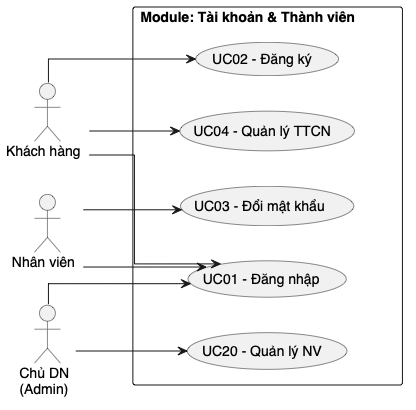 |
| BÁO CÁO BÀI TẬP LỚN HỌC PHẦN: NHẬP MÔN CÔNG NGHỆ PHẦN MỀM Module: Quản trị cốt lõi |
| Giảng viên hướng dẫn: Đỗ Thị Liên Lớp học phần: D23CQCE01-B Nhóm thực hiện: Nhóm 7 SV thực hiện: Bế Quốc Khánh MSV: B23DCCE049 |
| HÀ NỘI, THÁNG 5/2026 |

# MỤC LỤC

# 
# I. PHA XÁC ĐỊNH YÊU CẦU
## Mô hình nghiệp vụ bằng UML
### 1.1. Danh sách các Actor cho module

| STT | Actor | Mô tả |
| --- | --- | --- |
| 1 | Chủ doanh nghiệp | Là người có quyền hạn cao nhất trong hệ thống, chịu trách nhiệm quản lý toàn diện chuỗi nhà hàng Karaoke. Actor này thực hiện các tác vụ quản trị mang tính toàn cục và định hướng như: thiết lập danh sách chi nhánh, cấu hình danh mục loại phòng chuẩn, quy định chính sách hạng hội viên, đồng thời kiểm soát thông tin và tài khoản của toàn bộ khách hàng trên toàn hệ thống. |
| 2 | Quản lý chi nhánh | Là người được phân công điều hành trực tiếp tại một cơ sở Karaoke cụ thể. Actor này có quyền hạn hẹp hơn, quản lý các dữ liệu vật lý và kinh doanh cục bộ thuộc phạm vi chi nhánh của mình. Tiêu biểu nhất là thao tác thiết lập, thêm mới và bảo trì trạng thái của các phòng hát thực tế dựa trên bộ danh mục chuẩn do Chủ doanh nghiệp đã quy định. |

### 
### 1.2. Các Use Case cho Actor

| Actor | Use Case |
| --- | --- |
| Chủ doanh nghiệp | UC16 - Quản lý hệ thống chi nhánh |
|  | UC17 - Quản lý khách hàng toàn hệ thống |
|  | UC18 - Quản lý hạng hội viên |
|  | UC19 - Quản lý danh mục loại phòng, |
| Quản lý chi nhánh | UC20 - Quản lý phòng hát tại chi nhánh |

### 

### 1.3. Biểu đồ Use Case tổng quan của mô-đun 

### 

### 1.4. Biểu đồ Use Case phân rã của mô-đun
#### Use Case 16 - Quản lý hệ thống chi nhánh
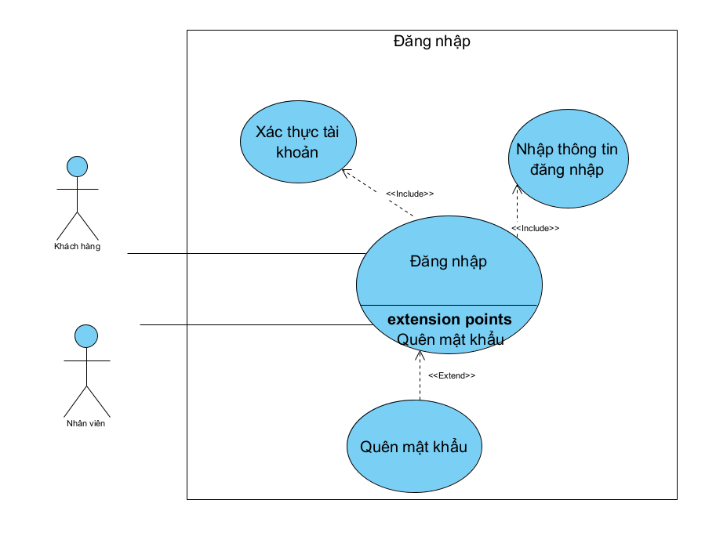
#### Use Case 17 - Quản lý khách hàng toàn hệ thống
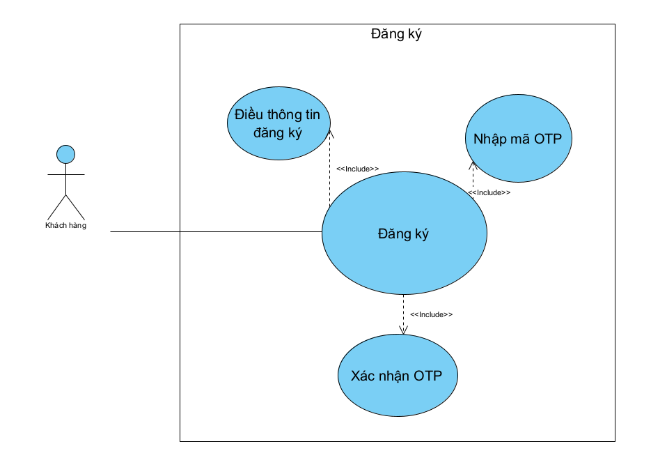
#### Use Case 18 - Quản lý hạng hội viên
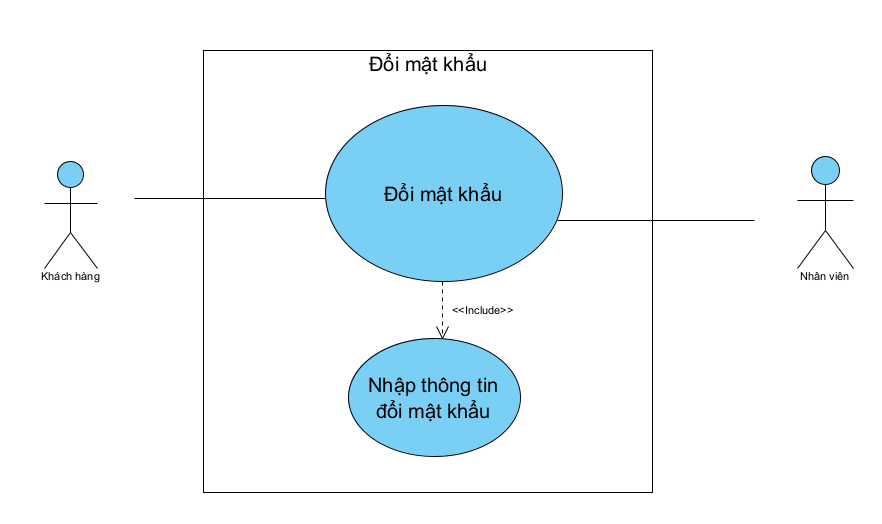
#### Use Case 19 - Quản lý danh mục loại phòng
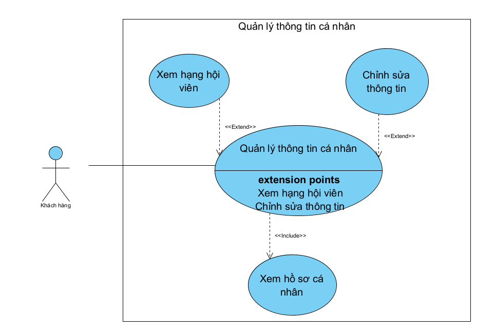
#### Use Case 20 - Quản lý phòng hát tại chi nhánh
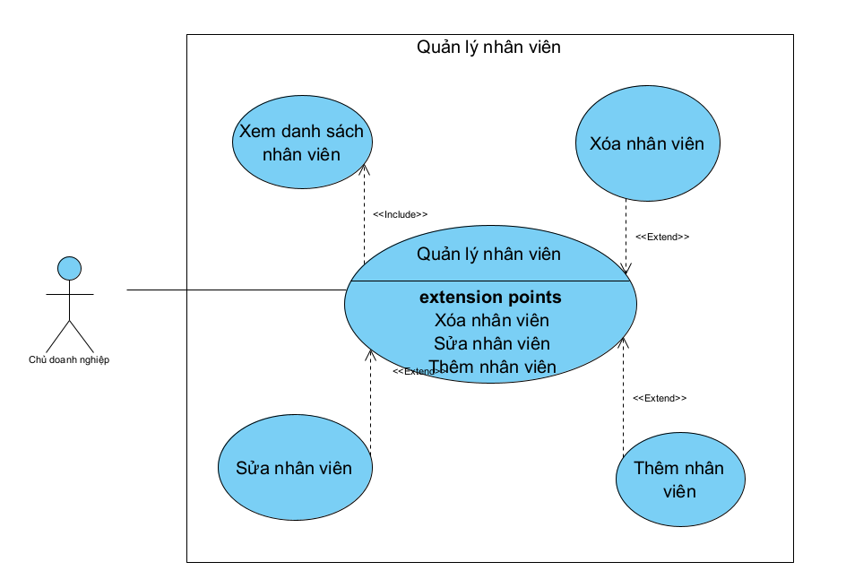

# II. PHA PHÂN TÍCH
## 1. Mô hình hóa chức năng
### 1.1. Kịch bản “Quản lý hệ thống chi nhánh”

| Use case | Quản lý hệ thống chi nhánh |
| --- | --- |
| Actor | Chủ doanh nghiệp (Admin) |
| Tiền điều kiện | Admin đã đăng nhập thành công vào hệ thống |
| Hậu điều kiện | Thông tin chi nhánh được cập nhật trong CSDL |
| Kịch bản chính | (1) Admin chọn chức năng "Quản lý hệ thống chi nhánh" trên giao diện chính (2) Hệ thống hiển thị danh sách chi nhánh với bảng thông tin bao gồm: Mã chi nhánh, tên chi nhánh, địa chỉ, số điện thoại, thao tác (thêm sửa xóa) (3) Admin chọn một trong ba thao tác: Thêm mới, Sửa thông tin, hoặc Xóa. — Nếu chọn "Thêm mới": (4a) Hệ thống hiển thị form: Tên chi nhánh, Địa chỉ, Số điện thoại. (5a) Admin nhập: Tên = "Karaoke Star Cần Thơ", Địa chỉ = "12 Nguyễn Văn Cừ, Cần Thơ", SĐT = "0292-3654789". (6a) Admin nhấn "Lưu". (7a) Hệ thống kiểm tra hợp lệ (tên không trùng, SĐT đúng định dạng). (8a) Hệ thống lưu vào CSDL, quay về danh sách, thông báo "Thêm chi nhánh thành công".  — Nếu chọn "Sửa thông tin": (4b) Admin nhấn nút "Sửa thông tin" (5b) Hệ thống hiển thị form đã điền sẵn: Tên, địa chỉ, số điện thoại chi nhánh. (6b) Admin thay đổi thông tin của chi nhánh. (7b) Hệ thống kiểm tra hợp lệ. (8b) Hệ thống cập nhật CSDL, quay về danh sách, thông báo "Cập nhật thành công".  — Nếu chọn "Xóa": (4c) Admin nhấn nút "Xóa" trên dòng CN01. (5c) Hệ thống kiểm tra ràng buộc: chi nhánh có phòng hoặc đặt phòng đang hoạt động không? (6c) Nếu có → thông báo "Không thể xóa chi nhánh đang có phòng hoạt động", kết thúc. (7c) Nếu không → hiển thị xác nhận: "Bạn có chắc muốn xóa Karaoke Star Hà Nội?". (8c) Admin nhấn "Xác nhận". (9c) Hệ thống xóa khỏi CSDL, cập nhật danh sách, thông báo "Xóa chi nhánh thành công". |
| Ngoại lệ | (7a) Tên chi nhánh đã tồn tại → thông báo "Tên chi nhánh đã tồn tại", Admin nhập lại. (7a) Số điện thoại sai định dạng → thông báo "Số điện thoại không hợp lệ", Admin nhập lại. (6c) Chi nhánh đang có phòng hoạt động → thông báo "Không thể xóa chi nhánh đang có phòng hoạt động". |

### 1.2. Kịch bản “Quản lý khách hàng toàn hệ thống”

| Trường | Nội dung |
| --- | --- |
| Use case | Quản lý khách hàng toàn hệ thống |
| Actor | Chủ doanh nghiệp (Admin) |
| Tiền điều kiện | Admin đã đăng nhập thành công vào hệ thống |
| Hậu điều kiện | Thông tin khách hàng được hiển thị hoặc trạng thái tài khoản được cập nhật |
| Kịch bản chính | (1) Admin chọn chức năng "Quản lý khách hàng toàn hệ thống" từ giao diện chính. (2) Hệ thống hiển thị giao diện tìm kiếm khách hàng với ô nhập từ khóa, dropdown chọn tiêu chí (Tên/Số điện thoại/Mã KH), nút "Tìm kiếm". (3) Admin nhập từ khóa "Nguyễn Văn An", chọn tiêu chí "Tên" và nhấn nút "Tìm kiếm". (4) Hệ thống hiển thị danh sách khách hàng khớp từ khóa trên toàn chuỗi:   (5) Admin chọn một trong hai thao tác: Xem lịch sử sử dụng hoặc Khóa tài khoản. — Nếu chọn "Xem lịch sử sử dụng": (6a) Admin nhấn nút "Xem" trên dòng KH001. (7a) Hệ thống hiển thị chi tiết khách hàng: thông tin cá nhân và lịch sử sử dụng:   (8a) Admin xem thông tin và nhấn "Đóng" để quay về danh sách. — Nếu chọn "Khóa tài khoản": (6b) Admin nhấn nút "Khóa TK" trên dòng KH001. (7b) Hệ thống hiển thị xác nhận: "Bạn có chắc muốn khóa tài khoản Nguyễn Văn An (KH001)?". (8b) Admin nhấn "Xác nhận". (9b) Hệ thống cập nhật trạng thái tài khoản thành "Đã khóa", thông báo "Khóa tài khoản thành công". |
| Ngoại lệ | (3) Để trống ô tìm kiếm → thông báo "Vui lòng nhập từ khóa tìm kiếm",  Admin nhập lại. (4) Không tìm thấy khách hàng → thông báo "Không tìm thấy khách hàng nào", Admin nhập lại từ khóa khác. (6b) Tài khoản đã bị khóa trước đó → thông báo "Tài khoản này đã bị khóa", nút chuyển thành "Mở khóa". |

### 1.3. Kịch bản “Quản lý hạng hội viên”

| Trường | Nội dung |
| --- | --- |
| Use case | Quản lý hạng hội viên |
| Actor | Chủ doanh nghiệp (Admin) |
| Tiền điều kiện | Admin đã đăng nhập thành công vào hệ thống |
| Hậu điều kiện | Cấu hình hạng hội viên được cập nhật trong CSDL |
| Kịch bản chính | (1) Admin chọn chức năng "Quản lý hạng hội viên" từ giao diện chính. (2) Hệ thống hiển thị giao diện cấu hình hạng hội viên với bảng:   Và nút "Thay đổi hạng thủ công" ở phía trên. (3) Admin chọn một trong hai thao tác: Sửa cấu hình hạng hoặc Thay đổi hạng thủ công.  — Nếu chọn "Sửa cấu hình hạng": (4a) Admin nhấn nút "Sửa" trên dòng HH02 – Bạc. (5a) Hệ thống hiển thị form đã điền sẵn: Tên hạng = "Bạc", Ngưỡng điểm = 500, Giảm giá = 5%, Điểm thưởng nhân = x1.5. (6a) Admin thay đổi Ngưỡng điểm = 600, Giảm giá = 7%. (7a) Admin nhấn "Lưu". (8a) Hệ thống kiểm tra hợp lệ (ngưỡng điểm không trùng hạng khác, giảm giá từ 0–100%). (9a) Hệ thống cập nhật CSDL, quay về danh sách, thông báo "Cập nhật thành công".  — Nếu chọn "Thay đổi hạng thủ công": (4b) Admin nhấn nút "Thay đổi hạng thủ công". (5b) Hệ thống hiển thị form tìm kiếm khách hàng: ô nhập mã/tên KH, nút "Tìm". (6b) Admin nhập "KH001" và nhấn "Tìm". (7b) Hệ thống hiển thị thông tin: Tên = Nguyễn Văn An, Hạng hiện tại = Bạc, Điểm = 850. (8b) Admin chọn hạng mới = "Vàng" từ dropdown. (9b) Admin nhấn "Xác nhận". (10b) Hệ thống cập nhật hạng hội viên cho khách hàng và thông báo "Thay đổi hạng thành công". |
| Ngoại lệ | (6a) Ngưỡng điểm trùng với hạng khác → thông báo "Ngưỡng điểm đã tồn tại ở hạng khác", Admin nhập lại. (8a) Giảm giá ngoài khoảng 0–100% → thông báo "Giảm giá phải từ 0% đến 100%", Admin nhập lại. (6b) Không tìm thấy khách hàng → thông báo "Không tìm thấy khách hàng", Admin nhập lại mã khác. |

### 1.4. Kịch bản “Quản lý danh mục loại phòng”

| Trường | Nội dung |
| --- | --- |
| Use case | Quản lý danh mục loại phòng |
| Actor | Chủ doanh nghiệp (Admin) |
| Tiền điều kiện | Admin đã đăng nhập thành công vào hệ thống |
| Hậu điều kiện | Cấu hình loại phòng được cập nhật trong CSDL |
| Kịch bản chính | (1) Admin chọn chức năng "Quản lý loại phòng" từ giao diện chính. (2) Hệ thống hiển thị danh mục các loại phòng chuẩn với nút "Thêm mới" và bảng: (3) Admin chọn một trong ba thao tác: Thêm mới, Sửa thông tin, hoặc Xóa. — Nếu chọn "Thêm mới": (4a) Hệ thống hiển thị form: Tên loại phòng, Sức chứa chuẩn, Giá cước chung. (5a) Admin nhập: Tên = "Party", Sức chứa = 30, Giá = 500.000đ. (6a) Admin nhấn "Lưu". (7a) Hệ thống kiểm tra hợp lệ (tên không trùng, sức chứa và giá > 0). (8a) Hệ thống lưu vào CSDL, quay về danh mục, thông báo "Thêm loại phòng thành công".  — Nếu chọn "Sửa thông tin": (4b) Admin nhấn nút "Sửa" trên dòng LP02. (5b) Hệ thống hiển thị form đã điền sẵn: Tên = "VIP", Sức chứa = 15, Giá = 250.000đ. (6b) Admin thay đổi Giá = 280.000đ và nhấn "Lưu". (7b) Hệ thống kiểm tra hợp lệ. (8b) Hệ thống cập nhật CSDL toàn chuỗi, quay về danh mục, thông báo "Cập nhật thành công".  — Nếu chọn "Xóa": (4c) Admin nhấn nút "Xóa" trên dòng LP01. (5c) Hệ thống kiểm tra ràng buộc: có chi nhánh nào đang sử dụng loại phòng này không? (6c) Nếu có → thông báo "Không thể xóa do loại phòng đang được sử dụng tại các chi nhánh", kết thúc. (7c) Nếu không → hiển thị xác nhận: "Bạn có chắc muốn xóa loại phòng Standard?". (8c) Admin nhấn "Xác nhận". (9c) Hệ thống xóa khỏi CSDL, cập nhật danh mục, thông báo "Xóa loại phòng thành công". |
| Ngoại lệ | (7a) Tên loại phòng đã tồn tại → thông báo "Loại phòng này đã tồn tại", Admin nhập lại. (7a) Sức chứa hoặc giá ≤ 0 → thông báo "Sức chứa và giá phải lớn hơn 0", Admin nhập lại. (6c) Loại phòng đang được sử dụng → thông báo "Không thể xóa do loại phòng đang được sử dụng tại các chi nhánh". |

### 1.5. Kịch bản “Quản lý phòng hát chi nhánh”

| Trường | Nội dung |
| --- | --- |
| Use case | Quản lý phòng hát chi nhánh |
| Actor | Quản lý chi nhánh |
| Tiền điều kiện | Quản lý chi nhánh đã đăng nhập thành công vào hệ thống |
| Hậu điều kiện | Thông tin phòng hát lẻ của chi nhánh được cập nhật trong CSDL |
| Kịch bản chính | (1) Quản lý chi nhánh chọn chức năng "Quản lý phòng hát". (2) Hệ thống tự động lấy mã chi nhánh của tài khoản và hiển thị danh sách phòng hiện có với nút "Thêm mới" và bảng:  (3) Quản lý chọn một trong ba thao tác: Thêm mới, Sửa thông tin, hoặc Xóa. — Nếu chọn "Thêm mới": (4a) Hệ thống hiển thị form: Tên phòng, Loại phòng (dropdown lấy từ danh mục chuẩn Admin đã tạo). (5a) Quản lý nhập: Tên = "VIP-02", chọn Loại = "VIP". (Sức chứa và Giá sẽ tự động áp dụng theo chuẩn Admin). (6a) Quản lý nhấn "Lưu". (7a) Hệ thống kiểm tra hợp lệ (tên phòng không trùng trong chi nhánh). (8a) Hệ thống lưu phòng mới, thông báo "Thêm phòng thành công". — Nếu chọn "Sửa thông tin": (4b) Quản lý nhấn nút "Sửa" trên dòng P001. (5b) Hệ thống hiển thị form: Tên = "VIP-01", Loại = "Super VIP", Trạng thái = "Trống". (6b) Quản lý đổi Trạng thái = "Bảo trì" và nhấn "Lưu". (7b) Hệ thống cập nhật CSDL, thông báo "Cập nhật thành công".  — Nếu chọn "Xóa": (4c) Quản lý nhấn nút "Xóa" trên dòng P001. (5c) Hệ thống kiểm tra: phòng có đặt phòng đang hoạt động không? (6c) Nếu có → thông báo "Không thể xóa phòng đang có khách", kết thúc. (7c) Nếu không → hiển thị popup xác nhận: "Xóa phòng VIP-01?". (8c) Quản lý nhấn "Xác nhận". (9c) Hệ thống xóa khỏi CSDL, thông báo "Xóa phòng thành công". |
| Ngoại lệ | (7a) Tên phòng đã tồn tại trong cùng chi nhánh → thông báo "Tên phòng đã tồn tại", Quản lý nhập lại. (6c) Phòng đang có khách → thông báo "Không thể xóa phòng đang có đặt phòng hoạt động". |

## 2. Mô hình hóa lớp
Bước 1 – Mô tả Module bằng 1 đoạn văn:
Module Quản trị cốt lõi cho phép Admin và Quản lý chi nhánh thực hiện các thao tác quản lý dữ liệu nền tảng. Admin có thể quản lý hệ thống chi nhánh: thêm, sửa, xóa chi nhánh với các thông tin như tên chi nhánh, địa chỉ, điện thoại chi nhánh. Admin quản lý khách hàng: tìm kiếm, xem lịch sử sử dụng và khóa tài khoản khách hàng trên toàn chuỗi với các thông tin tên khách hàng, số điện thoại, điểm tích lũy, trạng thái tài khoản. Admin quản lý hạng hội viên: cấu hình ngưỡng điểm, ưu đãi giảm giá và thay đổi hạng. Admin quản lý danh mục loại phòng: định nghĩa các chuẩn phòng, sức chứa, giá cả, và trạng thái dùng chung cho toàn chuỗi. Bên cạnh đó, Quản lý chi nhánh được cấp quyền quản lý phòng hát lẻ tại chi nhánh của mình: thêm các phòng vật lý theo loại phòng Admin đã tạo, cập nhật tên phòng và trạng thái phòng.

Bước 2 – Trích danh từ và đánh giá:

| Danh từ | Kết luận | Lý do |
| --- | --- | --- |
| Admin, Quản lý chi nhánh | Loại (Actor) | Là người dùng tương tác với hệ thống, không phải dữ liệu lưu trong CSDL. |
| Hệ thống, Dữ liệu nền tảng | Loại | Danh từ chung chung, trừu tượng, không có thuộc tính cụ thể. |
| Chi nhánh | Branch | Tồn tại độc lập trong CSDL. |
| Tên chi nhánh, Địa chỉ, Điện thoại chi nhánh | Thuộc tính của Branch | Mô tả thông tin của chi nhánh. |
| Khách hàng | Client | Tồn tại độc lập trong CSDL. |
| Tên khách hàng, Số điện thoại, Điểm tích lũy, Tài khoản, Trạng thái tài khoản | Thuộc tính của Client | Mô tả thông tin của khách hàng. |
| Hạng hội viên | MembershipTier | Tồn tại độc lập trong CSDL. |
| Ngưỡng điểm, Ưu đãi giảm giá | Thuộc tính của MembershipTier | Mô tả thông tin hạng hội viên. |
| Loại phòng | RoomType | Tồn tại độc lập trong CSDL. |
| Sức chứa, Giá cả, Trạng thái (loại phòng) | Thuộc tính của RoomType | Mô tả thông tin loại phòng chuẩn. |
| Phòng hát | Room | Tồn tại độc lập trong CSDL. |
| Tên phòng, Trạng thái (phòng hát) | Thuộc tính của Room | Mô tả thông tin của phòng hát. |
| Lịch sử sử dụng, Đặt phòng | Booking | Cần truy vấn lịch sử khách hàng và kiểm tra khi xóa phòng. (Thuộc module Quản lý đặt phòng). |

=> Các lớp thực thể: Branch, Client, MembershipTier, RoomType, Room, Booking (Ngoại lai).

Bước 4 – Xác định quan hệ số lượng giữa các thực thể:
Một Branch có thể có nhiều Room, một Room chỉ thuộc về duy nhất một Branch ⇒ Branch và Room quan hệ 1-n.
Một MembershipTier có thể áp dụng cho nhiều Client, một Client tại một thời điểm chỉ thuộc về một MembershipTier duy nhất ⇒ MembershipTier và Client quan hệ 1-n.
Một RoomType có thể được áp dụng cho nhiều Room (ở nhiều chi nhánh), một Room cụ thể chỉ được thiết lập theo một RoomType duy nhất ⇒ RoomType và Room quan hệ 1-n.
Một Client có thể có nhiều Booking ⇒ Client và Booking có quan hệ 1-n.
Một Room có thể có nhiều Booking ⇒ Room và Booking quan hệ 1-n.

Bước 5 – Xác định quan hệ đối tượng giữa các thực thể:
Branch có quan hệ gắn chặt (composition) với Room: phòng hát vật lý không thể tồn tại nếu chi nhánh bị giải thể/xóa bỏ.
MembershipTier có quan hệ hợp thành (aggregation) với Client: khách hàng vẫn tồn tại và hoạt động bình thường khi hạng hội viên bị xóa bỏ hoặc thay đổi.
RoomType có quan hệ liên kết (association) với Room: phòng hát tham chiếu đến loại phòng chuẩn từ danh mục do Admin định nghĩa.
Client và Room có quan hệ liên kết (association) với Booking: dùng để truy vấn chéo dữ liệu lịch sử.

Biểu đồ lớp thực thể pha phân tích:
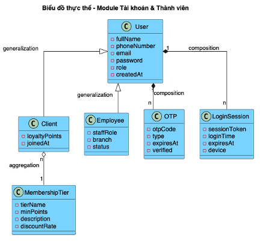

## 3. Mô hình hóa tĩnh - Biểu đồ phân tích chức năng
### 3.1. Chức năng Quản lý hệ thống chi nhánh (UC16)
Phân tích chi tiết chức năng Quản lý hệ thống chi nhánh:
Admin đăng nhập vào hệ thống -> giao diện chính hiện lên -> đề xuất lớp AdminHomeView, có nút Quản lý hệ thống chi nhánh.
Admin chọn nút Quản lý hệ thống chi nhánh -> giao diện danh sách chi nhánh hiện lên -> đề xuất lớp BranchPage, hiển thị danh sách các chi nhánh kèm nút Thêm mới, ô tìm kiếm và nút Sửa, Xóa.
Khi giao diện được hiển thị, hệ thống phải tìm kiếm danh sách chi nhánh trong CSDL -> đề xuất hàm list() của lớp Branch.
Admin click nút Thêm mới -> giao diện form nhập liệu hiện lên -> đề xuất lớp BranchForm, có các ô nhập Tên chi nhánh, Địa chỉ, Số điện thoại và nút Lưu.
Sau khi Admin điền thông tin và ấn nút Lưu, hệ thống phải thực hiện lưu thông tin chi nhánh xuống CSDL -> cần chức năng create() -> chức năng này là hành động của đối tượng Branch.  
Tương tự, khi Admin thao tác sửa hoặc xóa chi nhánh, hệ thống đề xuất các hàm update() và delete() của lớp Branch. 
Cập nhật xong, hệ thống quay về giao diện danh sách chi nhánh BranchPage sđể Admin tiếp tục quản lý.
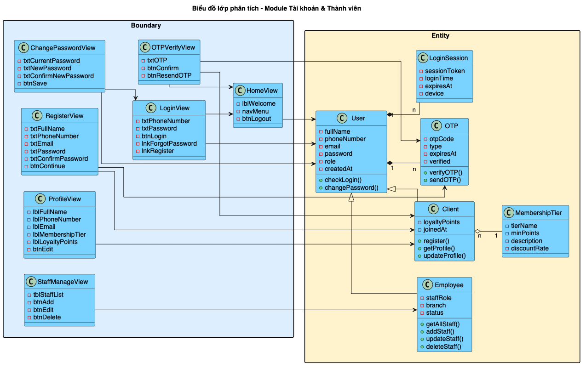
### 3.2. Chức năng Quản lý khách hàng toàn hệ thống
Phân tích chi tiết chức năng Quản lý khách hàng toàn hệ thống:
Vào hệ thống -> giao diện chính hiện lên -> đề xuất lớp AdminHomeView, có nút Quản lý khách hàng.
Admin click nút Quản lý khách hàng -> giao diện tìm kiếm khách hàng hiện lên -> đề xuất lớp ClientPage, hiển thị ô nhập từ khóa, tiêu chí tìm kiếm, nút Tìm kiếm và bảng danh sách khách hàng.
Để hiển thị hệ thống phải tìm kiếm khách hàng trong CSDL -> đề xuất hàm list() của lớp Client.
Admin click nút Thêm khách hàng -> popup nhập liệu hiện lên -> đề xuất lớp ClientForm, hiển thị dropdown Danh xưng, ô nhập Họ & Tên, Số điện thoại và nút Lưu Thông Tin.
Admin điền thông tin và ấn Lưu -> hệ thống thực thi lưu xuống CSDL -> đề xuất hàm create() của lớp Client.
Admin click chọn một khách hàng và ấn Xem -> giao diện chi tiết khách hàng hiện lên -> đề xuất lớp ClientDetailPanel, hiển thị thông tin cá nhân, lịch sử sử dụng, trạng thái và nút Khóa tài khoản.
Khi giao diện chi tiết hiển thị, hệ thống truy xuất thông tin chi tiết bằng hàm get() của lớp Client, đồng thời gọi hàm getBookingHistory() của lớp Booking để lấy lịch sử sử dụng.
Sau khi Admin ấn nút Khóa tài khoản -> hệ thống thực hiện cập nhật trạng thái khóa xuống CSDL -> cần chức năng lock() -> chức năng này là hành động của đối tượng Client.
Cập nhật xong, hệ thống thông báo thành công và cập nhật lại giao diện ClientDetailPanel để Admin tiếp tục thao tác.

### 3.3. Chức năng Quản lý hạng hội viên
Phân tích chi tiết chức năng Quản lý hạng hội viên:
Vào hệ thống -> giao diện chính hiện lên -> đề xuất lớp AdminHomeView, có nút Quản lý hạng hội viên.
Admin click nút Quản lý hạng hội viên -> giao diện cấu hình hạng hiện lên -> đề xuất lớp MembershipTierPage, hiển thị bảng danh sách các hạng hội viên, nút Thay đổi hạng thủ công và nút Sửa.
Khi giao diện hiển thị, hệ thống phải tải danh sách hạng từ CSDL -> đề xuất hàm listTiers() của lớp MembershipTier.
Admin click nút Sửa trên một hạng -> giao diện form sửa hiện lên -> đề xuất lớp MembershipTierForm, hiển thị ô nhập Ngưỡng điểm, Giảm giá và nút Lưu.
Admin thay đổi thông tin và ấn nút Lưu -> hệ thống thực hiện cập nhật cấu hình hạng xuống CSDL -> cần chức năng updateTier() -> chức năng này là hành động của đối tượng MembershipTier.
Nếu Admin ấn nút Thay đổi hạng thủ công -> giao diện tìm kiếm và đổi hạng hiện lên -> đề xuất lớp ManualUpgradeModal, hiển thị ô tìm kiếm khách hàng, dropdown chọn hạng và nút Xác nhận.
Sau khi Admin ấn nút Xác nhận -> hệ thống thực hiện cập nhật hạng cho khách hàng xuống CSDL -> cần chức năng upgradeMembershipManual() -> chức năng này là hành động của đối tượng Client.
Cập nhật xong, hệ thống quay về giao diện MembershipTierPage để Admin tiếp tục cấu hình.

	
### 

### 3.4. Chức năng Quản lý danh mục loại phòng
Phân tích chi tiết chức năng Quản lý danh mục loại phòng:
Vào hệ thống -> giao diện chính hiện lên -> đề xuất lớp AdminHomeView, có nút Quản lý danh mục loại phòng.
Admin click nút Quản lý danh mục loại phòng -> giao diện danh mục loại phòng hiện lên -> đề xuất lớp RoomTypePage, hiển thị bảng danh sách loại phòng chuẩn và nút Thêm mới.
Khi giao diện hiển thị, hệ thống phải lấy danh sách loại phòng từ CSDL -> đề xuất hàm list() của lớp RoomType.
Admin click nút Thêm mới -> giao diện form loại phòng hiện lên -> đề xuất lớp RoomTypeForm, hiển thị ô nhập Tên loại, Sức chứa chuẩn, Giá cước chung, Trạng thái và nút Lưu.
Admin điền thông tin và ấn nút Lưu -> hệ thống thực hiện lưu loại phòng xuống CSDL toàn chuỗi -> cần chức năng create() -> chức năng này là hành động của đối tượng RoomType.  
* Tương tự, khi Admin thao tác sửa hoặc xóa loại phòng, hệ thống đề xuất các hàm update() và delete() của lớp RoomType. 
Cập nhật xong, hệ thống quay về giao diện danh mục RoomTypePage để Admin tiếp tục quản lý.

### 
### 3.5. Chức năng Quản lý phòng hát chi nhánh
Phân tích chi tiết chức năng Quản lý phòng hát chi nhánh:
Vào hệ thống -> giao diện chính hiện lên -> đề xuất lớp BranchManagerHomeView, có nút Quản lý phòng hát.
Quản lý chi nhánh click nút Quản lý phòng hát -> giao diện danh sách phòng hiện lên -> đề xuất lớp RoomPage, hiển thị bảng danh sách phòng thuộc chi nhánh, trạng thái và nút Thêm mới.
Khi giao diện hiển thị, hệ thống phải tìm kiếm danh sách phòng theo chi nhánh trong CSDL -> đề xuất hàm list() của lớp Room. 
Quản lý chi nhánh click nút Thêm mới -> giao diện form nhập phòng hiện lên -> đề xuất lớp RoomForm, hiển thị ô nhập Tên phòng, dropdown Loại phòng, Trạng thái và nút Lưu.
Quản lý chi nhánh nhập thông tin và ấn nút Lưu -> hệ thống thực hiện kiểm tra và lưu phòng mới xuống CSDL -> cần chức năng create() -> chức năng này là hành động của đối tượng Room.  
* Tương tự, khi Quản lý thao tác Sửa phòng, hệ thống đề xuất hàm update() của lớp Room. Khi thao tác Xóa phòng, hệ thống sẽ gọi checkActiveBooking() của lớp Booking để kiểm tra, sau đó gọi delete() của lớp Room. 
Cập nhật xong, hệ thống quay về giao diện danh sách phòng RoomPage để Quản lý chi nhánh tiếp tục quản lý.

## 4. Mô hình hóa động - Biểu đồ tuần tự
### 4.1. Chức năng Quản lý hệ thống chi nhánh
Kịch bản chi tiết:
Chủ doanh nghiệp (Admin) click vào chức năng "Quản lý hệ thống chi nhánh" trên giao diện AdminHomeView.
Lớp AdminHomeView gọi sang lớp BranchPage.
Lớp BranchPage gọi đến lớp Branch để xử lý thông tin.
Lớp Branch gọi hàm list().
Lớp Branch trả kết quả về cho lớp BranchPage.
Lớp BranchPage hiển thị.
Chủ doanh nghiệp click nút "Thêm mới".
Lớp BranchPage gọi sang lớp BranchForm.
Lớp BranchForm hiển thị.
 Chủ doanh nghiệp nhập thông tin chi nhánh và click nút "Lưu".
 Lớp BranchForm gọi đến lớp Branch để xử lý thông tin.
 Lớp Branch gọi hàm create().
 Lớp Branch trả kết quả về cho lớp BranchForm.
 Lớp BranchForm gọi lại về lớp BranchPage.
 Lớp BranchPage gọi đến lớp Branch để xử lý thông tin.
 Lớp Branch gọi hàm list().
 Lớp Branch trả kết quả về cho lớp BranchPage.
 Lớp BranchPage hiển thị.

### 

### 4.2. Chức năng Quản lý khách hàng toàn hệ thống
Kịch bản chi tiết:
Chủ doanh nghiệp click vào chức năng "Quản lý khách hàng" trên giao diện AdminHomeView.
Lớp AdminHomeView gọi sang lớp ClientPage.
Lớp ClientPage hiển thị.
Chủ doanh nghiệp nhập thông tin từ khóa và click nút "Tìm kiếm".
Lớp ClientPage gọi đến lớp Client để xử lý thông tin.
Lớp Client gọi hàm list()	.
Lớp Client trả kết quả về cho lớp ClientPage.
Lớp ClientPage hiển thị danh sách khách hàng tương ứng.
Chủ doanh nghiệp chọn thông tin khách hàng tương ứng và click "Xem".
 Lớp ClientPage gọi sang lớp ClientDetailPanel.
 Lớp ClientDetailPanel gọi đến lớp Client để xử lý thông tin.
 Lớp Client gọi hàm get().
 Lớp Client trả kết quả về cho lớp ClientDetailPanel.
 Lớp ClientDetailPanel gọi đến lớp Booking để xử lý thông tin.
 Lớp Booking gọi hàm getBookingHistory().
 Lớp Booking trả kết quả về cho lớp ClientDetailPanel.
 Lớp ClientDetailPanel hiển thị.
 Chủ doanh nghiệp click nút "Khóa tài khoản".
 Lớp ClientDetailPanel gọi đến lớp Client để xử lý thông tin.
 Lớp Client gọi hàm lock().
 Lớp Client trả kết quả về cho lớp ClientDetailPanel.
 Lớp ClientDetailPanel hiện thông báo thành công.
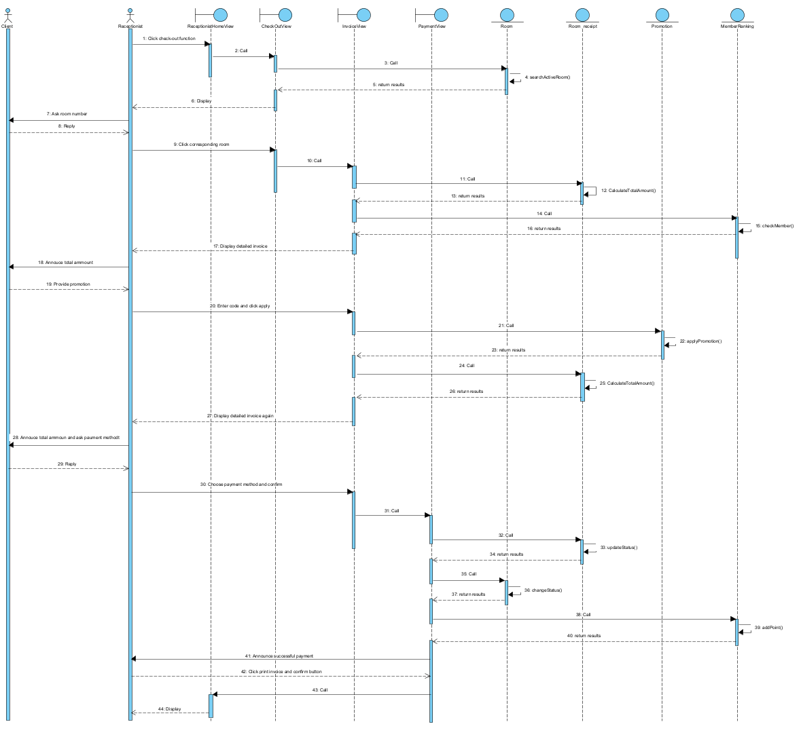
### 
### 4.3. Chức năng Quản lý hạng hội viên
Kịch bản chi tiết:
Chủ doanh nghiệp click chức năng "Quản lý hạng hội viên" trên giao diện AdminHomeView.
Lớp AdminHomeView gọi sang lớp MembershipTierPage.
Lớp MembershipTierPage gọi đến lớp MembershipTier để xử lý thông tin.
Lớp MembershipTier gọi hàm listTiers().
Lớp MembershipTier trả kết quả về cho lớp MembershipTierPage.
Lớp MembershipTierPage hiển thị.
Chủ doanh nghiệp click nút "Sửa" trên một hạng.
Lớp MembershipTierPage gọi sang lớp MembershipTierForm.
Lớp MembershipTierForm hiển thị.
 Chủ doanh nghiệp nhập thông tin thay đổi và click nút "Lưu".
 Lớp MembershipTierForm gọi đến lớp MembershipTier để xử lý thông tin.
 Lớp MembershipTier gọi hàm updateTier().
 Lớp MembershipTier trả kết quả về cho lớp MembershipTierForm.
 Lớp MembershipTierForm gọi lại về lớp MembershipTierPage.
 Lớp MembershipTierPage gọi đến lớp MembershipTier để xử lý thông tin.
 Lớp MembershipTier gọi hàm listTiers().
 Lớp MembershipTier trả kết quả về cho lớp MembershipTierPage.
 Lớp MembershipTierPage hiển thị.
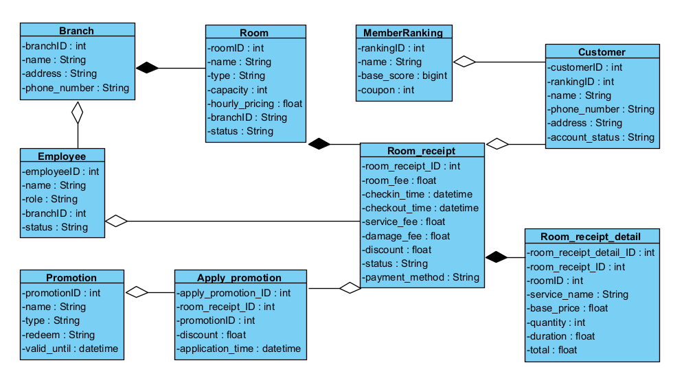
### 4.4. Chức năng Quản lý danh mục loại phòng
Kịch bản chi tiết:
Chủ doanh nghiệp click chức năng "Quản lý danh mục loại phòng" trên giao diện AdminHomeView.
Lớp AdminHomeView gọi sang lớp RoomTypePage.
Lớp RoomTypePage gọi đến lớp RoomType để xử lý thông tin.
Lớp RoomType gọi hàm list().
Lớp RoomType trả kết quả về cho lớp RoomTypePage.
Lớp RoomTypePage hiển thị.
Chủ doanh nghiệp click nút "Thêm mới".
Lớp RoomTypePage gọi sang lớp RoomTypeForm.
Lớp RoomTypeForm hiển thị.
 Chủ doanh nghiệp nhập thông tin loại phòng mới và click nút "Lưu".
 Lớp RoomTypeForm gọi đến lớp RoomType để xử lý thông tin.
 Lớp RoomType gọi hàm create().
 Lớp RoomType trả kết quả về cho lớp RoomTypeForm.
 Lớp RoomTypeForm gọi lại về lớp RoomTypePage.
 Lớp RoomTypePage gọi đến lớp RoomType để xử lý thông tin.
 Lớp RoomType gọi hàm list().
 Lớp RoomType trả kết quả về cho lớp RoomTypePage.
 Lớp RoomTypePage hiển thị.
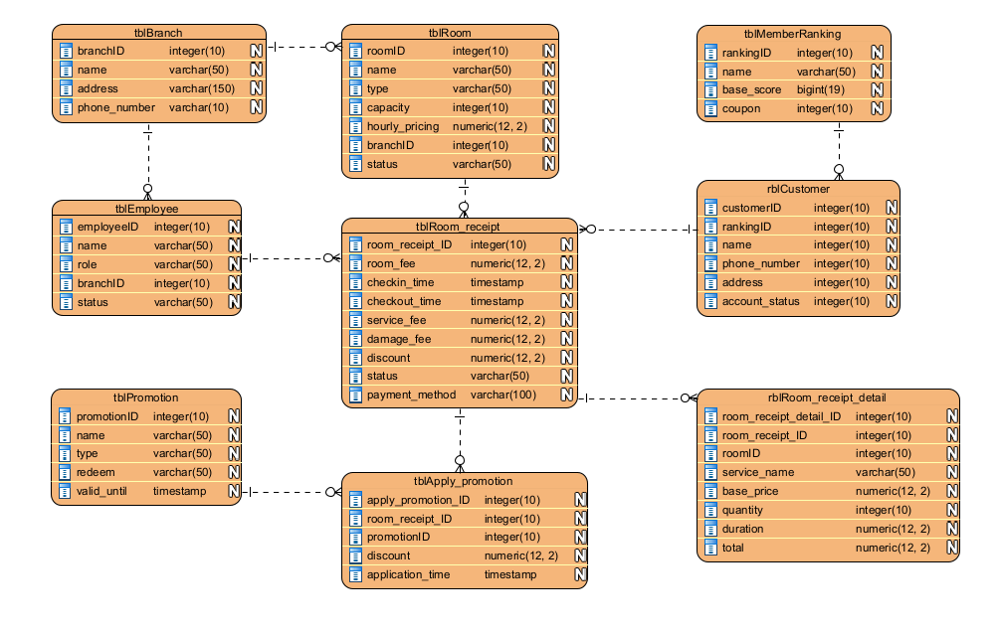
### 4.5. Chức năng Quản lý phòng hát chi nhánh
Kịch bản chi tiết:
Quản lý chi nhánh click chức năng "Quản lý phòng hát" trên giao diện BranchManagerHomeView.
Lớp BranchManagerHomeView gọi sang lớp RoomPage.
Lớp RoomPage gọi đến lớp Room để xử lý thông tin.
Lớp Room gọi hàm list().
Lớp Room trả kết quả về cho lớp RoomPage.
Lớp RoomPage hiển thị.
Quản lý chi nhánh chọn một phòng và click nút "Xóa".
Lớp RoomPage gọi đến lớp Booking để kiểm tra thông tin.
Lớp Booking gọi hàm checkActiveBooking().
 Lớp Booking trả kết quả về cho lớp RoomPage.
 Lớp RoomPage gọi đến lớp Room để xử lý thông tin.
 Lớp Room gọi hàm delete().
 Lớp Room trả kết quả về cho lớp RoomPage.
 Lớp RoomPage gọi đến lớp Room để xử lý thông tin.
 Lớp Room gọi hàm list().
 Lớp Room trả kết quả về cho lớp RoomPage.
 Lớp RoomPage hiển thị danh sách cập nhật.

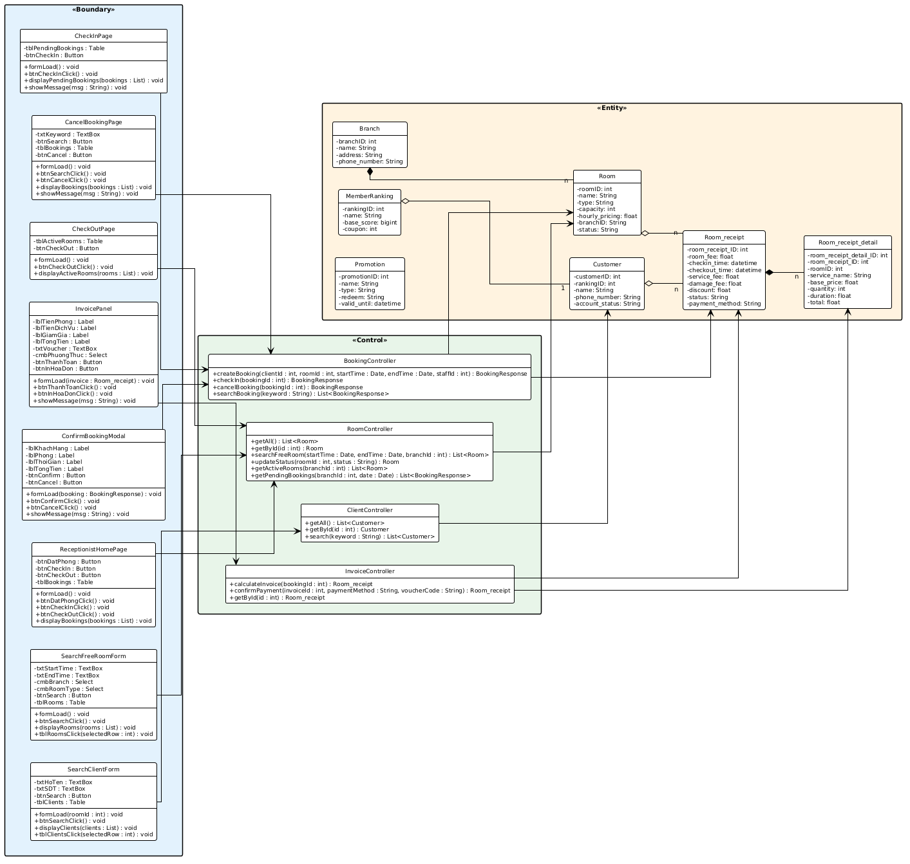

# III. PHA THIẾT KẾ
## . Thiết kế lớp thực thể
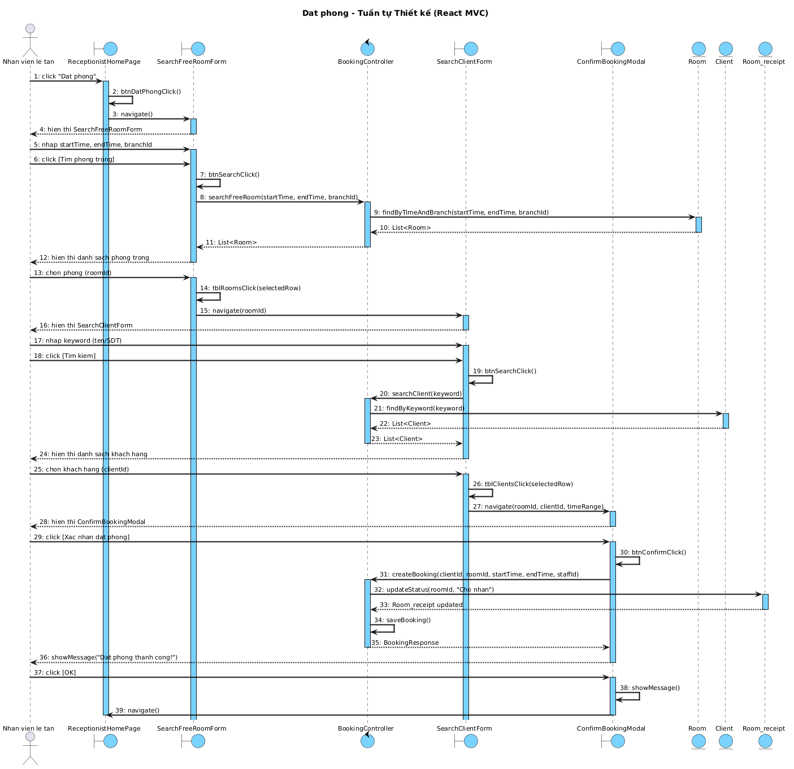
## 2. Thiết kế CSDL
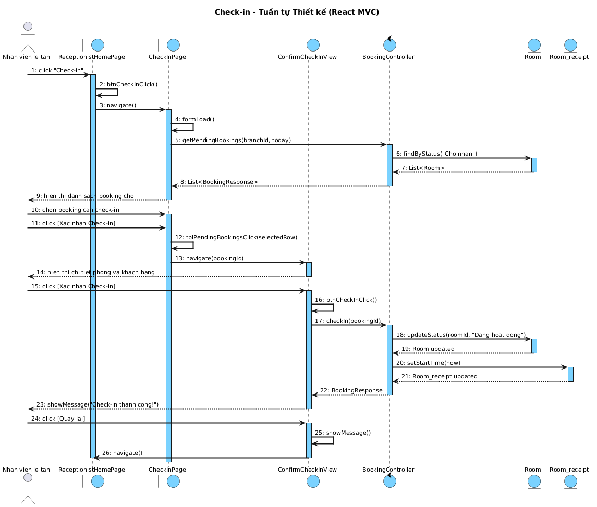
## 3.  Thiết kế tĩnh
### 3.1. Thiết kế giao diện
#### Chức năng Quản lý hệ thống chi nhánh
Màn hình 1: Quản lý hệ thống chi nhánh (BranchPage)
┌──────────────────────────────────────────────────────────┐
│                  QUẢN LÝ CHI NHÁNH                       │
│                                                          │
│  [ + Thêm mới chi nhánh ]                                │
│                                                          │
│ ┌────────┬──────────────────┬──────────────┬───────────┐ │
│ │ Mã CN  │ Tên chi nhánh    │ Địa chỉ      │ Thao tác  │ │
│ ├────────┼──────────────────┼──────────────┼───────────┤ │
│ │ CN01   │ Karaoke Star HN  │ 123 Nguyễn Huệ│ Sửa·Xóa  │ │
│ │ CN02   │ Karaoke Star HCM │ 456 Lê Lợi   │ Sửa·Xóa   │ │
│ │ CN03   │ Karaoke Star ĐN  │ 789 Bạch Đằng│ Sửa·Xóa   │ │
│ └────────┴──────────────────┴──────────────┴───────────┘ │
      └──────────────────────────────────────────────────────────┘
	Màn hình 2: Form thêm/sửa chi nhánh (BranchForm)
┌──────────────────────────────────────┐
                     │       THÊM CHI NHÁNH MỚI             │
│                                      │
│  Tên chi nhánh: [________________]   │
│  Địa chỉ:       [________________]   │
│  Số điện thoại: [________________]   │
│                                      │
│           [ Hủy ]  [ Lưu ]           │
└──────────────────────────────────────┘
#### Chức năng Quản lý khách hàng toàn hệ thống
Màn hình 3: Quản lý hệ thống chi nhánh (BranchPage)
┌──────────────────────────────────────────────────────────┐
│              QUẢN LÝ KHÁCH HÀNG TOÀN HỆ THỐNG            │
│                                                          │
│  Tiêu chí: [Tên ▼]  Từ khóa: [____________]  [ Tìm ]     |
│                                                          │
│ ┌────────┬──────────┬───────────┬──────────┬───────────┐ │
│ │ Mã KH  │ Họ tên   │ SĐT       │ Hạng     │ Thao tác  │ │
│ ├────────┼──────────┼───────────┼──────────┼───────────┤ │
│ │ KH001  │ Nguyễn A │ 090123456 │ Vàng     │ Xem·Khóa  │ │
│ │ KH045  │ Nguyễn A │ 091234567 │ Bạc      │ Xem·Khóa  │ │
│ └────────┴──────────┴───────────┴──────────┴───────────┘ │
      └──────────────────────────────────────────────────────────┘
Màn hình 4: Chi tiết khách hàng (ClientDetailPanel)
┌──────────────────────────────────────────────────────────┐
│              CHI TIẾT KHÁCH HÀNG                         │
│                                                          │
           │  Mã KH     : KH001                  Hạng      : Vàng     │
│  Họ tên    : Nguyễn Văn An          SĐT       : 090123456│
│                                     Điểm      : 2500     │
│  Trạng thái: Hoạt động                                   │
│                                                          │
│  ── Lịch sử sử dụng ──                                   │
│  ┌──────────┬────────┬─────────┬──────────┬──────────┐  │
│  │Mã booking│ Phòng  │ Ngày    │ Giờ      │ Tổng tiền│  │
│  ├──────────┼────────┼─────────┼──────────┼──────────┤  │
│  │ BK1023   │ VIP-01 │ 10/05   │ 19-22h   │ 1.500.000│  │
│  │ BK1056   │ STD-03 │ 18/05   │ 20-23h   │ 900.000  │  │
│  └──────────┴────────┴─────────┴──────────┴──────────┘  │
│                                                          │
│  [ Đóng ]  [ Khóa tài khoản ]                            │
└──────────────────────────────────────────────────────────┘
#### Chức năng Quản lý hạng hội viên
Màn hình 5: Quản lý hạng hội viên (MembershipTierPage)
|──────────────────────────────────────────────────────────┐
│              QUẢN LÝ HẠNG HỘI VIÊN                       │
│                                                          │
│  [ Thay đổi hạng thủ công ]                              │
│                                                          │
│ ┌────────┬──────────┬───────────┬──────────┬──────────┐  │
│ │ Mã hạng│ Tên hạng │ Ngưỡng điểm│ Giảm giá │ Thao tác│  │
│ ├────────┼──────────┼───────────┼──────────┼──────────┤  │
│ │ HH01   │ Thường   │ 0         │ 0%       │ Sửa     │   │
│ │ HH02   │ Bạc      │ 500       │ 5%       │ Sửa     │   │
│ │ HH03   │ Vàng     │ 2000      │ 10%      │ Sửa     │   │
│ └────────┴──────────┴───────────┴──────────┴──────────┘  │
      └──────────────────────────────────────────────────────────┘

#### Chức năng Quản lý danh mục loại phòng
Màn hình 6: Danh mục loại phòng (RoomTypePage)
┌──────────────────────────────────────────────────────────┐
│              QUẢN LÝ DANH MỤC LOẠI PHÒNG                 │
│                                                          │
│  [ + Thêm loại phòng mới ]                               │
│                                                          │
│ ┌────────┬──────────┬───────────┬──────────┬─────────┐   │
│ │ Mã loại│ Tên loại │ Sức chứa  │ Giá chung│ Thao tác│   │
│ ├────────┼──────────┼───────────┼──────────┼─────────┤   │
│ │ LP01   │ Standard │ 10 người  │ 150.000đ │ Sửa·Xóa │   │
│ │ LP02   │ VIP      │ 15 người  │ 250.000đ │ Sửa·Xóa │   │
│ │ LP03   │ Super VIP│ 20 người  │ 300.000đ │ Sửa·Xóa │   │
│ └────────┴──────────┴───────────┴──────────┴─────────┘   │
      └──────────────────────────────────────────────────────────┘

#### Chức năng Quản lý phòng hát chi nhánh
Màn hình 7: Quản lý phòng hát chi nhánh (RoomPage)

┌──────────────────────────────────────────────────────────┐
│              QUẢN LÝ PHÒNG HÁT CHI NHÁNH                 │
│                                                          │
│  [ + Thêm phòng mới ]                                    │
│                                                          │
│ ┌────────┬──────────┬───────────┬──────────┬──────────┐  │
│ │Mã phòng│ Tên phòng│ Loại      │Trạng thái│ Thao tác │  │
│ ├────────┼──────────┼───────────┼──────────┼──────────┤  │
│ │ P001   │ VIP-01   │ Super VIP │ Trống    │ Sửa·Xóa  │  │
│ │ P002   │ STD-01   │ Standard  │ Đang pv  │ Sửa·Xóa  │  │
│ └────────┴──────────┴───────────┴──────────┴──────────┘  │
      └──────────────────────────────────────────────────────────┘

### 3.2. Thiết kế mô hình MVC
Mô hình MVC được thiết kế theo kiến trúc BCE (Boundary – Control – Entity) với 3 tầng:
Boundary (Giao diện): React components xử lý giao diện người dùng
Control (Điều khiển): Spring Boot Controllers xử lý nghiệp vụ
Entity (Thực thể): JPA Entities biểu diễn dữ liệu lưu trữ

#### Chức năng Quản lý hệ thống chi nhánh
Tầng giao diện (Boundary): 

| Lớp | Các thành phần | Chi tiết thành phần | Chức năng |
| --- | --- | --- | --- |
| AdminHomeView | Thuộc tính | - btnManageBranch : Button | Nút ấn chức năng quản lý hệ thống chi nhánh. |
|  | Phương thức | + btnManageBranchClick() : void | Sự kiện click nút, mở giao diện BranchPage. |
| BranchPage | Thuộc tính | - tblBranch : Table | Bảng hiển thị danh sách các chi nhánh. |
|  |  | - btnAddBranch : Button | Nút nhấn để thêm chi nhánh mới. |
|  | Phương thức | + formLoad() : void | Hàm chạy khi khởi tạo, gọi Controller lấy danh sách. |
|  |  | + DisplayDSBranch(branches : List<Branch>) : void | Hàm render danh sách chi nhánh lên bảng. |
|  |  | + tblBranchClick(branchId : int) : void | Hàm bắt sự kiện click trên bảng để chọn chi nhánh. |
|  |  | + btnAddBranchClick() : void | Hàm bắt sự kiện thêm mới, mở giao diện BranchForm. |
| BranchForm | Thuộc tính | - txtName : TextBox | Ô nhập tên chi nhánh. |
|  |  | - txtAddress : TextBox | Ô nhập địa chỉ chi nhánh. |
|  |  | - txtPhone : TextBox | Ô nhập số điện thoại chi nhánh. |
|  |  | - btnSave : Button | Nút xác nhận lưu thông tin chi nhánh. |
|  | Phương thức | + formLoad(branch : Branch) : void | Load dữ liệu cũ vào form nếu là thao tác sửa. |
|  |  | + btnSaveClick() : void | Thu thập thông tin từ form và gọi Controller để lưu trữ. |

Tầng điều khiển (Control): 

| Lớp | Phương thức | Chức năng |
| --- | --- | --- |
| BranchController | + list() : List<Branch> | Thực hiện thêm mới thông tin chi nhánh vào CSDL. |
|  | + get(id : String) : Branch | Truy vấn cơ sở dữ liệu để lấy thông tin chi tiết của một chi nhánh dựa trên mã UUID. |
|  | + create(branch : Branch) : Branch | Thực hiện thêm mới một chi nhánh vào CSDL và trả về thực thể chi nhánh vừa tạo. |
|  | + update(branch : Branch) : Branch | Cập nhật thông tin chi nhánh vào CSDL. |
|  | + delete(id : String) : void | Thực thi lệnh xóa một chi nhánh khỏi CSDL dựa vào ID. |

Tầng thực thể (Entity): Branch

#### Chức năng Quản lý khách hàng toàn hệ thống
Tầng giao diện (Boundary): 

| Lớp | Các thành phần | Chi tiết thành phần | Chức năng |
| --- | --- | --- | --- |
| AdminHomeView | Thuộc tính | - btnManageClient : Button | Nút ấn chức năng quản lý khách hàng. |
|  | Phương thức | + btnManageClientClick() : void | Chuyển hướng sang giao diện ClientPage. |
| ClientPage | Thuộc tính | - txtKeyword : TextBox | Ô nhập từ khóa tìm kiếm khách hàng. |
|  |  | - btnSearch : Button | Nút thực thi tìm kiếm. |
|  |  | - tblClients : Table | Bảng hiển thị kết quả tìm kiếm. |
|  | Phương thức | + formLoad() : void | Load danh sách khách hàng mặc định. |
|  |  | + btnSearchClick() : void | Gọi Controller lọc khách hàng theo từ khóa. |
|  |  | + displayClients(Clients : List<Client>) : void | Đổ danh sách khách hàng lên bảng. |
|  |  | + tblClientsClick(ClientId : int) : void | Chọn 1 khách hàng và mở ClientDetailPanel. |
| ClientDetailPanel | Thuộc tính | - lblFullName : Label | Nhãn hiển thị tên khách hàng. |
|  |  | - tblBookingHistory : Table | Bảng hiển thị lịch sử sử dụng dịch vụ của khách. |
|  |  | - btnLockAccount : Button | Nút khóa tài khoản khách hàng. |
|  | Phương thức | + formLoad(Client : Client) : void | Hiển thị thông tin chi tiết của khách hàng lên panel. |
|  |  | + displayBookingHistory(history : List<Booking>) : void | Render lịch sử đặt phòng lên bảng. |
|  |  | + btnLockAccountClick() : void | Gửi yêu cầu khóa tài khoản sang Controller. |

Tầng điều khiển (Control)

| Lớp | Phương thức | Chức năng |
| --- | --- | --- |
| ClientController | + list(keyword : String) : List<Client> | Lọc dữ liệu khách hàng theo tên, sđt... |
|  | + get(id : String) : Client | Truy vấn thông tin chi tiết của một khách hàng cụ thể. |
|  | + create(client : Client) : Client | Thêm mới một khách hàng vào cơ sở dữ liệu |
|  | + update(id : String, client : Client) : Client | Cập nhật thông tin của khách hàng đã tồn tại dựa vào mã ID |
|  | + delete(id : String) : void | Thực thi lệnh xóa một khách hàng khỏi hệ thống thông qua mã ID. |
|  | + lock(id : String) : Client | Thay đổi trạng thái tài khoản thành "Đã khóa". |

Tầng thực thể (Entity): Client

#### Chức năng Quản lý hạng hội viên
Tầng giao diện (Boundary): 

| Lớp | Các thành phần | Chi tiết thành phần | Chức năng |
| --- | --- | --- | --- |
| AdminHomeView | Thuộc tính | - btnManageTier : Button | Nút ấn chức năng quản lý hạng hội viên. |
|  | Phương thức | + btnManageTierClick() : void | Mở giao diện MembershipTierPage. |
| MembershipTierPage | Thuộc tính | - tblTiers : Table | Bảng hiển thị danh sách các hạng hội viên. |
|  |  | - btnEditTier : Button | Nút sửa thông tin cấu hình hạng. |
|  |  | - btnManualUpgrade : Button | Nút thay đổi hạng thủ công cho một khách hàng. |
|  | Phương thức | + formLoad() : void | Lấy toàn bộ danh sách hạng đổ lên bảng. |
|  |  | + displayTiers(tiers : List<MembershipTier>) : void | Render danh sách lên giao diện. |
| MembershipTierForm | Thuộc tính | - txtTierName : TextBox | Ô hiển thị tên hạng (không thể sửa). |
|  |  | - txtThreshold : TextBox | Ô nhập ngưỡng điểm để đạt hạng. |
|  |  | - txtDiscount : TextBox | Ô nhập tỷ lệ giảm giá ưu đãi. |
|  |  | - txtBonus : TextBox | Ô nhập hệ số điểm thưởng nhân. |
|  |  | - btnSave : Button | Nút lưu cấu hình hạng. |
|  | Phương thức | + formLoad(tier : MembershipTier) : void | Điền thông tin cấu hình cũ của hạng hội viên lên form. |
|  |  | + btnSaveClick() : void | Thu thập thông số và gửi sang Controller để lưu. |
| ManualUpgradeModal | Thuộc tính | - txtClientId : TextBox | Ô nhập mã khách hàng cần đổi hạng. |
|  |  | - cboNewTier : ComboBox | Dropdown chọn hạng mục tiêu mới. |
|  |  | - btnConfirm : Button | Nút xác nhận đổi hạng. |
|  | Phương thức | + btnConfirmClick() : void | Gọi Controller đổi hạng thủ công. |

Tầng điều khiển (Control)

| Lớp | Phương thức | Chức năng |
| --- | --- | --- |
| MembershipController | + listTiers() : List<MembershipTier> | Lấy danh sách hạng và thông số hiện tại. |
|  | + updateTier(tierName : String, tier : MembershipTier) : MembershipTier | Cập nhật tham số cấu hình của hạng vào CSDL. |
|  | + manualUpgrade(clientId : String, tierName : String) : Client | Ghi đè cập nhật (nâng/hạ) trực tiếp khóa ngoại phân hạng (tierName) của một khách hàng cụ thể |

Tầng thực thể (Entity): MembershipTier, Client.

#### Chức năng Quản lý danh mục loại phòng
Tầng giao diện (Boundary): 

| Lớp | Các thành phần | Chi tiết thành phần | Chức năng |
| --- | --- | --- | --- |
| AdminHomeView | Thuộc tính | - btnManageRoomType : Button | Nút ấn chức năng quản lý danh mục loại phòng. |
|  | Phương thức | + btnManageRoomTypeClick() : void | Mở giao diện RoomTypePage. |
| RoomTypePage | Thuộc tính | - tblRoomTypes : Table | Bảng hiển thị danh mục các loại phòng chuẩn. |
|  |  | - btnAddType : Button | Nút thêm danh mục mới. |
|  | Phương thức | + formLoad() : void | Gọi Controller lấy toàn bộ danh mục lên bảng. |
|  |  | + displayRoomTypes(types : List<RoomType>) : void | Vẽ bảng dữ liệu loại phòng. |
| RoomTypeForm | Thuộc tính | - txtTypeName : TextBox | Ô nhập tên loại phòng. |
|  |  | - txtCapacity : TextBox | Ô nhập sức chứa chuẩn. |
|  |  | - txtBasePrice : TextBox | Ô nhập giá cơ sở chung cho toàn hệ thống. |
|  |  | - btnSave : Button | Nút lưu loại phòng. |
|  | Phương thức | + formLoad(type : RoomType) : void | Đổ dữ liệu lên form để sửa (nếu có). |
|  |  | + btnSaveClick() : void | Gửi dữ liệu cập nhật sang Controller. |

Tầng điều khiển (Control): 

| Lớp | Phương thức | Chức năng |
| --- | --- | --- |
| RoomTypeController | + list() : List<RoomType> | Truy vấn danh mục các loại phòng. |
|  | + get(id : String) : RoomType | Lấy thông tin chi tiết của một loại phòng cụ thể. |
|  | + create(type : RoomType) : RoomType | Thêm mới một loại phòng chuẩn. |
|  | + update(type : RoomType) : RoomType | Cập nhật một loại phòng chuẩn. |
|  | + delete(id : String) : void | Xóa một loại phòng khỏi danh mục. |

Tầng thực thể (Entity): RoomType.

#### Chức năng Quản lý phòng hát chi nhánh
Tầng giao diện (Boundary):

| Lớp | Các thành phần | Chi tiết thành phần | Chức năng |
| --- | --- | --- | --- |
| BranchManagerHomeView | Thuộc tính | - btnManageRoom : Button | Nút ấn chức năng quản lý phòng hát tại chi nhánh. |
|  | Phương thức | + btnManageRoomClick() : void | Mở giao diện RoomPage. |
| RoomPage | Thuộc tính | - tblRooms : Table | Bảng hiển thị danh sách phòng vật lý của chi nhánh. |
|  |  | - btnAddRoom : Button | Nút thêm phòng mới. |
|  | Phương thức | + formLoad() : void | Gọi Controller lọc các phòng thuộc chi nhánh hiện tại. |
|  |  | + displayRooms(rooms : List<Room>) : void | Vẽ bảng dữ liệu phòng vật lý. |
| RoomForm | Thuộc tính | - txtRoomName : TextBox | Ô nhập tên/số phòng. |
|  |  | - cboStatus : ComboBox | Tình trạng phòng hiện tại. |
|  |  | - cboRoomType : ComboBox | Liên kết phòng này thuộc cấu hình loại phòng nào. |
|  |  | - btnSave : Button | Nút lưu dữ liệu phòng. |
|  | Phương thức | + formLoad(room : Room) : void | Gọi danh mục RoomType để đổ vào ComboBox và điền thông tin cũ nếu sửa. |
|  |  | + btnSaveClick() : void | Gửi dữ liệu tạo mới phòng sang Controller. |

Tầng điều khiển (Control):

| Lớp | Phương thức | Chức năng |
| --- | --- | --- |
| RoomController | + list(status : RoomStatus, branchId : String) : List<Room> | Lấy danh sách các phòng hát, hỗ trợ lọc danh sách theo chi nhánh (branchId) và trạng thái phòng (status). |
|  | + get(id : String) : Room | Truy xuất thông tin chi tiết của một phòng hát cụ thể. |
|  | +create(room : Room) : Room | Thêm mới thông tin một phòng hát vào CSDL. |
|  | +update(room : Room) : Room | Cập nhật trạng thái hoặc thông tin phòng. |
|  | + updateStatus(id : String, body : Map) : Room | Cập nhật nhanh trạng thái của phòng hát (ví dụ: Bảo trì, Trống, Đang sử dụng). |
|  | + deleteRoom(id : int) : boolean | Xóa phòng khỏi chi nhánh. |

Tầng điều khiển (Control): Room, RoomType.
### 3.3. Sơ đồ lớp thiết kế:
Chức năng Quản lý hệ thống chi nhánh

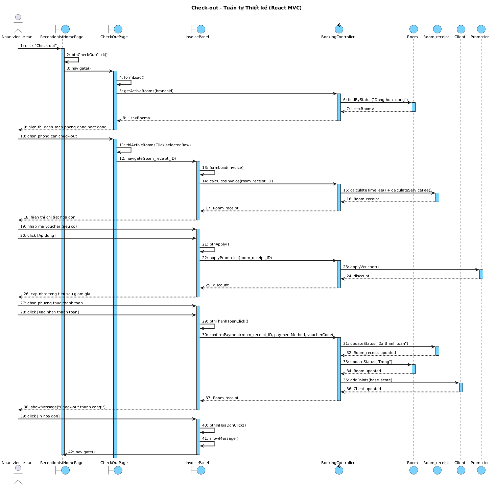
Chức năng Quản lý khách hàng toàn hệ thống
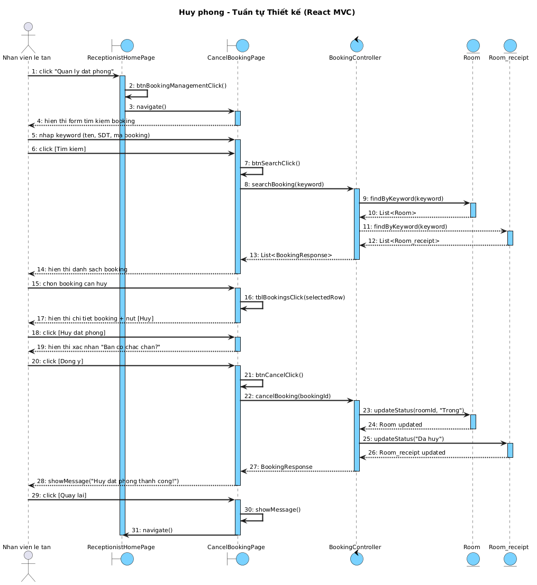

Chức năng Quản lý hạng hội viên
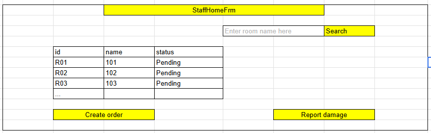

Chức năng Quản lý danh mục loại phòng
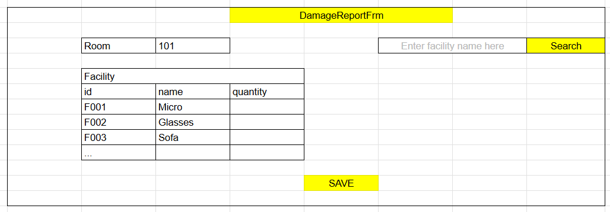

Chức năng Quản lý phòng hát chi nhánh
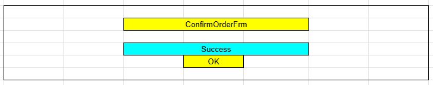

## 4.  Thiết kế động
### 4.1. Chức năng quản lý hệ thống chi nhánh	
1. Chủ doanh nghiệp nhấn "Quản lý hệ thống chi nhánh" trên giao diện AdminHomeView.  
2. Giao diện AdminHomeView gọi phương thức btnManageBranchClick().  
3. AdminHomeView gọi điều hướng (navigate) mở lớp BranchPage.  
4. Lớp BranchPage tự gọi hàm formLoad() của chính nó ngay khi vừa được tạo.  
5. BranchPage gọi sang lớp BranchController thông qua hàm list().  
6. BranchController tự gọi hàm validateRequest() để kiểm tra tính hợp lệ của yêu cầu.  
7. BranchController gọi thực thể Branch qua phương thức findByKeyword("") để truy vấn danh sách.  
8. Thực thể Branch trả kết quả danh sách chi nhánh về cho BranchController.  
9. BranchController trả về trực tiếp đối tượng thực thể Branch.  
10. BranchController trả danh sách (BranchResponse) về cho giao diện BranchPage.  
11. BranchPage tự gọi hàm nội bộ displayDSBranch(branches) để xử lý đổ dữ liệu.  
12. BranchPage hiển thị danh sách chi nhánh lên bảng cho Chủ doanh nghiệp.  
13. Chủ doanh nghiệp quan sát và nhấn nút "Thêm mới".  
14. BranchPage gọi hàm btnAddBranchClick().  
15. BranchPage gọi hàm openModal() để mở lớp BranchForm.  
16. Lớp BranchForm tự gọi hàm formLoad(null) để chuẩn bị form.  
17. BranchForm tự gọi hàm resetFields() để làm sạch các trường dữ liệu.  
18. BranchForm hiển thị form trống lên màn hình cho Chủ doanh nghiệp.  
19. Chủ doanh nghiệp nhập thông tin Tên chi nhánh.  
20. Chủ doanh nghiệp nhập thông tin Địa chỉ.  
21. Chủ doanh nghiệp nhập thông tin Số điện thoại.  
22. Chủ doanh nghiệp ấn nút Lưu.  
23. BranchForm gọi hàm btnSaveClick().  
24. BranchForm tự gọi hàm validateInput() để kiểm tra dữ liệu đầu vào phía client.  
25. BranchForm đóng gói dữ liệu và gửi sang lớp BranchController thông qua hàm create(branch).  
26. BranchController tự gọi hàm validateData() để kiểm tra logic phía server.  
27. BranchController gọi xuống thực thể Branch thực thi phương thức save() để thêm vào cơ sở dữ liệu.  
28. Thực thể Branch trả kết quả thêm thành công về cho BranchController.  
29. BranchController trả kết quả xử lý (success status) về cho BranchForm.  
30. BranchForm tự gọi hàm showMessage("Thêm thành công").  
31. Chủ doanh nghiệp nhấn OK trên thông báo.  
32. BranchForm đóng lại (close) và trả quyền điều khiển về BranchPage.  
33. BranchPage tự động gọi lại formLoad() để làm mới dữ liệu.  
34. BranchPage gọi lại hàm list() của Controller.  
35. Controller trả danh sách mới về cho BranchPage.  
36. BranchPage gọi lại displayDSBranch() để cập nhật giao diện.

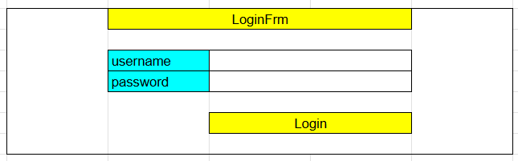

### 4.2. Chức năng Quản lý khách hàng toàn hệ thống
1\. Chủ doanh nghiệp nhấn nút "Quản lý khách hàng" trên giao diện AdminHomeView.  
2\. AdminHomeView gọi phương thức btnManageClientClick().  
3\. AdminHomeView gọi điều hướng (navigate) mở lớp ClientPage.  
4\. Lớp ClientPage tự gọi hàm formLoad().  
5\. ClientPage gọi hàm list("") của ClientController để lấy dữ liệu mặc định.  
6\. ClientController trả danh sách khách hàng ban đầu về.  
7\. ClientPage tự gọi hàm displayClients() để đổ dữ liệu lên bảng.  
8\. ClientPage hiển thị giao diện danh sách cho Chủ doanh nghiệp.  
9\. Chủ doanh nghiệp nhập từ khóa (Tên hoặc SĐT) vào ô tìm kiếm.  
10\. Chủ doanh nghiệp nhấn nút "Tìm kiếm".  
11\. ClientPage gọi sự kiện btnSearchClick().  
12\. ClientPage đẩy từ khóa sang hàm list(keyword) của ClientController.  
13\. ClientController tự gọi hàm validateKeyword() để kiểm tra dữ liệu đầu vào.  
14\. ClientController gọi thực thể Client (findByKeyword) để lọc dữ liệu.  
15\. Thực thể Client trả kết quả danh sách về cho ClientController.  
16\. ClientController trả SearchResponse về cho ClientPage.  
17\. ClientPage tự gọi hàm displayClients(Clients) để cập nhật bảng kết quả.  
18\. Giao diện hiển thị danh sách khách hàng vừa lọc cho Chủ doanh nghiệp.  
19\. Chủ doanh nghiệp click chọn đúng khách hàng tương ứng trên bảng.  
20\. ClientPage bắt sự kiện tblClientsClick(ClientId).  
21\. ClientPage gọi mở lớp ClientDetailPanel thông qua hàm openPanel(ClientId).  
22\. Lớp ClientDetailPanel tự gọi hàm formLoad(ClientId).  
23\. ClientDetailPanel gọi ClientController thông qua hàm get(ClientId).  
24\. ClientController gọi thực thể Client (findById).  
25\. Thực thể Client trả thông tin chi tiết về.  
26\. ClientController trả đối tượng Client về cho Panel.  
27\. ClientDetailPanel tự gọi displayClientInfo() để vẽ giao diện thông tin cá nhân.  
28\. ClientDetailPanel tiếp tục tự gọi displayBookingHistory() để vẽ lịch sử đặt phòng.  
29\. Màn hình chi tiết khách hàng hoàn chỉnh được hiển thị.  
30\. Chủ doanh nghiệp kiểm tra và nhấn nút "Khóa tài khoản".  
31\. ClientDetailPanel gọi hàm btnLockAccountClick().  
32\. ClientDetailPanel gửi yêu cầu khóa sang ClientController thông qua hàm lock(id).  
33\. ClientController gọi xuống thực thể Client thực thi lệnh updateStatus("Đã khóa").  
34\. Thực thể Client trả kết quả thành công (true) về.  
35\. ClientController trả kết quả về cho ClientDetailPanel.  
36\. ClientDetailPanel hiển thị thông báo "Khóa thành công".  
37\. Chủ doanh nghiệp nhấn nút OK để đóng thông báo.  
38\. ClientDetailPanel tự gọi lại formLoad(ClientId) để cập nhật giao diện chi tiết. 
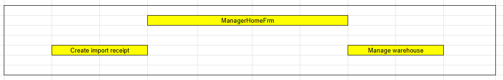
# 
# 
### 4.3. Chức năng Quản lý hạng hội viên
1. Chủ doanh nghiệp nhấn nút "Quản lý hạng hội viên" trên AdminHomeView.  
2. AdminHomeView gọi phương thức btnManageTierClick().  
3. AdminHomeView gọi navigate mở lớp MembershipTierPage.  
4. Lớp MembershipTierPage tự gọi hàm formLoad().  
5. MembershipTierPage gọi hàm listTiers() của MembershipController.  
6. MembershipController gọi thực thể MembershipTier (findAll).  
7. Thực thể MembershipTier trả danh sách về cho Controller.  
8. MembershipController trả TierResponse về cho MembershipTierPage.  
9. MembershipTierPage tự gọi displayTiers(tiers) để hiển thị lên bảng.  
10. Giao diện danh sách hạng hội viên được hiển thị.  
11. Chủ doanh nghiệp chọn một dòng hạng mục.  
12. Chủ doanh nghiệp ấn nút "Đổi hạng thủ công".  
13. MembershipTierPage gọi hiển thị lớp ManualUpgradeModal qua hàm openModal().  
14. Lớp ManualUpgradeModal tự gọi formLoad().  
15. Giao diện form đổi hạng hiển thị cho Chủ doanh nghiệp.  
16. Chủ doanh nghiệp nhập mã khách hàng (ClientId).  
17. Chủ doanh nghiệp nhấn nút "Kiểm tra".  
18. ManualUpgradeModal gọi ClientController qua hàm get(ClientId).  
19. ClientController gọi thực thể Client (findById).  
20. Thực thể Client trả thông tin khách về.  
21. ClientController trả ClientInfo hợp lệ về cho Modal.  
22. ManualUpgradeModal tự gọi displayClientInfo() để hiện tên và hạng cũ.  
23. Chủ doanh nghiệp chọn hạng mới từ ComboBox.  
24. Chủ doanh nghiệp ấn "Xác nhận".  
25. ManualUpgradeModal gọi hàm btnConfirmClick().  
26. ManualUpgradeModal tự gọi validateSelection() kiểm tra logic.  
27. ManualUpgradeModal gửi yêu cầu đổi hạng sang MembershipController thông qua hàm manualUpgrade(ClientId, tierId).  
28. MembershipController tự gọi validateLogic() để xác thực quy tắc nâng hạng.  
29. MembershipController gọi thực thể Client cập nhật FK (updateTierId).  
30. Thực thể Client trả kết quả cập nhật thành công.  
31. MembershipController trả kết quả xử lý (upgradeStatus) về cho Modal.  
32. ManualUpgradeModal gọi showMessage("Đổi hạng thành công").  
33. Chủ doanh nghiệp nhấn OK để đóng thông báo.  
34. ManualUpgradeModal tự gọi close() đóng popup và trở về Page.  
35. MembershipTierPage gọi lại formLoad() để làm mới cấu hình hiển thị nếu cần. 
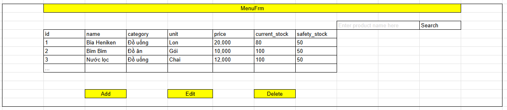

### 4.4. Chức năng Quản lý danh mục loại phòng
1. Chủ doanh nghiệp nhấn "Quản lý danh mục loại phòng" trên AdminHomeView.  
2. AdminHomeView gọi phương thức btnManageRoomTypeClick().  
3. AdminHomeView navigate mở lớp RoomTypePage.  
4. Lớp RoomTypePage tự gọi hàm formLoad().  
5. RoomTypePage gọi hàm list() của RoomTypeController.  
6. RoomTypeController gọi thực thể RoomType (findAll).  
7. Thực thể RoomType trả kết quả danh sách về.  
8. RoomTypeController trả kết quả về cho RoomTypePage.  
9. RoomTypePage tự gọi hàm displayRoomTypes(types) để xử lý giao diện.  
10. RoomTypePage hiển thị danh mục loại phòng lên bảng.  
11. Chủ doanh nghiệp ấn nút "Thêm danh mục mới".  
12. RoomTypePage gọi openModal() mở lớp RoomTypeForm.  
13. Lớp RoomTypeForm tự gọi hàm formLoad(null).  
14. Lớp RoomTypeForm tự gọi resetFields() xóa trắng dữ liệu.  
15. Màn hình form trống hiện lên cho Chủ doanh nghiệp.  
16. Chủ doanh nghiệp nhập Tên loại phòng.  
17. Chủ doanh nghiệp nhập Sức chứa.  
18. Chủ doanh nghiệp nhập Giá cơ sở.  
19. Chủ doanh nghiệp ấn Lưu.  
20. RoomTypeForm gọi hàm btnSaveClick().  
21. RoomTypeForm tự gọi validateInput() để kiểm tra kiểu dữ liệu đầu vào.  
22. RoomTypeForm gọi hàm create(roomType) của RoomTypeController.  
23. RoomTypeController gọi validateData() kiểm tra quy tắc nghiệp vụ.  
24. RoomTypeController gọi thực thể RoomType (save).  
25. Thực thể RoomType trả lại đối tượng vừa lưu thành công.  
26. RoomForm gửi dữ liệu thông qua hàm create(room) của RoomController.  
27. RoomTypeForm gọi showMessage("Thêm thành công").  
28. Chủ doanh nghiệp nhấn OK.  
29. RoomTypeForm gọi hàm close() để tự đóng cửa sổ.  
30. RoomTypePage gọi lại formLoad() để làm mới dữ liệu.  
31. RoomTypePage gọi lại list().  
32. Controller trả danh sách mới về cho Page.  
33. RoomTypePage gọi displayRoomTypes() để cập nhật bảng.

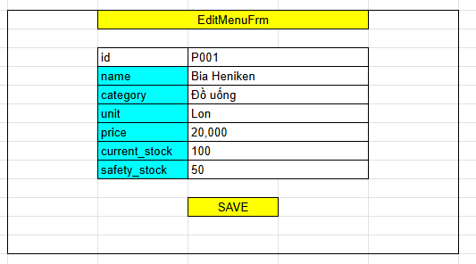

### 
	
### 4.5. Chức năng Quản lý phòng hát chi nhánh
1. Quản lý chi nhánh nhấn nút "Quản lý phòng hát" trên BranchManagerHomeView.  
2. BranchManagerHomeView gọi phương thức btnManageRoomClick().  
3. BranchManagerHomeView navigate gọi hiển thị lớp RoomPage.  
4. Lớp RoomPage tự gọi hàm formLoad().  
5. RoomPage gọi hàm list(branchId) của RoomController.  
6. RoomController gọi thực thể Room (findByBranch) lấy danh sách phòng thuộc chi nhánh.  
7. Thực thể Room trả kết quả danh sách về cho Controller.  
8. RoomController trả RoomResponse về cho RoomPage.  
9. RoomPage tự gọi displayRooms(rooms) hiển thị lên bảng.  
10. Giao diện phòng hát được hiển thị cho Quản lý chi nhánh.  
11. Quản lý chi nhánh ấn nút "Thêm phòng mới".  
12. RoomPage gọi openModal() để hiển thị lớp RoomForm.  
13. Lớp RoomForm tự gọi hàm formLoad(null).  
14. Bên trong formLoad, RoomForm lập tức gọi hàm getAllRoomTypes() của RoomTypeController.  
15. RoomTypeController gọi thực thể RoomType (findAll) để lấy tất cả các danh mục.  
16. Thực thể RoomType trả kết quả danh sách về.  
17. RoomTypeController trả danh sách cấu hình loại phòng về cho RoomForm.  
18. RoomForm tự gọi renderComboBox() để nạp dữ liệu loại phòng vào thẻ Dropdown (ComboBox).  
19. Form nhập liệu hoàn thiện được hiển thị cho người dùng.  
20. Quản lý chi nhánh nhập Tên phòng.  
21. Quản lý chi nhánh chọn Trạng thái phòng từ danh sách có sẵn.  
22. Quản lý chi nhánh chọn Loại phòng từ ComboBox.  
23. Quản lý chi nhánh nhấn nút Lưu.  
24. RoomForm gọi hàm btnSaveClick().  
25. RoomForm tự gọi hàm validateInput() kiểm tra dữ liệu client.  
26. RoomForm gửi dữ liệu thông qua hàm create(roomDTO) của RoomController.  
27. RoomController gọi validateData() kiểm tra xem tên phòng có bị trùng trong chi nhánh không.  
28. RoomController gọi thực thể Room lưu thông tin (save).  
29. Thực thể Room trả kết quả lưu thành công vào CSDL.  
30. RoomController trả kết quả saveStatus về cho RoomForm.  
31. RoomForm gọi showMessage("Thêm thành công").  
32. Quản lý chi nhánh nhấn OK.  
33. RoomForm tự gọi hàm close() để đóng popup.  
34. Lớp RoomPage gọi lại formLoad() và cập nhật lại bảng giao diện hiện tại.

# 
# IV. PHA CÀI ĐẶT VÀ KIỂM THỬ
## 1. Lập kế hoạch test
Phạm vi test: Module "Quản trị cốt lõi" - 5 chức năng: 
Quản lý chi nhánh (UC16)
Quản lý khách hàng toàn hệ thống (UC17) 
Quản lý hạng hội viên (UC18)
Quản lý danh mục loại phòng (UC19)
Quản lý phòng hát chi nhánh (UC20).
Loại test: Functional testing (kiểm thử chức năng) - kiểm tra từng chức năng theo kịch bản sử dụng thực tế (black-box testing).
Nguyên tắc test:
Mỗi test case bao gồm: CSDL trước test → Kịch bản thực hiện (từng bước) → Kết quả mong đợi → CSDL sau test.
CSDL mẫu dùng dữ liệu tiếng Việt, tên riêng Việt Nam.
Test case bao gồm cả trường hợp thành công và trường hợp thất bại.

## 2. Trạng thái CSDL mẫu trước khi test toàn bộ
Trước khi thực hiện các test case, CSDL cần được thiết lập ở trạng thái ban đầu như sau:

tblBranch:

| id | ten | diaChi | soDienThoai |
| --- | --- | --- | --- |
| 1 | Karaoke Star Hà Nội | 123 Nguyễn Huệ, Hà Nội | 024-3456789 |
| 2 | Karaoke Star HCM | 456 Lê Lợi, TP.HCM | 028-3987654 |
| 3 | Karaoke Star Đà Nẵng | 789 Bạch Đằng, Đà Nẵng | 0236-3789456 |

tblMembershipTier:

| id | tenHang | nguongDiem | giamGia | diemThuongNhan |
| --- | --- | --- | --- | --- |
| 1 | Thường | 0 | 0 | 1 |
| 2 | Bạc | 500 | 5 | 1.5 |
| 3 | Vàng | 2000 | 10 | 2 |

tblClient:

| id | hoTen | soDienThoai | trangThai | diemTichLuy | Tier_id |
| --- | --- | --- | --- | --- | --- |
| 1 | Nguyễn Văn An | 0901234567 | Hoạt động | 2500 | 3 |
| 2 | Trần Thị Bình | 0912345678 | Hoạt động | 300 | 2 |
| 3 | Lê Văn Cường | 0923456789 | Hoạt động | 100 | 1 |

tblRoomType:

| id | tenLoai | moTa | sucChua | giaChung | trangThai |
| --- | --- | --- | --- | --- | --- |
| 1 | Standard | Phòng phổ thông | 10 | 150000 | Hoạt động |
| 2 | VIP | Phòng cao cấp | 15 | 250000 | Hoạt động |
| 3 | Super VIP | Phòng hạng sang | 20 | 300000 | Hoạt động |

tblRoom:

| id | tenPhong | trangThai | Branch_id | RoomType_id |
| --- | --- | --- | --- | --- |
| 1 | VIP-01 | Trống | 1 | 3 |
| 2 | STD-01 | Đang phục vụ | 1 | 1 |
| 3 | VIP-02 | Trống | 2 | 2 |

## 3. Các test case cho từng chức năng
### 3.1.  Chức năng "Quản lý hệ thống chi nhánh" (UC16)
#### TC01: Thêm chi nhánh mới thành công (tên chưa tồn tại)
Bước thực hiện:

| Bước | Thao tác | Kết quả mong đợi |
| --- | --- | --- |
| 1 | Admin chọn chức năng "Quản lý hệ thống chi nhánh" trên giao diện chính | BranchPage hiển thị danh sách 3 chi nhánh hiện có |
| 2 | Admin nhấn nút [ + Thêm mới chi nhánh ] | BranchForm mở ra với form nhập liệu trống |
| 3 | Admin nhập: Tên = "Karaoke Star Cần Thơ", Địa chỉ = "12 Nguyễn Văn Cừ, Cần Thơ", SĐT = "0292-3654789" | Form hiển thị dữ liệu đã nhập |
| 4 | Admin nhấn [ Lưu ] | BranchForm kiểm tra hợp lệ → BranchController.save() → Branch.save() → CSDL lưu thành công |
| 5 | Thông báo "Thêm chi nhánh thành công" | BranchForm đóng, quay về BranchPage |
| 6 | BranchPage tải lại danh sách | Bảng hiển thị 4 chi nhánh, có thêm "Karaoke Star Cần Thơ" |

CSDL trước khi test:
tblBranch:

| id | ten | diaChi | soDienThoai |
| --- | --- | --- | --- |
| 1 | Karaoke Star Hà Nội | 123 Nguyễn Huệ, Hà Nội | 024-3456789 |
| 2 | Karaoke Star HCM | 456 Lê Lợi, TP.HCM | 028-3987654 |
| 3 | Karaoke Star Đà Nẵng | 789 Bạch Đằng, Đà Nẵng | 0236-3789456 |

CSDL sau khi test:
tblBranch:

| id | ten | diaChi | soDienThoai |
| --- | --- | --- | --- |
| 1 | Karaoke Star Hà Nội | 123 Nguyễn Huệ, Hà Nội | 024-3456789 |
| 2 | Karaoke Star HCM | 456 Lê Lợi, TP.HCM | 028-3987654 |
| 3 | Karaoke Star Đà Nẵng | 789 Bạch Đằng, Đà Nẵng | 0236-3789456 |
| 4 | Karaoke Star Cần Thơ | 12 Nguyễn Văn Cừ, Cần Thơ | 0292-3654789 |

#### TC02: Thêm chi nhánh mới thất bại (tên đã tồn tại)
Bước thực hiện:

| Bước | Thao tác | Kết quả mong đợi |
| --- | --- | --- |
| 1 | Admin chọn chức năng "Quản lý hệ thống chi nhánh" | BranchPage hiển thị danh sách chi nhánh |
| 2 | Admin nhấn [ + Thêm mới chi nhánh ] | BranchForm mở ra với form nhập liệu trống |
| 3 | Admin nhập: Tên = "Karaoke Star Hà Nội" (đã tồn tại), Địa chỉ = "100 Giải Phóng, Hà Nội", SĐT = "024-1111222" | Form hiển thị dữ liệu đã nhập |
| 4 | Admin nhấn [ Lưu ] | BranchForm kiểm tra hợp lệ → phát hiện tên trùng |
| 5 | Thông báo lỗi "Tên chi nhánh đã tồn tại" | Form vẫn mở, Admin nhập lại tên |

CSDL trước khi test:
tblBranch:

| id | ten | diaChi | soDienThoai |
| --- | --- | --- | --- |
| 1 | Karaoke Star Hà Nội | 123 Nguyễn Huệ, Hà Nội | 024-3456789 |
| 2 | Karaoke Star HCM | 456 Lê Lợi, TP.HCM | 028-3987654 |

CSDL sau khi test:
Không thay đổi.

#### TC03: Sửa thông tin chi nhánh thành công
Bước thực hiện:

| Bước | Thao tác | Kết quả mong đợi |
| --- | --- | --- |
| 1 | Admin chọn chức năng "Quản lý hệ thống chi nhánh" | BranchPage hiển thị danh sách chi nhánh |
| 2 | Admin nhấn nút Sửa trên dòng CN02 (Karaoke Star HCM) | BranchForm mở ra với dữ liệu đã điền sẵn: Tên = "Karaoke Star HCM", Địa chỉ = "456 Lê Lợi, TP.HCM", SĐT = "028-3987654" |
| 3 | Admin thay đổi Địa chỉ = "789 Nguyễn Huệ, TP.HCM" | Form hiển thị địa chỉ mới |
| 4 | Admin nhấn [ Lưu ] | BranchForm kiểm tra hợp lệ → BranchController.update() → Branch.update() → CSDL cập nhật |
| 5 | Thông báo "Cập nhật thành công" | BranchForm đóng, quay về BranchPage |
| 6 | BranchPage tải lại danh sách | Bảng hiển thị CN02 có địa chỉ mới "789 Nguyễn Huệ, TP.HCM" |

CSDL trước khi test: 
tblBranch:

| id | ten | diaChi | soDienThoai |
| --- | --- | --- | --- |
| 1 | Karaoke Star Hà Nội | 123 Nguyễn Huệ, Hà Nội | 024-3456789 |
| 2 | Karaoke Star HCM | 456 Lê Lợi, TP.HCM | 028-3987654 |

CSDL sau khi test: 
tblBranch:

| id | ten | diaChi | soDienThoai |
| --- | --- | --- | --- |
| 1 | Karaoke Star Hà Nội | 123 Nguyễn Huệ, Hà Nội | 024-3456789 |
| 2 | Karaoke Star HCM | 789 Nguyễn Huệ, TP.HCM | 028-3987654 |

#### TC04: Xóa chi nhánh không có phòng hoạt động → thành công
Bước thực hiện:

| Bước | Thao tác | kết quả mong đợi |
| --- | --- | --- |
| 1 | Admin chọn chức năng "Quản lý hệ thống chi nhánh" | BranchPage hiển thị danh sách chi nhánh |
| 2 | Admin nhấn nút Xóa trên dòng CN03 (Karaoke Star Đà Nẵng — không có phòng nào) | Hệ thống kiểm tra ràng buộc: chi nhánh không có phòng |
| 3 | Hiển thị popup xác nhận: "Bạn có chắc muốn xóa Karaoke Star Đà Nẵng?" | Popup hiển thị với nút [ Xác nhận ] và [ Hủy ] |
| 4 | Admin nhấn [ Xác nhận ] | BranchController.delete(3) → Branch.delete() → CSDL xóa thành công |
| 5 | Thông báo "Xóa chi nhánh thành công" | BranchPage tải lại danh sách |
| 6 | BranchPage hiển thị danh sách mới | Bảng chỉ còn 2 chi nhánh (HN, HCM) |

CSDL trước khi test:
 tblBranch:

| id | ten | diaChi | soDienThoai |
| --- | --- | --- | --- |
| 1 | Karaoke Star Hà Nội | 123 Nguyễn Huệ, Hà Nội | 024-3456789 |
| 2 | Karaoke Star HCM | 456 Lê Lợi, TP.HCM | 028-3987654 |
| 3 | Karaoke Star Đà Nẵng | 789 Bạch Đằng, Đà Nẵng | 0236-3789456 |

tblRoom: (không có phòng thuộc chi nhánh 3)

| id | tenPhong | trangThai | tblBranch_id | tblRoomType_id |
| --- | --- | --- | --- | --- |
| 1 | VIP-01 | Trống | 1 | 3 |
| 2 | STD-01 | Đang phục vụ | 1 | 1 |

CSDL sau khi test: 
tblBranch:

| id | ten | diaChi | soDienThoai |
| --- | --- | --- | --- |
| 1 | Karaoke Star Hà Nội | 123 Nguyễn Huệ, Hà Nội | 024-3456789 |
| 2 | Karaoke Star HCM | 456 Lê Lợi, TP.HCM | 028-3987654 |

tblRoom: không thay đổi.

#### TC05: Xóa chi nhánh có phòng đang hoạt động → thất bại
Bước thực hiện:

| Bước | Thao tác | Kết quả mong đợi |
| --- | --- | --- |
| 1 | Admin chọn chức năng "Quản lý hệ thống chi nhánh" | BranchPage hiển thị danh sách chi nhánh |
| 2 | Admin nhấn nút Xóa trên dòng CN01 (Karaoke Star Hà Nội — có phòng VIP-01, STD-01) | Hệ thống kiểm tra ràng buộc: chi nhánh có phòng đang hoạt động |
| 3 | Thông báo lỗi "Không thể xóa chi nhánh đang có phòng hoạt động" | Dữ liệu không đổi, danh sách giữ nguyên |

CSDL trước khi test: 
tblBranch:

| id | ten | diaChi | soDienThoai |
| --- | --- | --- | --- |
| 1 | Karaoke Star Hà Nội | 123 Nguyễn Huệ, Hà Nội | 024-3456789 |

tblRoom:

| id | tenPhong | trangThai | tblBranch_id |
| --- | --- | --- | --- |
| 1 | VIP-01 | Trống | 1 |
| 2 | STD-01 | Đang phục vụ | 1 |

CSDL sau khi test: Không thay đổi.

### 3.2.  Chức năng "Quản lý khách hàng toàn hệ thống" (UC17)
#### TC06: Tìm kiếm khách hàng theo tên → tìm thấy kết quả
Bước thực hiện:

| Bước | Thao tác | Kết quả mong đợi |
| --- | --- | --- |
| 1 | Admin chọn chức năng "Quản lý khách hàng toàn hệ thống" | ClientPage hiển thị giao diện tìm kiếm với ô nhập từ khóa, dropdown tiêu chí, nút [ Tìm ] |
| 2 | Admin nhập từ khóa "Nguyễn Văn An", chọn tiêu chí "Tên" | Form hiển thị dữ liệu đã nhập |
| 3 | Admin nhấn [ Tìm ] | ClientController.search("Nguyễn Văn An", "Tên") → Client.searchClient() |
| 4 | Hệ thống hiển thị danh sách kết quả | Bảng hiển thị 1 khách hàng: KH001 - Nguyễn Văn An, SĐT 0901234567, Hạng Vàng, Trạng thái Hoạt động, Thao tác: Xem · Khóa TK |

CSDL trước khi test: 
tblClient:

| id | hoTen | soDienThoai | email | trangThai | diemTichLuy | tblMembershipTier_id |
| --- | --- | --- | --- | --- | --- | --- |
| 1 | Nguyễn Văn An | 0901234567 | an@gmail.com | Hoạt động | 2500 | 3 |
| 2 | Trần Thị Bình | 0912345678 | binh@gmail.com | Hoạt động | 300 | 2 |
| 3 | Lê Văn Cường | 0923456789 | cuong@gmail.com | Hoạt động | 100 | 1 |

CSDL sau khi test: Không thay đổi (chỉ truy vấn, không ghi).

#### TC07: Tìm kiếm khách hàng → không tìm thấy
Bước thực hiện:

| Bước | Thao tác | Kết quả mong đợi |
| --- | --- | --- |
| 1 | Admin chọn chức năng "Quản lý khách hàng toàn hệ thống" | ClientPage hiển thị giao diện tìm kiếm |
| 2 | Admin nhập từ khóa "Phạm Thị Dünya", chọn tiêu chí "Tên" | Form hiển thị dữ liệu đã nhập |
| 3 | Admin nhấn [ Tìm ] | ClientController.search("Phạm Thị Dünya", "Tên") → trả về danh sách rỗng |
| 4 | Thông báo "Không tìm thấy khách hàng nào" | ClientPage giữ nguyên giao diện tìm kiếm |

CSDL trước khi test: 
tblClient: 

| id | hoTen | soDienThoai | email | trangThai | diemTichLuy | tblMembershipTier_id |
| --- | --- | --- | --- | --- | --- | --- |
| 1 | Nguyễn Văn An | 0901234567 | an@gmail.com | Hoạt động | 2500 | 3 |
| 2 | Trần Thị Bình | 0912345678 | binh@gmail.com | Hoạt động | 300 | 2 |
| 3 | Lê Văn Cường | 0923456789 | cuong@gmail.com | Hoạt động | 100 | 1 |

CSDL sau khi test: Không thay đổi.
#### TC08: Xem lịch sử sử dụng của khách hàng
Bước thực hiện:

| Bước | Thao tác | Kết quả mong đợi |
| --- | --- | --- |
| 1 | Admin tìm khách hàng "Nguyễn Văn An" và nhấn Xem | ClientDetailPanel hiển thị thông tin chi tiết |
| 2 | Hệ thống hiển thị thông tin cá nhân | Mã KH: KH001, Họ tên: Nguyễn Văn An, SĐT: 0901234567, Email: an@gmail.com, Hạng: Vàng, Điểm: 2500, Trạng thái: Hoạt động |
| 3 | Hệ thống hiển thị lịch sử sử dụng | Bảng lịch sử: BK1023 - Hà Nội - VIP-01 - 10/05 - 19:00-22:00 - 1.500.000đ; BK1056 - Hà Nội - STD-03 - 18/05 - 20:00-23:00 - 900.000đ |
| 4 | Admin nhấn [ Đóng ] | Quay về ClientPage hiển thị danh sách |

CSDL trước khi test: 
tblClient: 

| id | hoTen | soDienThoai | email | trangThai | diemTichLuy | tblMembershipTier_id |
| --- | --- | --- | --- | --- | --- | --- |
| 1 | Nguyễn Văn An | 0901234567 | an@gmail.com | Hoạt động | 2500 | 3 |
| 2 | Trần Thị Bình | 0912345678 | binh@gmail.com | Hoạt động | 300 | 2 |
| 3 | Lê Văn Cường | 0923456789 | cuong@gmail.com | Hoạt động | 100 | 1 |

CSDL sau khi test: Không thay đổi (chỉ truy vấn).

#### TC09: Khóa tài khoản khách hàng thành công
Bước thực hiện:

| Bước | Thao tác | Kết quả mong đợi |
| --- | --- | --- |
| 1 | Admin tìm khách hàng "Nguyễn Văn An" và nhấn Xem | ClientDetailPanel hiển thị thông tin chi tiết |
| 2 | Admin nhấn nút [ Khóa tài khoản ] | Hiển thị popup xác nhận: "Bạn có chắc muốn khóa tài khoản Nguyễn Văn An (KH001)?" |
| 3 | Admin nhấn [ Xác nhận ] | ClientController.lockAccount(1) → Client.lockAccount() → CSDL cập nhật trangThai = "Đã khóa" |
| 4 | Thông báo "Khóa tài khoản thành công" | ClientDetailPanel cập nhật Trạng thái = "Đã khóa", nút chuyển thành [ Mở khóa ] |

CSDL trước khi test:
tblClient:

| id | hoTen | soDienThoai | email | trangThai | diemTichLuy | tblMembershipTier_id |
| --- | --- | --- | --- | --- | --- | --- |
| 1 | Nguyễn Văn An | 0901234567 | an@gmail.com | Hoạt động | 2500 | 3 |

CSDL sau khi test: 
tblClient:

| id | hoTen | soDienThoai | email | trangThai | diemTichLuy | tblMembershipTier_id |
| --- | --- | --- | --- | --- | --- | --- |
| 1 | Nguyễn Văn An | 0901234567 | an@gmail.com | Đã khóa | 2500 | 3 |

### 3.3 Chức năng "Quản lý hạng hội viên" (UC18)
#### TC10: Xem cấu hình hạng hội viên
Bước thực hiện:

| Bước | Thao tác | Kết quả mong đợi |
| --- | --- | --- |
| 1 | Admin chọn chức năng "Quản lý hạng hội viên" | MembershipTierPage hiển thị danh sách hạng |
| 2 | Hệ thống tải danh sách hạng từ CSDL | Bảng hiển thị 3 hạng: HH01-Thường(0đ,0%,x1), HH02-Bạc(500đ,5%,x1.5), HH03-Vàng(2000đ,10%,x2) |
| 3 | Mỗi dòng có nút Sửa, nút [ Thay đổi hạng thủ công ] ở phía trên | Giao diện đầy đủ |

CSDL trước khi test: tblMembershipTier:

| id | tenHang | nguongDiem | giamGia | diemThuongNhan |
| --- | --- | --- | --- | --- |
| 1 | Thường | 0 | 0 | 1 |
| 2 | Bạc | 500 | 5 | 1.5 |
| 3 | Vàng | 2000 | 10 | 2 |

CSDL sau khi test: Không thay đổi (chỉ truy vấn).

#### TC11: Sửa ngưỡng điểm hạng Bạc thành công
Bước thực hiện:

| Bước | Thao tác | Kết quả mong đợi |
| --- | --- | --- |
| 1 | Admin chọn chức năng "Quản lý hạng hội viên" | MembershipTierPage hiển thị danh sách hạng |
| 2 | Admin nhấn Sửa trên dòng HH02 (Bạc) | MembershipTierForm mở ra với dữ liệu: Tên = "Bạc", Ngưỡng = 500, Giảm giá = 5%, Điểm thưởng = x1.5 |
| 3 | Admin thay đổi: Ngưỡng điểm = 600, Giảm giá = 7% | Form hiển thị giá trị mới |
| 4 | Admin nhấn [ Lưu ] | MembershipTierForm kiểm tra hợp lệ → MembershipController.update() → MembershipTier.update() → CSDL cập nhật |
| 5 | Thông báo "Cập nhật thành công" | MembershipTierForm đóng, quay về MembershipTierPage |
| 6 | MembershipTierPage tải lại danh sách | Bảng hiển thị HH02-Bạc có ngưỡng = 600, giảm giá = 7% |

CSDL trước khi test: tblMembershipTier:

| id | tenHang | nguongDiem | giamGia | diemThuongNhan |
| --- | --- | --- | --- | --- |
| 1 | Thường | 0 | 0 | 1 |
| 2 | Bạc | 500 | 5 | 1.5 |
| 3 | Vàng | 2000 | 10 | 2 |

CSDL sau khi test: tblMembershipTier:

| id | tenHang | nguongDiem | giamGia | diemThuongNhan |
| --- | --- | --- | --- | --- |
| 1 | Thường | 0 | 0 | 1 |
| 2 | Bạc | 600 | 7 | 1.5 |
| 3 | Vàng | 2000 | 10 | 2 |

#### TC12: Thay đổi hạng thủ công cho khách hàng (extend – tùy chọn) thành công

Bước thực hiện:

| Bước | Thao tác | Kết quả mong đợi |
| --- | --- | --- |
| 1 | Admin chọn chức năng "Quản lý hạng hội viên" | MembershipTierPage hiển thị danh sách hạng |
| 2 | Admin nhấn [ Thay đổi hạng thủ công ] | ManualUpgradeModal mở ra với form tìm kiếm |
| 3 | Admin nhập mã KH001 nhấn [ Tìm ] | ManualUpgradeModal hiển thị: Tên = Nguyễn Văn An, Hạng hiện tại = Vàng, Điểm = 2500 |
| 4 | Admin chọn hạng mới = "Bạc" từ dropdown | Dropdown hiển thị hạng đã chọn |
| 5 | Admin nhấn [ Xác nhận ] | MembershipController.manualUpgrade(1, 2) → Client.updateMembershipTier() → CSDL cập nhật |
| 6 | Thông báo "Thay đổi hạng thành công" | ManualUpgradeModal đóng, quay về MembershipTierPage |

CSDL trước khi test: tblClient:

| id | hoTen | soDienThoai | trangThai | diemTichLuy | tblMembershipTier_id |
| --- | --- | --- | --- | --- | --- |
| 1 | Nguyễn Văn An | 0901234567 | Hoạt động | 2500 | 3 (Vàng) |

CSDL sau khi test: tblClient:

| id | hoTen | soDienThoai | trangThai | diemTichLuy | tblMembershipTier_id |
| --- | --- | --- | --- | --- | --- |
| 1 | Nguyễn Văn An | 0901234567 | Hoạt động | 2500 | 2 (Bạc) |

### 3.4. Chức năng "Quản lý danh mục loại phòng" (UC19)
#### TC13: Thêm loại phòng mới thành công
Bước thực hiện:

| Bước | Thao tác | Kết quả mong đợi |
| --- | --- | --- |
| 1 | Admin chọn chức năng "Quản lý danh mục loại phòng" | RoomTypePage hiển thị danh sách 3 loại phòng |
| 2 | Admin nhấn [ + Thêm loại phòng mới ] | RoomTypeForm mở ra với form nhập liệu trống |
| 3 | Admin nhập: Tên = "Party", Sức chứa = 30, Giá = 500000 | Form hiển thị dữ liệu đã nhập |
| 4 | Admin nhấn [ Lưu ] | RoomTypeForm kiểm tra hợp lệ → RoomTypeController.save() → RoomType.save() → CSDL lưu thành công |
| 5 | Thông báo "Thêm loại phòng thành công" | RoomTypeForm đóng, quay về RoomTypePage |
| 6 | RoomTypePage tải lại danh mục | Bảng hiển thị 4 loại phòng, có thêm "Party" |

CSDL trước khi test: tblRoomType:

| id | tenLoai | moTa | sucChuaChuan | giaChung | trangThai |
| --- | --- | --- | --- | --- | --- |
| 1 | Standard | Phòng phổ thông | 10 | 150000 | Hoạt động |
| 2 | VIP | Phòng cao cấp | 15 | 250000 | Hoạt động |
| 3 | Super VIP | Phòng hạng sang | 20 | 300000 | Hoạt động |

CSDL sau khi test: tblRoomType:

| id | tenLoai | moTa | sucChuaChuan | giaChung | trangThai |
| --- | --- | --- | --- | --- | --- |
| 1 | Standard | Phòng phổ thông | 10 | 150000 | Hoạt động |
| 2 | VIP | Phòng cao cấp | 15 | 250000 | Hoạt động |
| 3 | Super VIP | Phòng hạng sang | 20 | 300000 | Hoạt động |
| 4 | Party | Phòng tiệc | 30 | 500000 | Hoạt động |

#### TC14: Thêm loại phòng mới thất bại (tên trùng)
Bước thực hiện:

| Bước | Thao tác | Kết quả mong đợi |
| --- | --- | --- |
| 1 | Admin chọn chức năng "Quản lý danh mục loại phòng" | RoomTypePage hiển thị danh sách |
| 2 | Admin nhấn [ + Thêm loại phòng mới ] | RoomTypeForm mở ra |
| 3 | Admin nhập: Tên = "VIP" (đã tồn tại), Sức chứa = 25, Giá = 350000 | Form hiển thị dữ liệu đã nhập |
| 4 | Admin nhấn [ Lưu ] | RoomTypeForm kiểm tra → phát hiện tên trùng |
| 5 | Thông báo lỗi "Tên loại phòng đã tồn tại" | Form vẫn mở, Admin nhập lại tên |

CSDL trước khi test: tblRoomType: (giống TC13)

CSDL sau khi test: Không thay đổi.

#### TC15: Sửa thông tin loại phòng thành công
Bước thực hiện:

| Bước | Thao tác | Kết quả mong đợi |
| --- | --- | --- |
| 1 | Admin chọn chức năng "Quản lý danh mục loại phòng" | RoomTypePage hiển thị danh sách |
| 2 | Admin nhấn Sửa trên dòng LP02 (VIP) | RoomTypeForm mở ra với dữ liệu: Tên = "VIP", Sức chứa = 15, Giá = 250000 |
| 3 | Admin thay đổi Giá = 280000 | Form hiển thị giá mới |
| 4 | Admin nhấn [ Lưu ] | RoomTypeForm kiểm tra hợp lệ → RoomTypeController.update() → RoomType.update() → CSDL cập nhật |
| 5 | Thông báo "Cập nhật thành công" | RoomTypeForm đóng, quay về RoomTypePage |
| 6 | RoomTypePage tải lại danh mục | Bảng hiển thị LP02-VIP có giá = 280000 |

CSDL trước khi test: tblRoomType:

| id | tenLoai | moTa | sucChuaChuan | giaChung | trangThai |
| --- | --- | --- | --- | --- | --- |
| 1 | Standard | Phòng phổ thông | 10 | 150000 | Hoạt động |
| 2 | VIP | Phòng cao cấp | 15 | 250000 | Hoạt động |

CSDL sau khi test: tblRoomType:

| id | tenLoai | moTa | sucChuaChuan | giaChung | trangThai |
| --- | --- | --- | --- | --- | --- |
| 1 | Standard | Phòng phổ thông | 10 | 150000 | Hoạt động |
| 2 | VIP | Phòng cao cấp | 15 | 280000 | Hoạt động |

#### TC16: Xóa loại phòng không có phòng vật lý sử dụng → thành công
Bước thực hiện:

| Bước | Thao tác | Kết quả mong đợi |
| --- | --- | --- |
| 1 | Admin chọn chức năng "Quản lý danh mục loại phòng" | RoomTypePage hiển thị danh sách |
| 2 | Admin nhấn Xóa trên dòng LP03 (Super VIP — không có phòng vật lý sử dụng) | Hệ thống kiểm tra ràng buộc: không có phòng nào đang dùng loại này |
| 3 | Hiển thị popup xác nhận: "Bạn có chắc muốn xóa loại phòng Super VIP?" | Popup hiển thị |
| 4 | Admin nhấn [ Xác nhận ] | RoomTypeController.delete(3) → RoomType.delete() → CSDL xóa thành công |
| 5 | Thông báo "Xóa loại phòng thành công" | RoomTypePage tải lại danh mục |
| 6 | RoomTypePage hiển thị danh sách mới | Bảng chỉ còn 2 loại (Standard, VIP) |

CSDL trước khi test: tblRoomType:

| id | tenLoai | moTa | sucChuaChuan | giaChung | trangThai |
| --- | --- | --- | --- | --- | --- |
| 1 | Standard | Phòng phổ thông | 10 | 150000 | Hoạt động |
| 2 | VIP | Phòng cao cấp | 15 | 250000 | Hoạt động |
| 3 | Super VIP | Phòng hạng sang | 20 | 300000 | Hoạt động |

tblRoom: (không có phòng nào dùng loại Super VIP)

| id | tenPhong | trangThai | tblBranch_id | tblRoomType_id |
| --- | --- | --- | --- | --- |
| 1 | VIP-01 | Trống | 1 | 2 |
| 2 | STD-01 | Đang phục vụ | 1 | 1 |

CSDL sau khi test: tblRoomType:

| id | tenLoai | moTa | sucChuaChuan | giaChung | trangThai |
| --- | --- | --- | --- | --- | --- |
| 1 | Standard | Phòng phổ thông | 10 | 150000 | Hoạt động |
| 2 | VIP | Phòng cao cấp | 15 | 250000 | Hoạt động |

tblRoom: không thay đổi.

#### TC17: Xóa loại phòng đang được sử dụng → thất bại
Bước thực hiện:

| Bước | Thao tác | Kết quả mong đợi |
| --- | --- | --- |
| 1 | Admin chọn chức năng "Quản lý danh mục loại phòng" | RoomTypePage hiển thị danh sách |
| 2 | Admin nhấn Xóa trên dòng LP01 (Standard — có phòng STD-01 đang sử dụng) | Hệ thống kiểm tra ràng buộc: có phòng đang sử dụng loại này |
| 3 | Thông báo lỗi "Không thể xóa do loại phòng đang được sử dụng tại các chi nhánh" | Dữ liệu không đổi |

CSDL trước khi test: tblRoomType:

| id | tenLoai | moTa | sucChuaChuan | giaChung | trangThai |
| --- | --- | --- | --- | --- | --- |
| 1 | Standard | Phòng phổ thông | 10 | 150000 | Hoạt động |

tblRoom:

| id | tenPhong | trangThai | tblBranch_id | tblRoomType_id |
| --- | --- | --- | --- | --- |
| 2 | STD-01 | Đang phục vụ | 1 | 1 |

CSDL sau khi test: Không thay đổi.

### 3.5 Chức năng "Quản lý phòng hát chi nhánh" (UC20)
#### TC18: Thêm phòng mới tại chi nhánh thành công
Bước thực hiện:

| Bước | Thao tác | Kết quả mong đợi |
| --- | --- | --- |
| 1 | Quản lý chi nhánh chọn chức năng "Quản lý phòng hát" | RoomPage hiển thị danh sách phòng thuộc chi nhánh |
| 2 | Quản lý nhấn [ + Thêm phòng mới ] | RoomForm mở ra với form nhập liệu trống |
| 3 | Quản lý nhập: Tên = "VIP-02", chọn Loại = "VIP" (tự động áp dụng sức chứa và giá theo chuẩn Admin) | Form hiển thị dữ liệu đã nhập |
| 4 | Quản lý nhấn [ Lưu ] | RoomForm kiểm tra hợp lệ (tên không trùng trong chi nhánh) → RoomController.save() → Room.save() → CSDL lưu thành công |
| 5 | Thông báo "Thêm phòng thành công" | RoomForm đóng, quay về RoomPage |
| 6 | RoomPage tải lại danh sách | Bảng hiển thị phòng mới "VIP-02" với loại VIP, trạng thái Trống |

CSDL trước khi test: tblRoom:

| id | tenPhong | trangThai | tblBranch_id | tblRoomType_id |
| --- | --- | --- | --- | --- |
| 1 | VIP-01 | Trống | 1 | 3 |
| 2 | STD-01 | Đang phục vụ | 1 | 1 |

CSDL sau khi test: tblRoom:

| id | tenPhong | trangThai | tblBranch_id | tblRoomType_id |
| --- | --- | --- | --- | --- |
| 1 | VIP-01 | Trống | 1 | 3 |
| 2 | STD-01 | Đang phục vụ | 1 | 1 |
| 3 | VIP-02 | Trống | 1 | 2 |

#### TC19: Thêm phòng mới thất bại (tên trùng trong chi nhánh)
Bước thực hiện:

| Bước | Thao tác | Kết quả mong đợi |
| --- | --- | --- |
| 1 | Quản lý chọn chức năng "Quản lý phòng hát" | RoomPage hiển thị danh sách |
| 2 | Quản lý nhấn [ + Thêm phòng mới ] | RoomForm mở ra |
| 3 | Quản lý nhập: Tên = "VIP-01" (đã tồn tại trong chi nhánh), chọn Loại = "VIP" | Form hiển thị dữ liệu đã nhập |
| 4 | Quản lý nhấn [ Lưu ] | RoomForm kiểm tra → phát hiện tên trùng trong cùng chi nhánh |
| 5 | Thông báo lỗi "Tên phòng đã tồn tại" | Form vẫn mở, quản lý nhập lại tên |

CSDL trước khi test: tblRoom:

| id | tenPhong | trangThai | tblBranch_id | tblRoomType_id |
| --- | --- | --- | --- | --- |
| 1 | VIP-01 | Trống | 1 | 3 |

CSDL sau khi test: Không thay đổi.

#### TC20: Sửa trạng thái phòng thành công
Bước thực hiện:

| Bước | Thao tác | Kết quả mong đợi |
| --- | --- | --- |
| 1 | Quản lý chọn chức năng "Quản lý phòng hát" | RoomPage hiển thị danh sách |
| 2 | Quản lý nhấn Sửa trên dòng P001 (VIP-01) | RoomForm mở ra với dữ liệu: Tên = "VIP-01", Loại = "Super VIP", Trạng thái = "Trống" |
| 3 | Quản lý đổi Trạng thái = "Bảo trì" | Form hiển thị trạng thái mới |
| 4 | Quản lý nhấn [ Lưu ] | RoomForm kiểm tra hợp lệ → RoomController.update() → Room.update() → CSDL cập nhật |
| 5 | Thông báo "Cập nhật thành công" | RoomForm đóng, quay về RoomPage |
| 6 | RoomPage tải lại danh sách | Bảng hiển thị P001-VIP-01 có trạng thái = "Bảo trì" |

CSDL trước khi test: tblRoom:

| id | tenPhong | trangThai | tblBranch_id | tblRoomType_id |
| --- | --- | --- | --- | --- |
| 1 | VIP-01 | Trống | 1 | 3 |

CSDL sau khi test: tblRoom:

| id | tenPhong | trangThai | tblBranch_id | tblRoomType_id |
| --- | --- | --- | --- | --- |
| 1 | VIP-01 | Bảo trì | 1 | 3 |

#### TC21: Xóa phòng không có đặt phòng hoạt động → thành công
Bước thực hiện:

| Bước | Thao tác | Kết quả mong đợi |
| --- | --- | --- |
| 1 | Quản lý chọn chức năng "Quản lý phòng hát" | RoomPage hiển thị danh sách |
| 2 | Quản lý nhấn Xóa trên dòng P001 (VIP-01 — Trống, không có booking) | Hệ thống kiểm tra ràng buộc: phòng không có booking đang hoạt động |
| 3 | Hiển thị popup xác nhận: "Xóa phòng VIP-01?" | Popup hiển thị |
| 4 | Quản lý nhấn [ Xác nhận ] | RoomController.delete(1) → Room.delete() → CSDL xóa thành công |
| 5 | Thông báo "Xóa phòng thành công" | RoomPage tải lại danh sách |
| 6 | RoomPage hiển thị danh sách mới | Bảng chỉ còn STD-01 |

CSDL trước khi test: tblRoom:

| id | tenPhong | trangThai | tblBranch_id | tblRoomType_id |
| --- | --- | --- | --- | --- |
| 1 | VIP-01 | Trống | 1 | 3 |
| 2 | STD-01 | Đang phục vụ | 1 | 1 |

CSDL sau khi test: tblRoom:

| id | tenPhong | trangThai | tblBranch_id | tblRoomType_id |
| --- | --- | --- | --- | --- |
| 2 | STD-01 | Đang phục vụ | 1 | 1 |

#### TC22: Xóa phòng có đặt phòng đang hoạt động → thất bại
Bước thực hiện:

| Bước | Thao tác | Kết quả mong đợi |
| --- | --- | --- |
| 1 | Quản lý chọn chức năng "Quản lý phòng hát" | RoomPage hiển thị danh sách |
| 2 | Quản lý nhấn Xóa trên dòng P002 (STD-01 — Đang phục vụ, có booking đang hoạt động) | Hệ thống kiểm tra ràng buộc: phòng có booking đang hoạt động |
| 3 | Thông báo lỗi "Không thể xóa phòng đang có khách" | Dữ liệu không đổi |

CSDL trước khi test: tblRoom:

| id | tenPhong | trangThai | tblBranch_id | tblRoomType_id |
| --- | --- | --- | --- | --- |
| 2 | STD-01 | Đang phục vụ | 1 | 1 |

CSDL sau khi test: Không thay đổi.

## 4. Tóm tắt kết quả test

| STT | Test Case | Chức năng | Kết quả |
| --- | --- | --- | --- |
| 1 | TC01: Thêm chi nhánh mới thành công | UC16 | Đạt |
| 2 | TC02: Thêm chi nhánh mới thất bại (tên trùng) | UC16 | Đạt |
| 3 | TC03: Sửa thông tin chi nhánh thành công | UC16 | Đạt |
| 4 | TC04: Xóa chi nhánh không có phòng → thành công | UC16 | Đạt |
| 5 | TC05: Xóa chi nhánh có phòng → thất bại | UC16 | Đạt |
| 6 | TC06: Tìm kiếm KH theo tên → tìm thấy | UC17 | Đạt |
| 7 | TC07: Tìm kiếm KH → không tìm thấy | UC17 | Đạt |
| 8 | TC08: Xem lịch sử sử dụng KH | UC17 | Đạt |
| 9 | TC09: Khóa tài khoản KH thành công | UC17 | Đạt |
| 10 | TC10: Xem cấu hình hạng hội viên | UC18 | Đạt |
| 11 | TC11: Sửa ngưỡng điểm hạng Bạc thành công | UC18 | Đạt |
| 12 | TC12: Thay đổi hạng thủ công cho KH thành công | UC18 | Đạt |
| 13 | TC13: Thêm loại phòng mới thành công | UC19 | Đạt |
| 14 | TC14: Thêm loại phòng mới thất bại (tên trùng) | UC19 | Đạt |
| 15 | TC15: Sửa thông tin loại phòng thành công | UC19 | Đạt |
| 16 | TC16: Xóa loại phòng không có phòng vật lý → thành công | UC19 | Đạt |
| 17 | TC17: Xóa loại phòng đang sử dụng → thất bại | UC19 | Đạt |
| 18 | TC18: Thêm phòng mới tại chi nhánh thành công | UC20 | Đạt |
| 19 | TC19: Thêm phòng mới thất bại (tên trùng) | UC20 | Đạt |
| 20 | TC20: Sửa trạng thái phòng thành công | UC20 | Đạt |
| 21 | TC21: Xóa phòng không có booking → thành công | UC20 | Đạt |
| 22 | TC22: Xóa phòng có booking → thất bại | UC20 | Đạt |

Tỷ lệ đạt: 22/22 = 100%
Kết luận: Tất cả các test case đều đạt yêu cầu. Module "Quản trị cốt lõi" hoạt động đúng theo thiết kế, bao gồm đầy đủ 5 chức năng: quản lý chi nhánh, quản lý khách hàng, quản lý hạng hội viên, quản lý danh mục loại phòng và quản lý phòng hát chi nhánh. Các trường hợp thành công và thất bại đều được xử lý đúng theo kịch bản và ràng buộc nghiệp vụ.
