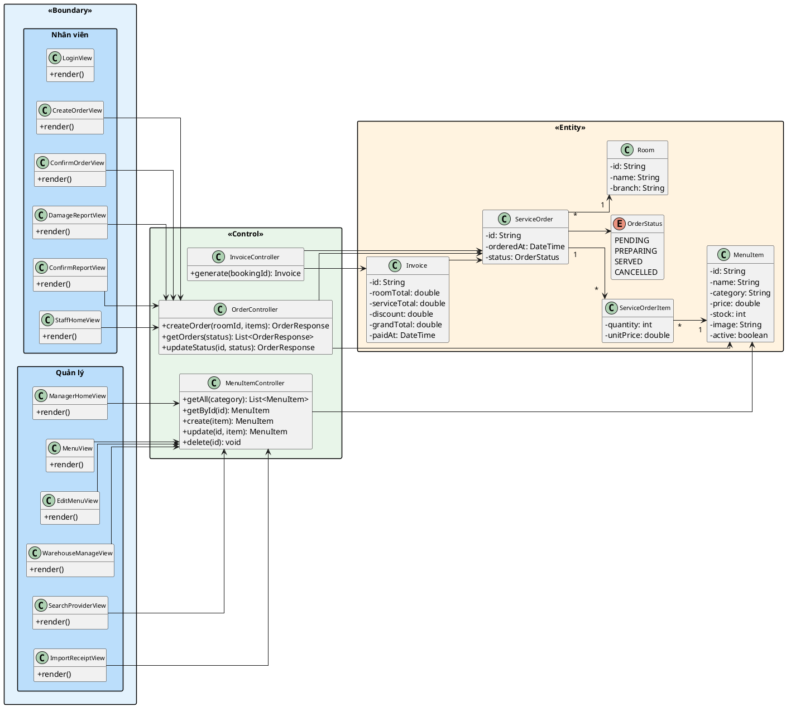

## III.2. Thiết kế mô hình MVC

Mô hình MVC được thiết kế theo kiến trúc BCE (Boundary – Control – Entity) với 3 tầng:
- **Boundary (Giao diện):** React components xử lý giao diện người dùng
- **Control (Điều khiển):** Spring Boot Controllers xử lý nghiệp vụ
- **Entity (Thực thể):** JPA Entities biểu diễn dữ liệu lưu trữ

### a) Chức năng Tạo order

**1. Tầng giao diện (Boundary)**

| Lớp | Component | Mô tả |
|------|-----------|-------|
| **OrderPage** | Page | Trang chính tạo order, chọn phòng và sản phẩm |
| **RoomSelector** | Panel | Chọn phòng đang hoạt động từ danh sách |
| **ProductSearchForm** | Form | Tìm kiếm sản phẩm theo tên |
| **ProductTable** | Table | Hiển thị danh sách sản phẩm với nút "Thêm" |
| **OrderCartPanel** | Panel | Giỏ hàng hiện tại, tổng tiền, nút xác nhận |
| **ConfirmOrderModal** | Modal | Xác nhận tạo order |

**2. Tầng điều khiển (Control/DAO)**

a) Tạo order mới => `createOrder()`
- Input: mã phòng, danh sách sản phẩm (tên + số lượng)
- Output: đối tượng Order vừa tạo
- Ứng viên tham số vào:
  - `createOrder(roomId: String, items: List<OrderItemRequest>)` → chọn (hướng đối tượng, gom nhóm dữ liệu)
  - `createOrder(roomId: String, productId: String, quantity: int)` → loại (gọi nhiều lần nếu nhiều sản phẩm)
- Ứng viên tham số ra:
  - `createOrder(): void` → loại (cần trả về order vừa tạo)
  - `createOrder(): OrderResponse` → chọn (trả về thông tin order)

b) Tìm danh sách order theo trạng thái => `getOrders()`
- Input: trạng thái order
- Output: danh sách order
- Ứng viên tham số vào:
  - `getOrders(status: OrderStatus)` → chọn (lọc theo trạng thái)
- Ứng viên tham số ra:
  - `getOrders(): List<OrderResponse>` → chọn (trả về danh sách)

c) Tìm sản phẩm theo danh mục => `getByCategory()`
- Input: tên danh mục
- Output: danh sách sản phẩm
- Ứng viên tham số vào:
  - `getByCategory(category: String)` → chọn
- Ứng viên tham số ra:
  - `getByCategory(): List<MenuItem>` → chọn

d) Tìm sản phẩm theo mã => `getById()`
- Input: mã sản phẩm
- Output: đối tượng sản phẩm
- Ứng viên tham số vào:
  - `getById(id: String)` → chọn
- Ứng viên tham số ra:
  - `getById(): MenuItem` → chọn

**3. Tầng thực thể (Entity)**

| Entity | Thuộc tính chính | Quan hệ |
|--------|-----------------|---------|
| **ServiceOrder** | id, orderedAt, status | ManyToOne→Room, OneToMany→ServiceOrderItem |
| **ServiceOrderItem** | quantity, unitPrice | ManyToOne→ServiceOrder, ManyToOne→MenuItem |
| **MenuItem** | id, name, category, price, stock, image, active | — |
| **Room** | id, name, branch | — |

### b) Chức năng Báo cáo tình trạng hàng

**1. Tầng giao diện (Boundary)**

| Lớp | Component | Mô tả |
|------|-----------|-------|
| **OrderManagement** | Page | Trang quản lý order, hiển thị danh sách theo trạng thái |
| **StatusFilterTabs** | Panel | Tab lọc theo trạng thái (PENDING, PREPARING, SERVED, CANCELLED) |
| **OrderCard** | Card | Thông tin đơn hàng (phòng, sản phẩm, trạng thái) |
| **StatusUpdateModal** | Modal | Cập nhật trạng thái đơn hàng |

**2. Tầng điều khiển (Control/DAO)**

a) Tìm danh sách order theo trạng thái => `getOrders()`
- Input: trạng thái order
- Output: danh sách order
- Ứng viên tham số vào:
  - `getOrders(status: OrderStatus)` → chọn
- Ứng viên tham số ra:
  - `getOrders(): List<OrderResponse>` → chọn

b) Cập nhật trạng thái order => `updateStatus()`
- Input: mã order, trạng thái mới
- Output: đối tượng order đã cập nhật
- Ứng viên tham số vào:
  - `updateStatus(id: String, status: OrderStatus)` → chọn
- Ứng viên tham số ra:
  - `updateStatus(): void` → loại (cần xác nhận thành công)
  - `updateStatus(): OrderResponse` → chọn (trả về order đã cập nhật)

**3. Tầng thực thể (Entity)**

| Entity | Thuộc tính chính | Quan hệ |
|--------|-----------------|---------|
| **ServiceOrder** | id, orderedAt, status | ManyToOne→Room, OneToMany→ServiceOrderItem |
| **OrderStatus** | PENDING, PREPARING, SERVED, CANCELLED | enum |

### c) Chức năng Quản lý menu

**1. Tầng giao diện (Boundary)**

| Lớp | Component | Mô tả |
|------|-----------|-------|
| **MenuManagement** | Page | Trang quản lý menu (CRUD sản phẩm) |
| **CategoryFilter** | Panel | Lọc theo danh mục (Đồ uống, Đồ ăn, Trái cây) |
| **MenuItemTable** | Table | Danh sách sản phẩm với nút Sửa/Xóa |
| **MenuItemForm** | Form | Form thêm/sửa sản phẩm (tên, giá, tồn kho, hình ảnh) |

**2. Tầng điều khiển (Control/DAO)**

a) Liệt kê tất cả sản phẩm => `getAll()`
- Input: danh mục (tùy chọn)
- Output: danh sách sản phẩm
- Ứng viên tham số vào:
  - `getAll()` → loại (không có tham số)
  - `getAll(category: String)` → chọn (lọc theo danh mục)
- Ứng viên tham số ra:
  - `getAll(): List<MenuItem>` → chọn

b) Tìm sản phẩm theo mã => `getById()`
- Input: mã sản phẩm
- Output: đối tượng sản phẩm
- Ứng viên tham số vào:
  - `getById(id: String)` → chọn
- Ứng viên tham số ra:
  - `getById(): MenuItem` → chọn

c) Thêm sản phẩm mới => `create()`
- Input: thông tin sản phẩm
- Output: sản phẩm vừa tạo
- Ứng viên tham số vào:
  - `create(item: MenuItem)` → chọn (hướng đối tượng)
- Ứng viên tham số ra:
  - `create(): MenuItem` → chọn (trả về sản phẩm vừa tạo)

d) Cập nhật sản phẩm => `update()`
- Input: mã sản phẩm, thông tin mới
- Output: sản phẩm đã cập nhật
- Ứng viên tham số vào:
  - `update(id: String, item: MenuItem)` → chọn
- Ứng viên tham số ra:
  - `update(): MenuItem` → chọn

e) Xóa sản phẩm => `delete()`
- Input: mã sản phẩm
- Output: không có
- Ứng viên tham số vào:
  - `delete(id: String)` → chọn
- Ứng viên tham số ra:
  - `delete(): void` → chọn (không cần trả về)

**3. Tầng thực thể (Entity)**

| Entity | Thuộc tính chính | Quan hệ |
|--------|-----------------|---------|
| **MenuItem** | id, name, category, price, stock, image, active | — |

### d) Chức năng Quản lý kho

**1. Tầng giao diện (Boundary)**

| Lớp | Component | Mô tả |
|------|-----------|-------|
| **InventoryPage** | Page | Trang quản lý tồn kho |
| **StockTable** | Table | Danh sách sản phẩm với số lượng tồn kho |
| **StockUpdateForm** | Form | Cập nhật số lượng tồn kho (nhập kho) |

**2. Tầng điều khiển (Control/DAO)**

a) Liệt kê tất cả sản phẩm => `getAll()`
- Input: danh mục (tùy chọn)
- Output: danh sách sản phẩm
- Ứng viên tham số vào:
  - `getAll(category: String)` → chọn (lọc theo danh mục)
- Ứng viên tham số ra:
  - `getAll(): List<MenuItem>` → chọn

b) Cập nhật tồn kho => `update()`
- Input: mã sản phẩm, số lượng mới
- Output: sản phẩm đã cập nhật
- Ứng viên tham số vào:
  - `update(id: String, item: MenuItem)` → chọn (cập nhật toàn bộ MenuItem)
- Ứng viên tham số ra:
  - `update(): MenuItem` → chọn

**3. Tầng thực thể (Entity)**

| Entity | Thuộc tính chính | Quan hệ |
|--------|-----------------|---------|
| **MenuItem** | id, name, category, price, stock, image, active | — |

### 4. Sơ đồ lớp thiết kế

Sơ đồ lớp thiết kế đồng nhất cho toàn module Dịch vụ & Sản phẩm, thể hiện tất cả các lớp Boundary, Control và Entity:

