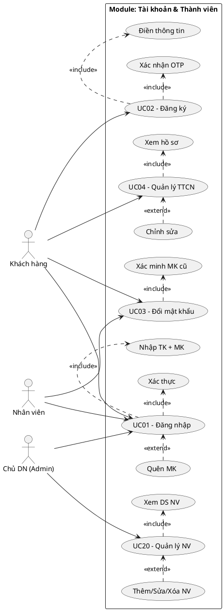

## I. PHA XÁC ĐỊNH YÊU CẦU

### 1. Danh sách Use Case

| Mã UC | Tên Use Case | Actor chính | Mô tả ngắn |
|--------|-------------|-------------|------------|
| UC01 | Đăng nhập | Khách hàng, Nhân viên | Xác thực danh tính người dùng vào hệ thống |
| UC02 | Đăng ký | Khách hàng | Tạo tài khoản hội viên mới |
| UC03 | Đổi mật khẩu | Khách hàng, Nhân viên | Thay đổi mật khẩu tài khoản |
| UC04 | Quản lý thông tin cá nhân | Khách hàng | Xem & cập nhật hồ sơ cá nhân |
| UC20 | Quản lý tài khoản nhân viên | Chủ Doanh nghiệp (Admin) | Tạo, sửa, xóa tài khoản nhân viên |

### 2. Danh sách Actor

| STT | Actor | Mô tả |
|-----|-------|-------|
| 1 | Khách hàng | Người dùng sử dụng dịch vụ karaoke, truy cập qua web/app để đăng ký, đăng nhập, quản lý tài khoản |
| 2 | Nhân viên | Nhân viên tại chi nhánh, sử dụng hệ thống để xử lý nghiệp vụ |
| 3 | Chủ Doanh nghiệp (Admin) | Chủ sở hữu chuỗi, quản lý tài khoản nhân viên toàn hệ thống |

### 3. UC con và quan hệ Include/Extend

| UC cha | UC con | Quan hệ | Lý do |
|--------|--------|---------|-------|
| UC01 – Đăng nhập | Nhập thông tin đăng nhập | include | Bắt buộc – luôn phải nhập tài khoản và mật khẩu |
| UC01 – Đăng nhập | Xác thực thông tin | include | Bắt buộc – hệ thống kiểm tra sau khi nhập |
| UC01 – Đăng nhập | Quên mật khẩu | extend | Khi người dùng nhấn "Quên mật khẩu?" |
| UC02 – Đăng ký | Điền thông tin | include | Bắt buộc – không thể đăng ký mà không điền thông tin |
| UC02 – Đăng ký | Xác nhận OTP | include | Bắt buộc – xác minh SĐT trước khi tạo tài khoản |
| UC03 – Đổi mật khẩu | Xác minh mật khẩu cũ | include | Bắt buộc – phải xác minh MK hiện tại trước khi đổi |
| UC04 – Quản lý TTCN | Xem hồ sơ cá nhân | include | Bắt buộc – hiển thị hồ sơ khi vào trang |
| UC04 – Quản lý TTCN | Chỉnh sửa thông tin | extend | Chỉ khi người dùng chọn chỉnh sửa |
| UC04 – Quản lý TTCN | Xem hạng hội viên | extend | Khi người dùng nhấn vào khu vực thẻ hội viên |
| UC20 – Quản lý NV | Xem danh sách nhân viên | include | Bắt buộc – hiển thị danh sách trước khi thao tác |
| UC20 – Quản lý NV | Thêm/sửa/xóa nhân viên | extend | Chỉ khi quản lý chọn thao tác |

### 4. Biểu đồ Use Case tổng quan

<!-- PLACEHOLDER: account_uc_overview -->
<!-- File: output/diagrams/account_uc_overview.png -->

### 5. Mô tả từng Use Case

**UC01 – Đăng nhập:** UC này cho phép Khách hàng, Nhân viên hoặc Chủ doanh nghiệp xác thực danh tính vào hệ thống. Người dùng nhập SĐT/Email và mật khẩu, hệ thống kiểm tra và chuyển hướng đến trang chủ tương ứng với vai trò.

**UC02 – Đăng ký:** UC này cho phép Khách hàng tạo tài khoản hội viên mới bằng cách cung cấp họ tên, SĐT, email và mật khẩu. Hệ thống gửi OTP 6 chữ số đến SĐT để xác minh trước khi hoàn tất đăng ký.

**UC03 – Đổi mật khẩu:** UC này cho phép người dùng đã đăng nhập thay đổi mật khẩu bằng cách xác minh mật khẩu hiện tại, nhập mật khẩu mới (độ dài ≥ 8, có chữ hoa/thường/số/đặc biệt). Sau khi đổi, tất cả session khác bị thu hồi.

**UC04 – Quản lý thông tin cá nhân:** UC này cho phép Khách hàng xem hồ sơ cá nhân (họ tên, SĐT, email, hạng hội viên, điểm tích lũy) và cập nhật thông tin (họ tên, email). SĐT bị khóa, muốn đổi phải xác minh OTP.

**UC20 – Quản lý tài khoản nhân viên:** UC này cho phép Chủ doanh nghiệp quản lý tài khoản nhân viên toàn hệ thống: xem danh sách, thêm mới, chỉnh sửa và xóa (chuyển trạng thái "Đã nghỉ"). Không thể xóa nhân viên đang xử lý order.
