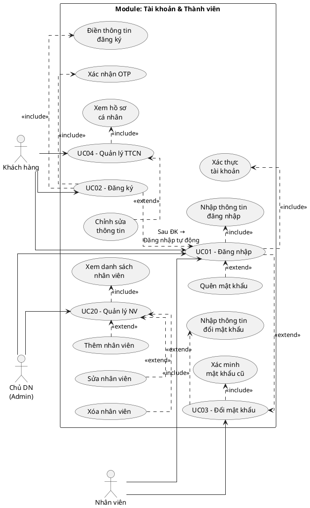
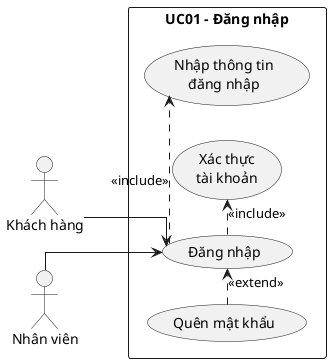
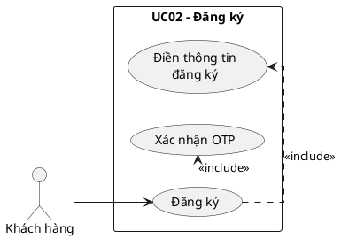
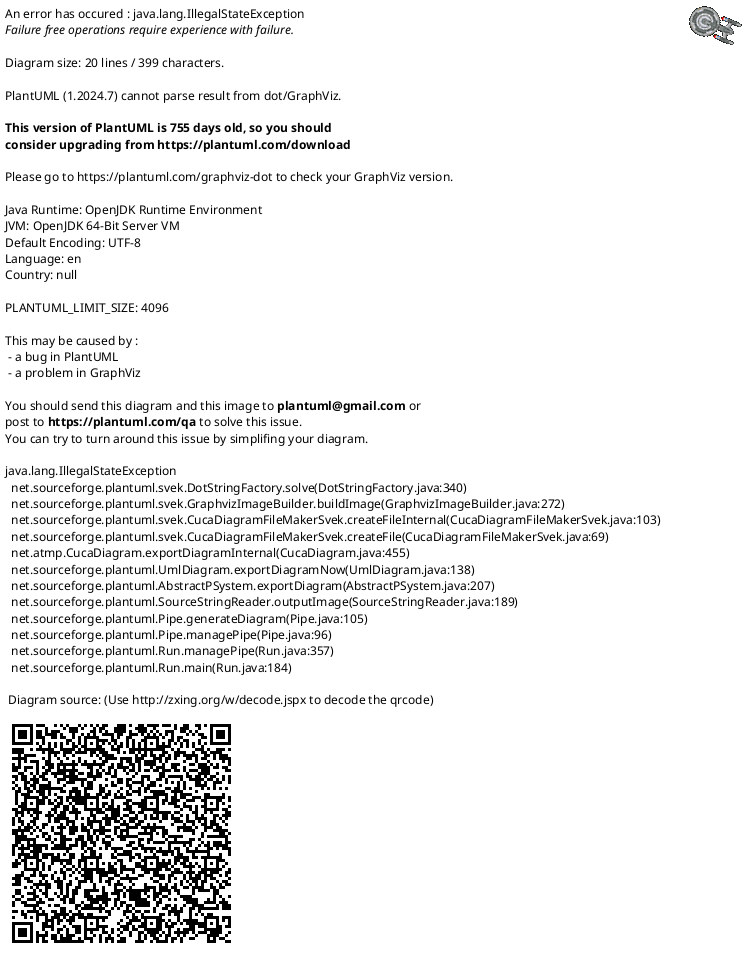
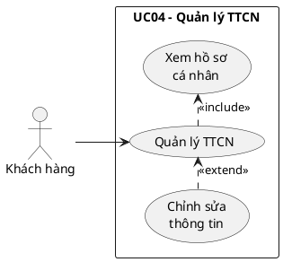
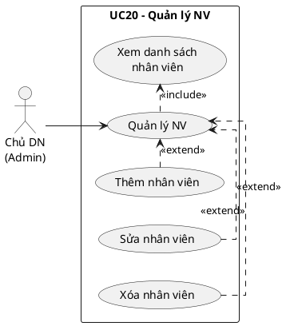

## I. PHA XÁC ĐỊNH YÊU CẦU

### 1. Danh sách Use Case

| Mã UC | Tên Use Case | Actor chính | Mô tả ngắn |
|--------|-------------|-------------|------------|
| UC01 | Đăng nhập | Khách hàng, Nhân viên | Xác thực danh tính người dùng vào hệ thống |
| UC02 | Đăng ký | Khách hàng | Tạo tài khoản hội viên mới |
| UC03 | Đổi mật khẩu | Khách hàng, Nhân viên | Thay đổi mật khẩu tài khoản |
| UC04 | Quản lý thông tin cá nhân | Khách hàng | Xem & cập nhật hồ sơ cá nhân |
| UC20 | Quản lý tài khoản nhân viên | Chủ Doanh nghiệp (Admin) | Tạo, sửa, xóa tài khoản nhân viên |

### 2. Danh sách Actor

| STT | Actor | Mô tả |
|-----|-------|-------|
| 1 | Khách hàng | Người dùng sử dụng dịch vụ karaoke, truy cập qua web/app để đăng ký, đăng nhập, quản lý tài khoản |
| 2 | Nhân viên | Nhân viên tại chi nhánh, sử dụng hệ thống để xử lý nghiệp vụ |
| 3 | Chủ Doanh nghiệp (Admin) | Chủ sở hữu chuỗi, quản lý tài khoản nhân viên toàn hệ thống |

### 3. UC con và quan hệ Include/Extend

| UC cha | UC con | Quan hệ | Lý do |
|--------|--------|---------|-------|
| UC01 – Đăng nhập | Nhập thông tin đăng nhập | include | Bắt buộc – luôn phải nhập tài khoản và mật khẩu |
| UC01 – Đăng nhập | Xác thực tài khoản | include | Bắt buộc – hệ thống kiểm tra sau khi nhập |
| UC01 – Đăng nhập | Quên mật khẩu | extend | Khi người dùng nhấn "Quên mật khẩu?" |
| UC02 – Đăng ký | Điền thông tin đăng ký | include | Bắt buộc – không thể đăng ký mà không điền thông tin |
| UC02 – Đăng ký | Xác nhận OTP | include | Bắt buộc – xác minh SĐT trước khi tạo tài khoản |
| UC03 – Đổi mật khẩu | Xác minh mật khẩu cũ | include | Bắt buộc – phải xác minh MK hiện tại trước khi đổi |
| UC03 – Đổi mật khẩu | Nhập thông tin đổi mật khẩu | include | Bắt buộc – phải nhập MK mới và xác nhận |
| UC04 – Quản lý TTCN | Xem hồ sơ cá nhân | include | Bắt buộc – hiển thị hồ sơ khi vào trang |
| UC04 – Quản lý TTCN | Chỉnh sửa thông tin | extend | Chỉ khi người dùng chọn chỉnh sửa |
| UC20 – Quản lý NV | Xem danh sách nhân viên | include | Bắt buộc – hiển thị danh sách trước khi thao tác |
| UC20 – Quản lý NV | Thêm nhân viên | extend | Chỉ khi quản lý chọn thêm |
| UC20 – Quản lý NV | Sửa nhân viên | extend | Chỉ khi quản lý chọn sửa |
| UC20 – Quản lý NV | Xóa nhân viên | extend | Chỉ khi quản lý chọn xóa |

### 4. Biểu đồ Use Case tổng quan

<!-- PLACEHOLDER: account_uc_overview -->
<!-- File: output/diagrams/account_uc_overview.png -->

**Quy trình 4 bước:**

**Bước 1 – Copy UC + Actor từ hệ thống:**

| Mã UC | Tên UC | Actor |
|-------|--------|-------|
| UC01 | Đăng nhập | Khách hàng, Nhân viên, Chủ DN |
| UC02 | Đăng ký | Khách hàng |
| UC03 | Đổi mật khẩu | Khách hàng, Nhân viên |
| UC04 | Quản lý TTCN | Khách hàng |
| UC20 | Quản lý NV | Chủ DN |

**Bước 2 – Đề xuất UC con từ giao diện:**

| UC chính | Giao diện → UC con |
|----------|-------------------|
| UC01 | Form đăng nhập → Nhập thông tin đăng nhập; Xác thực tài khoản; Quên mật khẩu |
| UC02 | Form đăng ký → Điền thông tin đăng ký; Xác nhận OTP |
| UC03 | Form đổi MK → Xác minh mật khẩu cũ; Nhập thông tin đổi mật khẩu |
| UC04 | Trang hồ sơ → Xem hồ sơ cá nhân; Chỉnh sửa thông tin |
| UC20 | Trang quản lý NV → Xem danh sách NV; Thêm NV; Sửa NV; Xóa NV |

**Bước 3 – Xác định quan hệ include/extend:**

| UC cha | UC con | Quan hệ | Lý do |
|--------|--------|---------|-------|
| UC01 | Nhập thông tin đăng nhập | include | Bắt buộc – luôn phải nhập TK + MK |
| UC01 | Xác thực tài khoản | include | Bắt buộc – hệ thống kiểm tra sau khi nhập |
| UC01 | Quên mật khẩu | extend | Chỉ khi nhấn "Quên mật khẩu?" |
| UC02 | Điền thông tin đăng ký | include | Bắt buộc – không thể đăng ký mà không điền |
| UC02 | Xác nhận OTP | include | Bắt buộc – phải xác minh SĐT |
| UC03 | Xác minh mật khẩu cũ | include | Bắt buộc – phải verify MK cũ trước khi đổi |
| UC03 | Nhập thông tin đổi mật khẩu | include | Bắt buộc – phải nhập MK mới + xác nhận |
| UC04 | Xem hồ sơ cá nhân | include | Bắt buộc – hiển thị khi vào trang |
| UC04 | Chỉnh sửa thông tin | extend | Chỉ khi chọn chỉnh sửa |
| UC20 | Xem danh sách NV | include | Bắt buộc – hiển thị trước khi thao tác |
| UC20 | Thêm NV | extend | Chỉ khi chọn thêm |
| UC20 | Sửa NV | extend | Chỉ khi chọn sửa |
| UC20 | Xóa NV | extend | Chỉ khi chọn xóa |

**Bước 4 – Gộp UC con tương tự:**

UC20 có 3 UC con "Thêm NV", "Sửa NV", "Xóa NV" có cùng đặc điểm (CRUD nhân viên) → giữ riêng vì mỗi thao tác có luồng khác nhau, không gộp.

### 5. Mô tả từng Use Case

1. **UC01 – Đăng nhập:** UC này cho phép Khách hàng, Nhân viên hoặc Chủ doanh nghiệp xác thực danh tính vào hệ thống. Người dùng nhập SĐT/Email và mật khẩu, hệ thống kiểm tra và chuyển hướng đến trang chủ tương ứng với vai trò.

2. **UC02 – Đăng ký:** UC này cho phép Khách hàng tạo tài khoản hội viên mới bằng cách cung cấp họ tên, SĐT, email và mật khẩu. Hệ thống gửi OTP 6 chữ số đến SĐT để xác minh trước khi hoàn tất đăng ký. Sau khi đăng ký thành công, hệ thống tự động đăng nhập.

3. **UC03 – Đổi mật khẩu:** UC này cho phép người dùng đã đăng nhập (Khách hàng, Nhân viên) thay đổi mật khẩu bằng cách xác minh mật khẩu hiện tại, nhập mật khẩu mới (độ dài ≥ 8, có chữ hoa/thường/số/đặc biệt). Sau khi đổi, tất cả session khác bị thu hồi.

4. **UC04 – Quản lý thông tin cá nhân:** UC này cho phép Khách hàng xem hồ sơ cá nhân (họ tên, SĐT, email, hạng hội viên, điểm tích lũy) và cập nhật thông tin (họ tên, email). SĐT bị khóa, muốn đổi phải xác minh OTP.

5. **UC20 – Quản lý tài khoản nhân viên:** UC này cho phép Chủ doanh nghiệp quản lý tài khoản nhân viên toàn hệ thống: xem danh sách, thêm mới, chỉnh sửa và xóa (chuyển trạng thái "Đã nghỉ"). Không thể xóa nhân viên đang xử lý order.

### 6. Quy trình nghiệp vụ từng chức năng

Chức năng "Đăng nhập":
Người dùng mở trang đăng nhập → Hệ thống yêu cầu nhập thông tin đăng nhập → Người dùng nhập SĐT/Email và mật khẩu → Hệ thống kiểm tra tài khoản tồn tại trong CSDL → Hệ thống so sánh mật khẩu đã mã hóa → Thành công: hệ thống tạo phiên đăng nhập, chuyển người dùng đến trang chủ tương ứng vai trò / Thất bại: hệ thống thông báo sai thông tin đăng nhập

Chức năng "Quên mật khẩu":
Người dùng yêu cầu khôi phục mật khẩu → Hệ thống yêu cầu nhập SĐT → Người dùng nhập SĐT → Hệ thống kiểm tra SĐT tồn tại → Hệ thống gửi mã OTP đến SĐT → Người dùng nhập mã OTP → Hệ thống xác minh OTP hợp lệ → Hệ thống yêu cầu nhập mật khẩu mới → Người dùng nhập mật khẩu mới → Hệ thống cập nhật mật khẩu vào CSDL → Hệ thống thông báo đổi mật khẩu thành công

Chức năng "Đăng ký":
Khách hàng mở trang đăng ký → Hệ thống yêu cầu nhập thông tin đăng ký → Khách hàng nhập họ tên, SĐT, email, mật khẩu → Hệ thống kiểm tra SĐT và email chưa tồn tại trong CSDL → Hệ thống gửi mã OTP đến SĐT → Khách hàng nhập mã OTP → Hệ thống xác minh OTP hợp lệ → Hệ thống tạo tài khoản mới hạng "Thường", điểm tích lũy bằng 0 → Hệ thống tự động đăng nhập cho khách hàng

Chức năng "Đổi mật khẩu":
Người dùng mở trang bảo mật → Hệ thống yêu cầu nhập mật khẩu hiện tại và mật khẩu mới → Người dùng nhập đầy đủ thông tin → Hệ thống xác minh mật khẩu hiện tại khớp CSDL → Hệ thống kiểm tra mật khẩu mới hợp lệ → Hệ thống cập nhật mật khẩu mới vào CSDL → Hệ thống thu hồi tất cả phiên đăng nhập khác → Hệ thống thông báo đổi mật khẩu thành công

Chức năng "Quản lý thông tin cá nhân":
Khách hàng mở trang hồ sơ cá nhân → Hệ thống truy xuất và hiển thị thông tin từ CSDL → Khách hàng chọn chỉnh sửa và cập nhật họ tên, email → Hệ thống kiểm tra email hợp lệ và chưa được dùng → Hệ thống cập nhật hồ sơ vào CSDL → Hệ thống thông báo cập nhật thành công

Chức năng "Quản lý tài khoản nhân viên":
Admin mở trang quản lý nhân viên → Hệ thống hiển thị danh sách nhân viên → Admin chọn thêm nhân viên, nhập thông tin → Hệ thống kiểm tra SĐT chưa tồn tại, tạo tài khoản nhân viên → Admin chọn sửa nhân viên, cập nhật thông tin → Hệ thống lưu thay đổi vào CSDL → Admin chọn xóa nhân viên → Hệ thống kiểm tra nhân viên không đang xử lý order → Hệ thống chuyển trạng thái "Đã nghỉ"

### 7. Biểu đồ Use Case chi tiết

#### UC01 – Đăng nhập

<!-- PLACEHOLDER: account_uc_detail_login -->

#### UC02 – Đăng ký

<!-- PLACEHOLDER: account_uc_detail_register -->

#### UC03 – Đổi mật khẩu

<!-- PLACEHOLDER: account_uc_detail_changepw -->

#### UC04 – Quản lý TTCN

<!-- PLACEHOLDER: account_uc_detail_profile -->

#### UC20 – Quản lý nhân viên

<!-- PLACEHOLDER: account_uc_detail_staff -->

