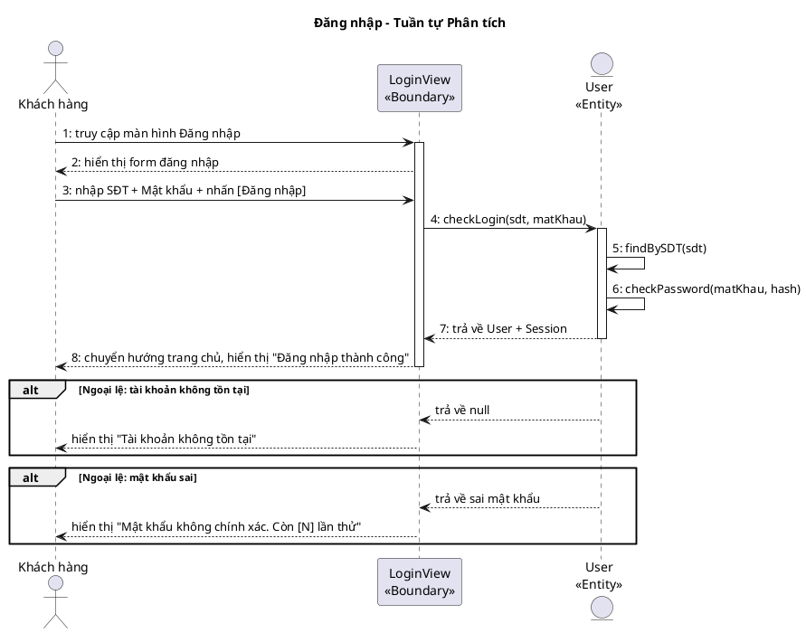
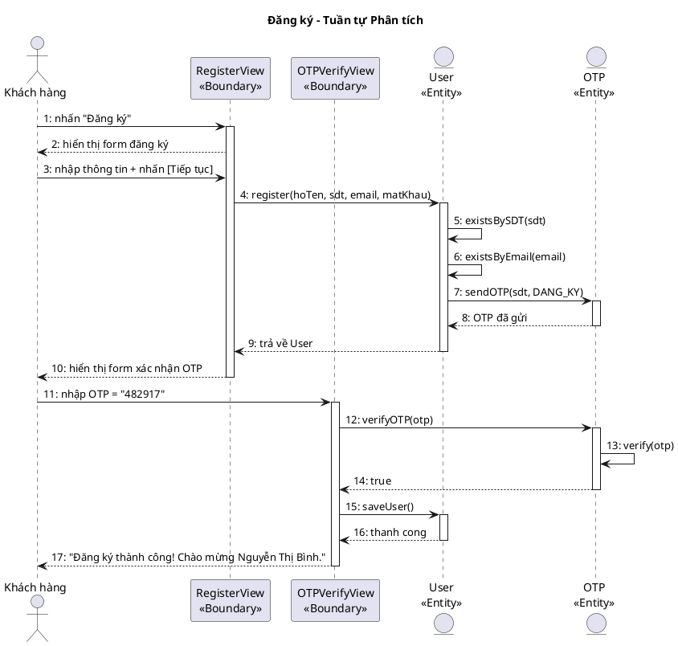
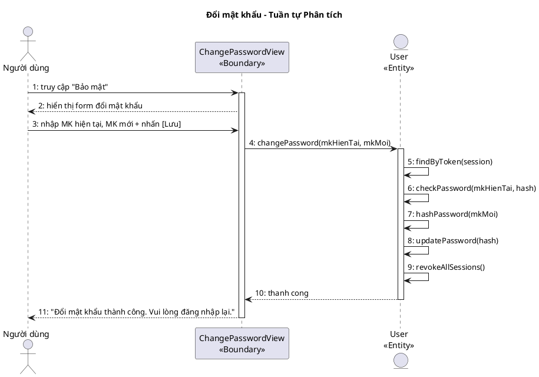
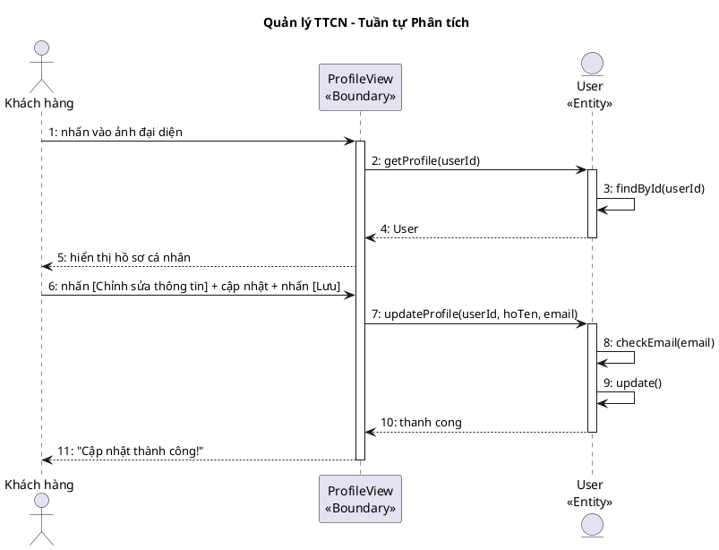
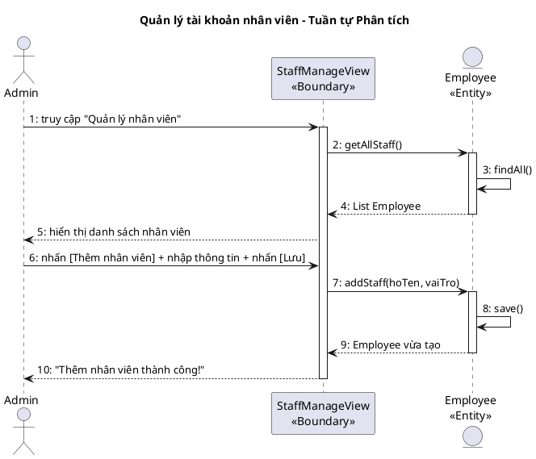

## II. PHA PHÂN TÍCH

### 1. Kịch bản chuẩn

#### UC01 – Đăng nhập

| Use case | Đăng nhập |
|----------|----------|
| Actor | Khách hàng, Nhân viên |
| Tiền điều kiện | Người dùng chưa đăng nhập. Tài khoản đã tồn tại trong hệ thống. |
| Hậu điều kiện | Người dùng được xác thực thành công, hệ thống tạo session và chuyển hướng đến trang chủ tương ứng. |
| Kịch bản chính | 1. Người dùng truy cập màn hình "Đăng nhập". 2. Hệ thống hiển thị form gồm: Ô nhập SĐT/Email, Ô nhập Mật khẩu, Nút [Đăng nhập], Liên kết "Quên mật khẩu?" / "Đăng ký". 3. Người dùng nhập thông tin: SĐT = "0912345678", Mật khẩu = "Abc@1234". 4. Người dùng nhấn [Đăng nhập]. 5. Hệ thống kiểm tra định dạng đầu vào. 6. Hệ thống truy vấn CSDL: tìm tài khoản, so sánh mật khẩu đã mã hóa. 7. Xác thực thành công, tạo session với vai trò "Khách hàng". 8. Chuyển hướng đến trang chủ, hiển thị "Đăng nhập thành công. Xin chào, Nguyễn Văn A!". |
| Ngoại lệ | 6.1. Tài khoản không tồn tại: Hiển thị "Tài khoản không tồn tại. Vui lòng kiểm tra lại." 6.2. Mật khẩu không khớp: Hiển thị "Mật khẩu không chính xác. Còn [N] lần thử." Sau 5 lần sai → khóa 15 phút. |

#### UC02 – Đăng ký

| Use case | Đăng ký |
|----------|--------|
| Actor | Khách hàng |
| Tiền điều kiện | Người dùng chưa có tài khoản. Hệ thống hoạt động bình thường. |
| Hậu điều kiện | Tài khoản mới được tạo, hạng "Thường", đăng nhập tự động. |
| Kịch bản chính | 1. Người dùng nhấn "Đăng ký" từ màn hình đăng nhập. 2. Hệ thống hiển thị form: Họ tên, SĐT, Email, Mật khẩu, Xác nhận MK. 3. Người dùng điền: Họ tên = "Nguyễn Thị Bình", SĐT = "0987654321", Email = "binh.nt@email.com", MK = "Pass@2025". 4. Người dùng nhấn [Tiếp tục]. 5. Hệ thống kiểm tra định dạng, SĐT và email chưa tồn tại. 6. Hệ thống gửi OTP 6 chữ số đến SĐT. 7. Hiển thị màn hình "Xác nhận OTP". 8. Người dùng nhập OTP = "482917" và nhấn [Xác nhận]. 9. Hệ thống xác minh OTP đúng và còn hiệu lực (≤ 5 phút). 10. Tạo tài khoản mới, hạng "Thường", điểm = 0. 11. Đăng nhập tự động, hiển thị "Đăng ký thành công! Chào mừng Nguyễn Thị Bình." |
| Ngoại lệ | 5.1. SĐT đã tồn tại: "SĐT này đã được sử dụng." 5.2. MK không khớp: Highlight ô xác nhận MK, "Mật khẩu không khớp." 9.1. OTP sai: "Mã OTP không đúng. Vui lòng thử lại." (tối đa 3 lần) 9.2. OTP hết hạn: "Mã OTP đã hết hạn." Nhấn "Gửi lại OTP". |

#### UC03 – Đổi mật khẩu

| Use case | Đổi mật khẩu |
|----------|-------------|
| Actor | Khách hàng, Nhân viên (đã đăng nhập) |
| Tiền điều kiện | Người dùng đã đăng nhập thành công. |
| Hậu điều kiện | Mật khẩu mới được lưu (bcrypt). Tất cả session khác bị thu hồi. |
| Kịch bản chính | 1. Người dùng truy cập "Bảo mật" trong cài đặt. 2. Hiển thị form: MK hiện tại, MK mới, Xác nhận MK mới. 3. Người dùng nhập: MK hiện tại = "Abc@1234", MK mới = "NewPass@2025", xác nhận = "NewPass@2025". 4. Nhấn [Lưu thay đổi]. 5. Hệ thống xác minh MK hiện tại khớp CSDL. 6. Kiểm tra MK mới: độ dài ≥ 8, có chữ hoa/thường/số/đặc biệt. 7. Kiểm tra MK mới ≠ MK hiện tại. 8. Mã hóa (bcrypt) và cập nhật. 9. Thu hồi tất cả session, hiển thị "Đổi mật khẩu thành công. Vui lòng đăng nhập lại." 10. Chuyển hướng về màn hình Đăng nhập. |
| Ngoại lệ | 5.1. MK hiện tại sai: "Mật khẩu hiện tại không chính xác." 6.1. MK mới không đủ mạnh: Highlight ô, hiển thị yêu cầu còn thiếu. 7.1. MK mới trùng MK cũ: "Mật khẩu mới không được trùng mật khẩu hiện tại." |

#### UC04 – Quản lý thông tin cá nhân

| Use case | Quản lý thông tin cá nhân |
|----------|--------------------------|
| Actor | Khách hàng (đã đăng nhập) |
| Tiền điều kiện | Khách hàng đã đăng nhập. Tài khoản tồn tại trong CSDL. |
| Hậu điều kiện | Thông tin cập nhật trong CSDL, hiển thị ngay trên giao diện. |
| Kịch bản chính | 1. Khách hàng nhấn vào ảnh đại diện / tên tài khoản. 2. Hệ thống hiển thị "Hồ sơ cá nhân": <table><tr><th>Họ tên</th><th>SĐT</th><th>Email</th><th>Hạng hội viên</th><th>Điểm tích lũy</th><th>Ngày tham gia</th></tr><tr><td>Nguyễn Văn An</td><td>0912345678</td><td>vana@email.com</td><td>Bạc</td><td>1.250</td><td>15/03/2024</td></tr></table> 3. Nhấn [Chỉnh sửa thông tin]. 4. Chuyển sang chế độ chỉnh sửa: Họ tên, Email có thể nhập; SĐT bị khóa. 5. Cập nhật: Họ tên = "Nguyễn Văn An", Email = "vanan@newemail.com". 6. Nhấn [Lưu thay đổi]. 7. Kiểm tra email hợp lệ và chưa được dùng. 8. Cập nhật vào CSDL. 9. Hiển thị "Cập nhật thành công!" và quay về chế độ xem. |
| Ngoại lệ | 7.1. Email đã được dùng: "Email này đã được đăng ký bởi tài khoản khác." 3.1. Thay đổi SĐT: Yêu cầu xác minh OTP gửi đến SĐT hiện tại → SĐT mới → OTP mới. |

#### UC20 – Quản lý tài khoản nhân viên

| Use case | Quản lý tài khoản nhân viên |
|----------|----------------------------|
| Actor | Chủ Doanh nghiệp (Admin) |
| Tiền điều kiện | Admin đã đăng nhập. Có quyền quản lý tài khoản nhân viên toàn hệ thống. |
| Hậu điều kiện | Tài khoản nhân viên được tạo/sửa/xóa trong CSDL. |
| Kịch bản chính | 1. Quản lý truy cập "Quản lý nhân viên". 2. Hệ thống hiển thị danh sách nhân viên: <table><tr><th>Họ tên</th><th>Vai trò</th><th>Trạng thái</th></tr><tr><td>Trần Văn A</td><td>Lễ tân</td><td>Đang làm việc</td></tr><tr><td>Lê Thị B</td><td>Phục vụ</td><td>Đang làm việc</td></tr><tr><td>Phạm Văn C</td><td>Quản lý</td><td>Đang làm việc</td></tr></table> 3a. Thêm nhân viên: Nhấn [Thêm] → Nhập thông tin → Lưu. 3b. Sửa nhân viên: Chọn nhân viên → Chỉnh sửa → Lưu. 3c. Xóa nhân viên: Chọn nhân viên → Xác nhận xóa → Hệ thống chuyển trạng thái "Đã nghỉ". |
| Ngoại lệ | 3.1. SĐT đã tồn tại: "SĐT này đã được sử dụng." 3.2. Nhân viên đang xử lý order: Không thể xóa, hiển thị cảnh báo. |

### 2. Mô hình hóa lớp

**Bước 1 – Mô tả chức năng bằng đoạn văn xuôi**

Hệ thống cho phép khách hàng đăng ký tài khoản hội viên mới bằng cách cung cấp họ tên, số điện thoại, email và mật khẩu; sau đó xác minh số điện thoại qua mã OTP trước khi hoàn tất đăng ký. Mỗi tài khoản gắn liền với một hạng hội viên (Thường, Bạc, Vàng, Kim Cương) dựa trên điểm tích lũy. Người dùng sau khi đăng nhập có thể xem và cập nhật thông tin cá nhân như họ tên và email, hoặc thực hiện đổi mật khẩu bằng cách xác minh mật khẩu cũ rồi nhập mật khẩu mới. Hệ thống ghi nhận các phiên đăng nhập để phục vụ bảo mật và thu hồi phiên khi đổi mật khẩu. Ngoài ra, chủ doanh nghiệp có quyền quản lý tài khoản nhân viên: tạo, chỉnh sửa và xóa tài khoản nhân viên trong hệ thống.

**Bước 2 + 3 – Trích danh từ và đánh giá**

▪ Hệ thống → loại: quá chung, không phải thực thể nghiệp vụ
▪ Khách hàng → lớp User: hoTen, soDienThoai, email, matKhau, ngayTao
▪ Tài khoản → thuộc về User (gộp vào User, tránh tách thừa)
▪ Họ tên → thuộc tính của User
▪ Số điện thoại → thuộc tính của User (dùng làm username đăng nhập)
▪ Email → thuộc tính của User
▪ Mật khẩu → thuộc tính của User (lưu dạng mã hóa bcrypt)
▪ Ngày tham gia → thuộc tính ngayTao của User
▪ Hạng hội viên → lớp MembershipTier: tenHang, diemToiThieu, moTa, heSoUuDai
▪ Điểm tích lũy → thuộc tính diemTichLuy của User
▪ Mã OTP → lớp OTP: maOTP, loai (DANG_KY/DOI_SDT), thoiHanHetHan, daXacMinh
▪ Phiên đăng nhập → lớp LoginSession: tokenPhien, thoiGianDangNhap, thoiGianHetHan, thietBi
▪ Lịch sử → loại: quá chung → cụ thể là LoginSession đã đủ
▪ Danh sách → loại: không phải thực thể
▪ Giao diện → loại: là Boundary, không phải Entity
▪ Nhân viên → lớp Employee: hoTen, vaiTro, chiNhanh, trangThai
▪ Chủ doanh nghiệp → loại: actor, không phải thực thể dữ liệu

**Bước 4 – Xác định quan hệ số lượng**

▪ 1 User có 1 MembershipTier → User – MembershipTier: n – 1
(nhiều người dùng có thể có cùng hạng)
▪ 1 User có nhiều OTP → User – OTP: 1 – n
(mỗi lần đăng ký/đổi SĐT tạo 1 OTP mới)
▪ 1 User có nhiều LoginSession → User – LoginSession: 1 – n
(người dùng có thể đăng nhập trên nhiều thiết bị)

**Bước 5 – Bổ sung quan hệ**

User gắn composition với OTP: một OTP không tồn tại độc lập nếu không có User tương ứng (khi xóa User thì xóa theo tất cả OTP). Tương tự, LoginSession không tồn tại độc lập khỏi User. Quan hệ với MembershipTier là aggregation: MembershipTier là dữ liệu danh mục tồn tại độc lập với User. Employee là lớp riêng biệt, không kế thừa từ User.

<!-- PLACEHOLDER: account_entity_analysis -->

### 3. Biểu đồ lớp phân tích

**Phân tích chi tiết chức năng "Đăng nhập" diễn ra như sau:**

Người dùng truy cập trang đăng nhập → Đề xuất lớp **LoginView**, có ô nhập SĐT, ô nhập mật khẩu, nút Đăng nhập.

Người dùng nhập SĐT, mật khẩu và nhấn [Đăng nhập] → Hệ thống cần xác thực tài khoản → Cần chức năng `checkLogin()` của đối tượng **User**.

Nếu tài khoản không tồn tại → Hệ thống hiển thị thông báo lỗi.
Nếu mật khẩu sai → Hệ thống hiển thị thông báo lỗi.

**Boundary:** LoginView
**Entity:** User

<!-- PLACEHOLDER: account_bce_login -->

**Phân tích chi tiết chức năng "Đăng ký" diễn ra như sau:**

Người dùng truy cập trang đăng ký → Đề xuất lớp **RegisterView**, có ô nhập Họ tên, SĐT, Email, Mật khẩu, Xác nhận MK, nút Tiếp tục.

Người dùng nhập thông tin và nhấn [Tiếp tục] → Hệ thống cần tạo tài khoản mới → Cần chức năng `register()` của đối tượng **User**.

Hệ thống gửi OTP đến SĐT → Đề xuất lớp **OTPVerifyView**, có ô nhập OTP, nút Xác nhận.

Người dùng nhập OTP và nhấn [Xác nhận] → Hệ thống cần xác minh OTP → Cần chức năng `verifyOTP()` của đối tượng **OTP**.

**Boundary:** RegisterView, OTPVerifyView
**Entity:** User, OTP

<!-- PLACEHOLDER: account_bce_register -->

**Phân tích chi tiết chức năng "Đổi mật khẩu" diễn ra như sau:**

Người dùng truy cập trang bảo mật → Đề xuất lớp **ChangePasswordView**, có ô nhập MK hiện tại, MK mới, Xác nhận MK mới, nút Lưu.

Người dùng nhập MK hiện tại, MK mới và nhấn [Lưu] → Hệ thống cần đổi mật khẩu → Cần chức năng `changePassword()` của đối tượng **User**.

Nếu MK hiện tại sai → Hệ thống hiển thị thông báo lỗi.

**Boundary:** ChangePasswordView
**Entity:** User

<!-- PLACEHOLDER: account_bce_changepw -->

**Phân tích chi tiết chức năng "Quản lý thông tin cá nhân" diễn ra như sau:**

Người dùng nhấn vào ảnh đại diện → Đề xuất lớp **ProfileView**, có hiển thị Họ tên, SĐT, Email, Hạng hội viên, Điểm tích lũy, nút Chỉnh sửa.

Hệ thống cần lấy thông tin hồ sơ → Cần chức năng `getProfile()` của đối tượng **User**.

Người dùng nhấn [Chỉnh sửa], sửa thông tin và nhấn [Lưu] → Hệ thống cần cập nhật hồ sơ → Cần chức năng `updateProfile()` của đối tượng **User**.

**Boundary:** ProfileView
**Entity:** User

<!-- PLACEHOLDER: account_bce_profile -->

**Phân tích chi tiết chức năng "Quản lý nhân viên" diễn ra như sau:**

Admin truy cập trang quản lý nhân viên → Đề xuất lớp **StaffManageView**, có bảng danh sách nhân viên, nút Thêm, Sửa, Xóa.

Hệ thống cần tải danh sách nhân viên → Cần chức năng `getAllStaff()` của đối tượng **Employee**.

Admin nhấn [Thêm], nhập thông tin và nhấn [Lưu] → Hệ thống cần tạo nhân viên mới → Cần chức năng `addStaff()` của đối tượng **Employee**.

**Boundary:** StaffManageView
**Entity:** Employee

<!-- PLACEHOLDER: account_bce_staff -->

### 4. Biểu đồ tuần tự phân tích

#### UC01 – Đăng nhập

<!-- PLACEHOLDER: account_seq_login_analysis -->
<!-- File: output/diagrams/account_seq_login_analysis.png -->

**Kịch bản phiên bản 2 – UC01 Đăng nhập**

1. Khách hàng truy cập trang đăng nhập.
2. Lớp LoginView hiển thị form gồm ô nhập SĐT, ô nhập Mật khẩu, nút [Đăng nhập].
3. Khách hàng nhập SĐT và Mật khẩu.
4. Khách hàng nhấn nút [Đăng nhập].
5. Lớp LoginView gọi hàm `checkLogin()` của đối tượng User.
6. Lớp User gọi hàm `findBySDT()` để tìm tài khoản theo SĐT.
7. Lớp User gọi hàm `checkPassword()` để so sánh mật khẩu.
8. Lớp User trả kết quả về cho LoginView.
9. Lớp LoginView hiển thị "Đăng nhập thành công" và chuyển hướng trang chủ.

**Ngoại lệ: tài khoản không tồn tại**

- Lớp User trả về null.
- Lớp LoginView hiển thị "Tài khoản không tồn tại. Vui lòng kiểm tra lại."

**Ngoại lệ: mật khẩu sai**

- Lớp User trả về mật khẩu không khớp.
- Lớp LoginView hiển thị "Mật khẩu không chính xác. Còn [N] lần thử."

#### UC02 – Đăng ký

<!-- PLACEHOLDER: account_seq_register_analysis -->
<!-- File: output/diagrams/account_seq_register_analysis.png -->

**Kịch bản phiên bản 2 – UC02 Đăng ký**

1. Khách hàng nhấn liên kết "Đăng ký" từ màn hình đăng nhập.
2. Lớp RegisterView hiển thị form gồm: Họ tên, SĐT, Email, Mật khẩu, Xác nhận MK.
3. Khách hàng nhập Họ tên, SĐT, Email và Mật khẩu.
4. Khách hàng nhấn nút [Tiếp tục].
5. Lớp RegisterView gọi hàm `register()` của đối tượng User.
6. Lớp User gọi hàm `existsBySDT()` để kiểm tra SĐT chưa tồn tại.
7. Lớp User gọi hàm `existsByEmail()` để kiểm tra email chưa tồn tại.
8. Lớp User gọi hàm `sendOTP()` của đối tượng OTP để gửi mã xác minh.
9. Lớp User trả kết quả về cho RegisterView.
10. Lớp RegisterView hiển thị form xác nhận OTP.
11. Khách hàng nhập mã OTP và nhấn nút [Xác nhận].
12. Lớp OTPVerifyView gọi hàm `verifyOTP()` của đối tượng OTP.
13. Lớp OTP gọi hàm `verify()` để kiểm tra mã đúng và còn hiệu lực.
14. Lớp OTPVerifyView gọi hàm `saveUser()` của đối tượng User để hoàn tất đăng ký.
15. Lớp OTPVerifyView hiển thị "Đăng ký thành công!"

**Ngoại lệ: SĐT đã tồn tại**

- Lớp User trả về SĐT đã tồn tại.
- Lớp RegisterView hiển thị "SĐT này đã được sử dụng."

**Ngoại lệ: OTP sai**

- Lớp OTP trả về mã không hợp lệ.
- Lớp OTPVerifyView hiển thị "Mã OTP không đúng. Vui lòng thử lại."

#### UC03 – Đổi mật khẩu

<!-- PLACEHOLDER: account_seq_changepw_analysis -->
<!-- File: output/diagrams/account_seq_changepw_analysis.png -->

**Kịch bản phiên bản 2 – UC03 Đổi mật khẩu**

1. Người dùng truy cập mục "Bảo mật" trong cài đặt.
2. Lớp ChangePasswordView hiển thị form gồm: Mật khẩu hiện tại, Mật khẩu mới, Xác nhận mật khẩu mới.
3. Người dùng nhập Mật khẩu hiện tại, Mật khẩu mới và Xác nhận mật khẩu mới.
4. Người dùng nhấn nút [Lưu thay đổi].
5. Lớp ChangePasswordView gọi hàm `changePassword()` của đối tượng User.
6. Lớp User gọi hàm `findBySessionToken()` để tìm thông tin người dùng.
7. Lớp User gọi hàm `verifyPassword()` để xác minh mật khẩu hiện tại.
8. Lớp User gọi hàm `hashPassword()` để mã hóa mật khẩu mới.
9. Lớp User gọi hàm `updatePassword()` để cập nhật mật khẩu.
10. Lớp User gọi hàm `revokeAllSessions()` để thu hồi tất cả session.
11. Lớp User trả kết quả về cho ChangePasswordView.
12. Lớp ChangePasswordView hiển thị "Đổi mật khẩu thành công. Vui lòng đăng nhập lại."

**Ngoại lệ: MK hiện tại sai**

- Lớp User trả về mật khẩu không khớp.
- Lớp ChangePasswordView hiển thị "Mật khẩu hiện tại không chính xác."

**Ngoại lệ: MK mới không đủ mạnh**

- Lớp User trả về lỗi validation.
- Lớp ChangePasswordView highlight ô và hiển thị yêu cầu còn thiếu.

#### UC04 – Quản lý thông tin cá nhân

<!-- PLACEHOLDER: account_seq_profile_analysis -->
<!-- File: output/diagrams/account_seq_profile_analysis.png -->

**Kịch bản phiên bản 2 – UC04 Quản lý thông tin cá nhân**

1. Khách hàng nhấn vào ảnh đại diện / tên tài khoản.
2. Lớp ProfileView gọi hàm `getProfile()` của đối tượng User.
3. Lớp User gọi hàm `findById()` để tìm thông tin người dùng.
4. Lớp User trả kết quả về cho ProfileView.
5. Lớp ProfileView hiển thị hồ sơ: Họ tên, SĐT, Email, Hạng hội viên, Điểm tích lũy.
6. Khách hàng nhấn nút [Chỉnh sửa thông tin], cập nhật thông tin và nhấn nút [Lưu].
7. Lớp ProfileView gọi hàm `updateProfile()` của đối tượng User.
8. Lớp User gọi hàm `checkEmail()` để kiểm tra email hợp lệ và chưa được dùng.
9. Lớp User gọi hàm `update()` để cập nhật thông tin.
10. Lớp User trả kết quả về cho ProfileView.
11. Lớp ProfileView hiển thị "Cập nhật thành công!"

**Ngoại lệ: Email đã được dùng**

- Lớp User trả về email đã tồn tại.
- Lớp ProfileView hiển thị "Email này đã được đăng ký bởi tài khoản khác."

#### UC20 – Quản lý tài khoản nhân viên

<!-- PLACEHOLDER: account_seq_staff_analysis -->
<!-- File: output/diagrams/account_seq_staff_analysis.png -->

**Kịch bản phiên bản 2 – UC20 Quản lý tài khoản nhân viên**

1. Admin truy cập "Quản lý nhân viên" từ trang quản trị.
2. Lớp StaffManageView gọi hàm `getAllStaff()` của đối tượng Employee.
3. Lớp Employee gọi hàm `findAll()` để tải danh sách nhân viên.
4. Lớp Employee trả kết quả về cho StaffManageView.
5. Lớp StaffManageView hiển thị bảng danh sách nhân viên.
6. Admin nhấn nút [Thêm], nhập thông tin nhân viên và nhấn nút [Lưu].
7. Lớp StaffManageView gọi hàm `addStaff()` của đối tượng Employee.
8. Lớp Employee gọi hàm `save()` để lưu nhân viên mới.
9. Lớp Employee trả kết quả về cho StaffManageView.
10. Lớp StaffManageView hiển thị "Thêm nhân viên thành công!"

**Ngoại lệ: SĐT đã tồn tại**

- Lớp Employee trả về lỗi trùng SĐT.
- Lớp StaffManageView hiển thị "SĐT này đã được sử dụng."

**Ngoại lệ: Nhân viên đang xử lý order**

- Lớp Employee trả về lỗi không thể xóa.
- Lớp StaffManageView hiển thị cảnh báo "Nhân viên đang xử lý order, không thể xóa."
