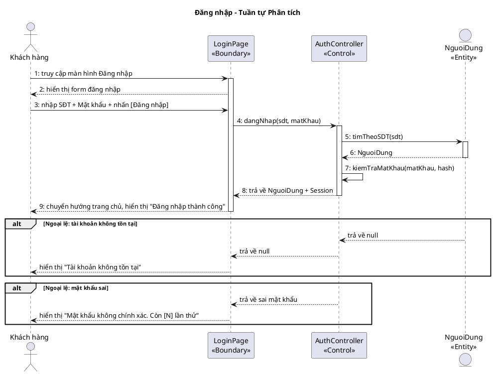
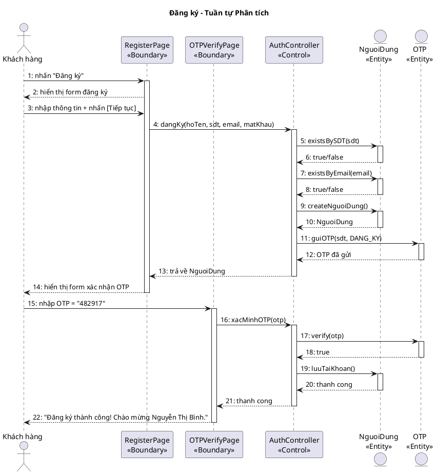
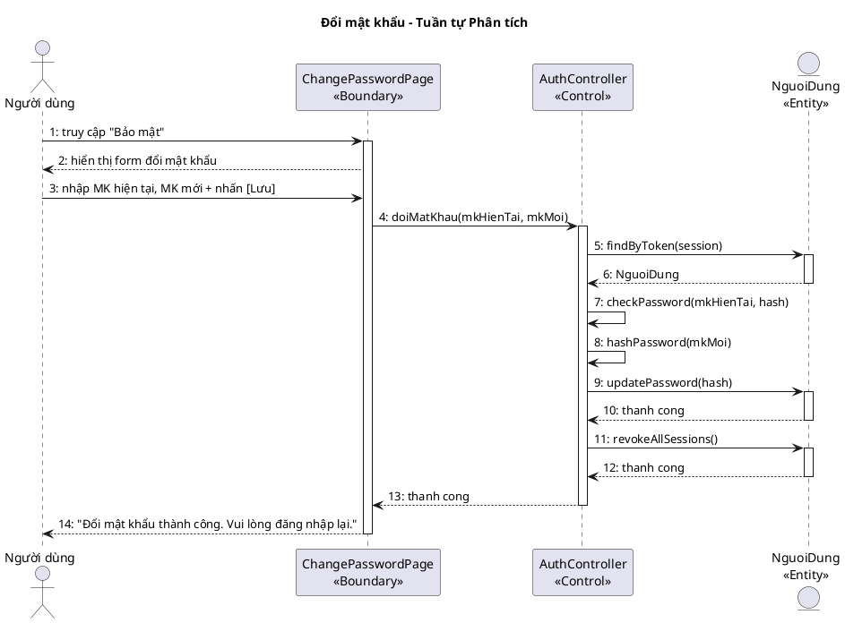
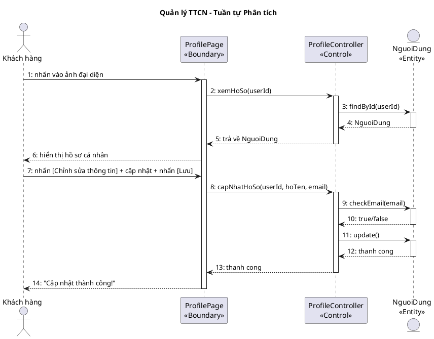
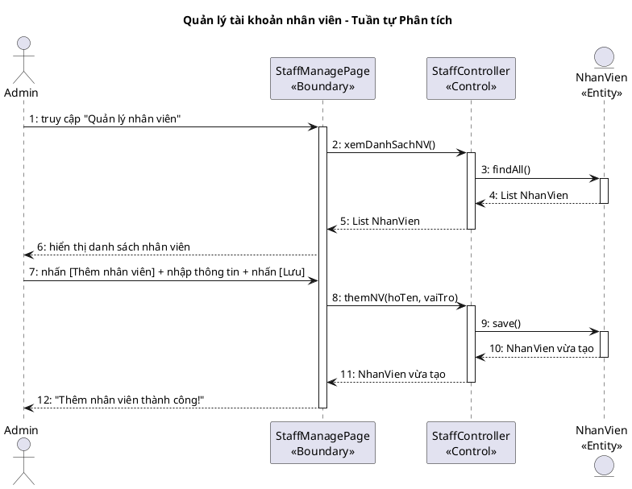

## II. PHA PHÂN TÍCH

### 1. Kịch bản chuẩn

#### UC01 – Đăng nhập

| Use case | Đăng nhập |
|----------|----------|
| Actor | Khách hàng, Nhân viên |
| Tiền điều kiện | Người dùng chưa đăng nhập. Tài khoản đã tồn tại trong hệ thống. |
| Hậu điều kiện | Người dùng được xác thực thành công, hệ thống tạo session và chuyển hướng đến trang chủ tương ứng. |
| Kịch bản chính | 1. Người dùng truy cập màn hình "Đăng nhập". 2. Hệ thống hiển thị form gồm: Ô nhập SĐT/Email, Ô nhập Mật khẩu, Nút [Đăng nhập], Liên kết "Quên mật khẩu?" / "Đăng ký". 3. Người dùng nhập thông tin: SĐT = "0912345678", Mật khẩu = "Abc@1234". 4. Người dùng nhấn [Đăng nhập]. 5. Hệ thống kiểm tra định dạng đầu vào. 6. Hệ thống truy vấn CSDL: tìm tài khoản, so sánh mật khẩu đã mã hóa. 7. Xác thực thành công, tạo session với vai trò "Khách hàng". 8. Chuyển hướng đến trang chủ, hiển thị "Đăng nhập thành công. Xin chào, Nguyễn Văn A!". |
| Ngoại lệ | 6.1. Tài khoản không tồn tại: Hiển thị "Tài khoản không tồn tại. Vui lòng kiểm tra lại." 6.2. Mật khẩu không khớp: Hiển thị "Mật khẩu không chính xác. Còn [N] lần thử." Sau 5 lần sai → khóa 15 phút. |

#### UC02 – Đăng ký

| Use case | Đăng ký |
|----------|--------|
| Actor | Khách hàng |
| Tiền điều kiện | Người dùng chưa có tài khoản. Hệ thống hoạt động bình thường. |
| Hậu điều kiện | Tài khoản mới được tạo, hạng "Thường", đăng nhập tự động. |
| Kịch bản chính | 1. Người dùng nhấn "Đăng ký" từ màn hình đăng nhập. 2. Hệ thống hiển thị form: Họ tên, SĐT, Email, Mật khẩu, Xác nhận MK. 3. Người dùng điền: Họ tên = "Nguyễn Thị Bình", SĐT = "0987654321", Email = "binh.nt@email.com", MK = "Pass@2025". 4. Người dùng nhấn [Tiếp tục]. 5. Hệ thống kiểm tra định dạng, SĐT và email chưa tồn tại. 6. Hệ thống gửi OTP 6 chữ số đến SĐT. 7. Hiển thị màn hình "Xác nhận OTP". 8. Người dùng nhập OTP = "482917" và nhấn [Xác nhận]. 9. Hệ thống xác minh OTP đúng và còn hiệu lực (≤ 5 phút). 10. Tạo tài khoản mới, hạng "Thường", điểm = 0. 11. Đăng nhập tự động, hiển thị "Đăng ký thành công! Chào mừng Nguyễn Thị Bình." |
| Ngoại lệ | 5.1. SĐT đã tồn tại: "SĐT này đã được sử dụng." 5.2. MK không khớp: Highlight ô xác nhận MK, "Mật khẩu không khớp." 9.1. OTP sai: "Mã OTP không đúng. Vui lòng thử lại." (tối đa 3 lần) 9.2. OTP hết hạn: "Mã OTP đã hết hạn." Nhấn "Gửi lại OTP". |

#### UC03 – Đổi mật khẩu

| Use case | Đổi mật khẩu |
|----------|-------------|
| Actor | Khách hàng, Nhân viên (đã đăng nhập) |
| Tiền điều kiện | Người dùng đã đăng nhập thành công. |
| Hậu điều kiện | Mật khẩu mới được lưu (bcrypt). Tất cả session khác bị thu hồi. |
| Kịch bản chính | 1. Người dùng truy cập "Bảo mật" trong cài đặt. 2. Hiển thị form: MK hiện tại, MK mới, Xác nhận MK mới. 3. Người dùng nhập: MK hiện tại = "Abc@1234", MK mới = "NewPass@2025", xác nhận = "NewPass@2025". 4. Nhấn [Lưu thay đổi]. 5. Hệ thống xác minh MK hiện tại khớp CSDL. 6. Kiểm tra MK mới: độ dài ≥ 8, có chữ hoa/thường/số/đặc biệt. 7. Kiểm tra MK mới ≠ MK hiện tại. 8. Mã hóa (bcrypt) và cập nhật. 9. Thu hồi tất cả session, hiển thị "Đổi mật khẩu thành công. Vui lòng đăng nhập lại." 10. Chuyển hướng về màn hình Đăng nhập. |
| Ngoại lệ | 5.1. MK hiện tại sai: "Mật khẩu hiện tại không chính xác." 6.1. MK mới không đủ mạnh: Highlight ô, hiển thị yêu cầu còn thiếu. 7.1. MK mới trùng MK cũ: "Mật khẩu mới không được trùng mật khẩu hiện tại." |

#### UC04 – Quản lý thông tin cá nhân

| Use case | Quản lý thông tin cá nhân |
|----------|--------------------------|
| Actor | Khách hàng (đã đăng nhập) |
| Tiền điều kiện | Khách hàng đã đăng nhập. Tài khoản tồn tại trong CSDL. |
| Hậu điều kiện | Thông tin cập nhật trong CSDL, hiển thị ngay trên giao diện. |
| Kịch bản chính | 1. Khách hàng nhấn vào ảnh đại diện / tên tài khoản. 2. Hiển thị "Hồ sơ cá nhân": Họ tên, SĐT, Email, Hạng hội viên, Điểm tích lũy, Ngày tham gia. 3. Nhấn [Chỉnh sửa thông tin]. 4. Chuyển sang chế độ chỉnh sửa: Họ tên, Email có thể nhập; SĐT bị khóa. 5. Cập nhật: Họ tên = "Nguyễn Văn An", Email = "vanan@newemail.com". 6. Nhấn [Lưu thay đổi]. 7. Kiểm tra email hợp lệ và chưa được dùng. 8. Cập nhật vào CSDL. 9. Hiển thị "Cập nhật thành công!" và quay về chế độ xem. |
| Ngoại lệ | 7.1. Email đã được dùng: "Email này đã được đăng ký bởi tài khoản khác." 3.1. Thay đổi SĐT: Yêu cầu xác minh OTP gửi đến SĐT hiện tại → SĐT mới → OTP mới. |

#### UC20 – Quản lý tài khoản nhân viên

| Use case | Quản lý tài khoản nhân viên |
|----------|----------------------------|
| Actor | Chủ Doanh nghiệp (Admin) |
| Tiền điều kiện | Admin đã đăng nhập. Có quyền quản lý tài khoản nhân viên toàn hệ thống. |
| Hậu điều kiện | Tài khoản nhân viên được tạo/sửa/xóa trong CSDL. |
| Kịch bản chính | 1. Quản lý truy cập "Quản lý nhân viên". 2. Hiển thị danh sách nhân viên: họ tên, vai trò, trạng thái. 3a. Thêm nhân viên: Nhấn [Thêm] → Nhập thông tin → Lưu. 3b. Sửa nhân viên: Chọn nhân viên → Chỉnh sửa → Lưu. 3c. Xóa nhân viên: Chọn nhân viên → Xác nhận xóa → Hệ thống chuyển trạng thái "Đã nghỉ". |
| Ngoại lệ | 3.1. SĐT đã tồn tại: "SĐT này đã được sử dụng." 3.2. Nhân viên đang xử lý order: Không thể xóa, hiển thị cảnh báo. |

### 2. Mô hình hóa lớp

**Bước 1 – Mô tả chức năng bằng đoạn văn xuôi**

Hệ thống cho phép khách hàng đăng ký tài khoản hội viên mới bằng cách cung cấp họ tên, số điện thoại, email và mật khẩu; sau đó xác minh số điện thoại qua mã OTP trước khi hoàn tất đăng ký. Mỗi tài khoản gắn liền với một hạng hội viên (Thường, Bạc, Vàng, Kim Cương) dựa trên điểm tích lũy. Người dùng sau khi đăng nhập có thể xem và cập nhật thông tin cá nhân như họ tên và email, hoặc thực hiện đổi mật khẩu bằng cách xác minh mật khẩu cũ rồi nhập mật khẩu mới. Hệ thống ghi nhận các phiên đăng nhập để phục vụ bảo mật và thu hồi phiên khi đổi mật khẩu. Ngoài ra, chủ doanh nghiệp có quyền quản lý tài khoản nhân viên: tạo, chỉnh sửa và xóa tài khoản nhân viên trong hệ thống.

**Bước 2 + 3 – Trích danh từ và đánh giá**

▪ Hệ thống → loại: quá chung, không phải thực thể nghiệp vụ
▪ Khách hàng → lớp NguoiDung: hoTen, soDienThoai, email, matKhau, ngayTao
▪ Tài khoản → thuộc về NguoiDung (gộp vào NguoiDung, tránh tách thừa)
▪ Họ tên → thuộc tính của NguoiDung
▪ Số điện thoại → thuộc tính của NguoiDung (dùng làm username đăng nhập)
▪ Email → thuộc tính của NguoiDung
▪ Mật khẩu → thuộc tính của NguoiDung (lưu dạng mã hóa bcrypt)
▪ Ngày tham gia → thuộc tính ngayTao của NguoiDung
▪ Hạng hội viên → lớp HangHoiVien: tenHang, diemToiThieu, moTa, heSoUuDai
▪ Điểm tích lũy → thuộc tính diemTichLuy của NguoiDung
▪ Mã OTP → lớp OTP: maOTP, loai (DANG_KY/DOI_SDT), thoiHanHetHan, daXacMinh
▪ Phiên đăng nhập → lớp PhienDangNhap: tokenPhien, thoiGianDangNhap, thoiGianHetHan, thietBi
▪ Lịch sử → loại: quá chung → cụ thể là PhienDangNhap đã đủ
▪ Danh sách → loại: không phải thực thể
▪ Giao diện → loại: là Boundary, không phải Entity
▪ Nhân viên → lớp NhanVien: hoTen, vaiTro, chiNhanh, trangThai
▪ Chủ doanh nghiệp → loại: actor, không phải thực thể dữ liệu

**Bước 4 – Xác định quan hệ số lượng**

▪ 1 NguoiDung có 1 HangHoiVien → NguoiDung – HangHoiVien: n – 1
(nhiều người dùng có thể có cùng hạng)
▪ 1 NguoiDung có nhiều OTP → NguoiDung – OTP: 1 – n
(mỗi lần đăng ký/đổi SĐT tạo 1 OTP mới)
▪ 1 NguoiDung có nhiều PhienDangNhap → NguoiDung – PhienDangNhap: 1 – n
(người dùng có thể đăng nhập trên nhiều thiết bị)

**Bước 5 – Bổ sung quan hệ**

NguoiDung gắn composition với OTP: một OTP không tồn tại độc lập nếu không có NguoiDung tương ứng (khi xóa NguoiDung thì xóa theo tất cả OTP). Tương tự, PhienDangNhap không tồn tại độc lập khỏi NguoiDung. Quan hệ với HangHoiVien là aggregation: HangHoiVien là dữ liệu danh mục tồn tại độc lập với NguoiDung. NhanVien là lớp riêng biệt, không kế thừa từ NguoiDung.

<!-- PLACEHOLDER: account_entity_analysis -->

### 3. Biểu đồ lớp phân tích

**Kiến trúc chọn: React** ( Boundary class dùng hậu tố Page. Controller xử lý nghiệp vụ. Method names tiếng Việt ở pha phân tích )

**Bước 1 – Lớp Boundary từ giao diện**

| Giao diện | Lớp Boundary | Loại |
|-----------|-------------|------|
| Màn hình Đăng nhập | LoginPage | Page |
| Màn hình Đăng ký | RegisterPage | Page |
| Màn hình Xác nhận OTP | OTPVerifyPage | Page |
| Màn hình Đổi mật khẩu | ChangePasswordPage | Page |
| Trang Hồ sơ cá nhân | ProfilePage | Page |
| Trang Quản lý nhân viên | StaffManagePage | Page |

**Bước 2 – Phân loại thành phần giao diện**

LoginPage: inSDT, inMatKhau, subDangNhap, subQuenMatKhau, subDangKy
RegisterPage: inHoTen, inSDT, inEmail, inMatKhau, inXacNhanMK, subTiepTuc, subHuy
OTPVerifyPage: inOTP, subXacNhan, subGuiLai
ChangePasswordPage: inMKHienTai, inMKMoi, inXacNhanMKMoi, subLuu, subHuy
ProfilePage: outHoTen, outSDT, outEmail, outHang, outDiem, subChinhSua, subDoiMK
StaffManagePage: outDSNhanVien, outsubChonNV, subThem, subSua, subXoa

**Bước 3 – Phương thức cho mỗi chức năng**

[1]. Giao diện LoginPage → lớp LoginPage
Phương thức: `dangNhap()` ← tên tiếng Việt, ngôn ngữ tự nhiên
Input: sdt, matKhau
Output: Session (token, vaiTro)
Lớp chủ thể: NguoiDung

[2]. Giao diện RegisterPage → lớp RegisterPage
Phương thức: `dangKy()`
Input: hoTen, sdt, email, matKhau
Output: NguoiDung (vừa tạo)
Lớp chủ thể: NguoiDung

[3]. Giao diện OTPVerifyPage → lớp OTPVerifyPage
Phương thức: `xacMinhOTP()`
Input: maOTP
Output: boolean (đúng/sai)
Lớp chủ thể: OTP

[4]. Giao diện ChangePasswordPage → lớp ChangePasswordPage
Phương thức: `doiMatKhau()`
Input: mkHienTai, mkMoi
Output: boolean (thành công/thất bại)
Lớp chủ thể: NguoiDung

[5]. Giao diện ProfilePage → lớp ProfilePage
Phương thức: `xemHoSo()`
Input: userId
Output: NguoiDung (thông tin hồ sơ)
Lớp chủ thể: NguoiDung

[6]. Giao diện ProfilePage → lớp ProfilePage
Phương thức: `capNhatHoSo()`
Input: userId, hoTen, email
Output: NguoiDung (đã cập nhật)
Lớp chủ thể: NguoiDung

[7]. Giao diện StaffManagePage → lớp StaffManagePage
Phương thức: `xemDanhSachNV()`
Input: (không có — tải toàn bộ)
Output: List\<NhanVien\>
Lớp chủ thể: NhanVien

[8]. Giao diện StaffManagePage → lớp StaffManagePage
Phương thức: `themNV()`
Input: hoTen, vaiTro
Output: NhanVien (vừa tạo)
Lớp chủ thể: NhanVien

[9]. Giao diện StaffManagePage → lớp StaffManagePage
Phương thức: `suaNV()`
Input: id, hoTen, vaiTro
Output: NhanVien (đã cập nhật)
Lớp chủ thể: NhanVien

[10]. Giao diện StaffManagePage → lớp StaffManagePage
Phương thức: `xoaNV()`
Input: id
Output: boolean (thành công/thất bại)
Lớp chủ thể: NhanVien

<!-- PLACEHOLDER: account_bce_analysis -->

### 4. Biểu đồ tuần tự phân tích

#### UC01 – Đăng nhập

**Kịch bản phiên bản 2 – UC01 Đăng nhập**

1. Khách hàng truy cập URL hệ thống để mở màn hình Đăng nhập.
2. Lớp LoginPage hiển thị form gồm ô nhập SĐT/Email, ô nhập Mật khẩu, nút [Đăng nhập], liên kết "Quên mật khẩu?" / "Đăng ký".
3. Khách hàng nhập SĐT = "0912345678" và Mật khẩu = "Abc@1234".
4. Khách hàng nhấn nút [Đăng nhập].
5. Lớp LoginPage gọi phương thức `dangNhap()` của AuthController với tham số sdt, matKhau.
6. AuthController gọi phương thức `findBySDT()` của NguoiDung để tìm tài khoản theo SĐT.
7. NguoiDung trả về đối tượng NguoiDung cho AuthController.
8. AuthController gọi `checkPassword()` để so sánh mật khẩu.
9. AuthController trả kết quả về cho LoginPage.
10. Lớp LoginPage hiển thị "Đăng nhập thành công. Xin chào, Nguyễn Văn A!" và chuyển hướng trang chủ.

**Ngoại lệ: tài khoản không tồn tại**
- NguoiDung trả về null (không tìm thấy tài khoản).
- AuthController trả về null cho LoginPage.
- LoginPage hiển thị "Tài khoản không tồn tại. Vui lòng kiểm tra lại."

**Ngoại lệ: mật khẩu sai**
- AuthController trả về sai mật khẩu cho LoginPage.
- LoginPage hiển thị "Mật khẩu không chính xác. Còn [N] lần thử."

#### UC02 – Đăng ký

**Kịch bản phiên bản 2 – UC02 Đăng ký**

1. Khách hàng nhấn liên kết "Đăng ký" từ màn hình đăng nhập.
2. Lớp RegisterPage hiển thị form gồm: Họ tên, SĐT, Email, Mật khẩu, Xác nhận MK.
3. Khách hàng nhập: Họ tên = "Nguyễn Thị Bình", SĐT = "0987654321", Email = "binh.nt@email.com", MK = "Pass@2025".
4. Khách hàng nhấn [Tiếp tục].
5. RegisterPage gọi `dangKy()` của AuthController với các tham số hoTen, sdt, email, matKhau.
6. AuthController gọi `existsBySDT()` của NguoiDung để kiểm tra SĐT chưa tồn tại.
7. AuthController gọi `existsByEmail()` của NguoiDung để kiểm tra email chưa tồn tại.
8. AuthController gọi `createNguoiDung()` để tạo tài khoản mới.
9. AuthController gọi `guiOTP()` để gửi OTP đến SĐT.
10. AuthController trả kết quả về RegisterPage.
11. RegisterPage hiển thị form xác nhận OTP.
12. Khách hàng nhập OTP = "482917" và nhấn [Xác nhận].
13. OTPVerifyPage gọi `xacMinhOTP(otp)` của AuthController.
14. AuthController gọi `verify()` của OTP để kiểm tra OTP đúng và còn hiệu lực.
15. AuthController gọi `luuTaiKhoan()` để hoàn tất đăng ký.
16. Hiển thị "Đăng ký thành công! Chào mừng Nguyễn Thị Bình."

**Ngoại lệ: SĐT đã tồn tại**
- AuthController nhận false từ `existsBySDT()`.
- RegisterPage hiển thị "SĐT này đã được sử dụng."

**Ngoại lệ: OTP sai**
- AuthController nhận false từ `verify()`.
- OTPVerifyPage hiển thị "Mã OTP không đúng. Vui lòng thử lại."

#### UC03 – Đổi mật khẩu

**Kịch bản phiên bản 2 – UC03 Đổi mật khẩu**

1. Người dùng truy cập mục "Bảo mật" trong cài đặt tài khoản.
2. Lớp ChangePasswordPage hiển thị form: MK hiện tại, MK mới, Xác nhận MK mới.
3. Người dùng nhập: MK hiện tại = "Abc@1234", MK mới = "NewPass@2025", xác nhận = "NewPass@2025".
4. Người dùng nhấn [Lưu thay đổi].
5. ChangePasswordPage gọi `doiMatKhau()` của AuthController với mkHienTai, mkMoi.
6. AuthController gọi `findByToken()` của NguoiDung để lấy thông tin người dùng.
7. AuthController xác minh MK hiện tại khớp CSDL bằng `checkPassword()`.
8. AuthController mã hóa MK mới bằng `hashPassword()`.
9. AuthController gọi `updatePassword()` của NguoiDung để cập nhật mật khẩu.
10. AuthController gọi `revokeAllSessions()` để thu hồi tất cả session.
11. ChangePasswordPage hiển thị "Đổi mật khẩu thành công. Vui lòng đăng nhập lại."

**Ngoại lệ: MK hiện tại sai**
- AuthController nhận false từ `checkPassword()`.
- ChangePasswordPage hiển thị "Mật khẩu hiện tại không chính xác."

**Ngoại lệ: MK mới không đủ mạnh**
- AuthController trả về lỗi validation.
- ChangePasswordPage highlight ô và hiển thị yêu cầu còn thiếu.

#### UC04 – Quản lý thông tin cá nhân

**Kịch bản phiên bản 2 – UC04 Quản lý TTCN**

1. Khách hàng nhấn vào ảnh đại diện / tên tài khoản ở góc trên phải.
2. ProfilePage gọi `xemHoSo(userId)` của ProfileController.
3. ProfileController gọi `findById(userId)` của NguoiDung.
4. NguoiDung trả về đối tượng NguoiDung cho ProfileController.
5. ProfileController trả kết quả về ProfilePage.
6. ProfilePage hiển thị: Họ tên, SĐT, Email, Hạng hội viên, Điểm tích lũy.
7. Khách hàng nhấn [Chỉnh sửa thông tin], cập nhật họ tên và email, nhấn [Lưu].
8. ProfilePage gọi `capNhatHoSo()` của ProfileController với userId, hoTen, email.
9. ProfileController gọi `checkEmail()` của NguoiDung để kiểm tra email hợp lệ.
10. ProfileController gọi `update()` của NguoiDung để cập nhật.
11. ProfilePage hiển thị "Cập nhật thành công!"

**Ngoại lệ: Email đã được dùng**
- NguoiDung trả về false từ `checkEmail()`.
- ProfilePage hiển thị "Email này đã được đăng ký bởi tài khoản khác."

#### UC20 – Quản lý tài khoản nhân viên

**Kịch bản phiên bản 2 – UC20 Quản lý tài khoản nhân viên**

1. Admin truy cập "Quản lý nhân viên" từ trang quản trị.
2. StaffManagePage gọi `xemDanhSachNV()` của StaffController.
3. StaffController gọi `findAll()` của NhanVien.
4. NhanVien trả về danh sách nhân viên cho StaffController.
5. StaffController trả kết quả về StaffManagePage.
6. StaffManagePage hiển thị bảng: họ tên, vai trò, trạng thái.
7. Admin nhấn [Thêm nhân viên], nhập thông tin, nhấn [Lưu].
8. StaffManagePage gọi `themNV(hoTen, vaiTro)` của StaffController.
9. StaffController gọi `save()` của NhanVien.
10. StaffManagePage hiển thị "Thêm nhân viên thành công!"

**Ngoại lệ: SĐT đã tồn tại**
- StaffController nhận lỗi từ NhanVien.
- StaffManagePage hiển thị "SĐT này đã được sử dụng."

**Ngoại lệ: Nhân viên đang xử lý order**
- StaffController nhận lỗi từ NhanVien.
- StaffManagePage hiển thị cảnh báo "Nhân viên đang xử lý order, không thể xóa."
