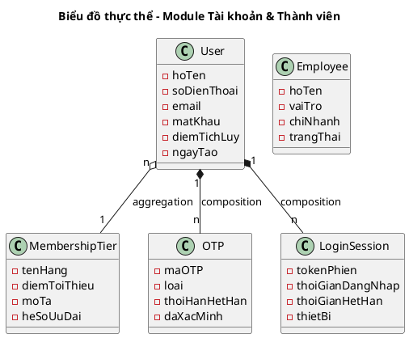
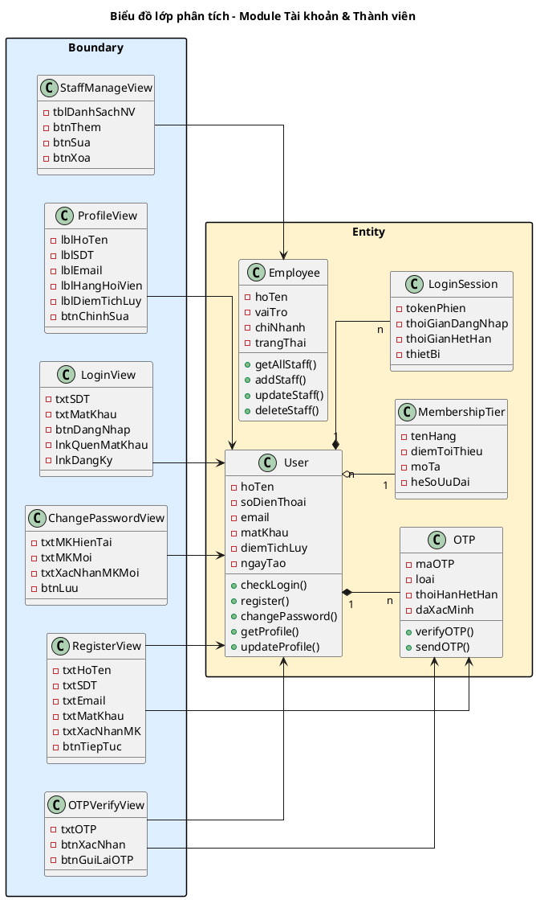
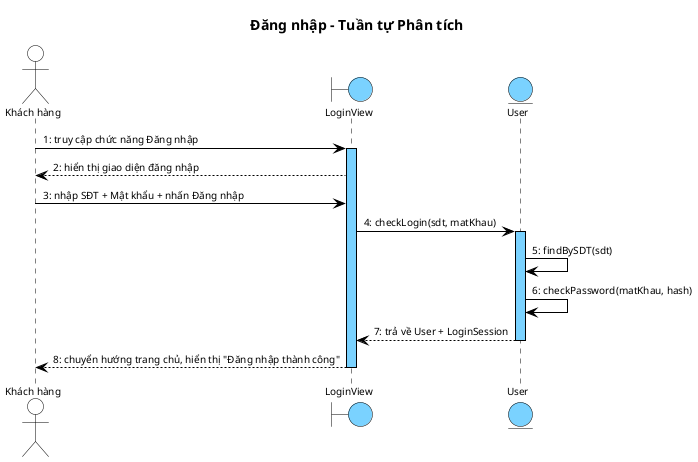
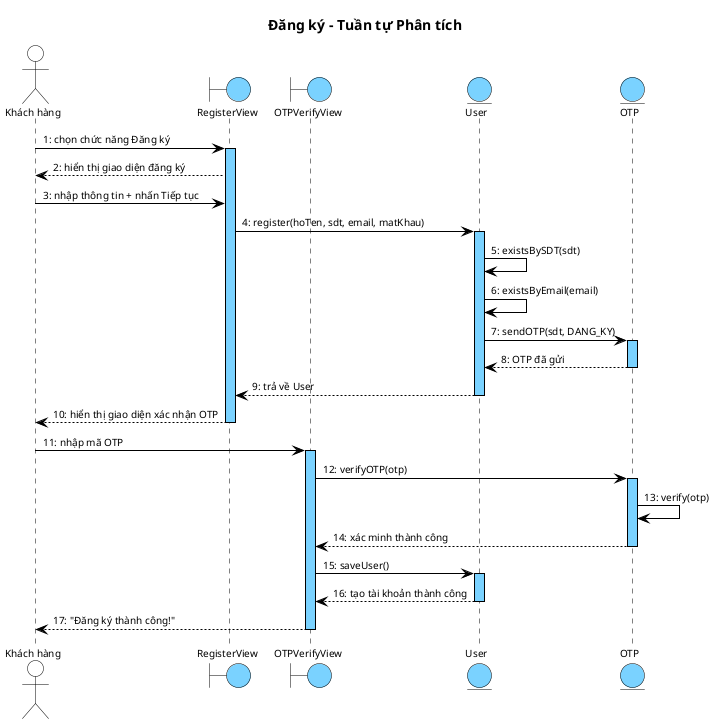
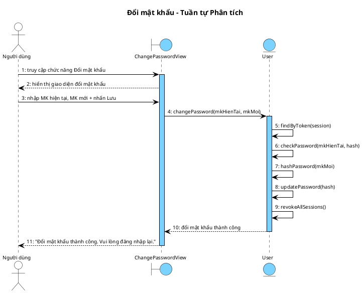
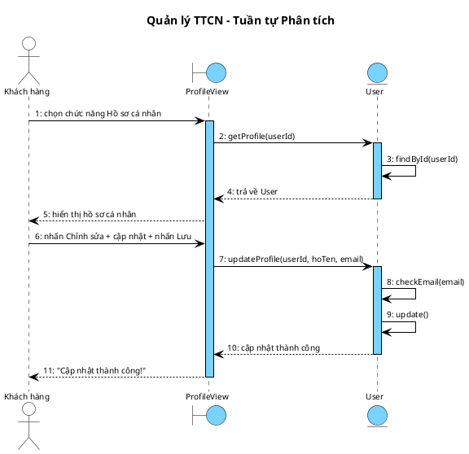
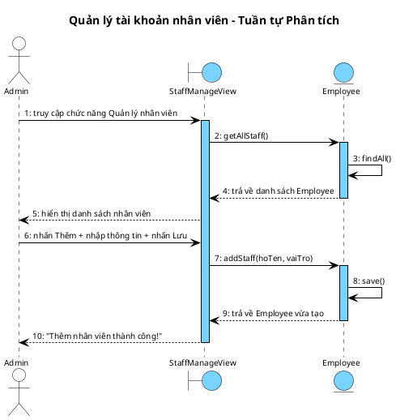

## II. PHA PHÂN TÍCH

### 1. Kịch bản chuẩn

#### UC01 – Đăng nhập

| Trường | Nội dung |
|---|---|
| **Use case** | Đăng nhập |
| **Actor** | Khách hàng, Nhân viên |
| **Tiền điều kiện** | Người dùng chưa đăng nhập. Tài khoản đã tồn tại trong hệ thống. |
| **Hậu điều kiện** | Người dùng được xác thực thành công, hệ thống tạo phiên đăng nhập và chuyển hướng đến trang chủ tương ứng. |
| **Kịch bản chính** | 1. Người dùng truy cập chức năng "Đăng nhập". 2. Hệ thống hiển thị giao diện đăng nhập yêu cầu nhập thông tin đăng nhập. 3. Người dùng nhập SĐT/Email và Mật khẩu. 4. Người dùng nhấn nút xác nhận đăng nhập. 5. Hệ thống kiểm tra định dạng đầu vào. 6. Hệ thống truy vấn CSDL tìm tài khoản theo SĐT/Email, so sánh mật khẩu đã mã hóa. 7. Xác thực thành công, hệ thống tạo phiên đăng nhập với vai trò tương ứng. 8. Hệ thống chuyển hướng đến trang chủ, hiển thị thông báo "Đăng nhập thành công". |
| **Ngoại lệ** | 5. Hệ thống phát hiện định dạng đầu vào không hợp lệ. 5.1 Hệ thống hiển thị thông báo lỗi yêu cầu nhập lại. 5.2 Người dùng nhập lại thông tin (quay về Bước 4).  6. Hệ thống không tìm thấy tài khoản khớp SĐT/Email. 6.1 Hệ thống hiển thị thông báo "Tài khoản không tồn tại". 6.2 Người dùng chọn đăng ký tài khoản mới (chuyển sang UC02).  6. Mật khẩu không chính xác. 6.1 Hệ thống hiển thị thông báo "Sai mật khẩu". 6.2 Người dùng nhập lại mật khẩu (quay về Bước 4). |

#### UC02 – Đăng ký

| Trường | Nội dung |
|---|---|
| **Use case** | Đăng ký |
| **Actor** | Khách hàng |
| **Tiền điều kiện** | Người dùng chưa có tài khoản. Hệ thống hoạt động bình thường. |
| **Hậu điều kiện** | Tài khoản mới được tạo, hạng "Thường", đăng nhập tự động. |
| **Kịch bản chính** | 1. Người dùng chọn chức năng "Đăng ký" từ giao diện đăng nhập. 2. Hệ thống hiển thị giao diện đăng ký yêu cầu nhập thông tin. 3. Người dùng nhập Họ tên, SĐT, Email, Mật khẩu, Xác nhận mật khẩu. 4. Người dùng nhấn nút Tiếp tục. 5. Hệ thống kiểm tra định dạng, SĐT và Email chưa tồn tại trong CSDL. 6. Hệ thống gửi mã OTP 6 chữ số đến SĐT. 7. Hệ thống hiển thị giao diện yêu cầu nhập mã OTP. 8. Người dùng nhập mã OTP và nhấn nút Xác nhận. 9. Hệ thống xác minh mã OTP đúng và còn hiệu lực. 10. Hệ thống tạo tài khoản mới, hạng "Thường", điểm tích lũy bằng 0. 11. Hệ thống tự động đăng nhập, hiển thị thông báo "Đăng ký thành công!". |
| **Ngoại lệ** | 5. Hệ thống phát hiện SĐT hoặc Email đã tồn tại. 5.1 Hệ thống hiển thị thông báo "SĐT hoặc Email đã được sử dụng". 5.2 Người dùng nhập lại thông tin khác (quay về Bước 4).  5. Hệ thống phát hiện định dạng đầu vào không hợp lệ. 5.1 Hệ thống hiển thị thông báo lỗi cụ thể. 5.2 Người dùng nhập lại thông tin (quay về Bước 4).  9. Mã OTP sai hoặc đã hết hiệu lực. 9.1 Hệ thống hiển thị thông báo "Mã OTP không hợp lệ hoặc đã hết hạn". 9.2 Người dùng chọn gửi lại mã OTP (quay về Bước 8). |

#### UC03 – Đổi mật khẩu

| Trường | Nội dung |
|---|---|
| **Use case** | Đổi mật khẩu |
| **Actor** | Khách hàng, Nhân viên (đã đăng nhập) |
| **Tiền điều kiện** | Người dùng đã đăng nhập thành công. |
| **Hậu điều kiện** | Mật khẩu mới được lưu (mã hóa). Tất cả phiên đăng nhập khác bị thu hồi. |
| **Kịch bản chính** | 1. Người dùng truy cập chức năng "Đổi mật khẩu". 2. Hệ thống hiển thị giao diện yêu cầu nhập mật khẩu hiện tại và mật khẩu mới. 3. Người dùng nhập Mật khẩu hiện tại, Mật khẩu mới, Xác nhận mật khẩu mới. 4. Người dùng nhấn nút Lưu thay đổi. 5. Hệ thống xác minh mật khẩu hiện tại khớp CSDL. 6. Hệ thống kiểm tra mật khẩu mới hợp lệ (độ dài tối thiểu 8 ký tự, có chữ hoa, chữ thường, số, ký tự đặc biệt). 7. Hệ thống kiểm tra mật khẩu mới khác mật khẩu hiện tại. 8. Hệ thống mã hóa và cập nhật mật khẩu mới vào CSDL. 9. Hệ thống thu hồi tất cả phiên đăng nhập khác. 10. Hệ thống hiển thị thông báo "Đổi mật khẩu thành công. Vui lòng đăng nhập lại." 11. Hệ thống chuyển hướng về giao diện đăng nhập. |
| **Ngoại lệ** | 5. Hệ thống phát hiện mật khẩu hiện tại không khớp. 5.1 Hệ thống hiển thị thông báo "Mật khẩu hiện tại không chính xác". 5.2 Người dùng nhập lại mật khẩu hiện tại (quay về Bước 4).  6. Hệ thống phát hiện mật khẩu mới không hợp lệ. 6.1 Hệ thống hiển thị thông báo lỗi yêu cầu mật khẩu đạt tiêu chuẩn. 6.2 Người dùng nhập lại mật khẩu mới (quay về Bước 4).  7. Hệ thống phát hiện mật khẩu mới trùng mật khẩu hiện tại. 7.1 Hệ thống hiển thị thông báo "Mật khẩu mới phải khác mật khẩu hiện tại". 7.2 Người dùng nhập lại mật khẩu mới (quay về Bước 4). |

#### UC04 – Quản lý thông tin cá nhân

| Trường | Nội dung |
|---|---|
| **Use case** | Quản lý thông tin cá nhân |
| **Actor** | Khách hàng (đã đăng nhập) |
| **Tiền điều kiện** | Khách hàng đã đăng nhập. Tài khoản tồn tại trong CSDL. |
| **Hậu điều kiện** | Thông tin cập nhật trong CSDL, hiển thị ngay trên giao diện. |
| **Kịch bản chính** | 1. Khách hàng chọn chức năng "Hồ sơ cá nhân". 2. Hệ thống truy xuất thông tin từ CSDL và hiển thị trang hồ sơ cá nhân: <table><tr><th>Họ tên</th><th>SĐT</th><th>Email</th><th>Hạng hội viên</th><th>Điểm tích lũy</th><th>Ngày tham gia</th></tr><tr><td>Nguyễn Văn A</td><td>0912345678</td><td>nva@gmail.com</td><td>Bạc</td><td>1.250</td><td>15/03/2025</td></tr></table> 3. Khách hàng nhấn chọn chỉnh sửa thông tin. 4. Hệ thống chuyển sang chế độ chỉnh sửa: Họ tên và Email cho phép sửa, SĐT bị khóa. 5. Khách hàng cập nhật Họ tên và Email. 6. Khách hàng nhấn nút Lưu thay đổi. 7. Hệ thống kiểm tra email hợp lệ và chưa được dùng bởi tài khoản khác. 8. Hệ thống cập nhật thông tin vào CSDL. 9. Hệ thống hiển thị thông báo "Cập nhật thành công!" và quay về chế độ xem. |
| **Ngoại lệ** | 7. Hệ thống phát hiện email không hợp lệ hoặc đã được dùng. 7.1 Hệ thống hiển thị thông báo "Email không hợp lệ hoặc đã được sử dụng". 7.2 Khách hàng nhập lại email khác (quay về Bước 6). |

#### UC20 – Quản lý tài khoản nhân viên

| Trường | Nội dung |
|---|---|
| **Use case** | Quản lý tài khoản nhân viên |
| **Actor** | Chủ Doanh nghiệp (Admin) |
| **Tiền điều kiện** | Admin đã đăng nhập. Có quyền quản lý tài khoản nhân viên toàn hệ thống. |
| **Hậu điều kiện** | Tài khoản nhân viên được tạo/sửa/xóa trong CSDL. |
| **Kịch bản chính** | 1. Admin truy cập chức năng "Quản lý nhân viên". 2. Hệ thống truy xuất danh sách nhân viên từ CSDL và hiển thị: <table><tr><th>Họ tên</th><th>Vai trò</th><th>Chi nhánh</th><th>Trạng thái</th></tr><tr><td>Nguyễn Minh Tuấn</td><td>Lễ tân</td><td>Karaoke Star - CN1</td><td>Đang làm</td></tr><tr><td>Trần Thị Hương</td><td>Phục vụ</td><td>Karaoke Star - CN2</td><td>Đang làm</td></tr><tr><td>Lê Văn Khánh</td><td>Quản lý</td><td>Karaoke Star - CN1</td><td>Đang làm</td></tr></table> 3. Admin nhấn nút Thêm nhân viên. 4. Hệ thống hiển thị giao diện yêu cầu nhập thông tin nhân viên mới. 5. Admin nhập Họ tên, SĐT, Vai trò, Chi nhánh. 6. Admin nhấn nút Lưu. 7. Hệ thống kiểm tra SĐT chưa tồn tại trong CSDL. 8. Hệ thống tạo tài khoản nhân viên mới. 9. Hệ thống hiển thị thông báo "Thêm nhân viên thành công!" và cập nhật danh sách. 10. Admin nhấn nút Sửa trên một dòng nhân viên. 11. Hệ thống hiển thị giao diện chỉnh sửa với thông tin hiện tại. 12. Admin cập nhật thông tin và nhấn nút Lưu. 13. Hệ thống cập nhật thông tin vào CSDL. 14. Hệ thống hiển thị thông báo "Cập nhật thành công!". 15. Admin nhấn nút Xóa trên một dòng nhân viên. 16. Hệ thống yêu cầu xác nhận xóa. 17. Admin xác nhận xóa. 18. Hệ thống kiểm tra nhân viên không đang xử lý order. 19. Hệ thống chuyển trạng thái nhân viên thành "Đã nghỉ". 20. Hệ thống hiển thị thông báo "Xóa nhân viên thành công!". |
| **Ngoại lệ** | 7. Hệ thống phát hiện SĐT đã tồn tại. 7.1 Hệ thống hiển thị thông báo "SĐT đã được sử dụng". 7.2 Admin nhập lại SĐT khác (quay về Bước 6).  18. Hệ thống phát hiện nhân viên đang xử lý order. 18.1 Hệ thống hiển thị thông báo "Không thể xóa nhân viên đang xử lý order". 18.2 Admin hủy thao tác xóa. |

### 2. Mô hình hóa lớp

**Bước 1 – Mô tả chức năng bằng đoạn văn xuôi**

Hệ thống cho phép khách hàng đăng ký tài khoản hội viên mới bằng cách cung cấp họ tên, số điện thoại, email và mật khẩu; sau đó xác minh số điện thoại qua mã OTP trước khi hoàn tất đăng ký. Mỗi tài khoản gắn liền với một hạng hội viên (Thường, Bạc, Vàng, Kim Cương) dựa trên điểm tích lũy. Người dùng sau khi đăng nhập có thể xem và cập nhật thông tin cá nhân như họ tên và email, hoặc thực hiện đổi mật khẩu bằng cách xác minh mật khẩu cũ rồi nhập mật khẩu mới. Hệ thống ghi nhận các phiên đăng nhập để phục vụ bảo mật và thu hồi phiên khi đổi mật khẩu. Ngoài ra, chủ doanh nghiệp có quyền quản lý tài khoản nhân viên: tạo, chỉnh sửa và xóa tài khoản nhân viên trong hệ thống.

**Bước 2 + 3 – Trích danh từ và đánh giá**

▪ Hệ thống → loại: quá chung, không phải thực thể nghiệp vụ
▪ Khách hàng → lớp User: hoTen, soDienThoai, email, matKhau, ngayTao
▪ Tài khoản → thuộc về User (gộp vào User, tránh tách thừa)
▪ Họ tên → thuộc tính của User
▪ Số điện thoại → thuộc tính của User (dùng làm username đăng nhập)
▪ Email → thuộc tính của User
▪ Mật khẩu → thuộc tính của User (lưu dạng mã hóa)
▪ Ngày tham gia → thuộc tính ngayTao của User
▪ Hạng hội viên → lớp MembershipTier: tenHang, diemToiThieu, moTa, heSoUuDai
▪ Điểm tích lũy → thuộc tính diemTichLuy của User
▪ Mã OTP → lớp OTP: maOTP, loai, thoiHanHetHan, daXacMinh
▪ Phiên đăng nhập → lớp LoginSession: tokenPhien, thoiGianDangNhap, thoiGianHetHan, thietBi
▪ Lịch sử → loại: quá chung → cụ thể là LoginSession đã đủ
▪ Danh sách → loại: không phải thực thể
▪ Giao diện → loại: là Boundary, không phải Entity
▪ Nhân viên → lớp Employee: hoTen, vaiTro, chiNhanh, trangThai
▪ Chủ doanh nghiệp → loại: actor, không phải thực thể dữ liệu

**Bước 4 – Xác định quan hệ số lượng**

▪ 1 User có 1 MembershipTier → User – MembershipTier: n – 1
(nhiều người dùng có thể có cùng hạng)
▪ 1 User có nhiều OTP → User – OTP: 1 – n
(mỗi lần đăng ký/đổi SĐT tạo 1 OTP mới)
▪ 1 User có nhiều LoginSession → User – LoginSession: 1 – n
(người dùng có thể đăng nhập trên nhiều thiết bị)

**Bước 5 – Bổ sung quan hệ**

User gắn composition với OTP: một OTP không tồn tại độc lập nếu không có User tương ứng (khi xóa User thì xóa theo tất cả OTP). Tương tự, LoginSession không tồn tại độc lập khỏi User. Quan hệ với MembershipTier là aggregation: MembershipTier là dữ liệu danh mục tồn tại độc lập với User. Employee là lớp riêng biệt, không kế thừa từ User.

**Biểu đồ thực thể Module Tài khoản & Thành viên:**

<!-- PLACEHOLDER: account_entity_analysis -->

### 3. Biểu đồ lớp phân tích

**Phân tích chi tiết chức năng "Đăng nhập":**

Người dùng truy cập trang đăng nhập -> đề xuất lớp **LoginView**, có ô nhập SĐT, ô nhập mật khẩu, nút Đăng nhập.

Người dùng nhập SĐT, mật khẩu và nhấn nút Đăng nhập -> hệ thống cần xác thực tài khoản -> cần chức năng `checkLogin()` của đối tượng **User**.

Nếu tài khoản không tồn tại -> hệ thống hiển thị thông báo lỗi.
Nếu mật khẩu sai -> hệ thống hiển thị thông báo lỗi.

Hoàn tất, hệ thống tạo phiên đăng nhập và chuyển hướng trang chủ.

**Boundary:** LoginView
**Entity:** User

**Phân tích chi tiết chức năng "Đăng ký":**

Người dùng truy cập trang đăng ký -> đề xuất lớp **RegisterView**, có ô nhập Họ tên, SĐT, Email, Mật khẩu, Xác nhận MK, nút Tiếp tục.

Người dùng nhập thông tin và nhấn nút Tiếp tục -> hệ thống cần tạo tài khoản mới -> cần chức năng `register()` của đối tượng **User**.

Hệ thống gửi OTP đến SĐT -> đề xuất lớp **OTPVerifyView**, có ô nhập OTP, nút Xác nhận.

Người dùng nhập OTP và nhấn nút Xác nhận -> hệ thống cần xác minh OTP -> cần chức năng `verifyOTP()` của đối tượng **OTP**.

Hoàn tất, hệ thống tạo tài khoản mới và tự động đăng nhập.

**Boundary:** RegisterView, OTPVerifyView
**Entity:** User, OTP

**Phân tích chi tiết chức năng "Đổi mật khẩu":**

Người dùng truy cập trang bảo mật -> đề xuất lớp **ChangePasswordView**, có ô nhập MK hiện tại, MK mới, Xác nhận MK mới, nút Lưu.

Người dùng nhập MK hiện tại, MK mới và nhấn nút Lưu -> hệ thống cần đổi mật khẩu -> cần chức năng `changePassword()` của đối tượng **User**.

Nếu MK hiện tại sai -> hệ thống hiển thị thông báo lỗi.
Nếu MK mới không hợp lệ -> hệ thống hiển thị thông báo lỗi.

Hoàn tất, hệ thống cập nhật mật khẩu mới và thu hồi tất cả phiên đăng nhập khác.

**Boundary:** ChangePasswordView
**Entity:** User

**Phân tích chi tiết chức năng "Quản lý thông tin cá nhân":**

Người dùng nhấn vào ảnh đại diện -> đề xuất lớp **ProfileView**, có hiển thị Họ tên, SĐT, Email, Hạng hội viên, Điểm tích lũy, nút Chỉnh sửa.

Hệ thống cần lấy thông tin hồ sơ -> cần chức năng `getProfile()` của đối tượng **User**.

Người dùng nhấn Chỉnh sửa, sửa thông tin và nhấn Lưu -> hệ thống cần cập nhật hồ sơ -> cần chức năng `updateProfile()` của đối tượng **User**.

Nếu email không hợp lệ hoặc đã được dùng -> hệ thống hiển thị thông báo lỗi.

Hoàn tất, hệ thống cập nhật hồ sơ vào CSDL.

**Boundary:** ProfileView
**Entity:** User

**Phân tích chi tiết chức năng "Quản lý nhân viên":**

Admin truy cập trang quản lý nhân viên -> đề xuất lớp **StaffManageView**, có bảng danh sách nhân viên, nút Thêm, Sửa, Xóa.

Hệ thống cần tải danh sách nhân viên -> cần chức năng `getAllStaff()` của đối tượng **Employee**.

Admin nhấn Thêm, nhập thông tin và nhấn Lưu -> hệ thống cần tạo nhân viên mới -> cần chức năng `addStaff()` của đối tượng **Employee**.

Admin nhấn Sửa trên một dòng, cập nhật và nhấn Lưu -> hệ thống cần cập nhật nhân viên -> cần chức năng `updateStaff()` của đối tượng **Employee**.

Admin nhấn Xóa trên một dòng, xác nhận -> hệ thống cần xóa nhân viên -> cần chức năng `deleteStaff()` của đối tượng **Employee**.

Nếu nhân viên đang xử lý order -> hệ thống hiển thị thông báo lỗi.

Hoàn tất, hệ thống cập nhật danh sách nhân viên.

**Boundary:** StaffManageView
**Entity:** Employee

**Sơ đồ lớp phân tích – Module Tài khoản & Thành viên:**

<!-- PLACEHOLDER: account_class_analysis -->

### 4. Biểu đồ tuần tự phân tích

#### UC01 – Đăng nhập

<!-- PLACEHOLDER: account_seq_login_analysis -->
<!-- File: output/diagrams/account_seq_login_analysis.png -->

**Kịch bản phiên bản 2 – UC01 Đăng nhập**

1. Khách hàng truy cập chức năng Đăng nhập.
2. Lớp LoginView hiển thị giao diện yêu cầu nhập thông tin đăng nhập.
3. Khách hàng nhập SĐT và Mật khẩu.
4. Khách hàng nhấn nút Đăng nhập.
5. Lớp LoginView gọi hàm `checkLogin()` của đối tượng User.
6. Lớp User gọi hàm `findBySDT()` để tìm tài khoản theo SĐT.
7. Lớp User gọi hàm `checkPassword()` để so sánh mật khẩu.
8. Lớp User trả kết quả về cho LoginView.
9. Lớp LoginView hiển thị "Đăng nhập thành công" và chuyển hướng trang chủ.

#### UC02 – Đăng ký

<!-- PLACEHOLDER: account_seq_register_analysis -->
<!-- File: output/diagrams/account_seq_register_analysis.png -->

**Kịch bản phiên bản 2 – UC02 Đăng ký**

1. Khách hàng chọn chức năng Đăng ký từ giao diện đăng nhập.
2. Lớp RegisterView hiển thị giao diện yêu cầu nhập thông tin đăng ký.
3. Khách hàng nhập Họ tên, SĐT, Email, Mật khẩu, Xác nhận mật khẩu.
4. Khách hàng nhấn nút Tiếp tục.
5. Lớp RegisterView gọi hàm `register()` của đối tượng User.
6. Lớp User gọi hàm `existsBySDT()` để kiểm tra SĐT chưa tồn tại.
7. Lớp User gọi hàm `existsByEmail()` để kiểm tra Email chưa tồn tại.
8. Lớp User gọi hàm `sendOTP()` của đối tượng OTP để gửi mã xác minh.
9. Lớp User trả kết quả về cho RegisterView.
10. Lớp RegisterView hiển thị giao diện xác nhận OTP.
11. Khách hàng nhập mã OTP và nhấn nút Xác nhận.
12. Lớp OTPVerifyView gọi hàm `verifyOTP()` của đối tượng OTP.
13. Lớp OTP gọi hàm `verify()` để kiểm tra mã đúng và còn hiệu lực.
14. Lớp OTPVerifyView gọi hàm `saveUser()` của đối tượng User để hoàn tất đăng ký.
15. Lớp OTPVerifyView hiển thị "Đăng ký thành công!"

#### UC03 – Đổi mật khẩu

<!-- PLACEHOLDER: account_seq_changepw_analysis -->
<!-- File: output/diagrams/account_seq_changepw_analysis.png -->

**Kịch bản phiên bản 2 – UC03 Đổi mật khẩu**

1. Người dùng truy cập chức năng Đổi mật khẩu.
2. Lớp ChangePasswordView hiển thị giao diện yêu cầu nhập mật khẩu hiện tại và mật khẩu mới.
3. Người dùng nhập Mật khẩu hiện tại, Mật khẩu mới, Xác nhận mật khẩu mới.
4. Người dùng nhấn nút Lưu thay đổi.
5. Lớp ChangePasswordView gọi hàm `changePassword()` của đối tượng User.
6. Lớp User gọi hàm `findBySessionToken()` để tìm thông tin người dùng.
7. Lớp User gọi hàm `verifyPassword()` để xác minh mật khẩu hiện tại.
8. Lớp User gọi hàm `hashPassword()` để mã hóa mật khẩu mới.
9. Lớp User gọi hàm `updatePassword()` để cập nhật mật khẩu.
10. Lớp User gọi hàm `revokeAllSessions()` để thu hồi tất cả phiên đăng nhập khác.
11. Lớp User trả kết quả về cho ChangePasswordView.
12. Lớp ChangePasswordView hiển thị "Đổi mật khẩu thành công. Vui lòng đăng nhập lại."

#### UC04 – Quản lý thông tin cá nhân

<!-- PLACEHOLDER: account_seq_profile_analysis -->
<!-- File: output/diagrams/account_seq_profile_analysis.png -->

**Kịch bản phiên bản 2 – UC04 Quản lý thông tin cá nhân**

1. Khách hàng chọn chức năng Hồ sơ cá nhân.
2. Lớp ProfileView gọi hàm `getProfile()` của đối tượng User.
3. Lớp User gọi hàm `findById()` để tìm thông tin người dùng.
4. Lớp User trả kết quả về cho ProfileView.
5. Lớp ProfileView hiển thị hồ sơ: Họ tên, SĐT, Email, Hạng hội viên, Điểm tích lũy.
6. Khách hàng nhấn nút Chỉnh sửa thông tin, cập nhật thông tin và nhấn nút Lưu.
7. Lớp ProfileView gọi hàm `updateProfile()` của đối tượng User.
8. Lớp User gọi hàm `checkEmail()` để kiểm tra email hợp lệ và chưa được dùng.
9. Lớp User gọi hàm `update()` để cập nhật thông tin.
10. Lớp User trả kết quả về cho ProfileView.
11. Lớp ProfileView hiển thị "Cập nhật thành công!"

#### UC20 – Quản lý tài khoản nhân viên

<!-- PLACEHOLDER: account_seq_staff_analysis -->
<!-- File: output/diagrams/account_seq_staff_analysis.png -->

**Kịch bản phiên bản 2 – UC20 Quản lý tài khoản nhân viên**

1. Admin truy cập chức năng Quản lý nhân viên từ trang quản trị.
2. Lớp StaffManageView gọi hàm `getAllStaff()` của đối tượng Employee.
3. Lớp Employee gọi hàm `findAll()` để tải danh sách nhân viên.
4. Lớp Employee trả kết quả về cho StaffManageView.
5. Lớp StaffManageView hiển thị bảng danh sách nhân viên.
6. Admin nhấn nút Thêm, nhập thông tin nhân viên và nhấn nút Lưu.
7. Lớp StaffManageView gọi hàm `addStaff()` của đối tượng Employee.
8. Lớp Employee gọi hàm `save()` để lưu nhân viên mới.
9. Lớp Employee trả kết quả về cho StaffManageView.
10. Lớp StaffManageView hiển thị "Thêm nhân viên thành công!"
