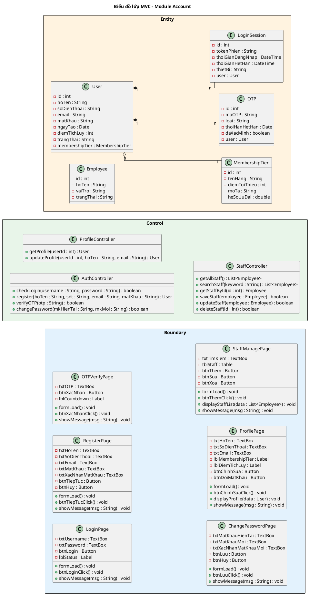

## III. PHA THIẾT KẾ

### 1. Thiết kế lớp thực thể

#### Bước 1 – Bổ sung thuộc tính id

- User: `id : int`
- MembershipTier: `id : int`
- OTP: `id : int`
- LoginSession: `id : int`
- Employee: `id : int`

#### Bước 2 – Thêm kiểu dữ liệu

- User: `id : int`, `hoTen : String`, `soDienThoai : String`, `email : String`, `matKhau : String`, `ngayTao : Date`, `diemTichLuy : int`, `trangThai : String`
- MembershipTier: `id : int`, `tenHang : String`, `diemToiThieu : int`, `moTa : String`, `heSoUuDai : double`
- OTP: `id : int`, `maOTP : String`, `loai : String`, `thoiHanHetHan : Date`, `daXacMinh : boolean`
- LoginSession: `id : int`, `tokenPhien : String`, `thoiGianDangNhap : DateTime`, `thoiGianHetHan : DateTime`, `thietBi : String`
- Employee: `id : int`, `hoTen : String`, `vaiTro : String`, `trangThai : String`

#### Bước 3 – Chuyển quan hệ

- User `o--` MembershipTier: aggregation (hạng hội viên là danh mục độc lập)
- User `*--` OTP: composition (OTP không tồn tại độc lập)
- User `*--` LoginSession: composition (phiên không tồn tại độc lập)

#### Bước 4 – Bổ sung thuộc tính kiểu đối tượng

- User: `membershipTier : MembershipTier`
- LoginSession: `user : User`
- OTP: `user : User`

#### Biểu đồ lớp thực thể

<!-- PLACEHOLDER: account_entity_class -->
<!-- File: output/diagrams/account_entity_class.png -->

### 2. Thiết kế CSDL

#### Bước 1 – Tạo bảng

| Lớp thực thể | Tên bảng |
|--------------|----------|
| User | tblUser |
| MembershipTier | tblMembershipTier |
| OTP | tblOTP |
| LoginSession | tblLoginSession |
| Employee | tblEmployee |

#### Bước 2 – Chuyển kiểu dữ liệu

| Kiểu Java | Kiểu SQL |
|-----------|----------|
| int | integer(10) |
| String | varchar(255) |
| double | double(10) |
| Date | date |
| DateTime | datetime |

#### Bước 3 – Xử lý cardinality

- User – MembershipTier (n-1): tblUser có FK `tblMembershipTierMa`
- User – OTP (1-n): tblOTP có FK `tblUserMa`
- User – LoginSession (1-n): tblLoginSession có FK `tblUserMa`

#### Bước 4 – PK/FK

- PK: `ma : integer(10) <<PK>>`
- FK: `tbl[TenBangCha]Ma : integer(10) <<FK>>`

#### Biểu đồ ERD

<!-- PLACEHOLDER: account_erd -->
<!-- File: output/diagrams/account_erd.png -->

### 3. Wireframe

<!-- PLACEHOLDER: WIREFRAMES -->
<!-- Wireframes sẽ được render thành monospace frames trong DOCX -->

#### Màn hình 1: LoginView

```
┌──────────────────────────────────────────────┐
│              Đăng nhập                       │
│                                              │
│  SĐT / Email: [________________________]     │
│  Mật khẩu:    [________________________]     │
│                                              │
│  [Đăng nhập]                                 │
│  Quên mật khẩu?  |  Đăng ký mới             │
└──────────────────────────────────────────────┘
```

#### Màn hình 2: RegisterView

```
┌──────────────────────────────────────────────┐
│              Đăng ký tài khoản                │
│                                              │
│  Họ và tên:      [________________________]  │
│  Số điện thoại:   [________________________]  │
│  Email:           [________________________]  │
│  Mật khẩu:       [________________________]  │
│  Xác nhận MK:    [________________________]  │
│                                              │
│  [Tiếp tục]                 [Hủy]           │
└──────────────────────────────────────────────┘
```

#### Màn hình 3: OTPVerifyView

```
┌──────────────────────────────────────────────┐
│           Xác nhận OTP                       │
│                                              │
│  Mã OTP đã gửi đến 098****321               │
│                                              │
│  [__][__][__][__][__][__]                    │
│                                              │
│  [Xác nhận]                                  │
│  Gửi lại OTP (60s)                          │
└──────────────────────────────────────────────┘
```

#### Màn hình 4: ChangePasswordView

```
┌──────────────────────────────────────────────┐
│           Đổi mật khẩu                       │
│                                              │
│  Mật khẩu hiện tại: [________________________]│
│  Mật khẩu mới:      [________________________]│
│  Xác nhận MK mới:   [________________________]│
│                                              │
│  [Lưu thay đổi]          [Hủy]              │
└──────────────────────────────────────────────┘
```

#### Màn hình 5: ProfileView

```
┌──────────────────────────────────────────────┐
│           Hồ sơ cá nhân                      │
│                                              │
│  Họ và tên:      Nguyễn Văn An              │
│  Số điện thoại:   0912345678                 │
│  Email:           vana@email.com             │
│  Hạng hội viên:  Bạc (1.250 điểm)          │
│  Ngày tham gia:   15/03/2024                 │
│                                              │
│  [Chỉnh sửa thông tin]  [Đổi mật khẩu]      │
└──────────────────────────────────────────────┘
```

#### Màn hình 6: StaffManageView

```
┌──────────────────────────────────────────────┐
│        Quản lý tài khoản nhân viên           │
│                                              │
│  [Thêm nhân viên]                            │
│                                              │
│ ┌──────┬────────┬──────────┬──────────┐      │
│ │ Họ tên│ Vai trò│ Trạng thái│ ...     │      │
│ │ Trần A│ Lễ tân │ Đang LD  │         │      │
│ │ Lê B  │ Phục vụ│ Đang LD  │         │      │
│ └──────┴────────┴──────────┴──────────┘      │
│                                              │
│  [Sửa]  [Xóa]                               │
└──────────────────────────────────────────────┘
```

### 4. MVC class diagram

Mô hình thiết kế theo kiến trúc MVC (Boundary – Control – Entity):

**Boundary:** LoginPage, RegisterPage, OTPVerifyPage, ChangePasswordPage, ProfilePage, StaffManagePage

**Control:** AuthController, ProfileController, StaffController

**Entity:** User, MembershipTier, OTP, LoginSession, Employee

**Quy trình xác định chữ ký hàm Controller:**

a) Đăng nhập => `checkLogin()`
- Input: username, password
- Output: boolean
- Ứng viên tham số vào:
  - `checkLogin(username: String, password: String)` → chọn (gom nhóm tham số)
- Ứng viên tham số ra:
  - `checkLogin(): void` → loại (cần trả về kết quả xác thực)
  - `checkLogin(): boolean` → chọn (trả về true/false xác thực thành công)

b) Đăng ký => `register()`
- Input: hoTen, sdt, email, matKhau
- Output: User (vừa tạo)
- Ứng viên tham số vào:
  - `register(hoTen: String, sdt: String, email: String, matKhau: String)` → chọn
- Ứng viên tham số ra:
  - `register(): User` → chọn

c) Xác minh OTP => `verifyOTP()`
- Input: otp
- Output: boolean
- Ứng viên tham số vào:
  - `verifyOTP(otp: String)` → chọn
- Ứng viên tham số ra:
  - `verifyOTP(): boolean` → chọn (cần biết đúng/sai)

d) Đổi mật khẩu => `changePassword()`
- Input: mkHienTai, mkMoi
- Output: boolean
- Ứng viên tham số vào:
  - `changePassword(mkHienTai: String, mkMoi: String)` → chọn
- Ứng viên tham số ra:
  - `changePassword(): boolean` → chọn

e) Xem hồ sơ => `getProfile()`
- Input: userId
- Output: User
- Ứng viên tham số vào:
  - `getProfile(userId: int)` → chọn
- Ứng viên tham số ra:
  - `getProfile(): User` → chọn

f) Cập nhật hồ sơ => `updateProfile()`
- Input: userId, hoTen, email
- Output: User
- Ứng viên tham số vào:
  - `updateProfile(userId: int, hoTen: String, email: String)` → chọn
- Ứng viên tham số ra:
  - `updateProfile(): User` → chọn

g) Xem danh sách NV => `getAllStaff()`
- Input: (không có)
- Output: List\<Employee\>
- Ứng viên tham số vào:
  - `getAllStaff()` → chọn
- Ứng viên tham số ra:
  - `getAllStaff(): List<Employee>` → chọn

h) Tìm kiếm NV => `searchStaff()`
- Input: keyword
- Output: List\<Employee\>
- Ứng viên tham số vào:
  - `searchStaff(keyword: String)` → chọn
- Ứng viên tham số ra:
  - `searchStaff(): List<Employee>` → chọn

i) Lấy NV theo id => `getStaffById()`
- Input: id
- Output: Employee
- Ứng viên tham số vào:
  - `getStaffById(id: int)` → chọn
- Ứng viên tham số ra:
  - `getStaffById(): Employee` → chọn

j) Thêm NV => `saveStaff()`
- Input: employee
- Output: boolean
- Ứng viên tham số vào:
  - `saveStaff(employee: Employee)` → chọn
- Ứng viên tham số ra:
  - `saveStaff(): boolean` → chọn (cần biết thành công/thất bại)

k) Sửa NV => `updateStaff()`
- Input: employee
- Output: boolean
- Ứng viên tham số vào:
  - `updateStaff(employee: Employee)` → chọn
- Ứng viên tham số ra:
  - `updateStaff(): boolean` → chọn

l) Xóa NV => `deleteStaff()`
- Input: id
- Output: boolean
- Ứng viên tham số vào:
  - `deleteStaff(id: int)` → chọn
- Ứng viên tham số ra:
  - `deleteStaff(): boolean` → chọn (cần biết thành công/thất bại)



<!-- PLACEHOLDER: account_dao_class -->
<!-- File: output/diagrams/account_mvc_class.png -->

### 5. Biểu đồ tuần tự thiết kế

### Đăng nhập

<!-- PLACEHOLDER: account_seq_login_design -->
<!-- File: output/diagrams/account_seq_login.png -->

```plantuml
@startuml
title Đăng nhập – Tuần tự Thiết kế

left to right direction
skinparam linetype ortho

actor "Khách hàng" as KH
participant "LoginPage\n<<Boundary>>" as B1
participant "AuthController\n<<Control>>" as C1
entity "User\n<<Entity>>" as E1

KH -> B1 : 1: truy cập /login
activate B1
B1 --> KH : 2: render form đăng nhập
KH -> B1 : 3: nhập SĐT + Mật khẩu + click [Đăng nhập]
B1 -> B1 : 4: btnLoginClick()
B1 -> C1 : 5: checkLogin(username : String, password : String) : boolean
activate C1
C1 -> E1 : 6: findBySDT(username : String) : User
activate E1
E1 --> C1 : 7: User
deactivate E1
C1 -> C1 : 8: checkPassword(password : String, hash : String) : boolean
C1 --> B1 : 9: true
deactivate C1
B1 --> KH : 10: redirect /home, showMessage("Đăng nhập thành công")
deactivate B1

alt findBySDT() trả về null
  C1 --> B1 : false
  B1 --> KH : showMessage("Tài khoản không tồn tại")
end

alt checkPassword() trả về false
  C1 --> B1 : false
  B1 --> KH : showMessage("Mật khẩu không chính xác. Còn [N] lần thử")
end
@enduml
```

**Kịch bản phiên bản 3 – UC01 Đăng nhập**

1. Khách hàng truy cập URL `/login` trên trình duyệt.
2. Phương thức `formLoad()` của lớp LoginPage được gọi, hiển thị form gồm ô nhập SĐT/Email, ô nhập Mật khẩu, nút [Đăng nhập], liên kết "Quên mật khẩu?" / "Đăng ký".
3. Khách hàng nhập SĐT = "0912345678" và Mật khẩu = "Abc@1234".
4. Khách hàng click nút [Đăng nhập].
5. Phương thức `btnLoginClick()` của lớp LoginPage được gọi.
6. Phương thức `btnLoginClick()` gọi phương thức `checkLogin(username : String, password : String) : boolean` của lớp AuthController.
7. Phương thức `checkLogin()` gọi phương thức `findBySDT(username : String) : User` của lớp User.
8. Lớp User trả về đối tượng User cho phương thức `checkLogin()`.
9. Phương thức `checkLogin()` gọi `checkPassword(password : String, hash : String) : boolean` để so sánh mật khẩu.
10. Phương thức `checkLogin()` trả về `true` cho phương thức `btnLoginClick()`.
11. Phương thức `btnLoginClick()` gọi `redirect /home`, hiển thị showMessage("Đăng nhập thành công. Xin chào, Nguyễn Văn A!").

**Ngoại lệ: tài khoản không tồn tại**
- Phương thức `findBySDT()` trả về `null`.
- Phương thức `checkLogin()` trả về `false` cho `btnLoginClick()`.
- Lớp LoginPage hiển thị showMessage("Tài khoản không tồn tại. Vui lòng kiểm tra lại.")

**Ngoại lệ: mật khẩu sai**
- Phương thức `checkPassword()` trả về `false`.
- Phương thức `checkLogin()` trả về `false` cho `btnLoginClick()`.
- Lớp LoginPage hiển thị showMessage("Mật khẩu không chính xác. Còn [N] lần thử.")

### Đăng ký

<!-- PLACEHOLDER: account_seq_register_design -->
<!-- File: output/diagrams/account_seq_register.png -->

```plantuml
@startuml
title Đăng ký – Tuần tự Thiết kế

left to right direction
skinparam linetype ortho

actor "Khách hàng" as KH
participant "RegisterPage\n<<Boundary>>" as B1
participant "OTPVerifyPage\n<<Boundary>>" as B2
participant "AuthController\n<<Control>>" as C1
entity "User\n<<Entity>>" as E1
entity "OTP\n<<Entity>>" as E2

KH -> B1 : 1: click "Đăng ký" từ /login
activate B1
B1 --> KH : 2: render form đăng ký
KH -> B1 : 3: nhập Họ tên, SĐT, Email, Mật khẩu + click [Tiếp tục]
B1 -> B1 : 4: btnTiepTucClick()
B1 -> C1 : 5: register(hoTen : String, sdt : String, email : String, matKhau : String) : User
activate C1
C1 -> E1 : 6: existsBySDT(sdt : String) : boolean
activate E1
E1 --> C1 : 7: false
deactivate E1
C1 -> E1 : 8: existsByEmail(email : String) : boolean
activate E1
E1 --> C1 : 9: false
deactivate E1
C1 -> E1 : 10: save() : User
activate E1
E1 --> C1 : 11: User
deactivate E1
C1 -> E2 : 12: sendOTP(sdt : String, loai : String) : void
activate E2
E2 --> C1 : 13: OTP sent
deactivate E2
C1 --> B1 : 14: User
deactivate C1
B1 --> KH : 15: render OTPVerifyPage
deactivate B1

KH -> B2 : 16: nhập OTP = "482917" + click [Xác nhận]
activate B2
B2 -> B2 : 17: btnXacNhanClick()
B2 -> C1 : 18: verifyOTP(otp : String) : boolean
activate C1
C1 -> E2 : 19: verify(otp : String) : boolean
activate E2
E2 --> C1 : 20: true
deactivate E2
C1 --> B2 : 21: true
deactivate C1
B2 --> KH : 22: showMessage("Đăng ký thành công! Chào mừng Nguyễn Thị Bình.")
deactivate B2

alt existsBySDT() trả về true
  C1 --> B1 : error "SĐT đã tồn tại"
  B1 --> KH : showMessage("SĐT này đã được sử dụng.")
end

alt verify() trả về false
  C1 --> B2 : false
  B2 --> KH : showMessage("Mã OTP không đúng. Vui lòng thử lại.")
end
@enduml
```

**Kịch bản phiên bản 3 – UC02 Đăng ký**

1. Khách hàng click liên kết "Đăng ký" từ trang `/login`.
2. Phương thức `formLoad()` của lớp RegisterPage được gọi, hiển thị form gồm: Họ tên, SĐT, Email, Mật khẩu, Xác nhận MK.
3. Khách hàng nhập: Họ tên = "Nguyễn Thị Bình", SĐT = "0987654321", Email = "binh.nt@email.com", MK = "Pass@2025".
4. Khách hàng click nút [Tiếp tục].
5. Phương thức `btnTiepTucClick()` của lớp RegisterPage được gọi.
6. Phương thức `btnTiepTucClick()` gọi phương thức `register(hoTen : String, sdt : String, email : String, matKhau : String) : User` của lớp AuthController.
7. Phương thức `register()` gọi `existsBySDT(sdt : String) : boolean` của lớp User để kiểm tra SĐT.
8. User trả về `false` (SĐT chưa tồn tại).
9. Phương thức `register()` gọi `existsByEmail(email : String) : boolean` của lớp User để kiểm tra email.
10. User trả về `false` (email chưa tồn tại).
11. Phương thức `register()` gọi `save() : User` để tạo tài khoản mới.
12. Phương thức `register()` gọi `sendOTP(sdt : String, loai : String) : void` của lớp OTP.
13. OTP gửi mã OTP 6 chữ số đến SĐT.
14. Phương thức `register()` trả về đối tượng User cho `btnTiepTucClick()`.
15. RegisterPage hiển thị trang OTPVerifyPage.
16. Khách hàng nhập OTP = "482917" và click [Xác nhận].
17. Phương thức `btnXacNhanClick()` của lớp OTPVerifyPage được gọi.
18. OTPVerifyPage gọi `verifyOTP(otp : String) : boolean` của AuthController.
19. AuthController gọi `verify(otp : String) : boolean` của lớp OTP.
20. OTP trả về `true`.
21. AuthController trả về `true` cho OTPVerifyPage.
22. OTPVerifyPage hiển thị showMessage("Đăng ký thành công! Chào mừng Nguyễn Thị Bình.")

**Ngoại lệ: SĐT đã tồn tại**
- Phương thức `existsBySDT()` trả về `true`.
- AuthController trả về lỗi cho RegisterPage.
- RegisterPage hiển thị showMessage("SĐT này đã được sử dụng.")

**Ngoại lệ: OTP sai**
- Phương thức `verify()` trả về `false`.
- AuthController trả về `false` cho OTPVerifyPage.
- OTPVerifyPage hiển thị showMessage("Mã OTP không đúng. Vui lòng thử lại.")

### Đổi mật khẩu

<!-- PLACEHOLDER: account_seq_changepw_design -->
<!-- File: output/diagrams/account_seq_changepw.png -->

```plantuml
@startuml
title Đổi mật khẩu – Tuần tự Thiết kế

left to right direction
skinparam linetype ortho

actor "Người dùng" as User
participant "ChangePasswordPage\n<<Boundary>>" as B1
participant "AuthController\n<<Control>>" as C1
entity "User\n<<Entity>>" as E1

User -> B1 : 1: truy cập /security
activate B1
B1 --> User : 2: render form đổi mật khẩu
User -> B1 : 3: nhập MK hiện tại, MK mới, xác nhận + click [Lưu]
B1 -> B1 : 4: btnLuuClick()
B1 -> C1 : 5: changePassword(mkHienTai : String, mkMoi : String) : boolean
activate C1
C1 -> E1 : 6: findById(userId : int) : User
activate E1
E1 --> C1 : 7: User
deactivate E1
C1 -> C1 : 8: checkPassword(mkHienTai : String, hash : String) : boolean
C1 -> C1 : 9: hashPassword(mkMoi : String) : String
C1 -> E1 : 10: updatePassword(hash : String) : boolean
activate E1
E1 --> C1 : 11: true
deactivate E1
C1 -> E1 : 12: revokeAllSessions() : void
activate E1
E1 --> C1 : 13: void
deactivate E1
C1 --> B1 : 14: true
deactivate C1
B1 --> User : 15: showMessage("Đổi mật khẩu thành công. Vui lòng đăng nhập lại.")
deactivate B1

alt checkPassword() trả về false
  C1 --> B1 : false
  B1 --> User : showMessage("Mật khẩu hiện tại không chính xác.")
end
@enduml
```

**Kịch bản phiên bản 3 – UC03 Đổi mật khẩu**

1. Người dùng truy cập URL `/security` trên trình duyệt.
2. Phương thức `formLoad()` của lớp ChangePasswordPage được gọi, hiển thị form: Mật khẩu hiện tại, Mật khẩu mới, Xác nhận MK mới.
3. Người dùng nhập: MK hiện tại = "Abc@1234", MK mới = "NewPass@2025", xác nhận = "NewPass@2025".
4. Người dùng click nút [Lưu thay đổi].
5. Phương thức `btnLuuClick()` của lớp ChangePasswordPage được gọi.
6. Phương thức `btnLuuClick()` gọi `changePassword(mkHienTai : String, mkMoi : String) : boolean` của AuthController.
7. Phương thức `changePassword()` gọi `findById(userId : int) : User` của lớp User.
8. User trả về đối tượng User cho `changePassword()`.
9. Phương thức `changePassword()` gọi `checkPassword(mkHienTai : String, hash : String) : boolean` để xác minh MK hiện tại.
10. Phương thức `changePassword()` gọi `hashPassword(mkMoi : String) : String` để mã hóa MK mới.
11. Phương thức `changePassword()` gọi `updatePassword(hash : String) : boolean` của lớp User.
12. User trả về `true`.
13. Phương thức `changePassword()` gọi `revokeAllSessions() : void` để thu hồi tất cả session.
14. Phương thức `changePassword()` trả về `true` cho `btnLuuClick()`.
15. ChangePasswordPage hiển thị showMessage("Đổi mật khẩu thành công. Vui lòng đăng nhập lại.")

**Ngoại lệ: MK hiện tại sai**
- Phương thức `checkPassword()` trả về `false`.
- AuthController trả về `false` cho ChangePasswordPage.
- ChangePasswordPage hiển thị showMessage("Mật khẩu hiện tại không chính xác.")

**Ngoại lệ: MK mới trùng MK cũ**
- Phương thức `changePassword()` kiểm tra mkMoi ≠ mkHienTai.
- AuthController trả về lỗi cho ChangePasswordPage.
- ChangePasswordPage hiển thị showMessage("Mật khẩu mới không được trùng mật khẩu hiện tại.")

### Quản lý TTCN

<!-- PLACEHOLDER: account_seq_profile_design -->
<!-- File: output/diagrams/account_seq_profile.png -->

```plantuml
@startuml
title Quản lý TTCN – Tuần tự Thiết kế

left to right direction
skinparam linetype ortho

actor "Khách hàng" as KH
participant "ProfilePage\n<<Boundary>>" as B1
participant "ProfileController\n<<Control>>" as C1
entity "User\n<<Entity>>" as E1

KH -> B1 : 1: click avatar / tên tài khoản
activate B1
B1 -> B1 : 2: formLoad()
B1 -> C1 : 3: getProfile(userId : int) : User
activate C1
C1 -> E1 : 4: findById(userId : int) : User
activate E1
E1 --> C1 : 5: User
deactivate E1
C1 --> B1 : 6: User
deactivate C1
B1 -> B1 : 7: displayProfile(data : User)
B1 --> KH : 8: render hồ sơ cá nhân
KH -> B1 : 9: click [Chỉnh sửa] + sửa Họ tên, Email + click [Lưu]
B1 -> B1 : 10: btnChinhSuaClick()
B1 -> C1 : 11: updateProfile(userId : int, hoTen : String, email : String) : User
activate C1
C1 -> E1 : 12: checkEmail(email : String) : boolean
activate E1
E1 --> C1 : 13: true
deactivate E1
C1 -> E1 : 14: save() : User
activate E1
E1 --> C1 : 15: User
deactivate E1
C1 --> B1 : 16: User
deactivate C1
B1 -> B1 : 17: displayProfile(data : User)
B1 --> KH : 18: showMessage("Cập nhật thành công!")
deactivate B1

alt checkEmail() trả về false
  C1 --> B1 : error "Email đã tồn tại"
  B1 --> KH : showMessage("Email này đã được đăng ký bởi tài khoản khác.")
end
@enduml
```

**Kịch bản phiên bản 3 – UC04 Quản lý TTCN**

1. Khách hàng click vào avatar / tên tài khoản ở góc trên phải.
2. Phương thức `formLoad()` của lớp ProfilePage được gọi.
3. ProfilePage gọi `getProfile(userId : int) : User` của ProfileController.
4. ProfileController gọi `findById(userId : int) : User` của lớp User.
5. User trả về đối tượng User cho ProfileController.
6. ProfileController trả về đối tượng User cho ProfilePage.
7. ProfilePage gọi `displayProfile(data : User)` để render hồ sơ: Họ tên, SĐT, Email, Hạng hội viên, Điểm tích lũy, Ngày tham gia.
8. Khách hàng click [Chỉnh sửa], sửa Họ tên = "Nguyễn Văn An", Email = "vanan@newemail.com", click [Lưu].
9. Phương thức `btnChinhSuaClick()` của lớp ProfilePage được gọi.
10. ProfilePage gọi `updateProfile(userId : int, hoTen : String, email : String) : User` của ProfileController.
11. ProfileController gọi `checkEmail(email : String) : boolean` của lớp User.
12. User trả về `true` (email hợp lệ).
13. ProfileController gọi `save() : User` để cập nhật.
14. User trả về đối tượng User đã cập nhật.
15. ProfileController trả về User cho ProfilePage.
16. ProfilePage gọi `displayProfile(data : User)` để cập nhật giao diện.
17. ProfilePage hiển thị showMessage("Cập nhật thành công!")

**Ngoại lệ: Email đã được dùng**
- Phương thức `checkEmail()` trả về `false`.
- ProfileController trả về lỗi cho ProfilePage.
- ProfilePage hiển thị showMessage("Email này đã được đăng ký bởi tài khoản khác.")

### Quản lý nhân viên

<!-- PLACEHOLDER: account_seq_staff_design -->
<!-- File: output/diagrams/account_seq_staff.png -->

```plantuml
@startuml
title Quản lý nhân viên – Tuần tự Thiết kế

left to right direction
skinparam linetype ortho

actor "Admin" as Admin
participant "StaffManagePage\n<<Boundary>>" as B1
participant "StaffController\n<<Control>>" as C1
entity "Employee\n<<Entity>>" as E1

Admin -> B1 : 1: truy cập /admin/staff
activate B1
B1 -> B1 : 2: formLoad()
B1 -> C1 : 3: getAllStaff() : List<Employee>
activate C1
C1 -> E1 : 4: findAll() : List<Employee>
activate E1
E1 --> C1 : 5: List<Employee>
deactivate E1
C1 --> B1 : 6: List<Employee>
deactivate C1
B1 -> B1 : 7: displayStaffList(data : List<Employee>)
B1 --> Admin : 8: render bảng nhân viên

Admin -> B1 : 9: click [Thêm] + nhập Họ tên, Vai trò + click [Lưu]
B1 -> B1 : 10: btnThemClick()
B1 -> C1 : 11: saveStaff(employee : Employee) : boolean
activate C1
C1 -> E1 : 12: save() : Employee
activate E1
E1 --> C1 : 13: Employee
deactivate E1
C1 --> B1 : 14: true
deactivate C1
B1 -> B1 : 15: displayStaffList(data : List<Employee>)
B1 --> Admin : 16: showMessage("Thêm nhân viên thành công!")
deactivate B1

Admin -> B1 : 17: click [Xóa] trên một nhân viên
activate B1
B1 -> B1 : 18: btnXoaClick()
B1 -> C1 : 19: deleteStaff(id : int) : boolean
activate C1
C1 -> E1 : 20: deleteById(id : int) : boolean
activate E1
E1 --> C1 : 21: true
deactivate E1
C1 --> B1 : 22: true
deactivate C1
B1 -> B1 : 23: displayStaffList(data : List<Employee>)
B1 --> Admin : 24: showMessage("Xóa nhân viên thành công!")
deactivate B1

alt saveStaff() trả về false
  C1 --> B1 : false
  B1 --> Admin : showMessage("Thêm nhân viên thất bại.")
end

alt deleteStaff() trả về false
  C1 --> B1 : false
  B1 --> Admin : showMessage("Nhân viên đang xử lý order, không thể xóa.")
end
@enduml
```

**Kịch bản phiên bản 3 – UC20 Quản lý nhân viên**

1. Admin truy cập URL `/admin/staff` trên trình duyệt.
2. Phương thức `formLoad()` của lớp StaffManagePage được gọi.
3. StaffManagePage gọi `getAllStaff() : List<Employee>` của StaffController.
4. StaffController gọi `findAll() : List<Employee>` của lớp Employee.
5. Employee trả về danh sách nhân viên cho StaffController.
6. StaffController trả về `List<Employee>` cho StaffManagePage.
7. StaffManagePage gọi `displayStaffList(data : List<Employee>)` để render bảng nhân viên: họ tên, vai trò, trạng thái.
8. Admin click [Thêm nhân viên], nhập Họ tên = "Lê Văn C", Vai trò = "Phục vụ", click [Lưu].
9. Phương thức `btnThemClick()` của lớp StaffManagePage được gọi.
10. StaffManagePage gọi `saveStaff(employee : Employee) : boolean` của StaffController.
11. StaffController gọi `save() : Employee` của lớp Employee.
12. Employee trả về đối tượng Employee vừa tạo.
13. StaffController trả về `true` cho StaffManagePage.
14. StaffManagePage gọi `displayStaffList(data : List<Employee>)` để cập nhật bảng.
15. StaffManagePage hiển thị showMessage("Thêm nhân viên thành công!")

**Kịch bản xóa nhân viên**

1. Admin click nút [Xóa] trên một dòng nhân viên trong bảng.
2. Phương thức `btnXoaClick()` của lớp StaffManagePage được gọi.
3. StaffManagePage gọi `deleteStaff(id : int) : boolean` của StaffController.
4. StaffController gọi `deleteById(id : int) : boolean` của lớp Employee.
5. Employee trả về `true`.
6. StaffController trả về `true` cho StaffManagePage.
7. StaffManagePage gọi `displayStaffList(data : List<Employee>)` để cập nhật bảng.
8. StaffManagePage hiển thị showMessage("Xóa nhân viên thành công!")

**Ngoại lệ: Thêm nhân viên thất bại**
- StaffController trả về `false` cho StaffManagePage.
- StaffManagePage hiển thị showMessage("Thêm nhân viên thất bại.")

**Ngoại lệ: Nhân viên đang xử lý order**
- StaffController trả về `false` cho StaffManagePage.
- StaffManagePage hiển thị showMessage("Nhân viên đang xử lý order, không thể xóa.")
