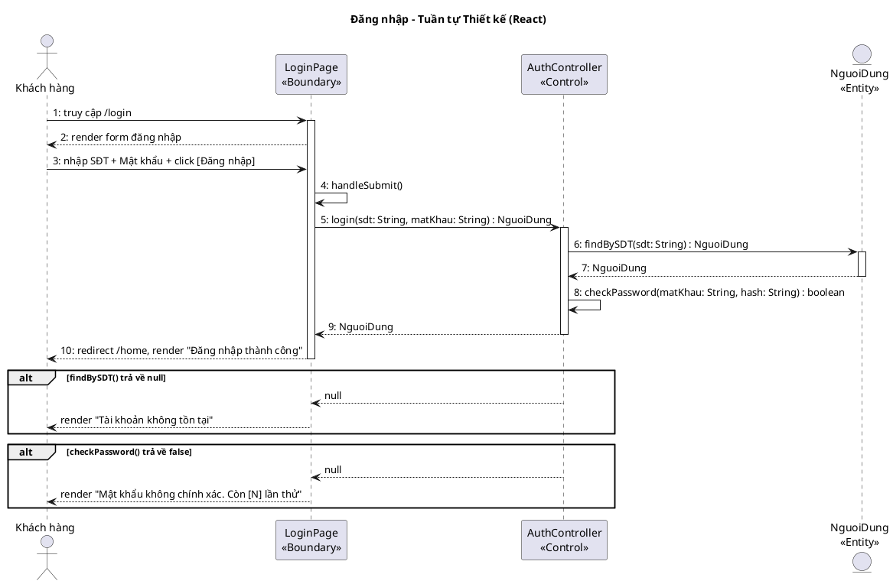
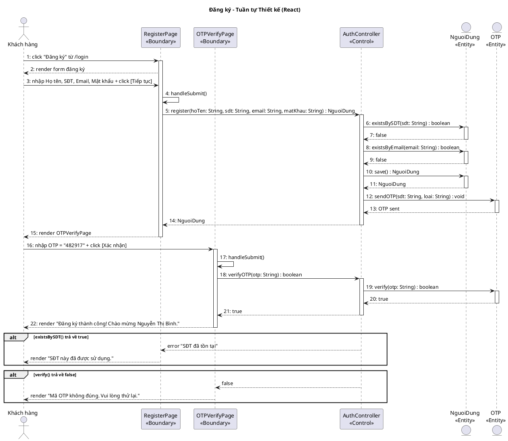
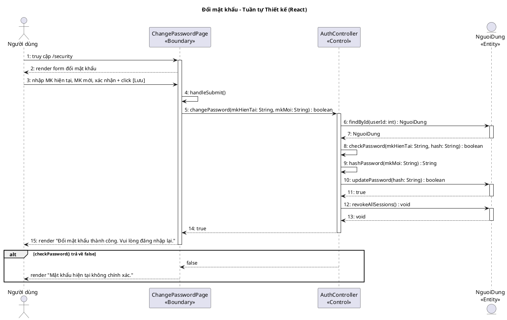
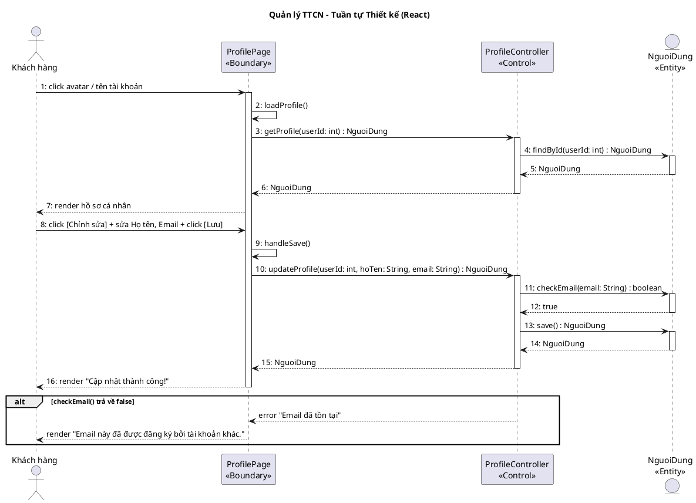
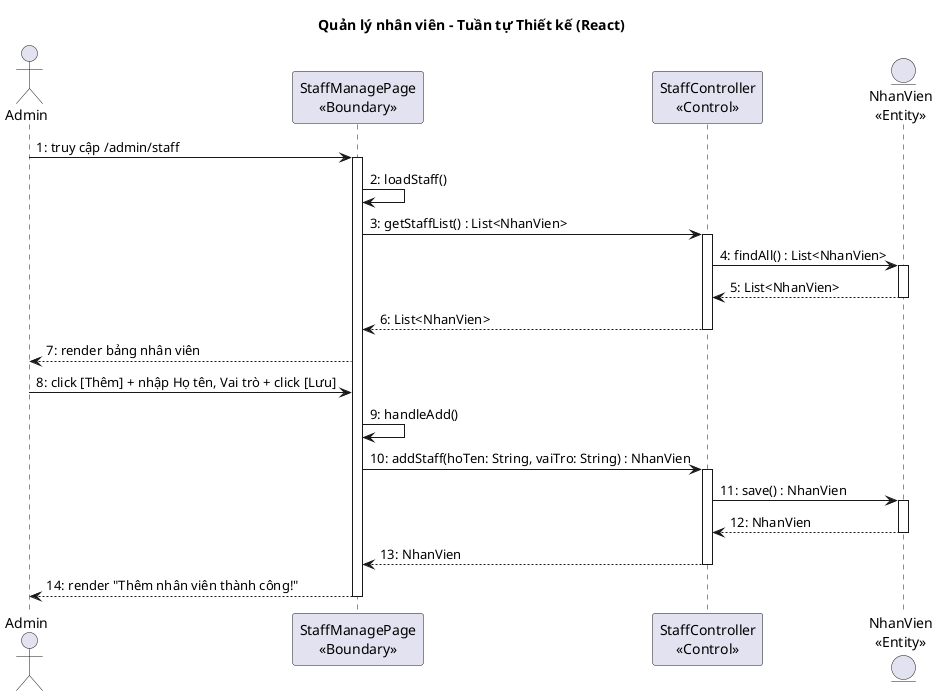

## III. PHA THIẾT KẾ

### 1. Thiết kế lớp thực thể

#### Bước 1 – Bổ sung thuộc tính id

- NguoiDung: `id : int`
- HangHoiVien: `id : int`
- OTP: `id : int`
- PhienDangNhap: `id : int`
- NhanVien: `id : int`

#### Bước 2 – Thêm kiểu dữ liệu

- NguoiDung: `id : int`, `hoTen : String`, `soDienThoai : String`, `email : String`, `matKhau : String`, `ngayTao : Date`, `diemTichLuy : int`, `trangThai : String`
- HangHoiVien: `id : int`, `tenHang : String`, `diemToiThieu : int`, `moTa : String`, `heSoUuDai : double`
- OTP: `id : int`, `maOTP : String`, `loai : String`, `thoiHanHetHan : Date`, `daXacMinh : boolean`
- PhienDangNhap: `id : int`, `tokenPhien : String`, `thoiGianDangNhap : DateTime`, `thoiGianHetHan : DateTime`, `thietBi : String`
- NhanVien: `id : int`, `hoTen : String`, `vaiTro : String`, `trangThai : String`

#### Bước 3 – Chuyển quan hệ

- NguoiDung `o--` HangHoiVien: aggregation (hạng hội viên là danh mục độc lập)
- NguoiDung `*--` OTP: composition (OTP không tồn tại độc lập)
- NguoiDung `*--` PhienDangNhap: composition (phiên không tồn tại độc lập)

#### Bước 4 – Bổ sung thuộc tính kiểu đối tượng

- NguoiDung: `hangHoiVien : HangHoiVien`
- PhienDangNhap: `nguoiDung : NguoiDung`
- OTP: `nguoiDung : NguoiDung`

#### Biểu đồ lớp thực thể

<!-- PLACEHOLDER: account_entity_class -->
<!-- File: output/diagrams/account_entity_class.png -->

### 2. Thiết kế CSDL

#### Bước 1 – Tạo bảng

| Lớp thực thể | Tên bảng |
|--------------|----------|
| NguoiDung | tblNguoiDung |
| HangHoiVien | tblHangHoiVien |
| OTP | tblOTP |
| PhienDangNhap | tblPhienDangNhap |
| NhanVien | tblNhanVien |

#### Bước 2 – Chuyển kiểu dữ liệu

| Kiểu Java | Kiểu SQL |
|-----------|----------|
| int | integer(10) |
| String | varchar(255) |
| double | double(10) |
| Date | date |
| DateTime | datetime |

#### Bước 3 – Xử lý cardinality

- NguoiDung – HangHoiVien (n-1): tblNguoiDung có FK `tblHangHoiVienMa`
- NguoiDung – OTP (1-n): tblOTP có FK `tblNguoiDungMa`
- NguoiDung – PhienDangNhap (1-n): tblPhienDangNhap có FK `tblNguoiDungMa`

#### Bước 4 – PK/FK

- PK: `ma : integer(10) <<PK>>`
- FK: `tbl[TenBangCha]Ma : integer(10) <<FK>>`

#### Biểu đồ ERD

<!-- PLACEHOLDER: account_erd -->
<!-- File: output/diagrams/account_erd.png -->

### 3. Wireframe

<!-- PLACEHOLDER: WIREFRAMES -->
<!-- Wireframes sẽ được render thành monospace frames trong DOCX -->

#### Màn hình 1: LoginPage

```
┌──────────────────────────────────────────────┐
│              Đăng nhập                       │
│                                              │
│  SĐT / Email: [________________________]     │
│  Mật khẩu:    [________________________]     │
│                                              │
│  [Đăng nhập]                                 │
│  Quên mật khẩu?  |  Đăng ký mới             │
└──────────────────────────────────────────────┘
```

#### Màn hình 2: RegisterPage

```
┌──────────────────────────────────────────────┐
│              Đăng ký tài khoản                │
│                                              │
│  Họ và tên:      [________________________]  │
│  Số điện thoại:   [________________________]  │
│  Email:           [________________________]  │
│  Mật khẩu:       [________________________]  │
│  Xác nhận MK:    [________________________]  │
│                                              │
│  [Tiếp tục]                 [Hủy]           │
└──────────────────────────────────────────────┘
```

#### Màn hình 3: OTPVerifyPage

```
┌──────────────────────────────────────────────┐
│           Xác nhận OTP                       │
│                                              │
│  Mã OTP đã gửi đến 098****321               │
│                                              │
│  [__][__][__][__][__][__]                    │
│                                              │
│  [Xác nhận]                                  │
│  Gửi lại OTP (60s)                          │
└──────────────────────────────────────────────┘
```

#### Màn hình 4: ChangePasswordPage

```
┌──────────────────────────────────────────────┐
│           Đổi mật khẩu                       │
│                                              │
│  Mật khẩu hiện tại: [________________________]│
│  Mật khẩu mới:      [________________________]│
│  Xác nhận MK mới:   [________________________]│
│                                              │
│  [Lưu thay đổi]          [Hủy]              │
└──────────────────────────────────────────────┘
```

#### Màn hình 5: ProfilePage

```
┌──────────────────────────────────────────────┐
│           Hồ sơ cá nhân                      │
│                                              │
│  Họ và tên:      Nguyễn Văn An              │
│  Số điện thoại:   0912345678                 │
│  Email:           vana@email.com             │
│  Hạng hội viên:  Bạc (1.250 điểm)          │
│  Ngày tham gia:   15/03/2024                 │
│                                              │
│  [Chỉnh sửa thông tin]  [Đổi mật khẩu]      │
└──────────────────────────────────────────────┘
```

#### Màn hình 6: StaffManagePage

```
┌──────────────────────────────────────────────┐
│        Quản lý tài khoản nhân viên           │
│                                              │
│  [Thêm nhân viên]                            │
│                                              │
│ ┌──────┬────────┬──────────┬──────────┐      │
│ │ Họ tên│ Vai trò│ Trạng thái│ ...     │      │
│ │ Trần A│ Lễ tân │ Đang LD  │         │      │
│ │ Lê B  │ Phục vụ│ Đang LD  │         │      │
│ └──────┴────────┴──────────┴──────────┘      │
│                                              │
│  [Sửa]  [Xóa]                               │
└──────────────────────────────────────────────┘
```

### 4. MVC class diagram

Mô hình thiết kế theo kiến trúc MVC (Boundary – Control – Entity):

**Boundary:** LoginPage, RegisterPage, OTPVerifyPage, ChangePasswordPage, ProfilePage, StaffManagePage

**Control:** AuthController, ProfileController, StaffController

**Entity:** NguoiDung, HangHoiVien, OTP, PhienDangNhap, NhanVien

**Quy trình xác định chữ ký hàm Controller:**

a) Đăng nhập => `login()`
- Input: sdt, matKhau
- Output: NguoiDung + Session
- Ứng viên tham số vào:
  - `login(sdt: String, matKhau: String)` → chọn (gom nhóm tham số)
- Ứng viên tham số ra:
  - `login(): void` → loại (cần trả về thông tin đăng nhập)
  - `login(): NguoiDung` → chọn (trả về thông tin người dùng)

b) Đăng ký => `register()`
- Input: hoTen, sdt, email, matKhau
- Output: NguoiDung (vừa tạo)
- Ứng viên tham số vào:
  - `register(hoTen: String, sdt: String, email: String, matKhau: String)` → chọn
- Ứng viên tham số ra:
  - `register(): NguoiDung` → chọn

c) Xác minh OTP => `verifyOTP()`
- Input: otp
- Output: boolean
- Ứng viên tham số vào:
  - `verifyOTP(otp: String)` → chọn
- Ứng viên tham số ra:
  - `verifyOTP(): boolean` → chọn (cần biết đúng/sai)

d) Đổi mật khẩu => `changePassword()`
- Input: mkHienTai, mkMoi
- Output: boolean
- Ứng viên tham số vào:
  - `changePassword(mkHienTai: String, mkMoi: String)` → chọn
- Ứng viên tham số ra:
  - `changePassword(): boolean` → chọn

e) Xem hồ sơ => `getProfile()`
- Input: userId
- Output: NguoiDung
- Ứng viên tham số vào:
  - `getProfile(userId: int)` → chọn
- Ứng viên tham số ra:
  - `getProfile(): NguoiDung` → chọn

f) Cập nhật hồ sơ => `updateProfile()`
- Input: userId, hoTen, email
- Output: NguoiDung
- Ứng viên tham số vào:
  - `updateProfile(userId: int, hoTen: String, email: String)` → chọn
- Ứng viên tham số ra:
  - `updateProfile(): NguoiDung` → chọn

g) Xem danh sách NV => `getStaffList()`
- Input: (không có)
- Output: List\<NhanVien\>
- Ứng viên tham số vào:
  - `getStaffList()` → chọn
- Ứng viên tham số ra:
  - `getStaffList(): List<NhanVien>` → chọn

h) Thêm NV => `addStaff()`
- Input: hoTen, vaiTro
- Output: NhanVien
- Ứng viên tham số vào:
  - `addStaff(hoTen: String, vaiTro: String)` → chọn
- Ứng viên tham số ra:
  - `addStaff(): NhanVien` → chọn

i) Sửa NV => `updateStaff()`
- Input: id, hoTen, vaiTro
- Output: NhanVien
- Ứng viên tham số vào:
  - `updateStaff(id: int, hoTen: String, vaiTro: String)` → chọn
- Ứng viên tham số ra:
  - `updateStaff(): NhanVien` → chọn

j) Xóa NV => `deleteStaff()`
- Input: id
- Output: boolean
- Ứng viên tham số vào:
  - `deleteStaff(id: int)` → chọn
- Ứng viên tham số ra:
  - `deleteStaff(): boolean` → chọn (cần biết thành công/thất bại)

<!-- PLACEHOLDER: account_dao_class -->
<!-- File: output/diagrams/account_mvc_class.png -->

### 5. Biểu đồ tuần tự thiết kế

#### Đăng nhập

<!-- PLACEHOLDER: account_seq_login -->
<!-- File: output/diagrams/account_seq_login.png -->



**Kịch bản phiên bản 3 – UC01 Đăng nhập**

1. Khách hàng truy cập URL `/login` trên trình duyệt.
2. Phương thức `render()` của lớp LoginPage được gọi, hiển thị form gồm ô nhập SĐT/Email, ô nhập Mật khẩu, nút [Đăng nhập], liên kết "Quên mật khẩu?" / "Đăng ký".
3. Khách hàng nhập SĐT = "0912345678" và Mật khẩu = "Abc@1234".
4. Khách hàng click nút [Đăng nhập].
5. Phương thức `handleSubmit()` của lớp LoginPage được gọi.
6. Phương thức `handleSubmit()` gọi phương thức `login(sdt: String, matKhau: String): NguoiDung` của lớp AuthController.
7. Phương thức `login()` gọi phương thức `findBySDT(sdt: String): NguoiDung` của lớp NguoiDung.
8. Lớp NguoiDung trả về đối tượng NguoiDung cho phương thức `login()`.
9. Phương thức `login()` gọi `checkPassword(matKhau: String, hash: String): boolean` để so sánh mật khẩu.
10. Phương thức `login()` trả về đối tượng NguoiDung cho phương thức `handleSubmit()`.
11. Phương thức `handleSubmit()` gọi `redirect /home`, hiển thị "Đăng nhập thành công. Xin chào, Nguyễn Văn A!".

**Ngoại lệ: tài khoản không tồn tại**
- Phương thức `findBySDT()` trả về `null`.
- Phương thức `login()` trả về `null` cho `handleSubmit()`.
- Lớp LoginPage hiển thị "Tài khoản không tồn tại. Vui lòng kiểm tra lại."

**Ngoại lệ: mật khẩu sai**
- Phương thức `checkPassword()` trả về `false`.
- Phương thức `login()` trả về `null` cho `handleSubmit()`.
- Lớp LoginPage hiển thị "Mật khẩu không chính xác. Còn [N] lần thử."

#### Đăng ký

<!-- PLACEHOLDER: account_seq_register -->
<!-- File: output/diagrams/account_seq_register.png -->



**Kịch bản phiên bản 3 – UC02 Đăng ký**

1. Khách hàng click liên kết "Đăng ký" từ trang `/login`.
2. Phương thức `render()` của lớp RegisterPage được gọi, hiển thị form gồm: Họ tên, SĐT, Email, Mật khẩu, Xác nhận MK.
3. Khách hàng nhập: Họ tên = "Nguyễn Thị Bình", SĐT = "0987654321", Email = "binh.nt@email.com", MK = "Pass@2025".
4. Khách hàng click nút [Tiếp tục].
5. Phương thức `handleSubmit()` của lớp RegisterPage được gọi.
6. Phương thức `handleSubmit()` gọi phương thức `register(hoTen: String, sdt: String, email: String, matKhau: String): NguoiDung` của lớp AuthController.
7. Phương thức `register()` gọi `existsBySDT(sdt: String): boolean` của lớp NguoiDung để kiểm tra SĐT.
8. NguoiDung trả về `false` (SĐT chưa tồn tại).
9. Phương thức `register()` gọi `existsByEmail(email: String): boolean` của lớp NguoiDung để kiểm tra email.
10. NguoiDung trả về `false` (email chưa tồn tại).
11. Phương thức `register()` gọi `save(): NguoiDung` để tạo tài khoản mới.
12. Phương thức `register()` gọi `sendOTP(sdt: String, loai: String): void` của lớp OTP.
13. OTP gửi mã OTP 6 chữ số đến SĐT.
14. Phương thức `register()` trả về đối tượng NguoiDung cho `handleSubmit()`.
15. RegisterPage hiển thị trang OTPVerifyPage.
16. Khách hàng nhập OTP = "482917" và click [Xác nhận].
17. Phương thức `handleSubmit()` của lớp OTPVerifyPage được gọi.
18. OTPVerifyPage gọi `verifyOTP(otp: String): boolean` của AuthController.
19. AuthController gọi `verify(otp: String): boolean` của lớp OTP.
20. OTP trả về `true`.
21. AuthController trả về `true` cho OTPVerifyPage.
22. OTPVerifyPage hiển thị "Đăng ký thành công! Chào mừng Nguyễn Thị Bình."

**Ngoại lệ: SĐT đã tồn tại**
- Phương thức `existsBySDT()` trả về `true`.
- AuthController trả về lỗi cho RegisterPage.
- RegisterPage hiển thị "SĐT này đã được sử dụng."

**Ngoại lệ: OTP sai**
- Phương thức `verify()` trả về `false`.
- AuthController trả về `false` cho OTPVerifyPage.
- OTPVerifyPage hiển thị "Mã OTP không đúng. Vui lòng thử lại."

#### Đổi mật khẩu

<!-- PLACEHOLDER: account_seq_changepw -->
<!-- File: output/diagrams/account_seq_changepw.png -->



**Kịch bản phiên bản 3 – UC03 Đổi mật khẩu**

1. Người dùng truy cập URL `/security` trên trình duyệt.
2. Phương thức `render()` của lớp ChangePasswordPage được gọi, hiển thị form: Mật khẩu hiện tại, Mật khẩu mới, Xác nhận MK mới.
3. Người dùng nhập: MK hiện tại = "Abc@1234", MK mới = "NewPass@2025", xác nhận = "NewPass@2025".
4. Người dùng click nút [Lưu thay đổi].
5. Phương thức `handleSubmit()` của lớp ChangePasswordPage được gọi.
6. Phương thức `handleSubmit()` gọi `changePassword(mkHienTai: String, mkMoi: String): boolean` của AuthController.
7. Phương thức `changePassword()` gọi `findById(userId: int): NguoiDung` của lớp NguoiDung.
8. NguoiDung trả về đối tượng NguoiDung cho `changePassword()`.
9. Phương thức `changePassword()` gọi `checkPassword(mkHienTai: String, hash: String): boolean` để xác minh MK hiện tại.
10. Phương thức `changePassword()` gọi `hashPassword(mkMoi: String): String` để mã hóa MK mới.
11. Phương thức `changePassword()` gọi `updatePassword(hash: String): boolean` của lớp NguoiDung.
12. NguoiDung trả về `true`.
13. Phương thức `changePassword()` gọi `revokeAllSessions(): void` để thu hồi tất cả session.
14. Phương thức `changePassword()` trả về `true` cho `handleSubmit()`.
15. ChangePasswordPage hiển thị "Đổi mật khẩu thành công. Vui lòng đăng nhập lại."

**Ngoại lệ: MK hiện tại sai**
- Phương thức `checkPassword()` trả về `false`.
- AuthController trả về `false` cho ChangePasswordPage.
- ChangePasswordPage hiển thị "Mật khẩu hiện tại không chính xác."

**Ngoại lệ: MK mới trùng MK cũ**
- Phương thức `changePassword()` kiểm tra mkMoi ≠ mkHienTai.
- AuthController trả về lỗi cho ChangePasswordPage.
- ChangePasswordPage hiển thị "Mật khẩu mới không được trùng mật khẩu hiện tại."

#### Quản lý TTCN

<!-- PLACEHOLDER: account_seq_profile -->
<!-- File: output/diagrams/account_seq_profile.png -->



**Kịch bản phiên bản 3 – UC04 Quản lý TTCN**

1. Khách hàng click vào avatar / tên tài khoản ở góc trên phải.
2. Phương thức `loadProfile()` của lớp ProfilePage được gọi.
3. ProfilePage gọi `getProfile(userId: int): NguoiDung` của ProfileController.
4. ProfileController gọi `findById(userId: int): NguoiDung` của lớp NguoiDung.
5. NguoiDung trả về đối tượng NguoiDung cho ProfileController.
6. ProfileController trả về đối tượng NguoiDung cho ProfilePage.
7. ProfilePage render hồ sơ: Họ tên, SĐT, Email, Hạng hội viên, Điểm tích lũy, Ngày tham gia.
8. Khách hàng click [Chỉnh sửa], sửa Họ tên = "Nguyễn Văn An", Email = "vanan@newemail.com", click [Lưu].
9. Phương thức `handleSave()` của lớp ProfilePage được gọi.
10. ProfilePage gọi `updateProfile(userId: int, hoTen: String, email: String): NguoiDung` của ProfileController.
11. ProfileController gọi `checkEmail(email: String): boolean` của lớp NguoiDung.
12. NguoiDung trả về `true` (email hợp lệ).
13. ProfileController gọi `save(): NguoiDung` để cập nhật.
14. NguoiDung trả về đối tượng NguoiDung đã cập nhật.
15. ProfileController trả về NguoiDung cho ProfilePage.
16. ProfilePage hiển thị "Cập nhật thành công!"

**Ngoại lệ: Email đã được dùng**
- Phương thức `checkEmail()` trả về `false`.
- ProfileController trả về lỗi cho ProfilePage.
- ProfilePage hiển thị "Email này đã được đăng ký bởi tài khoản khác."

#### Quản lý nhân viên

<!-- PLACEHOLDER: account_seq_staff -->
<!-- File: output/diagrams/account_seq_staff.png -->



**Kịch bản phiên bản 3 – UC20 Quản lý nhân viên**

1. Admin truy cập URL `/admin/staff` trên trình duyệt.
2. Phương thức `loadStaff()` của lớp StaffManagePage được gọi.
3. StaffManagePage gọi `getStaffList(): List<NhanVien>` của StaffController.
4. StaffController gọi `findAll(): List<NhanVien>` của lớp NhanVien.
5. NhanVien trả về danh sách nhân viên cho StaffController.
6. StaffController trả về `List<NhanVien>` cho StaffManagePage.
7. StaffManagePage render bảng nhân viên: họ tên, vai trò, trạng thái.
8. Admin click [Thêm nhân viên], nhập Họ tên = "Lê Văn C", Vai trò = "Phục vụ", click [Lưu].
9. Phương thức `handleAdd()` của lớp StaffManagePage được gọi.
10. StaffManagePage gọi `addStaff(hoTen: String, vaiTro: String): NhanVien` của StaffController.
11. StaffController gọi `save(): NhanVien` của lớp NhanVien.
12. NhanVien trả về đối tượng NhanVien vừa tạo.
13. StaffController trả về NhanVien cho StaffManagePage.
14. StaffManagePage hiển thị "Thêm nhân viên thành công!"

**Ngoại lệ: SĐT đã tồn tại**
- StaffController nhận lỗi từ NhanVien.
- StaffManagePage hiển thị "SĐT này đã được sử dụng."

**Ngoại lệ: Nhân viên đang xử lý order**
- StaffController nhận lỗi từ NhanVien.
- StaffManagePage hiển thị cảnh báo "Nhân viên đang xử lý order, không thể xóa."
