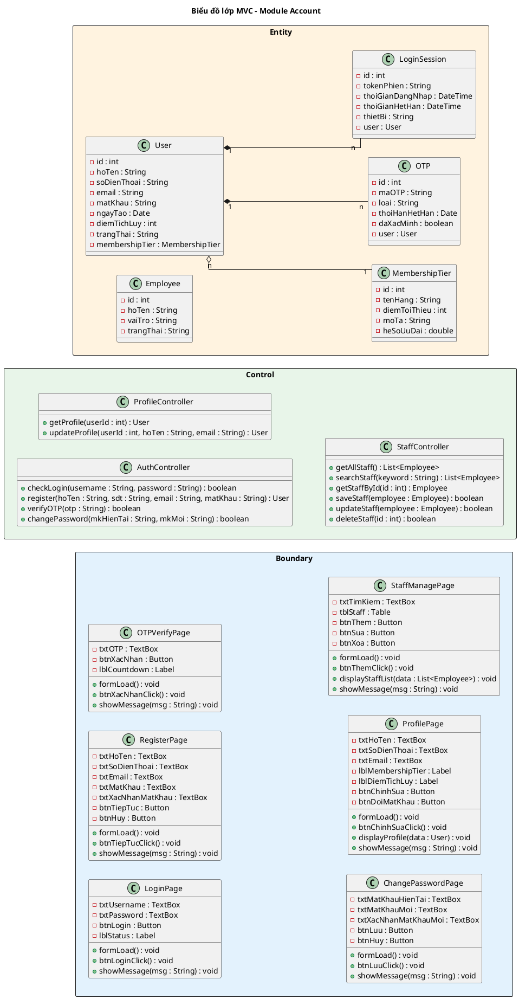

## III. PHA THIẾT KẾ

### 1. Thiết kế lớp thực thể

#### Bước 1 – Bổ sung thuộc tính id

- User: `id : int`
- MembershipTier: `id : int`
- OTP: `id : int`
- LoginSession: `id : int`
- Employee: `id : int`

#### Bước 2 – Thêm kiểu dữ liệu

- User: `id : int`, `hoTen : String`, `soDienThoai : String`, `email : String`, `matKhau : String`, `ngayTao : Date`, `diemTichLuy : int`, `trangThai : String`
- MembershipTier: `id : int`, `tenHang : String`, `diemToiThieu : int`, `moTa : String`, `heSoUuDai : double`
- OTP: `id : int`, `maOTP : String`, `loai : String`, `thoiHanHetHan : Date`, `daXacMinh : boolean`
- LoginSession: `id : int`, `tokenPhien : String`, `thoiGianDangNhap : DateTime`, `thoiGianHetHan : DateTime`, `thietBi : String`
- Employee: `id : int`, `hoTen : String`, `vaiTro : String`, `trangThai : String`

#### Bước 3 – Chuyển quan hệ

- User `o--` MembershipTier: aggregation (hạng hội viên là danh mục độc lập)
- User `*--` OTP: composition (OTP không tồn tại độc lập)
- User `*--` LoginSession: composition (phiên không tồn tại độc lập)

#### Bước 4 – Bổ sung thuộc tính kiểu đối tượng

- User: `membershipTier : MembershipTier`
- LoginSession: `user : User`
- OTP: `user : User`

#### Biểu đồ lớp thực thể

<!-- PLACEHOLDER: account_entity_class -->
<!-- File: output/diagrams/account_entity_class.png -->

### 2. Thiết kế CSDL

#### Bước 1 – Tạo bảng

| Lớp thực thể | Tên bảng |
|--------------|----------|
| User | tblUser |
| MembershipTier | tblMembershipTier |
| OTP | tblOTP |
| LoginSession | tblLoginSession |
| Employee | tblEmployee |

#### Bước 2 – Chuyển kiểu dữ liệu

| Kiểu Java | Kiểu SQL |
|-----------|----------|
| int | integer(10) |
| String | varchar(255) |
| double | double(10) |
| Date | date |
| DateTime | datetime |

#### Bước 3 – Xử lý cardinality

- User – MembershipTier (n-1): tblUser có FK `tblMembershipTierMa`
- User – OTP (1-n): tblOTP có FK `tblUserMa`
- User – LoginSession (1-n): tblLoginSession có FK `tblUserMa`

#### Bước 4 – PK/FK

- PK: `ma : integer(10) <<PK>>`
- FK: `tbl[TenBangCha]Ma : integer(10) <<FK>>`

#### Biểu đồ ERD

<!-- PLACEHOLDER: account_erd -->
<!-- File: output/diagrams/account_erd.png -->

### 3. Wireframe

<!-- PLACEHOLDER: WIREFRAMES -->
<!-- Wireframes sẽ được render thành monospace frames trong DOCX -->

#### Màn hình 1: LoginView

```
┌──────────────────────────────────────────────┐
│              Đăng nhập                       │
│                                              │
│  SĐT / Email: [________________________]     │
│  Mật khẩu:    [________________________]     │
│                                              │
│  [Đăng nhập]                                 │
│  Quên mật khẩu?  |  Đăng ký mới             │
└──────────────────────────────────────────────┘
```

#### Màn hình 2: RegisterView

```
┌──────────────────────────────────────────────┐
│              Đăng ký tài khoản                │
│                                              │
│  Họ và tên:      [________________________]  │
│  Số điện thoại:   [________________________]  │
│  Email:           [________________________]  │
│  Mật khẩu:       [________________________]  │
│  Xác nhận MK:    [________________________]  │
│                                              │
│  [Tiếp tục]                 [Hủy]           │
└──────────────────────────────────────────────┘
```

#### Màn hình 3: OTPVerifyView

```
┌──────────────────────────────────────────────┐
│           Xác nhận OTP                       │
│                                              │
│  Mã OTP đã gửi đến 098****321               │
│                                              │
│  [__][__][__][__][__][__]                    │
│                                              │
│  [Xác nhận]                                  │
│  Gửi lại OTP (60s)                          │
└──────────────────────────────────────────────┘
```

#### Màn hình 4: ChangePasswordView

```
┌──────────────────────────────────────────────┐
│           Đổi mật khẩu                       │
│                                              │
│  Mật khẩu hiện tại: [________________________]│
│  Mật khẩu mới:      [________________________]│
│  Xác nhận MK mới:   [________________________]│
│                                              │
│  [Lưu thay đổi]          [Hủy]              │
└──────────────────────────────────────────────┘
```

#### Màn hình 5: ProfileView

```
┌──────────────────────────────────────────────┐
│           Hồ sơ cá nhân                      │
│                                              │
│  Họ và tên:      Nguyễn Văn An              │
│  Số điện thoại:   0912345678                 │
│  Email:           vana@email.com             │
│  Hạng hội viên:  Bạc (1.250 điểm)          │
│  Ngày tham gia:   15/03/2024                 │
│                                              │
│  [Chỉnh sửa thông tin]  [Đổi mật khẩu]      │
└──────────────────────────────────────────────┘
```

#### Màn hình 6: StaffManageView

```
┌──────────────────────────────────────────────┐
│        Quản lý tài khoản nhân viên           │
│                                              │
│  [Thêm nhân viên]                            │
│                                              │
│ ┌──────┬────────┬──────────┬──────────┐      │
│ │ Họ tên│ Vai trò│ Trạng thái│ ...     │      │
│ │ Trần A│ Lễ tân │ Đang LD  │         │      │
│ │ Lê B  │ Phục vụ│ Đang LD  │         │      │
│ └──────┴────────┴──────────┴──────────┘      │
│                                              │
│  [Sửa]  [Xóa]                               │
└──────────────────────────────────────────────┘
```

### 4. MVC class diagram

Mô hình thiết kế theo kiến trúc MVC (Boundary – Control – Entity):

**Boundary:** LoginPage, RegisterPage, OTPVerifyPage, ChangePasswordPage, ProfilePage, StaffManagePage

**Control:** AuthController, ProfileController, StaffController

**Entity:** User, MembershipTier, OTP, LoginSession, Employee

**Quy trình xác định chữ ký hàm Controller:**

a) Đăng nhập => `checkLogin()``
- Input: username, password
- Output: boolean
- Ứng viên tham số vào:
  - `checkLogin()`` → chọn (gom nhóm tham số)
- Ứng viên tham số ra:
  - `checkLogin()`: void` → loại (cần trả về kết quả xác thực)
  - `checkLogin()`: boolean` → chọn (trả về true/false xác thực thành công)

b) Đăng ký => `register()``
- Input: hoTen, sdt, email, matKhau
- Output: User (vừa tạo)
- Ứng viên tham số vào:
  - `register()`` → chọn
- Ứng viên tham số ra:
  - `register()`: User` → chọn

c) Xác minh OTP => `verifyOTP()``
- Input: otp
- Output: boolean
- Ứng viên tham số vào:
  - `verifyOTP()`` → chọn
- Ứng viên tham số ra:
  - `verifyOTP()`: boolean` → chọn (cần biết đúng/sai)

d) Đổi mật khẩu => `changePassword()``
- Input: mkHienTai, mkMoi
- Output: boolean
- Ứng viên tham số vào:
  - `changePassword()`` → chọn
- Ứng viên tham số ra:
  - `changePassword()`: boolean` → chọn

e) Xem hồ sơ => `getProfile()``
- Input: userId
- Output: User
- Ứng viên tham số vào:
  - `getProfile()`` → chọn
- Ứng viên tham số ra:
  - `getProfile()`: User` → chọn

f) Cập nhật hồ sơ => `updateProfile()``
- Input: userId, hoTen, email
- Output: User
- Ứng viên tham số vào:
  - `updateProfile()`` → chọn
- Ứng viên tham số ra:
  - `updateProfile()`: User` → chọn

g) Xem danh sách NV => `getAllStaff()``
- Input: (không có)
- Output: List\<Employee\>
- Ứng viên tham số vào:
  - `getAllStaff()`` → chọn
- Ứng viên tham số ra:
  - `getAllStaff()`: List<Employee>` → chọn

h) Tìm kiếm NV => `searchStaff()`
- Input: keyword
- Output: List\<Employee\>
- Ứng viên tham số vào:
  - `searchStaff(keyword: String)` → chọn
- Ứng viên tham số ra:
  - `searchStaff(): List<Employee>` → chọn

i) Lấy NV theo id => `getStaffById()`
- Input: id
- Output: Employee
- Ứng viên tham số vào:
  - `getStaffById(id: int)` → chọn
- Ứng viên tham số ra:
  - `getStaffById(): Employee` → chọn

j) Thêm NV => `saveStaff()`
- Input: employee
- Output: boolean
- Ứng viên tham số vào:
  - `saveStaff(employee: Employee)` → chọn
- Ứng viên tham số ra:
  - `saveStaff(): boolean` → chọn (cần biết thành công/thất bại)

k) Sửa NV => `updateStaff()``
- Input: employee
- Output: boolean
- Ứng viên tham số vào:
  - `updateStaff()`` → chọn
- Ứng viên tham số ra:
  - `updateStaff()`: boolean` → chọn

l) Xóa NV => `deleteStaff()``
- Input: id
- Output: boolean
- Ứng viên tham số vào:
  - `deleteStaff()`` → chọn
- Ứng viên tham số ra:
  - `deleteStaff()`: boolean` → chọn (cần biết thành công/thất bại)



<!-- PLACEHOLDER: account_dao_class -->
<!-- File: output/diagrams/account_mvc_class.png -->

### 5. Biểu đồ tuần tự thiết kế

### Đăng nhập

<!-- PLACEHOLDER: account_seq_login_design -->
<!-- File: output/diagrams/account_seq_login.png -->

```plantuml
@startuml
title Đăng nhập – Tuần tự Thiết kế

left to right direction
skinparam linetype ortho

actor "Khách hàng" as KH
participant "LoginPage\n<<Boundary>>" as B1
participant "AuthController\n<<Control>>" as C1
entity "User\n<<Entity>>" as E1

KH -> B1 : 1: truy cập URL /login
activate B1
B1 -> B1 : 2: formLoad()
B1 --> KH : render form đăng nhập
KH -> B1 : 3: nhập SĐT và Mật khẩu
KH -> B1 : 4: click nút [Đăng nhập]
B1 -> B1 : 5: btnLoginClick()
B1 -> C1 : 6: checkLogin()
activate C1
C1 -> E1 : 7: findBySDT()
activate E1
E1 --> C1 : 8: User
deactivate E1
C1 -> C1 : 9: checkPassword()
C1 --> B1 : 10: true
deactivate C1
B1 -> B1 : 11: redirect /home
B1 --> KH : showMessage("Đăng nhập thành công")
deactivate B1

alt tài khoản không tồn tại
  E1 --> C1 : null
  C1 --> B1 : false
  B1 --> KH : showMessage("Tài khoản không tồn tại. Vui lòng kiểm tra lại.")
end

alt mật khẩu sai
  C1 --> B1 : false
  B1 --> KH : showMessage("Mật khẩu không chính xác. Còn [N] lần thử.")
end
@enduml
```

**Kịch bản phiên bản 3 – UC01 Đăng nhập**

1. Khách hàng truy cập URL `/login` trên trình duyệt.
2. Phương thức `formLoad()` của lớp LoginPage được gọi, hiển thị form gồm ô nhập SĐT, ô nhập Mật khẩu, nút [Đăng nhập].
3. Khách hàng nhập SĐT và Mật khẩu.
4. Khách hàng click nút [Đăng nhập].
5. Phương thức `btnLoginClick()` của lớp LoginPage được gọi.
6. Phương thức `btnLoginClick()` gọi phương thức `checkLogin()`` của lớp AuthController.
7. Phương thức `checkLogin()`` gọi phương thức `findBySDT()`` của lớp User.
8. Lớp User trả về đối tượng User cho phương thức `checkLogin()``.
9. Phương thức `checkLogin()`` gọi `checkPassword()`` để so sánh mật khẩu.
10. Phương thức `checkLogin()`` trả về `true` cho phương thức `btnLoginClick()`.
11. Phương thức `btnLoginClick()` gọi `redirect /home`, hiển thị showMessage("Đăng nhập thành công").

**Ngoại lệ: tài khoản không tồn tại**
- Phương thức `findBySDT()`` trả về `null`.
- Phương thức `checkLogin()`` trả về `false` cho `btnLoginClick()`.
- Lớp LoginPage hiển thị showMessage("Tài khoản không tồn tại. Vui lòng kiểm tra lại.")

**Ngoại lệ: mật khẩu sai**
- Phương thức `checkPassword()`` trả về `false`.
- Phương thức `checkLogin()`` trả về `false` cho `btnLoginClick()`.
- Lớp LoginPage hiển thị showMessage("Mật khẩu không chính xác. Còn [N] lần thử.")

### Đăng ký

<!-- PLACEHOLDER: account_seq_register_design -->
<!-- File: output/diagrams/account_seq_register.png -->

```plantuml
@startuml
title Đăng ký – Tuần tự Thiết kế

left to right direction
skinparam linetype ortho

actor "Khách hàng" as KH
participant "RegisterPage\n<<Boundary>>" as B1
participant "OTPVerifyPage\n<<Boundary>>" as B2
participant "AuthController\n<<Control>>" as C1
entity "User\n<<Entity>>" as E1
entity "OTP\n<<Entity>>" as E2

KH -> B1 : 1: click liên kết "Đăng ký" từ trang /login
activate B1
B1 -> B1 : 2: formLoad()
B1 --> KH : render form đăng ký
KH -> B1 : 3: nhập Họ tên, SĐT, Email, Mật khẩu
KH -> B1 : 4: click nút [Tiếp tục]
B1 -> B1 : 5: btnTiepTucClick()
B1 -> C1 : 6: register()
activate C1
C1 -> E1 : 7: existsBySDT()
activate E1
E1 --> C1 : 8: false
deactivate E1
C1 -> E1 : 9: existsByEmail()
activate E1
E1 --> C1 : 10: false
deactivate E1
C1 -> E1 : 11: save()
activate E1
E1 --> C1 : 12: User
deactivate E1
C1 -> E2 : 13: sendOTP()
activate E2
E2 --> C1 : 14: OTP sent
deactivate E2
C1 --> B1 : 15: User
deactivate C1
B1 --> KH : 16: hiển thị OTPVerifyPage
deactivate B1

KH -> B2 : 17: nhập mã OTP
activate B2
KH -> B2 : 18: click nút [Xác nhận]
B2 -> B2 : 19: btnXacNhanClick()
B2 -> C1 : 20: verifyOTP()
activate C1
C1 -> E2 : 21: verify()
activate E2
E2 --> C1 : 22: true
deactivate E2
C1 --> B2 : 23: true
deactivate C1
B2 --> KH : 24: showMessage("Đăng ký thành công!")
deactivate B2

alt SĐT đã tồn tại
  E1 --> C1 : true
  C1 --> B1 : error
  B1 --> KH : showMessage("SĐT này đã được sử dụng.")
end

alt OTP sai
  E2 --> C1 : false
  C1 --> B2 : false
  B2 --> KH : showMessage("Mã OTP không đúng. Vui lòng thử lại.")
end
@enduml
```

**Kịch bản phiên bản 3 – UC02 Đăng ký**

1. Khách hàng click liên kết "Đăng ký" từ trang `/login`.
2. Phương thức `formLoad()` của lớp RegisterPage được gọi, hiển thị form gồm ô nhập Họ tên, ô nhập SĐT, ô nhập Email, ô nhập Mật khẩu, ô nhập Xác nhận MK, nút [Tiếp tục].
3. Khách hàng nhập Họ tên, SĐT, Email, Mật khẩu.
4. Khách hàng click nút [Tiếp tục].
5. Phương thức `btnTiepTucClick()` của lớp RegisterPage được gọi.
6. Phương thức `btnTiepTucClick()` gọi phương thức `register()`` của lớp AuthController.
7. Phương thức `register()`` gọi phương thức `existsBySDT()`` của lớp User.
8. Lớp User trả về `false` cho phương thức `register()``.
9. Phương thức `register()`` gọi phương thức `existsByEmail()`` của lớp User.
10. Lớp User trả về `false` cho phương thức `register()``.
11. Phương thức `register()`` gọi `save()`` để tạo tài khoản mới.
12. Phương thức `register()`` gọi `sendOTP()`` của lớp OTP.
13. Lớp OTP gửi mã OTP đến SĐT.
14. Phương thức `register()`` trả về đối tượng User cho phương thức `btnTiepTucClick()`.
15. RegisterPage hiển thị trang OTPVerifyPage.
16. Khách hàng nhập mã OTP.
17. Khách hàng click nút [Xác nhận].
18. Phương thức `btnXacNhanClick()` của lớp OTPVerifyPage được gọi.
19. Phương thức `btnXacNhanClick()` gọi phương thức `verifyOTP()`` của lớp AuthController.
20. Phương thức `verifyOTP()`` gọi phương thức `verify()` của lớp OTP.
21. Lớp OTP trả về `true` cho phương thức `verifyOTP()``.
22. Phương thức `verifyOTP()`` trả về `true` cho phương thức `btnXacNhanClick()`.
23. Phương thức `btnXacNhanClick()` gọi showMessage("Đăng ký thành công!")

**Ngoại lệ: SĐT đã tồn tại**
- Phương thức `existsBySDT()`` trả về `true`.
- Phương thức `register()`` trả về lỗi cho `btnTiepTucClick()`.
- Lớp RegisterPage hiển thị showMessage("SĐT này đã được sử dụng.")

**Ngoại lệ: OTP sai**
- Phương thức `verify()` trả về `false`.
- Phương thức `verifyOTP()`` trả về `false` cho `btnXacNhanClick()`.
- Lớp OTPVerifyPage hiển thị showMessage("Mã OTP không đúng. Vui lòng thử lại.")

### Đổi mật khẩu

<!-- PLACEHOLDER: account_seq_changepw_design -->
<!-- File: output/diagrams/account_seq_changepw.png -->

```plantuml
@startuml
title Đổi mật khẩu – Tuần tự Thiết kế

left to right direction
skinparam linetype ortho

actor "Người dùng" as User
participant "ChangePasswordPage\n<<Boundary>>" as B1
participant "AuthController\n<<Control>>" as C1
entity "User\n<<Entity>>" as E1

User -> B1 : 1: truy cập URL /security
activate B1
B1 -> B1 : 2: formLoad()
B1 --> User : render form đổi mật khẩu
User -> B1 : 3: nhập Mật khẩu hiện tại, Mật khẩu mới, Xác nhận MK mới
User -> B1 : 4: click nút [Lưu thay đổi]
B1 -> B1 : 5: btnLuuClick()
B1 -> C1 : 6: changePassword()
activate C1
C1 -> E1 : 7: findById()
activate E1
E1 --> C1 : 8: User
deactivate E1
C1 -> C1 : 9: checkPassword()
C1 -> C1 : 10: hashPassword()
C1 -> E1 : 11: updatePassword()
activate E1
E1 --> C1 : 12: true
deactivate E1
C1 -> E1 : 13: revokeAllSessions()
activate E1
E1 --> C1 : 14: void
deactivate E1
C1 --> B1 : 15: true
deactivate C1
B1 --> User : showMessage("Đổi mật khẩu thành công. Vui lòng đăng nhập lại.")
deactivate B1

alt MK hiện tại sai
  C1 --> B1 : false
  B1 --> User : showMessage("Mật khẩu hiện tại không chính xác.")
end
@enduml
```

**Kịch bản phiên bản 3 – UC03 Đổi mật khẩu**

1. Người dùng truy cập URL `/security` trên trình duyệt.
2. Phương thức `formLoad()` của lớp ChangePasswordPage được gọi, hiển thị form gồm ô nhập Mật khẩu hiện tại, ô nhập Mật khẩu mới, ô nhập Xác nhận MK mới, nút [Lưu thay đổi].
3. Người dùng nhập Mật khẩu hiện tại, Mật khẩu mới, Xác nhận MK mới.
4. Người dùng click nút [Lưu thay đổi].
5. Phương thức `btnLuuClick()` của lớp ChangePasswordPage được gọi.
6. Phương thức `btnLuuClick()` gọi phương thức `changePassword()`` của lớp AuthController.
7. Phương thức `changePassword()`` gọi phương thức `findById()` của lớp User.
8. Lớp User trả về đối tượng User cho phương thức `changePassword()``.
9. Phương thức `changePassword()`` gọi `checkPassword()`` để xác minh Mật khẩu hiện tại.
10. Phương thức `changePassword()`` gọi `hashPassword()`` để mã hóa Mật khẩu mới.
11. Phương thức `changePassword()`` gọi `updatePassword()`` của lớp User.
12. Lớp User trả về `true` cho phương thức `changePassword()``.
13. Phương thức `changePassword()`` gọi `revokeAllSessions()`` để thu hồi tất cả session.
14. Phương thức `changePassword()`` trả về `true` cho phương thức `btnLuuClick()`.
15. Phương thức `btnLuuClick()` gọi showMessage("Đổi mật khẩu thành công. Vui lòng đăng nhập lại.")

**Ngoại lệ: MK hiện tại sai**
- Phương thức `checkPassword()`` trả về `false`.
- Phương thức `changePassword()`` trả về `false` cho `btnLuuClick()`.
- Lớp ChangePasswordPage hiển thị showMessage("Mật khẩu hiện tại không chính xác.")

**Ngoại lệ: MK mới trùng MK cũ**
- Phương thức `changePassword()`` kiểm tra MK mới trùng MK hiện tại.
- Phương thức `changePassword()`` trả về lỗi cho `btnLuuClick()`.
- Lớp ChangePasswordPage hiển thị showMessage("Mật khẩu mới không được trùng mật khẩu hiện tại.")

### Quản lý TTCN

<!-- PLACEHOLDER: account_seq_profile_design -->
<!-- File: output/diagrams/account_seq_profile.png -->

```plantuml
@startuml
title Quản lý TTCN – Tuần tự Thiết kế

left to right direction
skinparam linetype ortho

actor "Khách hàng" as KH
participant "ProfilePage\n<<Boundary>>" as B1
participant "ProfileController\n<<Control>>" as C1
entity "User\n<<Entity>>" as E1

KH -> B1 : 1: click avatar / tên tài khoản
activate B1
B1 -> B1 : 2: formLoad()
B1 -> C1 : 3: getProfile()
activate C1
C1 -> E1 : 4: findById()
activate E1
E1 --> C1 : 5: User
deactivate E1
C1 --> B1 : 6: User
deactivate C1
B1 -> B1 : 7: displayProfile()
B1 --> KH : render hồ sơ cá nhân
KH -> B1 : 8: click nút [Chỉnh sửa]
activate B1
KH -> B1 : 9: sửa Họ tên và Email
KH -> B1 : 10: click nút [Lưu]
B1 -> B1 : 11: btnChinhSuaClick()
B1 -> C1 : 12: updateProfile()
activate C1
C1 -> E1 : 13: checkEmail()
activate E1
E1 --> C1 : 14: true
deactivate E1
C1 -> E1 : 15: save()
activate E1
E1 --> C1 : 16: User
deactivate E1
C1 --> B1 : 17: User
deactivate C1
B1 -> B1 : 18: displayProfile()
B1 --> KH : showMessage("Cập nhật thành công!")
deactivate B1

alt Email đã được dùng
  E1 --> C1 : false
  C1 --> B1 : error
  B1 --> KH : showMessage("Email này đã được đăng ký bởi tài khoản khác.")
end
@enduml
```

**Kịch bản phiên bản 3 – UC04 Quản lý TTCN**

1. Khách hàng click vào avatar / tên tài khoản ở góc trên phải.
2. Phương thức `formLoad()` của lớp ProfilePage được gọi.
3. Phương thức `formLoad()` gọi phương thức `getProfile()`` của lớp ProfileController.
4. Phương thức `getProfile()`` gọi phương thức `findById()` của lớp User.
5. Lớp User trả về đối tượng User cho phương thức `getProfile()``.
6. Phương thức `getProfile()`` trả về đối tượng User cho phương thức `formLoad()`.
7. Phương thức `formLoad()` gọi `displayProfile()` để hiển thị hồ sơ: Họ tên, SĐT, Email, Hạng hội viên, Điểm tích lũy.
8. Khách hàng click nút [Chỉnh sửa].
9. Khách hàng sửa Họ tên và Email.
10. Khách hàng click nút [Lưu].
11. Phương thức `btnChinhSuaClick()` của lớp ProfilePage được gọi.
12. Phương thức `btnChinhSuaClick()` gọi phương thức `updateProfile()`` của lớp ProfileController.
13. Phương thức `updateProfile()`` gọi phương thức `checkEmail()`` của lớp User.
14. Lớp User trả về `true` cho phương thức `updateProfile()``.
15. Phương thức `updateProfile()`` gọi `save()`` để cập nhật hồ sơ.
16. Lớp User trả về đối tượng User đã cập nhật cho phương thức `updateProfile()``.
17. Phương thức `updateProfile()`` trả về đối tượng User cho phương thức `btnChinhSuaClick()`.
18. Phương thức `btnChinhSuaClick()` gọi `displayProfile()`, hiển thị showMessage("Cập nhật thành công!")

**Ngoại lệ: Email đã được dùng**
- Phương thức `checkEmail()`` trả về `false`.
- Phương thức `updateProfile()`` trả về lỗi cho `btnChinhSuaClick()`.
- Lớp ProfilePage hiển thị showMessage("Email này đã được đăng ký bởi tài khoản khác.")

### Quản lý nhân viên

<!-- PLACEHOLDER: account_seq_staff_design -->
<!-- File: output/diagrams/account_seq_staff.png -->

```plantuml
@startuml
title Quản lý nhân viên – Tuần tự Thiết kế

left to right direction
skinparam linetype ortho

actor "Admin" as Admin
participant "StaffManagePage\n<<Boundary>>" as B1
participant "StaffController\n<<Control>>" as C1
entity "Employee\n<<Entity>>" as E1

Admin -> B1 : 1: truy cập URL /admin/staff
activate B1
B1 -> B1 : 2: formLoad()
B1 -> C1 : 3: getAllStaff()
activate C1
C1 -> E1 : 4: findAll()
activate E1
E1 --> C1 : 5: List<Employee>
deactivate E1
C1 --> B1 : 6: List<Employee>
deactivate C1
B1 -> B1 : 7: displayStaffList()
B1 --> Admin : render bảng nhân viên

Admin -> B1 : 8: click nút [Thêm nhân viên]
Admin -> B1 : 9: nhập Họ tên và Vai trò
Admin -> B1 : 10: click nút [Lưu]
B1 -> B1 : 11: btnThemClick()
B1 -> C1 : 12: saveStaff()
activate C1
C1 -> E1 : 13: save()
activate E1
E1 --> C1 : 14: Employee
deactivate E1
C1 --> B1 : 15: true
deactivate C1
B1 -> B1 : 16: displayStaffList()
B1 --> Admin : showMessage("Thêm nhân viên thành công!")
deactivate B1

Admin -> B1 : 17: click nút [Xóa] trên một dòng nhân viên
activate B1
B1 -> B1 : 18: btnXoaClick()
B1 -> C1 : 19: deleteStaff()
activate C1
C1 -> E1 : 20: deleteById()
activate E1
E1 --> C1 : 21: true
deactivate E1
C1 --> B1 : 22: true
deactivate C1
B1 -> B1 : 23: displayStaffList()
B1 --> Admin : showMessage("Xóa nhân viên thành công!")
deactivate B1

alt thêm nhân viên thất bại
  C1 --> B1 : false
  B1 --> Admin : showMessage("Thêm nhân viên thất bại.")
end

alt nhân viên đang xử lý order
  C1 --> B1 : false
  B1 --> Admin : showMessage("Nhân viên đang xử lý order, không thể xóa.")
end
@enduml
```

**Kịch bản phiên bản 3 – UC20 Quản lý nhân viên**

1. Admin truy cập URL `/admin/staff` trên trình duyệt.
2. Phương thức `formLoad()` của lớp StaffManagePage được gọi.
3. Phương thức `formLoad()` gọi phương thức `getAllStaff()`` của lớp StaffController.
4. Phương thức `getAllStaff()`` gọi phương thức `findAll()`` của lớp Employee.
5. Lớp Employee trả về danh sách nhân viên cho phương thức `getAllStaff()``.
6. Phương thức `getAllStaff()`` trả về danh sách cho phương thức `formLoad()`.
7. Phương thức `formLoad()` gọi `displayStaffList()` để hiển thị bảng nhân viên.
8. Admin click nút [Thêm nhân viên].
9. Admin nhập Họ tên và Vai trò.
10. Admin click nút [Lưu].
11. Phương thức `btnThemClick()` của lớp StaffManagePage được gọi.
12. Phương thức `btnThemClick()` gọi phương thức `saveStaff()` của lớp StaffController.
13. Phương thức `saveStaff()` gọi `save()`` của lớp Employee.
14. Lớp Employee trả về đối tượng Employee vừa tạo cho phương thức `saveStaff()`.
15. Phương thức `saveStaff()` trả về `true` cho phương thức `btnThemClick()`.
16. Phương thức `btnThemClick()` gọi `displayStaffList()`, hiển thị showMessage("Thêm nhân viên thành công!")
17. Admin click nút [Xóa] trên một dòng nhân viên trong bảng.
18. Phương thức `btnXoaClick()` của lớp StaffManagePage được gọi.
19. Phương thức `btnXoaClick()` gọi phương thức `deleteStaff()`` của lớp StaffController.
20. Phương thức `deleteStaff()`` gọi `deleteById()`` của lớp Employee.
21. Lớp Employee trả về `true` cho phương thức `deleteStaff()``.
22. Phương thức `deleteStaff()`` trả về `true` cho phương thức `btnXoaClick()`.
23. Phương thức `btnXoaClick()` gọi `displayStaffList()`, hiển thị showMessage("Xóa nhân viên thành công!")

**Ngoại lệ: thêm nhân viên thất bại**
- Phương thức `saveStaff()` trả về `false` cho `btnThemClick()`.
- Lớp StaffManagePage hiển thị showMessage("Thêm nhân viên thất bại.")

**Ngoại lệ: nhân viên đang xử lý order**
- Phương thức `deleteStaff()`` trả về `false` cho `btnXoaClick()`.
- Lớp StaffManagePage hiển thị showMessage("Nhân viên đang xử lý order, không thể xóa.")
