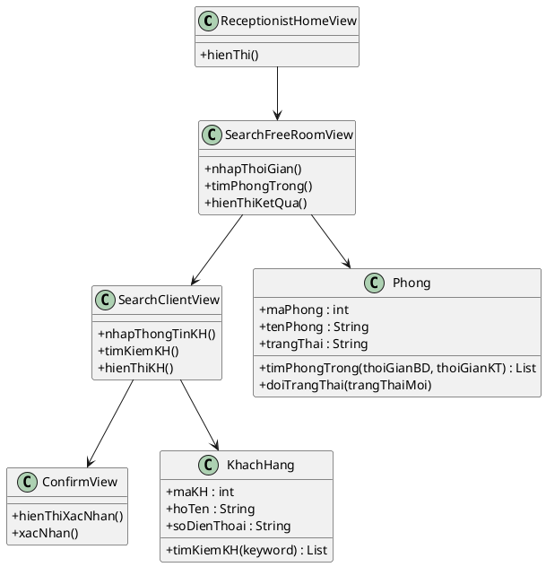
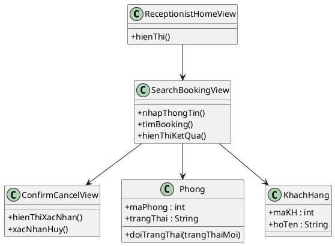
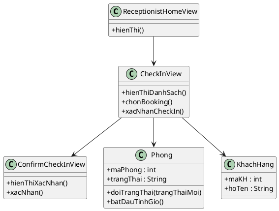
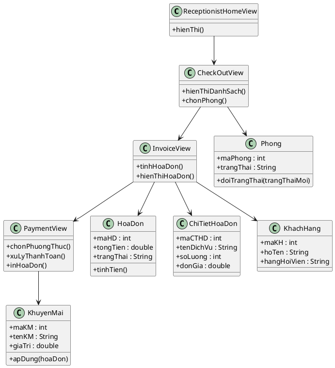
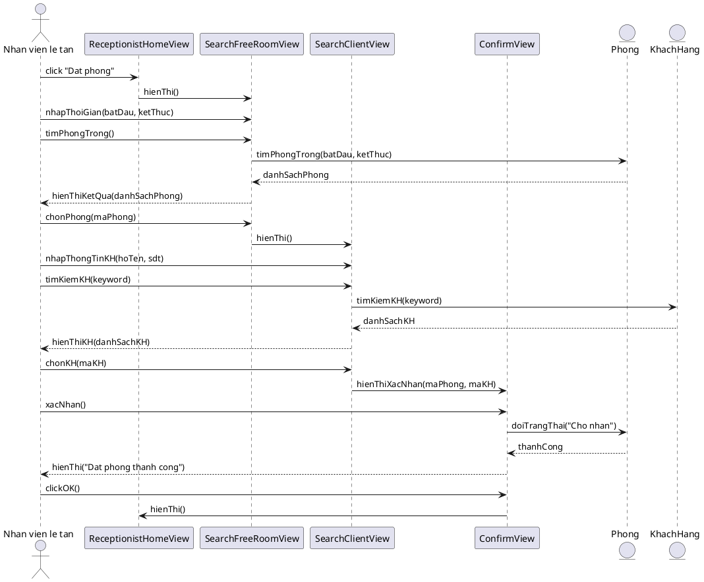
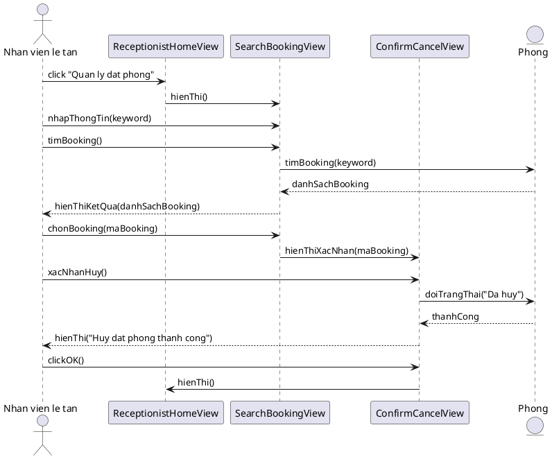
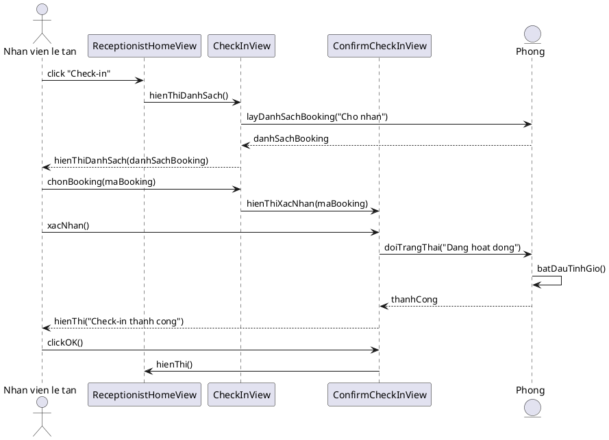
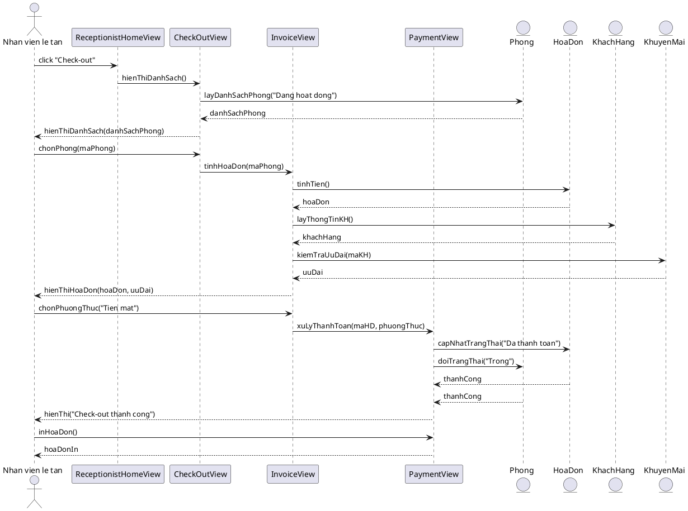

## 2.5. Biểu đồ lớp thực thể pha phân tích

### a) Chức năng "Đặt phòng"

**Boundary:** ReceptionistHomeView, SearchFreeRoomView, SearchClientView, ConfirmView
**Entity:** Phong, KhachHang, ChiNhanh

### b) Chức năng "Huỷ phòng"

**Boundary:** ReceptionistHomeView, SearchBookingView, ConfirmCancelView
**Entity:** Phong, KhachHang

### c) Chức năng "Check-in"

**Boundary:** ReceptionistHomeView, CheckInView, ConfirmCheckInView
**Entity:** Phong, KhachHang

### d) Chức năng "Check-out"

**Boundary:** ReceptionistHomeView, CheckOutView, InvoiceView, PaymentView
**Entity:** Phong, HoaDon, ChiTietHoaDon, KhachHang, KhuyenMai

---

## 2.6. Biểu đồ tuần tự pha phân tích

### 4.1. Chức năng "Đặt phòng"

**Kịch bản phiên bản 2 - Đặt phòng tại chi nhánh**

1. Nhân viên lễ tân click chức năng "Đặt phòng" trên giao diện ReceptionistHomeView.
2. Lớp ReceptionistHomeView gọi sang lớp SearchFreeRoomView.
3. Lớp SearchFreeRoomView hiển thị cho nhân viên.
4. Nhân viên hỏi khách hàng thời gian đặt phòng.
5. Khách hàng trả lời.
6. Nhân viên nhập thời gian đặt phòng mong muốn của khách vào ô thời gian và ấn nút tìm kiếm.
7. Lớp SearchFreeRoomView gọi đến lớp Phong để xử lý thông tin.
8. Lớp Phong gọi hàm timPhongTrong().
9. Lớp Phong trả kết quả về cho SearchFreeRoomView.
10. Lớp SearchFreeRoomView hiển thị danh sách các phòng trống cho nhân viên.
11. Nhân viên ấn vào phòng trống.
12. Lớp SearchFreeRoomView gọi sang lớp SearchClientView.
13. Lớp SearchClientView hiển thị.
14. Nhân viên hỏi khách hàng về thông tin khách hàng.
15. Khách hàng trả lời.
16. Nhân viên nhập thông tin khách hàng và ấn nút tìm kiếm.
17. Lớp SearchClientView gọi đến lớp KhachHang.
18. Lớp KhachHang gọi hàm timKiemKH().
19. Lớp KhachHang trả kết quả về cho lớp SearchClientView.
20. Lớp SearchClientView hiển thị thông tin khách hàng tương ứng.
21. Nhân viên chọn thông tin khách hàng tương ứng.
22. Lớp SearchClientView gọi sang lớp ConfirmView.
23. Lớp ConfirmView hiển thị.
24. Nhân viên ấn xác nhận.
25. Lớp ConfirmView gọi đến lớp Phong để xử lý.
26. Lớp Phong gọi hàm doiTrangThai("Cho nhan").
27. Lớp Phong trả kết quả về lớp ConfirmView.
28. Lớp ConfirmView hiện thông báo.
29. Nhân viên ấn OK.
30. Lớp ConfirmView gọi lại về lớp ReceptionistHomeView.
31. Lớp ReceptionistHomeView hiển thị.

**Ngoại lệ:**
- Phòng trống không tìm thấy: SearchFreeRoomView hiển thị "Không có phòng trống trong khung giờ này."
- Khách hàng chưa có trong CSDL: SearchClientView hiển thị nút [Đăng ký nhanh]. Nhân viên nhập thông tin mới, hệ thống tạo khách hàng mới trước khi tiếp tục.

---

### 4.2. Chức năng "Huỷ phòng"

**Kịch bản phiên bản 2 - Huỷ phòng**

1. Nhân viên lễ tân click chức năng "Quản lý đặt phòng" trên giao diện ReceptionistHomeView.
2. Lớp ReceptionistHomeView gọi sang lớp SearchBookingView.
3. Lớp SearchBookingView hiển thị.
4. Nhân viên nhập thông tin tìm kiếm (tên khách, SĐT, hoặc mã booking).
5. Nhân viên ấn nút tìm kiếm.
6. Lớp SearchBookingView gọi đến lớp Phong.
7. Lớp Phong gọi hàm timBooking(keyword).
8. Lớp Phong trả kết quả về cho SearchBookingView.
9. Lớp SearchBookingView hiển thị danh sách booking tìm thấy.
10. Nhân viên chọn booking cần hủy.
11. Lớp SearchBookingView gọi sang lớp ConfirmCancelView.
12. Lớp ConfirmCancelView hiển thị xác nhận.
13. Nhân viên ấn [Đồng ý].
14. Lớp ConfirmCancelView gọi đến lớp Phong.
15. Lớp Phong gọi hàm doiTrangThai("Da huy").
16. Lớp Phong trả kết quả về.
17. Lớp ConfirmCancelView hiện thông báo thành công.
18. Nhân viên ấn OK.
19. Lớp ConfirmCancelView gọi về ReceptionistHomeView.

**Ngoại lệ:**
- Không tìm thấy booking: SearchBookingView hiển thị "Không tìm thấy booking phù hợp."
- Booking đã quá thời gian hủy: ConfirmCancelView hiển thị "Booking đã quá thời gian hủy."

---

### 4.3. Chức năng "Check-in"

**Kịch bản phiên bản 2 - Check-in**

1. Nhân viên lễ tân click chức năng "Check-in" trên giao diện chính.
2. Lớp ReceptionistHomeView gọi sang lớp CheckInView.
3. Lớp CheckInView hiển thị danh sách booking "Chờ nhận".
4. Nhân viên chọn booking cần check-in.
5. Lớp CheckInView gọi sang lớp ConfirmCheckInView.
6. Lớp ConfirmCheckInView hiển thị thông tin xác nhận.
7. Nhân viên ấn [Xác nhận Check-in].
8. Lớp ConfirmCheckInView gọi đến lớp Phong.
9. Lớp Phong gọi hàm doiTrangThai("Dang hoat dong").
10. Lớp Phong gọi hàm batDauTinhGio().
11. Lớp Phong trả kết quả về.
12. Lớp ConfirmCheckInView hiện thông báo thành công.
13. Nhân viên ấn OK.
14. Lớp ConfirmCheckInView gọi về ReceptionistHomeView.

**Ngoại lệ:**
- Phòng đang dọn dẹp: Phong trả về lỗi. CheckInView hiển thị "Phòng đang dọn dẹp, vui lòng chờ."
- Khách hàng không đến: Nhân viên chọn hủy booking thay vì check-in.

---

### 4.4. Chức năng "Check-out"

**Kịch bản phiên bản 2 - Check-out**

1. Nhân viên lễ tân click chức năng "Check-out" trên giao diện chính.
2. Lớp ReceptionistHomeView gọi sang lớp CheckOutView.
3. Lớp CheckOutView hiển thị danh sách phòng đang hoạt động.
4. Nhân viên chọn phòng cần check-out.
5. Lớp CheckOutView gọi sang lớp InvoiceView.
6. Lớp InvoiceView gọi hàm tinhHoaDon() trên lớp HoaDon.
7. Lớp HoaDon trả kết quả hóa đơn về InvoiceView.
8. InvoiceView gọi lớp KhachHang để lấy thông tin khách.
9. InvoiceView gọi lớp KhuyenMai để kiểm tra ưu đãi.
10. InvoiceView hiển thị hóa đơn cho nhân viên.
11. Nhân viên chọn phương thức thanh toán "Tiền mặt".
12. Nhân viên ấn [Xác nhận thanh toán].
13. InvoiceView gọi lớp Payment.
14. Payment gọi hàm capNhatTrangThai("Da thanh toan") trên HoaDon.
15. Payment gọi hàm doiTrangThai("Trong") trên Phong.
16. Payment hiện thông báo thành công.
17. Nhân viên ấn [In hóa đơn].

**Ngoại lệ:**
- Voucher không hợp lệ: InvoiceView hiển thị "Mã voucher không hợp lệ hoặc đã hết hạn."
- Thanh toán chuyển khoản thất bại: PaymentView hiển thị lỗi, yêu cầu chọn lại phương thức.
