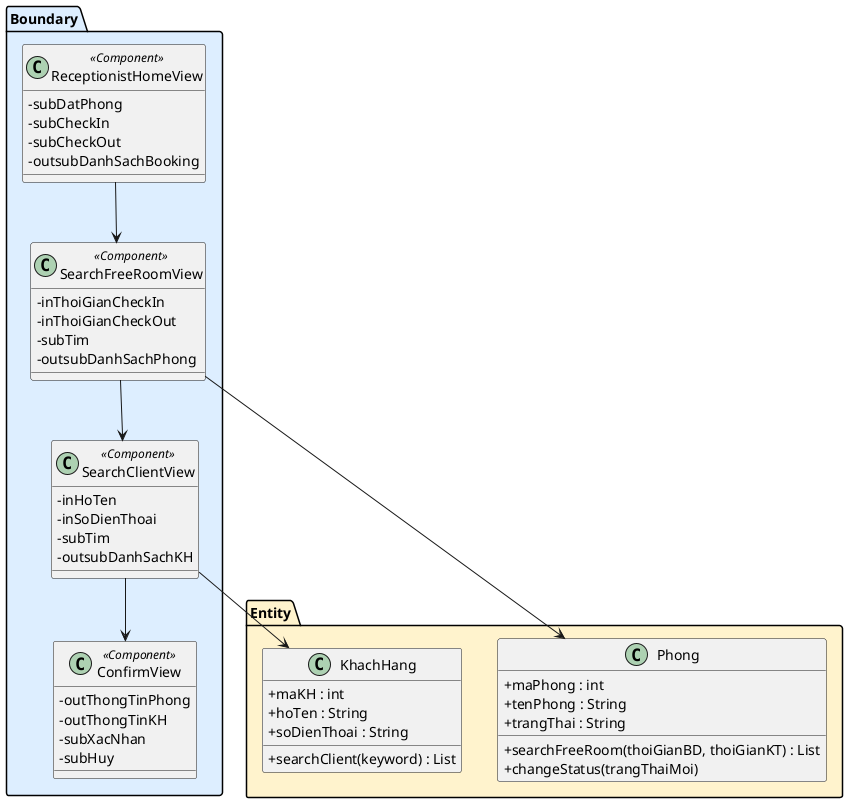
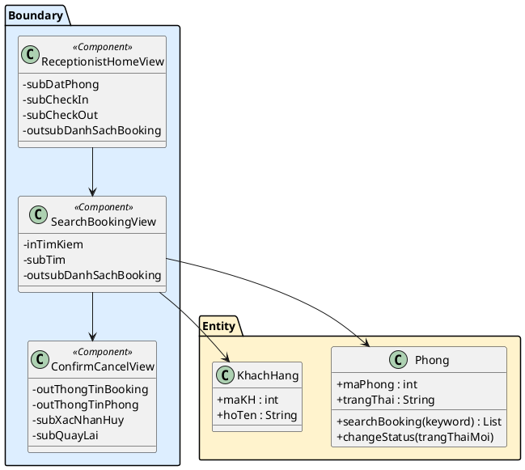
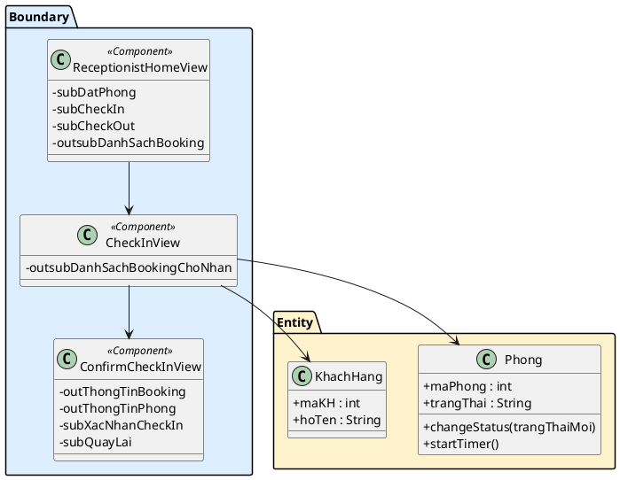
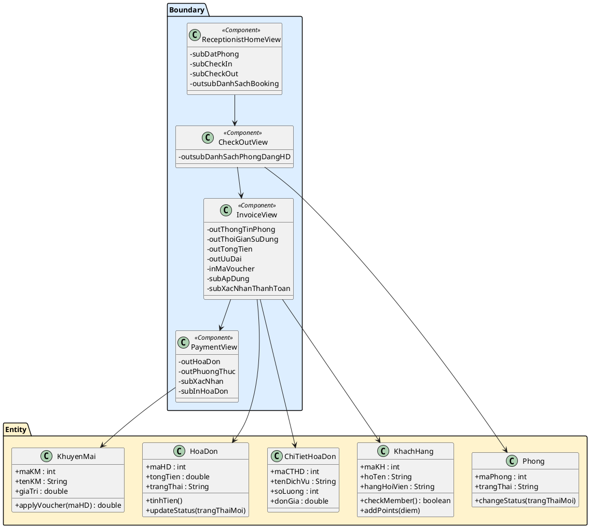
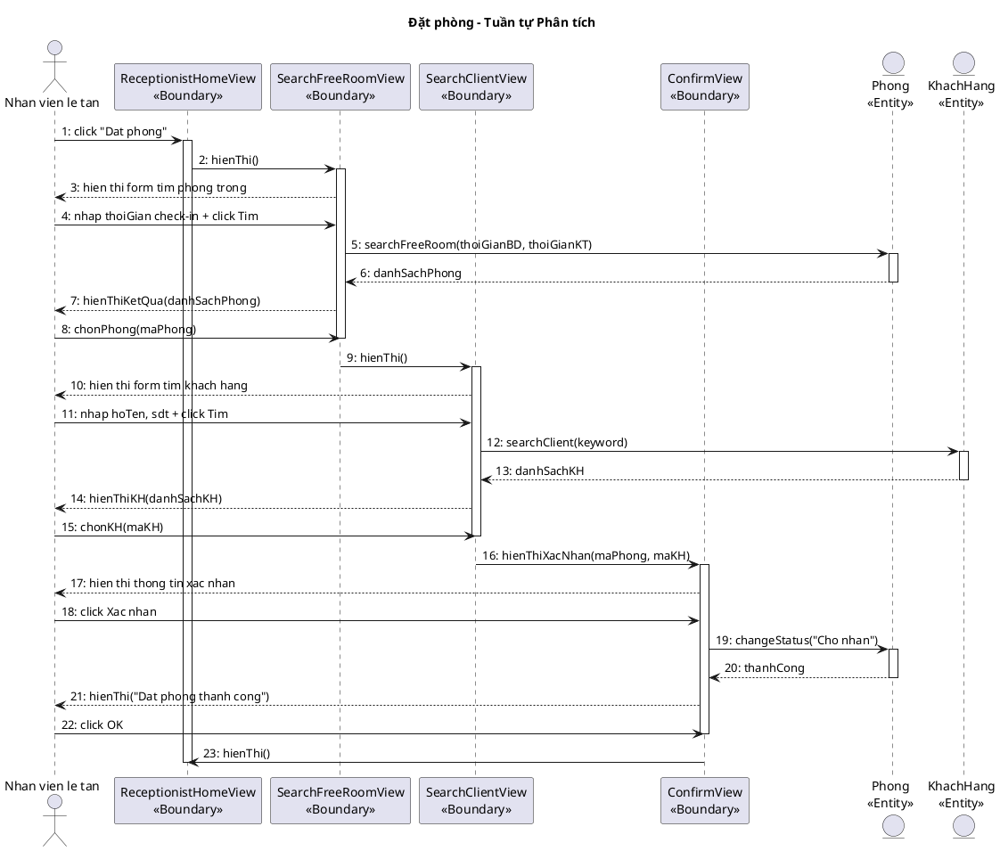
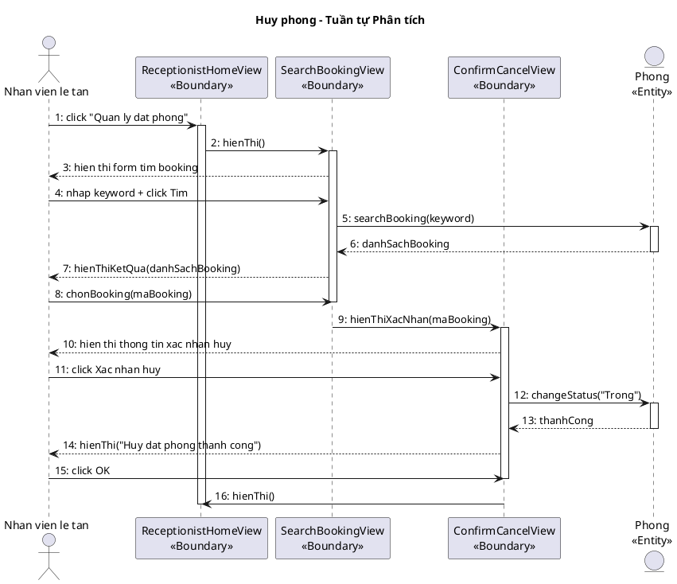
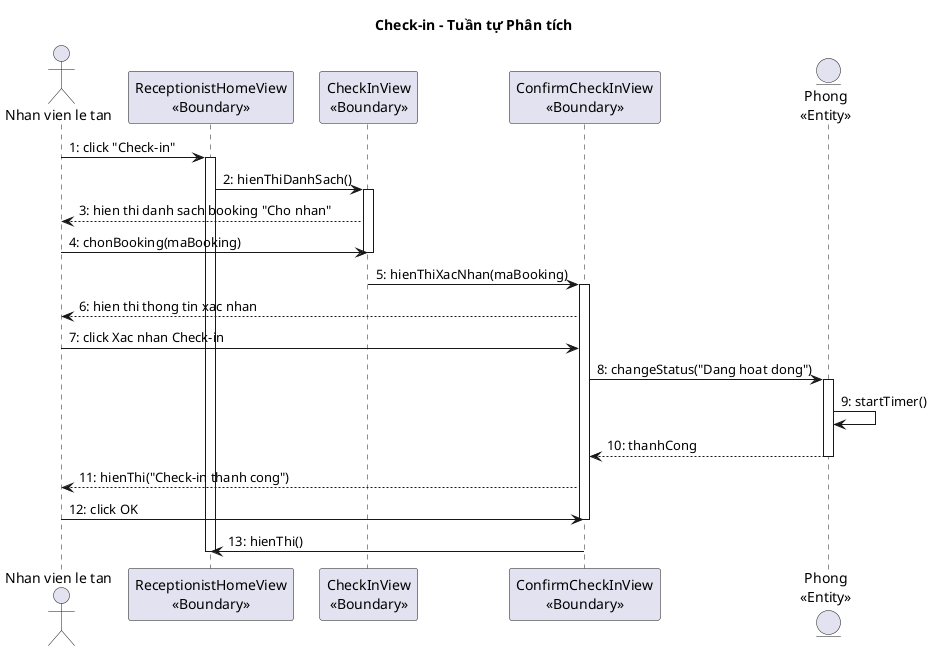
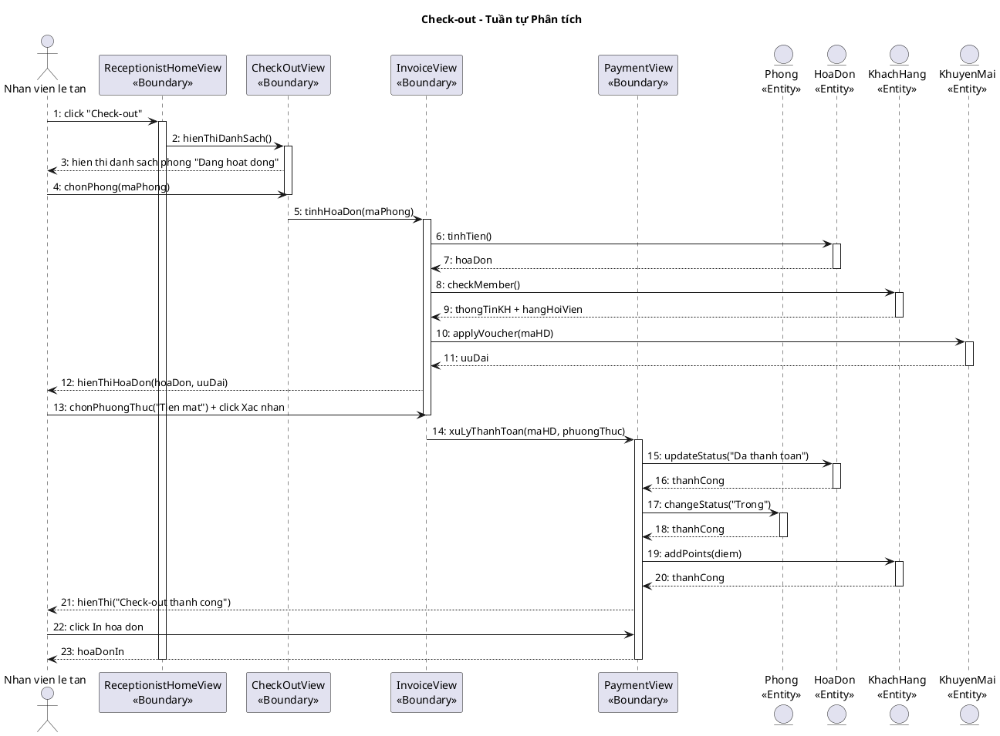

## 2.5. Biểu đồ phân tích chức năng

### a) Chức năng "Đặt phòng"

**Phân tích chi tiết chức năng "Đặt phòng" diễn ra như sau:**

Sau khi đăng nhập thành công, hiển thị giao diện chính của nhân viên lễ tân → Đề xuất lớp **ReceptionistHomeView**, có nút đặt phòng.

Khi ấn nút đặt phòng, hiển thị giao diện tìm phòng trống → Đề xuất lớp **SearchFreeRoomView**, có các ô nhập thời gian check-in, nút tìm, danh sách kết quả.

Nhân viên nhập thời gian check-in, và ấn nút tìm kiếm → Hệ thống cần tìm phòng trống theo thời gian yêu cầu → Cần chức năng `searchFreeRoom()` của đối tượng **Phong**.

Khi nhân viên ấn vào phòng trống, hệ thống hiện lên giao diện nhập thông tin khách hàng → Đề xuất lớp **SearchClientView**, có ô nhập tên, ô nhập số điện thoại, nút tìm kiếm.

Khi nhân viên ấn tìm kiếm → Hệ thống cần tìm thông tin khách hàng tương ứng trong cơ sở dữ liệu → Cần chức năng `searchClient()` của đối tượng **KhachHang**.

Khi nhân viên ấn vào dòng chứa thông tin khách hàng tương ứng, giao diện hiển thị xác nhận thông tin đặt phòng → Đề xuất lớp **ConfirmView**, có phần hiển thị thông tin đặt phòng, và nút xác nhận.

Nhân viên ấn nút xác nhận → Hệ thống chuyển trạng thái phòng thành "Chờ nhận" → Cần chức năng `changeStatus()` của đối tượng **Phong**.

Hệ thống lưu xong báo lại lớp ConfirmView, lớp ConfirmView báo thành công cho nhân viên → Nhân viên ấn nút OK → Hệ thống quay về lớp ReceptionistHomeView.

**Boundary:** ReceptionistHomeView, SearchFreeRoomView, SearchClientView, ConfirmView
**Entity:** Phong, KhachHang

### b) Chức năng "Huỷ phòng"

**Phân tích chi tiết chức năng "Huỷ phòng" diễn ra như sau:**

Nhân viên lễ tân click chức năng "Quản lý đặt phòng" trên giao diện ReceptionistHomeView → Đề xuất lớp **SearchBookingView**, có ô nhập tên/SĐT/mã booking, nút tìm kiếm, danh sách kết quả.

Nhân viên nhập thông tin tìm kiếm và ấn nút tìm kiếm → Hệ thống cần tìm booking theo thông tin yêu cầu → Cần chức năng `searchBooking()` của đối tượng **Phong**.

Khi nhân viên chọn booking cần hủy, giao diện hiển thị xác nhận hủy → Đề xuất lớp **ConfirmCancelView**, có phần hiển thị thông tin booking, và nút xác nhận hủy.

Nhân viên ấn xác nhận hủy → Hệ thống chuyển trạng thái phòng về "Trống" → Cần chức năng `changeStatus()` của đối tượng **Phong**.

Hệ thống lưu xong báo lại ConfirmCancelView, ConfirmCancelView báo thành công cho nhân viên → Nhân viên ấn OK → Hệ thống quay về ReceptionistHomeView.

**Boundary:** ReceptionistHomeView, SearchBookingView, ConfirmCancelView
**Entity:** Phong, KhachHang

### c) Chức năng "Check-in"

**Phân tích chi tiết chức năng "Check-in" diễn ra như sau:**

Nhân viên lễ tân click chức năng "Check-in" trên giao diện ReceptionistHomeView → Đề xuất lớp **CheckInView**, hiển thị danh sách booking trạng thái "Chờ nhận".

Nhân viên chọn booking cần check-in → Hệ thống hiển thị thông tin chi tiết → Đề xuất lớp **ConfirmCheckInView**, có phần hiển thị thông tin xác nhận, và nút xác nhận check-in.

Nhân viên ấn xác nhận → Hệ thống chuyển trạng thái phòng từ "Chờ nhận" sang "Đang hoạt động" → Cần chức năng `changeStatus()` của đối tượng **Phong**.

Hệ thống ghi nhận thời gian bắt đầu sử dụng → Cần chức năng `startTimer()` của đối tượng **Phong**.

Hệ thống lưu xong báo lại ConfirmCheckInView, ConfirmCheckInView báo thành công cho nhân viên → Nhân viên ấn OK → Hệ thống quay về ReceptionistHomeView.

**Boundary:** ReceptionistHomeView, CheckInView, ConfirmCheckInView
**Entity:** Phong, KhachHang

### d) Chức năng "Check-out"

**Phân tích chi tiết chức năng "Check-out" diễn ra như sau:**

Nhân viên lễ tân click chức năng "Check-out" trên giao diện ReceptionistHomeView → Đề xuất lớp **CheckOutView**, hiển thị danh sách phòng đang hoạt động.

Nhân viên chọn phòng cần check-out → Hệ thống tính toán hóa đơn → Đề xuất lớp **InvoiceView**, hiển thị thông tin hóa đơn, thời gian sử dụng, tổng tiền.

Hệ thống kiểm tra khách hàng là hội viên để áp dụng ưu đãi → Cần chức năng `checkMember()` của đối tượng **KhachHang**.

Hệ thống kiểm tra mã voucher (nếu có) → Cần chức năng `applyVoucher()` của đối tượng **KhuyenMai**.

Nhân viên chọn phương thức thanh toán và ấn xác nhận → Đề xuất lớp **PaymentView**, xử lý thanh toán.

Hệ thống cập nhật trạng thái hóa đơn "Đã thanh toán" → Cần chức năng `updateStatus()` của đối tượng **HoaDon**.

Hệ thống chuyển trạng thái phòng về "Trống" → Cần chức năng `changeStatus()` của đối tượng **Phong**.

Nếu khách là hội viên, hệ thống cộng điểm tích lũy → Cần chức năng `addPoints()` của đối tượng **KhachHang**.

**Boundary:** ReceptionistHomeView, CheckOutView, InvoiceView, PaymentView
**Entity:** Phong, HoaDon, ChiTietHoaDon, KhachHang, KhuyenMai

---

## 2.6. Biểu đồ tuần tự pha phân tích

### 4.1. Chức năng "Đặt phòng"

**Kịch bản phiên bản 2 – Đặt phòng**

1. Nhân viên lễ tân click chức năng "Đặt phòng" trên giao diện ReceptionistHomeView.
2. Lớp ReceptionistHomeView gọi sang lớp SearchFreeRoomView.
3. Lớp SearchFreeRoomView hiển thị cho nhân viên.
4. Nhân viên hỏi khách hàng thời gian đặt phòng.
5. Khách hàng trả lời.
6. Nhân viên nhập thời gian đặt phòng mong muốn của khách vào ô thời gian và ấn nút tìm kiếm.
7. Lớp SearchFreeRoomView gọi đến lớp Phong để xử lý thông tin.
8. Lớp Phong gọi hàm `searchFreeRoom()`.
9. Lớp Phong trả kết quả về cho SearchFreeRoomView.
10. Lớp SearchFreeRoomView hiển thị danh sách các phòng trống cho nhân viên.
11. Nhân viên ấn vào phòng trống.
12. Lớp SearchFreeRoomView gọi sang lớp SearchClientView.
13. Lớp SearchClientView hiển thị.
14. Nhân viên hỏi khách hàng về thông tin khách hàng.
15. Khách hàng trả lời.
16. Nhân viên nhập thông tin khách hàng và ấn nút tìm kiếm.
17. Lớp SearchClientView gọi đến lớp KhachHang.
18. Lớp KhachHang gọi hàm `searchClient()`.
19. Lớp KhachHang trả kết quả về cho lớp SearchClientView.
20. Lớp SearchClientView hiển thị thông tin khách hàng tương ứng.
21. Nhân viên chọn thông tin khách hàng tương ứng.
22. Lớp SearchClientView gọi sang lớp ConfirmView.
23. Lớp ConfirmView hiển thị.
24. Nhân viên ấn xác nhận.
25. Lớp ConfirmView gọi đến lớp Phong để xử lý.
26. Lớp Phong gọi hàm `changeStatus("Cho nhan")`.
27. Lớp Phong trả kết quả về lớp ConfirmView.
28. Lớp ConfirmView hiện thông báo.
29. Nhân viên ấn OK.
30. Lớp ConfirmView gọi lại về lớp ReceptionistHomeView.
31. Lớp ReceptionistHomeView hiển thị.

**Ngoại lệ:**
- Phòng trống không tìm thấy: SearchFreeRoomView hiển thị "Không có phòng trống trong khung giờ này."
- Khách hàng chưa có trong CSDL: SearchClientView hiển thị nút [Đăng ký nhanh]. Nhân viên nhập thông tin mới, hệ thống tạo khách hàng mới trước khi tiếp tục.

---

### 4.2. Chức năng "Huỷ phòng"

**Kịch bản phiên bản 2 – Huỷ phòng**

1. Nhân viên lễ tân click chức năng "Quản lý đặt phòng" trên giao diện ReceptionistHomeView.
2. Lớp ReceptionistHomeView gọi sang lớp SearchBookingView.
3. Lớp SearchBookingView hiển thị.
4. Nhân viên nhập thông tin tìm kiếm (tên khách, SĐT, hoặc mã booking).
5. Nhân viên ấn nút tìm kiếm.
6. Lớp SearchBookingView gọi đến lớp Phong.
7. Lớp Phong gọi hàm `searchBooking(keyword)`.
8. Lớp Phong trả kết quả về cho SearchBookingView.
9. Lớp SearchBookingView hiển thị danh sách booking tìm thấy.
10. Nhân viên chọn booking cần hủy.
11. Lớp SearchBookingView gọi sang lớp ConfirmCancelView.
12. Lớp ConfirmCancelView hiển thị xác nhận.
13. Nhân viên ấn [Đồng ý].
14. Lớp ConfirmCancelView gọi đến lớp Phong.
15. Lớp Phong gọi hàm `changeStatus("Trong")`.
16. Lớp Phong trả kết quả về.
17. Lớp ConfirmCancelView hiện thông báo thành công.
18. Nhân viên ấn OK.
19. Lớp ConfirmCancelView gọi về ReceptionistHomeView.

**Ngoại lệ:**
- Không tìm thấy booking: SearchBookingView hiển thị "Không tìm thấy booking phù hợp."
- Booking đã quá thời gian hủy: ConfirmCancelView hiển thị "Booking đã quá thời gian hủy."

---

### 4.3. Chức năng "Check-in"

**Kịch bản phiên bản 2 – Check-in**

1. Nhân viên lễ tân click chức năng "Check-in" trên giao diện chính.
2. Lớp ReceptionistHomeView gọi sang lớp CheckInView.
3. Lớp CheckInView hiển thị danh sách booking "Chờ nhận".
4. Nhân viên chọn booking cần check-in.
5. Lớp CheckInView gọi sang lớp ConfirmCheckInView.
6. Lớp ConfirmCheckInView hiển thị thông tin xác nhận.
7. Nhân viên ấn [Xác nhận Check-in].
8. Lớp ConfirmCheckInView gọi đến lớp Phong.
9. Lớp Phong gọi hàm `changeStatus("Dang hoat dong")`.
10. Lớp Phong gọi hàm `startTimer()`.
11. Lớp Phong trả kết quả về.
12. Lớp ConfirmCheckInView hiện thông báo thành công.
13. Nhân viên ấn OK.
14. Lớp ConfirmCheckInView gọi về ReceptionistHomeView.

**Ngoại lệ:**
- Phòng đang dọn dẹp: Phong trả về lỗi. CheckInView hiển thị "Phòng đang dọn dẹp, vui lòng chờ."
- Khách hàng không đến: Nhân viên chọn hủy booking thay vì check-in.

---

### 4.4. Chức năng "Check-out"

**Kịch bản phiên bản 2 – Check-out**

1. Nhân viên lễ tân click chức năng "Check-out" trên giao diện chính.
2. Lớp ReceptionistHomeView gọi sang lớp CheckOutView.
3. Lớp CheckOutView hiển thị danh sách phòng đang hoạt động.
4. Nhân viên chọn phòng cần check-out.
5. Lớp CheckOutView gọi sang lớp InvoiceView.
6. Lớp InvoiceView gọi hàm `tinhTien()` trên lớp HoaDon.
7. Lớp HoaDon trả kết quả hóa đơn về InvoiceView.
8. InvoiceView gọi lớp KhachHang `checkMember()` để lấy thông tin khách.
9. InvoiceView gọi lớp KhuyenMai `applyVoucher()` để kiểm tra ưu đãi.
10. InvoiceView hiển thị hóa đơn cho nhân viên.
11. Nhân viên chọn phương thức thanh toán "Tiền mặt".
12. Nhân viên ấn [Xác nhận thanh toán].
13. InvoiceView gọi lớp Payment.
14. Payment gọi hàm `updateStatus("Da thanh toan")` trên HoaDon.
15. Payment gọi hàm `changeStatus("Trong")` trên Phong.
16. Payment gọi hàm `addPoints(diem)` trên KhachHang.
17. Payment hiện thông báo thành công.
18. Nhân viên ấn [In hóa đơn].

**Ngoại lệ:**
- Voucher không hợp lệ: InvoiceView hiển thị "Mã voucher không hợp lệ hoặc đã hết hạn."
- Thanh toán chuyển khoản thất bại: PaymentView hiển thị lỗi, yêu cầu chọn lại phương thức.
