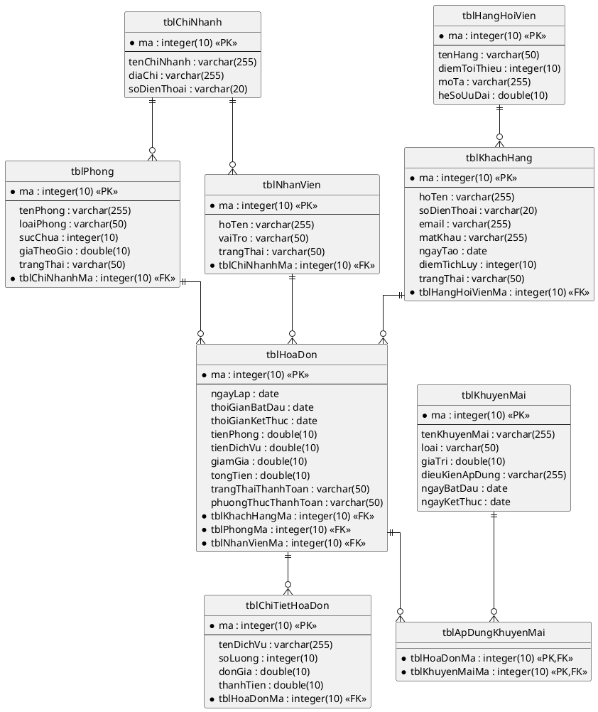

## Thiết kế CSDL

### Bước 1 – Tạo bảng cho mỗi lớp thực thể

| Lớp thực thể | Tên bảng |
|--------------|----------|
| KhachHang | tblKhachHang |
| ChiNhanh | tblChiNhanh |
| Phong | tblPhong |
| NhanVien | tblNhanVien |
| HoaDon | tblHoaDon |
| ChiTietHoaDon | tblChiTietHoaDon |
| HangHoiVien | tblHangHoiVien |
| KhuyenMai | tblKhuyenMai |

### Bước 2 – Chuyển kiểu dữ liệu

| Kiểu Java | Kiểu SQL |
|-----------|----------|
| int | integer(10) |
| String | varchar(255) |
| double | double(10) |
| Date | date |

### Bước 3 – Xử lý quan hệ cardinality

- ChiNhanh – Phong (1-n): Giữ riêng, Phong có FK `tblChiNhanhMa`
- ChiNhanh – NhanVien (1-n): Giữ riêng, NhanVien có FK `tblChiNhanhMa`
- KhachHang – HangHoiVien (n-1): Giữ riêng, KhachHang có FK `tblHangHoiVienMa`
- HoaDon – ChiTietHoaDon (1-n): Giữ riêng, ChiTietHoaDon có FK `tblHoaDonMa`
- HoaDon – KhuyenMai (n-n): Tạo bảng trung gian `tblApDungKhuyenMai`
- KhachHang – HoaDon (1-n): HoaDon có FK `tblKhachHangMa`
- Phong – HoaDon (1-n): HoaDon có FK `tblPhongMa`
- NhanVien – HoaDon (1-n): HoaDon có FK `tblNhanVienMa`

### Bước 4 – Bổ sung PK/FK

- PK: thuộc tính `id` → `ma : integer(10) <<PK>>`
- FK: đặt tên `tbl[TenBangCha]Ma`

### Bước 5 – Loại bỏ thuộc tính dư thừa

- Bỏ thuộc tính kiểu đối tượng (đã chuyển thành FK)
- Bỏ thuộc tính dẫn xuất (nếu có)

### Biểu đồ ERD

<!-- PLACEHOLDER: Chèn ảnh ERD tại đây -->
<!-- File: output/diagrams/booking_erd.png -->

