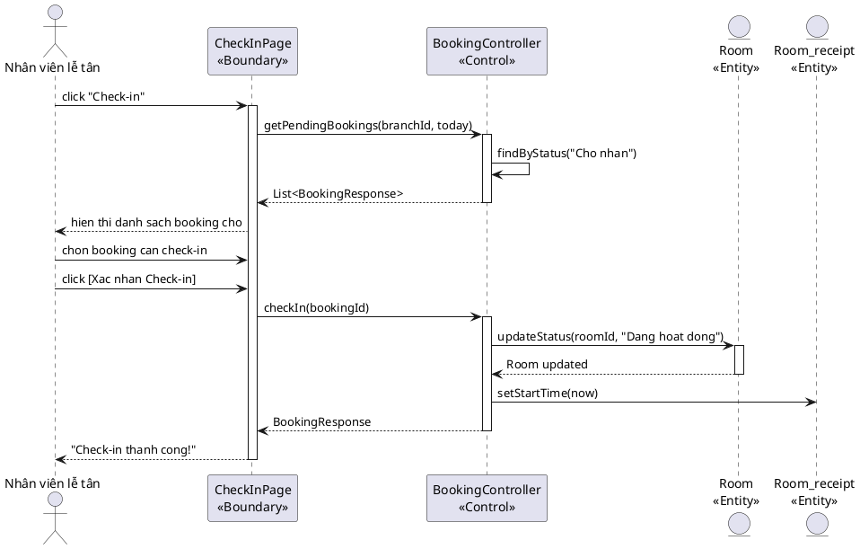
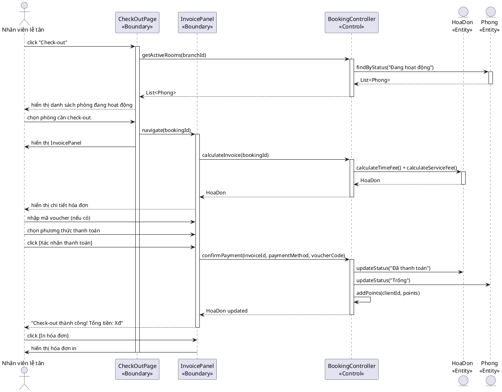
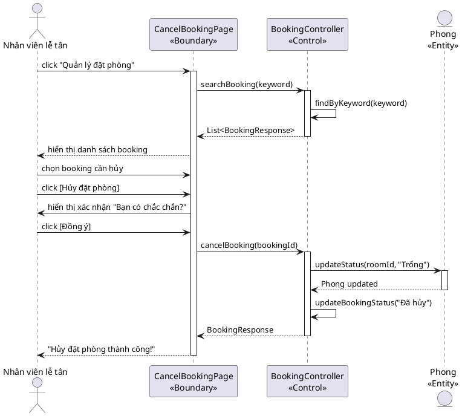

## 4.1. Chức năng "Đặt phòng" — Thiết kế

### Biểu đồ tuần tự

<!-- PLACEHOLDER: Chèn ảnh tuần tự Đặt phòng tại đây -->
<!-- File: output/diagrams/booking_seq_datphong.png -->

```plantuml
@startuml
left to right direction
actor "Nhân viên lễ tân" as NV
participant "ReceptionistHomePage\n<<Boundary>>" as Home
participant "SearchFreeRoomForm\n<<Boundary>>" as SearchRoom
participant "BookingController\n<<Control>>" as Ctrl
participant "SearchClientForm\n<<Boundary>>" as SearchClient
participant "ConfirmBookingModal\n<<Boundary>>" as Confirm
entity "Room\n<<Entity>>" as Room
entity "Customer\n<<Entity>>" as Cust
entity "Room_receipt\n<<Entity>>" as RR

NV -> Home: click "Dat phong"
activate Home
Home -> SearchRoom: navigate()
activate SearchRoom
Home -> NV: hien thi SearchFreeRoomForm

NV -> SearchRoom: nhap startTime, endTime, branchId
NV -> SearchRoom: click [Tim phong trong]
SearchRoom -> Ctrl: searchFreeRoom(startTime, endTime, branchId)
activate Ctrl
Ctrl -> Room: findByTimeAndBranch(startTime, endTime, branchId)
activate Room
Room --> Ctrl: List<Room>
deactivate Room
Ctrl --> SearchRoom: List<Room>
deactivate Ctrl
SearchRoom --> NV: hien thi danh sach phong trong

NV -> SearchRoom: chon phong (roomId)
SearchRoom -> SearchClient: navigate(roomId)
activate SearchClient
SearchRoom -> NV: hien thi SearchClientForm

NV -> SearchClient: nhap keyword (ten/SDT)
NV -> SearchClient: click [Tim kiem]
SearchClient -> Ctrl: searchClient(keyword)
activate Ctrl
Ctrl -> Cust: findByKeyword(keyword)
activate Cust
Cust --> Ctrl: List<Customer>
deactivate Cust
Ctrl --> SearchClient: List<Customer>
deactivate Ctrl
SearchClient --> NV: hien thi danh sach khach hang

NV -> SearchClient: chon khach hang (clientId)
SearchClient -> Confirm: navigate(roomId, clientId, timeRange)
activate Confirm
SearchClient -> NV: hien thi ConfirmBookingModal

NV -> Confirm: click [Xac nhan dat phong]
Confirm -> Ctrl: createBooking(clientId, roomId, startTime, endTime, staffId)
activate Ctrl
Ctrl -> RR: updateStatus(roomId, "Cho nhan")
activate RR
RR --> Ctrl: Room_receipt updated
deactivate RR
Ctrl -> Ctrl: saveBooking()
Ctrl --> Confirm: BookingResponse
deactivate Ctrl
Confirm --> NV: hien thi "Dat phong thanh cong!"
deactivate Confirm

NV -> Confirm: click [OK]
Confirm -> Home: navigate()
deactivate SearchRoom
deactivate SearchClient
@enduml
```

### Kịch bản phiên bản 3

**Kịch bản phiên bản 3 - Đặt phòng**

1. Nhân viên lễ tân click chức năng "Đặt phòng" trên giao diện ReceptionistHomePage.
2. Phương thức navigate() của lớp SearchFreeRoomForm được gọi, hiển thị form tìm phòng trống.
3. Nhân viên nhập thời gian bắt đầu, thời gian kết thúc và chọn chi nhánh.
4. Nhân viên click nút [Tìm phòng trống].
5. Phương thức searchFreeRoom(startTime: Date, endTime: Date, branchId: int) của lớp BookingController được gọi.
6. BookingController truy vấn danh sách phòng trống từ Entity Room.
7. SearchFreeRoomForm hiển thị danh sách phòng trống cho nhân viên.
8. Nhân viên chọn phòng mong muốn.
9. SearchFreeRoomForm chuyển sang SearchClientForm với roomId đã chọn.
10. Nhân viên nhập thông tin khách hàng (tên hoặc SĐT) và click [Tìm kiếm].
11. Phương thức searchClient(keyword: String) của lớp BookingController được gọi.
12. BookingController truy vấn danh sách khách hàng từ Entity Customer.
13. SearchClientForm hiển thị danh sách khách hàng khớp.
14. Nhân viên chọn khách hàng tương ứng.
15. SearchClientForm chuyển sang ConfirmBookingModal với đầy đủ thông tin.
16. Nhân viên click [Xác nhận đặt phòng].
17. Phương thức createBooking(clientId: int, roomId: int, startTime: Date, endTime: Date, staffId: int) của lớp BookingController được gọi.
18. BookingController cập nhật trạng thái phòng thành "Chờ nhận" và lưu booking vào CSDL.
19. ConfirmBookingModal hiển thị thông báo "Đặt phòng thành công!".
20. Nhân viên click [OK], hệ thống quay về ReceptionistHomePage.

**Ngoại lệ:**
- **Phòng trống không tìm thấy:** BookingController trả về danh sách rỗng. SearchFreeRoomForm hiển thị "Không có phòng trống trong khung giờ này."
- **Khách hàng chưa có trong CSDL:** SearchClientForm hiển thị nút [Đăng ký nhanh]. Nhân viên nhập thông tin mới, hệ thống tạo khách hàng mới trước khi tiếp tục.

---

## 4.2. Chức năng "Check-in" — Thiết kế

### Biểu đồ tuần tự

<!-- PLACEHOLDER: Chèn ảnh tuần tự Check-in tại đây -->
<!-- File: output/diagrams/booking_seq_checkin.png -->



### Kịch bản phiên bản 3

**Kịch bản phiên bản 3 - Check-in**

1. Nhân viên lễ tân click chức năng "Check-in" trên giao diện chính.
2. Phương thức getPendingBookings(branchId: int, date: Date) của lớp BookingController được gọi.
3. BookingController truy vấn danh sách booking có trạng thái "Chờ nhận" hôm nay.
4. CheckInPage hiển thị danh sách booking chờ nhận phòng.
5. Nhân viên chọn booking cần check-in.
6. Nhân viên click [Xác nhận Check-in].
7. Phương thức checkIn(bookingId: int) của lớp BookingController được gọi.
8. BookingController cập nhật trạng thái phòng từ "Chờ nhận" sang "Đang hoạt động" và ghi nhận thời gian bắt đầu.
9. CheckInPage hiển thị "Check-in thành công! Phòng [tên phòng] đã sẵn sàng."

**Ngoại lệ:**
- **Phòng đang dọn dẹp:** BookingController kiểm tra trạng thái phòng, trả về lỗi. CheckInPage hiển thị "Phòng đang dọn dẹp, vui lòng chờ."
- **Khách hàng không đến:** Nhân viên chọn hủy booking thay vì check-in. BookingController chuyển trạng thái booking sang "Đã hủy".

---

## 4.3. Chức năng "Check-out" — Thiết kế

### Biểu đồ tuần tự

<!-- PLACEHOLDER: Chèn ảnh tuần tự Check-out tại đây -->
<!-- File: output/diagrams/booking_seq_checkout.png -->



### Kịch bản phiên bản 3

**Kịch bản phiên bản 3 - Check-out**

1. Nhân viên lễ tân click chức năng "Check-out" trên giao diện chính.
2. Phương thức getActiveRooms(branchId: int) của lớp BookingController được gọi.
3. BookingController truy vấn danh sách phòng trạng thái "Đang hoạt động".
4. CheckOutPage hiển thị danh sách phòng đang sử dụng.
5. Nhân viên chọn phòng cần check-out.
6. CheckOutPage chuyển sang InvoicePanel với bookingId đã chọn.
7. Phương thức calculateInvoice(bookingId: int) của lớp BookingController được gọi.
8. BookingController tính tiền phòng (thời gian × đơn giá) + tổng tiền dịch vụ từ ChiTietHoaDon.
9. InvoicePanel hiển thị chi tiết hóa đơn với tổng tiền.
10. Nhân viên nhập mã voucher và chọn phương thức thanh toán (tiền mặt/chuyển khoản).
11. Nhân viên click [Xác nhận thanh toán].
12. Phương thức confirmPayment(invoiceId: int, paymentMethod: String, voucherCode: String) của lớp BookingController được gọi.
13. BookingController cập nhật trạng thái hóa đơn "Đã thanh toán", chuyển phòng về "Trống", cộng điểm hội viên.
14. InvoicePanel hiển thị "Check-out thành công! Tổng tiền: [X]đ."
15. Nhân viên click [In hóa đơn].

**Ngoại lệ:**
- **Voucher không hợp lệ:** BookingController trả về lỗi. InvoicePanel hiển thị "Mã voucher không hợp lệ hoặc đã hết hạn."
- **Thanh toán chuyển khoản thất bại:** InvoicePanel hiển thị lỗi, yêu cầu chọn lại phương thức.

---

## 4.4. Chức năng "Huỷ phòng" — Thiết kế

### Biểu đồ tuần tự

<!-- PLACEHOLDER: Chèn ảnh tuần tự Huỷ phòng tại đây -->
<!-- File: output/diagrams/booking_seq_huyphong.png -->



### Kịch bản phiên bản 3

**Kịch bản phiên bản 3 - Huỷ phòng**

1. Nhân viên lễ tân click "Quản lý đặt phòng" trên giao diện chính.
2. Nhân viên nhập thông tin tìm kiếm (tên khách, SĐT, hoặc mã booking).
3. Phương thức searchBooking(keyword: String) của lớp BookingController được gọi.
4. BookingController truy vấn danh sách booking khớp từ CSDL.
5. CancelBookingPage hiển thị danh sách booking tìm thấy.
6. Nhân viên chọn booking cần hủy.
7. Nhân viên click [Hủy đặt phòng].
8. CancelBookingPage hiển thị xác nhận "Bạn có chắc chắn muốn hủy booking này?".
9. Nhân viên click [Đồng ý].
10. Phương thức cancelBooking(bookingId: int) của lớp BookingController được gọi.
11. BookingController cập nhật trạng thái booking sang "Đã hủy" và chuyển phòng về "Trống".
12. CancelBookingPage hiển thị "Hủy đặt phòng thành công."

**Ngoại lệ:**
- **Không tìm thấy booking:** BookingController trả về danh sách rỗng. CancelBookingPage hiển thị "Không tìm thấy booking phù hợp."
- **Booking đã quá thời gian hủy:** BookingController kiểm tra thời gian, trả về lỗi. CancelBookingPage hiển thị "Booking đã quá thời gian hủy."
